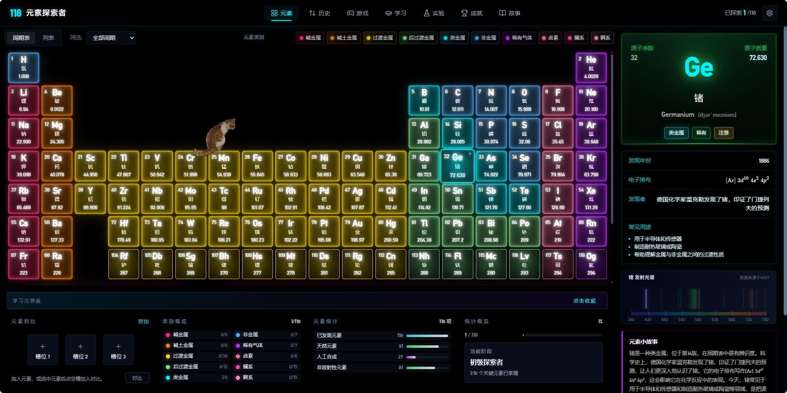
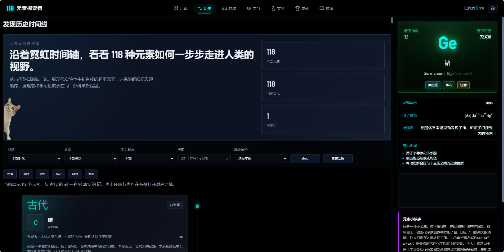
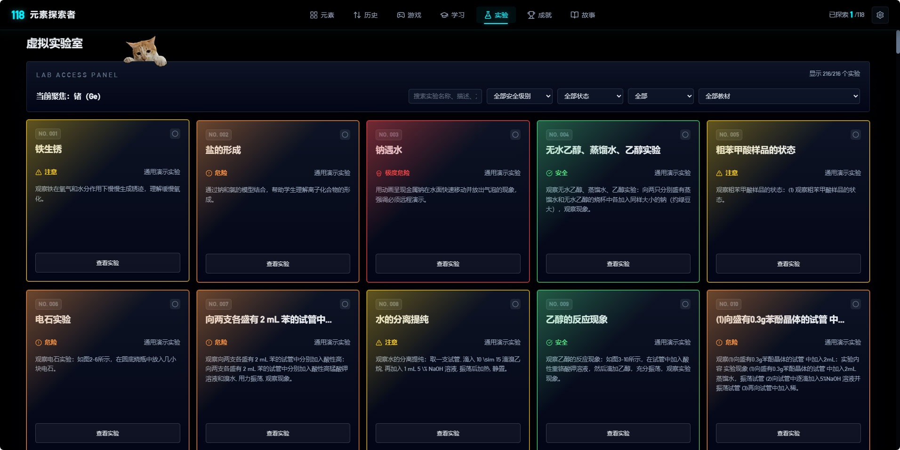
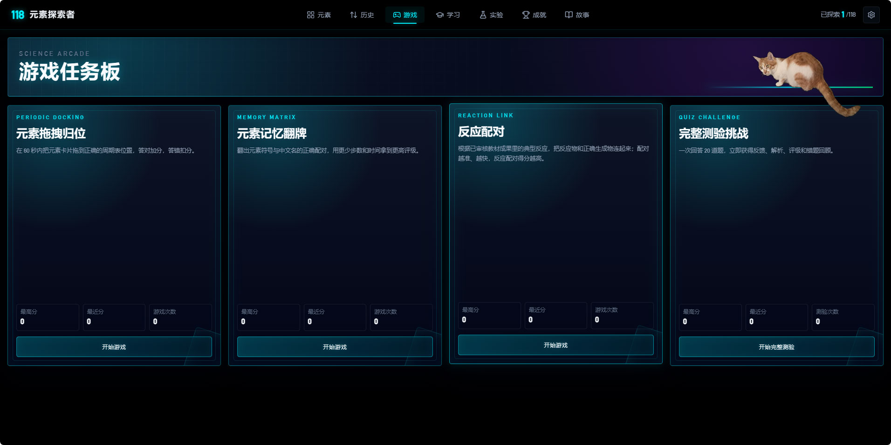

# Element Explorer Kids / 元素探索者

一个面向初中和高中学生的化学课程学习与复习应用。它把 118 个元素周期表、教材知识、实验观察、化学史、互动测验、小游戏、虚拟实验室、成就系统和学习进度放在同一个浏览器应用里，帮助学生把零散知识联系起来，加深对化学教材内容的理解。

本项目是一个 Vite 原生 JavaScript 单页应用，界面以中文为主，英文元素名作为学习辅助。README 前半部分介绍学生学习价值，后半部分保留仓库维护、开发运行和验证所需的信息。

## 截图

README 中使用的截图统一放在 `docs/images/README/`，路径使用相对路径，便于 GitHub、代码托管平台和本地 Markdown 预览直接显示。当前 README 使用用户上传的四张 JPG 截图，分别代表首页、发现历史时间线、虚拟实验室和游戏中心四个模块。









如果后续要加入更多截图，建议按功能命名，例如：

```text
docs/images/README/home.jpg
docs/images/README/lishi.jpg
docs/images/README/lab.jpg
docs/images/README/game.jpg
```

Markdown 引用示例：

```markdown

```

请不要把 README 截图散放在仓库根目录。根目录可以保留临时或历史截图，但正式文档中引用的图片建议复制到 `docs/images/README/` 后再使用。

## 主要功能

* 元素周期表探索：展示完整 118 个元素，支持元素分类、周期筛选、搜索、重置筛选、分类图例和已学习标记。
* 元素详情面板：点击元素后展示中文名、英文名、符号、原子序数、原子量、电子排布、物理状态、电负性、发现信息、用途、安全提示、趣味事实和生活例子。
* 视觉与动效：使用 Three.js 呈现星空粒子背景、能量粒子和元素电子轨道模型，使用 GSAP 处理页面进入、卡片交互、面板切换和反馈动画。
* 元素对比：支持把元素加入对比列表，查看原子量、电负性、状态、类别、用途和危险性等差异。
* 发现历史时间线：按年份理解元素发现过程，结合关键节点和科学家故事学习化学史。
* 小测验与游戏中心：包含元素知识问答、拖拽归位、记忆配对、反应匹配、元素收集等互动学习玩法。
* 虚拟实验室：通过实验记录、反应模拟、安全说明和结果卡片，帮助学生理解化学实验的观察过程。
* 成就与学习进度：使用本地学习状态记录已学习元素、收集元素、实验完成情况、测验成绩和已解锁成就。
* 教材与学习内容：结合教材资产、课程标签、学习路径和相关校验脚本，帮助学生把教材章节、知识点和复习路径连接起来。

## 技术栈

* Vite 6
* 原生 HTML、CSS、JavaScript、ES Modules
* Three.js
* GSAP
* KaTeX
* Lucide icons
* Lottie Web
* localStorage
* Playwright
* Node.js 数据校验脚本

## 快速开始

安装依赖：

```bash
npm install
```

启动开发服务器：

```bash
npm run dev
```

默认开发地址由 Vite 提供，通常是 `http://localhost:5173/`。

构建生产版本：

```bash
npm run build
```

预览生产构建：

```bash
npm run preview
```

默认预览地址通常是 `http://localhost:4173/`。

## 常用脚本与验证

```bash
npm run dev
npm run build
npm run preview
npm run validate:all:safe
npx playwright test
```

脚本说明：

| 命令 | 作用 |
| --- | --- |
| `npm run dev` | 启动 Vite 开发服务器 |
| `npm run build` | 构建生产版本 |
| `npm run preview` | 本地预览生产构建 |
| `npm run validate:elements` | 校验 118 个元素数据的唯一性和必填字段 |
| `npm run validate:supporting` | 校验测验、反应、成就、学习路径等辅助数据的交叉引用 |
| `npm run validate:curriculum` | 校验课程标签、难度区间和前置关系 |
| `npm run validate:textbook-assets` | 校验教材图片、清单路径和运行时引用 |
| `npm run validate:lab-experiments` | 校验虚拟实验室记录、解锁要求和安全说明 |
| `npm run validate:all:safe` | 串行运行主要数据校验并执行构建 |
| `npx playwright test` | 运行端到端测试，测试会使用 Vite preview 服务 |

在修改数据、学习状态、UI 交互或可见功能后，至少运行相关校验和 `npm run build`。涉及浏览器行为时，运行相关 Playwright 测试。

## 项目结构

```text
.
├── index.html
├── package.json
├── playwright.config.ts
├── docs/
│   └── images/
│       └── README/
├── scripts/
├── src/
│   ├── data/
│   ├── images/
│   ├── lab-sim/
│   ├── modules/
│   ├── styles/
│   ├── three/
│   └── main.js
└── tests/
    ├── achievements/
    ├── content/
    ├── fixtures/
    ├── lab-sim/
    ├── setup/
    ├── shell/
    └── ui/
```

目录说明：

* `index.html`：应用入口 HTML，加载 `/src/main.js`。
* `src/main.js`：初始化全局只读检查状态、Three.js 场景、粒子、路由和各业务模块。
* `src/data/`：元素、测验、反应、成就、学习路径、实验、光谱线、课程和教材资产等核心数据。
* `src/modules/`：路由、周期表渲染、详情面板、筛选、搜索、对比、时间线、测验、游戏、成就、进度、故事模式、实验和存储等模块。
* `src/three/`：Three.js 场景、粒子、电子模型和元素能量效果。
* `src/styles/`：基础布局、周期表、面板、游戏、实验室、成就、化学记号和响应式样式。
* `scripts/`：数据校验脚本和教材处理流程。
* `tests/`：Playwright 端到端测试、夹具和全局启动/清理脚本。
* `docs/images/README/`：README 正式引用的截图位置。

## 数据与学习状态说明

应用数据主要通过 `src/data/index.js` 汇总消费。元素、成就、学习路径、虚拟实验、教材资产等数据都有对应校验脚本，修改这些内容后应优先运行相关验证命令。

学习状态保存在浏览器 localStorage 中，核心状态包括：

* `learnedElements`：详情面板首次完整打开时记录已学习元素。
* `collectedElements`：自动镜像已学习元素。
* `completedExperiments`：实验结果卡片成功渲染后记录完成实验。
* `quizScores`：每次完成测验后追加成绩、总题数、百分比、来源元素和时间戳。
* `unlockedAchievements`：由统一事件处理逻辑推导，不应散落在 UI 代码中手动维护。

运行时可通过 `window.appState` 做只读检查。不要直接修改它，状态变更应通过存储模块提供的 API 完成。

## README 截图放置约定

仓库级 README 使用的图片统一放在：

```text
docs/images/README/
```

推荐规则：

* 文件名使用英文小写和短横线，例如 `home.jpg`、`lishi.jpg`、`lab.jpg`、`game.jpg`。
* README 中使用相对路径，例如 `docs/images/README/home.jpg`。
* 不引用本地绝对路径，不引用临时测试输出目录，不引用 `.sisyphus/evidence/` 或 `.playwright-mcp/` 下的过程截图。
* 如果截图来自仓库根目录，先复制到 `docs/images/README/`，确认链接能打开后再写入 README。
* 不删除历史截图，除非后续维护任务明确要求清理。

## 开发注意事项

* 本项目是中文优先的初高中化学课程学习与复习应用，新增文案应优先服务学生理解教材内容，英文名称只作为辅助信息。
* 修改 `src/data/achievementsData.json` 时要格外小心，它是运行时成就数据源，更新应采用小范围补丁，不要整文件覆盖。
* 修改数据内容后运行对应验证脚本。修改跨模块逻辑后运行 `npm run validate:all:safe` 或相关 Playwright 测试。
* 不要把 `node_modules/`、`dist/`、测试过程截图或临时日志当作源文件维护。
* 贡献前建议先确认 `npm run build` 通过。

