# 化学

选择性必修 1 化学反应原理 

# 引言

我们已经学习过很多化学反应，也做过不少化学实验，对于物质及其化学变化有了基本的认识。在此基础上学习《化学反应原理》，将主要讨论一些关于化学反应的普遍性问题。例如，怎样认识和理解化学反应中的能量变化？为什么化学反应有的快而有的慢？反应条件如何影响反应的速率和历程？为什么反应产物有的产率高而有的产率低？反应条件如何影响反应的方向和限度？等等。物质发生化学变化时，反应物分子中的化学键断裂和生成物分子中的化学键形成总是伴随着能量变化（如图1）。因此，化学反应原理的研究始终是与物质变化、能量变化相联系的。 

不知你是否想过：一个看似简单的化学反应，其实际发生的过程并不简单，如氢气与氧气反应生成水。在常温、常压下，氢气可以在氧气中安静地燃烧；点燃氢气和氧气的混合物会发生爆炸；氢氧燃料电池可用作动力电源（如图2）；将氢气和氧气混合放在干燥、洁净的容器中，很多年也看不到明显变化。为什么氢气与氧气反应会出现如此大的差别？氢气与氧气的反应到底经过了怎样的历程？为了回答这些问题，人们不仅进行了大量实验来研究温度、压强和氢气的体积分数等因素对氢气与氧气反应的影响，还进一步深入到分子、原子等微观世界寻找答案。反应历程研究表明，氢气与氧气的反应属于复杂反应。复杂反应也是有规律可循的。像研究氢气与氧气反应那样，从宏观到微观、从定性到定量、从静态到动态对化学反应进行多角度、多层次的实验与理论探讨，将会使我们更深入地理解化学反应的过程和本质，也可以更有效地预测和控制化学反应的进行。这正是化学的精髓所在，也是化学的 

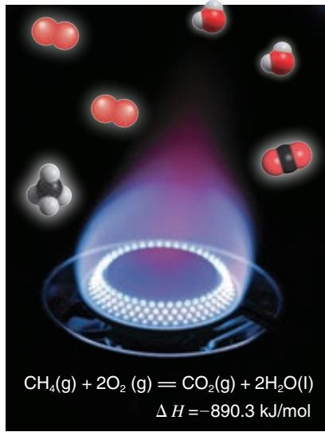

图1 天然气已经成为居民的生活用气

图2 氢氧燃料电池汽车

图3 大多数无人机的续航动力来自化学电源

图4水母像一顶圆伞在海水中漂游

魅力所在。在学习时常会用到像“热化学方程式”“活化能”“化学平衡”“原电池”和“电解池”这样的概念、模型，它们都是学习和研究化学反应原理的基础。如果你有兴趣在这一领域继续探索，就会发现那些用来描述化学反应过程的数学模型，其基础仍然是这些概念、模型，只不过后者更为精确、更为细致罢了。 

化学反应与生产、生活及很多研究领域存在着广泛的联系，反应原理的研究也在与其他科学研究的相互促进中发展着。例如，化学过程总是包含或伴有物理过程。像化学反应伴随着吸热、放热和发光等现象，离子反应前后电解质溶液的导电性发生变化，一定条件下化学能与电能的相互转化（如图3），等等，这些都为我们从物理现象和化学现象的联系入手研究化学反应原理创造了条件。再如，生命科学将生物体维持生命活动的各种化学变化称为代谢。代谢中的物质转化和能量转化是生命活动的基础。如图4所示，与其他生物一样，水母细胞中绝大多数需要能量的生命活动都是由ATP直接提供能量的。因此，要认识生物体内的代谢过程，也必须了解和运用化学反应原理的知识。 

尽管人们在生产、生活和科学研究中积累了大量关于化学反应原理的经验和知识，但理论的发展还远远不能满足实际应用的迫切需要。让我们从学习《化学反应原理》开始一起努力吧。 

# 第一章

# 化学反应的热效应

$\bullet$ 反应热 

反应热的计算 

化学反应的过程，既是物质的转化过程，也是化学能与热、电等其他形式能量的转化过程。化学反应既遵守质量守恒定律，也遵守能量守恒定律。化学反应中的能量变化是以物质变化为基础的，能量变化的多少与参加反应的物质种类和多少密切相关。 

数以千万计物质的合成，极大地改善了人类的生活。同样，化学反应所提供的能量大大促进了社会的发展。与研究化学反应中的物质变化一样，研究化学反应中的能量变化同样具有重要意义。 

# 第一节反应热

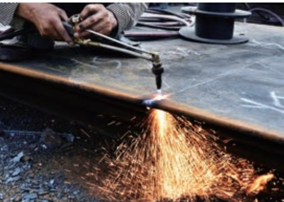

图1-1 乙炔与氧气反应放出的热量用于切割金属

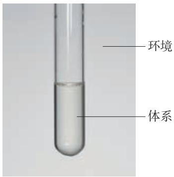

图1-2 体系与环境示意图

体系 system 

环境 surrounding 

反应热 heat of reaction 

热量的释放或吸收是化学反应中能量变化的常见形式。例如，燃料的燃烧、酸与碱的中和反应等会放出热量，属于放热反应。而有些反应，如工业上煅烧石灰石的反应等会吸收热量，属于吸热反应。化学反应过程中释放或吸收的热量在生活、生产和科学研究中具有广泛的应用（如图1-1）。那么，在实际应用中，人们如何定量地描述化学反应过程中释放或吸收的热量呢？ 

# 一、反应热 焓变

# 1. 反应热及其测定

在研究反应热时，需要明确体系和环境。下面以研究盐酸与NaOH溶液的反应为例，对此作一些说明。 

如图1-2所示，我们将试管中的盐酸、NaOH溶液及发生的反应等看作一个反应体系，简称体系（又称系统）；与体系相互影响的其他部分，如盛溶液的试管和溶液之外的空气等看作环境。热量是指因温度不同而在体系与环境之间交换或传递的能量。 

在等温条件下①，化学反应体系向环境释放或从环境吸收的热量，称为化学反应的热效应，简称反应热。 

许多反应热可以通过量热计直接测定。例如，盐酸与NaOH溶液反应的过程中会放出热量，导致体系与环境之间的温度产生差异。在反应前后，如果环境的温度没有变化，则反应放出的热量就会使体系的温度升高，这时可以 

根据测得的体系的温度变化和有关物质的比热容等来计算反应热。 

# 探究

# 中和反应反应热的测定

# 【提出问题】

在测定中和反应的反应热时，应该测量哪些数据？如何根据测得的数据计算反应热？为了提高测定的准确度，应该采取哪些措施？ 

# 【实验测量】

请按照下列步骤，用简易量热计（如图1-3）测量盐酸与 $\mathrm{NaOH}$ 溶液反应前后的温度。 

（1）反应物温度的测量。 

(1)用量筒量取 $50 \mathrm{~mL} 0.50 \mathrm{~mol} / \mathrm{L}$ 盐酸, 打开杯盖, 倒入量热计的内筒, 盖上杯盖, 插入温度计, 测量并记录盐酸的温度 (数据填入下表)。用水把温度计上的酸冲洗干净, 擦干备用。 

(2)用另一个量筒量取 $50 \mathrm{~mL} 0.55 \mathrm{~mol} / \mathrm{L} \mathrm{NaOH}$ 溶液①, 用温度计测量并记录 $\mathrm{NaOH}$ 溶液的温度 (数据填入下表)。 

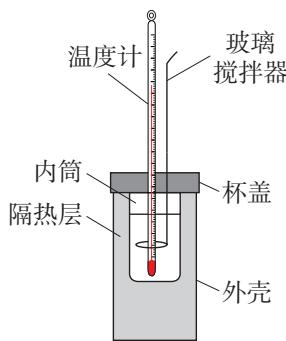

图1-3 简易量热计示意图

（2）反应后体系温度的测量。 

打开杯盖，将量筒中的 $\mathrm{NaOH}$ 溶液迅速倒入量热计的内筒，立即盖上杯盖，插入温度计，用搅拌器匀速搅拌。密切关注温度变化，将最高温度记为反应后体系的温度 $(t_{2})$ 。 

（3）重复上述步骤（1）至步骤（2）两次。 

# 【数据处理】

（1）取盐酸温度和 $\mathrm{NaOH}$ 溶液温度的平均值记为反应前体系的温度 $(t_{1})$ 。计算温度差 $(t_{2} - t_{1})$ ，将数据填入下表。 

<table><tr><td rowspan="2">实验次数</td><td colspan="2">反应物的温度/℃</td><td>反应前体系 的温度</td><td>反应后体系 的温度</td><td>温度差</td></tr><tr><td>盐酸</td><td>NaOH溶液</td><td>t1/℃</td><td>t2/℃</td><td>(t2-t1)/℃</td></tr><tr><td>1</td><td></td><td></td><td></td><td></td><td></td></tr><tr><td>2</td><td></td><td></td><td></td><td></td><td></td></tr><tr><td>3</td><td></td><td></td><td></td><td></td><td></td></tr></table>

（2）取三次测量所得温度差的平均值作为计算依据。 

（3）根据温度差和比热容等计算反应热。 

为了计算简便, 可以近似地认为实验所用酸、碱稀溶液的密度、比热容与水的相同, 并忽略量热计的比热容, 则: 

① $50 \mathrm{~mL} 0.50 \mathrm{~mol} / \mathrm{L}$ 盐酸的质量 $m_{1} = 50 \mathrm{~g}, 50 \mathrm{~mL} 0.55 \mathrm{~mol} / \mathrm{L} \mathrm{NaOH}$ 溶液的质量 $m_{2} = 50 \mathrm{~g}$ ; 

② 反应后生成的溶液的比热容 $c = 4.18 \mathrm{~J} /(\mathrm{g} \cdot^{\circ} \mathrm{C})$ , $50 \mathrm{~mL} 0.50 \mathrm{~mol} / \mathrm{L}$ 盐酸与 $50 \mathrm{~mL} 0.55 \mathrm{~mol} / \mathrm{L}$ NaOH 溶液发生中和反应时放出的热量为: 

$(m_{1} + m_{2})\cdot c\cdot (t_{2} - t_{1}) =$ 

③生成 $1\mathrm{mol}\mathrm{H}_2\mathrm{O}$ 时放出的热量为 

# 【问题和讨论】

在上述过程中，提高测定反应热准确度的措施有哪些？ 

大量实验测得，在 $25^{\circ} \mathrm{C}$ 和 $101 \mathrm{kPa}$ 下，强酸的稀溶液与强碱的稀溶液发生中和反应生成 $1 \mathrm{~mol} \mathrm{H}_{2} \mathrm{O}$ 时，放出 $57.3 \mathrm{~kJ}$ 的热量。 

# 2. 反应热与焓变

化学反应为什么会产生反应热？这是因为化学反应前后体系的内能（符号为 $U$ ）发生了变化。内能是体系内物质的各种能量的总和，受温度、压强和物质的聚集状态等影响。 

在科学研究和生产实践中，化学反应通常是在等压条件下进行的。为了描述等压条件下的反应热，科学上引入了一个与内能有关的物理量——焓（符号为 $H$ ）。研究表明，在等压条件下进行的化学反应（严格地说，对反应体系做功还有限定，中学阶段一般不考虑），其反应热等于反应的焓变，用符号 $\Delta H$ 表示。 $\Delta H$ 的常用单位是 $\mathrm{kJ / mol}$ （或 $\mathrm{kJ} \cdot \mathrm{mol}^{-1}$ ）①。 

根据规定，当反应体系放热时其焓减小， $\Delta H$ 为负值，即 $\Delta H < 0$ 。当反应体系吸热时其焓增大， $\Delta H$ 为正值，即 $\Delta H > 0$ 。如图1-4所示。 

例如，在 $25^{\circ} \mathrm{C}$ 和 $101 \mathrm{kPa}$ 下， $1 \mathrm{~mol} \mathrm{H}_{2}$ 与 $1 \mathrm{~mol} \mathrm{Cl}_{2}$ 反应生成 $2 \mathrm{~mol} \mathrm{HCl}$ 时放出 $184.6 \mathrm{~kJ}$ 的热量，则该反应的反应热为： 

$$
\Delta H = - 1 8 4. 6 \mathrm {k J} / \mathrm {m o l}
$$

在 $25^{\circ} \mathrm{C}$ 和 $101 \mathrm{kPa}$ 下, $1 \mathrm{~mol} \mathrm{C}$ (如无特别说明, C 均指石墨) 与 $1 \mathrm{~mol} \mathrm{H}_{2} \mathrm{O}(\mathrm{g})$ 反应, 生成 $1 \mathrm{~mol} \mathrm{CO}$ 和 $1 \mathrm{~mol} \mathrm{H}_{2}$ ,需要吸收 $131.5 \mathrm{~kJ}$ 的热量, 则该反应的反应热为: 

$$
\Delta H = + 1 3 1. 5 \mathrm {k J} / \mathrm {m o l}
$$

下面，我们以 $\mathrm{H}_{2}$ 与 $\mathrm{Cl}_{2}$ 反应生成 $\mathrm{HCl}$ 为例，从微观角度来讨论反应热的实质。 

在 $25^{\circ} \mathrm{C}$ 和 $101 \mathrm{kPa}$ 下, $1 \mathrm{~mol} \mathrm{H}_{2}$ 中的化学键断裂时需要吸收 $436 \mathrm{~kJ}$ 的能量, $1 \mathrm{~mol} \mathrm{Cl}_{2}$ 中的化学键断裂时需要吸收 $243 \mathrm{~kJ}$ 的能量, 而 $2 \mathrm{~mol} \mathrm{HCl}$ 中的化学键形成时要释放 $431 \mathrm{~kJ} / \mathrm{mol} \times 2 \mathrm{~mol} = 862 \mathrm{~kJ}$ 的能量, 如图 1-5 所示。 

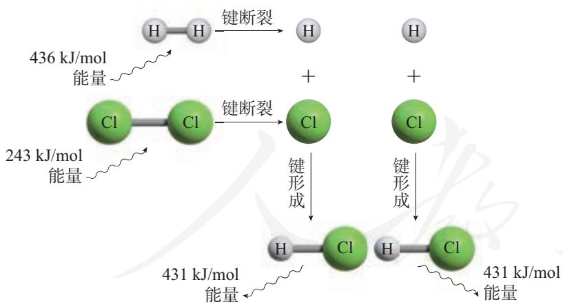

图1-5 $\mathrm{H}_2(\mathrm{g}) + \mathrm{Cl}_2(\mathrm{g}) = 2\mathrm{HCl}(\mathrm{g})$ 的能量变化示意图

$1 \mathrm{~mol} \mathrm{H}_{2}$ 与 $1 \mathrm{~mol} \mathrm{Cl}_{2}$ 反应生成 $2 \mathrm{~mol} \mathrm{HCl}$ 时的反应热, 应等于生成物分子的化学键形成时所释放的总能量 ( $862 \mathrm{~kJ}$ ) 

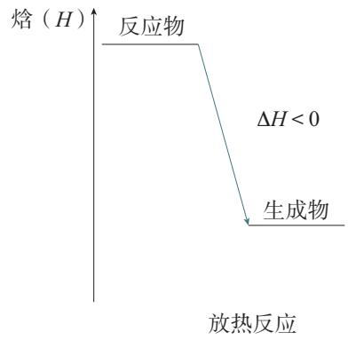

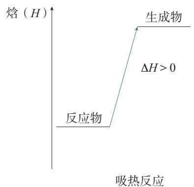

图1-4 化学反应中焓的变化示意图

与反应物分子的化学键断裂时所吸收的总能量（ $436\mathrm{kJ} + 243\mathrm{kJ} = 679\mathrm{kJ}$ ）的差，即放出 $183\mathrm{kJ}$ 的能量。显然，分析结果与实验测得的该反应的反应热（ $\Delta H = -184.6\mathrm{kJ/mol}$ ）很接近（一般用实验数据表示反应热）。上述分析表明，化学键断裂和形成时的能量变化是化学反应中能量变化的主要原因。 

# 二、热化学方程式

化学反应一般都有反应热。那么，我们应该如何表示化学反应的反应热呢？下面以 $\mathrm{H}_{2}$ 与 $\mathrm{Cl}_{2}$ 反应生成 $\mathrm{HCl}$ 为例进行说明。 

$$
\mathrm {H} _ {2} + \mathrm {C l} _ {2} \xlongequal {\text {点 燃}} 2 \mathrm {H C l}
$$

该化学方程式只表明了化学反应中的物质变化，没有表明其中的能量变化。 

$$
\mathrm {H} _ {2} (\mathrm {g}) + \mathrm {C l} _ {2} (\mathrm {g}) = 2 \mathrm {H C l} (\mathrm {g}) \Delta H = - 1 8 4. 6 \mathrm {k J / m o l}
$$

上述形式则表明了 $1 \mathrm{~mol}$ 气态 $\mathrm{H}_{2}$ 与 $1 \mathrm{~mol}$ 气态 $\mathrm{Cl}_{2}$ 反应生成 $2 \mathrm{~mol}$ 气态 $\mathrm{HCl}$ 时, 放出 $184.6 \mathrm{~kJ}$ 的热量。这种表明反应所释放或吸收的热量的化学方程式, 叫做热化学方程式。 

再如，在 $25\mathrm{^\circ C}$ 和 $101\mathrm{kPa}$ 下， $1\mathrm{mol}$ 气态 $\mathrm{H}_2$ 与 $0.5\mathrm{mol}$ 气态 $\mathrm{O}_2$ 反应生成 $1\mathrm{mol}$ 气态 $\mathrm{H}_2\mathrm{O}$ 时，放出 $241.8\mathrm{kJ}$ 的热量； $1\mathrm{mol}$ 气态 $\mathrm{H}_2$ 与 $0.5\mathrm{mol}$ 气态 $\mathrm{O}_2$ 反应生成 $1\mathrm{mol}$ 液态 $\mathrm{H}_2\mathrm{O}$ 时，放出 $285.8\mathrm{kJ}$ 的热量。上述两个反应的热化学方程式可以分别表示如下： 

$$
\mathrm {H} _ {2} (\mathrm {g}) + \frac {1}{2} \mathrm {O} _ {2} (\mathrm {g}) = \mathrm {H} _ {2} \mathrm {O} (\mathrm {g}) \quad \Delta H = - 2 4 1. 8 \mathrm {k J / m o l}
$$

$$
\mathrm {H} _ {2} (\mathrm {g}) + \frac {1}{2} \mathrm {O} _ {2} (\mathrm {g}) = \mathrm {H} _ {2} \mathrm {O} (\mathrm {l}) \quad \Delta H = - 2 8 5. 8 \mathrm {k J / m o l}
$$

正确书写热化学方程式对于生产和科学研究等具有重要意义。书写热化学方程式时应注意以下几点。 

热化学方程式 

thermochemical equation 

1. 需注明反应时的温度和压强。因为反应时的温度和压强不同, 其 $\Delta H$ 也不同。但常用的 $\Delta H$ 的数据, 一般都是 $25^{\circ} \mathrm{C}$ 和 $101 \mathrm{kPa}$ 时的数据, 因此可不特别注明。 

2. 需注明反应物和生成物的聚集状态。因为物质的聚集状态不同时，它们所具有的内能、焓也均不同。例如，冰熔化为水时，需要吸收热量；水蒸发为水蒸气时，也需要吸收热量（如图1-6）。因此， $\mathrm{H}_{2}$ 与 $\mathrm{O}_{2}$ 反应生成 $1 \, \mathrm{mol} \, \mathrm{H}_{2} \mathrm{O}(l)$ 与生成 $1 \, \mathrm{mol} \, \mathrm{H}_{2} \mathrm{O}(g)$ 时所放出的热量是不同的。 

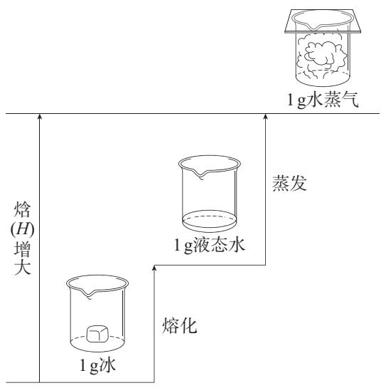

图1-6 水的聚集状态变化时的焓变示意图

3. 热化学方程式中各物质前的化学计量数可以是整数，也可以是分数。 

例如： 

$$
\mathrm {H} _ {2} (\mathrm {g}) + \mathrm {C l} _ {2} (\mathrm {g}) = 2 \mathrm {H C l} (\mathrm {g}) \quad \Delta H = - 1 8 4. 6 \mathrm {k J / m o l} \tag {①}
$$

$$
\frac {1}{2} \mathrm {H} _ {2} (\mathrm {g}) + \frac {1}{2} \mathrm {C l} _ {2} (\mathrm {g}) = \mathrm {H C l} (\mathrm {g}) \quad \Delta H = - 9 2. 3 \mathrm {k J / m o l} \tag {②}
$$

显然，反应①的 $\Delta H$ 是反应②的两倍。因此，书写热化学方程式时， $\Delta H$ 必须与化学方程式一一对应。 

# $\Delta H$ 的单位中“mol $^{-1}$ ”的含义

对于一个化学反应: $a\mathrm{A} + b\mathrm{B} = c\mathrm{C} + d\mathrm{D}$ , $\Delta H$ 的单位中 “ $\mathrm{mol}^{-1}$ ” 既不是指 “每摩尔 A”, 也不是指 “每摩尔 B (或 C、D)”, 而是指 “每摩尔反应”。 

例如，对于反应： 

$$
\mathrm {H} _ {2} (\mathrm {g}) + \mathrm {C l} _ {2} (\mathrm {g}) = 2 \mathrm {H C l} (\mathrm {g}) \quad \Delta H = - 1 8 4. 6 \mathrm {k J / m o l}
$$

1 mol H₂(g) 与 1 mol Cl₂(g) 反应生成 2 mol HCl(g) 表示“每摩尔反应”，“每摩尔 

反应”放出 $184.6 \mathrm{~kJ}$ 的热量。 

而对于反应： 

$$
\frac {1}{2} \mathrm {H} _ {2} (\mathrm {g}) + \frac {1}{2} \mathrm {C l} _ {2} (\mathrm {g}) = \mathrm {H C l} (\mathrm {g}) \quad \Delta H = - 9 2. 3 \mathrm {k J / m o l}
$$

则 $0.5 \mathrm{~mol} \mathrm{H}_{2}(\mathrm{~g})$ 与 $0.5 \mathrm{~mol} \mathrm{Cl}_{2}(\mathrm{~g})$ 反应生成 $1 \mathrm{~mol} \mathrm{HCl}(\mathrm{~g})$ 表示“每摩尔反应”，“每摩尔反应”放出 $92.3 \mathrm{~kJ}$ 的热量。 

这就是 $\Delta H$ 必须与化学方程式一一对应的原因。 

# 三、燃烧热

由于反应的情况不同，反应热可分为多种。其中，与燃料品质相关的燃烧热在实际中应用较广。 

在 $101 \mathrm{kPa}$ 时, $1 \mathrm{~mol}$ 纯物质完全燃烧生成指定产物①时所放出的热量, 叫做该物质的燃烧热, 单位是 $\mathrm{kJ} / \mathrm{mol}$ 。燃烧热通常利用量热计由实验测得。例如, 实验测得在 $25^{\circ} \mathrm{C}$ 和 $101 \mathrm{kPa}$ 时, $1 \mathrm{~mol} \mathrm{H}_{2}$ 完全燃烧生成液态水, 放出 $285.8 \mathrm{~kJ}$ 的热量, 这就是 $\mathrm{H}_{2}$ 的燃烧热。 

燃烧热 heat of combustion 

$$
\mathrm {H} _ {2} (\mathrm {g}) + \frac {1}{2} \mathrm {O} _ {2} (\mathrm {g}) = \mathrm {H} _ {2} \mathrm {O} (\mathrm {l}) \quad \Delta H = - 2 8 5. 8 \mathrm {k J / m o l}
$$

煤、石油、天然气是当今世界重要的化石燃料。煤干馏后得到的焦炭、石油加工产品——汽油的成分之一辛烷、天然气的主要成分甲烷，它们燃烧的热化学方程式分别表示如下： 

$$
\mathrm {C} (\mathrm {s}) + \mathrm {O} _ {2} (\mathrm {g}) = \mathrm {C O} _ {2} (\mathrm {g}) \quad \Delta H = - 3 9 3. 5 \mathrm {k J / m o l}
$$

$$
\begin{array}{l} \mathrm {C} _ {8} \mathrm {H} _ {1 8} (\mathrm {I}) + \frac {2 5}{2} \mathrm {O} _ {2} (\mathrm {g}) = 8 \mathrm {C O} _ {2} (\mathrm {g}) + 9 \mathrm {H} _ {2} \mathrm {O} (\mathrm {I}) \\ \Delta H = - 5 5 1 8 \mathrm {k J} / \mathrm {m o l} \\ \end{array}
$$

$$
\begin{array}{l} \mathrm {C H} _ {4} (\mathrm {g}) + 2 \mathrm {O} _ {2} (\mathrm {g}) = \mathrm {C O} _ {2} (\mathrm {g}) + 2 \mathrm {H} _ {2} \mathrm {O} (\mathrm {l}) \\ \Delta H = - 8 9 0. 3 \mathrm {k J} / \mathrm {m o l} \\ \end{array}
$$

在 $25\mathrm{C}$ 和 $101\mathrm{kPa}$ 时，某些物质的燃烧热参见附录I。 

# 科学·技术·社会

# 重要的体内能源——脂肪

说起脂肪，你也许会联想到肥胖、高血脂等。实际上，人体内的脂肪具有重要的生理功能。 

脂肪是人体储存能量的重要物质。一般成年人体内储存的脂肪占体重的 $10\% \sim 20\%$ 。当人体因劳动或体育运动消耗大量能量而糖类又不能及时供应能量时，储存在体内的脂肪就会发生水解反应，生成高级脂肪酸和甘油。高级脂肪酸发生氧化反应，生成二氧化碳和水，同时放出能量，满足机体活动的需要。例如，软脂酸 $\left[\mathrm{CH}_{3}(\mathrm{CH}_{2})_{14} \mathrm{COOH}\right]$ 是一种有代表性的人体脂肪酸，其燃烧的热化学方程式为： 

$$
\begin{array}{l} \mathrm {C H} _ {3} \left(\mathrm {C H} _ {2}\right) _ {1 4} \mathrm {C O O H} (\mathrm {s}) + 2 3 \mathrm {O} _ {2} (\mathrm {g}) = 1 6 \mathrm {C O} _ {2} (\mathrm {g}) + 1 6 \mathrm {H} _ {2} \mathrm {O} (\mathrm {l}) \\ \Delta H = - 9 9 7 7 \mathrm {k J} / \mathrm {m o l} \\ \end{array}
$$

尽管软脂酸在人体内的反应远比上述反应复杂，但体内反应的反应物、生成物及其能量变化与上述反应完全相同，人体活动所需要的能量就是来自体内类似的放热反应。 

人体内的脂肪还能提供必需脂肪酸、促进脂溶性维生素的吸收和维持体温恒定等。因此，人体每天需要摄入一定量的脂肪。中国营养学会推荐的每人每天油脂的食用量为 $25\sim 30\mathrm{g}$ ；此外，人体从许多食物（如肉类、奶类等）中也会摄入一部分脂肪。这两部分脂肪总量达到每天 $50\sim 60\mathrm{g}$ 时，就能够满足人体的需要。当然，如果摄入过量的脂肪，对人体也是有害的。 

# 研究与实践

# 了解火箭推进剂

# 【研究目的】

火箭推进剂在航天和军事等领域具有广泛的应用。通过查阅资料，了解火箭推进剂的发展历史、现状及趋势，感受火箭推进剂的发展对人类社会进步的促进作用，体会化学反应中能量变化的重要价值。 

# 【研究任务】

(1) 了解火箭推进剂的发展历史。 

(2) 了解我国目前常用的火箭推进剂的类型、成分和特点。 

（3）了解火箭推进剂的发展趋势。 

# 【结果与讨论】

(1) 通过研究, 你得到什么启示? 

(2) 撰写研究报告，并与同学讨论。 

1. 依据事实，写出下列反应的热化学方程式。 

(1) $1 \, \text{mol} \, \text{Cu}(\text{s})$ 与适量 $\mathrm{O}_2(\mathrm{g})$ 反应生成 $\mathrm{CuO}(\mathrm{s})$ ，放出 $157.3 \, \text{kJ}$ 的热量。 

(2) $1 \mathrm{~mol} \mathrm{C}_{2} \mathrm{H}_{4}(\mathrm{~g})$ 与适量 $\mathrm{O}_{2}(\mathrm{~g})$ 反应生成 $\mathrm{CO}_{2}(\mathrm{~g})$ 和 $\mathrm{H}_{2} \mathrm{O}(\mathrm{l})$ , 放出 $1411.0 \mathrm{~kJ}$ 的热量。 

(3) $1 \mathrm{~mol} \mathrm{C}(\mathrm{s})$ 与适量 $\mathrm{H}_{2} \mathrm{O}(\mathrm{g})$ 反应生成 $\mathrm{CO}(\mathrm{g})$ 和 $\mathrm{H}_{2}(\mathrm{g})$ , 吸收 $131.5 \mathrm{~kJ}$ 的热量。 

2. 已知： 

（1） $1\mathrm{mol}\mathrm{N}_2(\mathrm{g})$ 中的化学键断裂时需要吸收 $946\mathrm{kJ}$ 的能量。 

(2) $1 \mathrm{~mol} \mathrm{O}_{2}(\mathrm{~g})$ 中的化学键断裂时需要吸收 $498 \mathrm{~kJ}$ 的能量。 

(3) $1 \mathrm{~mol} \mathrm{NO}(\mathrm{g})$ 中的化学键形成时要释放 $632 \mathrm{~kJ}$ 的能量。 

请写出 $\mathrm{N}_2(\mathrm{g})$ 与 $\mathrm{O}_2(\mathrm{g})$ 反应生成 $\mathrm{NO}(\mathrm{g})$ 的热化学方程式。 

3. 适量 $\mathrm{H}_{2}(\mathrm{~g})$ 在 $1 \mathrm{~mol} \mathrm{O}_{2}(\mathrm{~g})$ 中完全燃烧, 生成 $2 \mathrm{~mol} \mathrm{H}_{2} \mathrm{O}(\mathrm{l})$ , 放出 $571.6 \mathrm{~kJ}$ 的热量。请写出表示 $\mathrm{H}_{2}$ 燃烧热的热化学方程式。 

4. 有人说，下列两个反应的 $\Delta H$ 相同，这种说法是否正确？为什么？ 

$$
\begin{array}{l} 2 \mathrm {C O} (\mathrm {g}) + \mathrm {O} _ {2} (\mathrm {g}) = 2 \mathrm {C O} _ {2} (\mathrm {g}) \\ \mathrm {C O} (\mathrm {g}) + \frac {1}{2} \mathrm {O} _ {2} (\mathrm {g}) = \mathrm {C O} _ {2} (\mathrm {g}) \\ \end{array}
$$

5. 氢能是一种理想的绿色能源。有科学家预言，氢能有可能成为人类未来的主要能源。 

（1）为什么说氢能是一种理想的绿色能源？ 

(2) 请根据附录 I 所提供的燃烧热数据, 计算相同质量的氢气、甲烷、乙醇在 $25 \mathrm{C}$ 和 $101 \mathrm{kPa}$ 时完全燃烧放出的热量, 据此说明氢气作为能源的优点。 

(3) 查阅资料, 了解氢能在利用过程中需要解决的技术难题, 以及氢能利用的发展前景。 

# 第二节

# 反应热的计算

在科学研究和工业生产中，常常需要了解反应热。许多反应热可以通过实验直接测定，但是有些反应热是无法直接测定的。例如，对于化学反应： 

$$
C (s) + \frac {1}{2} O _ {2} (g) = C O (g)
$$

C燃烧时不可能全部生成CO，总有一部分 $\mathrm{CO}_{2}$ 生成，因此该反应的反应热是无法直接测定的。但这个反应热是冶金工业中非常有用的数据，应该如何获得呢？能否利用一些已知反应的反应热来计算其他反应的反应热呢？ 

# 一、盖斯定律

1836年，化学家盖斯(G.H.Hess，1802—1850)从大量实验中总结出一条规律：一个化学反应，不管是一步完成的还是分几步完成的，其反应热是相同的。这就是盖斯定律。 

盖斯定律表明，在一定条件下，化学反应的反应热只与反应体系的始态和终态有关，而与反应的途径无关。这与登山时人的势能变化相似。如图1-7所示，某人要从山下A点到达山顶B点，他从A点出发，无论是翻山越岭攀登而上，还是乘坐缆车直奔山顶，当最终到达B点时，他所处位置的海拔相对于起点A来说都高了 $300\mathrm{m}$ 。即此人的势能变化只与起点A和终点B的海拔差有关，而与由A点到B点的途径无关。 

盖斯定律 Hess law 

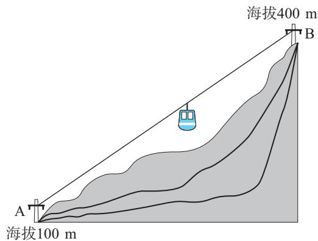

图1-7 人的势能变化与上山的途径无关

盖斯定律在科学研究中具有重要意义。在众多的化学反应中，有些反应进行得很慢，有些反应不容易直接发生，有些反应往往伴有副反应发生，这给直接测定反应热造成了困难。利用盖斯定律，可以间接地将它们的反应热计算出来。 

例如，对于前面提到的反应： 

$$
C (s) + \frac {1}{2} O _ {2} (g) = C O (g)
$$

虽然该反应的反应热无法直接测定，但下列两个反应的反应热却可以直接测定： 

$$
C (s) + O _ {2} (g) = C O _ {2} (g) \quad \Delta H _ {1} = - 3 9 3. 5 k J / m o l
$$

$$
\mathrm {C O} (\mathrm {g}) + \frac {1}{2} \mathrm {O} _ {2} (\mathrm {g}) = \mathrm {C O} _ {2} (\mathrm {g}) \quad \Delta H _ {2} = - 2 8 3. 0 \mathrm {k J / m o l}
$$

上述三个反应具有如下关系： 

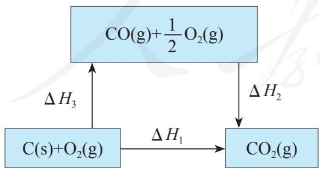

$\mathrm{C}(\mathrm{s})$ 与 $\mathrm{O}_{2}(\mathrm{~g})$ 生成 $\mathrm{CO}_{2}(\mathrm{~g})$ 的反应可以一步完成（反应热为 $\Delta H_{1}$ ），也可以分两步完成：第一步， $\mathrm{C}(\mathrm{s})$ 与 $\mathrm{O}_{2}(\mathrm{~g})$ 反应生成 $\mathrm{CO}(\mathrm{~g})$ （反应热为 $\Delta H_{3}$ ）；第二步， $\mathrm{CO}(\mathrm{~g})$ 与 $\mathrm{O}_{2}(\mathrm{~g})$ 反应生成 $\mathrm{CO}_{2}(\mathrm{~g})$ （反应热为 $\Delta H_{2}$ ）。根据盖斯定律，则有： 

$$
\begin{array}{l} \Delta H _ {1} = \Delta H _ {2} + \Delta H _ {3} \\ \Delta H _ {3} = \Delta H _ {1} - \Delta H _ {2} \\ = - 3 9 3. 5 \mathrm {k J / m o l} - (- 2 8 3. 0 \mathrm {k J / m o l}) \\ = - 1 1 0. 5 \mathrm {k J} / \mathrm {m o l} \\ \end{array}
$$

即： 

$$
\mathrm {C} (\mathrm {s}) + \frac {1}{2} \mathrm {O} _ {2} (\mathrm {g}) = \mathrm {C O} (\mathrm {g}) \quad \Delta H _ {3} = - 1 1 0. 5 \mathrm {k J / m o l}
$$

可见，根据盖斯定律，我们可以利用已知反应的反应热来计算未知反应的反应热。例如，若某个化学反应的 $\Delta H = +a\mathrm{kJ / mol}$ ，则其逆反应的 $\Delta H = -a\mathrm{kJ / mol}$ ；若某个反应的化学方程式可由另外几个反应的化学方程式相加减而得到，则该反应的反应热也可以由这几个反应的反应热相加减而得到。 

# 科学史话

# 热化学研究的先驱——盖斯

1802年，盖斯出生于瑞士的日内瓦，三岁时全家迁居俄国。1825年，盖斯获得医学博士学位，1838年当选为俄国科学院院士。 

最早研究反应热的是法国化学家拉瓦锡和法国数学家、天文学家拉普拉斯(P.-S.Laplace,1749—1827)，他们利用冰量热计（即以被熔化了的冰的质量来计算热量）测定了碳单质的燃烧热，测得的数值与现代精确测定值十分接近。1836年，盖斯受炼铁中热现象的启发，利用自己设计的量热计测定了大量的反应热，并依据氨水、氢氧化钠、氢氧化钾、石灰分别与硫酸反应的反应热总 

结出了盖斯定律。 

盖斯定律的提出，为反应热的研究提供了极大的方便，使一些不易测准或无法测定的化 

学反应的反应热可以通过推算间接求得。盖斯定律的提出要早于能量守恒定律的确认，因此，盖斯定律是化学热力学发展的基础，至今仍有广泛的应用。 

图1-8 盖斯

# 二、反应热的计算

在实际应用中，常常需要计算反应热。例如，化工生产中对于化学反应过程中热量的利用、化学反应条件的控制等都涉及反应热的计算问题。 

【例题1】黄铁矿（主要成分为 $\mathrm{FeS}_2$ ）的燃烧是工业上制硫酸时得到 $\mathrm{SO}_2$ 的途径之一，反应的化学方程式为： 

$$
4 \mathrm {F e S} _ {2} + 1 1 \mathrm {O} _ {2} \xlongequal {\text {高 温}} 2 \mathrm {F e} _ {2} \mathrm {O} _ {3} + 8 \mathrm {S O} _ {2}
$$

在 $25^{\circ} \mathrm{C}$ 和 $101 \mathrm{kPa}$ 时, $1 \mathrm{~mol} \mathrm{FeS}_{2}(\mathrm{s})$ 完全燃烧生成 $\mathrm{Fe}_{2} \mathrm{O}_{3}(\mathrm{s})$ 和 $\mathrm{SO}_{2}(\mathrm{g})$ 时放出 $853 \mathrm{~kJ}$ 的热量。这些热量（工业中叫做“废热”）在生产过程中得到了充分利用, 大大降低了生产成本, 对于节约资源、能源循环利用具有重要意义。 

(1) 请写出 $\mathrm{FeS}_{2}$ 燃烧的热化学方程式。 

(2) 计算理论上 $1 \mathrm{~kg}$ 黄铁矿 $\left(\mathrm{FeS}_{2}\right.$ 的含量为 $90 \%$ ) 完全燃烧放出的热量。 

【解】（1）根据题意， $\mathrm{FeS}_2$ 燃烧的热化学方程式为： 

$$
\mathrm {F e S} _ {2} (\mathrm {s}) + \frac {1 1}{4} \mathrm {O} _ {2} (\mathrm {g}) = \frac {1}{2} \mathrm {F e} _ {2} \mathrm {O} _ {3} (\mathrm {s}) + 2 \mathrm {S O} _ {2} (\mathrm {g}) \quad \Delta H = - 8 5 3 \mathrm {k J / m o l}
$$

(2) $\mathrm{FeS}_{2}$ 的摩尔质量为 $120 \mathrm{~g} \cdot \mathrm{mol}^{-1}$ 。 

1 kg黄铁矿含FeS 2 的质量为: $1000 \mathrm{~g} \times 90 \% = 900 \mathrm{~g}$ 

$900 \mathrm{~g} \mathrm{FeS}_{2}$ 的物质的量为: 

$$
\frac {9 0 0 \mathrm {g}}{1 2 0 \mathrm {g} \cdot \mathrm {m o l} ^ {- 1}} = 7. 5 \mathrm {m o l}
$$

理论上 $1 \mathrm{~kg}$ 黄铁矿完全燃烧放出的热量为: 

$$
7. 5 \mathrm {m o l} \times 8 5 3 \mathrm {k J / m o l} = 6 3 9 8 \mathrm {k J}
$$

答: (1) $\mathrm{FeS}_{2}$ 燃烧的热化学方程式为: 

$$
\mathrm {F e S} _ {2} (\mathrm {s}) + \frac {1 1}{4} \mathrm {O} _ {2} (\mathrm {g}) = \frac {1}{2} \mathrm {F e} _ {2} \mathrm {O} _ {3} (\mathrm {s}) + 2 \mathrm {S O} _ {2} (\mathrm {g}) \quad \Delta H = - 8 5 3 \mathrm {k J / m o l 。}
$$

(2) 理论上 $1 \mathrm{~kg}$ 黄铁矿完全燃烧放出的热量为 $6398 \mathrm{~kJ}$ 。 

【例题2】葡萄糖是人体所需能量的重要来源之一，设它在人体组织中完全氧化时的热化学方程式为： 

$$
\mathrm {C} _ {6} \mathrm {H} _ {1 2} \mathrm {O} _ {6} (\mathrm {s}) + 6 \mathrm {O} _ {2} (\mathrm {g}) = 6 \mathrm {C O} _ {2} (\mathrm {g}) + 6 \mathrm {H} _ {2} \mathrm {O} (\mathrm {l}) \Delta H = - 2 8 0 0 \mathrm {k J / m o l}
$$

计算 $100 \mathrm{~g}$ 葡萄糖在人体组织中完全氧化时产生的 

热量。 

【解】根据热化学方程式可知, $1 \mathrm{~mol} \mathrm{C}_{6} \mathrm{H}_{12} \mathrm{O}_{6}$ 在人体组织中完全氧化时产生的热量为 $2800 \mathrm{~kJ}$ 。 

$\mathrm{C}_{6} \mathrm{H}_{12} \mathrm{O}_{6}$ 的摩尔质量为 $180 \mathrm{~g} \cdot \mathrm{mol}^{-1}$ 。 

$100 \mathrm{~g} \mathrm{C}_{6} \mathrm{H}_{12} \mathrm{O}_{6}$ 的物质的量为: 

$$
\frac {1 0 0 \mathrm {g}}{1 8 0 \mathrm {g} \cdot \mathrm {m o l} ^ {- 1}} = 0. 5 5 6 \mathrm {m o l}
$$

$0.556 \mathrm{~mol} \mathrm{C}_{6} \mathrm{H}_{12} \mathrm{O}_{6}$ 完全氧化时产生的热量为: 

$$
0. 5 5 6 \mathrm {m o l} \times 2 8 0 0 \mathrm {k J / m o l} = 1 5 5 7 \mathrm {k J}
$$

答: $100 \mathrm{~g}$ 葡萄糖在人体组织中完全氧化时产生的热量为 $1557 \mathrm{~kJ}$ 。 

【例题3】焦炭与水蒸气反应、甲烷与水蒸气反应均是工业上制取氢气的重要方法。这两个反应的热化学方程式分别为： 

(1) $\mathrm{C}(\mathrm{s}) + \mathrm{H}_{2} \mathrm{O}(\mathrm{g}) = \mathrm{CO}(\mathrm{g}) + \mathrm{H}_{2}(\mathrm{g})$ $\Delta H_{1} = +131.5 \mathrm{~kJ} / \mathrm{mol}$ 

(2) $\mathrm{CH}_{4}(\mathrm{~g}) + \mathrm{H}_{2} \mathrm{O}(\mathrm{~g}) = \mathrm{CO}(\mathrm{~g}) + 3 \mathrm{H}_{2}(\mathrm{~g})$ $\Delta H_{2} = +205.9 \mathrm{~kJ} / \mathrm{mol}$ 

试计算 $\mathrm{CH}_4(\mathrm{g}) = \mathrm{C}(\mathrm{s}) + 2\mathrm{H}_2(\mathrm{g})$ 的 $\Delta H_{\circ}$ 

【解】分析各化学方程式的关系可以得出，将反应①的逆反应与反应②相加，得到反应： 

$$
\mathrm {C H} _ {4} (\mathrm {g}) = \mathrm {C} (\mathrm {s}) + 2 \mathrm {H} _ {2} (\mathrm {g})
$$

即： 

$$
\begin{array}{l} \mathrm {C O (g)} + \mathrm {H} _ {2} (\mathrm {g}) = \mathrm {C (s)} + \mathrm {H} _ {2} \mathrm {O (g)} \quad \Delta H _ {3} = - \Delta H _ {1} = - 1 3 1. 5 \mathrm {k J / m o l} \\ +) \mathrm {C H} _ {4} (\mathrm {g}) + \mathrm {H} _ {2} \mathrm {O} (\mathrm {g}) = \mathrm {C O} (\mathrm {g}) + 3 \mathrm {H} _ {2} (\mathrm {g}) \quad \Delta H _ {2} = + 2 0 5. 9 \mathrm {k J / m o l} \\ \mathrm {C H} _ {4} (\mathrm {g}) = \mathrm {C} (\mathrm {s}) + 2 \mathrm {H} _ {2} (\mathrm {g}) \quad \Delta H =? \\ \end{array}
$$

根据盖斯定律： 

$$
\begin{array}{l} \Delta H = \Delta H _ {3} + \Delta H _ {2} \\ = \Delta H _ {2} - \Delta H _ {1} \\ = + 2 0 5. 9 \mathrm {k J} / \mathrm {m o l} - 1 3 1. 5 \mathrm {k J} / \mathrm {m o l} \\ = + 7 4. 4 \mathrm {k J} / \mathrm {m o l} \\ \end{array}
$$

答: $\mathrm{CH}_4(\mathrm{~g})=\mathrm{C}(\mathrm{s})+2 \mathrm{H}_2(\mathrm{~g})$ 的 $\Delta H=+74.4 \mathrm{~kJ/mol}$ 。 

1. $4 \mathrm{~g}$ 硫粉在 $\mathrm{O}_{2}$ 中完全燃烧生成 $\mathrm{SO}_{2}$ 气体，放出 $37 \mathrm{~kJ}$ 的热量，写出 $\mathrm{S}$ 燃烧的热化学方程式。 

2. $\mathrm{H}_{2}$ 与 $\mathrm{O}_{2}$ 反应生成 $1 \mathrm{~mol}$ 水蒸气, 放出 $241.8 \mathrm{~kJ}$ 的热量, 写出该反应的热化学方程式。若 $1 \mathrm{~g}$ 水蒸气转化为液态水, 放出 $2.444 \mathrm{~kJ}$ 的热量, 计算 $\mathrm{H}_{2}(\mathrm{~g}) + \frac{1}{2} \mathrm{O}_{2}(\mathrm{~g}) = \mathrm{H}_{2} \mathrm{O}(\mathrm{l})$ 的 $\Delta H$ 。 

3. 家用液化气的成分之一是丁烷。当 $10 \mathrm{~kg}$ 丁烷完全燃烧生成二氧化碳和液态水时, 放出 $5 \times 10^{5} \mathrm{~kJ}$ 的热量。 

（1）写出丁烷燃烧的热化学方程式 

(2) 已知 $1 \mathrm{~mol}$ 液态水变为水蒸气时需要吸收 $44 \mathrm{~kJ}$ 的热量, 计算 $1 \mathrm{~mol}$ 丁烷完全燃烧生成二氧化碳和水蒸气时放出的热量。 

4. 火箭发射时可以用肼 $\left(\mathrm{N}_{2} \mathrm{H}_{4}\right.$ , 液态) 作燃料, $\mathrm{NO}_{2}$ 作氧化剂, 二者反应生成 $\mathrm{N}_{2}$ 和水蒸气。已知: 

① $\mathrm{N}_{2}(\mathrm{~g}) + 2\mathrm{O}_{2}(\mathrm{~g}) = 2\mathrm{NO}_{2}(\mathrm{~g})$ $\Delta H_{1} = +66.4 \mathrm{~kJ} / \mathrm{mol}$ 

② $\mathrm{N}_2\mathrm{H}_4(\mathrm{l}) + \mathrm{O}_2(\mathrm{g}) = \mathrm{N}_2(\mathrm{g}) + 2\mathrm{H}_2\mathrm{O}(\mathrm{g})$ $\Delta H_{2} = -534\mathrm{kJ / mol}$ 

请写出 $\mathrm{N}_2\mathrm{H}_4(\mathrm{l})$ 与 $\mathrm{NO}_2$ 反应的热化学方程式。 

5. 在载人航天器中，可以利用 $\mathrm{CO}_{2}$ 与 $\mathrm{H}_{2}$ 的反应，将航天员呼出的 $\mathrm{CO}_{2}$ 转化为 $\mathrm{H}_{2} \mathrm{O}$ 等，然后通过电解 $\mathrm{H}_{2} \mathrm{O}$ 得到 $\mathrm{O}_{2}$ ，从而实现 $\mathrm{O}_{2}$ 的再生。已知： 

① $\mathrm{CO}_{2}(\mathrm{~g}) + 4\mathrm{H}_{2}(\mathrm{~g}) = \mathrm{CH}_{4}(\mathrm{~g}) + 2\mathrm{H}_{2}\mathrm{O}(\mathrm{l})$ $\Delta H_{1} = -252.9 \mathrm{~kJ} / \mathrm{mol}$ 

② $2\mathrm{H}_{2}\mathrm{O}(1) = 2\mathrm{H}_{2}(\mathrm{g}) + \mathrm{O}_{2}(\mathrm{g})$ $\Delta H_{2} = +571.6\mathrm{kJ / mol}$ 

请写出甲烷与氧气反应生成二氧化碳和液态水的热化学方程式。 

6. 工业上制取氢气时涉及的一个重要反应是： 

$$
\mathrm {C O (g)} + \mathrm {H} _ {2} \mathrm {O (g)} = \mathrm {C O} _ {2} (\mathrm {g}) + \mathrm {H} _ {2} (\mathrm {g})
$$

已知： 

① $\mathrm{C(s) + \frac{1}{2}O_2(g) = CO(g)}$ $\Delta H_{1} = -110.5\mathrm{kJ / mol}$ 

$② \mathrm { H } _ { 2 } ( \mathrm { g } ) + \frac { 1 } { 2 } \mathrm { O } _ { 2 } ( \mathrm { g } ) = \mathrm { H } _ { 2 } \mathrm { O } ( \mathrm { g } )$ $\Delta H_{2} = -241.8\mathrm{kJ / mol}$ 

$③ \mathrm { C ( s ) } + \mathrm { O _ { 2 } ( g ) } { = } \mathrm { C O _ { 2 } ( g ) }$ $\Delta H_{3} = -393.5\mathrm{kJ / mol}$ 

请写出一氧化碳与水蒸气反应生成二氧化碳和氢气的热化学方程式。 

# 一、化学反应中能量变化的认识视角

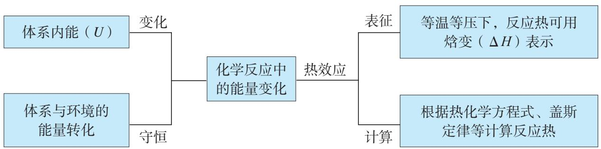

# 二、化学反应的热效应

请完成下表。 

<table><tr><td>反应类型</td><td>放热反应(以H2与Cl2反应生成HCl为例)</td><td>吸热反应[以H2O(g)分解生成H2和O2为例]</td></tr><tr><td>体系与环境间的热交换</td><td></td><td></td></tr><tr><td>体系内能变化的主要原因(从化学键断裂和形成的角度说明)</td><td></td><td></td></tr><tr><td>符号表征(△H)</td><td></td><td></td></tr></table>

# 三、热化学方程式

热化学方程式不仅表明了化学反应中的物质变化，而且表明了化学反应中的能量变化。 

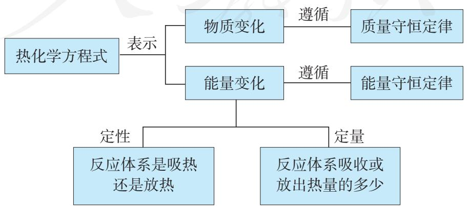

# 复习与提高

1. 在相同条件下, 质量相等的两份 $\mathrm{H}_{2}$ 与足量的 $\mathrm{O}_{2}$ 充分反应, 分别生成液态水 (反应①) 和水蒸气 (反应②)。下列说法正确的是 ( )。 

A. 反应①放出的热量多 

B. 反应②放出的热量多 

C. 反应①、②放出的热量一样多 

D. 无法比较反应①、②放出的热量 

2. 已知: $\mathrm{N}_{2}(\mathrm{~g}) + 3 \mathrm{H}_{2}(\mathrm{~g}) = 2 \mathrm{NH}_{3}(\mathrm{~g}) \Delta H = -92.4 \mathrm{~kJ} / \mathrm{mol}$ 。若断裂 $1 \mathrm{~mol} \mathrm{H}-\mathrm{H} 、 1 \mathrm{~mol} \mathrm{N}-\mathrm{H}$ 需要吸收的能量分别为 $436 \mathrm{~kJ} 、 391 \mathrm{~kJ}$ , 则断裂 $1 \mathrm{~mol} \mathrm{~N} \equiv \mathrm{N}$ 需要吸收的能量为 ( )。 

A. $431\mathrm{kJ}$ 

B. $945.6\mathrm{kJ}$ 

C. $649 \mathrm{~kJ}$ 

D. $869 \mathrm{~kJ}$ 

3. 在 $25^{\circ} \mathrm{C}$ 和 $101 \mathrm{kPa}$ 下, $1 \mathrm{~g} \mathrm{H}_{2}$ 燃烧生成液态水放出 $142.9 \mathrm{~kJ}$ 的热量, 则下列热化学方程式中书写正确的是 ( )。 

A. $2\mathrm{H}_{2}(\mathrm{g}) + \mathrm{O}_{2}(\mathrm{g}) = 2\mathrm{H}_{2}\mathrm{O}(\mathrm{l})$ 

$\Delta H = -142.9 \mathrm{~kJ} / \mathrm{mol}$ 

B. $\mathrm{H}_{2}(\mathrm{~g}) + \frac{1}{2} \mathrm{O}_{2}(\mathrm{~g}) = \mathrm{H}_{2} \mathrm{O}(\mathrm{l})$ 

$\Delta H = -285.8 \mathrm{~kJ} / \mathrm{mol}$ 

C. $2\mathrm{H}_{2}(\mathrm{g}) + \mathrm{O}_{2}(\mathrm{g}) = 2\mathrm{H}_{2}\mathrm{O}(\mathrm{g})$ 

$\Delta H = -571.6 \mathrm{~kJ} / \mathrm{mol}$ 

D. $\mathrm{H}_{2}(\mathrm{~g}) + \frac{1}{2} \mathrm{O}_{2}(\mathrm{~g}) = \mathrm{H}_{2} \mathrm{O}(\mathrm{~g})$ 

$\Delta H = +285.8 \mathrm{~kJ} / \mathrm{mol}$ 

4. 已知: $\mathrm{H}_{2}(\mathrm{~g}) + \mathrm{Cl}_{2}(\mathrm{~g}) = 2\mathrm{HCl}(\mathrm{~g})$ $\Delta H = -184.6 \mathrm{~kJ} / \mathrm{mol}$ 。则 $\mathrm{HCl}(\mathrm{~g}) = \frac{1}{2} \mathrm{H}_{2}(\mathrm{~g}) + \frac{1}{2} \mathrm{Cl}_{2}(\mathrm{~g})$ 的 $\Delta H =$ 

5. 在标准状况下, $1.68 \mathrm{~L}$ 仅由 C、H 两种元素组成的某气体质量为 $1.2 \mathrm{~g}$ , 在 $25^{\circ} \mathrm{C}$ 和 $101 \mathrm{kPa}$ 下完全燃烧生成 $\mathrm{CO}_{2}(\mathrm{~g})$ 和 $\mathrm{H}_{2} \mathrm{O}(1)$ 时, 放出 $66.77 \mathrm{~kJ}$ 的热量。 

（1）该气体的分子式为 

(2) 表示该气体燃烧热的热化学方程式为 

6. 已知： 

① $\mathrm{H}_2\mathrm{O}(\mathrm{g}) = \mathrm{H}_2(\mathrm{g}) + \frac{1}{2}\mathrm{O}_2(\mathrm{g})$ 

$\Delta H = +241.8 \mathrm{~kJ} / \mathrm{mol}$ 

$②$ $\mathrm{C(s) + \frac{1}{2}O_2(g) = CO(g)}$ 

$\Delta H = -110.5 \mathrm{~kJ} / \mathrm{mol}$ 

③ $\mathrm{C(s) + O_2(g) = CO_2(g)}$ 

$\Delta H = -393.5 \mathrm{~kJ} / \mathrm{mol}$ 

请填写下列空白。 

（1）上述反应中属于吸热反应的是 （填序号）。 

（2）表示C的燃烧热的热化学方程式为 （填序号）。 

(3) $10 \mathrm{~g} \mathrm{H}_{2}$ 完全燃烧生成水蒸气, 放出的热量为 

（4）写出CO燃烧的热化学方程式： 

7. 写出下列反应的热化学方程式。 

（1） $1\mathrm{mol}\mathrm{C}_2\mathrm{H}_2(\mathrm{g})$ 在 $\mathrm{O}_2$ 中完全燃烧生成 $\mathrm{CO}_2$ 和液态水，放出 $1299.6\mathrm{kJ}$ 的热量。 

(2) $23 \mathrm{~g} \mathrm{C}_{2} \mathrm{H}_{5} \mathrm{OH}(1)$ 在 $\mathrm{O}_{2}$ 中完全燃烧生成 $\mathrm{CO}_{2}$ 和液态水, 放出 $683.4 \mathrm{~kJ}$ 的热量。 

8. 已知： 

① $\mathrm{C(s) + O_2(g) = CO_2(g)}$ $\Delta H_{1} = -393.5\mathrm{kJ / mol}$ 

$2\mathrm{Mg(s)} + \mathrm{O_2(g)} = 2\mathrm{MgO(s)}$ $\Delta H_{2} = -1203.4\mathrm{kJ / mol}$ 

写出 $\mathrm{Mg}$ 与 $\mathrm{CO}_{2}$ 反应的热化学方程式。 

9. 2008年北京奥运会“祥云”火炬的燃料是丙烷（ $\mathrm{C}_{3} \mathrm{H}_{8}$ ），1996年亚特兰大奥运会火炬的燃料是丙烯（ $\mathrm{C}_{3} \mathrm{H}_{6}$ ）。丙烷脱氢可得到丙烯。 

已知： 

① $\mathrm{C}_{3} \mathrm{H}_{8}(\mathrm{~g})=\mathrm{CH}_{4}(\mathrm{~g})+\mathrm{C}_{2} \mathrm{H}_{2}(\mathrm{~g})+\mathrm{H}_{2}(\mathrm{~g})$ $\Delta H_{1}=+255.7 \mathrm{~kJ} / \mathrm{mol}$ 

② $\mathrm{C}_{3} \mathrm{H}_{6}(\mathrm{~g})=\mathrm{CH}_{4}(\mathrm{~g})+\mathrm{C}_{2} \mathrm{H}_{2}(\mathrm{~g})$ $\Delta H_{2} = +131.5 \mathrm{~kJ} / \mathrm{mol}$ 

计算 $\mathrm{C}_3\mathrm{H}_8(\mathrm{g}) = \mathrm{C}_3\mathrm{H}_6(\mathrm{g}) + \mathrm{H}_2(\mathrm{g})$ 的 $\Delta H_{\circ}$ 

10. 已知： 

① $\mathrm{H}_{2}(\mathrm{~g}) + \frac{1}{2}\mathrm{O}_{2}(\mathrm{~g}) = \mathrm{H}_{2}\mathrm{O}(\mathrm{l})$ $\Delta H_{1} = -285.8\mathrm{kJ / mol}$ 

② $\mathrm{C}_{3} \mathrm{H}_{8}(\mathrm{~g}) + 5 \mathrm{O}_{2}(\mathrm{~g}) = 3 \mathrm{CO}_{2}(\mathrm{~g}) + 4 \mathrm{H}_{2} \mathrm{O}(\mathrm{l})$ $\Delta H_{2} = -2219.9 \mathrm{~kJ} / \mathrm{mol}$ 

(1) 在 $25^{\circ} \mathrm{C}$ 和 $101 \mathrm{kPa}$ 下, $\mathrm{H}_{2}$ 和 $\mathrm{C}_{3} \mathrm{H}_{8}$ 的混合气体 $5 \mathrm{~mol}$ 完全燃烧生成 $\mathrm{CO}_{2}$ 和液态水, 放出 $6264.2 \mathrm{~kJ}$ 的热量。计算该混合气体中 $\mathrm{H}_{2}$ 和 $\mathrm{C}_{3} \mathrm{H}_{8}$ 的体积比。 

(2) 已知: $\mathrm{H}_{2} \mathrm{O}(1)=\mathrm{H}_{2} \mathrm{O}(\mathrm{g}) \Delta H_{3}=+44.0 \mathrm{~kJ} / \mathrm{mol}$ 。写出 $\mathrm{C}_{3} \mathrm{H}_{8}$ 燃烧生成 $\mathrm{CO}_{2}$ 和水蒸气的热化学方程式。 

# 第二章

# 化学反应速率与

# 化学平衡

化学反应速率 

化学平衡 

化学反应的方向 

化学反应的调控 

研究一个化学反应时，往往需要关注以下两个方面的问题：一是反应的快慢和历程，涉及反应速率和反应机理；二是反应的趋势和限度，涉及反应方向和化学平衡。这两个方面既有区别，又有联系。这些问题的研究，对于揭示化学反应的规律，获得调控化学反应的理论依据，以及日常生活和工农业生产都具有重要的意义。 

# 第一节化学反应速率

我们知道，不同化学反应的速率有大有小。例如，火药的爆炸在瞬间完成，溶液中的一些离子反应在分秒之内就能实现，而室温下塑料、橡胶的老化则比较缓慢，自然界的岩石风化、溶洞形成更是要百年甚至千年才能完成。那么，如何表示化学反应速率？如何认识影响化学反应速率的因素呢？ 

# 一、化学反应速率

任何化学反应的快慢都表现为有关物质的量随着时间变化的多少。因此，化学反应速率可以用单位时间、单位体积中反应物或生成物的物质的量变化来表示。如果反应体系的体积是恒定的，则化学反应速率通常用单位时间内反应物浓度的减小或生成物浓度的增大来表示①： 

化学反应速率 

chemical reaction rate 

$$
v = \frac {\Delta c}{\Delta t}
$$

式中， $\Delta c$ 表示反应物浓度或生成物浓度的变化，其常用单位是 $\mathrm{mol} / \mathrm{L}$ （或 $\mathrm{mol} \cdot \mathrm{L}^{-1}$ ）等； $\Delta t$ 表示反应时间的变化，其常用单位是 $\mathrm{s}$ （秒）、 $\min$ （分）等； $v$ 表示反应速率（取正值），其常用单位是 $\mathrm{mol} / (\mathrm{L} \cdot \mathrm{s})$ （或 $\mathrm{mol} \cdot \mathrm{L}^{-1} \cdot \mathrm{s}^{-1}$ ）等。 

对于一个化学反应: $m\mathrm{A} + n\mathrm{B} = p\mathrm{C} + q\mathrm{D}$ , 可用任一种物质的物质的量浓度随时间的变化来表示该化学反应的速率。 

$$
v (\mathrm {A}) = - \frac {\Delta c (\mathrm {A})}{\Delta t}, v (\mathrm {B}) = - \frac {\Delta c (\mathrm {B})}{\Delta t}, v (\mathrm {C}) = \frac {\Delta c (\mathrm {C})}{\Delta t}, v (\mathrm {D}) = \frac {\Delta c (\mathrm {D})}{\Delta t}
$$

且有: $\frac{v(\mathrm{A})}{m} = \frac{v(\mathrm{B})}{n} = \frac{v(\mathrm{C})}{p} = \frac{v(\mathrm{D})}{q}$ 

例如，在密闭容器中发生反应： $\mathrm{N}_2 + 3\mathrm{H}_2 \rightleftharpoons 2\mathrm{NH}_3$ ，反应开始时 $\mathrm{N}_2$ 的浓度为 $0.8 \, \mathrm{mol/L}$ ， $5 \, \mathrm{min}$ 后 $\mathrm{N}_2$ 的浓度变为 $0.7 \, \mathrm{mol/L}$ 。当 $\Delta t = 5 \, \mathrm{min}$ 时， $\Delta c(\mathrm{N}_2) = -0.1 \, \mathrm{mol/L}$ 。根据化学方程式中各物质化学计量数的关系，可得 $\Delta c(\mathrm{H}_2) = -0.3 \, \mathrm{mol/L}$ ， $\Delta c(\mathrm{NH}_3) = 0.2 \, \mathrm{mol/L}$ 。 

用 $\mathrm{N}_{2} 、 \mathrm{H}_{2}$ 和 $\mathrm{NH}_{3}$ 的浓度变化表示的化学反应速率分别为: 

$$
v \left(\mathrm {N} _ {2}\right) = - \frac {\Delta c \left(\mathrm {N} _ {2}\right)}{\Delta t} = \frac {0 . 1 \mathrm {m o l} / \mathrm {L}}{5 \mathrm {m i n}} = 0. 0 2 \mathrm {m o l} / (\mathrm {L} \cdot \mathrm {m i n})
$$

$$
v \left(\mathrm {H} _ {2}\right) = - \frac {\Delta c \left(\mathrm {H} _ {2}\right)}{\Delta t} = \frac {0 . 3 \mathrm {m o l} / \mathrm {L}}{5 \mathrm {m i n}} = 0. 0 6 \mathrm {m o l} / (\mathrm {L} \cdot \mathrm {m i n})
$$

$$
v \left(\mathrm {N H} _ {3}\right) = \frac {\Delta c \left(\mathrm {N H} _ {3}\right)}{\Delta t} = \frac {0 . 2 \mathrm {m o l} / \mathrm {L}}{5 \mathrm {m i n}} = 0. 0 4 \mathrm {m o l} / (\mathrm {L} \cdot \mathrm {m i n})
$$

化学反应速率是可以通过实验测定的。根据化学反应速率表达式，实验中需要测定不同反应时刻反应物（或生成物）的浓度。实际上，任何一种与物质浓度有关的可观测量都可以加以利用，如气体的体积、体系的压强、颜色的深浅、光的吸收、导电能力等。例如，对于在溶液中进行的反应，当反应物或生成物本身有比较明显的颜色时，人们常常利用颜色变化与浓度变化间的比例关系来测量反应速率。 

# 二、影响化学反应速率的因素

在相同条件下，不同的化学反应会有不同的速率，这表明反应速率首先是由反应物的组成、结构和性质等因素决定的。浓度、压强、温度及催化剂等因素也会影响反应速率，实验中可以通过定性观察的方法来比较化学反应速率的大小。除了定性观察，也可通过实验进行定量测定。 

# 探究

# 定性与定量研究影响化学反应速率的因素

# 【提出问题】

浓度、温度、催化剂等因素如何影响化学反应速率？如何测定化学反应速率？ 

# 【实验探究Ⅰ】

选择实验用品，设计实验探究影响化学反应速率的因素。 

实验用品： 

烧杯、试管、量筒、试管架、胶头滴管、温度计、秒表。 

0.1 mol/L $\mathrm{Na}_2\mathrm{S}_2\mathrm{O}_3$ 溶液、0.1 mol/L $\mathrm{H}_2\mathrm{SO}_4$ 溶液、0.5 mol/L $\mathrm{H}_2\mathrm{SO}_4$ 溶液、 $5\% \mathrm{H}_2\mathrm{O}_2$ 溶液、1 mol/L $\mathrm{FeCl}_3$ 溶液、蒸馏水、热水。 

实验方案设计： 

<table><tr><td>影响因素</td><td>实验步骤</td><td>实验现象比较</td><td>结论</td></tr><tr><td>浓度</td><td></td><td></td><td></td></tr><tr><td>温度</td><td></td><td></td><td></td></tr><tr><td>催化剂</td><td></td><td></td><td></td></tr></table>

# 【实验探究Ⅱ】

通过实验测定并比较下列化学反应的速率。 

(1) 按图 2-1 所示组装实验装置。在锥形瓶内放入 $2 \mathrm{~g}$ 锌粒, 通过分液漏斗加入 $40 \mathrm{~mL} 1 \mathrm{~mol} / \mathrm{L} \mathrm{H}_{2} \mathrm{SO}_{4}$ 溶液, 测量并记录收集 $10 \mathrm{~mL} \mathrm{H}_{2}$ 所用时间。 

(2) 如果用 $4 \mathrm{~mol} / \mathrm{L} \mathrm{H}_{2} \mathrm{SO}_{4}$ 溶液代替 $1 \mathrm{~mol} / \mathrm{L} \mathrm{H}_{2} \mathrm{SO}_{4}$ 溶液重复上述实验, 所用时间会增加还是减少? 请通过实验验证, 并解释原因。 

将测定结果填入下表，计算并比较化学反应速率。 

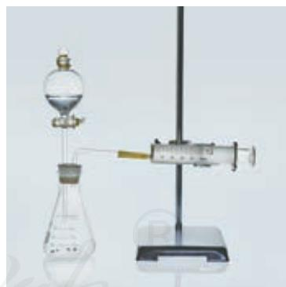

图2-1 测定锌与稀硫酸反应速率的装置

<table><tr><td>试剂</td><td>所用时间</td><td>反应速率</td><td>结论</td></tr><tr><td>1 mol/L H2SO4溶液</td><td></td><td></td><td></td></tr><tr><td>4 mol/L H2SO4溶液</td><td></td><td></td><td></td></tr></table>

# 【问题和讨论】

上述实验探究中，你用到了哪些科学方法？ 

在一般情况下，当其他条件相同时，增大反应物浓度，化学反应速率增大；降低反应物浓度，化学反应速率减小。升高温度，化学反应速率增大；降低温度，化学反应速率减小。大量实验证明，温度每升高 $10\,^{\circ}\mathrm{C}$ ，化学反应速率通常增大为原来的 $2\sim 4$ 倍。这表明温度对反应速率的影响非常显著。催化剂也可以改变化学反应速率。对于有气体参加的化学反应，改变压强同样可以改变化学反应速率。 

# 三、活化能

如何解释浓度、压强、温度及催化剂等因素对化学反应速率的影响呢？下面通过活化能和简单碰撞理论对这一问题进行讨论。 

研究发现，大多数化学反应并不是经过简单碰撞就能完成的，而往往经过多个反应步骤才能实现。例如， $2\mathrm{HI} = \mathrm{H}_2 + \mathrm{I}_2$ 实际上是经过下列两步反应完成的： 

$$
\begin{array}{l} 2 \mathrm {H I} \rightarrow \mathrm {H} _ {2} + 2 \mathrm {I} \cdot {} ^ {(1)} \\ 2 \mid \cdot \rightarrow \mid_ {2} \\ \end{array}
$$

每一步反应都称为基元反应，这两个先后进行的基元反应反映了 $2\mathrm{HI} = \mathrm{H}_2 + \mathrm{I}_2$ 的反应历程。反应历程又称反应机理。 

基元反应发生的先决条件是反应物的分子必须发生碰撞。以气体的反应为例，任何气体中分子间的碰撞次数都是非常巨大的。通常情况下，当气体的浓度为 $1 \, \mathrm{mol/L}$ 时，在每立方厘米、每秒内反应物分子间的碰撞可达到 $10^{28}$ 次。如果反应物分子间的任何一次碰撞都能发生反应的话，任何气体的反应均可以瞬间完成。但实际并非如此。这说明并不是反应物分子的每一次碰撞都能发生反应。我们把能够发生化学反应的碰撞叫做有效碰撞（如图2-2）。 

基元反应 

elementary reaction 

有效碰撞 effective collision 

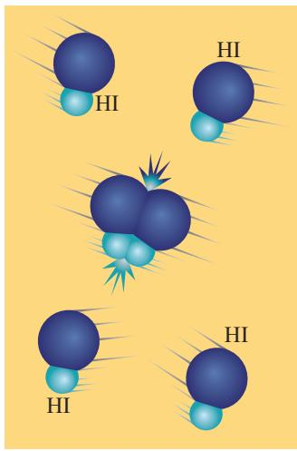

（1）碰撞时的能量不足

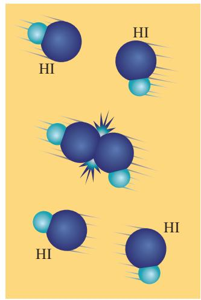

（2）碰撞时的取向不合适

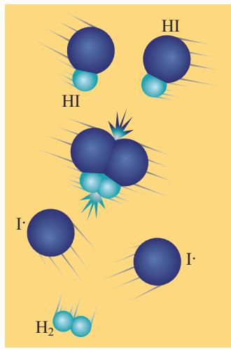

（3）有效碰撞

图2-2 HI分解反应中分子碰撞示意图

活化分子 

activated molecule 

活化能 

activation energy 

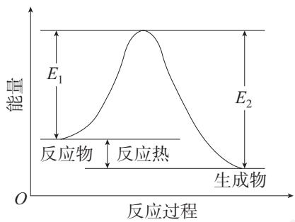

图2-3 化学反应中反应物、生成物的能量与活化能的关系

为什么分子碰撞时有的能发生化学反应，有的不能呢？在化学反应的过程中，反应物分子必须具有一定的能量，碰撞时还要有合适的取向，这样的碰撞才能使化学键断裂，从而发生化学反应。可见，发生有效碰撞的分子必须具有足够的能量，这种分子叫做活化分子。活化分子具有的平均能量与反应物分子具有的平均能量之差，叫做反应的活化能。 

如图2-3所示， $E_{1}$ 表示反应的活化能， $E_{2}$ 表示活化分子变成生成物分子放出的能量， $E_{1} - E_{2}$ 表示反应热。 

# 思考与讨论

请尝试用碰撞理论解释： 

(1) 当其他条件相同时, 为什么增大反应物的浓度会使化学反应速率增大, 而降低反应物的浓度会使化学反应速率减小? 

(2) 当其他条件相同时, 为什么升高温度会使化学反应速率增大, 而降低温度会使化学反应速率减小? 

对于某一化学反应来说，在一定条件下，反应物分子中活化分子的百分数是一定的，而单位体积内活化分子的数目与反应物分子的总数成正比，即与反应物的浓度成正 

比。当其他条件相同时，反应物浓度增大，单位体积内活化分子数增多，单位时间内有效碰撞的次数增加，化学反应速率增大。同理，可以解释反应物浓度降低会使化学反应速率减小。 

当其他条件相同时，升高温度，反应物分子的能量增加，使一部分原来能量较低的分子变成活化分子，从而增加了反应物分子中活化分子的百分数，使得单位时间内有效碰撞的次数增加，因而化学反应速率增大。同理，可以解释降低温度会使化学反应速率减小。 

目前，科学家普遍认为，催化剂之所以能改变化学反应速率，是因为它能改变反应历程，改变反应的活化能。如图2-4所示，图中实线和虚线分别表示无催化剂和有催化剂的反应过程中，反应物及生成物的能量与活化能的关系。显然，有催化剂时每一次反应的活化能比无催化剂时反应的活化能降低了很多。这就使更多的反应物分子成为活化分子，增大了单位体积内反应物分子中活化分子的数目，从而增大了化学反应速率。 

在现代化学工业中，催化剂的应用十分普遍。就近年来化学工业生产与技术的发展趋势而言，催化剂往往成为技术改造和更新的关键，从事这方面研究的科学家多次获得诺贝尔奖。在生命现象中也存在着大量的催化作用。例如，绿色植物的光合作用，动物体内蛋白质的分解等，都是在酶的催化下进行的。由于催化作用可以为化学工业生产带来巨大的经济效益，而且选择性极高的酶的生物催化作用有助于加深对生命过程的认识和模拟，所以催化剂的研究一直是高科技领域的重要内容。 

除了改变浓度、温度、压强及选用催化剂等，还有很多改变化学反应速率的方法。例如，通过光辐照、放射线辐照、超声波、电弧、强磁场、高速研磨等。总之，向反应体系输入能量，都有可能改变化学反应速率。 

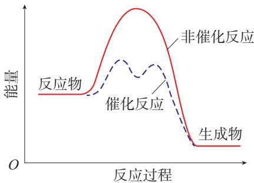

图2-4 催化剂改变反应历程、降低反应活化能示意图

# 飞秒化学

人们在观察客观事物的运动时，必须掌握与运动速率相对应的时间分辨技术。正像确定百米赛跑成绩，必须使用时间分辨精确到 $10^{-2}\mathrm{s}$ 的计时器。要跟踪和检测化学反应中某些寿命极短的中间体或过渡态，必须采用 $10^{-15} \sim 10^{-12}\mathrm{s}$ 的时间分辨技术，这种对超快速化学反应的研究被形象地称为飞秒（fs， $1\mathrm{fs} = 10^{-15}\mathrm{s}$ ）化学。这些研究对了解化学反应机理、控制反应进程、充分利用物质和能源等非常重要。例如，化学家泽维尔（A.H.Zewail，1946—2016）研究ICN发生光分解反应时，采用了可以分辨分子、原子飞秒级变动图像的激光脉冲技术，测得光分解反应 

$\mathrm{ICN} \rightarrow \mathrm{I} \cdot +\cdot \mathrm{CN}$ 的反应时间为 $(205 \pm 30) \times 10^{-15} \mathrm{s}$ 。在研究 $\mathrm{H}^{+}$ 与 $\mathrm{CO}_{2}$ 气态反应时，为了确定反应的开始时刻，泽维尔先使 $\mathrm{HI}$ 和 $\mathrm{CO}_{2}$ 形成分子聚合体，当 $\mathrm{I}^{+}$ 因光解离去时 $\mathrm{H}^{+}$ 仍处于过渡态 $\mathrm{H} \cdots \mathrm{O} \cdots \mathrm{CO}$ ，这就使他可以对下列反应的整个过程进行跟踪、观察： 

$$
\mathrm {H} ^ {\cdot} + \mathrm {C O} _ {2} \rightarrow \quad \mathrm {H} \dots \mathrm {O} \dots \mathrm {C O} \quad \rightarrow \quad \cdot \mathrm {O H} + \mathrm {C O}
$$

（始态） （过渡态） （终态） 

因在飞秒化学方面的突出贡献，1999年泽维尔获得诺贝尔化学奖。泽维尔的成就带给我们两个方面的启示：一方面，技术及设备（硬件）的改进是重要的；另一方面，研究中的长期积累和创新思维（软件）更为重要。 

# 练习与应用

1. 下列过程中，化学反应速率的增大对人类有益的是（ ）。 

A. 金属的腐蚀 

B. 食物的腐败 

C. 塑料的老化 

D. 氨的合成 

2. 下列对化学反应速率增大原因的分析错误的是（ ）。 

A. 对有气体参加的化学反应, 增大压强使容器容积减小, 单位体积内活化分子数增多 

B. 向反应体系中加入相同浓度的反应物, 使活化分子百分数增大 

C. 升高温度, 使反应物分子中活化分子百分数增大 

D. 加入适宜的催化剂, 使反应物分子中活化分子百分数增大 

3. 已知: $4 \mathrm{NH}_{3} + 5 \mathrm{O}_{2} = 4 \mathrm{NO} + 6 \mathrm{H}_{2} \mathrm{O}$ 。若反应速率分别用 $v(\mathrm{NH}_{3})$ 、 $v(\mathrm{O}_{2})$ 、 $v(\mathrm{NO})$ 、 $v(\mathrm{H}_{2} \mathrm{O})$ 表示, 则下列关系正确的是 ( )。 

A. $\frac{4}{5} v\left(\mathrm{NH}_{3}\right)=v\left(\mathrm{O}_{2}\right)$ 

B. $\frac{5}{6} v\left(\mathrm{O}_{2}\right) = v\left(\mathrm{H}_{2} \mathrm{O}\right)$ 

C. $\frac{2}{3} v\left(\mathrm{NH}_{3}\right) = v\left(\mathrm{H}_{2} \mathrm{O}\right)$ 

D. $\frac{4}{5} v\left(\mathrm{O}_{2}\right) = v(\mathrm{NO})$ 

4. 在容积不变的密闭容器中，A与B反应生成C，其化学反应速率分别用 $v(\mathrm{A})$ 、 $v(\mathrm{B})$ 、 $v(\mathrm{C})$ 表示。已知： $2v(\mathrm{B}) = 3v(\mathrm{A})$ ， $3v(\mathrm{C}) = 2v(\mathrm{B})$ ，则此反应可表示为（）。 

A. $2\mathrm{A} + 3\mathrm{\;B} = 2\mathrm{C}$ 

B. $\mathrm{A} + 3\mathrm{\;B} = 2\mathrm{C}$ 

C. $3 \mathrm{~A} + \mathrm{B} = 2 \mathrm{C}$ 

D. $\mathrm{A} + \mathrm{B} = \mathrm{C}$ 

5. 某反应过程的能量变化如右图所示。请填写下列空白。 

（1）反应过程 （填“a”或“b”）有催化剂参与。 

(2) 该反应为________反应（填“放热”或“吸热”），反应热为________。 

6. 以废旧铅酸蓄电池中的含铅废料和 $\mathrm{H}_{2} \mathrm{SO}_{4}$ 为原料, 可以制备高纯 $\mathrm{PbO}$ , 从而实现铅的再生利用。在此过程中涉及如下两个反应: 

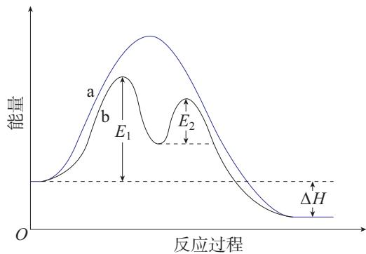

$① 2 \mathrm { F e } ^ { 2 + } + \mathrm { P b O } _ { 2 } + 4 \mathrm { H } ^ { + } + \mathrm { S O } _ { 4 } ^ { 2 - } = 2 \mathrm { F e } ^ { 3 + } + \mathrm { P b S O } _ { 4 } + 2 \mathrm { H } _ { 2 } \mathrm { O }$ 

$2\mathrm{Fe}^{3 + } + \mathrm{Pb} + \mathrm{SO}_4^{2 - } = 2\mathrm{Fe}^{2 + } + \mathrm{PbSO}_4$ 

（1）写出 $\mathrm{Pb}$ 与 $\mathrm{PbO}_2$ 反应生成 $\mathrm{PbSO}_4$ 的化学方程式。 

（2）在上述过程中， $\mathrm{Fe}^{2+}$ 的作用是什么？ 

（3）请设计实验方案证明 $\mathrm{Fe}^{2+}$ 的作用。 

7. 目前，常利用催化技术将汽车尾气中的NO和CO转化成 $\mathrm{CO}_{2}$ 和 $\mathrm{N}_{2}$ 。为研究如何增大该化学反应的速率，某课题组进行了以下实验探究。 

【提出问题】在其他条件不变的情况下，温度或催化剂的比表面积（单位质量的物质所具有的总面积）如何影响汽车尾气的转化速率？ 

【查阅资料】使用相同的催化剂，当催化剂质量相等时，催化剂的比表面积对催化效率有影响。 

【实验设计】请填写下表中的空白。 

<table><tr><td>编号</td><td>t/℃</td><td>c(NO)/(mol·L-1)</td><td>c(CO)/(mol·L-1)</td><td>催化剂的比表面积/(m2·g-1)</td></tr><tr><td>I</td><td>280</td><td>6.50×10-3</td><td>4.00×10-3</td><td>80.0</td></tr><tr><td>II</td><td></td><td></td><td></td><td>120</td></tr><tr><td>III</td><td>360</td><td></td><td></td><td>80.0</td></tr></table>

【图像分析与结论】三组实验中CO的浓度随时间的变化如右图所示。 

(1) 第 I 组实验中, 达到平衡时 NO 的浓度为 

(2) 由曲线 I、II 可知, 增大催化剂的比表面积, 该化学反应的速率将______（填 “增大” “减小” 或 “无影响”）。 

(3) 由实验 I 和 III 可得出的结论是 

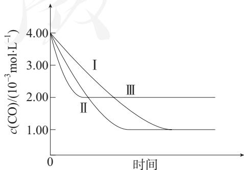

# 第二节化学平衡

在科学研究和化工生产中，只考虑化学反应速率是不够的。例如，在工业生产中，除了需要考虑使原料尽可能快地转化为产品，还需要考虑使原料尽可能多地转化为产品，这就涉及化学反应进行的限度，即化学平衡问题。 

# 一、化学平衡状态

很多化学反应是可逆的。例如，在一定条件下的容积不变的密闭容器中，合成氨反应如下： 

可逆反应 reversible reaction 

$$
\mathrm {N} _ {2} + 3 \mathrm {H} _ {2} \xrightarrow [ \text {催 化 剂} ]{\text {高 温 、 高 压}} 2 \mathrm {N H} _ {3}
$$

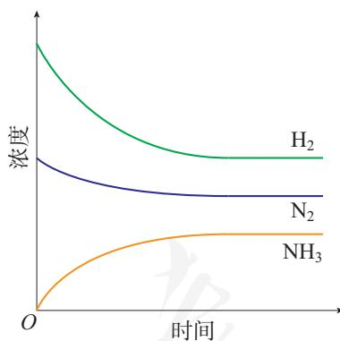

(a)

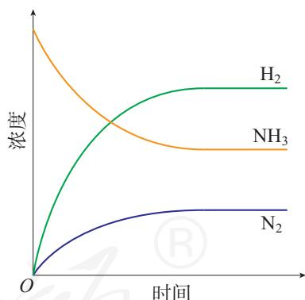

(b）

图2-5 合成氨反应中有关物质的浓度随时间变化示意图

如图2-5（a）所示， $\mathrm{N}_{2}$ 与 $\mathrm{H}_{2}$ 发生反应。随着反应的进行，体系中 $\mathrm{NH}_{3}$ 的浓度逐渐增大，而 $\mathrm{N}_{2}$ 与 $\mathrm{H}_{2}$ 的浓度逐渐减小。从某一时刻开始，它们的浓度均不再改变。 

如图2-5（b）所示， $\mathrm{NH}_3$ 发生分解反应。随着反应的进行，体系中 $\mathrm{N}_2$ 与 $\mathrm{H}_2$ 的浓度逐渐增大，而 $\mathrm{NH}_3$ 的浓度逐渐减小。从某一时刻开始，它们的浓度均不再改变。 

在一定条件下，像合成氨这样的可逆反应体系中，当正、逆反应的速率相等时，反应物和生成物的浓度均保持不变，即体系的组成不随时间而改变，这表明该反应中物质的转化达到了“限度”，这时的状态我们称之为化学平衡状态，简称化学平衡。化学平衡是一种动态平衡。 

综上所述，化学平衡状态是指在一定条件下的可逆反应，正反应和逆反应的速率相等，反应混合物中各组分的浓度保持不变的状态。 

化学平衡 

chemical equilibrium 

# 方法导引

# 图像分析

在分析化学问题时，常会运用反映相关量变化关系的图像。例如，溶解度曲线、物质浓度随时间变化的曲线等。在结合化学反应原理分析图像时，应注意下列几点： 

(1) 横坐标和纵坐标的含义; 

（2）曲线的斜率或者趋势； 

(3) 曲线上的特殊点, 如起点、终点、交点和拐点等; 

(4) 根据需要运用辅助线, 如等温线、等压线等。 

# 二、化学平衡常数

在一定温度下，化学平衡体系中反应物浓度与生成物浓度之间有什么关系呢？下面以反应 $\mathrm{H}_2(\mathrm{g}) + \mathrm{I}_2(\mathrm{g})\rightleftharpoons 2\mathrm{HI}(\mathrm{g})$ 为例进行分析。 

在 $457.6 \mathrm{C}$ 时, 该反应体系中各物质的浓度如表 2-1 所示。 

表 2-1 $457.6 \mathrm{C}$ 时反应体系 $\mathrm{H}_{2}(\mathrm{~g}) + \mathrm{I}_{2}(\mathrm{~g}) \rightleftharpoons 2 \mathrm{HI}(\mathrm{~g})$ 中各物质的浓度

<table><tr><td colspan="3">起始时各物质的浓度/(mol·L-1)</td><td colspan="3">平衡时各物质的浓度/(mol·L-1)</td><td>平衡时</td></tr><tr><td>c(H2)</td><td>c(I2)</td><td>c(HI)</td><td>c(H2)</td><td>c(I2)</td><td>c(HI)</td><td>c2(HI)/c(H2)·c(I2)</td></tr><tr><td>1.197×10-2</td><td>6.944×10-3</td><td>0</td><td>5.617×10-3</td><td>5.936×10-4</td><td>1.270×10-2</td><td>48.37</td></tr><tr><td>1.228×10-2</td><td>9.964×10-3</td><td>0</td><td>3.841×10-3</td><td>1.524×10-3</td><td>1.687×10-2</td><td>48.62</td></tr><tr><td>1.201×10-2</td><td>8.403×10-3</td><td>0</td><td>4.580×10-3</td><td>9.733×10-4</td><td>1.486×10-2</td><td>49.54</td></tr><tr><td>0</td><td>0</td><td>1.520×10-2</td><td>1.696×10-3</td><td>1.696×10-3</td><td>1.181×10-2</td><td>48.49</td></tr><tr><td>0</td><td>0</td><td>1.287×10-2</td><td>1.433×10-3</td><td>1.433×10-3</td><td>1.000×10-2</td><td>48.70</td></tr><tr><td>0</td><td>0</td><td>3.777×10-2</td><td>4.213×10-3</td><td>4.213×10-3</td><td>2.934×10-2</td><td>48.50</td></tr><tr><td colspan="6">c2(HI)/c(H2)·c(I2) 平均值</td><td>48.70</td></tr></table>

分析上表数据可知，该反应在 $457.6\,^{\circ}\mathrm{C}$ 达到平衡时， $\frac{c^{2}(\mathrm{HI})}{c(\mathrm{H}_{2}) \cdot c(\mathrm{I}_{2})}$ 是一个常数。 

对于一般的可逆反应： 

$$
m A (g) + n B (g) \Longleftrightarrow p C (g) + q D (g)
$$

在任意时刻的 $\frac{c^p(\mathrm{C})\cdot c^q(\mathrm{D})}{c^m(\mathrm{A})\cdot c^n(\mathrm{B})}$ 称为浓度商，常用 $Q$ 表示。进一步研究发现，当该反应在一定温度下达到化学平衡时， $c(\mathrm{A})$ 、 $c(\mathrm{B})$ 、 $c(\mathrm{C})$ 和 $c(\mathrm{D})$ 之间有： 

化学平衡常数 

chemical equilibrium constant 

$$
\frac {c ^ {p} (\mathrm {C}) \cdot c ^ {q} (\mathrm {D})}{c ^ {m} (\mathrm {A}) \cdot c ^ {n} (\mathrm {B})} = K
$$

其中 $K$ 是常数，称为化学平衡常数，简称平衡常数（固体或液体纯物质一般不列入浓度商和平衡常数）。化学平衡常数是表明化学反应限度的一个特征值，通常情况下只受温度影响。当反应中有关物质的浓度商等于平衡常数时，表明反应达到限度，即达到化学平衡状态。 

通常， $K$ 越大，说明平衡体系中生成物所占的比例越大，正反应进行的程度越大，即该反应进行得越完全，平衡时反应物的转化率越大；反之， $K$ 越小，该反应进行得越不完全，平衡时反应物的转化率越小。一般来说，当 $K > 10^{5}$ 时，该反应就进行得基本完全了。 

【例题1】在某温度下, 将含有 $\mathrm{H}_{2}$ 和 $\mathrm{I}_{2}$ 各 $0.10 \mathrm{~mol}$ 的 

气态混合物充入容积为 $10 \mathrm{~L}$ 的密闭容器中, 充分反应并达到平衡后, 测得 $c\left(\mathrm{H}_{2}\right)=0.0080 \mathrm{~mol} \cdot \mathrm{L}^{-1}$ 。 

（1）计算该反应的平衡常数。 

(2) 在上述温度下, 若起始时向该容器中通入 $\mathrm{H}_{2}$ 和 $\mathrm{I}_{2}(\mathrm{~g})$ 各 $0.20 \mathrm{~mol}$ , 试求达到化学平衡时各物质的浓度。 

【解】（1）依题意可知，平衡时 $c(\mathrm{H}_2) = 0.0080\mathrm{mol}\cdot \mathrm{L}^{-1}$ ，消耗 $c(\mathrm{H}_2) = 0.0020\mathrm{mol}\cdot \mathrm{L}^{-1}$ ，生成 $c(\mathrm{HI}) = 0.0040\mathrm{mol}\cdot \mathrm{L}^{-1}$ 。 

$$
\mathrm {H} _ {2} (\mathrm {g}) + \mathrm {I} _ {2} (\mathrm {g}) \rightleftharpoons 2 \mathrm {H I} (\mathrm {g})
$$

起始浓度 $\left(\mathrm{mol} \cdot \mathrm{L}^{-1}\right)$ 0.010 0.010 0 

变化浓度 $\left(\mathrm{mol} \cdot \mathrm{L}^{-1}\right)$ 0.0020 0.0020 0.0040 

平衡浓度 $\left(\mathrm{mol} \cdot \mathrm{L}^{-1}\right)$ 0.0080 0.0080 0.0040 

$$
K = \frac {c ^ {2} (\mathrm {H I})}{c \left(\mathrm {H} _ {2}\right) \cdot c \left(\mathrm {I} _ {2}\right)} = \frac {(0 . 0 0 4 0) ^ {2}}{(0 . 0 0 8 0) ^ {2}} = 0. 2 5
$$

（2）依题意可知，起始时 $c(\mathrm{H}_2) = 0.020\mathrm{mol}\cdot \mathrm{L}^{-1},$ $c(\mathrm{I}_2) = 0.020\mathrm{mol}\cdot \mathrm{L}^{-1}$ 

设 $\mathrm{H}_{2}$ 的变化浓度为 $x\mathrm{mol}\cdot \mathrm{L}^{-1}$ 。则： 

$$
\mathrm {H} _ {2} (\mathrm {g}) + \mathrm {I} _ {2} (\mathrm {g}) \rightleftharpoons 2 \mathrm {H I} (\mathrm {g})
$$

起始浓度 $/(\mathrm{mol} \cdot \mathrm{L}^{-1})$ 0.020 0.020 0 

变化浓度 $\mathrm{(mol\cdot L^{-1})}$ $x$ 2x 

平衡浓度 $\mathrm{(mol\cdot L^{-1})}$ 0.020-x 0.020-x $2x$ 

$K$ 只随温度发生变化，因此： 

$$
K = \frac {c ^ {2} (\mathrm {H I})}{c \left(\mathrm {H} _ {2}\right) \cdot c \left(\mathrm {I} _ {2}\right)} = \frac {(2 x) ^ {2}}{(0 . 0 2 0 - x) ^ {2}} = 0. 2 5
$$

解得: $x = 0.0040$ 

平衡时: $c\left(\mathrm{H}_{2}\right)=c \left(\mathrm{I}_{2}\right)=0.016 \mathrm{~mol} \cdot \mathrm{L}^{-1}, c(\mathrm{HI})=0.0080 \mathrm{~mol} \cdot \mathrm{L}^{-1}$ 

答：（1）该反应的平衡常数为0.25。 

（2）达到化学平衡时各物质的浓度分别为： $c(\mathrm{H}_2) = 0.016\mathrm{mol}\cdot \mathrm{L}^{-1}$ ， $c(\mathrm{I}_2) = 0.016\mathrm{mol}\cdot \mathrm{L}^{-1}$ ， $c(\mathrm{HI}) = 0.0080\mathrm{mol}\cdot \mathrm{L}^{-1}$ 。 

【例题2】在容积不变的密闭容器中, 将 $2.0 \mathrm{~mol} \mathrm{CO}$ 与 $10 \mathrm{~mol} \mathrm{H}_{2} \mathrm{O}$ 混合加热到 $830^{\circ} \mathrm{C}$ , 达到下列平衡: 

$$
\mathrm {C O} (\mathrm {g}) + \mathrm {H} _ {2} \mathrm {O} (\mathrm {g}) \rightleftharpoons \mathrm {C O} _ {2} (\mathrm {g}) + \mathrm {H} _ {2} (\mathrm {g})
$$

此时该反应的 $K$ 为1.0。求达到平衡时CO转化为 $\mathrm{CO}_{2}$ 的转化率。 

【解】设达到平衡时CO转化为 $\mathrm{CO}_{2}$ 的物质的量为 $x\mathrm{mol}$ ，容器的容积为 $y\mathrm{L}$ 。 

$$
\mathrm {C O} (\mathrm {g}) + \mathrm {H} _ {2} \mathrm {O} (\mathrm {g}) \rightleftharpoons \mathrm {C O} _ {2} (\mathrm {g}) + \mathrm {H} _ {2} (\mathrm {g})
$$

起始浓度 $\mathrm{(mol\cdot L^{-1})}$ 2.0 10 0 0 

变化浓度 $\mathrm{mol}\cdot \mathrm{L}^{-1})$ $\frac{x}{y}$ $\frac{x}{y}$ $\frac{x}{y}$ 

平衡浓度 $\mathrm{mol}\cdot \mathrm{L}^{-1})$ $\frac{2.0 - x}{y}$ $\frac{10 - x}{y}$ $\frac{x}{y}$ $\frac{x}{y}$ 

$$
\begin{array}{l} K = \frac {c \left(\mathrm {C O} _ {2}\right) \cdot c \left(\mathrm {H} _ {2}\right)}{c (\mathrm {C O}) \cdot c \left(\mathrm {H} _ {2} \mathrm {O}\right)} \\ = \frac {\left(\frac {x}{y}\right) ^ {2}}{\left(\frac {2 . 0 - x}{y}\right) \cdot \left(\frac {1 0 - x}{y}\right)} = 1. 0 \\ \end{array}
$$

$$
\begin{array}{l} x ^ {2} = (2. 0 - x) (1 0 - x) \\ = 2 0 - 1 2 x + x ^ {2} \\ \end{array}
$$

$$
x = \frac {5}{3}
$$

CO转化为 $\mathrm{CO}_{2}$ 的转化率为: $\frac{\frac{5}{3} \mathrm{~mol}}{2.0 \mathrm{~mol}} \times 100 \% = 83 \%$ 

答：达到平衡时CO转化为 $\mathrm{CO}_{2}$ 的转化率为 $83\%$ 。 

# 三、影响化学平衡的因素

在一定条件下，当一个可逆反应达到化学平衡状态后，如果改变浓度、压强、温度等条件，化学平衡状态是否会发生变化？如何变化？ 

# 1. 浓度对化学平衡的影响

# 【实验2-1】

向盛有 $5 \mathrm{~mL} 0.005 \mathrm{~mol} / \mathrm{L} \mathrm{FeCl}_{3}$ 溶液的试管中加入 $5 \mathrm{~mL}$ 

0.015 mol/L KSCN溶液，溶液呈红色。 

将上述溶液平均分装在a、b、c三支试管中，向试管b中加入少量铁粉，向试管c中滴加4滴1mol/L KSCN溶液，观察试管b、c中溶液颜色的变化，并均与试管a对比。 

<table><tr><td>实验</td><td>向试管b中加入少量铁粉</td><td>向试管c中滴加4滴1mol/L KSCN溶液</td></tr><tr><td>现象</td><td></td><td></td></tr></table>

在上述反应体系中存在下列平衡： 

$$
F e ^ {3 +} + 3 S C N ^ {-} \rightleftharpoons F e (S C N) _ {3}
$$

（浅黄色） （无色） （红色） 

实验表明，当向平衡混合物中加入铁粉或硫氰化钾溶液后，溶液的颜色都改变了，这说明平衡混合物的组成发生了变化。 

# 思考与讨论

(1) 在上述实验中, 化学平衡状态是否发生了变化? 你是如何判断的? 

（2）反应物或生成物浓度的改变是怎样影响化学平衡状态的？ 

（3）在一定温度下，当可逆反应达到平衡时，若浓度商增大或减小，化学平衡状态是否会发生变化？如何变化？ 

在一定条件下，当可逆反应达到平衡状态后，如果改变反应条件，平衡状态被破坏，平衡体系的物质组成也会随着改变，直至达到新的平衡状态。这种由原有的平衡状态达到新的平衡状态的过程叫做化学平衡的移动。 

实验证明，当可逆反应达到平衡时，在其他条件不变的情况下，如果增大反应物浓度（或减小生成物浓度），平衡向正反应方向移动；同理，如果减小反应物浓度（或增大生成物浓度），平衡向逆反应方向移动。 

在等温条件下，对于一个已达到化学平衡的反应，当改变反应物或生成物的浓度时，根据浓度商与平衡常数的大小关系，可以判断化学平衡移动的方向。 

当 $Q = K$ 时，可逆反应处于平衡状态； 

当 $Q < K$ 时, 化学平衡向正反应方向移动, 直至达到 

新的平衡状态； 

当 $Q > K$ 时，化学平衡向逆反应方向移动，直至达到新的平衡状态。 

在工业生产中，适当增大廉价的反应物的浓度，使化学平衡向正反应方向移动，可提高价格较高的原料的转化率，从而降低生产成本。 

# 2. 压强对化学平衡的影响

# 【实验2-2】

如图2-6所示，用 $50 \mathrm{~mL}$ 注射器吸入 $20 \mathrm{~mL} \mathrm{NO}_{2}$ 和 $\mathrm{N}_{2} \mathrm{O}_{4}$ 的混合气体（使注射器的活塞位于 I 处），将细管端用橡胶塞封闭。然后把活塞拉到 II 处，观察管内混合气体颜色的变化。当反复将活塞从 II 处推到 I 处及从 I 处拉到 II 处时，观察管内混合气体颜色的变化。 

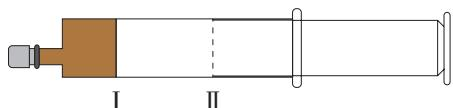

图2-6 压强对化学平衡的影响

<table><tr><td>实验</td><td>体系压强增大</td><td>体系压强减小</td></tr><tr><td>现象</td><td></td><td></td></tr><tr><td>结论</td><td></td><td></td></tr></table>

在上述反应体系中存在下列平衡： 

$$
2 \mathrm {N O} _ {2} (\mathrm {g}) \rightleftharpoons \mathrm {N} _ {2} \mathrm {O} _ {4} (\mathrm {g})
$$

（红棕色） （无色） 

实验表明，把注射器的活塞往外拉，管内容积增大，气体的压强减小，浓度减小，混合气体的颜色先变浅又逐渐变深。颜色逐渐变深是因为生成了更多的 $\mathrm{NO}_2$ 。把注射器的活塞往里推，管内容积减小，气体的压强增大，浓度增大，混合气体的颜色先变深又逐渐变浅。颜色逐渐变浅是因为消耗了更多的 $\mathrm{NO}_2$ 。 

# 思考与讨论

(1) 有气体参加的反应可能出现反应后气体体积增大、减小或不变三种情况。请根据这三种情况进行分析: 体系压强增大会使化学平衡状态发生怎样的变化? 

(2) 对于只有固体或液体参加的反应, 体系压强改变会使化学平衡状态发生变化吗? 

对于有气体参加的可逆反应，当达到平衡时，在其他条件不变的情况下，增大压强（减小容器的容积）会使化学平衡向气体体积缩小的方向移动；减小压强（增大容器的容积），会使平衡向气体体积增大的方向移动。反应后气体的总体积没有变化的可逆反应，增大或减小压强都不能使化学平衡发生移动。 

固态或液态物质的体积受压强影响很小，可以忽略不计。因此，当平衡混合物中都是固态或液态物质时，改变压强后化学平衡一般不发生移动。 

# 3. 温度对化学平衡的影响

对于放热或吸热的可逆反应，当反应达到平衡后，改变温度也会使化学平衡发生移动。 

# 【实验2-3】

如图2-7所示，把 $\mathrm{NO}_{2}$ 和 $\mathrm{N}_{2} \mathrm{O}_{4}$ 的混合气体通入两只连通的烧瓶，然后用弹簧夹夹住乳胶管；把一只烧瓶浸泡在热水中，另一只浸泡在冰水中。观察混合气体颜色的变化。 

<table><tr><td>实验</td><td>浸泡在热水中</td><td>浸泡在冰水中</td></tr><tr><td>现象</td><td></td><td></td></tr><tr><td>结论</td><td></td><td></td></tr></table>

前面已提及，在 $\mathrm{NO}_2$ 生成 $\mathrm{N}_2\mathrm{O}_4$ 的反应中，存在如下平衡： 

$$
2 \mathrm {N O} _ {2} (\mathrm {g}) \rightleftharpoons \mathrm {N} _ {2} \mathrm {O} _ {4} (\mathrm {g}) \quad \Delta H = - 5 6. 9 \mathrm {k J / m o l}
$$

实验表明，浸泡在热水中的烧瓶内红棕色加深，说明升高温度， $\mathrm{NO}_2$ 的浓度增大；浸泡在冰水中的烧瓶内红棕色变浅，说明降低温度， $\mathrm{NO}_2$ 的浓度减小。 

大量实验证明，在其他条件不变的情况下，升高温度，会使化学平衡向吸热反应的方向移动；降低温度，会使化学平衡向放热反应的方向移动。 

综上所述，改变浓度、压强、温度等因素可以提高反应产率或者抑制反应进行的程度。法国化学家勒夏特列 

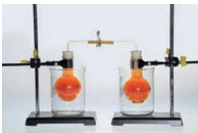

(a)

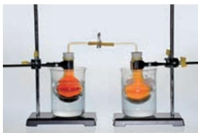

(b)

图2-7 装有 $\mathrm{NO}_2$ 和 $\mathrm{N}_2\mathrm{O}_4$ 混合气体的烧瓶（a），分别浸泡在热水（左）和冰水（右）中（b）

勒夏特列原理 

Le Chatelier principle 

(H.-L. Le Chatelier, 1850—1936) 曾就此总结出一条经验规律: 如果改变影响平衡的一个因素 (如温度、压强及参加反应的物质的浓度), 平衡就向着能够减弱这种改变的方向移动。这就是勒夏特列原理, 也称化学平衡移动原理。 

催化剂能够同等程度地改变正反应速率和逆反应速率，因此，它对化学平衡的移动没有影响。也就是说，催化剂不能改变达到化学平衡状态的反应混合物的组成，但是，使用催化剂能改变反应达到平衡所需的时间。 

化学平衡移动原理是经过反复验证的，在化学工业和环境保护等领域有十分重要的应用。根据化学平衡移动原理，可以更加科学、有效地调控和利用化学反应，尽可能地让化学反应按照人们的需要进行。 

# 科学史话

# 勒夏特列

图2-8 勒夏特列

勒夏特列，法国化学家。他一生的研究课题是多方面的。例如，研究水泥成分及不同条件下水泥的固化，改进测量高温用的温度计，证明钢淬火的科学意义，发 

明氧炔焰用于焊接等。勒夏特列还是研究合成氨的先驱。他一生的著述颇多，其中《高温测量》一书被译成多种文字，被公认是一本经典著作。 

勒夏特列在研究高炉内发生的化学反 

应时认为，因为 $\mathrm{C} + \mathrm{CO}_{2} \rightleftharpoons 2 \mathrm{CO}$ 是可逆反应，所以炉气中存在一定比例的 $\mathrm{CO}$ 是不可避免的。这使他认识到研究影响平衡因素的重要性。 

根据大量的事实，勒夏特列于1884年提出了“平衡移动原理”。1888年他又用简洁的语言阐明了这一原理：每一种影响平衡因素的变化都会使平衡向减少这种影响的方向移动。后人为纪念勒夏特列，便把“平衡移动原理”称为“勒夏特列原理”。该原理被广泛应用于工业生产中，大大提高了生产效率。 

# 研究与实践

# 了解汽车尾气的治理

# 【研究目的】

汽车等交通工具为出行、物流带来了舒适和方便。然而，燃油车排放的尾气中含有大量的有害物质，会对人体健康和环境产生危害。通过本活动，认识反应条件的选择与优化在治理汽车尾气中的重要作用，增强自觉遵守法规、保护生态环境的意识和责任感。 

# 【研究任务】

(1) 认识尾气的成分及其危害。 

(1)以汽油的成分之一——辛烷 $\left(\mathrm{C}_{8} \mathrm{H}_{18}\right)$ 为例，分析空气燃油比、温度等因素对燃烧及其尾气排放的影响。 

②查阅资料，了解汽车尾气中有害物质的成因及危害。 

(2) 通过多种途径了解尾气的治理。 

(1)了解我国汽车尾气的排放标准和治理现状。 

②了解汽车尾气三元催化转化中涉及的化学原理。 

(3)了解选择性催化还原（SCR）技术在柴油车尾气治理中的应用。 

# 【结果与讨论】

(1) 通过调查和分析, 你得到什么启示? 

(2) 撰写研究报告，并与同学讨论。 

1. 在一定温度下, 反应 $\mathrm{A}(\mathrm{g}) + 3 \mathrm{~B}(\mathrm{g}) \rightleftharpoons 2 \mathrm{C}(\mathrm{g})$ 达到平衡, 该反应的平衡常数表达式为 $K=$ 。若平衡时各物质的浓度分别为: $c(\mathrm{A}) = 2.0 \mathrm{~mol} / \mathrm{L}, c(\mathrm{B}) = 2.0 \mathrm{~mol} / \mathrm{L}, c(\mathrm{C}) = 1.0 \mathrm{~mol} / \mathrm{L}$ , 则 $K=$ 

2. 在一定条件下的密闭容器中发生反应: $\mathrm{C}_{2} \mathrm{H}_{6}(\mathrm{~g}) \rightleftharpoons \mathrm{C}_{2} \mathrm{H}_{4}(\mathrm{~g}) + \mathrm{H}_{2}(\mathrm{~g}) \quad \Delta H > 0$ 。当达到平衡时, 下列各项措施中, 不能提高乙烷转化率的是 ( )。 

A. 增大容器的容积 

B. 升高反应的温度 

C.分离出部分氢气 

D.等容下通入稀有气体 

3. 在一定温度下的容积不变的密闭容器中发生反应: $\mathrm{X(g) + 2Y(g)}\rightleftharpoons 3\mathrm{Z(g)}$ 。下列叙述中, 能说明反应达到化学平衡状态的是 ( )。 

A. Z 的生成速率与 Z 的分解速率相等 

B. 单位时间内消耗 $a \mathrm{~mol} \mathrm{X}$ , 同时生成 $3 a \mathrm{~mol} Z$ 

C. 容器内的压强不再变化 

D. 混合气体总的物质的量不再变化 

4. 在一定温度下的密闭容器中发生反应: $x \mathrm{~A}(\mathrm{g}) + y \mathrm{~B}(\mathrm{g}) \rightleftharpoons z \mathrm{C}(\mathrm{g})$ , 平衡时测得 A 的浓度为 $0.50 \mathrm{~mol} / \mathrm{L}$ 。保持温度不变, 将容器的容积扩大到原来的两倍, 再达平衡时, 测得 A 的浓度为 $0.30 \mathrm{~mol} / \mathrm{L}$ 。下列有关判断正确的是 ( )。 

A. $x + y <   z$ 

B. 平衡向正反应方向移动 

C. B 的转化率降低 

D. C 的体积分数减小 

5. 在容积不变的密闭容器中，一定量的 $\mathrm{SO}_2$ 与 $\mathrm{O}_2$ 发生反应： $2\mathrm{SO}_2(\mathrm{g}) + \mathrm{O}_2(\mathrm{g}) \rightleftharpoons 2\mathrm{SO}_3(\mathrm{g})$ 。温度分别为 $t_1$ 和 $t_2$ 时， $\mathrm{SO}_3$ 的体积分数随时间的变化如右图。该反应的 $\Delta H_{\text{一}}0$ （填“>”“<”或“=”，下同）；若 $t_1$ 、 $t_2$ 时该反应的化学平衡常数分别为 $K_1$ 、 $K_2$ ，则 $K_1 = K_2$ 。 

6. 甲醇是重要的化工原料，应用前景广阔。研究表明，二氧化碳与氢气反应可以合成甲醇，反应如下： 

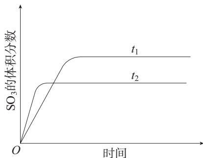

$$
\mathrm {C O} _ {2} (\mathrm {g}) + 3 \mathrm {H} _ {2} (\mathrm {g}) \rightleftharpoons \mathrm {C H} _ {3} \mathrm {O H} (\mathrm {g}) + \mathrm {H} _ {2} \mathrm {O} (\mathrm {g})
$$

（1）反应的平衡常数表达式为 $K =$ 

(2) 有利于提高平衡时 $\mathrm{CO}_{2}$ 转化率的措施有____（填字母）。 

a.使用催化剂 

b. 加压 

c. 增大 $\mathrm{CO}_{2}$ 和 $\mathrm{H}_{2}$ 的初始投料比 

(3) 研究温度对甲醇产率的影响时发现, 在 $210 \sim 290^{\circ} \mathrm{C}$ , 保持原料气中 $\mathrm{CO}_{2}$ 和 $\mathrm{H}_{2}$ 的投料比不变, 得到平衡时甲醇的产率与温度的关系如右图所示, 则该反应的 $\Delta H_{\text {一}}$ _____0 (填 “>” “=” 或 “<”), 依据是 

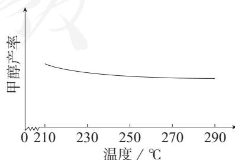

7. 已知一氧化碳与水蒸气的反应为: $\mathrm{CO(g) + H_2O(g)} \rightleftharpoons \mathrm{CO_2(g) + H_2(g)}$ 。在 $830^{\circ}\mathrm{C}$ 时该反应的平衡常数是 1.0 。如果反应开始时, 一氧化碳和水蒸气的浓度都是 $0.1\mathrm{mol/L}$ , 计算一氧化碳在此反应条件下的转化率。 

# 第三节

# 化学反应的方向

自然界中有一些过程是自发进行的，而且是有方向性的。例如，水总是自发地从高处流向低处（如图2-9），而相反的过程却不能自发进行。有些化学反应也是自发进行的，而且具有方向性。那么，如何判断化学反应自发进行的方向呢？ 

实验发现，大多数放热反应是可以自发进行的。例如，下列反应： 

$$
\begin{array}{l} \mathrm {H} _ {2} (\mathrm {g}) + \frac {1}{2} \mathrm {O} _ {2} (\mathrm {g}) = \mathrm {H} _ {2} \mathrm {O} (\mathrm {l}) \quad \Delta H = - 2 8 5. 8 \mathrm {k J / m o l} \\ Z n (s) + C u S O _ {4} (a q) = Z n S O _ {4} (a q) + C u (s) \\ \Delta H = - 2 1 6. 8 \mathrm {k J} / \mathrm {m o l} \\ \end{array}
$$

因此，有人认为，只有放热的反应才能自发进行，可以根据化学反应是吸热的还是放热的来判断化学反应的方向。而事实表明，有些吸热反应也可以自发进行。 

例如，通过实验知道， $\mathrm{Ba(OH)}_2 \cdot 8\mathrm{H}_2\mathrm{O}$ 晶体与 $\mathrm{NH}_4\mathrm{Cl}$ 晶体的反应是吸热的，但是这个反应却是可以自发进行的。又如： 

$$
\begin{array}{l} 2 \mathrm {N} _ {2} \mathrm {O} _ {5} (\mathrm {g}) = 4 \mathrm {N O} _ {2} (\mathrm {g}) + \mathrm {O} _ {2} (\mathrm {g}) \quad \Delta H = + 1 0 9. 8 \mathrm {k J / m o l} \\ \mathrm {N a H C O} _ {3} (\mathrm {s}) + \mathrm {H C l} (\mathrm {a q}) = \mathrm {N a C l} (\mathrm {a q}) + \mathrm {C O} _ {2} (\mathrm {g}) + \mathrm {H} _ {2} \mathrm {O} (\mathrm {l}) \\ \Delta H = + 3 1. 4 \mathrm {k J} / \mathrm {m o l} \\ \end{array}
$$

这些吸热反应都是可以自发进行的。所以，不能只根据放热或者吸热来判断化学反应的方向。 

实验还发现，自发过程进行的方向还与“混乱度”有关。如图2-10所示，两个集气瓶中分别盛有氯气和氢气，开始时中间用玻璃片隔开，当抽掉玻璃片后，可以观察到 

图2-9 水总是自发地从高处流向低处

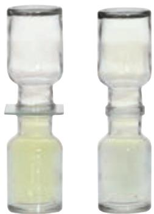

图2-10 气体的自发扩散过程

熵 entropy 

盛放氯气的瓶内气体颜色逐渐变浅，而盛放氢气的瓶内显现出了浅黄绿色，最后两瓶中气体的颜色相同。不需要外界的任何作用，气体通过分子的扩散自发地混合均匀。又如，硝酸铵溶于水的过程可以自发进行。溶解前， $\mathrm{NH}_{4}^{+}$ 和 $\mathrm{NO}_{3}^{-}$ 在硝酸铵晶体中有序地排列；溶解后，被水分子包围着的 $\mathrm{NH}_{4}^{+}$ 和 $\mathrm{NO}_{3}^{-}$ 则在溶液中自由移动。 

显然，这些过程都是自发地从混乱度小（有序）向混乱度大（无序）的方向进行。 

科学家用熵（符号为 $S$ ）来度量这种混乱的程度。对于同一种物质，气态时的熵值最大、液态时的次之、固态时的最小。从上面的例子似乎可以得出，体系有自发地向混乱度增加（即熵增， $\Delta S > 0$ ）的方向转变的倾向。例如： 

$$
\begin{array}{l} Z n (s) + H _ {2} S O _ {4} (a q) = Z n S O _ {4} (a q) + H _ {2} (g) \\ 2 \mathrm {K C l O} _ {3} (\mathrm {s}) = 2 \mathrm {K C l} (\mathrm {s}) + 3 \mathrm {O} _ {2} (\mathrm {g}) \\ \end{array}
$$

这些自发进行的化学反应都是熵增的过程，即 $\Delta S > 0$ 。但是，有些熵减的过程也能自发进行。例如，乙烯聚合为聚乙烯的反应，是熵减的过程，即 $\Delta S < 0$ ，却能够自发进行。 

再如： 

$$
\begin{array}{l} 2 \mathrm {N O} (\mathrm {g}) + 2 \mathrm {C O} (\mathrm {g}) = \mathrm {N} _ {2} (\mathrm {g}) + 2 \mathrm {C O} _ {2} (\mathrm {g}) \\ 4 \mathrm {F e} (\mathrm {O H}) _ {2} (\mathrm {s}) + \mathrm {O} _ {2} (\mathrm {g}) + 2 \mathrm {H} _ {2} \mathrm {O} (\mathrm {l}) = 4 \mathrm {F e} (\mathrm {O H}) _ {3} (\mathrm {s}) \\ \end{array}
$$

这些化学反应的 $\Delta S < 0$ ，但是都可以自发进行。所以，不能只根据熵增或熵减来判断化学反应进行的方向。事实上，只有孤立体系（与环境既没有物质交换也没有能量交换）或者绝热体系（与环境既没有物质交换也没有热量交换），自发过程才向着熵增的方向进行。 

自发反应的方向与焓变和熵变有关，但焓变和熵变又都不能单独作为判断反应自发进行方向的依据。要判断反应自发进行的方向，必须综合考虑体系的焓变和熵变。 

大量事实告诉我们，综合考虑焓变和熵变可以判断反 

应自发进行的方向。正确判断反应自发进行的方向对于生产实践具有重要的意义。在工业生产中，对能够发生的化学反应，研究和选择合适的反应条件才有实际意义，否则，可能是徒劳无功的。因此，判断化学反应的方向非常重要。综合焓变和熵变判断化学反应的方向已经超出了中学化学的要求，有兴趣的同学可以通过下面的“资料卡片”做一些简单的了解。 

# 资料卡片

# 自由能与化学反应的方向

在等温、等压条件下的封闭体系中（不考虑体积变化做功以外的其他功），自由能（符号为 $G$ ，单位为 $\mathrm{kJ / mol}$ ）的变化综合反映了体系的焓变和熵变对自发过程的影响： $\Delta G = \Delta H - T\Delta S$ 。这时，化学反应总是向着自由能减小的方向进行，直到体系达到平衡。即： 

当 $\Delta G < 0$ 时，反应能自发进行； 

当 $\Delta G = 0$ 时，反应处于平衡状态； 

当 $\Delta G > 0$ 时，反应不能自发进行。 

$\Delta G$ 不仅与焓变和熵变有关，还与温度有关。 

由上述关系式可推知： 

当 $\Delta H < 0$ ， $\Delta S > 0$ 时，反应能自发进行； 

当 $\Delta H > 0$ ， $\Delta S < 0$ 时，反应不能自发进行； 

当 $\Delta H > 0$ ， $\Delta S > 0$ 或 $\Delta H < 0$ ， $\Delta S < 0$ 时，反应能否自发进行与温度有关。一般低温时 $\Delta H$ 的影响为主，高温时 $\Delta S$ 的影响为主，而温度影响的大小要视 $\Delta H$ 、 $\Delta S$ 的数值而定。 

# 练习与应用

1. 举出几种日常生活中常见的由于熵增使其过程自发进行的实例。 

2. 在下列变化中，体系的熵将发生怎样的变化？ 

（1）冰熔化 

（2）水蒸气冷凝 

（3）蔗糖在水中溶解 

(4) $\mathrm{HCl(g)} + \mathrm{NH_3(g)} = \mathrm{NH_4Cl(s)}$ 

3. 水凝结成冰的过程中，其焓变和熵变正确的是（ ）。 

A. $\Delta H > 0, \Delta S < 0$ 

B. $\Delta H < 0, \Delta S > 0$ 

C. $\Delta H > 0, \Delta S > 0$ 

D. $\Delta H < 0, \Delta S < 0$ 

4.下列说法中，正确的是（ ）。 

A. 冰在室温下自动熔化成水，这是熵增的过程 

B. 能够自发进行的反应一定是放热反应 

C. $\Delta H < 0$ 的反应均是自发进行的反应 

D. 能够自发进行的反应一定是熵增的过程 

# 第四节

# 化学反应的调控

我们对化学反应的调控并不陌生。例如，为了灭火，可以采取隔离可燃物、隔绝空气或降低温度等措施；为了延长食物储存时间，可以将它们保存在冰箱中。下面我们以工业合成氨生产条件的选择为例，研究化学反应的调控问题。 

工业合成氨是人类科学技术的一项重大突破，其反应如下： 

$$
\mathrm {N} _ {2} (\mathrm {g}) + 3 \mathrm {H} _ {2} (\mathrm {g}) \rightleftharpoons 2 \mathrm {N H} _ {3} (\mathrm {g}) \quad \Delta H = - 9 2. 4 \mathrm {k J / m o l}
$$

# 思考与讨论

# （1）原理分析

根据合成氨反应的特点，应如何选择反应条件，以增大合成氨的反应速率、提高平衡混合物中氨的含量？请填入下表。 

<table><tr><td rowspan="2">对合成氨反应
的影响</td><td colspan="4">影响因素</td></tr><tr><td>浓度</td><td>温度</td><td>压强</td><td>催化剂</td></tr><tr><td>增大合成氨的
反应速率</td><td></td><td></td><td></td><td></td></tr><tr><td>提高平衡混合物
中氨的含量</td><td></td><td></td><td></td><td></td></tr></table>

# (2) 数据分析

表2-2中的实验数据是在不同温度、压强下，平衡混合物中氨的含量的变化情况（初始时氮气和氢气的体积比是1:3）。分析表中数据，结合合成氨反应的特点，讨论应如何选择反应条件，以增大合成氨的反应速率、提高平衡混合物中氨的含量。 

表 2-2 不同条件下,合成氨反应达到化学平衡时反应混合物中氨的含量(体积分数)

<table><tr><td rowspan="2">温度/℃</td><td colspan="6">氨的含量/%</td></tr><tr><td>0.1 MPa</td><td>10 MPa</td><td>20 MPa</td><td>30 MPa</td><td>60 MPa</td><td>100 MPa</td></tr><tr><td>200</td><td>15.3</td><td>81.5</td><td>86.4</td><td>89.9</td><td>95.4</td><td>98.8</td></tr><tr><td>300</td><td>2.20</td><td>52.0</td><td>64.2</td><td>71.0</td><td>84.2</td><td>92.6</td></tr><tr><td>400</td><td>0.40</td><td>25.1</td><td>38.2</td><td>47.0</td><td>65.2</td><td>79.8</td></tr><tr><td>500</td><td>0.10</td><td>10.6</td><td>19.1</td><td>26.4</td><td>42.2</td><td>57.5</td></tr><tr><td>600</td><td>0.05</td><td>4.50</td><td>9.10</td><td>13.8</td><td>23.1</td><td>31.4</td></tr></table>

综合上述两个方面，分析增大合成氨的反应速率与提高平衡混合物中氨的含量所应采取的措施是否一致。 

升高温度、增大压强、增大反应物浓度及使用催化剂等，都可以使合成氨的反应速率增大；降低温度、增大压强、增大反应物浓度等有利于提高平衡混合物中氨的含量。催化剂可以增大反应速率，但不改变平衡混合物的组成。那么，在实际生产中到底选择哪些适宜的条件呢？ 

# 1. 压强

原理分析和对实验数据的分析均表明，合成氨时压强越大越好（如图2-11）。但是，压强越大，对材料的强度和设备的制造要求就越高，需要的动力也越大，这将会大大增加生产投资，并可能降低综合经济效益。目前，我国的合成氨厂一般采用的压强为 $10\mathrm{MPa}\sim 30\mathrm{MPa}$ 。 

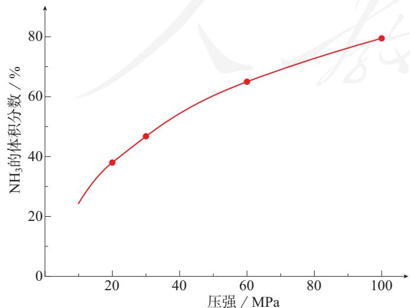

图2-11 $400\%$ 下平衡时氨的体积分数随压强的变化示意图

# 2. 温度

根据平衡移动原理，合成氨应该采用低温以提高平衡转化率。实验数据也说明了这一点（如图2-12）。但是，温度降低会使化学反应速率减小，达到平衡所需时间变长，这在工业生产中是很不经济的。因此，需要选择一个适宜的温度。目前，在实际生产中一般采用的温度为 $400\sim 500^{\circ}\mathrm{C}$ 。 

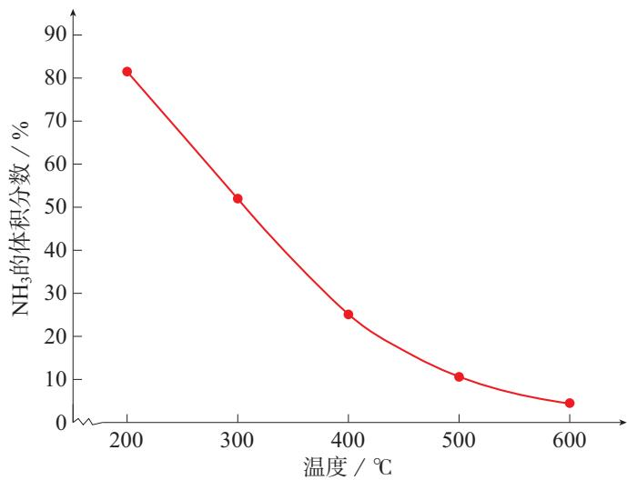

图2-12 $10\mathrm{MPa}$ 下平衡时氨的体积分数随温度的变化示意图

# 3. 催化剂

即使在高温、高压下， $\mathrm{N}_2$ 和 $\mathrm{H}_2$ 的化合反应仍然进行得十分缓慢。通常采用加入催化剂的方法，改变反应历程，降低反应的活化能，使反应物在较低温度时能较快地发生反应。目前，合成氨工业中普遍使用的是以铁为主体的多成分催化剂，又称铁触媒。铁触媒在 $500^{\circ}\mathrm{C}$ 左右时的活性最大，这也是合成氨一般选择 $400\sim 500^{\circ}\mathrm{C}$ 进行的重要原因。另外，为了防止混有的杂质使催化剂“中毒”①，原料气必须经过净化。 

由表2-2可以看出，即使是在 $500\,^{\circ}\mathrm{C}$ 和 $30\,\mathrm{MPa}$ 时，合成氨平衡混合物中 $\mathrm{NH}_3$ 的体积分数也只有 $26.4\%$ ，即平衡时 $\mathrm{N}_2$ 和 $\mathrm{H}_2$ 的转化率仍不够高。在实际生产中，还需要考虑浓度对化学平衡的影响等。例如，采取迅速冷却的方法，使气态氨变成液氨后及时从平衡混合物中分离出去，以促使化学平衡向生成 $\mathrm{NH}_3$ 的方向移动（如图2-13）。此外，如果 

让 $\mathrm{N}_{2}$ 和 $\mathrm{H}_{2}$ 的混合气体只一次通过合成塔发生反应也是很不经济的，应将 $\mathrm{NH}_{3}$ 分离后的原料气循环使用，并及时补充 $\mathrm{N}_{2}$ 和 $\mathrm{H}_{2}$ ，使反应物保持一定的浓度，以利于合成氨反应。 

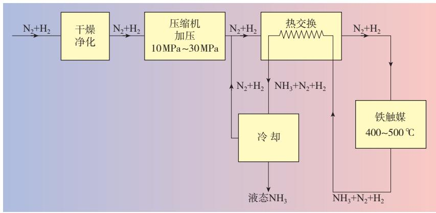

图2-13 合成氨生产流程示意图

综上所述，工业上通常采用铁触媒、在 $400 \sim 500^{\circ} \mathrm{C}$ 和 $10 \mathrm{MPa} \sim 30 \mathrm{MPa}$ 的条件下合成氨。 

总之，影响化学反应进行的因素主要有两个方面，首先是参加反应的物质组成、结构和性质等本身因素，其次是温度、压强、浓度、催化剂等反应条件。化学反应的调控，就是通过改变反应条件使一个可能发生的反应按照某一方向进行。在实际生产中常常需要结合设备条件、安全操作、经济成本等情况，综合考虑影响化学反应速率和化学平衡的因素，寻找适宜的生产条件。此外，还要根据环境保护及社会效益等方面的规定和要求做出分析，权衡利弊，才能实施生产。 

# 科学·技术·社会

# 合成氨——实验室研究与工业化生产

氨是最基本的化工原料之一，其人工制备的研究最早要追溯到1898年。当时，德国的弗兰克（A. Frank，1834—1916）等人研究出了氮气与碳化钙（ $\mathrm{CaC}_2$ ）、水蒸气反应制备氨的方法。随后，这种方法被工业化。但是，由于成本过高，无法进行大规模生产。于是，开发更加廉价可行的合成氨方法成了当时化工领 

域非常瞩目的研究方向。 

德国化学家哈伯（F. Haber，1868—1934）从1902年开始研究氮气和氢气直接合成氨，并于1908年申请了循环法合成氨的专利。该专利主要包括以下过程：气体通过高温催化剂；低温除氨后再次循环，通过高温催化剂；全过程在一定压强下进行；进出催化剂床的 

冷、热气体进行热交换；用蒸发成品氨来冷却离开催化剂的气体。图2-14所示为哈伯所用合成氨的实验装置。 

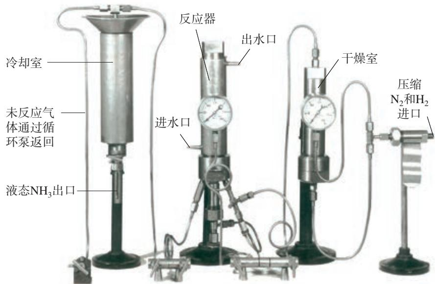

图2-14 哈伯合成氨实验所用的装置

哈伯在此基础上继续进行了大量的实验研究，于1909年申报了高压专利，以及用锇作催化剂和用铀-碳化铀作催化剂的专利。他发现，用锇作催化剂，在 $17.5\mathrm{MPa}\sim 20.0\mathrm{MPa}$ 及 $500\sim 600^{\circ}C$ 下，氨的含量可超过 $6\%$ ，具备了实现工业化生产的可能性。德国一家公司购买了哈伯的专利，对他的研究及工业化试验给予资助，并委任德国化学家博施（C.Bosch，1874—1940）全权负责该项目的开发。 

博施认识到，将此法进行工业化生产试验所面临的问题主要有以下几个方面。 

- 设计获得大量廉价原料气体的方法：采用水煤气（主要成分为 $\mathrm{H}_{2}$ 和 $\mathrm{CO}$ ）作为氢气的来源；氮气由液化空气分离法提供。 

- 寻找高效、稳定的催化剂：哈伯推荐的催化剂，由于价格、来源和性能等原因不宜作工业用。为了寻找合适的催化剂，博施及其研究组进行了大量的试验，一直到1922年，共进行了超过2500种配方的20000多次 

试验，终于筛选出了合成氨工业用催化剂。尽管后来不断地改进，但这种类型的催化剂一直沿用至今。 

- 开发适合高温、高压下的合成设备：1910年，用低碳钢制造的合成反应器无法承受高温、高压下氢气的腐蚀，组建合成氨设备成了关键问题。博施及其研究组经过反复试验，找到了用熟铁作衬里的办法。 

至此，合成氨生产的技术难题终于被解决。哈伯完成了合成氨的基础开发工作，博施实现了合成氨的工业化，所 

以，这种合成氨的工业方法被称为“哈伯-博施法”。 

哈伯因发明用氮气和氢气合成氨的方法获得1918年诺贝尔化学奖。博施因开发合成氨采用的高压方法而获得了1931年诺贝尔化学奖。可以说，合成氨技术是人类科学技术领域的重大突破。 

到目前为止，氨的合成实现工业化生产已经100多年了，使用的催化剂和当初开发的依然类似。据统计，全世界在合成氨工业上消耗的能源占全人类能源消耗的 $1\% \sim 2\%$ 。为了降低合成氨的能耗，人们一直试图对合成条件进行优化。2016年，中国科学院大连化学物理研究所的研究团队研制了一种新型催化剂，将合成氨的温度、压强分别降到了 $350~\mathrm{^\circ C}$ 、1MPa，这是近年来合成氨反应研究中的重要突破，为发展更加节能的催化剂提供了新的思路。 

1.合成氨工业中采用循环操作，主要是为了（ ）。 

A. 增大化学反应速率 

B. 提高平衡混合物中氨的含量 

C. 降低氨的沸点 

D. 提高氮气和氢气的利用率 

2. 在密闭容器中，通入 $a\mathrm{mol}\mathrm{N}_2$ 和 $b\mathrm{mol}\mathrm{H}_2$ ，在一定条件下反应达到平衡时，容器中剩余 $c\mathrm{mol}\mathrm{N}_2$ 。 

(1) 达到平衡时, 生成 $\mathrm{NH}_{3}$ 的物质的量为 

（2）达到平衡时， $\mathrm{H}_{2}$ 的转化率为 

(3) 若把容器的容积减小到原来的 $\frac{1}{2}$ , 则正反应速率______(填 “增大” “减小” 或 “不变”, 下同),逆反应速率______, $\mathrm{N}_{2}$ 的转化率_____。 

3. 在硫酸工业中，通过下列反应使 $\mathrm{SO}_2$ 氧化为 $\mathrm{SO}_3: 2\mathrm{SO}_2(\mathrm{g}) + \mathrm{O}_2(\mathrm{g}) \rightleftharpoons 2\mathrm{SO}_3(\mathrm{g})$ $\Delta H = -196.6 \mathrm{~kJ} / \mathrm{mol}$ 。下表列出了在不同温度和压强下，反应达到平衡时 $\mathrm{SO}_2$ 的转化率。 

<table><tr><td rowspan="2">温度/℃</td><td colspan="5">平衡时SO2的转化率/%</td></tr><tr><td>0.1 MPa</td><td>0.5 MPa</td><td>1 MPa</td><td>5 MPa</td><td>10 MPa</td></tr><tr><td>450</td><td>97.5</td><td>98.9</td><td>99.2</td><td>99.6</td><td>99.7</td></tr><tr><td>550</td><td>85.6</td><td>92.9</td><td>94.9</td><td>97.7</td><td>98.3</td></tr></table>

(1) 从理论上分析, 为了使二氧化硫尽可能多地转化为三氧化硫, 应选择的条件是 

(2) 在实际生产中, 选定的温度为 $400 \sim 500^{\circ} \mathrm{C}$ , 原因是 

（3）在实际生产中，采用的压强为常压，原因是 

(4) 在实际生产中, 通入过量的空气, 原因是 

(5) 尾气中的 $\mathrm{SO}_{2}$ 必须回收, 原因是 

4. 在合成氨工业中，原料气（ $\mathrm{N}_2$ 、 $\mathrm{H}_2$ 及少量 $\mathrm{CO}$ 、 $\mathrm{NH}_3$ 的混合气）在进入合成塔前需经过铜氨液处理，目的是除去其中的 $\mathrm{CO}$ ，其反应为： $[\mathrm{Cu}(\mathrm{NH}_3)_2]^+ + \mathrm{CO} + \mathrm{NH}_3 \rightleftharpoons [\mathrm{Cu}(\mathrm{NH}_3)_3\mathrm{CO}]^+$ $\Delta H < 0$ 。 

（1）铜氨液吸收CO适宜的生产条件是 

(2) 吸收 $\mathrm{CO}$ 后的铜氨液经过适当处理可再生, 恢复其吸收 $\mathrm{CO}$ 的能力, 可循环使用。铜氨液再生适宜的生产条件是 

5. 氢能是一种极具发展潜力的清洁能源。下列反应是目前大规模制取氢气的方法之一。 

$$
\mathrm {C O} (\mathrm {g}) + \mathrm {H} _ {2} \mathrm {O} (\mathrm {g}) \rightleftharpoons \mathrm {C O} _ {2} (\mathrm {g}) + \mathrm {H} _ {2} (\mathrm {g}) \quad \Delta H = - 4 1. 2 \mathrm {k J / m o l}
$$

(1) 在生产中, 欲使 $\mathrm{CO}$ 的转化率提高, 同时提高 $\mathrm{H}_{2}$ 的产率, 可采取哪些措施? 

(2) 在容积不变的密闭容器中, 将 $2.0 \mathrm{~mol} \mathrm{CO}$ 与 $8.0 \mathrm{~mol} \mathrm{H}_{2} \mathrm{O}$ 混合加热到 $830^{\circ} \mathrm{C}$ 发生上述反应, 达到平衡时 $\mathrm{CO}$ 的转化率是 $80 \%$ 。计算该反应的平衡常数。 

(3) 实验发现, 其他条件不变, 在相同时间内, 向上述体系中投入一定量的 $\mathrm{CaO}$ 可以增大 $\mathrm{H}_{2}$ 的体积分数。对比实验的结果如右图所示。 

请思考：投入CaO时， $\mathrm{H}_{2}$ 的体积分数为什么会增大？微米CaO和纳米CaO对平衡的影响为何不同？ 

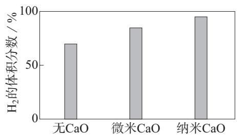

# 一、化学反应的认识视角

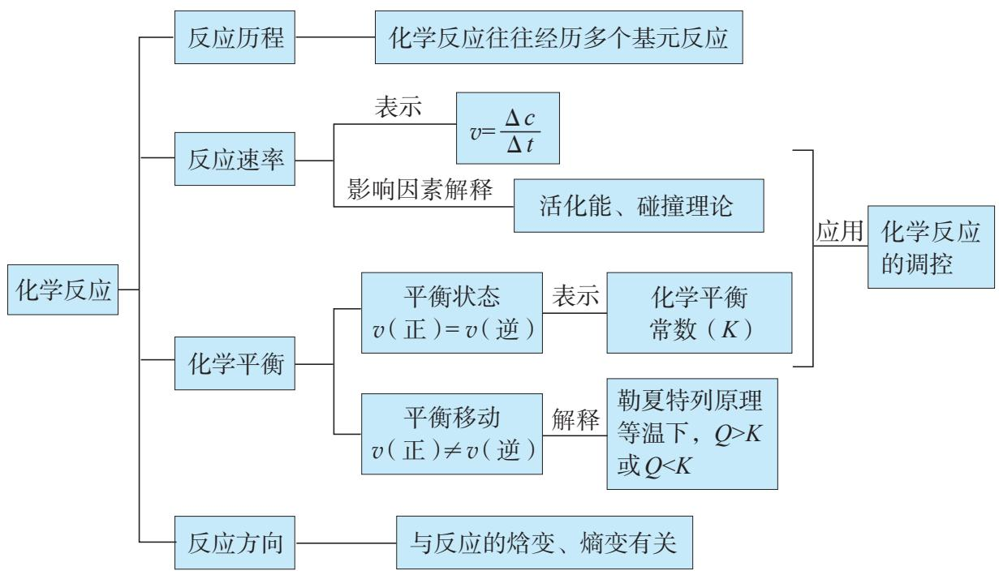

# 二、化学反应速率和化学平衡

在密闭容器中发生如下反应: 

$$
m A (g) + n B (g) \Longleftrightarrow p C (g) + q D (g) \quad \Delta H <   0 (m + n > p + q)
$$

当下列某一因素变化时，分析其对化学反应速率的影响；若达到化学平衡时，分析这些因素变化对平衡移动的影响。完成下表。 

<table><tr><td>因素</td><td>化学反应速率</td><td>化学平衡</td></tr><tr><td>浓度</td><td></td><td></td></tr><tr><td>压强</td><td></td><td></td></tr><tr><td>温度</td><td></td><td></td></tr><tr><td>催化剂</td><td></td><td></td></tr></table>

# 复习与提高

1. 采取下列措施对增大化学反应速率有明显效果的是（ ）。 

A. Na与水反应时，增加水的用量 

B. Al与稀硫酸反应制取 $\mathrm{H}_{2}$ 时, 改用浓硫酸 

C. $\mathrm{Na}_{2} \mathrm{SO}_{4}$ 溶液与 $\mathrm{BaCl}_{2}$ 溶液反应时, 增大压强 

D. 大理石与盐酸反应制取 $\mathrm{CO}_{2}$ 时, 将块状大理石改为粉末状大理石 

2. 向一个密闭容器中充入 $1 \mathrm{~mol} \mathrm{~N}_{2}$ 和 $3 \mathrm{~mol} \mathrm{H}_{2}$ , 在一定条件下使其发生反应生成 $\mathrm{NH}_{3}$ 。达到平衡时,下列说法中正确的是 ( )。 

A. $\mathrm{N}_{2}$ 、 $\mathrm{H}_{2}$ 和 $\mathrm{NH}_{3}$ 的物质的量浓度之比为 $1: 3: 2$ 

B. $\mathrm{N}_{2}$ 完全转化为 $\mathrm{NH}_{3}$ 

C. 正反应速率和逆反应速率都为零 

D. 单位时间内消耗 $a \mathrm{~mol} \mathrm{~N}_{2}$ , 同时消耗 $2 a \mathrm{~mol} \mathrm{NH}_{3}$ 

3. 在一定温度下的容积不变的密闭容器中发生反应: $2 \mathrm{SO}_{2}(\mathrm{~g}) + \mathrm{O}_{2}(\mathrm{~g}) \rightleftharpoons 2 \mathrm{SO}_{3}(\mathrm{~g})$ 。下列不能说明反应达到平衡状态的是 ( )。 

A. 气体的压强不再变化 

B. $\mathrm{SO}_{2}$ 的体积分数不再变化 

C. 混合物的密度不再变化 

D. 各物质的浓度不再变化 

4. 如右图所示，曲线 $a$ 表示放热反应 $\mathrm{X(g) + Y(g)}\rightleftharpoons \mathrm{Z(g) + M(g) + N(s)}$ 进行过程中X的转化率随时间变化的关系。若要改变起始条件，使反应过程按曲线 $b$ 进行，可采取的措施是（ ）。 

A. 升高温度 

B. 加大 X 的投入量 

C. 加催化剂 

D. 减小压强 

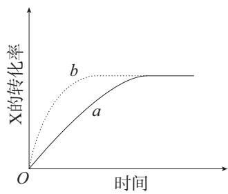

5. 在 $2 \mathrm{~L}$ 的密闭容器中通入 $\mathrm{N}_{2}$ 和 $\mathrm{H}_{2}$ ，使其发生反应： $\mathrm{N}_{2} + 3 \mathrm{H}_{2} \rightleftharpoons 2 \mathrm{NH}_{3}$ 。 

在 $10 \mathrm{~s}$ 内用 $\mathrm{H}_{2}$ 的浓度变化表示的化学反应速率为 $0.12 \mathrm{~mol} / (\mathrm{L} \cdot \mathrm{s})$ , 则这 $10 \mathrm{~s}$ 内消耗 $\mathrm{N}_{2}$ 的物质的量是 

6. 羰基硫（COS）是一种粮食熏蒸剂，能防止某些害虫和真菌的危害。在容积不变的密闭容器中，使CO与 $\mathrm{H}_{2} \mathrm{~S}$ 发生下列反应并达到平衡： 

$$
\mathrm {C O (g)} + \mathrm {H} _ {2} \mathrm {S (g)} \rightleftharpoons \mathrm {C O S (g)} + \mathrm {H} _ {2} (\mathrm {g})
$$

(1) 若反应前 $\mathrm{CO}$ 的物质的量为 $10 \mathrm{~mol}$ , 达到平衡时 $\mathrm{CO}$ 的物质的量为 $8 \mathrm{~mol}$ , 且化学平衡常数为 0.1 。下列说法正确的是____（填字母）。 

a. 升高温度, $\mathrm{H}_{2} \mathrm{~S}$ 的浓度增大, 表明该反应是吸热反应 

b. 通入CO后，正反应速率逐渐增大 

c. 反应前 $\mathrm{H}_{2} \mathrm{~S}$ 的物质的量为 $7 \mathrm{~mol}$ 

d. 达到平衡时CO的转化率为 $80\%$ 

(2) 在不同温度下达到化学平衡时, $\mathrm{H}_{2} \mathrm{~S}$ 的转化率如右图所示, 则该反应是 反应 (填 “吸热” 或 “放热”). 

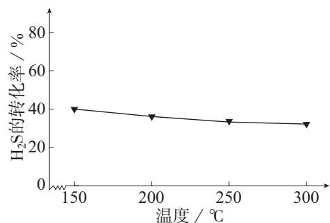

(3) 在某温度下, 向 $1 \mathrm{~L}$ 的密闭容器中通入 $10 \mathrm{~mol} \mathrm{CO}$ 和 $10 \mathrm{~mol} \mathrm{H}_{2} \mathrm{~S}$ , 平衡时测得 $\mathrm{CO}$ 的转化率为 $40 \%$ , 则该温度下反应的平衡常数为 

7. 研究 $\mathrm{NO}_2$ 、 $\mathrm{SO}_2$ 等气体的无害化处理对治理大气污染、建设生态文明具有重要意义。 

(1)已知: $2 \mathrm{SO}_{2}(\mathrm{~g})+\mathrm{O}_{2}(\mathrm{~g}) \rightleftharpoons 2 \mathrm{SO}_{3}(\mathrm{~g}) \quad \Delta H=-196.6 \mathrm{~kJ/mol}$ 

$$
2 \mathrm {N O} (\mathrm {g}) + \mathrm {O} _ {2} (\mathrm {g}) \rightleftharpoons 2 \mathrm {N O} _ {2} (\mathrm {g}) \quad \Delta H = - 1 1 3. 0 \mathrm {k J / m o l}
$$

则 $\mathrm{NO}_2(\mathrm{g}) + \mathrm{SO}_2(\mathrm{g})\rightleftharpoons \mathrm{SO}_3(\mathrm{g}) + \mathrm{NO}(\mathrm{g})$ 的 $\Delta H = \_ \_ \_ \_ \_ \_ \_ \_ \_ \_ \_ \_ \_ \_ \_ \_ \_ \_ \_ \_ \_ \_ \_ \_ \_ \_ \_ \_ \_ \_ \_ \_ \_ \_ \_ \_ \_ \_ \_ \_ \_ \_ \_ \_ \_ \_ \_ \_ \_ \_ \_$ 

(2) 在一定条件下, 将 $\mathrm{NO}_{2}$ 与 $\mathrm{SO}_{2}$ 以体积比 $1: 2$ 置于密闭容器中发生上述反应。下列能说明反应达到平衡状态的是 (填字母)。 

a. 体系压强保持不变 

b. 混合气体的颜色保持不变 

c. $\mathrm{SO}_3$ 和 $\mathrm{NO}$ 的体积比保持不变 

d. 每生成 $1 \mathrm{~mol} \mathrm{SO}_{3}$ 消耗 $1 \mathrm{~mol} \mathrm{NO}_{2}$ 

8. 由 $\gamma-$ 羟基丁酸（ $\mathrm{HOCH}_2\mathrm{CH}_2\mathrm{CH}_2\mathrm{COOH}$ ）生成 $\gamma-$ 丁内酯（ $\left\langle \begin{array}{c} \mathrm{O} \\ \mathrm{O} \end{array} \right\rangle = \mathrm{O}$ ）的反应如下： 

$$
\mathrm {H O C H} _ {2} \mathrm {C H} _ {2} \mathrm {C H} _ {2} \mathrm {C O O H} \stackrel {\mathrm {H} ^ {+} / \Delta} {\rightleftharpoons} \left. \right.\begin{array}{l}\mathrm {O}\\\mathrm {O}\end{array}\rightleftharpoons \mathrm {O} + \mathrm {H} _ {2} \mathrm {O}
$$

在 $25^{\circ} \mathrm{C}$ 时, 溶液中 $\gamma$ -羟基丁酸的初始浓度为 $0.180 \mathrm{~mol} / \mathrm{L}$ , 随着反应的进行, 测得 $\gamma$ -丁内酯的浓度随时间的变化如下表所示。 

<table><tr><td>t/min</td><td>21</td><td>50</td><td>80</td><td>100</td><td>120</td><td>160</td><td>220</td><td>∞</td></tr><tr><td>c/(mol·L-1)</td><td>0.024</td><td>0.050</td><td>0.071</td><td>0.081</td><td>0.090</td><td>0.104</td><td>0.116</td><td>0.132</td></tr></table>

请填写下列空白。 

(1) 在 $50 \sim 80 \mathrm{~min}$ 内, 以 $\gamma$ -丁内酯的浓度变化表示的反应速率为 $\_ \_ \_ \_ \_ \_ \_ \_ \_ \_ \_ \_ \_ \_ \_ \_ \_ \_ \_ \_ \_ \_ \_ \_ \_ \_ \_ \_ \_ \_ \_ \_ \_ \_ \_ \_ \_ \_ \_ \_ \_ \_ \_ \_ \_ \_ \_ \_ \_ \_ \_ mol / (\mathrm{L} \cdot \mathrm{min})$ 。 

（2）在 $120\mathrm{min}$ 时， $\gamma$ -羟基丁酸的转化率为 

（3）在 $25\%$ 时，该反应的平衡常数为 $K =$ 

(4) 为提高平衡时 $\gamma$ -羟基丁酸的转化率, 除了适当控制反应温度, 还可采取的措施是 

9. 在一个容积不变的密闭容器中发生反应: $\mathrm{CO}_{2}(\mathrm{~g}) + \mathrm{H}_{2}(\mathrm{~g}) \rightleftharpoons \mathrm{CO}(\mathrm{~g}) + \mathrm{H}_{2}\mathrm{O}(\mathrm{~g})$ , 其平衡常数 $(K)$ 和温度 $(t)$ 的关系如下表所示。 

<table><tr><td>t/℃</td><td>700</td><td>800</td><td>830</td><td>1000</td><td>1200</td></tr><tr><td>K</td><td>0.6</td><td>0.9</td><td>1.0</td><td>1.7</td><td>2.6</td></tr></table>

请填写下列空白。 

(1) 该反应的平衡常数表达式为 $K =$ ________；该反应为 ________ 反应（填“吸热”或“放热”）。 

(2) 在 $830^{\circ} \mathrm{C}$ 时, 向容器中充入 $1 \mathrm{~mol} \mathrm{CO} 、 5 \mathrm{~mol} \mathrm{H}_{2} \mathrm{O}$ , 保持温度不变, 反应达到平衡后, 其平衡常数 

(3) 若 $1200^{\circ} \mathrm{C}$ 时, 在某时刻反应混合物中 $\mathrm{CO}_{2} 、 \mathrm{H}_{2} 、 \mathrm{CO} 、 \mathrm{H}_{2} \mathrm{O}$ 的浓度分别为 $2 \mathrm{~mol} / \mathrm{L} 、 2 \mathrm{~mol} / \mathrm{L} 、 4 \mathrm{~mol} / \mathrm{L} 、 4 \mathrm{~mol} / \mathrm{L}$ , 则此时上述反应的平衡移动方向为______（填 “正反应方向” “逆反应方向” 或 “不移动”). 

# 实验活动1

# 探究影响化学平衡移动的因素

# 【实验目的】

1. 认识浓度、温度等因素对化学平衡的影响。 

2. 进一步学习控制变量、对比等科学方法。 

# 【实验用品】

小烧杯、大烧杯、量筒、试管、试管架、玻璃棒、胶头滴管、酒精灯、火柴、两个封装有 $\mathrm{NO}_{2}$ 和 $\mathrm{N}_{2} \mathrm{O}_{4}$ 混合气体的圆底烧瓶。 

铁粉、 $0.05 \mathrm{~mol} / \mathrm{L} \mathrm{FeCl}_{3}$ 溶液、 $0.15 \mathrm{~mol} / \mathrm{L} \mathrm{KSCN}$ 溶液、 $0.1 \mathrm{~mol} / \mathrm{L} \mathrm{K}_{2} \mathrm{Cr}_{2} \mathrm{O}_{7}$ 溶液、 $6 \mathrm{~mol} / \mathrm{L} \mathrm{NaOH}$ 溶液、 $6 \mathrm{~mol} / \mathrm{L} \mathrm{H}_{2} \mathrm{SO}_{4}$ 溶液、 $0.5 \mathrm{~mol} / \mathrm{L} \mathrm{CuCl}_{2}$ 溶液、热水、冰块、蒸馏水。 

# 【实验步骤】

# 一、浓度对化学平衡的影响

# 1. $\mathrm{FeCl}_3$ 溶液与KSCN溶液的反应

(1) 在小烧杯中加入 $10 \mathrm{~mL}$ 蒸馏水, 再滴入 5 滴 $0.05 \mathrm{~mol} / \mathrm{L} \mathrm{FeCl}_{3}$ 溶液、5 滴 $0.15 \mathrm{~mol} / \mathrm{L}$ KSCN溶液, 用玻璃棒搅拌, 使其充分混合, 将混合均匀的溶液平均注入 a、b、c 三支试管中。 

(2) 向试管a中滴入5滴 $0.05 \mathrm{~mol} / \mathrm{L} \mathrm{FeCl}_{3}$ 溶液, 向试管b中滴入5滴 $0.15 \mathrm{~mol} / \mathrm{L}$ KSCN溶液, 观察并记录实验现象, 与试管c进行对比。完成下表。 

<table><tr><td>实验内容</td><td>向试管a中滴入5滴0.05 mol/L FeCl3溶液</td><td>向试管b中滴入5滴0.15 mol/L KSCN溶液</td></tr><tr><td>实验现象</td><td></td><td></td></tr><tr><td>结论</td><td></td><td></td></tr></table>

(3) 继续向上述两支试管中分别加入少量铁粉, 观察并记录实验现象。完成下表。 

<table><tr><td>实验内容</td><td>向试管a中加入少量铁粉</td><td>向试管b中加入少量铁粉</td></tr><tr><td>实验现象</td><td></td><td></td></tr><tr><td>结论</td><td></td><td></td></tr></table>

2. 在 $\mathrm{K}_{2} \mathrm{Cr}_{2} \mathrm{O}_{7}$ 溶液中存在如下平衡: 

$$
\mathrm {C r} _ {2} \mathrm {O} _ {7} ^ {2 -} + \mathrm {H} _ {2} \mathrm {O} \rightleftharpoons 2 \mathrm {C r O} _ {4} ^ {2 -} + 2 \mathrm {H} ^ {+}
$$

（橙色） （黄色） 

取一支试管，加入 $2 \mathrm{~mL} 0.1 \mathrm{~mol} / \mathrm{L} \mathrm{K}_{2} \mathrm{Cr}_{2} \mathrm{O}_{7}$ 溶液，然后按下表中的步骤进行实验，观察溶液颜色的变化，判断平衡是否发生移动及移动的方向。完成下表。 

<table><tr><td>实验步骤</td><td>实验现象</td><td>结论</td></tr><tr><td>(1)向试管中滴加5~10滴6mol/L NaOH溶液</td><td></td><td></td></tr><tr><td>(2)向试管中继续滴加5~10滴6mol/L H2SO4溶液</td><td></td><td></td></tr></table>

# 二、温度对化学平衡的影响

1. 在 $\mathrm{CuCl}_2$ 溶液中存在如下平衡： 

$$
\left[ \mathrm {C u} \left(\mathrm {H} _ {2} \mathrm {O}\right) _ {4} \right] ^ {2 +} + 4 \mathrm {C l} ^ {-} \rightleftharpoons \left[ \mathrm {C u C l} _ {4} \right] ^ {2 -} + 4 \mathrm {H} _ {2} \mathrm {O} \quad \Delta H > 0
$$

(蓝色) (黄色) 

取两支试管，分别加入 $2 \mathrm{~mL} 0.5 \mathrm{~mol} / \mathrm{L} \mathrm{CuCl}_{2}$ 溶液，将其中的一支试管先加热，然后置于冷水中，观察并记录实验现象，与另一支试管进行对比。完成下表。 

<table><tr><td>实验步骤</td><td>实验现象</td><td>结论</td></tr><tr><td>(1)加热试管</td><td></td><td></td></tr><tr><td>(2)将上述试管置于冷水中</td><td></td><td></td></tr></table>

2. 取两个封装有 $\mathrm{NO}_{2}$ 和 $\mathrm{N}_{2} \mathrm{O}_{4}$ 混合气体的圆底烧瓶（编号分别为 1 和 2），将它们分别浸泡在热水和冷水中，比较两个烧瓶里气体的颜色。将两个烧瓶互换位置，稍等片刻，再比较两个烧瓶里气体的颜色。完成下表。 

<table><tr><td>烧瓶编号</td><td>1</td><td>2</td></tr><tr><td>实验步骤</td><td>(1)置于热水</td><td>(1)置于冷水</td></tr><tr><td>实验现象</td><td></td><td></td></tr><tr><td>实验步骤</td><td>(2)置于冷水</td><td>(2)置于热水</td></tr><tr><td>实验现象</td><td></td><td></td></tr><tr><td>结论</td><td colspan="2"></td></tr></table>

# 【问题和讨论】

1. 在进行浓度、温度对化学平衡影响的实验时，应注意哪些问题？你还能设计出哪些实验证明浓度、温度对化学平衡的影响？ 

2. 结合实验内容，尝试归纳影响化学平衡移动的因素。 

3. 在对 $\mathrm{CuCl}_2$ 溶液加热时, 你是否观察到了 $[\mathrm{CuCl}_4]^{2-}$ 的黄色? 你能说出原因吗? 

# 第三章

# 水溶液中的离子

# 反应与平衡

电离平衡 

- 水的电离和溶液的 $\mathrm{pH}$ 

盐类的水解 

沉淀溶解平衡 

水溶液广泛存在于生命体及其赖以生存的环境中。许多化学反应都是在水溶液中进行的，其中，酸、碱和盐等电解质在水溶液中发生的离子反应，以及弱电解质的电离平衡、盐类的水解平衡和难溶电解质的沉淀溶解平衡，都与生命活动、日常生活、工农业生产和环境保护等息息相关。 

# 第一节 电离平衡

酸、碱、盐都是电解质，在水中都能电离出离子。在相同条件下，不同电解质的电离程度是否有区别？ 

# 一、强电解质和弱电解质

盐酸和醋酸是生活中经常用到的酸。盐酸常用于卫生洁具的清洁。我们知道，醋酸的腐蚀性比盐酸的小，比较安全，为什么不用醋酸代替盐酸呢？ 

# 【实验3-1】

取相同体积、 $0.1 \mathrm{~mol} / \mathrm{L}$ 的盐酸和醋酸，比较它们 $\mathrm{pH}$ 的大小，试验其导电能力，并分别与等量镁条反应。观察、比较并记录现象。 

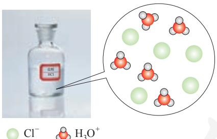

图3-1 HCl在水中电离示意图

<table><tr><td>酸</td><td>0.1 mol/L 盐酸</td><td>0.1 mol/L 醋酸</td></tr><tr><td>pH</td><td></td><td></td></tr><tr><td>导电能力</td><td></td><td></td></tr><tr><td>与镁条反应</td><td></td><td></td></tr></table>

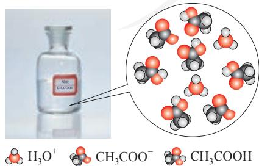

图3-2 $\mathrm{CH}_3\mathrm{COOH}$ 在水中电离示意图

实验表明，相同物质的量浓度的盐酸和醋酸的 $\mathrm{pH}$ 、导电能力及与活泼金属反应的剧烈程度都有差别，这说明两种酸中 $\mathrm{H}^{+}$ 浓度是不同的，即HCl和 $\mathrm{CH}_3\mathrm{COOH}$ 的电离程度不同。在稀溶液中，HCl全部电离生成 $\mathrm{H}^{+}$ 和 $\mathrm{Cl}^{-}$ （如图3-1）， $\mathrm{CH}_3\mathrm{COOH}$ 只有部分电离生成 $\mathrm{CH}_3\mathrm{COO}^{-}$ 和 $\mathrm{H}^{+}$ （如图3-2）。 

因此，电解质在水中并不都是全部电离的，在电离程度上有强、弱之分。能够全部电离的电解质称为强电解质，反之称为弱电解质。强酸、强碱和大部分盐，如 $\mathrm{H}_2\mathrm{SO}_4$ 、NaOH和NaCl等属于强电解质；弱酸和弱碱，如 $\mathrm{CH}_3\mathrm{COOH}$ 和 $\mathrm{NH}_3\cdot \mathrm{H}_2\mathrm{O}$ 等属于弱电解质。 

# 二、弱电解质的电离平衡

弱电解质溶于水，部分电离产生的离子在溶液中相互碰撞又会结合成分子，因此，弱电解质的电离过程是可逆的。例如， $\mathrm{CH}_3\mathrm{COOH}$ 和 $\mathrm{NH}_3 \cdot \mathrm{H}_2\mathrm{O}$ 的电离方程式可分别表示为： 

$$
\mathrm {C H} _ {3} \mathrm {C O O H} \rightleftharpoons \mathrm {C H} _ {3} \mathrm {C O O} ^ {-} + \mathrm {H} ^ {+}
$$

$$
\mathrm {N H} _ {3} \cdot \mathrm {H} _ {2} \mathrm {O} \rightleftharpoons \mathrm {N H} _ {4} ^ {+} + \mathrm {O H} ^ {-}
$$

在电离初始，弱电解质分子电离成离子的速率随着分子浓度的减小而逐渐减小；同时离子结合成分子的速率随着离子浓度的增大而逐渐增大。经过一段时间后，两者的速率相等，达到电离平衡状态。 

与其他化学平衡一样，当浓度、温度等条件改变时，电离平衡会发生移动。例如，在氨水中加入 $\mathrm{NH_4Cl}$ ， $\mathrm{NH_4Cl}$ 在溶液中完全电离，于是溶液中 $\mathrm{NH_4^+}$ 的浓度增大，使 $\mathrm{NH}_3\cdot \mathrm{H}_2\mathrm{O}$ 的电离平衡向左移动。在 $\mathrm{CH}_3\mathrm{COOH}$ 溶液中加入 $\mathrm{CH}_3\mathrm{COONa}$ 时的情况与此类似。 

# 三、电离平衡常数

与其他化学平衡类似，在一定条件下，当弱电解质的电离达到平衡时，溶液里各组分的浓度之间存在一定的关系。对一元弱酸或一元弱碱来说，溶液中弱电解质电离所生成的各种离子浓度的乘积，与溶液中未电离分子的浓度之比是一个常数，这个常数叫做电离平衡常数①，简称电 

强电解质 strong electrolyte 

弱电解质 weak electrolyte 

电离平衡 

ionization equilibrium 

电离常数 ionization constant 

离常数。 

例如， $\mathrm{CH}_3\mathrm{COOH}$ 的电离常数可用下式表示： 

$$
K _ {\mathrm {a}} = \frac {c \left(\mathrm {C H} _ {3} \mathrm {C O O} ^ {-}\right) \cdot c \left(\mathrm {H} ^ {+}\right)}{c \left(\mathrm {C H} _ {3} \mathrm {C O O H}\right)}
$$

电离常数与温度有关。因为电离常数随温度变化不大，如 $\mathrm{CH}_3\mathrm{COOH}$ 在 $25^{\circ}C$ 时 $K_{\mathrm{a}}$ 为 $1.75\times 10^{-5}$ ， $0^{\circ}C$ 时 $K_{\mathrm{a}}$ 为 $1.65\times 10^{-5}$ ，所以室温时可以不考虑温度对电离常数的影响。在同一温度下，不同弱电解质的电离常数不同（见附录Ⅱ），说明电离常数首先由弱电解质的性质所决定。电离常数越大，弱电解质越易电离；反之亦然。比较电离常数的大小可以判断弱电解质的相对强弱。例如， $\mathrm{CH}_3\mathrm{COOH}$ 和HCN都是弱酸，在 $25^{\circ}C$ 时 $\mathrm{CH}_3\mathrm{COOH}$ 的 $K_{\mathrm{a}}$ 为 $1.75\times 10^{-5}$ ，HCN的 $K_{\mathrm{a}}$ 为 $6.2\times 10^{-10}$ ，由此可知，HCN是比 $\mathrm{CH}_3\mathrm{COOH}$ 更弱的酸。 

【例题】在某温度时，溶质的物质的量浓度为 $0.20 \, \mathrm{mol} \cdot \mathrm{L}^{-1}$ 的氨水中，达到电离平衡时，已电离的 $\mathrm{NH}_3 \cdot \mathrm{H}_2\mathrm{O}$ 为 $1.7 \times 10^{-3} \, \mathrm{mol} \cdot \mathrm{L}^{-1}$ 。试计算该温度下 $\mathrm{NH}_3 \cdot \mathrm{H}_2\mathrm{O}$ 的电离常数（ $K_{\mathrm{b}}$ ）。 

【解】 $\mathrm{NH}_{3} \cdot \mathrm{H}_{2} \mathrm{O}$ 的电离方程式及有关粒子的浓度如下： 

$$
\mathrm {N H} _ {3} \cdot \mathrm {H} _ {2} \mathrm {O} \rightleftharpoons \mathrm {N H} _ {4} ^ {+} + \mathrm {O H} ^ {-}
$$

起始浓度 $/(\mathrm{mol}\cdot\mathrm{L}^{-1})$ 0.20 0 0 

变化浓度 $\mathrm{(mol\cdot L^{-1})}$ $1.7\times 10^{-3}$ $1.7\times 10^{-3}$ $1.7\times 10^{-3}$ 

平衡浓度 $/(\mathrm{mol}\cdot\mathrm{L}^{-1})$ $0.20 - 1.7\times 10^{-3}1.7\times 10^{-3}1.7\times 10^{-3}$ 

$$
c \left(\mathrm {N H} _ {3} \cdot \mathrm {H} _ {2} \mathrm {O}\right) = (0. 2 0 - 1. 7 \times 1 0 ^ {- 3}) \mathrm {m o l} \cdot \mathrm {L} ^ {- 1} \approx 0. 2 0 \mathrm {m o l} \cdot \mathrm {L} ^ {- 1}
$$

$$
K _ {\mathrm {b}} = \frac {c \left(\mathrm {N H} _ {4} ^ {+}\right) \cdot c \left(\mathrm {O H} ^ {-}\right)}{c \left(\mathrm {N H} _ {3} \cdot \mathrm {H} _ {2} \mathrm {O}\right)} = \frac {(1 . 7 \times 1 0 ^ {- 3}) \times (1 . 7 \times 1 0 ^ {- 3})}{0 . 2 0} \approx 1. 4 \times 1 0 ^ {- 5}
$$

答：该温度下 $\mathrm{NH}_3\cdot \mathrm{H}_2\mathrm{O}$ 的电离常数约为 $1.4\times 10^{-5}$ 

多元弱酸或多元弱碱在水中的电离是分步进行的。例如， $\mathrm{H}_2\mathrm{CO}_3$ 是二元弱酸，它的电离方程式为： 

$$
\mathrm {H} _ {2} \mathrm {C O} _ {3} \rightleftharpoons \mathrm {H} ^ {+} + \mathrm {H C O} _ {3} ^ {-}
$$

$$
\mathrm {H C O} _ {3} ^ {-} \rightleftharpoons \mathrm {H} ^ {+} + \mathrm {C O} _ {3} ^ {2 -}
$$

多元弱酸或多元弱碱的每一步电离都有电离常数，这些电离常数各不相同，通常用 $K_{\mathrm{a_1}}$ 、 $K_{\mathrm{a_2}}$ 或 $K_{\mathrm{b_1}}$ 、 $K_{\mathrm{b_2}}$ 等加以区别。例如， $25^{\circ}\mathrm{C}$ 时 $\mathrm{H}_2\mathrm{CO}_3$ 的两步电离常数分别为： 

$$
K _ {\mathrm {a} _ {1}} = \frac {c (\mathrm {H} ^ {+}) \cdot c (\mathrm {H C O} _ {3} ^ {-})}{c (\mathrm {H} _ {2} \mathrm {C O} _ {3})} = 4. 5 \times 1 0 ^ {- 7}
$$

$$
K _ {\mathrm {a} _ {2}} = \frac {c (\mathrm {H} ^ {+}) \cdot c \left(\mathrm {C O} _ {3} ^ {2 -}\right)}{c \left(\mathrm {H C O} _ {3} ^ {-}\right)} = 4. 7 \times 1 0 ^ {- 1 1}
$$

比较多元弱酸的各步电离常数可以发现， $K_{\mathrm{a}_1} > K_{\mathrm{a}_2} > K_{\mathrm{a}_3} > \dots$ 当 $K_{\mathrm{a}_1} >> K_{\mathrm{a}_2}$ 时，计算多元弱酸中的 $c(\mathrm{H}^+)$ ，或比较多元弱酸酸性的相对强弱时，通常只考虑第一步电离。多元弱碱的情况与多元弱酸类似。 

# 【实验3-2】

如图3-3所示，向盛有 $2 \mathrm{~mL} 1 \mathrm{~mol} / \mathrm{L}$ 醋酸的试管中滴加 $1 \mathrm{~mol} / \mathrm{L} \mathrm{Na}_{2} \mathrm{CO}_{3}$ 溶液，观察现象。你能否由此推测 $\mathrm{CH}_{3} \mathrm{COOH}$ 的 $K_{\mathrm{a}}$ 和 $\mathrm{H}_{2} \mathrm{CO}_{3}$ 的 $K_{\mathrm{a}_{1}}$ 的大小？ 

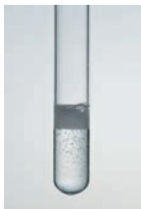

图3-3 向醋酸中滴加碳酸钠溶液

# 思考与讨论

向两个锥形瓶中各加入 $0.05 \mathrm{~g}$ 镁条, 塞紧橡胶塞, 然后用注射器分别注入 $2 \mathrm{~mL} 2 \mathrm{~mol} / \mathrm{L}$ 盐酸、 $2 \mathrm{~mL} 2 \mathrm{~mol} / \mathrm{L}$ 醋酸, 测得锥形瓶内气体的压强随时间的变化如图 3-4 所示。请回答下列问题: 

(1) 两个反应的反应速率及其变化有什么特点? 

(2) 反应结束时, 两个锥形瓶内气体的压强基本相等, 由此你能得出什么结论? 

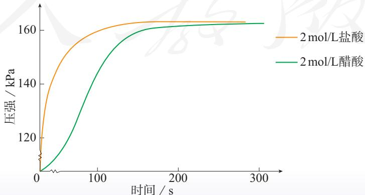

图3-4 镁与盐酸、醋酸反应时气体压强随时间的变化示意图

# 练习与应用

1. 已知某温度下有如下三个反应： 

$$
\begin{array}{l} \mathrm {N a C N} + \mathrm {H N O} _ {2} = \mathrm {H C N} + \mathrm {N a N O} _ {2} \\ \mathrm {N a C N} + \mathrm {H F} = \mathrm {H C N} + \mathrm {N a F} \\ \mathrm {N a N O} _ {2} + \mathrm {H F} = \mathrm {H N O} _ {2} + \mathrm {N a F} \\ \end{array}
$$

则该温度下HF、HCN和 $\mathrm{HNO}_2$ 三种弱酸的电离常数由大到小的顺序是 

2. 向稀氨水中分别加入下列物质，请判断电离平衡移动的方向。 

<table><tr><td>加入的物质</td><td>NH4Cl</td><td>NH3</td><td>NaOH</td></tr><tr><td>电离平衡移动的方向</td><td></td><td></td><td></td></tr></table>

3. 向 $10 \mathrm{~mL}$ 氨水中加入蒸馏水，将其稀释到 $1 \mathrm{~L}$ 后，下列说法中不正确的是（ ）。 

A. $\mathrm{NH}_{3} \cdot \mathrm{H}_{2} \mathrm{O}$ 的电离程度增大 

B. $c\left(\mathrm{NH}_{2} \cdot \mathrm{H}_{2} \mathrm{O}\right)$ 增大 

C. $\mathrm{NH}_{4}^{+}$ 的数目增多 

$\frac{c(\mathrm{NH}_4^+)}{c(\mathrm{NH}_3\cdot\mathrm{H}_2\mathrm{O})}$ 增大 

4. 在一定温度下，冰醋酸稀释过程中溶液的导电能力变化如右图所示，请填写下列空白。 

（1）加水前导电能力约为零的原因是 

(2) a、b、c三点对应的溶液中， $c(\mathrm{H}^{+})$ 由小到大的顺序是 

(3) a、b、c三点对应的溶液中, ${\mathrm{{CH}}}_{3}\mathrm{{COOH}}$ 电离程度最大的是_____。 

(4) 若使 b 点对应的溶液中 $c(\mathrm{CH}_{3} \mathrm{COO}^{-})$ 增大、 $c(\mathrm{H}^{+})$ 减小, 可采用的方法是 (填序号)。 

$①$ 加入 $\mathrm{H}_2\mathrm{O}$ 

②加入NaOH固体 

(3)加入浓硫酸 

④加入 ${\mathrm{{Na}}}_{2}{\mathrm{{CO}}}_{3}$ 固体 

5. 判断下列说法是否正确，并说明理由。 

（1）强电解质溶液的导电能力一定比弱电解质溶液的强。 

(2) 中和等体积、等物质的量浓度的盐酸和醋酸, 中和盐酸所需氢氧化钠的物质的量多于醋酸。 

(3) 将 $\mathrm{NaOH}$ 溶液和氨水中溶质的浓度各稀释到原浓度的 $\frac{1}{2}$ , 两者的 $c(\mathrm{OH}^{-})$ 均减少到原来的 $\frac{1}{2}$ 。 

(4) 如果盐酸中溶质的浓度是醋酸中溶质浓度的 2 倍, 则盐酸中的 $c(\mathrm{H}^{+})$ 也是醋酸中 $c(\mathrm{H}^{+})$ 的 2 倍。 

（5）物质的量浓度相同的磷酸钠溶液和磷酸中 $\mathrm{PO}_4^{3-}$ 的浓度相同。 

6. 已知 $25^{\circ} \mathrm{C}$ 时， $\mathrm{CH}_3\mathrm{COOH}$ 的 $K_{\mathrm{a}} = 1.75 \times 10^{-5}$ 。 

(1) 当向醋酸中加入一定量的盐酸时, $\mathrm{CH}_{3} \mathrm{COOH}$ 的电离常数是否发生变化? 为什么? 

(2) 若初始时醋酸中 $\mathrm{CH}_{3} \mathrm{COOH}$ 的浓度为 $0.010 \mathrm{~mol} / \mathrm{L}$ , 则达到电离平衡时溶液中 $c\left(\mathrm{H}^{+}\right)$ 是多少? 

# 第二节

# 水的电离和溶液的 $\mathrm{pH}$

在水溶液中，酸、碱和盐全部或部分以离子形式存在，那么，其中的溶剂——水是全部以分子形式存在（如图3-5），还是部分以离子形式存在呢？ 

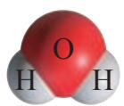

图3-5 水分子结构示意图

# 一、水的电离

精确的导电性实验表明，纯水绝大部分以 $\mathrm{H}_2\mathrm{O}$ 的形式存在，但其中也存在着极少量的 $\mathrm{H}_3\mathrm{O}^+$ 和 $\mathrm{OH}^-$ 。这表明水是一种极弱的电解质，能发生微弱的电离（如图3-6）： 

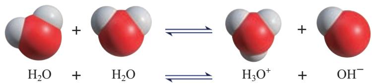

图3-6 水分子电离过程示意图

上述水的电离方程式可简写为: 

$$
\mathrm {H} _ {2} \mathrm {O} \rightleftharpoons \mathrm {H} ^ {+} + \mathrm {O H} ^ {-}
$$

当水的电离达到平衡时，电离产物 $\mathrm{H}^{+}$ 和 $\mathrm{OH}^{-}$ 浓度之积是一个常数，记作 $K_{\mathrm{w}}$ ： 

$$
c \left(\mathrm {H} ^ {+}\right) \cdot c \left(\mathrm {O H} ^ {-}\right) = K _ {\mathrm {w}}
$$

$K_{\mathrm{w}}$ 叫做水的离子积常数，简称水的离子积。 $K_{\mathrm{w}}$ 可由实验测得，也可通过理论计算求得。 

水的离子积 

ionic product of water 

表 3-1 不同温度下水的离子积常数

<table><tr><td>t/℃</td><td>0</td><td>10</td><td>20</td><td>25</td><td>40</td><td>50</td><td>90</td><td>100</td></tr><tr><td>Kw/10-14</td><td>0.115</td><td>0.296</td><td>0.687</td><td>1.01</td><td>2.87</td><td>5.31</td><td>37.1</td><td>54.5</td></tr></table>

由表3-1可以看出，随着温度的升高，水的离子积增大。在常温下，一般可以认为 $K_{\mathrm{w}}$ 是 $1 \times 10^{-14}$ ，即： 

$$
K _ {\mathrm {w}} = c \left(\mathrm {H} ^ {+}\right) \cdot c \left(\mathrm {O H} ^ {-}\right) = 1 \times 1 0 ^ {- 1 4}
$$

# 二、溶液的酸碱性与pH

水的离子积不仅适用于纯水，也适用于稀的电解质溶液。 

# 思考与讨论

根据常温时水的电离平衡，运用平衡移动原理分析下列问题。 

(1) 酸性溶液中是否存在 $\mathrm{OH}^{-}$ ？碱性溶液中是否存在 $\mathrm{H}^{+}$ ？试解释原因。 

(2) 比较下列情况中, $c(\mathrm{H}^{+})$ 和 $c(\mathrm{OH}^{-})$ 的值或变化趋势 (增大或减小)。 

<table><tr><td>体系</td><td>纯水</td><td>向纯水中加入少量盐酸</td><td>向纯水中加入少量氢氧化钠溶液</td></tr><tr><td>c(H+)</td><td></td><td></td><td></td></tr><tr><td>c(OH-)</td><td></td><td></td><td></td></tr><tr><td>c(H+)和c(OH-)的大小比较</td><td></td><td></td><td></td></tr></table>

在常温下，稀溶液中 $c(\mathrm{H}^{+})$ 和 $c(\mathrm{OH}^{-})$ 的乘积总是 $1 \times 10^{-14}$ ，知道了 $c(\mathrm{H}^{+})$ 就可以计算出 $c(\mathrm{OH}^{-})$ ，反之亦然。由上述思考与讨论可知，在常温下溶液的酸碱性与溶液中 $c(\mathrm{H}^{+})$ 和 $c(\mathrm{OH}^{-})$ 有如下关系： 

酸性溶液， $c(\mathrm{H}^{+}) > c(\mathrm{OH}^{-})$ ， $c(\mathrm{H}^{+}) > 1 \times 10^{-7} \mathrm{~mol} / \mathrm{L}$ ； 

中性溶液, $c\left(\mathrm{H}^{+}\right)=c \left(\mathrm{OH}^{-}\right)=1 \times 10^{-7} \mathrm{~mol} / \mathrm{L}$ ; 

碱性溶液， $c(\mathrm{H}^{+}) < c(\mathrm{OH}^{-})$ ， $c(\mathrm{H}^{+}) < 1 \times 10^{-7} \mathrm{~mol} / \mathrm{L}$ 。 

可见，用 $c(\mathrm{H}^{+})$ 和 $c(\mathrm{OH}^{-})$ 都可以表示溶液酸碱性的强弱。在初中化学中我们用 $\mathrm{pH}$ 表示溶液的酸碱度，那么 $\mathrm{pH}$ 与 $c(\mathrm{H}^{+})$ 又有什么关系呢？ 

$\mathrm{pH}$ 是 $c(\mathrm{H}^{+})$ 的负对数，即： $\mathbf{pH} = -\lg c(\mathbf{H}^{+})$ 。例如： 

$c\left(\mathrm{H}^{+}\right)=1 \times 10^{-7} \mathrm{~mol} / \mathrm{L}$ 的中性溶液, $\mathrm{pH}=-\lg 10^{-7}=7$ ; 

$c(H^+) = 1 \times 10^{-5} \, mol/L$  的酸性溶液， $\mathrm{pH} = -\lg 10^{-5} = 5$ ； 

$c\left(\mathrm{H}^{+}\right)=1 \times 10^{-9} \mathrm{~mol} / \mathrm{L}$ 的碱性溶液, $\mathrm{pH}=-\lg 10^{-9}=9$ 。 

因此，在常温下中性溶液的 $\mathrm{pH} = 7$ ，酸性溶液的 $\mathrm{pH} < 7$ ，碱性溶液的 $\mathrm{pH} > 7$ 。显然，对于 $c(\mathrm{H}^{+})$ 和 $c(\mathrm{OH}^{-})$ 都较小的稀溶液（ $\mathrm{<  1mol / L}$ ），用 $\mathrm{pH}$ 表示其酸碱度比直接用 $c(\mathrm{H}^{+})$ 或 $c(\mathrm{OH}^{-})$ 表示要方便。 

溶液的 $\mathrm{pH}$ 可以用 $\mathrm{pH}$ 试纸测量，也可以用 $\mathrm{pH}$ 计测量，如图3-7所示。 

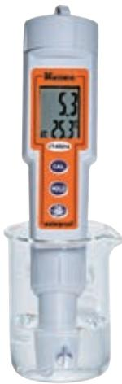

图3-7 用 $\mathrm{pH}$ 计测量溶液的 $\mathrm{pH}$

# 资料卡片

# $\mathrm{pH}$ 试纸和 $\mathrm{pH}$ 计

# 1. pH试纸

$\mathrm{pH}$ 试纸是将试纸用多种酸碱指示剂的混合溶液浸透，经晾干制成的。它对不同 $\mathrm{pH}$ 的溶液能显示不同的颜色，可用于迅速测定溶液的 $\mathrm{pH}$ 。常用的 $\mathrm{pH}$ 试纸有广泛 $\mathrm{pH}$ 试纸和精密 $\mathrm{pH}$ 试纸（如图3-8）。广泛 $\mathrm{pH}$ 试纸的 $\mathrm{pH}$ 范围是 $1 \sim 14$ （最常用）或 $0 \sim 10$ ，可以识别的 $\mathrm{pH}$ 差约为1；精密 $\mathrm{pH}$ 试纸的 $\mathrm{pH}$ 范围较窄，可以判别0.2或0.3的 $\mathrm{pH}$ 差。此外，还有用于酸性、中性或碱性溶液的专用 $\mathrm{pH}$ 试纸。 

图3-8 几种pH试纸

# 2. pH计

$\mathrm{pH}$ 计，又叫酸度计，可用来精密测量溶液的 $\mathrm{pH}$ ，其量程为 $0 \sim 14$ 。人们根据生产与生活的需要，研制了多种类型的 $\mathrm{pH}$ 计，广泛应用于工业、农业、科研和环保等领域。 

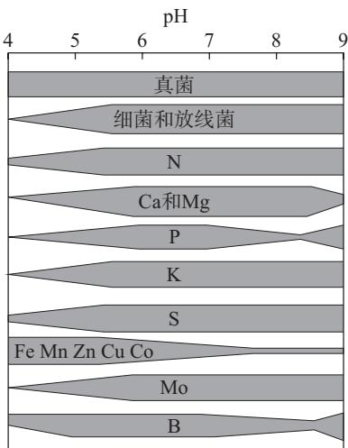

图3-9 土壤的pH和土壤有效养分含量的关系（色带宽窄表示有效养分含量）

工农业生产和科学实验中常常涉及溶液的酸碱性，人们的生活和健康也与溶液的酸碱性有密切关系。因此，测试和调控溶液的 $\mathrm{pH}$ ，对工农业生产、科学研究，以及日常生活和医疗保健等都具有重要意义。 

例如，人体各种体液都有一定的pH。血液的pH是诊断疾病的一个重要参数，当体内的酸碱平衡失调时，利用药物控制pH是辅助治疗的重要手段之一。在日常生活中，人们洗发时使用的护发素具有调节头发的pH使之达到适宜酸碱度的功能。在环保领域，酸性或碱性废水的处理常常利用中和反应。例如，酸性废水可通过投加碱性废渣或通过碱性滤料层过滤使之中和；碱性废水可通过投加酸性废水或利用烟道气中和，在中和过程中可用pH自动测定仪进行检测和控制。在农业生产中，因土壤的pH影响植物对不同形态养分的吸收及养分的有效性（如图3-9），不同作物生长对土壤的pH范围有不同的要求（如表3-2）。在科学实验和工业生产中，溶液pH的控制常常是影响实验结果或产品质量、产量的一个重要因素。在用于测定酸碱浓度的酸碱中和滴定中，溶液pH的变化是判断滴定终点的依据。 

表 3-2 一些重要作物最适宜生长的土壤的 $\mathrm{{pH}}$ 范围

<table><tr><td>作物</td><td>pH范围</td><td>作物</td><td>pH范围</td></tr><tr><td>水稻</td><td>6~7</td><td>生菜</td><td>6~7</td></tr><tr><td>小麦</td><td>6.3~7.5</td><td>薄荷</td><td>7~8</td></tr><tr><td>玉米</td><td>6~7</td><td>苹果</td><td>5~6.5</td></tr><tr><td>大豆</td><td>6~7</td><td>香蕉</td><td>5.5~7</td></tr><tr><td>油菜</td><td>6~7</td><td>草莓</td><td>5~7.5</td></tr><tr><td>棉花</td><td>6~8</td><td>水仙</td><td>6~6.5</td></tr><tr><td>马铃薯</td><td>4.8~5.5</td><td>玫瑰</td><td>6~7</td></tr><tr><td>洋葱</td><td>6~7</td><td>烟草</td><td>5~6</td></tr></table>

# 血液的酸碱平衡

为了维持正常的生理活动，人体各种体液的 $\mathrm{pH}$ 都要保持在一定的范围。例如，血液的正常 $\mathrm{pH}$ 范围是 $7.35\sim 7.45$ 。大多数体液都要保持一个较小的 $\mathrm{pH}$ 变化范围，如果 $\mathrm{pH}$ 变化超出范围，就可能产生危害。当血浆的 $\mathrm{pH}$ 降到7.2以下会引起酸中毒，升到7.5以上会引起碱中毒，降到6.8以下或升到7.8以上，会危及生命安全。血浆中 $\mathrm{H}_2\mathrm{CO}_3 / \mathrm{HCO}_3^-$ 缓冲体系对稳定体系的酸碱度 

发挥着重要作用。 $\mathrm{H}_2\mathrm{CO}_3 / \mathrm{HCO}_3^-$ 的缓冲作用可用下列平衡表示： 

$$
\mathrm {H} ^ {+} (\mathrm {a q}) + \mathrm {H C O} _ {3} ^ {-} (\mathrm {a q}) \rightleftharpoons \mathrm {H} _ {2} \mathrm {C O} _ {3} (\mathrm {a q}) \rightleftharpoons \mathrm {C O} _ {2} (\mathrm {g}) + \mathrm {H} _ {2} \mathrm {O} (\mathrm {l})
$$

当体系中增加少量强酸时，平衡向正反应方向移动而消耗 $\mathrm{H^{+}}$ ；当增加少量强碱时，平衡向逆反应方向移动而消耗 $\mathrm{OH^{-}}$ 。由于 $\mathrm{HCO_3^-}$ 和 $\mathrm{H}_2\mathrm{CO}_3$ 的浓度较大且可以调节，因此可以防止体系的 $\mathsf{pH}$ 出现较大幅度的变化。 

# 三、酸碱中和滴定

酸碱中和滴定是依据中和反应，用已知浓度的酸（或碱）来测定未知浓度的碱（或酸）的方法。滴定中的常用仪器如图3-10所示。滴定管中装有已知物质的量浓度的酸（或碱），锥形瓶中盛放一定量未知浓度、待测定的碱（或酸），待测液中预先滴有几滴酸碱指示剂，如酚酞或甲基橙。把滴定管中的溶液滴加到锥形瓶中，随着酸碱中和反应的进行，溶液的pH会发生变化。对于强酸、强碱的中和，开始时由于被中和的酸或碱浓度较大，加入少量的碱或酸对其pH的影响不大。当接近滴定终点时，极 

中和滴定 

neutralization titration 

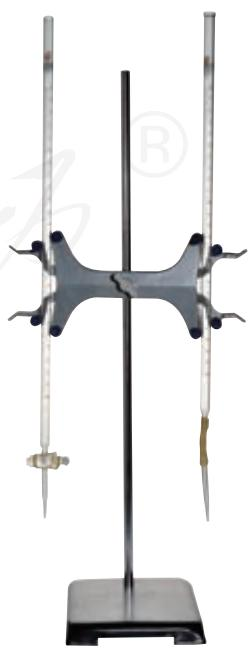

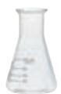

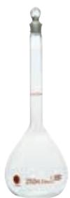

图3-10 酸碱中和滴定常用的仪器

少量的碱或酸就会引起溶液的 $\mathrm{pH}$ 突变（如图3-11）。此时指示剂明显的颜色变化表示反应已完全，即反应到达终点。这时通过滴定管中消耗的酸或碱的量，可以计算出待测碱或酸的物质的量浓度。 

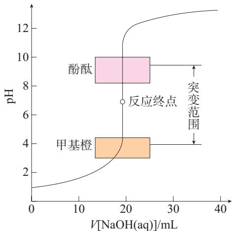

图3-11 用 $0.100\mathrm{~mol/L}$ $\mathrm{NaOH}$ 溶液滴定 $20.00\mathrm{~mL}0.100\mathrm{~mol/L}$ HCl溶液过程中的 $\mathsf{pH}$ 变化

酸碱中和滴定操作简便、快速，而且具有足够的准确度，因此，在工农业生产和科学研究中具有广泛的应用。 

# 资料卡片

# 酸碱指示剂的变色范围

酸碱指示剂是一些有机弱酸或弱碱，它们在溶液中存在电离平衡，其分子与电离出的离子呈现不同的颜色。因此，当 $\mathrm{pH}$ 改变时，分子、离子相对含量的变化会引起溶液颜色的变化。例如，石蕊（以HIn表示）的电离平衡和颜色变化如下： 

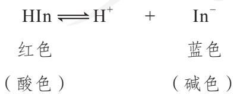

指示剂的颜色变化是在一定的 $\mathrm{pH}$ 范围内发生的。各种指示剂的变色范围是由实验测得的。几种常用指示剂的变色范围如图3-12所示。 

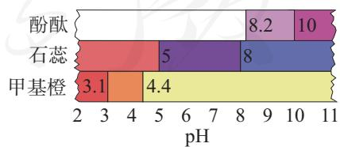

图3-12 几种常用指示剂的变色范围

【例题】用 $0.1032 \mathrm{~mol} / \mathrm{L}$ HCl 溶液滴定未知浓度的 $\mathrm{NaOH}$ 溶液，重复三次的实验数据如下表所示。计算待测 $\mathrm{NaOH}$ 溶液中 $\mathrm{NaOH}$ 的物质的量浓度。 

<table><tr><td>实验次数</td><td>HCl溶液的体积/mL</td><td>待测NaOH溶液的体积/mL</td></tr><tr><td>1</td><td>27.84</td><td>25.00</td></tr><tr><td>2</td><td>27.83</td><td>25.00</td></tr><tr><td>3</td><td>27.85</td><td>25.00</td></tr></table>

【解】滴定中HCl与NaOH有如下物质的量的关系: 

$$
\mathrm {H C l} \quad + \quad \mathrm {N a O H} = \mathrm {N a C l} + \mathrm {H} _ {2} \mathrm {O}
$$

$$
1 \mathrm {m o l} \quad 1 \mathrm {m o l}
$$

$$
c (\mathrm {H C l}) \cdot V [ \mathrm {H C l} (\mathrm {a q}) ] \quad c (\mathrm {N a O H}) \cdot V [ \mathrm {N a O H} (\mathrm {a q}) ]
$$

由此得: $c(\mathrm{NaOH}) = \frac{c(\mathrm{HCl}) \cdot V[\mathrm{HCl(aq)}]}{V[\mathrm{NaOH(aq)}]}$ 

将第一次滴定所得数据代入，得： 

$$
c _ {1} (\mathrm {N a O H}) = \frac {0 . 1 0 3 2 \mathrm {m o l} / \mathrm {L} \times 0 . 0 2 7 8 4 \mathrm {L}}{0 . 0 2 5 0 0 \mathrm {L}} = 0. 1 1 4 9 \mathrm {m o l} / \mathrm {L}
$$

同理可得: $c_{2}(\mathrm{NaOH}) = 0.1149 \mathrm{~mol} / \mathrm{L}, c_{3}(\mathrm{NaOH}) = 0.1150 \mathrm{~mol} / \mathrm{L}$ 

则: $c(\mathrm{NaOH}) = \frac{0.1149 \mathrm{~mol} / \mathrm{L} + 0.1149 \mathrm{~mol} / \mathrm{L} + 0.1150 \mathrm{~mol} / \mathrm{L}}{3}$ 

$$
= 0. 1 1 4 9 \mathrm {m o l} / \mathrm {L}
$$

答：待测 $\mathrm{NaOH}$ 溶液中 $\mathrm{NaOH}$ 的物质的量浓度为 $0.1149\mathrm{mol} / \mathrm{L}$ 。 

# 方法导引

# 定性分析与定量分析

我们在研究物质时，常常需要对物质进行定性分析和定量分析。 

确定物质的成分，包括元素、无机物所含的离子和有机物所含的官能团等，在化学上叫做定性分析。定性分析主要包括试样的外表观察和准备、初步试验（如焰色试验、灼烧试验和溶解试验等）、阳离子分析和阴离子分析等。 

测定物质中元素、离子、官能团等各成分的含量，在化学上叫做定量分析。酸碱中和滴定就是一种重要的定量分析。根据分析方法的不同，定量分析可分为化学分析法和仪器分析法。化学分析法是指依特定的化学反应及其计量关系对物质进行分析的方法；仪器分析法是指利用特定的仪器对物质进行定量分析的方法。根据取样多少，定量分析可分为常量分析、半微量分析、微量分析和超微量分析等。 

在定量分析中，实验误差是客观存在的，所以需要对所得的数据进行处理和评价。例如：在实验中，如果出现误差较大的数据，则需要重新进行实验；在几次实验结果相近的情况下，可计算它们的平均值。 

# 练习与应用

1. 在氨水中存在的粒子有________；在氯水中存在的粒子有________。 

2. 在下列溶液中, $c(\mathrm{H}^{+})$ 由小到大的排列顺序是__________（填序号，下同）； $\mathrm{pH}$ 由小到大的排列顺序是__________。 

① $0.1 \mathrm{~mol} / \mathrm{L}$ HCl溶液 

② $0.1 \mathrm{~mol} / \mathrm{L} \mathrm{H}_{2} \mathrm{SO}_{4}$ 溶液 

③ $0.1 \mathrm{~mol} / \mathrm{L}$ NaOH溶液 

④ $0.1 \mathrm{~mol} / \mathrm{L} \mathrm{CH}_{3} \mathrm{COOH}$ 溶液 

3.（1）某种酱油的 $\mathrm{pH} = 5$ ，则该酱油中的 $c(\mathrm{H}^{+}) =$ 

(2) 在常温下, 柠檬水的 $\mathrm{pH} = 3$ , 其中的 $c(\mathrm{OH}^{-})$ 为________（填字母）。 

a. $0.1\mathrm{mol / L}$ 

b. $1 \times 10^{-3} \mathrm{~mol} / \mathrm{L}$ 

c. $1 \times 10^{-7} \mathrm{~mol} / \mathrm{L}$ 

d. $1 \times 10^{-11} \mathrm{~mol} / \mathrm{L}$ 

4. 体积相同、 $\mathrm{pH}$ 相同的 $\mathrm{HCl}$ 溶液和 $\mathrm{CH}_{3} \mathrm{COOH}$ 溶液分别与 $\mathrm{NaOH}$ 溶液中和时, 二者所消耗 $\mathrm{NaOH}$ 的物质的量的关系是 , 理由是 

5. 在 $48 \mathrm{~mL} 0.1 \mathrm{~mol} / \mathrm{L} \mathrm{HNO}_{3}$ 溶液中加入 $12 \mathrm{~mL} 0.4 \mathrm{~mol} / \mathrm{L} \mathrm{KOH}$ 溶液，所得溶液呈（ ）。 

A. 弱酸性 

B. 强酸性 

C. 碱性 

D. 中性 

6. 测量家中一些物品（可自行增减、更换）的 $\mathrm{pH}$ ，并计算其 $c(\mathrm{H}^{+})$ ，填入下表。 

<table><tr><td>物品</td><td>醋</td><td>酱油</td><td>白酒</td><td>洗涤灵</td><td>“84”消毒液</td><td>洗发液</td><td>洁厕灵</td><td>洗衣液</td><td>柔软剂</td></tr><tr><td>pH</td><td></td><td></td><td></td><td></td><td></td><td></td><td></td><td></td><td></td></tr><tr><td>c(H+)</td><td></td><td></td><td></td><td></td><td></td><td></td><td></td><td></td><td></td></tr></table>

7. 为了研究土壤的酸碱性, 某同学做了如下实验: 常温下将一定体积的蒸馏水加入一定质量的土壤中, 充分搅拌后过滤, 测量滤液的 $\mathrm{pH}$ ; 然后向滤液中滴加氨水, 边滴加边测量溶液的 $\mathrm{pH}$ 。实验记录如下: 

<table><tr><td>加入氨水的体积/mL</td><td>0</td><td>2</td><td>4</td><td>6</td><td>8</td><td>10</td><td>12</td><td>14</td><td>16</td></tr><tr><td>溶液的pH</td><td>4</td><td>4</td><td>4</td><td>4</td><td>6</td><td>8</td><td>10</td><td>10</td><td>10</td></tr></table>

利用上述数据，以加入氨水的体积为横坐标、 $\mathrm{pH}$ 为纵坐标绘制曲线图，并根据曲线图回答下列问题： 

（1）所测土壤的酸碱性如何？ 

(2) 达到反应终点后所得溶液的 $\mathrm{pH}$ 和 $c(\mathrm{OH}^{-})$ 分别为多少? 

(3) 为使该滤液呈中性, 应加入氨水的体积是多少? 

# 第三节

# 盐类的水解

$\mathrm{Na}_{2} \mathrm{CO}_{3}$ 是日常生活中常用的盐，俗称纯碱，常在面点加工时用于中和酸并使食品松软或酥脆，也常用于油污的清洗等。为什么 $\mathrm{Na}_{2} \mathrm{CO}_{3}$ 可被当作“碱”使用呢？ 

# 一、盐类的水解

# 1. 盐溶液的酸碱性

# 探究

# 盐溶液的酸碱性

# 【提出问题】

酸溶液呈酸性，碱溶液呈碱性。那么，盐溶液的酸碱性如何呢？与盐的类型之间有什么关系？ 

# 【实验探究】

(1) 选择合适的方法测试下表所列盐溶液的酸碱性。 

(2) 根据形成该盐的酸和碱的强弱, 将下表中的盐按强酸强碱盐、强酸弱碱盐、强碱弱酸盐进行分类。 

<table><tr><td>盐</td><td>NaCl</td><td>Na2CO3</td><td>NH4Cl</td><td>KNO3</td><td>CH3COONa</td><td>(NH4)2SO4</td></tr><tr><td>盐溶液的酸碱性</td><td></td><td></td><td></td><td></td><td></td><td></td></tr><tr><td>盐的类型</td><td></td><td></td><td></td><td></td><td></td><td></td></tr></table>

# 【结果和讨论】

分析上述实验结果，归纳盐溶液的酸碱性与盐的类型之间的关系。 

<table><tr><td>盐的类型</td><td>强酸强碱盐</td><td>强酸弱碱盐</td><td>强碱弱酸盐</td></tr><tr><td>盐溶液的酸碱性</td><td></td><td></td><td></td></tr></table>

$\mathrm{NH_4Cl}$ 溶液

NaCl溶液

$\mathrm{CH}_3\mathrm{COONa}$ 溶液

图3-13 不同盐溶液的pH

实验表明，强酸强碱盐的溶液呈中性，强酸弱碱盐的溶液呈酸性，强碱弱酸盐的溶液呈碱性（如图3-13）。例如， $\mathrm{Na}_2\mathrm{CO}_3$ 是强碱弱酸盐，其溶液呈碱性，这就是它常被当作“碱”使用的原因。 

# 2. 盐溶液呈现不同酸碱性的原因

溶液呈酸性、碱性还是中性，取决于溶液中 $c(\mathrm{H}^{+})$ 和 $c(\mathrm{OH}^{-})$ 的相对大小。那么，是什么原因造成不同类型的盐溶液中 $c(\mathrm{H}^{+})$ 和 $c(\mathrm{OH}^{-})$ 相对大小的差异呢？ 

# 思考与讨论

根据前面的探究结果, 对三类不同的盐溶液 (NaCl溶液、 $\mathrm{NH}_{4} \mathrm{Cl}$ 溶液和 $\mathrm{CH}_{3} \mathrm{COONa}$ 溶液) 中存在的各种离子, 以及离子间的相互作用进行分析, 尝试找出不同类型的盐溶液呈现不同酸碱性的原因。 

<table><tr><td>盐溶液</td><td>NaCl溶液</td><td>NH4Cl溶液</td><td>CH3COONa溶液</td></tr><tr><td>溶液中存在的离子</td><td></td><td></td><td></td></tr><tr><td>离子间能否相互作用生成弱电解质</td><td></td><td></td><td></td></tr><tr><td>c(H+)和c(OH-)的相对大小</td><td></td><td></td><td></td></tr></table>

通过分析可以知道，盐溶液的酸碱性，与盐在水中电离出来的离子和水电离出来的 $\mathrm{H}^{+}$ 或 $\mathrm{OH}^{-}$ 能否结合生成弱电解质有关。下面我们以 $\mathrm{NH}_{4} \mathrm{Cl}$ 溶液为例进行说明。 

$\mathrm{NH}_{4} \mathrm{Cl}$ 是强电解质，属于强酸弱碱盐。 $\mathrm{NH}_{4} \mathrm{Cl}$ 溶于水后，会全部电离成 $\mathrm{NH}_{4}^{+}$ 和 $\mathrm{Cl}^{-}$ 。纯水中存在着下列电离平衡： 

$$
\mathrm {H} _ {2} \mathrm {O} \rightleftharpoons \mathrm {H} ^ {+} + \mathrm {O H} ^ {-}
$$

其中， $\mathrm{NH_4^+}$ 与水电离出来的 $\mathrm{OH}^{-}$ 结合，生成弱电解质—— $\mathrm{NH}_3 \cdot \mathrm{H}_2\mathrm{O}$ ，破坏了水的电离平衡，使水的电离平衡向右移动。当达到新的平衡时，溶液中 $c(\mathrm{H}^{+}) > c(\mathrm{OH}^{-})$ 。因此， $\mathrm{NH}_4\mathrm{Cl}$ 溶液呈酸性。 

上述过程可以表示为: 

$$
\begin{array}{c}H _ {2} O \rightleftharpoons O H ^ {-} + H ^ {+}\\+\\N H _ {4} C l = N H _ {4} ^ {+} + C l ^ {-}\\\Bigg | \Bigg |\\N H _ {3} \cdot H _ {2} O\end{array}
$$

总反应为: 

$$
\mathrm {N H} _ {4} \mathrm {C l} + \mathrm {H} _ {2} \mathrm {O} \rightleftharpoons \mathrm {N H} _ {3} \cdot \mathrm {H} _ {2} \mathrm {O} + \mathrm {H C l}
$$

离子方程式为： 

$$
\mathrm {N H} _ {4} ^ {+} + \mathrm {H} _ {2} \mathrm {O} \rightleftharpoons \mathrm {N H} _ {3} \cdot \mathrm {H} _ {2} \mathrm {O} + \mathrm {H} ^ {+}
$$

# 思考与讨论

试仿照 $\mathrm{NH}_{4} \mathrm{Cl}$ 溶液呈酸性的分析过程, 说明 $\mathrm{CH}_{3} \mathrm{COONa}$ 溶液呈碱性的原因。 

像 $\mathrm{NH}_{4} \mathrm{Cl}$ 和 $\mathrm{CH}_{3} \mathrm{COONa}$ 这样，在水溶液中，盐电离出来的离子与水电离出来的 $\mathrm{H}^{+}$ 或 $\mathrm{OH}^{-}$ 结合生成弱电解质的反应，叫做盐类的水解。 

$\mathrm{Na}_{2} \mathrm{CO}_{3}$ 的水解情况与 $\mathrm{CH}_{3} \mathrm{COONa}$ 类似, 但由于 $\mathrm{H}_{2} \mathrm{CO}_{3}$ 是二元酸, $\mathrm{Na}_{2} \mathrm{CO}_{3}$ 的水解复杂一些, 是分两步进行的。 

第一步, $\mathrm{Na}_{2} \mathrm{CO}_{3}$ 在水中电离出来的 $\mathrm{CO}_{3}^{2-}$ 发生水解: 

$$
\begin{array}{c}\mathrm {H} _ {2} \mathrm {O} \rightleftharpoons \mathrm {O H} ^ {-} + \mathrm {H} ^ {+}\\+\\\mathrm {N a} _ {2} \mathrm {C O} _ {3} = 2 \mathrm {N a} ^ {+} + \mathrm {C O} _ {3} ^ {2 -}\\\Bigg \|\\\mathrm {H C O} _ {3} ^ {-}\end{array}
$$

水解 hydrolysis 

离子方程式为： 

$$
\mathrm {C O} _ {3} ^ {2 -} + \mathrm {H} _ {2} \mathrm {O} \rightleftharpoons \mathrm {H C O} _ {3} ^ {-} + \mathrm {O H} ^ {-}
$$

第二步, 生成的 $\mathrm{HCO}_{3}^{-}$ 进一步发生水解, 离子方程式为: 

$$
\mathrm {H C O} _ {3} ^ {-} + \mathrm {H} _ {2} \mathrm {O} \rightleftharpoons \mathrm {H} _ {2} \mathrm {C O} _ {3} + \mathrm {O H} ^ {-}
$$

由此可见， $\mathrm{Na}_2\mathrm{CO}_3$ 电离出来的 $\mathrm{CO}_3^{2-}$ 与水电离出来的 $\mathrm{H}^+$ 结合生成 $\mathrm{HCO}_3^-$ ， $\mathrm{HCO}_3^-$ 又与 $\mathrm{H}^+$ 结合生成 $\mathrm{H}_2\mathrm{CO}_3$ ，促使水继续电离，使溶液中的 $c(\mathrm{OH}^-)$ 增大，所以溶液呈碱性。 

但是， $\mathrm{Na}_2\mathrm{CO}_3$ 第二步水解的程度很小，平衡时溶液中 $\mathrm{H}_2\mathrm{CO}_3$ 的浓度很小，不会放出 $\mathrm{CO}_2$ 气体。 

综上所述，当强酸弱碱盐溶于水时，盐电离产生的阳离子与溶液中的 $\mathrm{OH}^{-}$ 结合生成弱碱，使溶液中的 $c(\mathrm{H}^{+}) > c(\mathrm{OH}^{-})$ ，溶液呈酸性。当强碱弱酸盐溶于水时，盐电离产生的阴离子与溶液中的 $\mathrm{H}^{+}$ 结合生成弱酸，使溶液中的 $c(\mathrm{OH}^{-}) > c(\mathrm{H}^{+})$ ，溶液呈碱性。 

当强酸强碱盐如 $\mathrm{NaCl} 、 \mathrm{KNO}_{3}$ 等溶于水时, 盐电离产生的阴、阳离子都不能与溶液中的 $\mathrm{H}^{+}$ 或 $\mathrm{OH}^{-}$ 结合生成弱电解质, 也就是说强酸强碱盐不发生水解, 溶液中 $c\left(\mathrm{H}^{+}\right)=c \left(\mathrm{OH}^{-}\right)$ , 溶液呈中性。 

弱酸和弱碱所生成的盐的水解比较复杂，这里就不介绍了。 

# 方法导引

# 电解质溶液中的电荷守恒与元素质量守恒

电解质溶液中阳离子所带的电荷总数与阴离子所带的电荷总数相等, 即电荷守恒, 溶液呈电中性。例如, 在 $\mathrm{Na}_{2} \mathrm{CO}_{3}$ 溶液中, 存在的阳离子有 $\mathrm{Na}^{+} 、 \mathrm{H}^{+}$ , 存在的阴离子有 $\mathrm{OH}^{-} 、 \mathrm{CO}_{3}^{2-} 、 \mathrm{HCO}_{3}^{-}$ 。根据电荷守恒, 可推出各种离子的浓度之间的关系为: 

$$
c \left(\mathrm {N a} ^ {+}\right) + c \left(\mathrm {H} ^ {+}\right) = c \left(\mathrm {O H} ^ {-}\right) + c \left(\mathrm {H C O} _ {3} ^ {-}\right) + 2 c \left(\mathrm {C O} _ {3} ^ {2 -}\right)
$$

在电解质溶液中, 由于某些离子发生水解或电离, 离子的存在形式发生了变化。就该离子所含的某种元素来说, 其质量在变化前后是守恒的, 即元素质量守恒。例如, 在 $0.1 \mathrm{~mol} / \mathrm{L} \mathrm{Na}_{2} \mathrm{CO}_{3}$ 溶液中, 由于 $\mathrm{CO}_{3}^{2-}$ 发生水解, 其在溶液中的存在形式除了 $\mathrm{CO}_{3}^{2-}$ , 还有 $\mathrm{HCO}_{3}^{-}$ 和 $\mathrm{H}_{2} \mathrm{CO}_{3}$ 。根据碳元素质量守恒, 则有以下关系: 

$$
c \left(\mathrm {C O} _ {3} ^ {2 -}\right) + c \left(\mathrm {H C O} _ {3} ^ {-}\right) + c \left(\mathrm {H} _ {2} \mathrm {C O} _ {3}\right) = 0. 1 \mathrm {m o l} / \mathrm {L}
$$

电荷守恒和元素质量守恒是电解质溶液中重要的守恒关系，也是计算和比较电解质溶液中各种离子浓度大小的依据。 

# 二、影响盐类水解的主要因素

研究盐类水解时，一般从两个方面考虑：一是反应物的性质；二是反应条件。 

盐类水解程度的大小，主要是由盐的性质所决定的。例如，对于强碱弱酸盐（MA）的水解： 

$\mathrm{H}_2\mathrm{O}\rightleftharpoons \mathrm{H}^+ +\mathrm{OH}^-$ +  
MA $= A^{-} + M^{+}$ 1 HA（弱酸） 

生成盐的弱酸酸性越弱，即越难电离（电离常数越小），该盐的水解程度越大。同理，对于强酸弱碱盐来说，生成盐的弱碱碱性越弱，该盐的水解程度越大。 

盐类的水解是可逆反应，水解平衡也受温度、浓度等反应条件的影响。 

# 探究

反应条件对 $\mathrm{FeCl}_{3}$ 水解平衡的影响 

# 【提出问题】

(1) $\mathrm{FeCl}_3$ 溶液呈酸性还是碱性？写出 $\mathrm{FeCl}_3$ 发生水解的离子方程式。 

(2) 从反应条件考虑, 影响 $\mathrm{FeCl}_{3}$ 水解平衡的因素可能有哪些? 

# 【实验探究】

现有以下实验用品： 

试管、试管夹、试管架、胶头滴管、 $\mathrm{pH}$ 计、药匙、酒精灯、火柴; 

$0.01 \mathrm{~mol} / \mathrm{L} \mathrm{FeCl}_{3}$ 溶液、 $\mathrm{FeCl}_{3}$ 晶体、浓盐酸、浓氢氧化钠溶液。 

# 提示

$\mathrm{Fe(OH)}_{3}$ 是一种弱碱，不溶于水。 

请根据所提供的实验用品（可自行增加），参照下表设计实验，完成实验并记录现象。应用平衡移动原理对实验现象进行解释。 

<table><tr><td>影响因素</td><td>实验步骤</td><td>实验现象</td><td>解释</td></tr><tr><td>温度</td><td></td><td></td><td></td></tr><tr><td>反应物的浓度</td><td></td><td></td><td></td></tr><tr><td>生成物的浓度</td><td></td><td></td><td></td></tr></table>

# 【结果和讨论】

总结温度、浓度对 $\mathrm{FeCl}_3$ 水解平衡的影响，并与同学讨论。 

根据平衡移动原理，温度、浓度等反应条件的改变都会引起水解平衡的移动，从而影响盐类水解的程度。例如，盐类的水解可看作酸碱中和反应的逆反应，中和反应是放热反应，盐类的水解是吸热反应，因此加热可促使平衡向水解反应的方向移动，盐的水解程度增大；加水稀释可促使平衡向水解反应的方向移动，盐的水解程度增大；在盐溶液中加入适量酸或碱，都会引起盐类水解平衡的移动和水解程度的改变；等等。 

# 三、盐类水解的应用

在生活、生产和科学研究中，人们常运用盐类水解的原理来解决实际问题。例如，用 $\mathrm{Na}_2\mathrm{CO}_3$ 溶液清洗油污时，加热可以增强去污效果，原因就在于升温可以促进 $\mathrm{Na}_2\mathrm{CO}_3$ 的水解，使溶液中 $c(\mathrm{OH}^{-})$ 增大。在实验室中配制 $\mathrm{FeCl}_3$ 溶液时，常将 $\mathrm{FeCl}_3$ 晶体溶于较浓的盐酸中，然后再加水稀释 

到所需的浓度，目的就是通过增大溶液中 $\mathrm{H}^{+}$ 的浓度来抑制 $\mathrm{FeCl}_{3}$ 的水解。 

又如，人们常用可溶性的铝盐、铁盐作净水剂，就是利用 $\mathrm{Al}^{3+}$ 、 $\mathrm{Fe}^{3+}$ 的水解。 $\mathrm{Al}^{3+}$ 水解生成的 $\mathrm{Al(OH)}_3$ 胶体、 $\mathrm{Fe}^{3+}$ 水解生成的 $\mathrm{Fe(OH)}_3$ 胶体可以使水中细小的悬浮颗粒聚集成较大的颗粒而沉降，从而除去水中的悬浮物，起到净水的作用。 

如果盐的水解程度很大，则可以用于无机化合物的制备。例如，用 $\mathrm{TiCl_4}$ 制备 $\mathrm{TiO_2}$ 的反应可表示如下： 

$$
\mathrm {T i C l} _ {4} + (x + 2) \mathrm {H} _ {2} \mathrm {O} = \mathrm {T i O} _ {2} \cdot x \mathrm {H} _ {2} \mathrm {O} \downarrow + 4 \mathrm {H C l}
$$

在制备时加入大量的水，同时加热，促使水解趋于完全，所得 $\mathrm{TiO_2} \cdot x\mathrm{H_2O}$ 经焙烧得到 $\mathrm{TiO_2}$ （类似的方法也可用于制备 $\mathrm{SnO}$ 、 $\mathrm{SnO_2}$ 等）。 $\mathrm{TiO_2}$ 的化学性质非常稳定，是一种白色颜料，广泛用于涂料、橡胶和造纸等工业。 

# 资料卡片

# 盐的水解常数

我们用HA表示酸，MOH表示碱，MA表示由它们生成的盐。若MA为强碱弱酸盐，则其水解的离子方程式为： 

$$
\mathrm {A} ^ {-} + \mathrm {H} _ {2} \mathrm {O} \rightleftharpoons \mathrm {H A} + \mathrm {O H} ^ {-}
$$

上述反应的平衡常数可表示为： 

$$
K _ {\mathrm {h}} = \frac {c (\mathrm {H A}) \cdot c (\mathrm {O H} ^ {-})}{c (\mathrm {A} ^ {-})}
$$

$K_{\mathrm{h}}$ 称为盐的水解常数。 

当水解达到平衡时，溶液中还存在以下关系： 

$$
c (\mathrm {H A}) = \frac {c (\mathrm {H} ^ {+}) \cdot c (\mathrm {A} ^ {-})}{K _ {\mathrm {a}}}
$$

将以上关系式代入 $K_{\mathrm{h}}$ 的表达式，得到强碱弱酸盐的水解常数与弱酸电离常数的关系式： 

$$
K _ {\mathrm {h}} = \frac {c (\mathrm {H} ^ {+}) \cdot c (\mathrm {O H} ^ {-})}{K _ {\mathrm {a}}} = \frac {K _ {\mathrm {w}}}{K _ {\mathrm {a}}}
$$

同理，可推出强酸弱碱盐的水解常数与弱碱电离常数的关系式： 

$$
K _ {\mathrm {h}} = \frac {K _ {\mathrm {w}}}{K _ {\mathrm {b}}}
$$

上述两个关系式表明，弱酸或弱碱的电离常数越小（酸性或碱性越弱），其所生成的盐的水解程度越大，这正好印证了我们前面的分析结果。 

# 练习与应用

1. 明矾 $\left[\text { 化学式为 } \mathrm{KAl}\left(\mathrm{SO}_{4}\right)_{2} \cdot 12 \mathrm{H}_{2} \mathrm{O}\right]$ 溶液呈 性（填“酸”“碱”或“中”），原因是 (用离子方程式表示)。 

2. 在实验室配制 $\mathrm{Na}_{2} \mathrm{~S}$ 溶液时, 常滴加几滴 $\mathrm{NaOH}$ 溶液, 试说明原因: 

3. 草木灰与铵态氮肥不能混合施用，其原因是 

4. 在常温下, 实验测得 $0.1 \mathrm{~mol} / \mathrm{L} \mathrm{CH}_{3} \mathrm{COONa}$ 溶液的 $\mathrm{pH}=9$ , 则溶液中由水电离出来的 $c(\mathrm{OH}^{-})=$ 

5. 在常温下, $\mathrm{CH}_{3} \mathrm{COOH}$ 溶液和 $\mathrm{NaOH}$ 溶液充分反应后所得溶液的 $\mathrm{pH}=7$ , 则此溶液中 $c \left(\mathrm{CH}_{3} \mathrm{COO}^{-}\right)$ 和 $c \left(\mathrm{Na}^{+}\right)$ 的大小关系是 

6. 下列溶液因盐的水解而呈酸性的是（ ）。 

A. $\mathrm{Na}_{2}\mathrm{SO}_{4}$ 溶液 

B. $\mathrm{NaHCO}_{3}$ 溶液 

C. $\mathrm{CH}_3\mathrm{COOH}$ 溶液 

D. $\mathrm{NH}_{4} \mathrm{Cl}$ 溶液 

7. 强碱MOH的溶液和等体积、等物质的量浓度的弱酸HA的溶液混合后，溶液中有关离子浓度的大小关系是（ ）。 

A. $c(\mathrm{M}^{+}) > c(\mathrm{OH}^{-}) > c(\mathrm{A}^{-}) > c(\mathrm{H}^{+})$ 

B. $c(\mathrm{M}^{+}) > c(\mathrm{A}^{-}) > c(\mathrm{H}^{+}) > c(\mathrm{OH}^{-})$ 

C. $c(\mathrm{M}^{+}) > c(\mathrm{A}^{-}) > c(\mathrm{OH}^{-}) > c(\mathrm{H}^{+})$ 

D. $c(\mathrm{M}^{+}) > c(\mathrm{H}^{+}) > c(\mathrm{A}^{-}) > c(\mathrm{OH}^{-})$ 

8. 比较相同温度下,等物质的量浓度的 ${\mathrm{{Na}}}_{2}{\mathrm{{CO}}}_{3}$ 溶液和 ${\mathrm{{NaHCO}}}_{3}$ 溶液 $\mathrm{{pH}}$ 的相对大小,并说明原因。 

9. $\mathrm{Sb}_{2} \mathrm{O}_{3}$ 可用作白色颜料和阻燃剂等。在实验室中可利用 $\mathrm{SbCl}_{3}$ 的水解反应制取 $\mathrm{Sb}_{2} \mathrm{O}_{3}$ （ $\mathrm{SbCl}_{3}$ 的水解分三步进行，中间产物有 $\mathrm{SbOCl}$ 等），其总反应可表示为： 

$$
2 \mathrm {S b C l} _ {3} + 3 \mathrm {H} _ {2} \mathrm {O} \rightleftharpoons \mathrm {S b} _ {2} \mathrm {O} _ {3} + 6 \mathrm {H C l}
$$

为了得到较多的 $\mathrm{Sb}_{2} \mathrm{O}_{3}$ , 操作时要将 $\mathrm{SbCl}_{3}$ 缓慢加入大量水中, 反应后期还要加入少量氨水。试利用平衡移动原理说明这两项操作的作用。 

10. $\mathrm{SOCl}_2$ （亚硫酰氯）是一种液态化合物，沸点为 $77\%$ 。向盛有 $10~\mathrm{mL}$ 水的锥形瓶中小心滴加 $8\sim 10$ 滴 $\mathrm{SOCl}_2$ ，可观察到剧烈反应，液面上有白雾形成，并有带刺激性气味的气体逸出，该气体中含有能使品红溶液褪色的 $\mathrm{SO}_2$ 。轻轻振荡锥形瓶，待白雾消失后，向溶液中滴加 $\mathrm{AgNO}_3$ 溶液，有不溶于稀硝酸的白色沉淀析出。 

（1）根据实验现象，写出 $\mathrm{SOCl}_2$ 与水反应的化学方程式。 

(2) 将 $\mathrm{AlCl}_{3}$ 溶液蒸干并灼烧得不到无水 $\mathrm{AlCl}_{3}$ , 而将 $\mathrm{SOCl}_{2}$ 与 $\mathrm{AlCl}_{3} \cdot 6 \mathrm{H}_{2} \mathrm{O}$ 混合并加热, 可得到无水 $\mathrm{AlCl}_{3}$ , 试解释原因。 

# 第四节

# 沉淀溶解平衡

我们知道，溶液中有沉淀生成是离子反应发生的条件之一。例如，将 $\mathrm{AgNO}_3$ 溶液与 $\mathrm{NaCl}$ 溶液混合，会生成白色的 $\mathrm{AgCl}$ 沉淀，反应的离子方程式为： 

$$
A g ^ {+} + C l ^ {-} = A g C l \downarrow
$$

如果上述两种溶液中 $\mathrm{AgNO}_3$ 和 $\mathrm{NaCl}$ 的物质的量相等且充分反应，此时溶液中还有 $\mathrm{Ag}^+$ 和 $\mathrm{Cl}^-$ 吗？ 

# 一、难溶电解质的沉淀溶解平衡

# 思考与讨论

在初中化学中, 我们曾根据物质溶解度的大小, 将物质分为易溶物、可溶物、微溶物和难溶物。例如, $\mathrm{AgCl} 、 \mathrm{BaSO}_{4} 、 \mathrm{Fe}(\mathrm{OH})_{3}$ 等都属于难溶物。 

根据表3-3所提供的溶解度数据，以及你对化学反应限度、化学平衡原理的认识，讨论以下问题： 

(1) 通常我们所说的难溶物在水中是否完全不能溶解? 

(2) 生成 $\mathrm{AgCl}$ 沉淀的离子反应完成后, 溶液中是否还有 $\mathrm{Ag}^{+}$ 和 $\mathrm{Cl}^{-}$ ? 

# 资料卡片

表 3-3 几种电解质的溶解度 (20℃)

<table><tr><td>化学式</td><td>溶解度/g</td></tr><tr><td>AgCl</td><td>1.5×10-4</td></tr><tr><td>AgNO3</td><td>211</td></tr><tr><td>AgBr</td><td>8.4×10-6</td></tr><tr><td>Ag2SO4</td><td>0.786</td></tr><tr><td>Ag2S</td><td>1.3×10-16</td></tr><tr><td>BaCl2</td><td>35.7</td></tr><tr><td>Ba(OH)2</td><td>3.89</td></tr><tr><td>BaSO4</td><td>3.1×10-4</td></tr><tr><td>Ca(OH)2</td><td>0.160</td></tr><tr><td>CaSO4</td><td>0.202</td></tr><tr><td>Mg(OH)2</td><td>6.9×10-4</td></tr><tr><td>Fe(OH)3</td><td>3×10-9</td></tr></table>

从表3-3可以看出，不同的电解质在水中的溶解度差别很大，如 $\mathrm{AgCl}$ 和 $\mathrm{AgNO}_3$ 。人们习惯上将溶解度小于 $0.01\mathrm{g}$ 的电解质称为难溶电解质。尽管难溶电解质的溶解度很小，但在水中并不是绝对不溶。例如，在 $20\%$ 时， $\mathrm{AgCl}$ 的溶解度为 $1.5\times 10^{-4}\mathrm{g}$ 。因此，在生成 $\mathrm{AgCl}$ 沉淀后，有三种粒子在反应体系中共存： 

$$
A g ^ {+} (a q) + C l ^ {-} (a q) \rightleftharpoons A g C l (s)
$$

从固体溶解和沉淀生成的角度，我们可以看出 $\mathrm{AgCl}$ 在溶液中存在下述两个过程：一方面，在水分子作用下，少量 $\mathrm{Ag^{+}}$ 和 $\mathrm{Cl^{-}}$ 脱离 $\mathrm{AgCl}$ 的表面进入水中，这一过程就是溶解；另一方面，溶液中的 $\mathrm{Ag^{+}}$ 和 $\mathrm{Cl^{-}}$ 受 $\mathrm{AgCl}$ 表面阴、阳离子的吸引，回到 $\mathrm{AgCl}$ 的表面析出，这一过程就是沉淀。在一定温度下，当沉淀和溶解的速率相等时，得到 $\mathrm{AgCl}$ 的饱和溶液，即建立下列动态平衡： 

$$
\mathrm {A g C l} (\mathrm {s}) \xrightarrow [ \text {沉 淀} ]{\text {溶 解}} \mathrm {A g} ^ {+} (\mathrm {a q}) + \mathrm {C l} ^ {-} (\mathrm {a q})
$$

人们把这种平衡称为沉淀溶解平衡。沉淀、溶解之间这种动态平衡的存在，决定了 $\mathrm{Ag^{+}}$ 与 $\mathrm{Cl^-}$ 的反应不能进行完全。但在一般情况下，当溶液中剩余离子的浓度小于 $1\times 10^{-5}\mathrm{mol / L}$ 时，化学上通常认为生成沉淀的反应就进行完全了。 

与电离平衡、水解平衡一样，难溶电解质的沉淀溶解平衡也存在平衡常数，称为溶度积常数，简称溶度积，符号为 $K_{\mathrm{sp}}$ 。 

例如，对于下列难溶电解质的沉淀溶解平衡， $K_{\mathrm{sp}}$ 可分别表示为（固体纯物质一般不列入平衡常数）： 

$$
\mathrm {A g C l} (\mathrm {s}) \rightleftharpoons \mathrm {A g} ^ {+} (\mathrm {a q}) + \mathrm {C l} ^ {-} (\mathrm {a q}) \quad K _ {\mathrm {s p}} = c (\mathrm {A g} ^ {+}) \cdot c (\mathrm {C l} ^ {-})
$$

$$
\mathrm {A g} _ {2} \mathrm {S} (\mathrm {s}) \rightleftharpoons 2 \mathrm {A g} ^ {+} (\mathrm {a q}) + \mathrm {S} ^ {2 -} (\mathrm {a q}) K _ {\mathrm {s p}} = c ^ {2} (\mathrm {A g} ^ {+}) \cdot c (\mathrm {S} ^ {2 -})
$$

$K_{\mathrm{sp}}$ 反映了难溶电解质在水中的溶解能力，与难溶电解质的性质和温度有关。25℃时常见难溶电解质的溶度积见附录Ⅲ。 

溶度积 solubility product 

根据某温度下难溶电解质的溶度积与该溶液中离子积 符号为 $Q$ , 如对于 $\mathrm{Ag}_2\mathrm{S}$ 溶液来说, 任意时刻的 $Q = c^2 (\mathrm{Ag}^+) \cdot c(\mathrm{S}^{2-})$  的相对大小, 可以判断该温度下的溶液中难溶电解质的沉淀或溶解情况: 

$Q > K_{\mathrm{sp}}$ ，溶液中有沉淀析出； 

$Q = K_{\mathrm{sp}}$ ，沉淀与溶解处于平衡状态； 

$Q < K_{\mathrm{sp}}$ ，溶液中无沉淀析出。 

# 二、沉淀溶解平衡的应用

难溶电解质的沉淀溶解平衡是动态平衡，我们可以通过改变条件，使平衡向着需要的方向移动——溶液中的离子转化为沉淀，或沉淀转化为溶液中的离子。因此，沉淀溶解平衡在生产、科研和环保等领域具有广泛的应用。 

# 1. 沉淀的生成

在无机物的制备和提纯、废水处理等领域，常利用生成沉淀来达到分离或除去某些离子的目的。例如，工业原料氯化铵中含杂质氯化铁，将含杂质的氯化铵溶解于水，再加入氨水调节 $\mathrm{pH}$ ，可使 $\mathrm{Fe}^{3+}$ 生成 $\mathrm{Fe(OH)}_3$ 沉淀而除去。又如，在工业废水处理过程中（如图3-14），以 $\mathrm{Na}_2\mathrm{S}$ 作沉淀剂，使废水中的某些金属离子如 $\mathrm{Cu}^{2+}$ 、 $\mathrm{Hg}^{2+}$ 等，生成极难溶的 $\mathrm{CuS}$ 、 $\mathrm{HgS}$ 等沉淀而除去，也是分离、除去杂质常用的方法。 

图3-14 化学沉淀法废水处理工艺流程示意图

# 思考与讨论

利用生成沉淀分离或除去某种离子，首先要使生成沉淀的反应能够发生；其次希望沉淀反应完成后，溶液中剩余离子的浓度能够尽量小。 

(1) 如果要除去某溶液中的 $\mathrm{SO}_{4}^{2-}$ , 你选择加入钙盐还是钡盐? 为什么? 

(2) 如何使沉淀反应完成后, 溶液中剩余离子的浓度能够尽量小? 

# 2. 沉淀的溶解

在实际应用中，常常会遇到需要使难溶物质溶解的问题。根据平衡移动原理，对于在水中难溶的电解质，如果能设法不断地移去平衡体系中的相应离子，使平衡向沉淀溶解的方向移动，就可以使沉淀溶解。例如，难溶于水的 $\mathrm{CaCO_3}$ 沉淀可以溶于盐酸中： 

$$
\begin{array}{l} \mathrm {C a C O} _ {3} (\mathrm {s}) \rightleftharpoons \mathrm {C O} _ {3} ^ {2 -} (\mathrm {a q}) + \mathrm {C a} ^ {2 +} (\mathrm {a q}) \\ \begin{array}{c} \downarrow + H ^ {+} \end{array} \\ \mathrm {H C O} _ {3} ^ {-} (\mathrm {a q}) \stackrel {+ \mathrm {H} ^ {+}} {\Longrightarrow} \mathrm {H} _ {2} \mathrm {C O} _ {3} \longrightarrow \mathrm {H} _ {2} \mathrm {O} + \mathrm {C O} _ {2} \uparrow \\ \end{array}
$$

在上述反应中， $\mathrm{CO}_{2}$ 气体的生成和逸出，使 $\mathrm{CaCO}_{3}$ 溶解平衡体系中的 $\mathrm{CO}_{3}^{2-}$ 浓度不断减小，溶液中 $\mathrm{CO}_{3}^{2-}$ 与 $\mathrm{Ca}^{2+}$ 的离子积—— $Q(\mathrm{CaCO}_{3}) < K_{\mathrm{sp}}(\mathrm{CaCO}_{3})$ ，导致平衡向沉淀溶解的方向移动。只要盐酸的量足够， $\mathrm{CaCO}_{3}$ 就可以完全溶解。类似的可用强酸溶解的难溶电解质还有 FeS、 $\mathrm{Al(OH)}_{3}$ 、 $\mathrm{Cu(OH)}_{2}$ 和 $\mathrm{Mg(OH)}_{2}$ 等。 

# 思考与讨论

（1）写出实验3-3中有关反应的化学方程式。 

（2）应用平衡移动原理分析、解释实验3-3中发生的反应。 

# 【实验3-3】

向两支盛有少量 $\mathrm{Mg(OH)}_{2}$ 固体的试管中分别滴加适量 

的蒸馏水和盐酸，观察并记录现象。 

<table><tr><td>滴加的试剂</td><td>蒸馏水</td><td>盐酸</td></tr><tr><td>现象</td><td></td><td></td></tr></table>

# 3. 沉淀的转化

在实际应用中，有时需要将一种沉淀转化为另一种沉淀。那么，在什么条件下能够实现沉淀的转化呢？ 

# 【实验3-4】

(1) 向盛有 $2 \mathrm{~mL} 0.1 \mathrm{~mol} / \mathrm{L} \mathrm{NaCl}$ 溶液的试管中滴加 $2 \mathrm{~mL}$ 滴 $0.1 \mathrm{~mol} / \mathrm{L} \mathrm{AgNO}_{3}$ 溶液, 观察并记录现象。 

(2) 振荡试管, 然后向其中滴加 4 滴 $0.1 \mathrm{~mol} / \mathrm{L}$ KI溶液, 观察并记录现象。 

(3) 振荡试管, 然后再向其中滴加 8 滴 $0.1 \mathrm{~mol} / \mathrm{L} \mathrm{Na}_{2} \mathrm{~S}$ 溶液, 观察并记录现象。 

<table><tr><td>步骤</td><td>(1)</td><td>(2)</td><td>(3)</td></tr><tr><td>现象</td><td></td><td></td><td></td></tr></table>

图3-15 沉淀的转化（I）

# 【实验3-5】

(1) 向盛有 $2 \mathrm{~mL} 0.1 \mathrm{~mol} / \mathrm{L} \mathrm{MgCl}_{2}$ 溶液的试管中滴加 $2 \sim 4$ 滴 $2 \mathrm{~mol} / \mathrm{L} \mathrm{NaOH}$ 溶液, 观察并记录现象。 

(2) 向上述试管中滴加 4 滴 $0.1 \mathrm{~mol} / \mathrm{L} \mathrm{FeCl}_{3}$ 溶液, 静置, 观察并记录现象。 

<table><tr><td>步骤</td><td>(1)</td><td>(2)</td></tr><tr><td>现象</td><td></td><td></td></tr></table>

图3-16 沉淀的转化（Ⅱ）

从实验现象可以看出，在实验3-4中， $\mathrm{AgCl}$ 沉淀转化为 $\mathrm{AgI}$ 沉淀， $\mathrm{AgI}$ 沉淀又转化为 $\mathrm{Ag_2S}$ 沉淀；在实验3-5中， $\mathrm{Mg(OH)_2}$ 沉淀转化为 $\mathrm{Fe(OH)_3}$ 沉淀。 

为什么沉淀能够转化呢？下面我们以AgCl沉淀转化为AgI沉淀为例进行说明。 

AgCl在水中存在沉淀溶解平衡： 

$$
\mathrm {A g C l} (\mathrm {s}) \rightleftharpoons \mathrm {A g} ^ {+} (\mathrm {a q}) + \mathrm {C l} ^ {-} (\mathrm {a q}) \quad K _ {\mathrm {s p}} = 1. 8 \times 1 0 ^ {- 1 0}
$$

AgI在水中也存在沉淀溶解平衡: 

$$
\mathrm {A g l} (\mathrm {s}) \rightleftharpoons \mathrm {A g} ^ {+} (\mathrm {a q}) + \mathrm {I} ^ {-} (\mathrm {a q}) \quad K _ {\mathrm {s p}} = 8. 5 \times 1 0 ^ {- 1 7}
$$

由上可知，在水中 $K_{\mathrm{sp}}(\mathrm{AgI})$ 远小于 $K_{\mathrm{sp}}(\mathrm{AgCl})$ ，即 $\mathrm{AgI}$ 在水中的溶解度远比 $\mathrm{AgCl}$ 的溶解度小。 

当向 $\mathrm{AgCl}$ 沉淀中滴加KI溶液时，溶液中 $\mathrm{Ag^{+}}$ 与 $\mathrm{I}^{-}$ 的离子积—— $Q(\mathrm{AgI}) > K_{\mathrm{sp}}(\mathrm{AgI})$ ，因此， $\mathrm{Ag^{+}}$ 与 $\mathrm{I}^{-}$ 结合生成 $\mathrm{AgI}$ 沉淀，导致 $\mathrm{AgCl}$ 的沉淀溶解平衡向溶解的方向移动，直至建立新的沉淀溶解平衡： 

$$
\begin{array}{c} \operatorname {A g C l} (s) \Longleftrightarrow \operatorname {A g} ^ {+} (\operatorname {a q}) + \operatorname {C l} ^ {-} (\operatorname {a q}) \\ \hskip 1 4. 2 2 6 3 7 8 p t + \\ \operatorname {I} ^ {-} (\operatorname {a q}) \\ \hskip 1 4. 2 2 6 3 7 8 p t \operatorname {A g l} (s) \end{array}
$$

如果加入足量KI溶液，上述过程可以继续进行，直到绝大部分AgCl沉淀转化为AgI沉淀。反应的离子方程式可表示为： 

$$
\mathrm {I} ^ {-} (\mathrm {a q}) + \mathrm {A g C l} (\mathrm {s}) \Longleftrightarrow \mathrm {A g l} (\mathrm {s}) + \mathrm {C l} ^ {-} (\mathrm {a q})
$$

上述过程说明，沉淀转化的实质就是沉淀溶解平衡的 

移动。一般来说，溶解度小的沉淀转化为溶解度更小的沉淀容易实现。两者的溶解度差别越大，转化越容易。 

沉淀的转化在科研和生产中具有重要的应用价值。例如，锅炉水垢既会降低燃料的利用率，造成能源浪费，又会影响锅炉的使用寿命，并形成安全隐患，因此要定期去除锅炉水垢。为了除去水垢中的 $\mathrm{CaSO}_4$ ，可先用 $\mathrm{Na}_2\mathrm{CO}_3$ 溶液处理，使 $\mathrm{CaSO}_4$ 转化为疏松、易溶于酸的 $\mathrm{CaCO_3}$ （ $\mathrm{CaCO_3}$ 、 $\mathrm{CaSO_4}$ 的 $K_{\mathrm{sp}}$ 分别为 $3.4\times 10^{-9}$ 、 $4.9\times 10^{-5}$ ），然后用酸除去。 

在自然界也发生着溶解度小的矿物转化为溶解度更小的矿物的现象。例如，各种原生铜的硫化物经氧化、淋滤作用后可变成 $\mathrm{CuSO_4}$ 溶液，并向深部渗透，遇到深层的闪锌矿（ZnS）和方铅矿（PbS），便慢慢地使它们转化为铜蓝（CuS）。 

# 科学·技术·社会

# 氟化物预防龋齿的化学原理

龋齿俗称蛀牙，是口腔的常见病之一。那么，龋齿是怎样发生的呢？ 

牙齿的表面有一薄层釉质保护着，釉质层的主要成分是难溶的羟基磷灰石 $\left[\mathrm{Ca}_{5}(\mathrm{PO}_{4})_{3}\mathrm{OH}\right]$ 。当人进食以后，口腔中的细菌在分解食物（特别是含糖量高的食物）的过程中会产生有机酸，如乙酸、乳酸 $\left[\mathrm{CH}_{3}\mathrm{CH}(\mathrm{OH})\mathrm{COOH}\right]$ 等。由于细菌在牙齿表面形成一层黏附膜——齿斑（或称菌斑），这些有机酸长时间与牙齿表面密切接触，产生的 $\mathrm{H}^{+}$ 使羟基磷灰石溶解： 

$$
\mathrm {C a} _ {5} \left(\mathrm {P O} _ {4}\right) _ {3} \mathrm {O H} + 4 \mathrm {H} ^ {+} = 5 \mathrm {C a} ^ {2 +} + 3 \mathrm {H P O} _ {4} ^ {2 -} + \mathrm {H} _ {2} \mathrm {O}
$$

如果上述缓慢发生的反应长期进行，牙齿的釉质层就会逐渐溶解，最终导致龋齿。 

坚持饭后刷牙，去除牙齿上的食物残渣和 

细菌，可以有效减缓龋齿的发生。研究发现，在饮用水、食物或牙膏中添加氟化物，也能起到预防龋齿的作用。这是因为氟离子能与羟基磷灰石发生反应，生成氟磷灰石 $\left[\mathrm{Ca}_{5}(\mathrm{PO}_{4})_{3}\mathrm{F}\right]$ ： $\mathrm{Ca}_{5}(\mathrm{PO}_{4})_{3}\mathrm{OH}(\mathrm{s}) + \mathrm{F}^{-}(\mathrm{aq}) \rightleftharpoons \mathrm{Ca}_{5}(\mathrm{PO}_{4})_{3}\mathrm{F}(\mathrm{s}) + \mathrm{OH}^{-}(\mathrm{aq})$ 

上述反应使牙齿釉质层的组成发生了变化。研究证实，氟磷灰石的溶解度比羟基磷灰石的小，而且更能抵抗酸的侵蚀。此外，氟离子还能抑制口腔细菌产生酸。 

使用含氟牙膏是目前应用最广泛的预防龋齿的措施。添入牙膏中的氟化物有一氟磷酸钠（ $\mathrm{Na}_2\mathrm{PO}_3\mathrm{F}$ ）、氟化钠（ $\mathrm{NaF}$ ）和氟化锶（ $\mathrm{SrF}_2$ ）等。需要注意的是，高氟地区的人群、6岁以下的儿童等不宜使用含氟牙膏。 

# 研究与实践

# 了解水处理过程中的化学原理

# 【研究目的】

通过查阅资料或现场参观等，了解水处理过程中涉及的化学原理，认识水溶液中的离子反应与平衡在生产、生活中的应用，提高安全用水的意识，体会化学的价值。 

# 【研究任务】

(1) 了解水的硬度, 以及常用的硬水软化的方法及其化学原理。 

(2) 了解工业锅炉水垢的主要成分、危害、处理方法及其化学原理。 

(3) 了解污水处理中主要的化学方法及其原理。 

# 【结果与讨论】

(1) 通过研究, 你得到什么启示? 

(2) 撰写研究报告，并与同学讨论。 

1. 在一定温度下， $\mathrm{Mg(OH)}_2$ 在水中的沉淀溶解平衡可用离子方程式表示为________，该平衡的 $K_{\mathrm{sp}}$ 可表示为________。 

2. 难溶电解质在水中达到沉淀溶解平衡时，下列说法中错误的是（ ）。 

A. 沉淀的速率和溶解的速率相等 

B. 难溶电解质在水中形成饱和溶液 

C. 再加入难溶电解质, 溶液中各离子的浓度不变 

D. 难溶电解质溶解形成的阴、阳离子的浓度相等 

3. 现进行下列实验。 

(1) 将 $0.1 \mathrm{~mol} / \mathrm{L} \mathrm{AgNO}_{3}$ 溶液和 $0.1 \mathrm{~mol} / \mathrm{L} \mathrm{NaCl}$ 溶液等体积混合, 得到悬浊液a; 将悬浊液a过滤, 得到滤液b和白色沉淀c。 

（2）向滤液b中滴加 $0.1\mathrm{mol} / \mathrm{L}$ KI溶液，滤液出现浑浊。 

（3）向沉淀c中滴加 $0.1\mathrm{mol} / \mathrm{L}$ KI溶液，沉淀变为黄色。 

下列关于上述实验的分析错误的是（ ）。 

A. 悬浊液 a 中存在沉淀溶解平衡: $\mathrm{AgCl(s)} \rightleftharpoons \mathrm{Ag}^{+}(\mathrm{aq}) + \mathrm{Cl}^{-}(\mathrm{aq})$ 

B. 滤液 b 中不含 $\mathrm{Ag}^{+}$ 

C. 实验（3）表明 $\mathrm{AgCl}$ 转化为 $\mathrm{AgI}$ 

D. 实验可以证明 $\mathrm{AgI}$ 的 $K_{\mathrm{sp}}$ 比 $\mathrm{AgCl}$ 的小 

4. 在一定温度下, 向 $\mathrm{AgCl}$ 的悬浊液中滴入下列溶液 (滴入溶液的体积忽略不计), 根据变化的情况填写下表 (填 “增大” “减小” 或 “不变”). 

<table><tr><td>实验操作</td><td>c(Ag+)</td><td>c(Cl-)</td><td>m(AgCl)</td></tr><tr><td>(1)滴入稀盐酸</td><td></td><td></td><td></td></tr><tr><td>(2)滴入AgNO3溶液</td><td></td><td></td><td></td></tr><tr><td>(3)滴入Na2S溶液</td><td></td><td></td><td></td></tr></table>

5. 沉淀溶解平衡对于定量分离沉淀时如何选择洗涤剂具有指导作用。例如，现制得 $0.1 \mathrm{~g} \mathrm{BaSO}_{4}$ 沉淀，常温下如果用 $100 \mathrm{~mL}$ 蒸馏水洗涤该沉淀以除掉杂质，将损失 $2.4 \times 10^{-4} \mathrm{~g} \mathrm{BaSO}_{4}$ ；如果改用 $100 \mathrm{~mL}$ $0.01 \mathrm{~mol} / \mathrm{L}$ 硫酸洗涤该沉淀，仅损失 $2.6 \times 10^{-7} \mathrm{~g} \mathrm{BaSO}_{4}$ ，与用等体积的蒸馏水洗涤相比， $\mathrm{BaSO}_{4}$ 损失少得多。请解释原因。 

6. 医疗上常用 $\mathrm{BaSO}_4$ 作 X 射线透视肠胃的内服药剂，俗称“钡餐”。 $\mathrm{BaCO}_3$ 和 $\mathrm{BaSO}_4$ 都是难溶电解质，二者的溶度积相差不大。那么，能否用 $\mathrm{BaCO}_3$ 代替 $\mathrm{BaSO}_4$ 作“钡餐”？请说明原因。 

7. 工业上处理废水时， $\mathrm{Na}_2\mathrm{S}$ 和 $\mathrm{FeS}$ 均可用于除去废水中的 $\mathrm{Hg}^{2+}$ ，试解释原因（用离子方程式表示）。 

8. 盐碱地（含较多的 $\mathrm{NaCl} 、 \mathrm{Na}_{2} \mathrm{CO}_{3}$ ）不利于农作物生长，通过施加适量石膏可以降低土壤的碱性。试用离子方程式表示盐碱地呈碱性的原因，以及用石膏降低其碱性的反应原理。 

9. 在粗制 $\mathrm{CuSO}_{4} \cdot 5 \mathrm{H}_{2} \mathrm{O}$ 晶体中常含有杂质 $\mathrm{Fe}^{2+}$ 。在提纯时, 为了除去 $\mathrm{Fe}^{2+}$ , 常加入少量 $\mathrm{H}_{2} \mathrm{O}_{2}$ 溶液, 使 $\mathrm{Fe}^{2+}$ 氧化为 $\mathrm{Fe}^{3+}$ , 然后调节溶液 $\mathrm{pH}=4$ , 可以达到除去 $\mathrm{Fe}^{3+}$ 而不损失 $\mathrm{CuSO}_{4}$ 的目的。请查阅附录 III,通过计算解释原因 (已知 $25^{\circ} \mathrm{C}$ 时 $\mathrm{CuSO}_{4}$ 饱和溶液中 $\mathrm{Cu}^{2+}$ 的物质的量浓度为 $1.41 \mathrm{~mol} / \mathrm{L}$ )。 

# 一、水溶液中离子反应与平衡的认识思路

# 二、电离平衡、水解平衡和沉淀溶解平衡

请结合实例作出分析和解释，并完成下表。 

<table><tr><td>平衡类型</td><td>弱电解质的电离平衡(以CH3COOH的电离为例)</td><td>盐类的水解平衡(以NH4Cl的水解为例)</td><td>沉淀溶解平衡(以AgCl的沉淀溶解为例)</td></tr><tr><td>体系中存在的粒子</td><td></td><td></td><td></td></tr><tr><td>有关反应</td><td></td><td></td><td></td></tr><tr><td>平衡常数表达式</td><td></td><td>—</td><td></td></tr></table>

# 复习与提高

1.下列物质溶解于水时，电离出的阴离子能使水的电离平衡向右移动的是（ ）。 

A. $\mathrm{CH}_3\mathrm{COONa}$ 

B. $\mathrm{Na}_{2}\mathrm{SO}_{4}$ 

C. $\mathrm{NH}_{4} \mathrm{Cl}$ 

D. $\mathrm{H}_{2} \mathrm{SO}_{4}$ 

2. 在相同温度时, $100 \mathrm{~mL} 0.01 \mathrm{~mol} / \mathrm{L}$ 醋酸与 $10 \mathrm{~mL} 0.1 \mathrm{~mol} / \mathrm{L}$ 醋酸相比较, 下列数值中, 前者大于后者的是 ( )。 

A. 溶液中 $\mathrm{H}^{+}$ 的物质的量 

B. $\mathrm{CH}_3\mathrm{COOH}$ 的电离常数 

C. 中和时所需 $\mathrm{NaOH}$ 的物质的量 

D. 溶液中 $\mathrm{CH}_{3} \mathrm{COOH}$ 的物质的量 

3. 为了除去 $\mathrm{MgCl}_{2}$ 酸性溶液中的 $\mathrm{Fe}^{3+}$ , 可在加热并搅拌的条件下加入一种试剂, 过滤后, 再向滤液中加入适量盐酸, 这种试剂是 ( )。 

A. $\mathrm{NH}_{3} \cdot \mathrm{H}_{2} \mathrm{O}$ 

B. NaOH 

C. $\mathrm{Na}_{2} \mathrm{CO}_{3}$ 

D. $\mathrm{MgCO}_{3}$ 

4.下列说法中正确的是（ ）。 

A. 在 $100^{\circ} \mathrm{C}$ 时, $\mathrm{pH}$ 约为 6 的纯水呈酸性 

B. 将 $1 \mathrm{~mL} 1 \times 10^{-6} \mathrm{~mol} / \mathrm{L}$ 盐酸稀释至 $1000 \mathrm{~mL}$ , 所得溶液的 $\mathrm{pH}$ 为 9 

C. 在常温下, 当水电离出的 $c(\mathrm{H}^{+})$ 为 $1 \times 10^{-13} \mathrm{~mol} / \mathrm{L}$ 时, 此溶液的 $\mathrm{pH}$ 可能为 1 或 13 

D. 将 $\mathrm{pH} = 2$ 的盐酸和醋酸各 $1 \mathrm{~mL}$ 分别稀释至 $100 \mathrm{~mL}$ , 所得醋酸的 $\mathrm{pH}$ 略大 

5. 在常温下，有关下列4种溶液的叙述中错误的是（ ）。 

<table><tr><td>编号</td><td>①</td><td>②</td><td>③</td><td>④</td></tr><tr><td>溶液</td><td>氨水</td><td>氢氧化钠溶液</td><td>醋酸</td><td>盐酸</td></tr><tr><td>pH</td><td>11</td><td>11</td><td>3</td><td>3</td></tr></table>

A. 在溶液①、②中分别加入适量的氯化铵晶体后, 两种溶液的 $\mathrm{pH}$ 均减小 

B. 分别取 $1 \mathrm{~mL}$ 稀释至 $10 \mathrm{~mL}$ , 四种溶液的 $\mathrm{pH}: ①>②>④>③$ 

C. 将溶液①、④等体积混合，所得溶液中： $c(\mathrm{Cl}^{-}) > c(\mathrm{NH}_{4}^{+}) > c(\mathrm{OH}^{-}) > c(\mathrm{H}^{+})$ 

D. 将 $a \mathrm{~L}$ 溶液 ④ 与 $b \mathrm{~L}$ 溶液 ② 混合后, 若所得溶液的 $\mathrm{pH} = 4$ , 则 $a: b = 11: 9$ 

6. 在某温度下, 向含有 $\mathrm{AgCl}$ 固体的 $\mathrm{AgCl}$ 饱和溶液中加入少量稀盐酸, 则 $\mathrm{AgCl}$ 的溶解度______（填 “增大” “减小” 或 “不变”, 下同）, $K_{\mathrm{sp}}$ , $c(\mathrm{Ag}^{+})$ 。 

7. 在 $25\%$ 时对氨水进行如下操作。请填写下列空白。 

(1) 若向氨水中加入少量硫酸铵固体, 则溶液中 $\frac{c(\mathrm{OH}^{-})}{c(\mathrm{NH}_{3} \cdot \mathrm{H}_{2} \mathrm{O})}$ 将______(填 “增大” “减小” 或 “不变”)。 

(2) 若向氨水中加入稀硫酸, 使氨水恰好被中和, 写出反应的离子方程式: 所得溶液的 $\mathrm{pH}$ _____7(填 “>” “<” 或 “=”), 用离子方程式表示其原因: 

(3) 若向氨水中加入稀硫酸至溶液的 $\mathrm{pH} = 7$ , 此时溶液中 $c\left(\mathrm{NH}_{4}^{+}\right) = a \mathrm{~mol} / \mathrm{L}$ , 则 $c\left(\mathrm{SO}_{4}^{2-}\right) =$ 

8. 为配制 $\mathrm{SbCl}_{3}$ 溶液, 取 $\mathrm{SbCl}_{3}$ 固体少许溶于 $2 \sim 3 \mathrm{~mL}$ 水中, 有白色沉淀产生, 此溶液的 $\mathrm{pH}$ ____7(填 “小于” “大于” 或 “等于”), 配制 $\mathrm{SbCl}_{3}$ 溶液的正确方法是 

9. 在化学分析中, 以 $\mathrm{AgNO}_{3}$ 标准溶液滴定溶液中的 $\mathrm{Cl}^{-}$ 时, 采用 $\mathrm{K}_{2} \mathrm{CrO}_{4}$ 为指示剂, 利用 $\mathrm{Ag}^{+}$ 与 $\mathrm{CrO}_{4}^{2-}$ 反应生成砖红色沉淀指示滴定终点。当溶液中的 $\mathrm{Cl}^{-}$ 恰好沉淀完全（浓度等于 $1.0 \times 10^{-5} \mathrm{~mol} / \mathrm{L}$ ）时, 溶液中 $c(\mathrm{Ag}^{+}) =$ ________ mol/L, $c(\mathrm{CrO}_{4}^{2-}) =$ ________ mol/L。（已知 $25^{\circ} \mathrm{C}$ 时 $\mathrm{Ag}_{2} \mathrm{CrO}_{4}$ 、 $\mathrm{AgCl}$ 的 $K_{\mathrm{sp}}$ 分别为 $2.0 \times 10^{-12}$ 和 $1.8 \times 10^{-10}$ 。） 

10. 某学习小组为了探究 $\mathrm{CH}_3\mathrm{COOH}$ 的电离情况，进行了如下实验。 

【实验一】配制并测定醋酸中 $\mathrm{CH}_3\mathrm{COOH}$ 的浓度。 

将 $0.2 \mathrm{~mol} / \mathrm{L}$ 醋酸稀释, 并用 $0.1000 \mathrm{~mol} / \mathrm{L} \mathrm{NaOH}$ 溶液滴定 $20.00 \mathrm{~mL}$ 稀释后的溶液。4次滴定消耗 $\mathrm{NaOH}$ 溶液的体积如下: 

<table><tr><td>实验次数</td><td>1</td><td>2</td><td>3</td><td>4</td></tr><tr><td>消耗NaOH溶液的体积/mL</td><td>20.05</td><td>20.00</td><td>18.40</td><td>19.95</td></tr></table>

则该醋酸中 $\mathrm{CH}_3\mathrm{COOH}$ 的物质的量浓度为 

【实验二】探究浓度对 $\mathrm{CH}_3\mathrm{COOH}$ 电离程度的影响。 

用 $\mathrm{pH}$ 计测定 $25\%$ 时不同浓度的醋酸的 $\mathrm{pH}$ , 结果如下: 

<table><tr><td>浓度/(mol·L-1)</td><td>0.0010</td><td>0.0100</td><td>0.0200</td><td>0.1000</td><td>0.2000</td></tr><tr><td>pH</td><td>3.88</td><td>3.38</td><td>3.23</td><td>2.88</td><td>2.83</td></tr></table>

(1) 根据表中数据可以得出 $\mathrm{CH}_{3} \mathrm{COOH}$ 是弱电解质的结论, 你认为得出此结论的依据是 

(2) 根据表中数据还可以得出另一个结论: 随着溶液中 $\mathrm{CH}_{3} \mathrm{COOH}$ 浓度的减小, $\mathrm{CH}_{3} \mathrm{COOH}$ 的电离程度将______(填 “增大” “减小” 或 “不变”)。 

# 强酸与强碱的中和滴定

# 【实验目的】

1. 练习中和滴定的实验操作，理解中和滴定的原理，探究酸碱中和反应过程中 $\mathrm{pH}$ 的变化特点。 

2. 通过实验进一步掌握数据分析的方法，体会定量实验在化学研究中的作用。 

# 【实验用品】

酸式滴定管、碱式滴定管、滴定管夹、烧杯、锥形瓶、铁架台。 

0.100 0 mol/L HCl溶液、0.100 0 mol/L 左右的 NaOH 溶液、酚酞溶液、蒸馏水。 

# 【实验步骤】

# 一、练习使用滴定管

# 1. 滴定管的构造

滴定管是内径均匀、带有刻度的细长玻璃管，下端有用于控制液体流量的玻璃活塞（或由乳胶管、玻璃球组成的阀）。滴定管主要用来精确地放出一定体积的溶液。 

滴定管分酸式滴定管和碱式滴定管两种①。酸式滴定管用于盛装酸性溶液，不能盛装碱性溶液。 

酸式滴定管 碱式滴定管

# 2. 滴定管的使用方法

(1) 检查仪器: 在使用滴定管前, 首先要检查活塞是否漏水, 在确保不漏水后方可使用。 

(2) 润洗仪器: 在加入酸、碱之前, 洁净的酸式滴定管和碱式滴定管要分别用所要盛装的酸、碱润洗 $2 \sim 3$ 次。方法是: 从滴定管上口加入 $3 \sim 5 \mathrm{~mL}$ 所要盛装的酸或碱, 倾斜着转动滴定管, 使液体润湿全部滴定管内壁; 然后, 一手控制活塞 (轻轻转动酸式滴定管的活塞, 或者轻轻挤压碱式滴定管中的玻璃球), 将液体从滴定管下部放入预置的烧杯中。 

(3) 加入反应液: 分别将酸、碱加到酸式滴定管、碱式滴定管中, 使液面位于滴定管 “0” 刻度以上 $2 \sim 3 \mathrm{~mL}$ 处, 并将滴定管垂直固定在滴定管夹上。 

固定滴定管

赶出碱式滴定管乳胶管中气泡的方法

(4) 调节起始读数: 在滴定管下放一个烧杯, 调节活塞, 使滴定管尖嘴部分充满反应液 (如果滴定管内部有气泡, 应快速放液以赶出气泡; 赶出碱式滴定管乳胶管中气泡的方法如图所示), 并使液面位于 “0” 刻度, 准确记录读数。 

（5）放出反应液：根据实验需要从滴定管中逐滴放出一定量的反应液。 

# 二、用已知浓度的强酸滴定未知浓度的强碱

1. 向润洗过的酸式滴定管中加入 $0.1000 \mathrm{~mol} / \mathrm{L}$ HCl 溶液, 赶出气泡、调节液面至 “0” 刻度后准确记录读数, 并填入下表中。 

2. 向润洗过的碱式滴定管中加入待测浓度的 $\mathrm{NaOH}$ 溶液，赶出气泡、调节液面至“0”刻度后，用碱式滴定管向锥形瓶中滴入 $25.00 \mathrm{~mL}$ 待测溶液，再向其中滴加2滴酚酞溶液，这时溶液呈红色。 

3. 把锥形瓶放在酸式滴定管的下方，瓶下垫一张白纸，小心地滴入酸。边滴边摇动锥形瓶（接近终点时，改为滴加半滴酸），直到因加入半滴酸后，溶液颜色从粉红色刚好变为无色，且半分钟内不变色。这表示已经到达滴定终点。记录滴定管液面的读数，并填入下表中。 

4. 重复实验两次，并记录相关数据，填入下表中。 

5. 计算待测 $\mathrm{NaOH}$ 溶液中 $\mathrm{NaOH}$ 的物质的量浓度。 

<table><tr><td rowspan="2">滴定次数</td><td rowspan="2">待测NaOH溶液的体积/mL</td><td colspan="3">HCl溶液</td></tr><tr><td>滴定前的刻度/mL</td><td>滴定后的刻度/mL</td><td>体积/mL</td></tr><tr><td>1</td><td></td><td></td><td></td><td></td></tr><tr><td>2</td><td></td><td></td><td></td><td></td></tr><tr><td>3</td><td></td><td></td><td></td><td></td></tr></table>

待测 $\mathrm{NaOH}$ 溶液中 $\mathrm{NaOH}$ 的物质的量浓度为 

# 【问题和讨论】

1. 在进行中和滴定时，为什么要用酸（或碱）润洗酸式（或碱式）滴定管2~3次？ 

2. 滴定用的锥形瓶是否也要用待测的碱（或酸）润洗？锥形瓶装待测液前是否需要保持干燥？为什么？ 

3. 用 $0.1000 \mathrm{~mol} / \mathrm{L}$ NaOH溶液滴定 $20.00 \mathrm{~mL} 0.1000 \mathrm{~mol} / \mathrm{L}$ 左右的 $\mathrm{HCl}$ 溶液的相关数据如下表所示： 

<table><tr><td>V[NaOH(aq)] /mL</td><td>0</td><td>5.00</td><td>10.00</td><td>15.00</td><td>18.00</td><td>19.00</td><td>19.50</td><td>19.98</td></tr><tr><td>pH</td><td>1.00</td><td>1.22</td><td>1.48</td><td>1.84</td><td>3.12</td><td>3.60</td><td>3.90</td><td>4.30</td></tr><tr><td>V[NaOH(aq)] /mL</td><td>20.00</td><td>20.02</td><td>20.08</td><td>20.10</td><td>21.00</td><td>25.00</td><td>30.00</td><td>35.00</td></tr><tr><td>pH</td><td>7.00</td><td>9.70</td><td>10.30</td><td>10.40</td><td>11.38</td><td>12.05</td><td>12.30</td><td>12.44</td></tr></table>

请以 $\mathrm{NaOH}$ 溶液的体积为横坐标, $\mathrm{pH}$ 为纵坐标, 在坐标纸 (或计算机) 上绘制 $\mathrm{NaOH}$ 溶液滴定 $\mathrm{HCl}$ 溶液过程中, 溶液 $\mathrm{pH}$ 随 $\mathrm{NaOH}$ 溶液体积变化的曲线图。 

# 实验活动3

# 盐类水解的应用

# 【实验目的】

1. 加深对盐类水解原理的认识。 

2. 了解盐类水解的广泛应用，体会化学的价值。 

# 【实验用品】

试管、试管夹、试管架、胶头滴管、烧杯、药匙、量筒、铁架台（带铁圈）、陶土网、酒精灯、火柴。 

蒸馏水、 $\mathrm{FeCl}_3$ 晶体、浓盐酸、饱和 $\mathrm{Na}_2\mathrm{CO}_3$ 溶液、饱和 $\mathrm{FeCl}_3$ 溶液、 $1\mathrm{mol/L}$ $\mathrm{Al}_2(\mathrm{SO}_4)_3$ 溶液、泥土、植物油。 

# 【实验步骤】

1. 向一支试管中加入少量 $\mathrm{FeCl}_3$ 晶体，然后加入 $5 \mathrm{~mL}$ 蒸馏水，振荡，观察并记录现象。再向试管中加入 $2 \mathrm{~mL}$ 浓盐酸，振荡，观察并记录现象。 

2. 向三支试管中分别加入 $5 \mathrm{~mL}$ 混有少量泥土的浑浊水, 然后向其中的两支试管中分别加入 $2 \mathrm{~mL}$ 饱和 $\mathrm{FeCl}_{3}$ 溶液、 $2 \mathrm{~mL} 1 \mathrm{~mol} / \mathrm{L} \mathrm{Al}_{2}(\mathrm{SO}_{4})_{3}$ 溶液, 振荡。把三支试管放在试管架上, 静置 $5 \mathrm{~min}$ , 观察并记录现象, 同时进行比较。 

3. 向一个烧杯中加入 $40 \mathrm{~mL}$ 蒸馏水, 加热至水沸腾, 然后向沸水中逐滴加入 $5 \sim 6$ 滴饱和 $\mathrm{FeCl}_{3}$ 溶液。继续煮沸至液体呈红褐色, 停止加热, 观察制得的 $\mathrm{Fe}(\mathrm{OH})_{3}$ 胶体。 

4. 向两支试管中分别加入 $5 \mathrm{~mL}$ 饱和 $\mathrm{Na}_{2} \mathrm{CO}_{3}$ 溶液，然后各滴入 $2 \sim 3$ 滴植物油，振荡。将其中的一支试管加热煮沸一会儿，然后再振荡。把两支试管中的液体倒掉，并用水冲洗试管，比较哪支试管的内壁更干净。 

# 【问题和讨论】

1. 根据实验结果，说明实验室中应该如何配制 $\mathrm{FeCl}_3$ 溶液。 

2. 写出实验过程中有关化学反应的离子方程式。 

3. 举出其他盐类水解应用的例子，并与同学讨论。 

# 第四章

# 化学反应与电能

原电池 

$\bullet$ 电解池 

金属的腐蚀与防护 

在化学反应中，化学能与其他形式的能量可以相互转化并遵循能量守恒定律。化学能与电能的直接转化需要通过氧化还原反应在一定的装置中才能实现。原电池是将化学能转化为电能的装置，电解池是将电能转化为化学能的装置。原电池、电解池都以发生在电子导体（如金属）与离子导体（如电解质溶液）接触界面上的氧化还原反应为基础，这也是研究化学能与电能相互转化规律的电化学的核心问题。 

电化学及其产品与能源、材料、环境和健康等领域紧密联系，被广泛地应用于生产、生活的许多方面。 

我国“奋斗者”号载人潜水器采用了创新设计的锂离子电池系统

# 第一节原电池

现代生活离不开方便实用的化学电源。各种各样的化学电源都是依据原电池的原理制造的。 

# 一、原电池的工作原理

原电池 primarybattery 

图4-1 锌铜原电池示意图

我们已经知道，将锌片、铜片置于稀硫酸中并以导线连接起来组成原电池，可以获得电流。然而，这种原电池中氧化反应与还原反应并没有完全隔开，如锌与其接触的稀硫酸发生反应，电流会逐渐衰减。 

# 【实验4-1】

如图 4-1 所示, 将置有锌片的 $\mathrm{ZnSO}_{4}$ 溶液和置有铜片的 $\mathrm{CuSO}_{4}$ 溶液用一个盐桥①连接起来, 然后将锌片和铜片用导线连接, 并在中间串联一个电流表, 观察现象。取出盐桥,观察电流表的指针有何变化。 

实验表明，接通电路时，电流表的指针发生偏转，即电路中有电流通过。从上述装置中取出盐桥，电流表的指针又回到零点，即电路中没有电流通过。如图4-1所示的原电池叫做锌铜原电池，其中锌一端为负极，铜一端为正极。 

# 思考与讨论

（1）图4-1所示的锌铜原电池工作时，电子在导线中的运动方向是怎样的？阴离子和阳离子在电解质溶液中的运动方向是怎样的？ 

(2) 锌铜原电池可看作由两个半电池组成, 一个发生氧化反应, 另一个发生还原反应。试分别写出两个电极上的反应及总反应的离子方程式。 

锌铜原电池工作时，负极一端的Zn失去电子变成 $\mathrm{Zn}^{2+}$ 进入溶液，电子由负极通过导线流向正极，正极一端的 $\mathrm{Cu}^{2+}$ 获得电子变成Cu沉积在铜片上。盐桥中的 $\mathrm{Cl^-}$ 移向 $\mathrm{ZnSO_4}$ 溶液， $\mathbf{K}^+$ 移向 $\mathrm{CuSO_4}$ 溶液，使氧化还原反应持续进行，锌铜原电池得以不断地产生电流。 

锌铜原电池的工作原理可以表示如下。 

负极: $Z n - 2 e^{-} = Z n^{2+}$ (氧化反应) 

正极: $\mathrm{Cu}^{2+} + 2 \mathrm{e}^{-} = \mathrm{Cu}$ (还原反应) 

总反应: $Zn + Cu^{2+} = Zn^{2+} + Cu$ 

依据同样的原理，可以将其他自发进行的氧化还原反应设计成原电池。原电池输出电能的能力，取决于组成原电池的反应物的氧化还原能力。 

# 思考与讨论

请结合图4-1绘制反映原电池工作原理的示意图，并与同学交流。示意图要求包括以下内容： 

（1）注明原电池的组成； 

(2) 标明氧化反应和还原反应发生的区域; 

(3) 标明电子的运动方向和阴离子、阳离子的迁移方向。 

# 方法导引

# 化学方程式中的变化与守恒

化学方程式是一种重要的化学语言。因研究的需要, 有多种表示化学反应的形式, 如离子方程式、热化学方程式、反应历程表达式、电极反应式、有机反应式等。表达化学反应时, 一方面, 既要符合化学反应的事实 (如组成、结构的变化), 也要符合质量守恒定律, 有时还要考虑能量守恒 (如根据热化学方程式计算反应热); 另一方面, 必须反映化学反应中各种粒子及其有关量的变化与守恒, 例如, 离子方程式中有关离子电荷的守恒, 氧化还原反应、电极反应式中电子的转移与守恒。在学习化学方程式时, 不要忽视其中蕴含的变化与守恒观念。 

化学电源 

chemical power source 

图4-2 化学电源及其应用

# 二、化学电源

化学电源包括一次电池、二次电池和燃料电池等。原电池是各种化学电源的雏形。根据原电池原理设计和生产的种类繁多的化学电源在生活、生产和科研中得到广泛的应用。例如，移动电话、照相机、计算器、遥控器、汽车、卫星等均要使用电池（如图4-2）。为什么电池的用途如此广泛呢？因为与其他能源相比，电池有许多优点。例如，它方便携带、易于维护，能量转化效率较高，供能稳定可靠，可以制成各种形状、大小和容量不同的电池及电池组等。 

判断一种电池的优劣或是否适合某种用途，主要看这种电池单位质量或单位体积所能输出电能的多少（比能量）或者输出功率的大小（比功率），以及电池可储存时间的长短。除了特殊情况，质量小、体积小、输出功率大和储存时间长的电池，更易满足使用者要求。实用的电池中常要添加其他成分，其实际工作原理也比较复杂。下面我们介绍一些电池的主要工作原理。 

# 1. 一次电池

一次电池就是放电后不可再充电的电池。随着使用，一次电池中能发生氧化还原反应的物质逐渐被消耗，当这些物质被消耗到一定程度时，电池就不能继续使用了。一次电池中电解质溶液制成胶状，不流动，也叫做干电池。 

市售的一次电池品种很多，除了普通锌锰电池，还有碱性锌锰电池、锌银电池等。下面以碱性锌锰电池为例进行说明。 

碱性锌锰电池中， $\mathrm{Zn}$ 一端作负极， $\mathrm{MnO}_2$ 一端作正极，电解质是 $\mathrm{KOH}$ （如图4-3），其电极反应如下。 

负极: $Z n + 2 O H^{-} - 2 e^{-} = Z n (O H)_{2}$ 

正极: $2 \mathrm{MnO}_{2} + 2 \mathrm{H}_{2} \mathrm{O} + 2 \mathrm{e}^{-} = 2 \mathrm{MnO(OH)} + 2 \mathrm{OH}^{-}$ 

总反应: $Zn + 2MnO_{2} + 2H_{2}O = 2MnO(OH) + Zn(OH)_{2}$ 

碱性锌锰电池比普通锌锰电池性能好，它的比能量 

干电池 drybattery 

图4-3 碱性锌锰电池的构造示意图

和可储存时间均有所提高，是普通锌锰干电池的升级换代产品。 

# 2. 二次电池

二次电池又称可充电电池或蓄电池，是一类放电后可以再充电而反复使用的电池。 

铅酸蓄电池是一种常见的二次电池。它由两组栅状极板交替排列而成，正极板上覆盖有 $\mathrm{PbO}_2$ ，负极板上覆盖有 $\mathrm{Pb}$ ，稀硫酸作电解质溶液（如图4-4）。 

铅酸蓄电池放电时的电极反应如下。 

负极: $P b + S O_{4}^{2-} - 2 e^{-} = P b S O_{4}$ 

正极: $P b O_{2} + 4 H^{+} + S O_{4}^{2-} + 2 e^{-} = P b S O_{4} + 2 H_{2} O$ 

总反应: $P b + P b O_{2} + 2 H_{2} S O_{4} = 2 P b S O_{4} + 2 H_{2} O$ 

铅酸蓄电池的充电过程与其放电过程相反。 

铅酸蓄电池电压稳定、使用方便、安全可靠、价格低廉，因此在生产、生活中使用广泛。例如，铅酸蓄电池多用于启动和维持汽车用电系统的正常运转。铅酸蓄电池的缺点是比能量低、笨重。 

废旧电池中常含有重金属、酸和碱等物质，如果随意丢弃，会对生态环境和人体健康造成危害。因此，应当重视废旧电池的回收利用，这样既可以减少环境污染，又可以节约资源。 

随着信息技术的发展，移动通信、物流、交通等领域对电池的需求迅速增长。小型化、供电方便、工作寿命长、不需要维护的电池，如镍氢电池、锂离子电池等一系列新型蓄电池受到人们的青睐。 

蓄电池 accumulator 

图4-4 铅酸蓄电池的构造示意图

# 资料卡片

# 锂离子电池

锂离子电池具有质量小、体积小、储存和输出能量大等特点，是多种便携式电子设备（如智能手机、笔记本电脑等）和交通工具（如电动汽车、电动自行车等）的常用电池。 

一种锂离子电池，其负极材料为嵌锂石墨，正极材料为 $\mathrm{LiCoO_2}$ （钴酸锂），电解质溶液为 $\mathrm{LiPF_6}$ （六氟磷酸锂）的碳酸酯溶液（无水）。该电池放电时的反应原理可表示如下。 

负极： $\mathrm{Li}_x\mathrm{C}_y - xe^{-} = x\mathrm{Li}^{+} + \mathrm{C}_y$ 

正极: $\mathrm{Li}_{1-x} \mathrm{CoO}_2 + x \mathrm{Li}^+ + x \mathrm{e}^-\rightleftharpoons \mathrm{LiCoO}_2$ 

总反应可表示为： 

$$
\mathrm {L i} _ {x} \mathrm {C} _ {y} + \mathrm {L i} _ {1 - x} \mathrm {C o O} _ {2} = \mathrm {L i C o O} _ {2} + \mathrm {C} _ {y}
$$

放电时，锂离子由石墨中脱嵌移向正极，嵌入钴酸锂晶体中；充电时，锂离子从钴酸锂晶体中脱嵌，由正极回到负极，嵌入石墨中。这样在放电、充电时，锂离子往返于电池的正极、负极之间，完成化学能与电能的相互转化。 

锂离子电池还可用于大型储能电站（如图4-5），当它正式并网投入运营后，在用电低谷时充电，在用电高峰时放电，可以实现对电能的灵活调节和精确控制。 

图4-5 锂离子电池储能电站

# 3. 燃料电池

# 思考与讨论

我们知道电解水可以得到氢气和氧气，这是由电能直接转化为化学能的过程。按照能量转化与守恒的观点推测，氢气与氧气反应由化学能转化为电能的过程也可能实现。这一过程到底能否实现呢？是怎样发生的呢？ 

燃料电池 fuel cell 

燃料电池是一种连续地将燃料和氧化剂的化学能直接转化为电能的化学电源。 

一般化学电源的活性物质储存在电池内部，所以限制了电池的容量。而燃料电池则不同，它在工作时，燃料和氧化剂连续地由外部供给并在电极上进行反应，生成物不断地被排出，于是就可以连续不断地提供电能（如图4-6）。 

图4-6 车用燃料电池示意图

燃料电池的种类很多。现以氢氧燃料电池为例来说明其工作原理。 

氢氧燃料电池以氢气为燃料，氧气为氧化剂，铂作电极材料，电解质溶液可以是酸性的，也可以是碱性的。如图4-7所示的氢氧燃料电池的电解质溶液为酸性，在负极室通入 $\mathrm{H}_{2}$ ， $\mathrm{H}_{2}$ 在Pt催化下分解为H，H失去电子成为 $\mathrm{H}^{+}$ 进入电解质溶液， $\mathrm{H}^{+}$ 可以穿过质子交换膜进入正极室。在正极室通入 $\mathrm{O}_{2}$ ，经过Pt催化， $\mathrm{O}_{2}$ 得到电子生成 $\mathrm{H}_{2}\mathrm{O}$ 。电极反应可表示如下。 

负极: $H_{2} - 2 e^{-} = 2 H^{+}$ 

图4-7 氢氧燃料电池工作原理示意图

正极: $\frac{1}{2} O_{2} + 2 H^{+} + 2 e^{-} = H_{2} O$ 

总反应: $H_{2} + \frac{1}{2} O_{2} = H_{2}O$ 

燃料电池具有广阔的发展前景。除了氢气，烃、肼、甲醇、氨、煤气等液体或气体均可作燃料电池的燃料。燃料电池将化学能转化为电能的转化率超过 $80\%$ ，远高于转化率仅 $30\%$ 多的火力发电，大大提高了能源的利用率。由于燃料电池可组合成燃料电池发电站，所以它不仅有巨大的经济优势，而且还可以做到污染物的少排放甚至零排放，被誉为“绿色发电站”。 

# 科学史话

# 历史上第一个化学电源

1789年，意大利生理学家伽法尼（L.Galvani，1737—1798）在一次解剖青蛙时，把铜钩钩着的青蛙腿挂在阳台的铁栏杆上，偶然发现蛙腿每次接触铁栏杆就会抽搐一次。经过研究，伽法尼认为这种肌肉收缩作用是“动物电”引起的。 

伽法尼的同事——意大利物理学家伏打（A. Volta，1745—1827）一开始相信这种解 

释，还亲自体验了这一过程。他将放在舌尖上的锡箔与一枚银币接触，感觉到满口酸味。由此他猜想：肌肉收缩不一定是由动物电引起的，很可能是受到了电刺激产生的。为了证明自己的猜想，伏打在 $1792\sim 1796$ 年多次重复了伽法尼的实验，发现只要两种不同的金属接触，中间隔着湿的硬纸、皮革或其他海绵状物品，不管有没有接触蛙腿都会起电，从而证明 

伽法尼实验中的青蛙腿只是一种非常灵敏的验电器。 

为了进一步证明起电与青蛙等动物无关，伏打设计了一种能检验电量的验电器。用多种金属反复进行实验，他发现起电序列为：锌、铅、锡、铁、铜、银和金。此序列中任意两种金属接触，位于序列前面的带负电，后面的带正电，这也是较早提出的金属活动性顺序。1799年，伏打研制了能维持一定电流的电堆（如图4-8）。这种电堆能为科研、生产提供稳恒电源，使电能成为人们认识、改造自然的锐利武器。例如，1807年英国化学家戴维（S.H.Davy，1778—1829）利用伏打电堆电解制得钾和钠，后来又陆续制得了镁、钙、锶、 

钡等。伏打电堆的发明，促进了新元素的发现、研究及电学的进一步发展，也为电化学的创建开辟了道路。 

图4-8 伏打电推示意图

图中各数字分别表示：1. 铜片； 

2. 锌片；3. 湿布片；4. 金属片。 

# 练习与应用

1. 为了验证 a、b、c三种金属的活动性顺序进行如下实验: ①将金属片 a、b 插入稀硫酸中, 用导线将它们与电流表相连, 发现 a 是负极; ②用金属片 b、c 替换 a、b 后重复上述实验, 发现 c 是正极。则 a、b、c三种金属的活动性由强到弱的顺序为 

2. 根据化学反应设计原电池（选用相同的盐桥）时，下列各项中合理的是（ ）。 

<table><tr><td>选项</td><td>A</td><td>B</td><td>C</td><td>D</td></tr><tr><td>正极（金属/电解质溶液）</td><td>Zn/ZnSO4溶液</td><td>Fe/FeCl2溶液</td><td>Zn/H2SO4(稀)</td><td>Fe/ZnSO4溶液</td></tr><tr><td>负极（金属/电解质溶液）</td><td>Fe/H2SO4(稀)</td><td>Zn/ZnSO4溶液</td><td>Fe/FeCl2溶液</td><td>Zn/FeCl2溶液</td></tr></table>

3. 碱性锌锰电池的总反应为: $\mathrm{Zn} + 2\mathrm{MnO}_2 + 2\mathrm{H}_2\mathrm{O} = 2\mathrm{MnO(OH)} + \mathrm{Zn(OH)}_2$ 。下列关于该电池的说法中正确的是（）。 

A. Zn为负极， $\mathrm{MnO}_2$ 为正极 

B. 工作时 KOH 没有发挥作用 

C. 工作时电子由 $\mathrm{MnO}_{2}$ 经外电路流向 $\mathrm{Zn}$ 

D. Zn发生还原反应, $\mathrm{MnO}_{2}$ 发生氧化反应 

4. 贮备电池具有下列特点: 日常将电池的一种组成部分 (如电解质溶液) 与其他部分隔离备用; 使用时电池可迅速被激活并提供足量电能。贮备电池主要用于应急救援和武器系统等。Mg-AgCl 电池是一种可被海水激活的贮备电池。下列叙述中错误的是 ( )。 

A. 负极反应为 $\mathrm{Mg} - 2\mathrm{e}^{-} = \mathrm{Mg}^{2+}$ 

B. 正极反应为 $\mathrm{Ag}^{+} + \mathrm{e}^{-} = \mathrm{Ag}$ 

C. 电池放电时 $\mathrm{Cl}^-$ 由正极向负极迁移 

D. 负极会发生副反应: $\mathrm{Mg} + 2 \mathrm{H}_{2} \mathrm{O} = \mathrm{Mg}(\mathrm{OH})_{2} + \mathrm{H}_{2} \uparrow$ 

5. 根据甲醇在酸性电解质溶液中与氧气生成二氧化碳和水的反应，设计一种燃料电池。该燃料电池工作时，负极上发生的反应为（ ）。 

A. $\mathrm{CH}_3\mathrm{OH} + \mathrm{O}_2 - 2\mathrm{e}^- = \mathrm{H}_2\mathrm{O} + \mathrm{CO}_2 + 2\mathrm{H}^+$ 

B. $\mathrm{O}_{2} + 4 \mathrm{H}^{+} + 4 \mathrm{e}^{-} = 2 \mathrm{H}_{2} \mathrm{O}$ 

C. $\mathrm{CH}_3\mathrm{OH} - 6\mathrm{e}^-$ + $\mathrm{H}_2\mathrm{O} = \mathrm{CO}_2\uparrow +6\mathrm{H}^+$ 

D. $4 \mathrm{OH}^{-} - 4 \mathrm{e}^{-} = \mathrm{O}_{2} \uparrow + 2 \mathrm{H}_{2} \mathrm{O}$ 

6. 普通锌锰电池（如右图）和碱性锌锰电池是生活中用量很大的两种干电池。普通锌锰电池放电时发 

生的主要反应为： 

$$
Z n + 2 N H _ {4} C l + 2 M n O _ {2} = Z n (N H _ {3}) _ {2} C l _ {2} + 2 M n O (O H)
$$

(1) 请写出普通锌锰电池中的负极材料、电解质的主要成分, 以及正极发生的主要反应。 

(2) 与普通锌锰电池相比, 请指出碱性锌锰电池的优点, 并说明理由。 

7. 查阅资料，了解氢氧燃料电池、生物燃料电池等的特点及应用前景。 

普通锌锰电池构造示意图

# 第二节电解池

原电池是把化学能直接转化为电能的装置，电解池则是把电能直接转化为化学能的装置。例如，在通电条件下水分解生成氧气和氢气。将电能转化为化学能在生活、生产和科学研究中具有重要意义。 

# 一、电解原理

图4-9 氯化铜溶液的电解装置示意图

# 【实验4-2】

在U形管中注入质量分数为 $25 \%$ 的 $\mathrm{CuCl}_{2}$ 溶液，插入两根石墨棒作电极（如图4-9）。把湿润的碘化钾淀粉试纸放在与直流电源正极相连的石墨棒附近。接通直流电源，观察U形管内的现象和试纸颜色的变化。 

通电后不久可以看到，与直流电源负极相连的石墨棒上逐渐覆盖一层红色的铜，与直流电源正极相连的石墨棒上有气泡产生，湿润的碘化钾淀粉试纸变成蓝色。根据气体的刺激性气味和试纸变色情况，可以推测产生的是氯气。实验表明， $\mathrm{CuCl}_2$ 溶液在通电条件下生成了 $\mathrm{Cu}$ 和 $\mathrm{Cl}_2$ 。这是怎样发生的呢？ 

在水溶液中, $\mathrm{CuCl}_{2}$ 电离生成了 $\mathrm{Cu}^{2+}$ 和 $\mathrm{Cl}^{-}$ : 

$$
\mathrm {C u C l} _ {2} = \mathrm {C u} ^ {2 +} + 2 \mathrm {C l} ^ {-}
$$

通电前， $\mathrm{Cu}^{2+}$ 和 $\mathrm{Cl}^-$ 在溶液中作自由运动（如图4-10I）。通电时，这些自由运动的离子改作定向运动，即阴离子（ $\mathrm{Cl}^-$ ）向阳极①（与直流电源的正极相连）迁移， 

I 通电前

II 通电时

图4-10 通电前后氯化铜溶液中离子移动示意图

阳离子 $\left(\mathrm{Cu}^{2+}\right)$ 向阴极（与直流电源的负极相连）迁移（如图 4-10 II）。在阳极上 $\mathrm{Cl}^{-}$ 失去电子发生氧化反应，在阴极上 $\mathrm{Cu}^{2+}$ 得到电子发生还原反应，这个过程叫做放电①。 

阳极: $2 \mathrm{Cl}^{-} - 2 \mathrm{e}^{-} = \mathrm{Cl}_{2} \uparrow$ (氧化反应) 

阴极: $\mathrm{Cu}^{2+} + 2 \mathrm{e}^{-} = \mathrm{Cu}$ (还原反应) 

总反应就是阴极、阳极两个电极反应的总和： 

$$
\mathrm {C u} ^ {2 +} + 2 \mathrm {C l} ^ {-} \stackrel {\text {电 解}} {=} \mathrm {C u} + \mathrm {C l} _ {2} \uparrow
$$

这种使电流通过电解质溶液（或熔融电解质）而在阳极、阴极引起氧化还原反应的过程叫做电解。将电能转化为化学能的装置叫做电解池（也称电解槽）。上述过程可以看作外接电源提供的电能，借助电解池将还原剂（如 $\mathrm{Cl}^{-}$ ）的电子转移给了氧化剂（如 $\mathrm{Cu}^{2+}$ ）。 

电解 electrolysis 

电解池 electrolytic cell 

# 思考与讨论

请结合图4-10Ⅱ绘制反映电解池工作原理的示意图，并与同学交流。示意图要求包括以下内容： 

（1）注明电解池的组成； 

（2）标明氧化反应和还原反应发生的区域； 

(3) 标明电子的运动方向和阴离子、阳离子的迁移方向。 

# 方法导引

# 电化学过程的系统思想与方法

由相互联系、相互作用的若干部分组成并具有一定功能的整体称为系统。作为事物的一种普遍存在形式，系统无处不在。例如，原电池、电解池各自都可以看作一个系统。基于系统思想的研究方法，注重分析与综合、局部与整体、结构与功能、系统与环境等方面的相互联系和作用。例如，在比较原电池和电解池的异同时，可以认识到：作为一个系统，原电池和电解池的装置构成是基本相同的；工作时，它们都涉及电极上发生的氧化还原反应及电解质溶液中阴、阳离子的定向迁移；不同之处在于，原电池是系统发生化学反应对环境做电功，电解池则是环境对系统做电功并使其发生化学反应；等等。学会运用系统思想与方法，会对你今后的学习带来启发和帮助。 

# 二、电解原理的应用

电解原理具有广泛的应用。 

图4-11 氯碱工业产品及其应用

# 1. 电解饱和食盐水

烧碱、氯气都是重要的化工原料。习惯上把电解饱和食盐水的工业生产叫做氯碱工业（如图4-11）。 

电解饱和食盐水与电解 $\mathrm{CuCl}_2$ 溶液的原理相似。通电前，食盐水中 $\mathrm{NaCl}$ 和 $\mathrm{H}_2\mathrm{O}$ 发生电离，在溶液中存在着 $\mathrm{Na}^+$ 、 $\mathrm{Cl}^-$ 、 $\mathrm{H}^+$ 、 $\mathrm{OH}^-$ 4 种自由移动的离子。通电时，这些离子改作定向运动。在阳极， $\mathrm{Cl}^-$ 比 $\mathrm{OH}^-$ 容易失去电子， $\mathrm{Cl}^-$ 被氧化生成氯气；在阴极， $\mathrm{H}^+$ 比 $\mathrm{Na}^+$ 容易得到电子， $\mathrm{H}^+$ 被还原生成氢气。 

阳极: $2 \mathrm{Cl}^{-} - 2 \mathrm{e}^{-} = \mathrm{Cl}_{2} \uparrow$ 

阴极: $2 \mathrm{H}_{2} \mathrm{O} + 2 \mathrm{e}^{-} = \mathrm{H}_{2} \uparrow + 2 \mathrm{OH}^{-}$ 

总反应： 

$$
2 \mathrm {C l} ^ {-} + 2 \mathrm {H} _ {2} \mathrm {O} \xlongequal {\text {电 解}} \mathrm {C l} _ {2} \uparrow + \mathrm {H} _ {2} \uparrow + 2 \mathrm {O H} ^ {-}
$$

工业生产中，这个反应在离子交换膜电解槽中进行。离子交换膜电解槽是由多个单元槽组成的。图4-12所示是一台离子交换膜电解槽（包括16个单元槽），图4-13是一个单元槽的电解原理示意图。 

图4-12 离子交换膜电解槽

图4-13 离子交换膜法电解饱和食盐水原理示意图

# 2. 电镀

电镀是一种利用电解原理在某些金属表面镀上一薄层其他金属或合金的加工工艺。电镀的主要目的是使金属增强抗腐蚀能力，增加表面硬度和美观。镀层金属通常是一些在空气或溶液中不易发生变化的金属（如铬、镍、银）和合金（如黄铜）。 

电镀时，通常把待镀的金属制品一端作阴极，把镀层金属一端作阳极，用含有镀层金属离子的溶液作电镀液。在直流电的作用下，镀件表面覆盖上一层均匀、光洁而致密的镀层。 

电解原理也应用于金属的电解精炼。电解精炼过程与电镀过程相似。例如，火法炼铜得到的铜必须经过电解精炼才能用于电器制造等。电解精炼时，以待精炼的铜作阳极，以纯铜作阴极，用硫酸铜溶液作电解质溶液。这时，阳极上 $\mathrm{Cu}$ 变成 $\mathrm{Cu}^{2+}$ 而溶解，其中含有一些杂质则沉积在电解槽 

电镀 electroplating

图4-14 电镀制品

图4-15 电解精炼铜车间

底部形成阳极泥，阳极泥可作为提炼金、银等的重要原料。阴极上 $\mathrm{Cu}^{2+}$ 变成 $\mathrm{Cu}$ 析出，得到含铜量为 $99.95\% \sim 99.98\%$ 的电解铜。 

# 3. 电冶金

金属冶炼就是使矿石中的金属离子获得电子变成金属单质的过程: $\mathrm{M}^{n+} + n\mathrm{e}^{-} = \mathrm{M}$ 。由于电解法可将通常极难被还原的活泼金属从它们的化合物中还原出来, 所以是冶炼钠、钙、镁、铝等活泼金属的一种重要方法。例如, 电解熔融氯化钠可以得到钠 (如图4-16)。NaCl在高温下熔融并发生电离: $\mathrm{NaCl} = \mathrm{Na}^{+} + \mathrm{Cl}^{-}$ , 通直流电后发生以下反应。 

电冶金 electrometallurgy 

阳极: $2 \mathrm{Cl}^{-} - 2 \mathrm{e}^{-} = \mathrm{Cl}_{2} \uparrow$ 

阴极: $\mathrm{Na}^{+} + \mathrm{e}^{-} = \mathrm{Na}$ 

总反应: $2 \mathrm{NaCl}$ (熔融) $\xrightarrow{\text { 电解 }} 2 \mathrm{Na}+\mathrm{Cl}_{2} \uparrow$ 

图4-16 电解熔融氯化钠装置示意图（阴极环绕在阳极外面，两极之间用隔膜隔开。在阴极区得到液态钠，在阳极区得到氯气）

# 电解与元素的发现

伏打电池的发明，引起了化学家利用电解方法研究元素的兴趣。由电解法分离 

的元素及利用新分离出的元素提纯的其他元素如下表。 

<table><tr><td>1807年</td><td>戴维电解熔融碳酸钾制得钾；电解熔融碳酸钠制得钠</td></tr><tr><td>1808年</td><td>戴维电解一种碱土金属氧化物与汞的混合物，得到汞齐后再蒸去汞，分别制得镁、钙、锶、钡</td></tr><tr><td>1808年</td><td>戴维等用钾还原无水硼酸制得单质硼</td></tr><tr><td>1823年</td><td>瑞典的贝采里乌斯（J.J.Berzelius，1779—1848）用钾还原四氟化硅得到单质硅</td></tr><tr><td>1825年</td><td>丹麦的奥斯特（H.C.Oersted，1777—1851）用钾汞齐还原无水氯化铝得到铝</td></tr><tr><td>1886年</td><td>法国的莫瓦桑（H.Moisson，1852—1907）在无水HF中电解KHF2制得单质氟，获得1906年诺贝尔化学奖</td></tr></table>

# 资料卡片

# 电有机合成

许多有机化学反应包含电子的转移，使这些反应在电解池中进行时称为电有机合成。例如，制造尼龙-66的原料已二腈 $\left[\mathrm{NC}(\mathrm{CH}_2)_4\mathrm{CN}\right]$ 用量很大，传统上以乙炔和甲醛为原料经过很长路线才能合成己二腈。如改用电合成法，则先以丙烯为原料制备丙烯腈（ $\mathrm{CH}_2 = \mathrm{CHCN})$ ，再用丙烯腈电合成己二腈。电合成己二腈的反应如下。 

阳极： $\mathrm{H}_2\mathrm{O} - 2\mathrm{e}^- = \frac{1}{2}\mathrm{O}_2\uparrow +2\mathrm{H}^+$ 

阴极： $2\mathrm{CH}_2 = \mathrm{CHCN} + 2\mathrm{H}^+ +2\mathrm{e}^- = \mathrm{NC}(\mathrm{CH}_2)_4\mathrm{CN}$ 总反应： 

$$
2 \mathrm {C H} _ {2} = \mathrm {C H C N} + \mathrm {H} _ {2} \mathrm {O} \xlongequal {\text {电 解}} \mathrm {N C} (\mathrm {C H} _ {2}) _ {4} \mathrm {C N} + \frac {1}{2} \mathrm {O} _ {2} \uparrow
$$

与其他有机合成相比，电有机合成具有反应条件温和、反应试剂纯净和生产效率高等优点。 

1. 写出下列电极反应和总反应。 

(1) 电解熔融氯化钙: 阳极反应为 ; 阴极反应为 ; 总反应为 

(2) 电解稀的氢氧化钠溶液: 阳极反应为 ; 阴极反应为 ; 总反应为 

2. 从原理上分析, 电解精炼铜与电镀铜有何相似之处? 写出电解精炼铜的电极反应。 

3. 若要在铁制品表面镀镍，电镀液用硫酸镍溶液，则镍应与电源的极相连，铁制品应与电源的极相连。阴极和阳极上的电极反应分别为________、________。电镀过程中硫酸镍溶液中溶质的浓度会________（填“增大”“减小”或“不变”）。 

4.下列有关电解的叙述中错误的是（ ）。 

A. 与电源正极相连的是阳极 

B. 与电源负极相连的是阴极 

C. 在阴极上发生氧化反应 

D. 阴离子向阳极方向迁移 

5. 利用电解法可将含有Fe、Zn、Ag、Pt等杂质的粗铜提纯。下列叙述中正确的是（ ）。 

A. 电解时以精铜作阳极 

B. 电解时阴极上发生的反应为 $\mathrm{Cu}^{2+} + 2\mathrm{e}^{-} = \mathrm{Cu}$ 

C. 粗铜连接电源的负极, 其电极反应为 $\mathrm{Cu}^{2+} + 2 \mathrm{e}^{-} = \mathrm{Cu}$ 

D. 电解后, 电解槽底部会形成含有少量 $\mathrm{Ag} 、 \mathrm{Pt}$ 等金属的阳极泥 

6. 用电解法处理酸性含铬废水（主要含有 $\mathrm{Cr}_{2} \mathrm{O}_{7}^{2-}$ ）时，以铁板作阴、阳极，处理过程中发生反应： $\mathrm{Cr}_{2} \mathrm{O}_{7}^{2-} + 6 \mathrm{Fe}^{2+} + 14 \mathrm{H}^{+} = 2 \mathrm{Cr}^{3+} + 6 \mathrm{Fe}^{3+} + 7 \mathrm{H}_{2} \mathrm{O}$ ，最后 $\mathrm{Cr}^{3+}$ 以 $\mathrm{Cr(OH)}_{3}$ 形式除去。下列说法中错误的是（）。 

A. 阳极反应为 $\mathrm{Fe}-2 \mathrm{e}^{-}=\mathrm{Fe}^{2+}$ 

B. 电解过程中废水的 $\mathrm{pH}$ 不发生变化 

C. 电解过程中有 $\mathrm{Fe(OH)}_{3}$ 沉淀生成 

D. 电路中每转移 $12 \mathrm{~mol}$ 电子, 最多有 $1 \mathrm{~mol} \mathrm{Cr}_{2} \mathrm{O}_{7}^{2-}$ 被还原 

7. 根据电解原理，写出铅酸蓄电池充电时的电极反应和总反应。 

8. 电解足量的饱和食盐水时, 从阴极析出 $1.12 \mathrm{~L}$ 氢气 (标准状况), 则从阳极析出什么气体? 该气体的体积 (标准状况) 是多少? 

9. 用铂作电极电解某金属氯化物 $\left(\mathrm{MCl}_{2}\right)$ 的溶液, 当收集到 $1.12 \mathrm{~L}$ 氯气时 (标准状况), 阴极增重 $3.2 \mathrm{~g}$ 。试计算: 

（1）电路中通过的电子的物质的量； 

（2）金属M的相对原子质量。 

# 第三节

# 金属的腐蚀与防护

在日常生活中，我们经常见到钢铁制品生锈，铜制品长出铜绿，这就是金属腐蚀的现象（如图4-17、图4-18）。 

金属腐蚀的现象普遍存在，常常是自发进行的。金属被腐蚀后，在外形、色泽及机械性能等方面就会发生变化，从而使机器设备、仪器、仪表的精度和灵敏度降低，直至报废。金属腐蚀还会使桥梁、建筑物的金属构架强度降低而造成坍塌，会使地下金属管道发生泄漏、轮船船体损坏等。因此，了解金属腐蚀的原因，并采取有效措施防止金属腐蚀具有重要意义。 

# 一、金属的腐蚀

金属腐蚀是金属或合金与周围的气体或液体发生氧化还原反应而引起损耗的现象。由于与金属接触的气体或液体不同，发生腐蚀的情况也不同，一般可分为化学腐蚀和电化学腐蚀。 

金属与其表面接触的一些物质（如 $\mathrm{O}_2$ 、 $\mathrm{Cl}_2$ 、 $\mathrm{SO}_2$ 等）直接反应而引起的腐蚀叫做化学腐蚀。例如，铁与氯气直接反应而腐蚀，输油、输气的钢管被原油、天然气中的含硫化合物腐蚀等。温度对化学腐蚀的影响很大。例如，钢材在高温下容易被氧化，表面生成由 $\mathrm{FeO}$ 、 $\mathrm{Fe}_2\mathrm{O}_3$ 、 $\mathrm{Fe}_3\mathrm{O}_4$ 组成的一层氧化物。 

当不纯的金属与电解质溶液接触时会发生原电池反应，比较活泼的金属发生氧化反应而被腐蚀，这种腐蚀叫做电化学腐蚀。钢铁制品在潮湿空气中的锈蚀就是电化学腐蚀的典型例子。在潮湿的空气中，钢铁制品表面会形成一薄 

图4-17 生锈的铁索

图4-18 生锈的铜像

化学腐蚀 

chemical corrosion 

电化学腐蚀 

electrochemical corrosion 

图4-19 钢铁的析氢腐蚀示意图

图4-20 钢铁的吸氧腐蚀示意图

图4-21 铁钉的吸氧腐蚀实验

层水膜，空气中的 $\mathrm{CO}_{2} 、 \mathrm{SO}_{2} 、 \mathrm{H}_{2} \mathrm{~S}$ 等物质溶解在其中形成电解质溶液，并与钢铁制品中的铁和少量单质碳构成原电池。由于条件不同，钢铁腐蚀可分为析氢腐蚀和吸氧腐蚀两种类型。 

在酸性环境中，由于在腐蚀过程中不断有 $\mathrm{H}_{2}$ 放出，所以叫做析氢腐蚀（如图4-19）。有关的反应如下。 

负极: $F e - 2 e^{-} = F e^{2 + }$ 

正极: $2 \mathrm{H}^{+} + 2 \mathrm{e}^{-} = \mathrm{H}_{2} \uparrow$ 

总反应: $\mathrm{Fe} + 2 \mathrm{H}^{+} = \mathrm{Fe}^{2+} + \mathrm{H}_{2}\uparrow$ 

如果钢铁表面吸附的水膜酸性很弱或呈中性，但溶有一定量的氧气，此时就会发生吸氧腐蚀（如图4-20）。钢铁等金属的腐蚀主要是吸氧腐蚀。有关的反应如下。 

负极: $F e - 2 e^{-} = F e^{2 + }$ 

正极: $2 \mathrm{H}_{2} \mathrm{O} + \mathrm{O}_{2} + 4 \mathrm{e}^{-} = 4 \mathrm{OH}^{-}$ 

总反应: $2 \mathrm{Fe} + \mathrm{O}_{2} + 2 \mathrm{H}_{2} \mathrm{O} = 2 \mathrm{Fe}(\mathrm{OH})_{2}$ 

在空气中, $\mathrm{Fe}(\mathrm{OH})_{2}$ 进一步被氧化为 $\mathrm{Fe}(\mathrm{OH})_{3}, \mathrm{Fe}(\mathrm{OH})_{3}$ 失去部分水生成 $\mathrm{Fe}_{2} \mathrm{O}_{3} \cdot x \mathrm{H}_{2} \mathrm{O}$ , 它是铁锈的主要成分。铁锈疏松地覆盖在钢铁制品表面, 不能阻止钢铁继续发生腐蚀。 

实际上，金属腐蚀过程中电化学腐蚀和化学腐蚀往往同时发生，但绝大多数属于电化学腐蚀。电化学腐蚀比化学腐蚀的速率也大得多。 

# 【实验4-3】

(1) 将经过酸洗除锈的铁钉用饱和食盐水浸泡一下,放入图4-21所示的具支试管中。几分钟后, 观察导管中水柱的变化, 解释引起这种变化的原因。 

(2) 取两支试管, 分别放入两颗锌粒和等体积、等浓度的稀盐酸, 观察现象。然后, 向其中一支试管中滴加 $1 \sim 2$ 滴硫酸铜溶液, 再观察现象。解释产生不同现象的原因。 

# 二、金属的防护

金属的防护主要是从金属、与金属接触的物质及两者反应的条件等方面来考虑的。 

# 1. 改变金属材料的组成

在金属中添加其他金属或非金属可以制成性能优异的合金。例如，把铬、镍等加入普通钢中制成不锈钢产品（如图4-22）；钛合金不仅具有优异的抗腐蚀性，还具有良好的生物相容性。 

# 2. 在金属表面覆盖保护层

在金属表面覆盖致密的保护层，将金属制品与周围物质隔开是一种普遍采用的防护方法。例如，在钢铁制品的表面喷涂油漆、矿物性油脂或覆盖搪瓷、塑料等（如图4-23）；用电镀等方法在钢铁表面镀上一层锌、锡、铬、镍等金属；用化学方法在钢铁部件表面进行发蓝处理（生成一层致密的四氧化三铁薄膜）；利用阳极氧化处理铝制品的表面，使之形成致密的氧化膜而钝化；等等。另外，采用离子注入、表面渗镀等方式在金属表面也可以形成稳定的钝化膜。 

图4-22 不锈钢餐具

图4-23 在汽车表面涂漆

# 思考与讨论

常用的白铁皮是在薄钢板表面镀上一层锌，罐装食品用的马口铁是在薄钢板表面镀上一层锡。若上述两种钢铁制品的表面出现破损时，请分析并说明白铁皮、马口铁的腐蚀情况。 

# 3. 电化学保护法

人们认识到金属发生电化学腐蚀的原因是在金属表面形成了原电池，这样就可以利用原电池原理来保护金属，使它们不被腐蚀。 

我们知道，金属在发生电化学腐蚀时，总是作为原电池负极（阳极）的金属被腐蚀，作为正极（阴极）的金属不被腐蚀。如果能使被保护的金属成为阴极，则该金属就不易被腐蚀。要达到这个目的，通常可以采用下列两种阴极保护法。 

# (1) 牺牲阳极法

牺牲阳极法通常是在被保护的钢铁设备上（如锅炉的内壁、船舶的外壳等）安装若干镁合金或锌块。镁、锌比铁活泼，它们就成为原电池的负极，不断遭受腐蚀（需要定期检查、更换），而作为正极的钢铁设备就被保护起来（如图4-24、图4-25）。 

图4-24 牺牲阳极法示意图

图4-25 牺牲船体上镶嵌的锌块，避免船体遭受腐蚀

图4-26 牺牲阳极法实验（1）

(a)

(b)

图4-27 牺牲阳极法实验（2）

# 【实验4-4】

(1) 以Fe作保护电极, Zn作辅助电极, 以经过酸化的 $3 \% \mathrm{NaCl}$ 溶液作电解质溶液, 按图4-26所示连接装置。观察电流表指针的变化, 以及烧杯中两个电极附近发生的现象。过一段时间, 用胶头滴管从Fe电极区域取少量溶液于试管中, 再向试管中滴入2滴 $\mathrm{K}_{3}[\mathrm{Fe}(\mathrm{CN})_{6}]$ (铁氰化钾) 溶液, 观察试管中溶液颜色的变化。 

<table><tr><td>实验装置</td><td>电流表</td><td>阳极</td><td>阴极</td></tr><tr><td>现象</td><td></td><td></td><td></td></tr><tr><td>有关反应</td><td>——</td><td></td><td></td></tr></table>

(2) 将 $1 \mathrm{~g}$ 琼脂加入 $250 \mathrm{~mL}$ 烧杯中, 再加入 $50 \mathrm{~mL}$ 饱和食盐水和 $150 \mathrm{~mL}$ 水。搅拌、加热煮沸, 使琼脂溶解。稍冷后, 趁热把琼脂溶液分别倒入两个培养皿中, 各滴入 $5 \sim 6$ 滴酚酞溶液和 $\mathrm{K}_{3}[\mathrm{Fe}(\mathrm{CN})_{6}]$ 溶液, 混合均匀。取两个 $2 \sim 3 \mathrm{~cm}$ 长的铁钉, 用砂纸擦光。如图 4-27(a) 所示, 将裹有锌皮的铁钉放入上述的一个培养皿中; 如图 4-27(b) 所示, 将缠有铜丝的铁钉放入另一个培养皿中。观察并解释实验现象。 

# $\mathsf{Fe}^{2 + }$ 的检验

$\mathrm{Fe}^{2+}$ 与 $\mathrm{K}_3[\mathrm{Fe}(\mathrm{CN})_6]$ 溶液（黄色）反应生成 $\mathrm{KFe}[\mathrm{Fe}(\mathrm{CN})_6]$ 沉淀（带有特征蓝色）。这 

是检验溶液中 $\mathrm{Fe}^{2+}$ 的常用方法。 

# (2) 外加电流法

外加电流法是把被保护的钢铁设备（如钢闸门）作为阴极，用惰性电极作为辅助阳极，两者均放在电解质溶液（如海水）里，外接直流电源（如图4-28）。通电后，调整外加电压，强制电子流向被保护的钢铁设备，使钢铁表面腐蚀电流降至零或接近零。在这个系统中，钢铁设备被迫成为阴极而受到保护。 

图4-28 外加电流法示意图

# 思考与讨论

牺牲阳极法和外加电流法都要采用辅助阳极，将被保护的金属作为阴极。在这两种方法中，辅助阳极发生的电极反应类型是否相同？对于用作辅助阳极的金属的化学性质各有什么要求？ 

金属防护的方法还有很多。例如，可以根据不同的设计条件选用不同的金属或非金属材料，也可以控制和改善环境介质因素（如选用缓蚀剂）等。实际上，金属防护包括生产设计、选材、防腐措施、施工、监测、管理和维护等环节，需要进行综合评价和决策。 

# 研究与实践

# 暖贴的设计与制作

# 【研究目的】

市场上销售的一种暖贴是利用金属的电化学腐蚀原理制作的，它具有发热温和、放热时间长、使用方便和安全等特点。通过收集资料、实验研究和动手制作，了解这种暖贴的发热原理，培养分析和解决实际问题的能力。 

# 【研究任务】

（1）资料收集。 

(1)以“暖贴的制作”为关键词检索资料，了解制作暖贴的原料和方法。 

(2)说明暖贴的发热原理, 写出有关的反应, 并分析影响其发热效果的因素。 

(3)了解安全使用暖贴的方法和注意事项，以及用过以后对其内容物的处置方法。 

(2) 实验研究。 

通过实验，研究影响暖贴发热效果的因素（如原料种类、用量和配比等）。 

（3）制作暖贴。 

根据资料收集和实验研究的结果，动手制作一个暖贴。 

# 【结果与讨论】

（1）试用制作的暖贴并提出改进的建议。 

(2) 撰写研究报告，并与同学讨论。 

1. 什么是金属的化学腐蚀？什么是金属的电化学腐蚀？举例说明金属腐蚀的危害。 

2. 炒菜用的铸铁锅不用时会因腐蚀而出现红褐色锈斑。请填写下列空白。 

（1）这时铁锅的锈蚀主要是 腐蚀。 

(2) 铁锅锈蚀的电极反应为: 负极 ; 正极 。正、负极反应的产物会继续发生反应, 反应的离子方程式为 

3. 为了延长锅炉的使用寿命，常在其内壁焊上锌片。请简要说明这种做法所依据的原理。 

4. 以下现象与电化学腐蚀无关的是（ ）。 

A. 生铁比纯铁容易生锈 

B. 银质物品久置表面变暗 

C. 铁质器件附有铜质配件, 在接触处铁易生锈 

D. 黄铜（铜锌合金）制作的铜锣不易产生铜绿 

5. 在下图所示装置的烧杯中均盛有 $0.1 \mathrm{~mol} / \mathrm{L} \mathrm{H}_{2} \mathrm{SO}_{4}$ 溶液，其中锌片最易被腐蚀的是（ ）。 

A

B

C

D

6. 在下图所示装置的烧杯中均盛有海水，其中能保护铁不被腐蚀的是（ ）。 

A

B

C

D

7. 海港、码头的钢制管桩会受到海水的长期侵袭，常用外加电流法对其进行保护（如下图所示，其中高硅铸铁为惰性辅助阳极）。下列有关叙述中错误的是（ ）。 

A. 高硅铸铁是作为损耗阳极材料发挥作用的 

B. 通电后外电路的电子被强制流向钢制管桩 

C. 保护电流应该根据环境条件变化进行调整 

D. 通电后使钢制管桩表面的腐蚀电流接近零 

# 一、化学反应与电能

原电池可将化学能直接转化为电能，电解池可将电能直接转化为化学能。 

# 二、原电池与电解池

请比较原电池与电解池的工作原理，举例说明它们的应用，完成下表。 

<table><tr><td>装置</td><td colspan="4">原电池</td><td colspan="4">电解池</td></tr><tr><td rowspan="2">工作原理示意图</td><td colspan="4">电流表A隔膜或盐桥+</td><td colspan="4">直流电源+</td></tr><tr><td>负极</td><td>电解质溶液阳离子迁移方向阴离子迁移方向发生氧化反应</td><td>正极</td><td>发生氧化反应</td><td>阴极</td><td>发生氧化反应</td><td>阴极</td><td>阴极</td></tr><tr><td>实例</td><td colspan="3"></td><td colspan="5"></td></tr><tr><td rowspan="2">电极反应</td><td colspan="2">负极</td><td>正极</td><td colspan="2">阳极</td><td colspan="3">阴极</td></tr><tr><td colspan="2"></td><td></td><td colspan="2"></td><td colspan="3"></td></tr><tr><td>总反应</td><td colspan="3"></td><td colspan="5"></td></tr><tr><td>应用</td><td colspan="3"></td><td colspan="5"></td></tr></table>

# 复习与提高

1. 根据反应 $\mathrm{Zn + Ag_2O = ZnO + 2Ag}$ 设计的锌银纽扣电池如右图所示。请写出该电池正极和负极的电极反应。 

2. 一种以铝-空气电池为电源的航标灯，只要把灯放入海水几分钟，就会发出耀眼的光。海水为电解质溶液，该电池靠空气中的氧气使铝氧化而源源不断地产生电流，其能量比干电池高 $20\sim 50$ 倍。请写出该电池的电极反应及总反应。 

3. 一种用于心脏起搏器的微型电池具有容量大、寿命长和电压稳定等特点。该电池的电极材料是石墨和锂，电解质溶液为等物质的量的LiCl、 $\mathrm{AlCl}_3$ 溶解在 $\mathrm{SOCl}_2$ 中形成的溶液。这种电池的总反应为 $8\mathrm{Li} + 3\mathrm{SOCl}_2 = 6\mathrm{LiCl} + \mathrm{Li}_2\mathrm{SO}_3 + 2\mathrm{S}$ ，则该电池的负极反应为________，正极反应为________。 

4. 下列叙述中错误的是（ ）。 

A. 生铁中含有碳，抗腐蚀能力比纯铁弱 

B. 用锡焊接的铁质器件, 焊接处易生锈 

C. 在铁制品上镀铜时, 铁制品为阳极, 铜盐为电镀液 

D. 铁管上镶嵌锌块, 铁管不易被腐蚀 

5. 锌-空气电池可用作电动车的动力电源。该电池的电解质溶液为KOH溶液，总反应为： 

$$
2 \mathrm {Z n} + \mathrm {O} _ {2} + 4 \mathrm {O H} ^ {-} + 2 \mathrm {H} _ {2} \mathrm {O} = 2 [ \mathrm {Z n} (\mathrm {O H}) _ {4} ] ^ {2 -}
$$

下列说法中正确的是（ ）。 

A. 充电时, 电解质溶液中 $\mathrm{K}^{+}$ 向阳极移动 

B. 充电时, 电解质溶液中 $c(\mathrm{OH}^{-})$ 逐渐减小 

C. 放电时, 负极反应为 $\mathrm{Zn} + 4 \mathrm{OH}^{-} - 2 \mathrm{e}^{-} = \left[\mathrm{Zn}(\mathrm{OH})_{4}\right]^{2-}$ 

D. 放电时, 电路中通过 $2 \mathrm{~mol}$ 电子, 消耗氧气 $22.4 \mathrm{~L}$ (标准状况) 

6. 如图所示的电解池 I 和 II 中, a、b、c 和 d 均为 Pt 电极。在电解过程中, 电极 b 和 d 上没有气体逸出,但质量均增大, 且增重情况为 $b < d$ 。符合上述实验结果的盐溶液是 ( )。 

<table><tr><td>选项</td><td>X</td><td>Y</td></tr><tr><td>A</td><td>MgSO4</td><td>CuSO4</td></tr><tr><td>B</td><td>AgNO3</td><td>Pb(NO3)2</td></tr><tr><td>C</td><td>FeSO4</td><td>Al2(SO4)3</td></tr><tr><td>D</td><td>CuSO4</td><td>AgNO3</td></tr></table>

7. 一种可充电电池放电时的电极反应为 $\mathrm{H}_{2} + 2\mathrm{OH}^{-} - 2\mathrm{e}^{-} = 2\mathrm{H}_{2}\mathrm{O}, \mathrm{NiO(OH)} + \mathrm{H}_{2}\mathrm{O} + \mathrm{e}^{-} = \mathrm{Ni(OH)}_{2} + \mathrm{OH}^{-}$ 。当为该电池充电时，与外电源正极连接的电极上发生的反应是（ ）。 

A. $\mathrm{H}_{2} \mathrm{O}$ 的还原 

B. NiO(OH)的还原 

C. $\mathrm{H}_{2}$ 的氧化 

D. $\mathrm{Ni}(\mathrm{OH})_{2}$ 的氧化 

8. 微生物电池是指在微生物的作用下将化学能转化为电能的装置，其工作原理如下图所示。下列有关微生物电池的说法中错误的是（）。 

A. 正极反应中有 $\mathrm{CO}_{2}$ 生成 

B 微生物促进了反应中电子的转移 

C. 质子通过交换膜从负极区移向正极区 

D. 电池总反应为 $\mathrm{C}_{6} \mathrm{H}_{12} \mathrm{O}_{6} + 6 \mathrm{O}_{2} = 6 \mathrm{CO}_{2} + 6 \mathrm{H}_{2} \mathrm{O}$ 

9. 下图是一个用石墨作电极电解稀 $\mathrm{MgSO}_{4}$ 溶液的装置, 电解液中事先加有指示剂, 此时溶液呈红色 (指示剂变色的 $\mathrm{pH}$ 范围是 $6.8 \sim 8.0$ , 酸性溶液中呈红色, 碱性溶液中呈黄色)。回答下列问题。 

（1）在电解过程中，有关电极附近溶液颜色变化的叙述中正确的是 （填序号）。 

(1) A管溶液由红色变为黄色 

(2) B管溶液由红色变为黄色 

(3) A 管溶液不变色 

(4) B管溶液不变色 

(2) 写出A管中发生的电极反应: 

（3）写出B管中发生的电极反应： 

（4）检验a管中气体的方法是 

（5）检验b管中气体的方法是 

10. 氯碱工业是高耗能产业，一种将电解池与燃料电池相组合的新工艺节能超过 $30\%$ 。在这种工艺设计中，相关物料的传输与转化关系如下图所示，其中的电极未标出，所用的离子交换膜都只允许阳离子通过。 

(1) 图中X、Y分别是________、________（填化学式），分析、比较图示中 $a\%$ 与 $b\%$ 的大小：________。 

（2）写出燃料电池B中的电极反应 

正极： ；负极： 

（3）这种设计的主要节能之处在于（写出两处）：________；________。 

11. 城镇地面下常埋有纵横交错的金属管道，地面上还铺有铁轨等。当金属管道或铁轨在潮湿土壤中形成电流回路时，就会引起这些金属制品的腐蚀。为了防止这类腐蚀的发生，某同学设计了右图所示的装置，请分析其工作的原理。 

# 实验活动4

# 简单的电镀实验

# 【实验目的】

1. 认识电解原理及其在工业生产中的应用。 

2. 了解电镀的原理。 

# 【实验用品】

烧杯、砂纸、导线、 $2\sim 3\mathrm{V}$ 的直流电源、电流表。 

铁制镀件、铜片、电镀液（以 $\mathrm{CuSO_4}$ 溶液为主配制）①、1 mol/L NaOH溶液、20%盐酸、蒸馏水。 

# 【实验步骤】

1. 用砂纸把铁制镀件打磨干净，放入 $1 \mathrm{~mol} / \mathrm{L}$ NaOH溶液中除去油污，然后用蒸馏水洗净。再放入 $20 \%$ 盐酸中除锈，几分钟后取出，并用蒸馏水洗净。 

2. 把铁制镀件与 $2 \sim 3 \mathrm{~V}$ 的直流电源的负极相连, 铜片与直流电源的正极相连。将两极平行浸入电镀液中, 两极间距 $5 \mathrm{~cm}, 5 \sim 10 \mathrm{~min}$ 后取出, 观察镀件表面发生的变化。 

# 【问题和讨论】

1. 电镀前，如果将铜片与直流电源的负极相连，铁制镀件与直流电源的正极相连，通电后观察到的现象是什么？阴极和阳极发生的反应分别是什么？ 

2. 查阅资料，了解工业生产中提高电镀质量的方法。 

# 实验活动5

# 制作简单的燃料电池

# 【实验目的】

1. 理解燃料电池的工作原理。 

2. 设计和制作一个氢氧燃料电池。 

# 【实验用品】

U形管、石墨棒（石墨棒使用前应该经过烘干活化处理）、 $3\sim 6\mathrm{V}$ 的直流电源、鳄鱼夹、导线和开关、电流表（或发光二极管、音乐盒等）。 

$1 \mathrm{~mol} / \mathrm{L} \mathrm{Na}_{2} \mathrm{SO}_{4}$ 溶液、酚酞溶液。 

# 【实验步骤】
1. 电解水。 

在U形管中注入 $1 \mathrm{~mol} / \mathrm{L} \mathrm{Na}_{2} \mathrm{SO}_{4}$ 溶液，然后向其中滴加 $1 \sim 2$ 滴酚酞溶液。在U形管的两边分别插入一根石墨棒，并用鳄鱼夹、导线连接电源。闭合 $\mathrm{K}_{1}$ ，接通直流电源开始电解，观察现象。 

2. 制作一个氢氧燃料电池。 

当上述电解过程进行 $1 \sim 2 \mathrm{~min}$ 后, 打开 $\mathrm{K}_{1}$ , 断开直流电源。将两根石墨棒用导线分别与电流表 (或发光二极管、音乐盒等) 相连, 闭合 $\mathrm{K}_{2}$ , 观察现象。 

# 【问题和讨论】

列表比较氢氧燃料电池的工作原理和电解水的原理。 

# 附录I

某些物质的燃烧热（ $25~^\circ \mathrm{C}$ ， $101~\mathrm{kPa}$ ）

<table><tr><td>名称</td><td>化学式(状态)</td><td>ΔH/(kJ·mol-1)</td></tr><tr><td>石墨</td><td>C(s)</td><td>-393.5</td></tr><tr><td>金刚石</td><td>C(s)</td><td>-395.0</td></tr><tr><td>氢气</td><td>H2(g)</td><td>-285.8</td></tr><tr><td>一氧化碳</td><td>CO(g)</td><td>-283.0</td></tr><tr><td>甲烷</td><td>CH4(g)</td><td>-890.3</td></tr><tr><td>甲醇</td><td>CH3OH(l)</td><td>-726.5</td></tr><tr><td>乙烷</td><td>C2H6(g)</td><td>-1559.8</td></tr><tr><td>乙烯</td><td>C2H4(g)</td><td>-1411.0</td></tr><tr><td>乙炔</td><td>C2H2(g)</td><td>-1299.6</td></tr><tr><td>乙醇</td><td>C2H5OH(l)</td><td>-1366.8</td></tr><tr><td>丙烷</td><td>C3H8(g)</td><td>-2219.9</td></tr><tr><td>苯</td><td>C6H6(l)</td><td>-3267.5</td></tr></table>

# 附录Ⅱ

某些弱电解质的电离常数（ $25\,^{\circ}\mathrm{C}$ ）

<table><tr><td>弱电解质</td><td>电离常数</td></tr><tr><td>H2CO3</td><td>Ka1=4.5×10-7Ka2=4.7×10-11</td></tr><tr><td>H2C2O4</td><td>Ka1=5.6×10-2Ka2=1.5×10-4</td></tr><tr><td>HCN</td><td>6.2×10-10</td></tr><tr><td>HCIO</td><td>4.0×10-8</td></tr><tr><td>HF</td><td>6.3×10-4</td></tr><tr><td>HNO2</td><td>5.6×10-4</td></tr><tr><td>H3PO4</td><td>Ka1=6.9×10-3Ka2=6.2×10-8Ka3=4.8×10-13</td></tr><tr><td>H2S</td><td>Ka1=1.1×10-7Ka2=1.3×10-13</td></tr><tr><td>H2SO3</td><td>Ka1=1.4×10-2Ka2=6.0×10-8</td></tr><tr><td>HCOOH</td><td>1.8×10-4</td></tr><tr><td>CH3COOH</td><td>1.75×10-5</td></tr><tr><td>NH3·H2O</td><td>1.8×10-5</td></tr></table>

# 附录Ⅲ

常见难溶电解质的溶度积常数（25℃）

<table><tr><td>化学式</td><td>Ksp</td><td>化学式</td><td>Ksp</td></tr><tr><td>AgCl</td><td>1.8×10-10</td><td>CuS</td><td>6.3×10-36</td></tr><tr><td>AgBr</td><td>5.4×10-13</td><td>ZnS</td><td>1.6×10-24</td></tr><tr><td>AgI</td><td>8.5×10-17</td><td>PbS</td><td>8.0×10-28</td></tr><tr><td>Ag2S</td><td>6.3×10-50</td><td>FeS</td><td>6.3×10-18</td></tr><tr><td>Ag2SO4</td><td>1.2×10-5</td><td>HgS</td><td>1.6×10-52</td></tr><tr><td>BaSO4</td><td>1.1×10-10</td><td>Cu(OH)2</td><td>2.2×10-20</td></tr><tr><td>BaCO3</td><td>2.6×10-9</td><td>Mg(OH)2</td><td>5.6×10-12</td></tr><tr><td>CaCO3</td><td>3.4×10-9</td><td>Fe(OH)2</td><td>4.9×10-17</td></tr><tr><td>CaSO4</td><td>4.9×10-5</td><td>Fe(OH)3</td><td>2.8×10-39</td></tr></table>

# 附录IV

名词索引

<table><tr><td>名词</td><td>页码</td><td>名词</td><td>页码</td></tr><tr><td>沉淀溶解平衡</td><td>80</td><td>基元反应</td><td>27</td></tr><tr><td>电镀</td><td>107</td><td>勒夏特列原理</td><td>40</td></tr><tr><td>电化学腐蚀</td><td>111</td><td>浓度商</td><td>34</td></tr><tr><td>电解</td><td>105</td><td>内能</td><td>6</td></tr><tr><td>电解池</td><td>105</td><td>强电解质</td><td>59</td></tr><tr><td>电离平衡</td><td>59</td><td>溶度积常数</td><td>80</td></tr><tr><td>电离平衡常数</td><td>59</td><td>弱电解质</td><td>59</td></tr><tr><td>电冶金</td><td>108</td><td>热化学方程式</td><td>8</td></tr><tr><td>反应的方向</td><td>43</td><td>燃料电池</td><td>100</td></tr><tr><td>反应历程</td><td>27</td><td>燃烧热</td><td>10</td></tr><tr><td>反应热</td><td>4</td><td>熵</td><td>44</td></tr><tr><td>化学腐蚀</td><td>111</td><td>水的离子积常数</td><td>63</td></tr><tr><td>化学反应速率</td><td>24</td><td>体系</td><td>4</td></tr><tr><td>化学平衡</td><td>33</td><td>蓄电池</td><td>99</td></tr><tr><td>化学平衡常数</td><td>34</td><td>析氢腐蚀</td><td>112</td></tr><tr><td>干电池</td><td>98</td><td>吸氧腐蚀</td><td>112</td></tr><tr><td>盖斯定律</td><td>14</td><td>原电池</td><td>96</td></tr><tr><td>焓</td><td>6</td><td>盐类的水解</td><td>73</td></tr><tr><td>活化分子</td><td>28</td><td>有效碰撞</td><td>27</td></tr><tr><td>活化能</td><td>28</td><td>中和滴定</td><td>67</td></tr><tr><td>环境</td><td>4</td><td></td><td></td></tr></table>

<table><tr><td>镧系</td><td>57 La
镧
5d16s2
138.9</td><td>58 Ce
铈
4f15d16s2
140.1</td><td>59 Pr
镨
4f36s2
140.9</td><td>60 Nd
钕
4f46s2
144.2</td><td>61 Pm
钜*
4f56s2
[145]</td><td>62 Sm
钐
4f66s2
150.4</td><td>63 Eu
销
4f76s2
152.0</td><td>64 Gd
钆
4f75d16s2
157.3</td><td>65 Tb
铽
4f96s2
158.9</td><td>66 Dy
镝
4f106s2
162.5</td><td>67 Ho
钬
4f116s2
164.9</td><td>68 Er
铒
4f126s2
167.3</td><td>69 Tm
铥
4f136s2
168.9</td><td>70 Yb
镱
4f146s2
173.1</td><td>71 Lu
镥
4f145d16s2
175.0</td></tr><tr><td>锕系</td><td>89 Ac
锕
6d17s2
[227]</td><td>90 Th
钛
6d27s2
232.0</td><td>91 Pa
镤
5f26d17s2
231.0</td><td>92 U
铀
5f36d17s2
238.0</td><td>93 Np
镗
5f46d17s2
[237]</td><td>94 Pu
钚
5f67s2
[244]</td><td>95 Am
镅*
5f77s2
[243]</td><td>96 Cm
锔*
5f76d17s2
[247]</td><td>97 Bk
锫*
5f97s2
[247]</td><td>98 Cf
锎*
5f107s2
[251]</td><td>99 Es
锒*
5f117s2
[252]</td><td>100 Fm
镄*
5f127s2
[257]</td><td>101 Md
钌*
(5f137s2)
[258]</td><td>102 No
锘*
(5f147s2)
[259]</td><td>103 Lr
铹*
(5f146d17s2)
[262]</td></tr></table>

