# 化学

选择性必修 3 有机化学基础 

# 引言

经过初中化学和高中化学必修内容的学习之后，相信同学们对有机化学已经不再陌生了。不知同学们是否知道，化学家最初把化合物区分为有机化合物和无机化合物，是以它们来源不同为依据的。他们曾经认为，有机化合物只能来自有生命的动植物（这种看法被称为“生命力论”）。1828年，化学家维勒（F. Wöhler, 1800—1882）发现无机化合物氰酸铵通过加热可以直接转变为有机化合物尿素（如图1）。这促使人们把原来按照“生命力论”对化合物进行分类的方法，改变为以元素组成为依据的分类方法。既然如此，在元素周期表的百余种元素中，为什么只有碳元素独领风骚，它的化合物能够自成一类呢？ 

也许有同学会用有机化合物种类多、用途广泛来解释这个问题。这种解释存在着一定的随意性。化学是在原子、分子水平上研究物质的组成、结构、性质、转化及其应用的一门基础学科。化合物被人们分为无机化合物和有机化合物，只有从组成和结构的视角来理解才比较合理，这也有助于我们更好地学习有机化学。 

在元素大家族中，碳是一种非常奇特的元素，它有着像金刚石、石墨、石墨烯和富勒烯（如 $\mathrm{C}_{60}$ ）这样结构和性质截然不同的单质，这种情况在周期表的其他元素中是很少见的。在自然界中，有机化合物不仅种类多，而且在生命过程中起着关键作用。在人们已经发现的上亿种物质中，有机化合物所占比例更是远远地超过了无机化合物。对于有机化合物和无机化合物之间的这种差别，只有从化学的视角，通过与我们比较熟悉的无机化合物进行对比，才能使我们对此有比较清晰的认识。什么是化学的视角？那就 

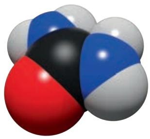

图1 尿素的分子结构模型

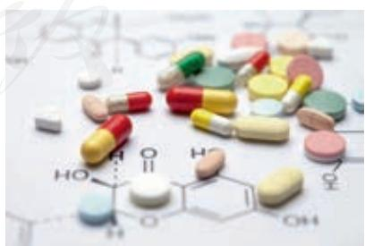

图2 有机合成为人类提供了多种药物

图3 高速列车的绝缘、密封和装饰等都使用了高分子材料

是依据现代原子、分子结构和化学键理论，从组成、结构、性质、转化和应用的视角来研究和认识物质。此外，虽然研究化学现象和物质的理论方法已经取得很大的进步，但是实验仍然是研究和学习化学最重要的方法。近年来，有机化学研究中理论方法和实验方法相结合所取得的成绩非常突出。有机化学家可以根据实际需求设计并合成数量繁多的药物分子和功能材料。这与碳原子有多种成键方式，以及人们对有机化合物分子结构与功能之间的关系有比较深刻的认识密切相关。 

合成某种有机化合物时，需要构建碳骨架和引入官能团，这里的官能团就像积木中的“功能模块”一样。这种思路可用于新的有机分子合成路线的拟定。合成出来的有机分子的组成、相对分子质量和分子结构等信息，则可以利用现代化的分析仪器加以测定。 

合成有机高分子材料的出现，使人们能够以简单的有机化合物为原料，制备一系列具有特殊性能的新材料，如导电高分子、高吸水性树脂、生物医用高分子、耐辐射高分子和形状记忆高分子等，开创了使用合成材料的新时代。生物体内的糖类、蛋白质和核酸等有机化合物与生命活动密切相关，对它们的深入研究使生命科学的发展进入分子水平，有助于揭示生命的奥秘，更好地促进人类健康。 

当同学们学习了“有机化学基础”之后就能体会到，神奇出自平凡和努力，创新源自思考与实践，同时也能进一步领略化学的魅力。当前，人类面临的资源、能源、环境和健康等问题对社会的可持续发展提出了挑战，有机化学为解决这些问题起到了其他学科不可替代的重要作用，蕴含着巨大的发展机遇，等待着同学们去开拓和探索，为人类创造更加美好的未来。 

# 第一章

# 有机化合物的结构

# 特点与研究方法

有机化合物的结构特点 

研究有机化合物的一般方法 

有机化学是在原子、分子水平上研究有机化合物的组成、结构、性质、转化及应用的科学。我们生活中的衣食住行都离不开有机化合物。有机化合物中的原子主要以共价键相结合，分子结构复杂。这决定了有机化合物种类繁多、数量庞大，决定了有机化合物的性质与无机化合物的相比有很大不同。大多数有机化合物不溶于水，可以燃烧。有机反应多为分子间的反应，一般反应速率较小，常伴有副反应，产物比较复杂。 

有机化合物的结构可以通过仪器分析的方法进行测定，其结构中的官能团是进行有机化合物分类的基本依据，并与有机化合物的特征性质密切相关。官能团的种类和相互影响、化学键的类型和极性是认识有机化合物结构特征和有机反应的重要视角。 

# 第一节

# 有机化合物的结构特点

仅由氧元素和氢元素组成的稳定的化合物只有两种： $\mathrm{H}_2\mathrm{O}$ 和 $\mathrm{H}_2\mathrm{O}_2$ ，而仅由碳元素和氢元素组成的烃类物质，目前结构已知的有上千种。有机化合物分子结构的复杂多变与碳原子的成键特点、碳原子间的结合方式，以及分子中各原子在空间的排布有着密切关系。 

# 一、有机化合物的分类方法

有机化合物数量繁多，为便于研究，需要对其进行合理分类。按照不同的结构特点，有机化合物主要有两种分类方法，一是依据构成有机化合物分子的碳骨架来分类，二是依据有机化合物分子中的官能团来分类。 

# 1. 依据碳骨架分类

根据碳原子组成的分子骨架，有机化合物主要分为链状化合物和环状化合物。链状化合物又可分为脂肪烃和脂肪烃衍生物，环状化合物又可分为脂环化合物和芳香族化合物，脂环化合物包括脂环烃和脂环烃衍生物，芳香族化合物包括芳香烃和芳香烃衍生物。 

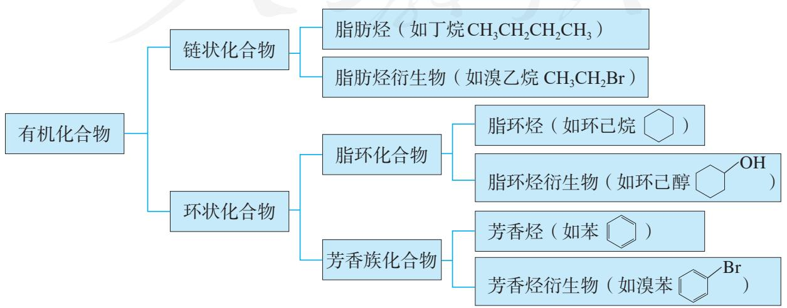

# 2. 依据官能团分类

烃分子中的氢原子可以被其他原子或原子团所取代,得到烃的衍生物。如甲烷中的氢原子被氯原子取代得到氯代甲烷, 它还可以经过化学反应, 进一步转变为甲醇 $\left(\mathrm{CH}_{3} \mathrm{OH}\right)$ 、甲醛（HCHO）等一系列烃的衍生物。 

甲烷在常温下为气体，难溶于水，化学性质比较稳定。甲醇则在常温下为液体，与水互溶，能与羧酸反应生成酯。甲醇的这些特性取决于其分子中含有的羟基，像这样决定有机化合物特性的原子或原子团叫官能团。根据有机化合物分子中的官能团，可以对有机化合物进行分类。表1-1列出了有机化合物的主要类别。 

官能团 functional group 

表 1-1 有机化合物的主要类别

<table><tr><td colspan="2">有机化合物类别</td><td>官能团</td><td>代表物</td></tr><tr><td rowspan="4">烃</td><td>烷烃</td><td>-</td><td>甲烷 CH4</td></tr><tr><td>烯烃</td><td>碳碳双键 C=C</td><td>乙烯 CH2=CH2</td></tr><tr><td>炔烃</td><td>碳碳三键 -C=C-</td><td>乙炔 CH≡CH</td></tr><tr><td>芳香烃</td><td>-</td><td>苯 〈〉</td></tr><tr><td rowspan="10">烃的衍生物</td><td>卤代烃</td><td>碳卤键 -C-X (卤素原子 -X)</td><td>溴乙烷 CH3CH2Br</td></tr><tr><td>醇</td><td>羟基 -OH</td><td>乙醇 CH3CH2OH</td></tr><tr><td>酚</td><td>羟基 -OH</td><td>苯酚 〈〉OH</td></tr><tr><td>醚</td><td>醚键 -C-O-C-</td><td>乙醚 CH3CH2OCH2CH3</td></tr><tr><td>醛</td><td>醛基 -C-H</td><td>乙醛 CH3CHO</td></tr><tr><td>酮</td><td>酮羰基(羰基) -C-</td><td>丙酮 CH3COCH3</td></tr><tr><td>羧酸</td><td>羧基 -C-OH</td><td>乙酸 CH3COOH</td></tr><tr><td>酯</td><td>酯基 -C-O-R</td><td>乙酸乙酯 CH3COOCH2CH3</td></tr><tr><td>胺</td><td>氨基 -NH2</td><td>甲胺 CH3NH2</td></tr><tr><td>酰胺</td><td>酰胺基 -C-NH2</td><td>乙酰胺 CH3CONH2</td></tr></table>

# 思考与讨论

（1）辨识有机化合物的一般方法是从碳骨架和官能团的角度将其归类，并根据官能团推测其可能的性质。请按官能团的不同对下列有机化合物进行分类，指出它们的官能团名称和所属的有机化合物类别，以及分子结构中的相同点和不同点。 

① $\overleftarrow{\langle\langle\rangle}$ —Br 

CH3—OH 

(3) $\mathrm{CH}_{2} \mathrm{OH}$ 

④ CHO 

(5) $\left\langle \right\rangle -\mathrm{COOH}$ 

$⑥$ COOCH3 

(2) 有机化合物的官能团决定其化学性质。丙烯酸 $\left(\mathrm{CH}_{2} = \mathrm{CHCOOH}\right)$ 是重要的有机合成原料, 请指出其分子中官能团的名称, 并根据乙烯和乙酸的官能团及性质, 推测丙烯酸可能具有的化学性质。 

# 二、有机化合物中的共价键

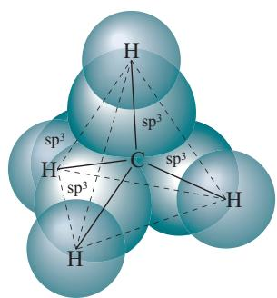

图1-1 甲烷分子中的 $\sigma$ 键示意图

在有机化合物的分子中，碳原子通过共用电子对与其他原子形成不同类型的共价键，共价键的类型和极性对有机化合物的性质有很大的影响。 

# 1. 共价键的类型

有机化合物的共价键有两种基本类型： $\sigma$ 键和 $\pi$ 键。 

(1) $\sigma$ 键 甲烷分子中的C—H和乙烷分子中的C—C都是 $\sigma$ 键。在甲烷分子中，氢原子的1s轨道与碳原子的一个 $\mathfrak{sp}^3$ 杂化轨道沿着两个原子核间的键轴，以“头碰头”的形式相互重叠，形成 $\sigma$ 键（如图1-1）。通过 $\sigma$ 键连接的原子或原子团可绕键轴旋转而不会导致化学键的破坏。 

（2） $\pi$ 键 在乙烯分子中，两个碳原子均以 $\mathrm{sp}^2$ 杂化轨道与氢原子的1s轨道及另一个碳原子的 $\mathrm{sp}^2$ 杂化轨道进行重叠，形成4个C—H $\sigma$ 键与一个C—C $\sigma$ 键；两个碳原子未参与杂化的p轨道以“肩并肩”的形式从侧面重叠，形成了 $\pi$ 键（如图1-2）。 $\pi$ 键与 $\sigma$ 键的轨道重叠程度不同，所以强度不同。通过 $\pi$ 键连接的原子或原子团不能绕键轴旋转。 

一般情况下, 有机化合物中的单键是 $\sigma$ 键, 双键中含 

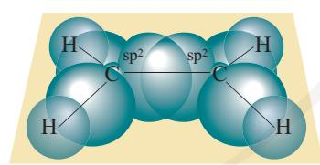

$\sigma$ 键

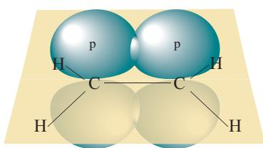

$\pi$ 键

图1-2 乙烯分子中的 $\sigma$ 键和 $\pi$ 键示意图

有一个 $\sigma$ 键和一个 $\pi$ 键，三键中含有一个 $\sigma$ 键和两个 $\pi$ 键。一般的有机反应就是有机化合物分子中旧共价键断裂和新共价键形成的过程，共价键的类型与有机反应的类型密切相关。例如，甲烷分子中含有C—H $\sigma$ 键，能发生取代反应；乙烯和乙炔分子的双键和三键中含有 $\pi$ 键，它们都能发生加成反应。 

# 2. 共价键的极性与有机反应

由于不同的成键原子间电负性的差异，共用电子对会发生偏移。偏移的程度越大，共价键极性越强，在反应中越容易发生断裂。因此有机化合物的官能团及其邻近的化学键往往是发生化学反应的活性部位。 

# 【实验1-1】

向两只分别盛有蒸馏水和无水乙醇的烧杯中各加入同样大小的钠（约绿豆大），观察现象。 

乙醇与钠能发生反应放出氢气，原因在于乙醇分子中的氢氧键极性较强，能够发生断裂。同样条件下，乙醇与钠的反应没有水与钠的反应剧烈，这是由于乙醇分子中氢氧键的极性比水分子中氢氧键的极性弱。基团之间的相互影响使官能团中化学键的极性发生变化，从而影响官能团和物质的性质。 

$$
2\mathrm{CH_3CH_2OH}+2\mathrm{Na}\rightarrow2\mathrm{CH_3CH_2ONa}+\mathrm{H_2}\uparrow
$$

另外，由于羟基中氧原子的电负性较大，乙醇分子中的碳氧键极性也较强，在乙醇与氢溴酸的反应中，碳氧键发生了断裂。 

$$
\mathrm{CH_3CH_2OH}+\mathrm{HBr}\xrightarrow{\triangle}\mathrm{CH_3CH_2Br}+\mathrm{H_2O}
$$

# 注意

操作时请注意安全，不要近距离俯视烧杯！ 

共价键的断裂需要吸收能量，而且有机化合物分子中共价键断裂的位置存在多种可能。相对无机反应，有机反应一般反应速率较小，副反应较多，产物比较复杂。 

# 思考与讨论

请从化学键和官能团的角度分析下列反应中有机化合物的变化。 

光 $①$ $\mathrm{CH}_4 + \mathrm{Cl}_2\xrightarrow{} \mathrm{CH}_3\mathrm{Cl} + \mathrm{HCl}$ 

② $\mathrm{CH}_{2}=\mathrm{CH}_{2}+\mathrm{Br}_{2}\longrightarrow\mathrm{CH}_{2} \mathrm{Br}-\mathrm{CH}_{2} \mathrm{Br}$ 

# 三、有机化合物的同分异构现象

同分异构现象在有机化合物中十分普遍，这也是有机化合物数量非常庞大的原因之一。 

# 思考与讨论

戊烷（ $\mathrm{C}_{5} \mathrm{H}_{12}$ ）的三种同分异构体的结构如图1-3所示。回忆有关同分异构体的知识，完成下表。 

<table><tr><td>物质名称</td><td>正戊烷</td><td>异戊烷</td><td>新戊烷</td></tr><tr><td>结构简式</td><td></td><td></td><td></td></tr><tr><td>相同点</td><td></td><td></td><td></td></tr><tr><td>不同点</td><td></td><td></td><td></td></tr></table>

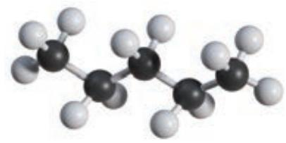

正戊烷

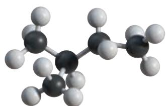

异戊烷

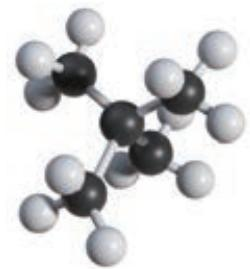

新戊烷

图1-3 三种戊烷的分子结构模型

化合物具有相同的分子式，但具有不同结构的现象叫同分异构现象，具有同分异构现象的化合物互为同分异构体。一般情况下，有机化合物分子中的碳原子数目越多，其同分异构体的数目也越多。 

有机化合物的同分异构现象主要有构造异构和立体异构。构造异构主要包括由碳骨架不同而产生的碳架异构，由官能团的位置不同而产生的位置异构，以及由官能团不同而产生的官能团异构。立体异构有顺反异构和对映异构等，我们将会陆续学习。 

同分异构现象 isomerism 同分异构体 isomer 

表 1-2 有机化合物的构造异构现象

<table><tr><td>异构类别</td><td colspan="4">实例</td></tr><tr><td rowspan="2">碳架异构</td><td rowspan="2">C4H10:</td><td>CH3-CH2-CH2-CH3</td><td>CH3-CH-CH3</td><td rowspan="2">CH3</td></tr><tr><td>正丁烷</td><td>异丁烷</td></tr><tr><td rowspan="2">位置异构</td><td>C4H8:</td><td>1 CH2=CH-CH2-CH3 1-丁烯</td><td>1 CH3-CH=CH-CH3 2-丁烯</td><td>1 CH3-CH=CH-CH3</td></tr><tr><td>C6H4Cl2:</td><td>邻二氯苯</td><td>间二氯苯</td><td>对二氯苯</td></tr><tr><td>异构类别</td><td colspan="4">实例</td></tr><tr><td rowspan="2">官能团异构</td><td rowspan="2">C2H6O:</td><td>H H
| | 
H—C—C—OH</td><td colspan="2">H H
| | 
H—C—O—C—H</td></tr><tr><td>乙醇</td><td colspan="2">二甲醚</td></tr></table>

# 资料卡片

在表示有机化合物的组成和结构时，如果将碳、氢元素符号省略，只表示分子中键的连接情况和官能团，每个拐点或终点均表示有一个碳原子，则得到键线式。如丙烯可表示为 $\mathrm{OH}$ 

# 科学史话

# 范托夫与碳价四面体学说

荷兰化学家范托夫（J.H.van't Hoff，1852—1911）于1901年获诺贝尔化学奖，是第一位获得诺贝尔化学奖的科学家。他在上中学时就非常爱好化学，他经常积攒父母给的零用钱购买 

图1-4 范托夫

一些实验用的药品和仪器，进行家庭小实验。 

早期的有机化合物结构理论认为有机化合物的分子结构都是平面形的，即分子中所有的原子都处在同一平面内。例如，甲烷的碳原子和氢原子都在同一平面上。但是这种结构理论无法解释下列现象，如果甲烷的两个氢原子被两个氯原子取代得到二氯甲烷， 

按照平面结构理论，应当有两种异构体： 

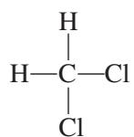

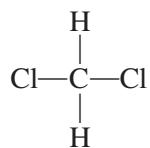

实验事实证明，组成为 $\mathrm{CH}_2\mathrm{Cl}_2$ 的分子不存在异构体。 

范托夫于1874年发表了《空间化学引论》，提出了一种新观点。他认为建立在平面结构基础上的化合物的结构式并不能反映它的真实结构，在甲烷分子中，碳的4个价键指向正四面体的顶点，碳原子位于四面体的中心，氢原子位于四面体的4个顶点。甲烷的正四面体结构后来通过X射线晶体衍射等方法得到了证实。 

范托夫的碳价四面体学说不仅被许多实验事实所证实，还解释了一些当时人们不清楚的异构现象。如果甲烷的三个氢原子被三个不同的原子取代，例如，氯溴碘代甲烷，它就有两种异构体。这两种异构体就像人的左手和右手，互为镜像却不能重合，人们通常将这样的异构现象称为对映异构，它属于立体异构的一种（如图1-5）。而像二氯甲烷 

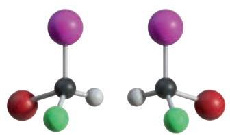

图1-5 氯溴碘代甲烷对映异构体的分子结构模型

这样的有机化合物，它的四面体模型只有一种（如图1-6），不存在对映异构体。 

法国化学家勒贝尔（J.-A. Le Bel，1847—1930）在同一时期也提出了相同的观点，与范托夫共同开辟了立体化学的新篇章，为人们深入认识有机化合物的结构与性质奠定了基础。 

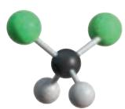

图1-6 二氯甲烷的分子结构模型

# 练习与应用

1.下列化合物中不属于有机化合物的是（ ）。 

A. 醋酸 

B. 尿素 

C. 碳酸钙 

D. 蔗糖 

2.下列化合物，其分子中所有原子不可能位于同一平面的是（ ）。 

A. $\mathrm{H}_{2} \mathrm{O}$ 

B. $\mathrm{CH}_{2} = \mathrm{CH}_{2}$ 

C. $\mathrm{CH} = \mathrm{CH}$ 

D. $\mathrm{CH}_{4}$ 

3.下列说法不正确的是（ ）。 

A. 碳原子的最外电子层有 4 个电子 

B. 1 个碳原子可以与其他非金属原子形成 4 个共价键 

C. 两个碳原子之间能形成单键、双键或三键 

D. 所有有机化合物中都含有极性键和非极性键 

4. 下列各组物质不互为同分异构体的是（ ）。 

A. $\mathrm{NH_4OCN}$ 和 $\mathrm{CO(NH_2)_2}$ 

B. $\mathrm{CH}_{3} \mathrm{CH}_{2} \mathrm{OH}$ 和 $\mathrm{CH}_{3} \mathrm{OCH}_{3}$ 

C. $\mathrm{CH}_{3} \mathrm{CH}_{2} \mathrm{COOH}$ 和 $\mathrm{CH}_{2}=\mathrm{CHCOOH}$ 

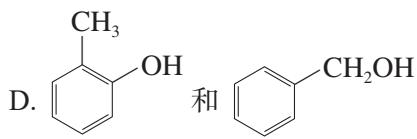

5. 写出下列有机化合物中官能团的名称。 

O (1) $\mathrm{CH}_2 = \mathrm{CH}-\mathrm{C}-\mathrm{H}$ 

O O (2) CH3C-O C-OH 

(3) $\mathrm{Br}-\left\langle \right\rangle_{\text {一}}-\mathrm{OH}$ 

6. 按照官能团分类，下列物质分别属于哪类有机化合物？ 

(1) $\mathrm{CH}_3\mathrm{CH} = \mathrm{CHCH}_3$ 

(2) $\mathrm{CH} = \mathrm{CCH}_3$ 

(3) $\mathrm{CCl}_2\mathrm{F}_2$ 

(4) $\mathrm{HOCH}_2\mathrm{CH}_2\mathrm{OH}$ 

(5) $\mathrm{CH}_3\text{—}\left\langle \begin{array}{l}\text{一}\\ \text{一}\end{array} \right\rangle$ -OH 

(6) $\mathrm{C}-\mathrm{H}$ 

(7) $\mathrm{C}_{17} \mathrm{H}_{35}-\mathrm{C}-\mathrm{OH}$ 

O (8) CH3CH2—C—OCH3 

7. 写出丙烯与溴、乙醇催化氧化反应的化学方程式，分析反应前后有机化合物官能团与化学键的变化。 

# 第二节

# 研究有机化合物的一般方法

研究有机化合物一般要经过以下几个基本步骤，每个步骤中都有一些常用的基本方法。 

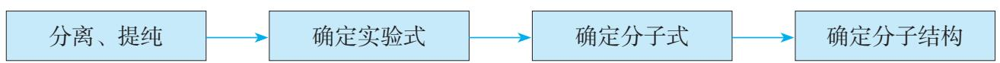

# 一、分离、提纯

从天然资源中提取有机化合物，通常得到的是含有杂质的粗品。工厂生产和实验室合成的有机化合物往往也混有未反应的原料和反应副产物等。进行有机化合物组成、结构、性质和应用的研究，首先要获得纯净的有机化合物。粗品必须经过分离、提纯才能得到较为纯净的物质。 

提纯含杂质的有机化合物的基本方法是利用有机化合物与杂质物理性质的差异将它们分离。在有机化学中常用的分离和提纯方法有蒸馏、萃取和重结晶等。 

分离 separation 

提纯 purification 

蒸馏 distillation 

萃取 extraction 

# 1. 蒸馏

蒸馏是分离和提纯液态有机化合物的常用方法。当液态有机化合物含有少量杂质，而且该有机化合物热稳定性较高，其沸点与杂质的沸点相差较大时，可用蒸馏法提纯。例如，甲烷与氯气发生取代反应得到的液态混合物中含二氯甲烷（沸点 $40^{\circ}\mathrm{C}$ ）、三氯甲烷（沸点 $62^{\circ}\mathrm{C}$ ）和四氯化碳（沸点 $77^{\circ}\mathrm{C}$ ），分离提纯它们的方法就是蒸馏法。实验室常用的蒸馏装置如图1-7所示。 

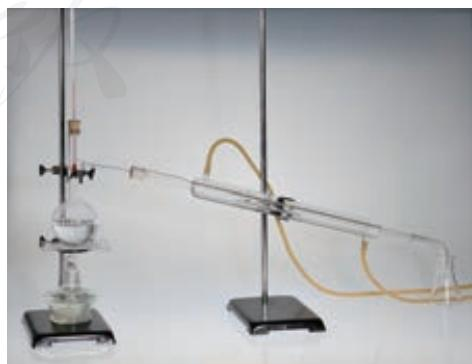

图1-7 蒸馏装置

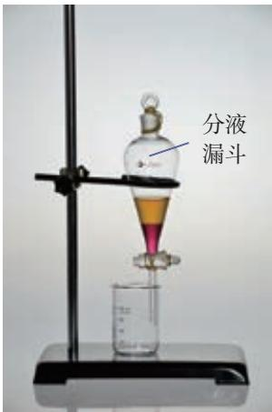

图1-8 萃取装置

# 2. 萃取

萃取包括液-液萃取和固-液萃取。液-液萃取是利用待分离组分在两种不互溶的溶剂中的溶解度不同，将其从一种溶剂转移到另一种溶剂的过程。可使用有机溶剂从水中萃取有机化合物，萃取用的溶剂称为萃取剂，常用的萃取剂有乙醚（ $\mathrm{C_2H_5OC_2H_5}$ ）、乙酸乙酯、二氯甲烷等。将萃取后的两层液体分开需要进行分液。分液常要使用分液漏斗，通过打开其上方的玻璃塞和下方的活塞可将两层液体分离。固-液萃取是用溶剂从固体物质中溶解出待分离组分的过程。 

重结晶 recrystallization 

# 3. 重结晶

重结晶是提纯固体有机化合物常用的方法，是利用被提纯物质与杂质在同一溶剂中的溶解度不同而将杂质除去。重结晶首先要选择适当的溶剂，要求杂质在此溶剂中溶解度很小或溶解度很大，易于除去；被提纯的有机化合物在此溶剂中的溶解度受温度的影响较大，能够进行冷却结晶。如果重结晶所得的晶体纯度不能达到要求，可以再次进行重结晶以提高产物的纯度。 

# 探究

# 重结晶法提纯苯甲酸

# 【问题】

某粗苯甲酸样品中含有少量氯化钠和泥沙，提纯苯甲酸需要经过哪些步骤？ 

# 【资料】

苯甲酸可用作食品防腐剂。纯净的苯甲酸为无色结晶，其结构可表示为COOH，熔点 $122\mathrm{C}$ ，沸点 $249\mathrm{C}$ 。苯甲酸微溶于水，易溶于乙醇等有机溶剂。苯甲酸在水中的溶解度如下： 

<table><tr><td>温度/℃</td><td>25</td><td>50</td><td>75</td></tr><tr><td>溶解度/g</td><td>0.34</td><td>0.85</td><td>2.2</td></tr></table>

# 【实验】

(1) 观察粗苯甲酸样品的状态。 

(2) 将 $1.0 \mathrm{~g}$ 粗苯甲酸放入 $100 \mathrm{~mL}$ 烧杯, 加入 $50 \mathrm{~mL}$ 蒸馏水。加热, 搅拌, 使粗苯甲酸充分溶解。 

(3) 使用漏斗趁热将溶液过滤至另一烧杯中, 将滤液静置, 使其缓慢冷却结晶。 

(4) 待滤液完全冷却后滤出晶体, 并用少量蒸馏水洗涤。将晶体铺在干燥的滤纸上, 晾干后称其质量。 

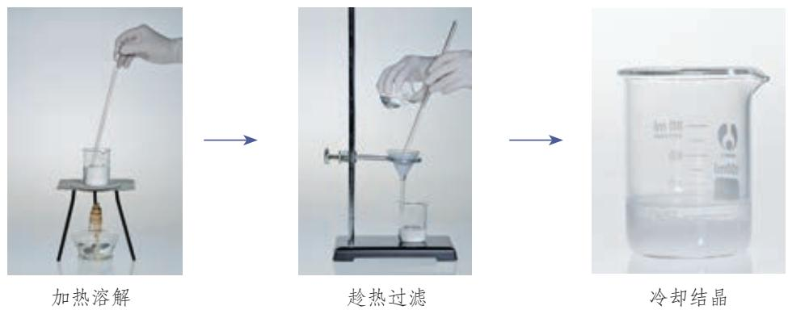

图1-9 重结晶法提纯苯甲酸

实验记录和数据处理： 

<table><tr><td>项目</td><td colspan="2">现象和数据</td></tr><tr><td rowspan="2">(1)对比提纯前后苯甲酸的状态</td><td>苯甲酸粗品</td><td></td></tr><tr><td>苯甲酸晶体</td><td></td></tr><tr><td rowspan="2">(2)对比过滤前后液体的状态</td><td>溶解苯甲酸粗品后的液体</td><td></td></tr><tr><td>趁热过滤后的滤液</td><td></td></tr><tr><td rowspan="3">(3)计算重结晶收率</td><td>苯甲酸粗品的质量/g</td><td></td></tr><tr><td>苯甲酸晶体的质量/g</td><td></td></tr><tr><td>重结晶收率=晶体质量/粗品质量×100%</td><td></td></tr></table>

# 【讨论】

(1) 重结晶法提纯苯甲酸的原理是什么? 有哪些主要操作步骤? 

(2) 溶解粗苯甲酸时加热的作用是什么? 趁热过滤的目的是什么? 

(3) 实验操作中多次使用了玻璃棒, 分别起到了哪些作用? 

(4) 如何检验提纯后的苯甲酸中氯化钠已被除净? 

# 色谱法

当样品随着流动相经过固定相时，因样品中不同组分在两相间的分配不同而实现分离，这样的一类分离分析方法被称为色谱法。目前常用的固定相有硅胶、氧化铝等。1903年，俄国植物生理学家和化学家茨韦特（M.C.IIbet，1872—1919）发表了第一篇关于色谱法的论文。他在玻璃管的一端塞上一团棉花，在管中填充碳酸钙粉末，再把溶有绿色植物色素的溶液自上而下注入玻璃管中。结果植物色素被碳酸钙粉末吸附，形成不同颜色的色带。他将吸附不同色素的碳酸钙分层取出，再用乙醇作溶剂，从植物色素中提取出叶绿素、叶黄素和胡萝卜素等较纯的组分。 

茨韦特的柱色谱实验当时并未引起人们的注意。25年后，德国化学家库恩（R. Kuhn，1900—1967）在分离、提纯胡萝卜素异构体和确定维生素的结构时应用了色谱法，并在1938年获得了诺贝尔化学奖。此后，色谱法成为化学家分离、提纯有机化合物的重要方法之一。人们还开发了纸色谱、薄层色谱、气相色谱和高效液相色谱等多种色谱方法。 

色谱法 chromatography 

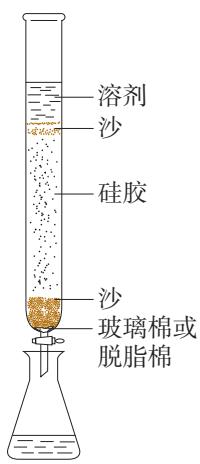

图1-10 实验室常用的一种柱色谱装置示意图

# 二、确定实验式

元素分析 elemental analysis 

图1-11 李比希

元素的定性、定量分析是用化学方法测定有机化合物的元素组成，以及各元素的质量分数。元素定量分析的原理一般是将一定量的有机化合物燃烧，转化为简单的无机物，并通过测定无机物的质量，推算出该有机化合物所含各元素的质量分数，然后计算出该有机化合物分子内各元素原子的最简整数比，确定其实验式（也称最简式）。 

有机化合物的元素定量分析最早是由德国化学家李比希（J. von Liebig，1803—1873）提出的。他用CuO作氧化剂，将仅含C、H、O元素的有机化合物氧化，生成的 $\mathrm{CO}_{2}$ 

用 KOH 浓溶液吸收, $\mathrm{H}_{2} \mathrm{O}$ 用无水 $\mathrm{CaCl}_{2}$ 吸收。根据吸收剂在吸收前后的质量差, 计算出有机化合物中碳、氢元素的质量分数, 剩余的就是氧元素的质量分数, 据此计算可以得到有机化合物的实验式。 

【例题】某种含C、H、O三种元素的未知物A，经燃烧分析实验测得其中碳的质量分数为 $52.2\%$ ，氢的质量分数为 $13.1\%$ ，试求该未知物A的实验式。 

【解】（1）计算该有机化合物中氧元素的质量分数： 

$$
\begin{array}{l} w(\mathrm{O}) = 100\% -52.2\% -13.1\% \\ = 34.7 \% \\ \end{array}
$$

(2) 计算该有机化合物分子内各元素原子的个数比: 

$$
\begin{array}{l} N(\mathrm{C}):N(\mathrm{H}):N(\mathrm{O}) = \frac{52.2\%}{12.01}:\frac{13.1\%}{1.008}:\frac{34.7\%}{16.00} \\ = 2: 6: 1 \\ \end{array}
$$

答: 该未知物 A 的实验式为 $\mathrm{C}_{2} \mathrm{H}_{6} \mathrm{O}$ 。 

李比希还建立了含氮、硫、卤素等有机化合物的元素定量分析方法，这些方法为现代元素定量分析奠定了基础。现在，元素定量分析使用现代化的元素分析仪，分析的精确度和分析速度都达到了很高的水平。 

元素定量分析只能确定有机化合物分子中各组成原子的最简整数比，得到实验式。要确定它的分子式，还必须知道其相对分子质量。目前有许多测定相对分子质量的方法，质谱法是其中最精确而快捷的方法。 

# 三、确定分子式

质谱法是快速、精确测定相对分子质量的重要方法，测定时只需要很少量的样品。质谱仪用高能电子流等轰击样品，使有机分子失去电子，形成带正电荷的分子离子和碎片离子等。这些离子因质量不同、电荷不同，在电场和磁场中的运动行为不同。计算机对其进行分析后，得到它 

图1-12 李比希元素分析仪

图1-13 现代元素分析仪

质谱 mass spectrum (MS) 

们的相对质量与电荷数的比值，即质荷比。以质荷比为横坐标，以各类离子的相对丰度为纵坐标记录测试结果，就得到有机化合物的质谱图。 

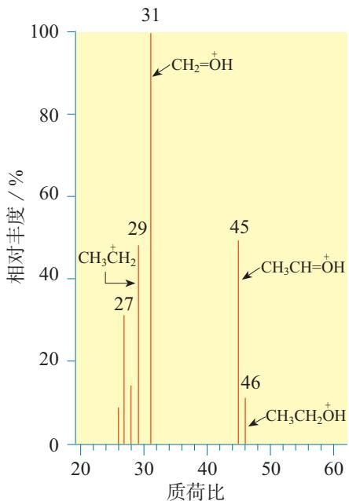

图1-15 未知物A的质谱

图1-14 质谱仪

例如，以上例题中的未知物A的实验式为 $\mathrm{C}_2\mathrm{H}_6\mathrm{O}$ 其质谱图如图1-15所示。图中最右侧的分子离子峰 $\left(\mathrm{CH}_3\mathrm{CH}_2\mathrm{OH}\right)$ 的信号）的质荷比数值为46，因此A的相对分子质量为46，由此可以推算出A的分子式也是 $\mathrm{C}_2\mathrm{H}_6\mathrm{O}$ 。目前的高分辨率质谱仪还可以根据高精度的相对分子质量数据直接计算出分子式。 

符合分子式 $\mathrm{C}_{2} \mathrm{H}_{6} \mathrm{O}$ 的可能的结构有以下两种: 

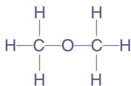

二甲醚

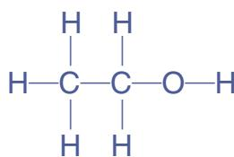

乙醇

质谱图中的碎片峰对我们确定有机化合物的分子结构有一定帮助，但未知物A究竟是二甲醚还是乙醇？这还需要我们根据其他证据进一步推断。 

# 四、确定分子结构

确定比较复杂的有机化合物的分子结构，仅靠质谱法是很难完成的，需要借助其他现代分析仪器，进行红外光谱、核磁共振氢谱和X射线衍射等分析。 

红外光谱 

infrared spectrum (IR) 

# 1. 红外光谱

有机化合物受到红外线照射时，能吸收与它的某些化 

学键或官能团的振动频率相同的红外线，通过红外光谱仪的记录形成该有机化合物的红外光谱图。谱图中不同的化学键或官能团的吸收频率不同，因此分析有机化合物的红外光谱图，可获得分子中所含有的化学键或官能团的信息。 

图1-16是上面例题中未知物A的红外光谱图，从图中可以找到C—O、C—H和O—H的吸收峰，因此可以初步推测该未知物A是含有羟基官能团的化合物，结构可表示为 $\mathrm{C}_2\mathrm{H}_5\mathrm{OH}$ 。 

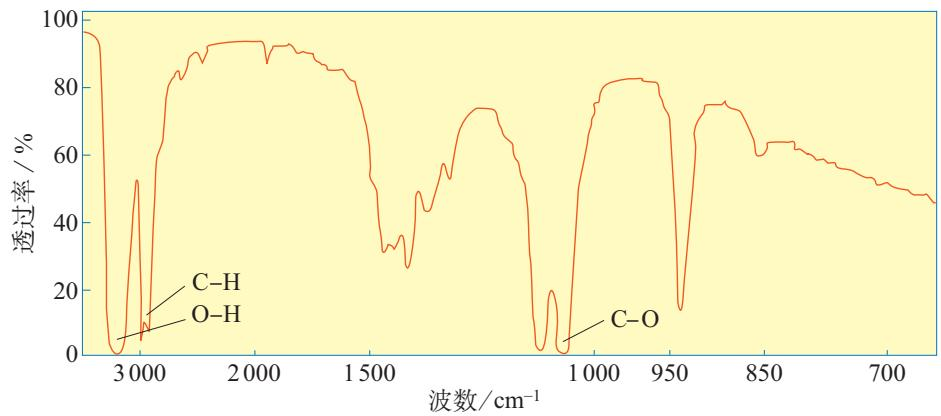

图1-16 未知物A的红外光谱

# 2. 核磁共振氢谱

氢原子核具有磁性，如果用电磁波照射含氢元素的化合物，其中的氢核会吸收特定频率电磁波的能量而产生核磁共振现象，用核磁共振仪可以记录到有关信号。处于不同化学环境中的氢原子因产生共振时吸收电磁波的频率不同，相应的信号在谱图中出现的位置也不同，具有不同的化学位移（用 $\delta^{(1)}$ 表示），而且吸收峰的面积与氢原子数成正比。因此，由核磁共振氢谱图可以获得该有机化合物分子中有几种不同类型的氢原子及它们的相对数目等信息。 

例如，实验测得未知物A的核磁共振氢谱图如图1-18所示，由此可以判断A的分子中有3种处于不同化学环境的氢原子，个数比为 $3:2:1$ 。而A的分子式 $\mathrm{C}_{2} \mathrm{H}_{6} \mathrm{O}$ 对应的两种可能的结构为 $\mathrm{CH}_{3} \mathrm{OCH}_{3}$ （二甲醚）和 $\mathrm{CH}_{3} \mathrm{CH}_{2} \mathrm{OH}$ （乙醇），前者分子中的6个氢原子的化学环境相同，对应的核 

核磁共振谱 

nuclear magnetic resonance 

spectrum (NMR) 

图1-17 核磁共振仪

磁共振氢谱图中只有一组峰（如图1-19）；后者分子中有3种处于不同化学环境的氢原子，个数比为 $3:2:1$ ，对应的核磁共振氢谱图中应该有3组峰，且面积比为 $3:2:1$ ，与未知物A的谱图一致。因此，未知物A的结构简式应该是 $\mathrm{CH}_3\mathrm{CH}_2\mathrm{OH}$ ，而不是 $\mathrm{CH}_3\mathrm{OCH}_3$ 。 

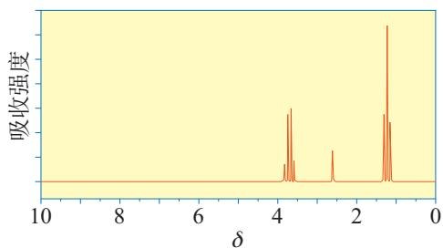

图1-18 未知物A的核磁共振氢谱

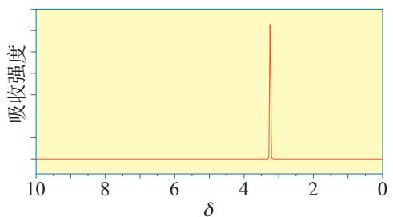

图1-19二甲醚的核磁共振氢谱

# 3. X射线衍射

X射线是一种波长很短（约 $10^{-10}\mathrm{m}$ ）的电磁波，它和晶体中的原子相互作用可以产生衍射图。经过计算可以从中获得分子结构的有关数据，包括键长、键角等分子结构信息。将X射线衍射技术用于有机化合物（特别是复杂的生物大分子）晶体结构的测定，可以获得更为直接而详尽的结构信息。目前，X射线衍射已成为物质结构测定的一种重要技术。 

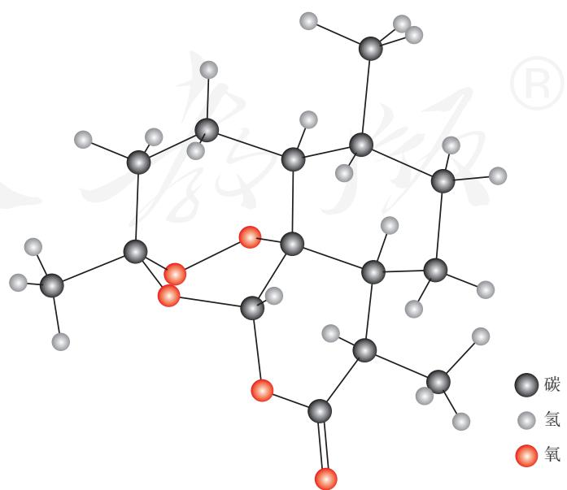

图1-20 我国科学家通过X射线衍射获得的青蒿素的分子结构

# 青蒿素结构的测定

20世纪70年代初，我国屠呦呦等科学家使用乙醚从中药中提取并用柱色谱分离得到抗疟有效成分青蒿素，随后展开了对青蒿素分子结构的测定和相关医学研究。中国科学院上海有机化学研究所和中国中医研究院中药研究所等单位的科学家们通过元素分析和质谱法分析，确定青蒿素的相对分子质量为 

282，分子式为 $\mathrm{C_{15}H_{22}O_5}$ 。经红外光谱和核磁共振谱分析，确定青蒿素分子中含有酯基和甲基等结构片段。通过化学反应证明其分子中含有过氧基（—O—O—）。1975年底，我国科学家通过X射线衍射最终测定了青蒿素的分子结构。 

# 练习与应用

1. 甲烷与氯气在光照条件下反应, 得到的产物中含有二氯甲烷、三氯甲烷和四氯化碳, 分离它们的操作方法是 ( )。 

A. 萃取 

B. 蒸馏 

C. 过滤 

D. 重结晶 

2. $3.0 \mathrm{~g}$ 某有机化合物在足量氧气中完全燃烧, 生成 $4.4 \mathrm{~g} \mathrm{CO}_{2}$ 和 $1.8 \mathrm{~g} \mathrm{H}_{2} \mathrm{O}$ 。下列说法不正确的是 ( )。 

A. 该有机化合物中只含有碳元素和氢元素 

B. 该有机化合物中一定含有氧元素 

C. 该有机化合物的分子式可能是 $\mathrm{C}_{2} \mathrm{H}_{4} \mathrm{O}_{2}$ 

D. 该有机化合物分子中碳原子数与氢原子数之比一定是 $1: 2$ 

3. 某有机化合物样品的质谱图如下图所示，则该有机化合物可能是（ ）。 

A. 甲醇 

B. 甲烷 

C. 乙烷 

D. 乙烯 

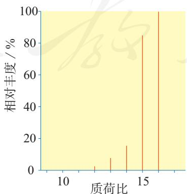

4. 具有下列结构的化合物，其核磁共振氢谱中有两组峰的是（ ）。 

A. $\mathrm{CH}_3\mathrm{CH}_2\mathrm{OH}$ 

B. $\mathrm{CH}_{3} \mathrm{CH}_{3}$ 

C. $\mathrm{CH}_3\mathrm{OCH}_3$ 

D. $\mathrm{HOCH}_2\mathrm{CH}_2\mathrm{OH}$ 

5. 乙酰苯胺是一种具有解热镇痛作用的白色晶体, $20^{\circ} \mathrm{C}$ 时在乙醇中的溶解度为 $36.9 \mathrm{~g}$ , 在水中的溶解度如下表: 

<table><tr><td>温度/℃</td><td>25</td><td>50</td><td>80</td><td>100</td></tr><tr><td>溶解度/g</td><td>0.56</td><td>0.84</td><td>3.5</td><td>5.5</td></tr></table>

某种乙酰苯胺样品中混入了少量氯化钠杂质, 下列提纯乙酰苯胺的方法正确的是 ( )。(注: 氯化钠可分散在乙醇中形成胶体。) 

A. 用水溶解后分液 

B. 用乙醇溶解后过滤 

C. 用水作溶剂进行重结晶 

D. 用乙醇作溶剂进行重结晶 

6. 某烃在足量氧气中完全燃烧, 生成 $0.1 \mathrm{~mol} \mathrm{CO}_{2}$ 和 $0.1 \mathrm{~mol} \mathrm{H}_{2} \mathrm{O}$ 。该有机化合物的实验式是________。要获得该物质的分子式, 还需要进行________测试。 

7. 咖啡和茶类饮料中都含有兴奋剂咖啡因。经元素分析测定，咖啡因中各元素的质量分数是：碳 $49.5\%$ ，氢 $5.2\%$ ，氮 $28.9\%$ ，氧 $16.4\%$ 。 

（1）咖啡因的实验式为 

(2) 质谱法测得咖啡因的相对分子质量为 194 , 则咖啡因的分子式为 

8. 丙醇有两种属于醇类的同分异构体： 

$\mathrm{CH}_{3} \mathrm{CH}_{2} \mathrm{CH}_{2} \mathrm{OH}$ 

1-丙醇 

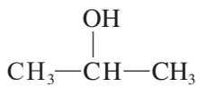

2-丙醇 

上图是其中一种物质的核磁共振氢谱，则与该谱图对应的物质的名称是 

9. 某有机化合物是汽车防冻液的成分之一，经元素分析测定，该有机化合物中各元素的质量分数是：碳 $38.7\%$ ，氢 $9.7\%$ ，氧 $51.6\%$ 。 

(1) 该有机化合物的实验式为 

(2) 用相对密度法测得该有机化合物的密度是同温同压下氢气密度的 31 倍, 则该物质的相对分子质量为 

（3）根据该有机化合物的实验式和相对分子质量，推断其分子式。 

(4) 该有机化合物的红外光谱中有羟基O—H和烃基C—H的吸收峰, 试写出其可能的结构简式。 

# 一、有机化合物的结构特点

1. 有机化合物的分子结构决定于原子间的连接顺序、成键方式和空间排布。 

<table><tr><td>与碳原子相 连的原子数</td><td>结构示意</td><td>碳原子的 杂化方式</td><td>碳原子的 成键方式</td><td>碳原子与相邻原子形成 的结构单元的空间结构</td><td>实例</td></tr><tr><td>4</td><td>—C—</td><td>sp3</td><td>σ键</td><td>四面体形</td><td>烷烃</td></tr><tr><td>3</td><td>\({}_{\mathrm{C}}=\)</td><td>sp2</td><td></td><td></td><td></td></tr><tr><td>2</td><td>—C≡</td><td>sp</td><td></td><td></td><td></td></tr></table>

2. 化学键：共价键的类型和极性对有机化合物的化学性质有很大影响，不同基团的相互作用也会影响共价键的极性。 

# 二、有机化合物的分类

碳骨架和官能团是认识有机化合物分类与性质的两个重要视角。 

1. 依据碳骨架分类（在方框中写出代表物的结构简式） 

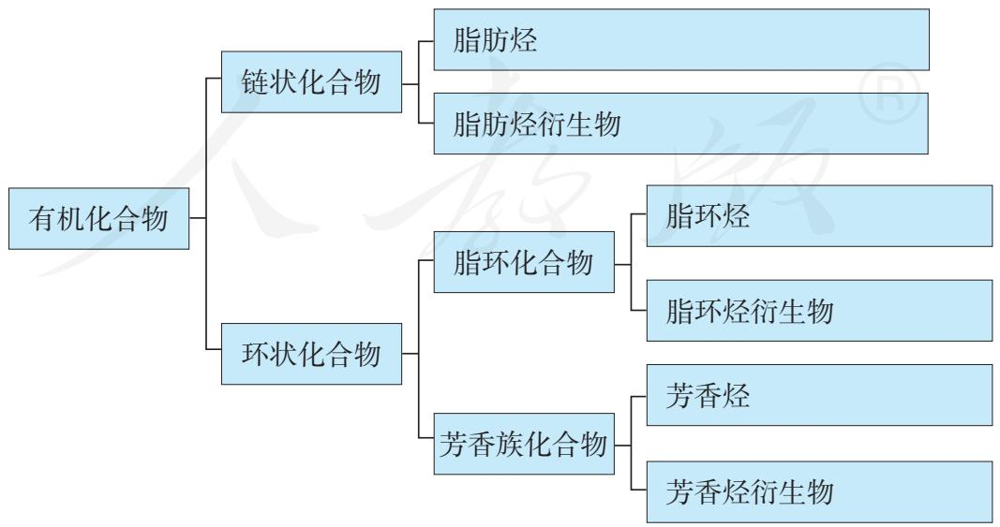

2. 依据官能团分类（在方框中写出代表物的结构简式） 

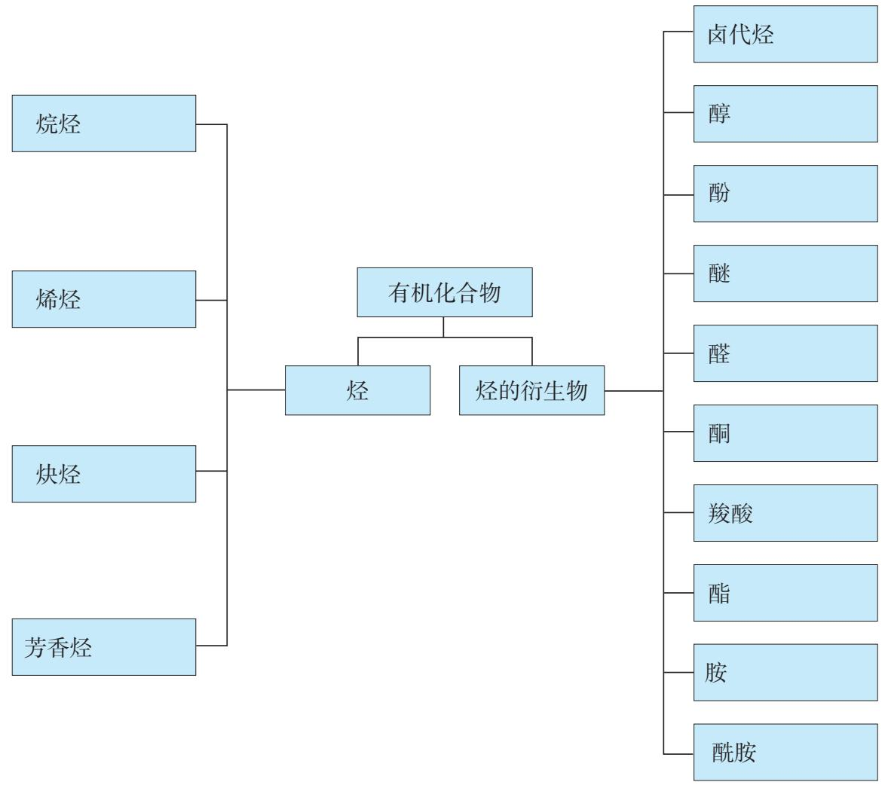

# 三、同分异构体

分子式相同、结构不同的化合物互称同分异构体。有机化合物的同分异构现象体现了有机化合物分子结构的复杂性。 

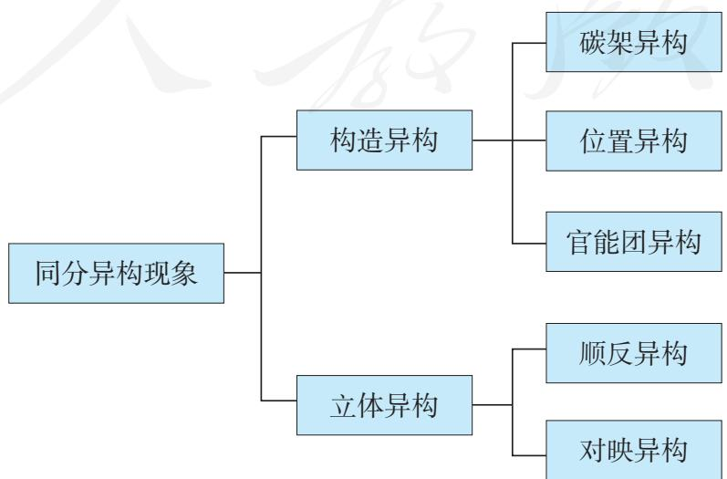

# 四、研究有机化合物的一般方法

有机化合物的分离和提纯是测定其分子结构的基础，而对有机化合物分子结构的研究对于认识有机化合物的性质和进行人工合成具有重要的作用。 

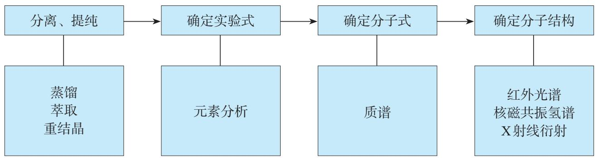

# 复习与提高

1. 某气体在标准状况下的密度为 $1.25 \mathrm{~g} / \mathrm{L}$ , 则该气体的相对分子质量为 ( )。 

A. 26 

B. 28 

C. 32 

D. 125 

2. 下列有机化合物的一氯代物存在同分异构体的是（ ）。 

A. $\mathrm{CH}_4$ 

B. $\mathrm{CH}_{3} \mathrm{CH}_{3}$ 

C. $\mathrm{CH}_{3} - \mathrm{CH}-\mathrm{CH}_{3}$ CH3 

CH3 D.CH3—C—CH3 CH3 

3.下列反应中有C—H断裂的是（ ）。 

A. 光照下三氯甲烷与氯气反应 

B. 乙烯与溴的四氯化碳溶液反应 

C. 乙醇与钠反应 

D. 乙酸与碳酸氢钠反应 

4. 某有机化合物样品的核磁共振氢谱如下图所示, 该物质可能是 ( )。 

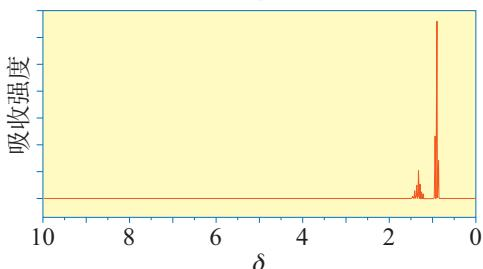

A. 甲烷 

B. 乙烷 

C. 乙醇 

D. 丙烷 

5. 某芳香烃的相对分子质量为 106 , 分子中有 3 种化学环境不同的氢原子。该芳香烃是 ( )。 

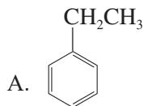

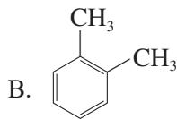

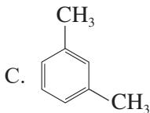

D. $\mathrm{CH}_{3} - \left\langle \right\rangle - \mathrm{CH}_{3}$ 

6.下列说法不正确的是（ ）。 

A. 提纯苯甲酸可采用重结晶的方法 

B. 分离正己烷（沸点 $69^{\circ} \mathrm{C}$ ）和正庚烷（沸点 $98^{\circ} \mathrm{C}$ ）可采用蒸馏的方法 

C. 某有机化合物的相对分子质量为 58 , 则其分子式一定为 $C_{4}H_{10}$ 

D. 某烃完全燃烧生成 $\mathrm{CO}_{2}$ 和 $\mathrm{H}_{2} \mathrm{O}$ 的物质的量之比为 $1: 1$ , 则其实验式为 $\mathrm{CH}_{2}$ 

7. 维生素C是重要的营养素，其分子结构如右图所示。 

(1) 维生素C的分子式为 , 相对分子质量为 , 含氧的质量分数为 

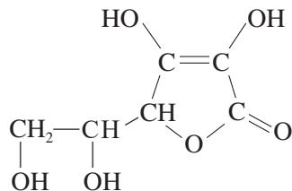

(2) 维生素C含有的官能团的名称是 

(3) 维生素C易溶于水, 可能的原因是 

(4) 维生素C具有较强的还原性, 向碘和淀粉的混合液中加入维生素C, 可观察到的现象是 

8. 青蒿素是我国科学家从传统中药中发现的能治疗疟疾的有机化合物，其分子结构如图 1-20 所示，它可以用有机溶剂 A 从中药中提取。 

（1）下列关于青蒿素的说法不正确的是 （填字母）。 

a. 分子式为 $\mathrm{C}_{14} \mathrm{H}_{20} \mathrm{O}_5$ 

b. 分子中含有酯基和醚键 

c. 易溶于有机溶剂A, 不易溶于水 

d. 分子中的所有原子不在同一平面 

（2）使用现代分析仪器对有机化合物A的分子结构进行测定，相关结果如下： 

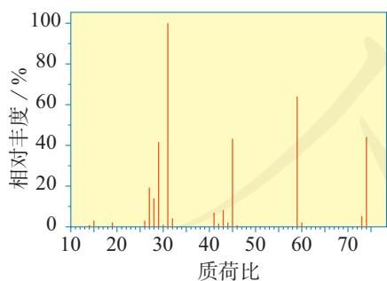

图1 质谱

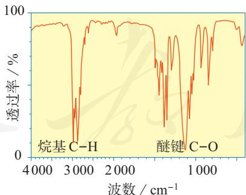

图2 红外光谱

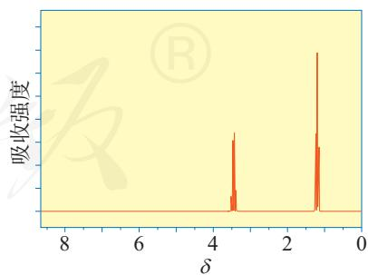

图3 核磁共振氢谱

(1)根据图 1, A 的相对分子质量为 

(2)根据图2, 推测 A 可能所属的有机化合物类别和其分子式。 

(3)根据以上结果和图3（两组峰的面积比为 $2:3$ ），推测A的结构简式。 

# 第二章 烃

- 烷烃 

- 烯烃 炔烃 

芳香烃 

仅含碳和氢两种元素的有机化合物称为碳氢化合物，又称烃。根据结构的不同，烃可分为烷烃、烯烃、炔烃和芳香烃等。其代表物甲烷、乙烯、乙炔和苯的具体结构和性质是认识各类烃结构和性质的基础。烃中碳原子的饱和程度和化学键的类型，是预测化学反应中烃分子可能的断键部位与相应反应类型的主要依据。 

# 第一节烷烃

烷烃 alkane 

甲烷 methane 

生活中的一些常见物质，如天然气、液化石油气、汽油、柴油、凡士林、石蜡等，它们的主要成分都是烷烃。烷烃是一类最基础的有机化合物。 

# 一、烷烃的结构和性质

# 思考与讨论

请根据图2-1所示烷烃的分子结构，写出相应的结构简式和分子式，并分析它们在组成和结构上的相似点。 

<table><tr><td>名称</td><td>结构简式</td><td>分子式</td><td>碳原子的杂化方式</td><td>分子中共价键的类型</td></tr><tr><td>甲烷</td><td></td><td></td><td></td><td></td></tr><tr><td>乙烷</td><td></td><td></td><td></td><td></td></tr><tr><td>丙烷</td><td></td><td></td><td></td><td></td></tr><tr><td>正丁烷</td><td></td><td></td><td></td><td></td></tr><tr><td>正戊烷</td><td></td><td></td><td></td><td></td></tr></table>

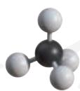

甲烷

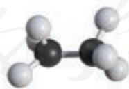

乙烷

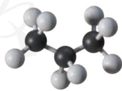

丙烷

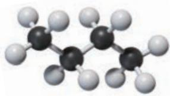

正丁烷

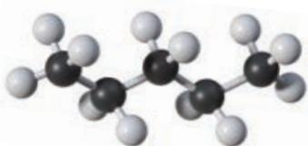

正戊烷

图2-1 几种简单烷烃的分子结构模型

烷烃的结构与甲烷的相似，其分子中的碳原子都采取 $\mathfrak{sp}^3$ 杂化，以伸向四面体4个顶点方向的 $\mathfrak{sp}^3$ 杂化轨道与其他碳原子或氢原子结合，形成 $\sigma$ 键。烷烃分子中的共价键全部是单键（如图2-1）。 

烷烃的结构决定了其性质与甲烷的相似。最简单的烷烃——甲烷是烷烃的代表物。纯净的甲烷是无色、无臭的气体，难溶于水，密度比空气的小。甲烷的化学性质比较稳定，常温下不能被酸性高锰酸钾溶液氧化，也不与强酸、强碱及溴的四氯化碳溶液反应。甲烷的主要化学性质表现为能在空气中燃烧（可燃性）和能在光照下与氯气发生取代反应。 

# 思考与讨论

(1) 根据甲烷的性质推测烷烃可能具有的性质, 填写下表。 

<table><tr><td>颜色</td><td>溶解性</td><td>可燃性</td><td>与酸性
高锰酸
钾溶液</td><td>与溴的
四氯化
碳溶液</td><td>与强酸、
强碱溶液</td><td>与氯气
(在光照下)</td></tr><tr><td></td><td></td><td></td><td></td><td></td><td></td><td></td></tr></table>

(2) 根据甲烷的燃烧反应, 写出汽油的成分之一辛烷 $\left(\mathrm{C}_{8} \mathrm{H}_{18}\right)$ 完全燃烧的化学方程式。 

(3) 根据甲烷与氯气的反应, 写出乙烷与氯气反应生成一氯乙烷的化学方程式。指出该反应的反应类型, 并从化学键和官能团的角度分析反应中有机化合物的变化。 

(4) 乙烷与氯气在光照下反应, 可能生成哪些产物? 请写出它们的结构简式。 

像甲烷、乙烷、丙烷这些结构相似、分子组成上相差一个或若干个 $\mathrm{CH}_{2}$ 原子团的化合物互称为同系物。同系物可用通式表示，如链状烷烃的通式为 $\mathrm{C}_{n} \mathrm{H}_{2 n + 2}$ 。烷烃 

同系物 homolog 

同系物的某些物理性质随着相对分子质量的增大而发生规律性的变化。从表2-1中的数据我们可以看出，随着烷烃碳原子数的增加，烷烃的熔点和沸点逐渐升高，密度逐渐增大，常温下的存在状态也由气态逐渐过渡到液态、固态。 

表 2-1 几种烷烃的熔点、沸点和密度

<table><tr><td>名称</td><td>分子式</td><td>结构简式</td><td>常温下状态</td><td>熔点/℃</td><td>沸点/℃</td><td>密度*(g·cm-3)</td></tr><tr><td>甲烷</td><td>CH4</td><td>CH4</td><td>气</td><td>-182</td><td>-164</td><td>0.423</td></tr><tr><td>乙烷</td><td>C2H6</td><td>CH3CH3</td><td>气</td><td>-172</td><td>-89</td><td>0.545</td></tr><tr><td>丙烷</td><td>C3H8</td><td>CH3CH2CH3</td><td>气</td><td>-187</td><td>-42</td><td>0.501</td></tr><tr><td>正丁烷</td><td>C4H10</td><td>CH3CH2CH2CH3</td><td>气</td><td>-138</td><td>-0.5</td><td>0.579</td></tr><tr><td>正戊烷</td><td>C5H12</td><td>CH3(CH2)3CH3</td><td>液</td><td>-129</td><td>36</td><td>0.626</td></tr><tr><td>正壬烷</td><td>C9H20</td><td>CH3(CH2)7CH3</td><td>液</td><td>-54</td><td>151</td><td>0.718</td></tr><tr><td>十一烷</td><td>C11H24</td><td>CH3(CH2)9CH3</td><td>液</td><td>-26</td><td>196</td><td>0.740</td></tr><tr><td>十六烷</td><td>C16H34</td><td>CH3(CH2)14CH3</td><td>液</td><td>18</td><td>280</td><td>0.775</td></tr><tr><td>十八烷</td><td>C18H38</td><td>CH3(CH2)16CH3</td><td>固</td><td>28</td><td>308</td><td>0.777</td></tr></table>

*甲烷和乙烷分别是-162℃和-89℃时的数据，其他物质的密度是20℃时的数据。 

# 二、烷烃的命名

烃分子中去掉1个氢原子后剩余的基团称为烃基，如甲烷分子去掉1个氢原子是甲基（一 $\mathrm{CH}_3$ ），乙烷分子去掉1个氢原子是乙基（一 $\mathrm{CH}_2\mathrm{CH}_3$ ）。丙烷（ $\mathrm{CH}_3\mathrm{CH}_2\mathrm{CH}_3$ ）分子中有两组处于不同化学环境的氢原子，因此丙基有两种不同的结构。 

正丙基

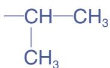

异丙基

当烷烃分子中的碳原子数大于3时，烷烃分子不再只有直链结构，在主链上可能存在烷基支链，产生同分异构体，且烷烃的碳原子数越多其同分异构体的数目越多。如丁烷有两种同分异构体——正丁烷和异丁烷；戊烷有三种同分异构体，习惯上称之为正戊烷、异戊烷和新戊烷。烷烃的同分异构体的化学性质相似，物理性质（熔点、沸点和密度等）有差异。一般情况下，同种烷烃的不同异构体中，支链越多其沸点越低。 

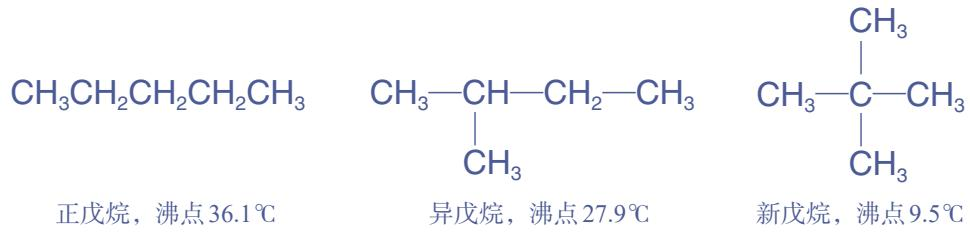

对于含5个以上碳原子的烷烃，由于其同分异构体数目较多，通常采用系统命名法进行命名。下面以带支链的烷烃为例，初步介绍系统命名法的命名步骤。 

（1）选定分子中最长的碳链为主链，按主链中碳原子数目对应的烷烃称为“某烷”。连接在主链上的支链作为取代基，当出现两条或多条等长的碳链时，要选择连有取代基数目多的碳链为主链。 

（2）选定主链中离取代基最近的一端为起点，用1，2，3等阿拉伯数字给主链上的碳原子编号定位，以确定取代基在主链中的位置。 

（3）将取代基名称写在主链名称的前面，在取代基的前面用阿拉伯数字注明它在主链上所处的位置，并在数字和名称之间用短线隔开。 

(4) 如果主链上有相同的取代基, 可以将取代基合并,用汉字数字表示取代基的个数（只有一个取代基时将取代基的个数省略）, 表示位置的阿拉伯数字之间用逗号隔开。 

例如，以下有机化合物的命名图示如下： 

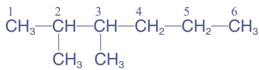

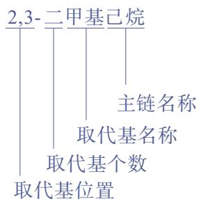

# 思考与讨论

(1) 请按下列步骤写出己烷同分异构体的结构简式, 并用系统命名法进行命名。 

<table><tr><td>步骤</td><td>结构简式</td><td>名称</td></tr><tr><td>①先写有最长碳链结构的同分异构体</td><td></td><td></td></tr><tr><td rowspan="2">②主链碳原子由6个减为5个,甲基有两种可能的位置分布</td><td></td><td></td></tr><tr><td></td><td></td></tr><tr><td rowspan="2">③主链碳原子由5个减为4个,两个甲基有两种可能的位置分布</td><td></td><td></td></tr><tr><td></td><td></td></tr></table>

(2) 根据丁烷两种同分异构体的结构, 写出 4 种丁基 $\left(-\mathrm{C}_{4} \mathrm{H}_{9}\right)$ 的结构简式。 

# 练习与应用

1.下列物质中，在常温和光照的条件下可以与乙烷发生化学反应的是（ ）。 

A. 稀硫酸 

B. NaOH溶液 

C. $\mathrm{Cl}_{2}$ 

D. 酸性 $\mathrm{KMnO}_4$ 溶液 

2.下列说法不正确的是（ ）。 

A. 所有碳氢化合物中, 甲烷中碳的质量分数最低 

B. 所有烷烃中, 甲烷的沸点最低 

C. 甲烷分子中最多有 4 个原子共平面 

D. 甲烷、乙烷和丙烷都能在光照下与氯气发生取代反应 

3. 下列分子式只表示一种物质的是（ ）。 

A. $\mathrm{C}_{4} \mathrm{H}_{10}$ 

B. $\mathrm{C}_{5} \mathrm{H}_{12}$ 

C. ${\mathrm{C}}_{3}{\mathrm{H}}_{7}\mathrm{{Cl}}$ 

D. $\mathrm{CH}_2\mathrm{Cl}_2$ 

4.下列物质中，与2-甲基丁烷互为同系物的是（ ）。 

A. $\mathrm{CH}_3\mathrm{CH}(\mathrm{CH}_3)_2$ 

B. $\mathrm{CH}_{3} \mathrm{CH}_{2} \mathrm{CH}(\mathrm{CH}_{3})_{2}$ 

C. $\mathrm{CH}_{3} \mathrm{CH}_{2} \mathrm{CH}_{2} \mathrm{CH}_{2} \mathrm{CH}_{3}$ 

D. $\mathrm{CH}_{3} \mathrm{C}\left(\mathrm{CH}_{3}\right)_{3}$ 

5.下列物质中，与2,2-二甲基丁烷互为同分异构体的是（ ）。 

A. 2-甲基丁烷 

B. 3-甲基戊烷 

C. 2-甲基己烷 

D. 2,2-二甲基丙烷 

6.（1）烹调油烟中含有十一烷，该烷烃的分子式是 

(2) 烷烃 $\mathrm{CH}_{3}-\mathrm{CH}-\mathrm{CH}_{2}-\mathrm{CH}-\mathrm{CH}_{3}$ 的分子式为 , 它与甲烷的关系是 。请用 $\mathrm{CH}_{3} \quad \mathrm{C}_{2} \mathrm{H}_{5}$ 

系统命名法对其命名： 

(3) 2,2,3,3- 四甲基丁烷的结构简式为 , 其一氯代物有 种。 

CH3CH3  
（4）CH3—C—CH—CH3的名称是 ，其一氯代物有种。|C2H5 

7. 碳原子数小于 10 的链状烷烃中, 一氯代物不存在同分异构体的烷烃有多少种? 写出它们的结构简式。 

8. 烷烃分子中可能存在以下结构单元：—CH3、—CH2一、—CH一、—C一。其中的碳原子分别被称为伯、仲、叔、季碳原子，数目分别用 $n_1$ 、 $n_2$ 、 $n_3$ 、 $n_4$ 表示。例如，以下分子中， $n_1 = 6$ ， $n_2 = 1$ ， $n_3 = 2$ ， $n_4 = 1$ 。 

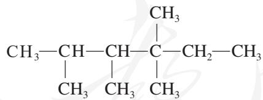

请根据不同烷烃的组成和结构，分析烷烃（除甲烷外）中各种原子数的关系。 

（1）烷烃分子中的氢原子数为 $N(\mathrm{H})$ ，则 $N(\mathrm{H})$ 与 $n_1, n_2, n_3, n_4$ 的关系是： 

$N(\mathrm{H}) =$ 或 $N(\mathrm{H}) =$ 

(2) 若某烷烃的 $n_{2} = n_{3} = n_{4} = 1$ , 则其结构简式可能是 

# 第二节烯烃 炔烃

烯烃和炔烃是含有不饱和键的烃类化合物，烯烃含有碳碳双键，炔烃含有碳碳三键。 

# 一、烯烃

烯烃 alkene 

乙烯 ethene 

# 1. 烯烃的结构和性质

烯烃的官能团是碳碳双键。烯烃只含有一个碳碳双键时，其通式一般表示为 $\mathrm{C}_n\mathrm{H}_{2n}$ 。 

乙烯是最简单的烯烃。其分子中的碳原子均采取 $\mathfrak{sp}^2$ 杂化，碳原子与氢原子之间均以单键（ $\sigma$ 键）相连接，碳原子与碳原子之间以双键（1个 $\sigma$ 键和1个 $\pi$ 键）相连接，相邻两个键之间的夹角约为 $120^{\circ}$ ，分子中的所有原子都位于同一平面（如图1-2、图2-2）。纯净的乙烯为无色、稍有气味的气体，难溶于水，密度比空气的略小。乙烯不仅具有可燃性，而且能被酸性高锰酸钾溶液氧化，还能与溴发生加成反应，在一定条件下能发生加聚反应生成聚合物。 

图2-2 乙烯的分子结构示意图

烯烃物理性质的递变规律与烷烃的相似，沸点也随分子中碳原子数的递增而逐渐升高。烯烃的结构和性质与乙烯的相似，能发生加成反应和氧化反应。 

$$
\mathrm {C H} _ {2} = \mathrm {C H} _ {2}
$$

乙烯

$$
\mathrm {C H} _ {2} = \mathrm {C H C H} _ {3}
$$

丙烯

$$
\mathrm {C H} _ {2} = \mathrm {C H C H} _ {2} \mathrm {C H} _ {3}
$$

1-丁烯

$$
\mathrm {C H} _ {2} = \mathrm {C H C H} _ {2} \mathrm {C H} _ {2} \mathrm {C H} _ {3}
$$

1-戊烯

图2-3 几种简单烯烃的结构简式和分子结构模型

# 思考与讨论

(1) 写出乙烯、丙烯与下列物质反应的化学方程式，并说明反应中官能团和化学键的变化。（提示：丙烯与氯化氢、丙烯与水的反应都可能有两种产物。） 

<table><tr><td>试剂</td><td>乙烯</td><td>丙烯</td></tr><tr><td>溴</td><td></td><td></td></tr><tr><td rowspan="2">氯化氢</td><td rowspan="2"></td><td></td></tr><tr><td></td></tr><tr><td rowspan="2">水</td><td rowspan="2"></td><td></td></tr><tr><td></td></tr></table>

(2) 含有碳碳双键官能团的有机化合物在一定条件下能发生类似乙烯的加聚反应。例如, 氯乙烯可以通过加聚反应生成聚氯乙烯: 

氯乙烯

聚氯乙烯（PVC）

请根据乙烯、氯乙烯发生的加聚反应，分别写出丙烯、异丁烯（ $\mathrm{CH}_2 = \mathrm{C}-\mathrm{CH}_3$ ）发生加聚反应的化学方程式。 

# 2. 烯烃的立体异构

通过碳碳双键连接的原子或原子团不能绕键轴旋转会导致其空间排列方式不同，产生顺反异构现象。例如，2-丁烯的每个双键碳原子都连接了不同的原子和原子团，2-丁 

烯就有两种不同的结构：一种是相同的原子或原子团位于双键同一侧的顺式结构；另一种是相同的原子或原子团位于双键两侧的反式结构。这两种不同结构的有机化合物互为顺反异构体，它们的化学性质基本相同，而物理性质有一定的差异。 

顺-2-丁烯

反-2-丁烯

熔点/℃ -138.9 -105.5 

沸点/℃ 3.7 0.9 

密度 $\mathrm{/(\mathbf{g}\cdot\mathbf{cm}^{-3})}$ 0.621 0.604 

# 资料卡片

# 二烯烃

二烯烃是分子中含有两个碳碳双键的烯烃，如1,3-丁二烯。1,3-丁二烯与氯气发生加成反应时，有以下两种方式： 

(1) 1,2-加成 

$$
\mathrm {C H} _ {2} = \mathrm {C H} - \mathrm {C H} = \mathrm {C H} _ {2} + \mathrm {C l} _ {2} \longrightarrow \begin{array}{c} \mathrm {C H} _ {2} - \mathrm {C H} - \mathrm {C H} = \mathrm {C H} _ {2} \\ | \\ \mathrm {C l} \quad \mathrm {C l} \end{array}
$$

(2) 1,4-加成 

$$
\mathrm {C H} _ {2} = \mathrm {C H} - \mathrm {C H} = \mathrm {C H} _ {2} + \mathrm {C l} _ {2} \longrightarrow \begin{array}{c} \mathrm {C H} _ {2} - \mathrm {C H} = \mathrm {C H} - \mathrm {C H} _ {2} \\ \mid \\ \mathrm {C l} \end{array}
$$

1,3-丁二烯的1,2-加成和1,4-加成是竞争反应，到底哪一种加成产物占优势取决于反应条件。 

# 二、炔烃

炔烃的官能团是碳碳三键。炔烃分子中只含有一个碳碳三键时，其通式一般表示为 $\mathrm{C}_n\mathrm{H}_{2n - 2}$ 。炔烃物理性质的递变与烷烃和烯烃的相似，沸点也随分子中碳原子数的递增而逐渐升高。 

乙炔（俗称电石气）是最简单的炔烃。乙炔是无色、无臭的气体，微溶于水，易溶于有机溶剂。下面以乙炔为例来学习炔烃的分子结构和化学性质。 

# 1. 乙炔的结构

乙炔的分子式为 $\mathrm{C}_2\mathrm{H}_2$ ，结构简式为 $\mathrm{CH}\equiv \mathrm{CH}$ ，其分子为直线形结构，相邻两个键之间的夹角为 $180^{\circ}$ （如图2-4）。乙炔分子中的碳原子均采取sp杂化，碳原子和氢原子之间均以单键（ $\sigma$ 键）相连接，碳原子和碳原子之间以三键（1个 $\sigma$ 键和2个 $\pi$ 键）相连接（如图2-5）。 

炔烃 alkyne 乙炔 ethyne 

$$
\mathrm {H} - \mathrm {C} \equiv \mathrm {C} - \mathrm {H}
$$

结构式 

球棍模型 

空间填充模型 

图2-4 乙炔的结构式和分子结构模型

$\sigma$ 键 

$\pi$ 键 

图2-5 乙炔分子中的 $\sigma$ 键和 $\pi$ 键示意图

# 2. 乙炔的化学性质

# 探究
# 乙炔的化学性质

# 【问题】

根据乙炔的分子结构，乙炔应该具有怎样的化学性质？ 

# 【资料】

实验室可用电石 $\left(\mathrm{CaC}_{2}\right)$ 与水反应制取乙炔, 反应的化学方程式为: 

$$
\mathrm {C a C} _ {2} + 2 \mathrm {H} _ {2} \mathrm {O} \longrightarrow \mathrm {C a} (\mathrm {O H}) _ {2} + \mathrm {C H} \equiv \mathrm {C H} \uparrow
$$

电石与水反应非常剧烈，为了减小其反应速率，可用饱和氯化钠溶液代替水作反应试剂。反应制得的乙炔中通常会含有硫化氢等杂质气体，可用硫酸铜溶液吸收，以防止其干扰探究乙炔化学性质的实验。乙炔属于可燃性气体，点燃前要检验纯度，防止爆炸。 

# 【预测】

根据乙炔的分子结构，推测乙炔分别通入酸性高锰酸钾溶液和溴的四氯化碳溶液时会有什么现象。根据乙炔的组成，推测点燃乙炔时会有什么现象。 

# 【实验】

如图2-6所示，在圆底烧瓶中放入几小块电石。打开分液漏斗的活塞，逐滴加入适量饱和氯化钠溶液，将产生的气体通入硫酸铜溶液后，再分别通入酸性高锰酸钾溶液和溴的四氯化碳溶液。最后换上尖嘴导管，先检验气体纯度，再点燃乙炔，观察现象。 

图2-6 乙炔的实验室制取及性质检验

记录： 

<table><tr><td>实验内容</td><td>实验现象</td></tr><tr><td>(1)将饱和氯化钠溶液滴入盛有电石的烧瓶中</td><td></td></tr><tr><td>(2)将纯净的乙炔通入盛有酸性高锰酸钾溶液的试管中</td><td></td></tr><tr><td>(3)将纯净的乙炔通入盛有溴的四氯化碳溶液的试管中</td><td></td></tr><tr><td>(4)点燃纯净的乙炔</td><td></td></tr></table>

# 【结果与讨论】

(1) 以上实验现象与你的预测是否一致? 乙炔通入酸性高锰酸钾溶液时的实验现象, 说明乙炔具有怎样的化学性质? 

(2) 乙炔通入溴的四氯化碳溶液时的实验现象, 说明乙炔具有怎样的化学性质? 这与乙炔的哪些结构特点有关? 请写出反应的化学方程式, 并指出反应前后官能团和化学键的变化。 

(3) 乙炔在空气中燃烧的实验现象（如图2-7），说明乙炔在组成上有哪些特点？请写出反应的化学方程式。 

图2-7 乙炔燃烧

由于乙炔分子中含有不饱和的碳碳三键，乙炔能与溴发生加成反应。反应过程可分步表示如下： 

乙炔在一定条件下能与氢气、氯化氢和水等物质发生加成反应。 

$$
\mathrm {C H} \equiv \mathrm {C H} + \mathrm {H} _ {2} \xrightarrow [ \triangle ]{\text {催 化 剂}} \mathrm {C H} _ {2} = \mathrm {C H} _ {2}
$$

$$
\mathrm {C H} \equiv \mathrm {C H} + \mathrm {H C l} \xrightarrow [ \triangle ]{\text {催 化 剂}} \mathrm {C H} _ {2} = \mathrm {C H} - \mathrm {C l}
$$

$$
\mathrm {C H} \equiv \mathrm {C H} + \mathrm {H} _ {2} \mathrm {O} \xrightarrow [ \triangle ]{\text {催 化 剂}} \mathrm {C H} _ {3} - \mathrm {C H O} ^ {\circledast}
$$

过去很长一段时间内，人们没有制得乙炔的聚合物。后来，化学家找到了合适的催化剂和反应条件，终于合成了聚乙炔。聚乙炔可用于制备导电高分子材料。 

$$
n \mathrm {C H} \equiv \mathrm {C H} \xrightarrow {\text {催 化 剂}} \left[ \mathrm {C H} = \mathrm {C H} \right] _ {n}
$$

炔烃的结构和性质与乙炔的相似，都含有碳碳三键官能团，能发生加成反应和氧化反应。 

# 资料卡片

乙炔在氧气中燃烧时放出大量的热，氧炔焰的温度可达 $3000^{\circ} \mathrm{C}$ 以上。因此，常用它来焊接或切割金属。 

图2-8 氧炔焰切割金属

# 思考与讨论

(1) 请写出戊炔所有属于炔烃的同分异构体的结构简式。 

(2) 请写出 1-丁炔与足量氢气完全反应的化学方程式，并分析该反应中化学键和官能团的变化。 

(3) 某炔烃通过催化加氢反应得到 2-甲基戊烷,请由此推断该炔烃可能的结构简式。 

# 科学·技术·社会

# 导电高分子

2000年的诺贝尔化学奖授予了美国物理学家黑格（A.J.Heeger，1936—）、化学家麦克迪尔米德（A.G.MacDiarmid，1927—2007）和日本化学家白川英树（1936—），以表彰他们在导电聚合物研究领域的开创性贡献。 

在20世纪70年代，白川英树的学生在做合成聚乙炔的实验时，错误地提高了催化剂的用量，结果在反应液中形成了一层银白色发亮的膜状物。白川英树没有放过这样偶然发现的反常现象，继续进行深入研究。他与化学家麦克迪尔米德、物理学家黑格合作，发现掺杂 $\mathrm{I}_2$ 的聚乙炔具有与金属材料一样的导电性，比原聚乙炔膜的导电性有了大幅度的提高。 

高分子材料本属于不能导电的绝缘体， 

他们的发现开辟了高分子应用的新领域——导电高分子。一些高分子的共轭大 $\pi$ 键体系为电荷传递提供了通路，像聚苯胺、聚苯等经过掺杂处理后也具有一定的导电性能。导电高分子材料可用于制造移动电子设备的开关、轻便的彩色显示屏等，还可作为微波吸收材料，用于飞机与舰艇等的隐形涂料。 

图2-9 使用了导电高分子材料的电子器件

# 研究与实践

# 乙烯的生产和应用

# 【研究目的】

调查乙烯的生产在石油化工中的地位与作用。了解为什么乙烯的产量是一个国家石油化工发展水平的重要标志。 

# 【研究任务】

(1) 查阅资料, 了解乙烯的工业生产原理, 以及我国乙烯工程的基本规模情况。 

(2) 在你的生活中, 有关衣食住行的哪些产品是以乙烯为基础原料制造的? 

（3）以乙烯为基础原料，查阅资料，设计几种生活中常见有机化合物的合成路线，举例说明它们在生活中的用途。使用图示呈现合成路线，并搭建这些有机化合物的分子结构模型。 

# 【结果与讨论】

（1）通过乙烯的工业生产和实际应用的调研，你如何理解化学工业发展过程中技术进步的重要性？请提出你的观点，并与同学交流。 

(2) 通过以乙烯为基础原料的有机合成路线设计, 你如何理解化学制造有用的产品对创造我们美好生活的意义? 请与同学交流你的看法。 

1. 下列有机化合物中，互为同分异构体的是（ ）。 

A. $\mathrm{CH}_2 = \mathrm{CH}-\mathrm{CH}-\mathrm{CH}-\mathrm{CH}_3$ | CH3 CH3 

B. $\mathrm{CH}_{2} = \mathrm{CH}-\mathrm{CH}-\mathrm{CH}_{3}$ C2H5 

C. $\mathrm{CH}_2 = \mathrm{CH} - \mathrm{C} = \mathrm{CH}_2$ CH3 

D. $\mathrm{CH} \equiv \mathrm{C}-\mathrm{CH}-\mathrm{CH}_{3}$ CH3 

2.下列说法正确的是（ ）。 

A. 乙烯和乙炔都是直线形分子 

B. 乙烯和乙炔都能发生加成反应和加聚反应 

C. 乙炔分子中含有极性键和非极性键 

D. 乙炔与分子式为 $\mathrm{C}_{4} \mathrm{H}_{6}$ 的烃一定互为同系物 

3. 下列反应不属于加成反应的是（ ）。 

A. 乙烯水化法合成乙醇 

B. 乙炔与氯化氢反应 

C. 1-丁烯使溴的四氯化碳溶液褪色 

D. 1-丁炔使酸性高锰酸钾溶液褪色 

4.（1） $\mathrm{CH}_3$ — $\mathrm{CH}-\mathrm{CH}_2-\mathrm{CH}_2-\mathrm{CH}=\mathrm{CH}_2$ 的分子式为 ________，它与乙烯的关系是 ________。CH₃ 

(2) 根据碳碳单键、双键和三键的结构特征推测, 化合物 $\mathrm{CH}_{3}-\mathrm{CH}=\mathrm{CH}-\mathrm{C} \equiv \mathrm{C}-\mathrm{CH}_{3}$ 分子中位于同一平面内的碳原子最多有____个。 

5. 丙烯是石油裂解的主要产物之一，将丙烯通入溴的四氯化碳溶液中，可观察到的现象是__________，反应的化学方程式为__________，反应类型是__________。丙烯在一定条件下可制得塑料包扎绳的主要材料聚丙烯，相关反应的化学方程式为__________，反应类型是__________。 

6. 已知某些烯烃被酸性高锰酸钾溶液氧化可生成羧酸和酮，例如： 

$$
\mathrm {C H} _ {3} \mathrm {C H} = \mathrm {C} \left(\mathrm {C H} _ {3}\right) _ {2} \xrightarrow {\mathrm {K M n O} _ {4} / \mathrm {H} ^ {+}} \mathrm {C H} _ {3} \mathrm {C O O H} + \mathrm {C H} _ {3} \mathrm {C O C H} _ {3} (\text {丙 酮})
$$

分子式为 $\mathrm{C}_{10} \mathrm{H}_{20}$ 的某烯烃被酸性高锰酸钾溶液氧化后, 生成正丁酸 $\left(\mathrm{CH}_{3} \mathrm{CH}_{2} \mathrm{CH}_{2} \mathrm{COOH}\right)$ 和 3-己酮 $\left(\mathrm{CH}_{3} \mathrm{CH}_{2} \mathrm{COCH}_{2} \mathrm{CH}_{2} \mathrm{CH}_{3}\right)$ 。请据此推测该烯烃的结构简式。 

7. 完全燃烧 $0.70 \mathrm{~g}$ 某有机化合物, 生成 $2.20 \mathrm{~g} \mathrm{CO}_{2}$ 和 $0.90 \mathrm{~g} \mathrm{H}_{2} \mathrm{O}$ 。 

（1）求该有机化合物的实验式 

（2）实验测得该有机化合物的相对分子质量为70，求该物质的分子式。 

(3) 该有机化合物能使溴的四氯化碳溶液褪色, 请推测其可能的结构简式。 

# 第三节芳香烃

在烃类化合物中，有很多分子里含有一个或多个苯环，这样的化合物属于芳香烃，苯是最简单的芳香烃。 

# 一、苯

苯是一种无色、有特殊气味的液体，有毒，不溶于水。苯易挥发，沸点 $80.1^{\circ} \mathrm{C}$ ，熔点 $5.5^{\circ} \mathrm{C}$ ，常温下密度 $0.88 \mathrm{~g} / \mathrm{cm}^{3}$ 。苯是一种重要的化工原料和有机溶剂。 

# 1. 苯的分子结构

# 【实验2-1】

向两支各盛有 $2 \mathrm{~mL}$ 苯的试管中分别加入酸性高锰酸钾溶液和溴水, 用力振荡, 观察现象。 

实验表明，苯不能被酸性高锰酸钾溶液氧化，也不与溴水反应。溴在苯中的溶解度比在水中的大，因此苯能将溴从水中萃取出来。 

根据苯的分子式 $\mathrm{C}_{6} \mathrm{H}_{6}$ 可以推测其分子的不饱和程度很大，应与烯烃、炔烃等不饱和烃具有相似的化学性质。但是，以上实验事实表明，苯的化学性质与烯烃和炔烃有很大差别，说明苯分子具有不同于烯烃和炔烃的特殊结构。 

研究表明，苯分子为平面正六边形结构，其中的6个碳原子均采取 $\mathfrak{sp}^2$ 杂化，分别与氢原子及相邻碳原子以 $\sigma$ 键结合，键间夹角均为 $120^{\circ}$ ，连接成六元环（如图2-11）。每个碳碳键的键长相等，都是 $139~\mathrm{pm}$ ，介于碳碳单键和碳碳双键的键长之间。每个碳原子余下的p轨道垂直于碳、氢原子 

芳香烃 arene 

苯 benzene 

图2-10 苯的分子结构模型

构成的平面，相互平行重叠形成大 $\pi$ 键，均匀地对称分布在苯环平面的上下两侧（如图2-11）。 

$\sigma$ 键

大 $\pi$ 键

图2-11 苯分子中的 $\sigma$ 键和大 $\pi$ 键示意图

# 2. 苯的化学性质

苯的大 $\pi$ 键比较稳定，在通常情况下不易发生烯烃和炔烃所容易发生的加成反应。苯有可燃性，在空气里燃烧会产生浓重的黑烟。 

# （1）取代反应

苯与溴在 $\mathrm{FeBr}_{3}$ 催化下可以发生反应，苯环上的氢原子可被溴原子取代，生成溴苯。 

纯净的溴苯是一种无色液体，有特殊的气味，不溶于水，密度比水的大。 

在浓硫酸作用下，苯在 $50\sim 60^{\circ}\mathrm{C}$ 还能与浓硝酸发生硝化反应，生成硝基苯。 

纯净的硝基苯是一种无色液体，有苦杏仁气味，不溶于水，密度比水的大。 

# 苯的磺化

苯与浓硫酸在 $70 \sim 80^{\circ} \mathrm{C}$ 可以发生磺化反应，生成苯磺酸。 

苯磺酸易溶于水，是一种强酸，可以看作是硫酸分子里的一个羟基被苯环取代的产物。磺化反应可用于制备合成洗涤剂。 

# (2) 加成反应

在以Pt、Ni等为催化剂并加热的条件下，苯能与氢气发生加成反应，生成环己烷。 

# 科学史话

# 凯库勒和苯的分子结构

凯库勒（F.A.Kekulé，1829—1896）是德国有机化学家，为纪念他对有机化合物结构理论的发展作出的重大贡献，现在广泛使用的表示苯结构的 $\text{被}$ 称为凯库勒式。 

图2-12 凯库勒

但是，根据凯库勒式给出的苯的结构，还是有很多事实难以得到解释。例如，根据凯库勒式的单、双键相间的结构，邻二氯苯应该有如下两种不同的结构： 

然而实际上并不存在两种不同的邻二氯苯。研究表明，苯分子中并不存在单、双键相间的结构，而是形成了闭合的大 $\pi$ 键。因此邻二氯苯只有一种结构，以下的两种结构显然是等同的： 

同时，苯也难以表现出类似乙烯的典型烯烃的化学性质，难以被酸性高锰酸钾溶液氧化，也难以与溴发生加成反应。这是因为苯含有大 $\pi$ 键的高度对称的分子结构比较稳定。现在，人们既用凯库勒式表示苯的结构，也使用 $\bigcirc$ 表示苯的结构。 

# 二、苯的同系物

苯环上的氢原子被烷基取代所得到的一系列产物称为苯的同系物，其通式为 $\mathrm{C}_n\mathrm{H}_{2n - 6}$ 。苯的同系物一般是具有类似苯的气味的无色液体，不溶于水，易溶于有机溶剂，密度比水的小。常见的苯的同系物及其部分物理性质见表2-2。 

表 2-2 常见的苯的同系物及其部分物理性质

<table><tr><td>苯的同系物</td><td>名称</td><td>熔点/℃</td><td>沸点/℃</td><td>密度/(g·cm-3)</td></tr><tr><td>CH3—CH3</td><td>甲苯</td><td>-95</td><td>111</td><td>0.867</td></tr><tr><td>C2H5—C2H5</td><td>乙苯</td><td>-95</td><td>136</td><td>0.867</td></tr><tr><td>CH3—CH3—CH3</td><td>邻二甲苯(1,2-二甲苯)</td><td>-25</td><td>144</td><td>0.880</td></tr><tr><td>CH3—CH3—CH3</td><td>间二甲苯(1,3-二甲苯)</td><td>-48</td><td>139</td><td>0.864</td></tr><tr><td>CH3—CH3—CH3</td><td>对二甲苯(1,4-二甲苯)</td><td>13</td><td>138</td><td>0.861</td></tr></table>

苯的同系物与苯都含有苯环，因此能在一定条件下发生溴代、硝化和催化加氢反应。但由于苯环与烷基的相互作用，苯的同系物的化学性质与苯又有所不同。 

# 【实验2-2】

# #

<table><tr><td>实验内容</td><td>实验现象</td><td>解释</td></tr><tr><td>(1)向两支分别盛有2mL苯和甲苯的试管中各加入几滴溴水,静置</td><td></td><td></td></tr><tr><td>(2)将上述试管用力振荡,静置</td><td></td><td></td></tr><tr><td>(3)向两支分别盛有2mL苯和甲苯的试管中各加入几滴酸性高锰酸钾溶液,静置</td><td></td><td></td></tr><tr><td>(4)将上述试管用力振荡,静置</td><td></td><td></td></tr></table>

甲苯分子中含有苯环和甲基（如图2-13），因此其化学性质与苯和甲烷有相似之处。同时，由于甲基与苯环之间存在相互作用，甲基使苯环上与甲基处于邻、对位的氢原子活化而易被取代，而苯环也使甲基活化，因此甲苯的化学性质又有不同于苯和甲烷之处。 

图2-13 甲苯的分子结构模型

# 思考与讨论

结合苯和甲苯的分子结构特点及上述实验结果，分析苯和甲苯的物理性质、化学性质有哪些相似点和不同点。 

甲苯与浓硝酸和浓硫酸的混合物在加热条件下可以发生取代反应，生成一硝基取代物、二硝基取代物和三硝基取代物，硝基取代的位置均以甲基的邻、对位为主。其中生成三硝基取代物的化学方程式为： 

2,4,6-三硝基甲苯（TNT）

2,4,6-三硝基甲苯又叫梯恩梯（TNT），是一种淡黄色晶体，不溶于水。它是一种烈性炸药，广泛用于国防、采矿、筑路、水利建设等。 

甲苯 toluene 

# 思考与讨论

(1) 在光照条件下, 甲苯与氯气能发生类似甲烷与氯气的取代反应, 请写出可能的有机产物的结构简式。分离提纯这些有机化合物的方法是什么? 

(2) 在 $\mathrm{FeBr}_{3}$ 催化下, 甲苯与溴发生取代反应可以生成一溴代甲苯, 请写出该反应的主要有机产物的结构简式, 并从化学键和官能团的角度分析反应中有机化合物的变化。 

(3) 在 $\mathrm{Pt}$ 作催化剂和加热的条件下, 甲苯与氢气能发生类似苯与氢气的加成反应, 请写出该反应的化学方程式。 

(4) 对比苯与甲苯的结构, 以及二者发生硝化反应的产物, 你能得出什么结论? 

# 资料卡片

# 稠环芳香烃——萘、蒽

由两个或两个以上的苯环共用相邻的两个碳原子的芳香烃是稠环芳香烃。 

萘（分子式为 $\mathrm{C_{10}H_8}$ ）是一种无色片状晶体，有特殊气味，熔点 $80^{\circ}\mathrm{C}$ ，易升华，不溶于水。曾用于杀菌、防蛀、驱虫，因其有一定毒性，现已不再使用。萘是一种重要的化工原料，可用于生产增塑剂、农药、染料等， 

它的结构可表示为： 

葱（分子式为 $\mathrm{C_{14}H_{10}}$ ）是一种无色晶体，易升华，不溶于水，易溶于苯。葱是合成染料的重要原料，它的结构可表示为： 

# 练习与应用

1. 下列化合物中，不溶于水，且密度小于水的是（ ）。 

A. 乙酸 

B. 乙醇 

C. 苯 

D. 四氯化碳 

2. 下列有机化合物的分子中，所有原子不可能位于同一平面的是（ ）。 

A. $\mathrm{C}_{2} \mathrm{H}_{2}$ 

B. ${\mathrm{C}}_{2}{\mathrm{H}}_{4}$ 

C. $\mathrm{C}_{6} \mathrm{H}_{6}$ （苯） 

D. $\mathrm{C}_{7} \mathrm{H}_{8}$ （甲苯） 

3. 对下列变化过程中发生反应的类型判断不正确的是（ ）。 

A. $\mathrm{CH}_4\rightarrow \mathrm{CH}_3\mathrm{Cl}$ 取代反应 

B. $\mathrm{CH}_2 = \mathrm{CH}_2 \rightarrow \mathrm{CH}_2\mathrm{BrCH}_2\mathrm{Br}$ 加成反应 

C. $\overline{\langle\bigstar\rangle}\rightarrow \overline{\langle\bigstar\rangle}\mathrm{-Br}$ 取代反应 

D. $\overline{\langle\bigstar\rangle}\rightarrow \overline{\langle\bigstar\rangle}\mathrm{-NO}_2$ 加成反应 

4.下列物质中，属于苯的同系物的是（ ）。 

A. C 

B. $\mathrm{CH}_{2} \mathrm{CH}_{3}$ 

C. $\mathrm{CH} = \mathrm{CH}_{2}$ 

D. $\mathrm{Br}$ 

5.下列物质中，可被用于鉴别苯和甲苯的是（ ）。 

A. 水 

B. 溴水 

C. 酸性高锰酸钾溶液 

D. 氢氧化钠溶液 

6. 分子式均为 $\mathrm{C_8H_{10}}$ 的下列化合物中，苯环上的一氯代物只有一种的是（ ）。 

A. 乙苯 

B. 邻二甲苯 

C. 间二甲苯 

D. 对二甲苯 

7.下列苯的同系物的名称不正确的是（ ）。 

A. $\mathrm{CH}_3$ —— $\mathrm{CH}_3$ 

对二甲苯 

B. $\mathrm{CH}_{2} \mathrm{CH}_{3}$ 

乙苯 

CH3 C. CH3 CH3 

1,2,3-三甲苯 

D. $\mathrm{CH}_{3} - \left\langle \right\rangle_{\mathrm{CH}_{3}} - \mathrm{CH}_{3}$ 

1,3,4-三甲苯 

8. 吸烟有害健康，烟草的焦油中含有一种强烈的致癌物，其结构如右图所示。该有机化合物的分子式为 

9. 某种苯的同系物完全燃烧时，所得 $\mathrm{CO}_{2}$ 和 $\mathrm{H}_{2} \mathrm{O}$ 的物质的量之比为 $8: 5$ 。 

(1) 苯的同系物的通式为 , 该物质的分子式为 

(2) 若该物质苯环上的一氯代物只有两种, 则其结构简式为 , 名称为 

10. 由芳香烃A可以合成两种有机化合物B和C，如下图所示： 

(1) A 的结构简式为 

（2）请写出反应①、②的条件和反应物。 

（3）有关有机化合物B和C的下列说法正确的是 （填字母）。 

a. 互为同系物 

b. 互为同分异构体 

c. 都属于卤代烃 

d. 都属于芳香族化合物 

11. 苯的某些同系物可被酸性高锰酸钾溶液氧化，例如： 

（1）以上反应说明苯的这些同系物分子中的烷基受到了什么影响？ 

(2) 若苯的同系物侧链的烷基中, 直接与苯环连接的碳原子上没有 $\mathrm{C}-\mathrm{H}$ , 则该物质一般不能被酸性高锰酸钾溶液氧化成苯甲酸。某分子式为 $\mathrm{C}_{11} \mathrm{H}_{16}$ 的单烷基取代苯, 已知它可以被氧化成苯甲酸的同分异构体共有 7 种, 其中的 3 种是: $\left\langle \right\rangle$ ——CH₂CH₂CH₂CH₂CH₃、 $\left\langle \right\rangle$ ——CH(CH₃)CH₂CH₂CH₃、 $\left\langle \right\rangle$ ——CH₂CH(CH₃)CH₂CH₃。请写出其他 4 种的结构简式。 

# 一、烃类的组成、结构与性质

碳原子的饱和程度和化学键的类型是认识烃类化学性质的主要依据。 

# 二、烃类的转化规律

下图中的箭头表示各有机化合物类别之间的转化关系，请举例写出相应的化学方程式，并注明反应类型，分析转化过程中官能团和化学键的变化。 

# 复习与提高

1.可以用分液漏斗分离的一组混合物是（ ）。 

A. 苯和甲苯 

B. 乙醇和水 

C. 苯和水 

D. 溴和四氯化碳 

2. 下列物质：①甲烷、②乙烯、③乙炔、④苯、⑤甲苯，既能使酸性高锰酸钾溶液褪色，又能使溴的四氯化碳溶液褪色的是（ ）。 

A. ①② 

B. ②④ 

C. ②③ 

D. ④⑤ 

3.下列物质的分子中，所有碳原子不可能位于同一平面的是（ ）。 

A. $\mathrm{CH}=\mathrm{CH}_{2}$ 

B. $\mathrm{CH}_{2} \mathrm{CH}_{3}$ 

C. CH CH3 

D. $\mathrm{CH}_{3} \mathrm{CH}_{3}$ 

4. 下列有机化合物的分子中，含有两种处于不同化学环境的氢原子的是（ ）。 

CH3 A.CH3-C-CH3 CH3 

B. $\mathrm{CH}_3 - \mathrm{CH} - \mathrm{CH} = \mathrm{CH}_2$ CH3 

C. $\mathrm{CH}_{3}$ 

D. $\mathrm{CH}_{3} - \overline{\langle\bigstar\rangle}$ ——CH 

5. 下列反应中，其有机产物含有两个官能团的是（ ）。 

A. $1 \mathrm{~mol}$ 乙炔与 $2 \mathrm{~mol}$ 溴发生加成反应 

B. 乙烯与溴发生加成反应 

C. $1 \mathrm{~mol}$ 苯与 $3 \mathrm{~mol}$ 氢气发生加成反应 

D. 甲苯硝化生成三硝基甲苯 

6. 完全燃烧 $1.00 \mathrm{~g}$ 某脂肪烃, 生成 $3.08 \mathrm{~g} \mathrm{CO}_{2}$ 和 $1.44 \mathrm{~g} \mathrm{H}_{2} \mathrm{O}$ 。质谱法测得其相对分子质量为 100 。下列说法不正确的是 ( )。 

A. 该脂肪烃属于烷烃, 其分子式为 $\mathrm{C}_{7} \mathrm{H}_{16}$ 

B. 该脂肪烃能发生取代反应, 不能发生加成反应 

C. 该脂肪烃主链有 4 个碳原子的结构有 2 种 

D. 该脂肪烃主链有 5 个碳原子的结构有 5 种 

7. 下列有机反应中，C—H发生断裂的是（ ）。 

A. 甲烷与氯气在光照条件下反应 

B. 乙烯与溴的四氯化碳溶液反应 

C. 乙炔与氯化氢在催化剂和加热条件下反应 

D. 苯与氢气在催化剂和加热条件下反应 

8. 在甲苯中加入少量紫红色的酸性高锰酸钾溶液，振荡后褪色。其原因是（ ）。 

A. 甲苯属于不饱和烃, 可被酸性高锰酸钾溶液氧化 

B. 苯环受甲基影响, 可被酸性高锰酸钾溶液氧化 

C. 甲基受苯环影响, 可被酸性高锰酸钾溶液氧化 

D. 甲苯催化高锰酸钾在酸性溶液中分解 

9. 在一定条件下，乙烷和乙烯都可以通过化学反应生成氯乙烷。 

(1) 用乙烷制备氯乙烷的化学方程式是__________，该反应的类型是__________。 

(2) 用乙烯制备氯乙烷的化学方程式是________，该反应的类型是________。 

（3）你认为上述两种方法中较好的是哪一种？请说明原因。 

10.（1）制取乙炔的实验装置如图2-6所示，其中硫酸铜溶液的作用是 ________。烧瓶中发生的主要反应的化学方程式为 ________。 

(2) 乙炔可通过下列合成路线合成聚丙烯腈, 聚丙烯腈可用于生产腈纶 (人造羊毛)。 

$$
\mathrm {C H} \equiv \mathrm {C H} \xrightarrow [ \text {催 化 剂 ，} \triangle ]{\mathrm {H C N}} \mathrm {A} \xrightarrow {\triangle} \text {聚 丙 烯 腈}
$$

$\mathrm{A}\rightarrow$ 聚丙烯腈反应的化学方程式是 

11. 有机化合物A是一种重要的化工原料，在一定条件下可以发生如下反应： 

已知苯环侧链上的烃基在一定条件下能被氧化成羧基。 

（1）下列关于有机化合物A的说法正确的是 （填字母）。 

a. 属于芳香烃 

b. 属于苯的同系物 

c. 苯环上连有烷基 

d. 侧链中含碳碳双键 

(2) 有机化合物 A 的结构简式为 

（3）请写出 $\mathrm{A} \rightarrow \mathrm{B}$ 反应的化学方程式，并指出其反应类型。 

(4) D具有优良的绝热、绝缘性能, 可用作包装材料和建筑材料, 在工业上以A为原料生产。请写出相关反应的化学方程式, 并指出其反应类型。 

# 第三章 烃的衍生物

卤代烃 

醇 酚 

醛 酮 

羧酸 羧酸衍生物 

有机合成 

烃分子中的氢原子被不同官能团所取代后，就能生成一系列新的不同类别的有机化合物，如卤代烃、醇、酚、醛、羧酸和酯等。这些有机化合物，从结构的角度都可以看作是由烃衍生而来的，所以被称为烃的衍生物。烃的衍生物具有与烃不同的性质，这些性质主要由其分子中的官能团决定。基于官能团和化学键的特点及有机反应规律，可以推测有机化合物的化学性质，并利用其性质实现相互转化，进行有机合成。有机合成在创造新物质、提高人类生活质量和促进社会发展方面发挥着重要作用。 

# 第一节 卤代烃

卤代烃 halohydrocarbon 

# 资料卡片

# 卤代烃的命名

卤代烃的命名一般用系统命名法，与烃类的命名相似。例如： 

2-氯丁烷

氯乙烯

1,2-二溴乙烷

我们对一氯甲烷、1,2-二溴乙烷、氯乙烯和溴苯这些名称已经不陌生了。它们的结构母体分别是甲烷、乙烷、乙烯和苯，可看作是这些烃分子中的氢原子被卤素原子取代后生成的化合物，我们将这类物质称为卤代烃。卤代烃的种类很多，根据分子里所含卤素原子的不同，分为氟代烃、氯代烃、溴代烃和碘代烃，可用R—X表示。根据取代卤原子的多少，可分为单卤代烃和多卤代烃。 

常温下，卤代烃中除个别为气体外，大多为液体或固体。卤代烃不溶于水，可溶于有机溶剂，某些卤代烃本身是很好的有机溶剂。卤代烃的密度和沸点都高于相应的烃，它们的密度一般随着烃基中碳原子数目的增加而减小，沸点随碳原子数目的增加而升高。 

表 3-1 几种氯代烃的密度和沸点

<table><tr><td>名称</td><td>结构简式</td><td>液态时密度 / (g·cm-3)</td><td>沸点/℃</td></tr><tr><td>氯甲烷</td><td>CH3Cl</td><td>0.916</td><td>-24</td></tr><tr><td>氯乙烷</td><td>CH3CH2Cl</td><td>0.898</td><td>12</td></tr><tr><td>1-氯丙烷</td><td>CH3CH2CH2Cl</td><td>0.890</td><td>46</td></tr><tr><td>1-氯丁烷</td><td>CH3CH2CH2CH2Cl</td><td>0.886</td><td>78</td></tr><tr><td>1-氯戊烷</td><td>CH3CH2CH2CH2CH2Cl</td><td>0.882</td><td>108</td></tr></table>

我们以溴乙烷为例来学习卤代烃的主要性质。溴乙烷的分子式为 $\mathrm{C}_2\mathrm{H}_5\mathrm{Br}$ ，结构简式为 $\mathrm{CH}_3\mathrm{CH}_2\mathrm{Br}$ ，分子结构如图3-1所示。它是无色液体，沸点 $38.4~^\circ \mathrm{C}$ ，密度比水的大，难溶于水，可溶于多种有机溶剂。溴乙烷的核磁共振氢谱如图3-2所示。 

图3-1 溴乙烷的分子结构模型

图3-2 溴乙烷的核磁共振氢谱

# 1. 取代反应

# 【实验3-1】

取一支试管, 滴入 $10 \sim 15$ 滴溴乙烷, 再加入 $1 \mathrm{~mL} 5 \% \mathrm{NaOH}$ 溶液, 振荡后加热, 静置。待溶液分层后, 用胶头滴管小心吸取少量上层水溶液, 移入另一支盛有 $1 \mathrm{~mL}$ 稀硝酸的试管中, 然后加入2滴 $\mathrm{AgNO}_{3}$ 溶液, 观察实验现象。 

可以看到，试管中有浅黄色沉淀生成，该沉淀是 $\mathrm{AgBr}$ 。溴乙烷可以在 $\mathrm{NaOH}$ 水溶液中发生取代反应，该反应也称溴乙烷的水解反应，羟基取代溴原子生成乙醇和溴化钠。 

$$
\mathrm {C} _ {2} \mathrm {H} _ {5} - \mathrm {B r} + \mathrm {N a O H} \xrightarrow [ \triangle ]{\text {水}} \mathrm {C} _ {2} \mathrm {H} _ {5} - \mathrm {O H} + \mathrm {N a B r}
$$

在卤代烃分子中，由于卤素原子的电负性比碳原子的大，使C—X的电子向卤素原子偏移，进而使碳原子带部分正电荷（ $\delta+$ ），卤素原子带部分负电荷（ $\delta-$ ），这样就形成一个极性较强的共价键： $\mathrm{C}^{\delta+}-\mathrm{X}^{\delta-}$ 。因此，卤代烃在化学反应中，C—X较易断裂，使卤素原子被其他原子或原子团所取代，生成负离子而离去。 

# 2. 消去反应

如果将溴乙烷与强碱（如NaOH或KOH）的乙醇溶液共热，溴乙烷可以从分子中脱去HBr，生成乙烯。 

$$
\begin{array}{c} \mathrm {C H} _ {2} - \mathrm {C H} _ {2} + \mathrm {N a O H} \xrightarrow [ \triangle ]{\text {乙 醇}} \mathrm {C H} _ {2} = \mathrm {C H} _ {2} \uparrow + \mathrm {N a B r} + \mathrm {H} _ {2} \mathrm {O} \\ \mathrm {H} \quad \mathrm {B r} \end{array}
$$

# 资料卡片

液态的氯乙烷汽化时大量吸热，具有冷冻麻醉作用，可在身体局部产生快速镇痛效果。因此，常用氯乙烷与其他药物制成“复方氯乙烷气雾剂”，用于运动中的急性损伤，如肌肉拉伤、关节扭伤等的镇痛。 

消去反应（消除反应） 

elimination reaction 

像这样，有机化合物在一定条件下，从一个分子中脱去一个或几个小分子（如 $\mathrm{H}_{2} \mathrm{O}$ 、HX等），而生成含不饱和键的化合物的反应叫做消去反应（消除反应）。 

# 探究

# 1- 溴丁烷的化学性质

# 【问题】

卤代烷在不同溶剂中发生反应的情况不同。如何通过实验的方法验证取代反应和消去反应的产物？ 

# 【讨论与实验】

（1）用哪种分析手段可以检验出1-溴丁烷取代反应生成物中的丁醇？ 

(2) 如图 3-3 所示, 向圆底烧瓶中加入 $2.0 \mathrm{~g} \mathrm{NaOH}$ 和 $15 \mathrm{~mL}$ 无水乙醇, 搅拌。再向其中加入 $5 \mathrm{~mL} 1-$ 溴丁烷和几片碎瓷片, 微热。将产生的气体通入盛水的试管后, 再用酸性高锰酸钾溶液进行检验。 

图3-3 1-溴丁烷的消去反应

# 【比较与分析】

比较1-溴丁烷的取代反应和消去反应，完成下表，分析反应条件对化学反应的影响。 

<table><tr><td>反应类型</td><td>取代反应</td><td>消去反应</td></tr><tr><td>反应物</td><td></td><td></td></tr><tr><td>反应条件</td><td></td><td></td></tr><tr><td>生成物</td><td></td><td></td></tr><tr><td>结论</td><td colspan="2"></td></tr></table>

# 【讨论】

(1) 如图 3-3 所示, 为什么要在气体通入酸性高锰酸钾溶液前先通入盛水的试管? 除了酸性高锰酸钾溶液, 还可以用什么方法检验生成物? 此时还有必要将气体先通入水中吗? 

（2）预测2-溴丁烷发生消去反应的可能产物。 

卤代烯烃的某些化学性质与烯烃的相似，能发生加成反应和加成聚合反应。例如，氯乙烯能加成聚合生成聚氯乙烯，四氟乙烯加成聚合生成聚四氟乙烯。聚氯乙烯和聚四氟乙烯都是用途广泛的高分子材料。 

$$
n \mathrm {C F} _ {2} = \mathrm {C F} _ {2} \longrightarrow \left[ \mathrm {C F} _ {2} - \mathrm {C F} _ {2} \right] _ {n}
$$

四氟乙烯

聚四氟乙烯

聚氯乙烯管道

含氟聚合物制成的充气薄膜建材

图3-4 以卤代烃为原料的制品

# 科学·技术·社会

# 臭氧层的保护

卤代烃在日常生活中有着广泛的应用。例如，在消防上使用的卤代烃灭火剂，可应用于资料室、变电站、博物馆等场所。由于卤代烃是良好的有机溶剂，在清洗业中常用作清洗剂，应用于衣物干洗和机械零件的洗涤。有些多卤代烃，如氟氯代烷（商品名氟利昂）是含有氟和氯的烷烃衍生物，它们化学性质稳定，无毒，具有不燃烧、易挥发、易液化等特性，曾被广泛用作制冷剂和溶剂。然而，20世纪80年代以来，大量的科学研究表明使用氟利昂对臭氧层有破坏作用，使臭氧层产生“臭氧空洞”，危及地球上的生物。 

大气中的臭氧层可滤除大量的紫外线，保护地球上的生物，其主要反应为： 

$$
\mathrm {O} _ {3} \xrightarrow {\text {紫 外 线}} \mathrm {O} _ {2} + \mathrm {O} \cdot
$$

研究表明，氟利昂可在强烈的紫外线作用下分解，产生的氯原子自由基会对臭氧层产生长久的破坏作用。以 $\mathrm{CCl}_3\mathrm{F}$ 为例，它破坏臭氧层的反应过程可表示为： 

$$
\mathrm {C C l} _ {3} \mathrm {F} \xrightarrow {\text {紫 外 线}} \mathrm {C C l} _ {2} \mathrm {F} \cdot + \mathrm {C l} \cdot
$$

$$
\mathrm {C l} \cdot + \mathrm {O} _ {3} \longrightarrow \mathrm {O} _ {2} + \mathrm {C l O} \cdot
$$

$$
\mathrm {C l O} \cdot + \mathrm {O} \cdot \longrightarrow \mathrm {C l} \cdot + \mathrm {O} _ {2}
$$

为了保护臭氧层，国际社会于1987年制定了《关于消耗臭氧层物质的蒙特利尔议定书》，要求签约国限制生产和消费某些卤代烃，并自1989年1月1日起生效。我国于1991年6月加入该议定书。1995年，诺贝尔化学奖授予致力于研究臭氧层被破坏问题的三位环境化学家。 

1. 关于卤代烃的下列说法不正确的是（ ）。 

A. 卤代烃不属于烃 

B. 卤代烃不溶于水, 易溶于有机溶剂 

C. 有的卤代烃可用作有机溶剂 

D. 所有的卤代烃都可以发生消去反应生成相应的烯烃 

2. 下列卤代烃属于 $\mathrm{CH}_3\mathrm{CH}_2\mathrm{Cl}$ 同系物的是（ ）。 

A. $\mathrm{CH}_3\mathrm{Cl}$ 

C. $\mathrm{CH}_{2} = \mathrm{CHCl}$ 

D. $\mathrm{CH}_{2} \mathrm{ClCH}_{2} \mathrm{Cl}$ 

3.1-氯丙烷和2-氯丙烷分别与NaOH的乙醇溶液共热反应，下列叙述正确的是（ ）。 

A. 产生的官能团相同 

B. 产物互为同分异构体 

C. 碳氢键断裂的位置相同 

D. 产生的官能团不同 

4. 下列反应属于取代反应的是（ ）。 

A. 乙烯与溴的四氯化碳溶液生成1,2-二溴乙烷 

B. 溴乙烷与氢氧化钠的乙醇溶液共热生成乙烯 

C. 氯乙烯生成聚氯乙烯 

D. 丙烷与氯气在光照下生成氯丙烷 

5. 为检验1-溴丁烷中的溴元素，下列实验操作正确的顺序是 （填序号）。 

(1)加热煮沸 

② 加入硝酸银溶液 

③ 取少量1-溴丁烷 

④ 加入足量稀硝酸酸化 

(5)加入氢氧化钠溶液 

(6) 冷却 

6. 写出下列过程中有关反应的化学方程式。 

（1）由2-溴丙烷转化为丙烯 

（2）由1-溴丁烷制取1,2-丁二醇（ $\mathrm{CH}_2\mathrm{OH}\mathrm{CHOHCH}_2\mathrm{CH}_3$ ）。 

7. $1.57 \mathrm{~g}$ 某一氯代烷与足量 $\mathrm{NaOH}$ 水溶液混合加热, 充分反应。所得产物用稀硝酸酸化后再加入足量 $\mathrm{AgNO}_{3}$ 溶液, 得到 $2.87 \mathrm{~g}$ 白色沉淀。 

（1）求该一氯代烷的相对分子质量。 

（2）写出该一氯代烷可能的结构简式和名称。 

8. A、B、C、D是4种有机化合物，它们的分子中均含有2个碳原子，其中A和B是烃。在标准状况下，A对氢气的相对密度是13，B与HCl反应生成C，C和D混合后加入NaOH并加热，可生成B。 

(1) 判断 A、B、C、D 各是哪种有机化合物，写出它们的结构简式。 

（2）写出有关反应的化学方程式 

9. 聚氯乙烯是生活中常用的塑料。工业生产聚氯乙烯的一种合成路线如下： 

请写出反应①、②的化学方程式，并注明反应类型。 

# 第二节

# 醇酚

烃分子中的氢原子被羟基取代可衍生出含羟基的化合物，如： 

在上述化合物中，羟基与饱和碳原子相连的化合物称为醇，羟基与苯环直接相连而形成的化合物称为酚。 

醇 alcohol 

乙醇 ethanol 

# 一、醇

醇的种类很多，根据醇分子中所含羟基的数目，可以分为一元醇、二元醇和多元醇。分子中只含有一个羟基的醇，叫做一元醇。由烷烃所衍生的一元醇，叫做饱和一元醇，如甲醇、乙醇等，它们的通式是 $\mathrm{C}_n\mathrm{H}_{2n + 1}\mathrm{OH}$ ，可简写为R—OH。分子里含有两个或两个以上羟基的醇，分别叫做二元醇和多元醇，如： 

乙二醇可用于生产汽车防冻液

丙三醇可用于配制化妆品

图3-5 乙二醇和丙三醇的用途

甲醇（ $\mathrm{CH}_3\mathrm{OH}$ ）是无色、具有挥发性的液体，易溶于水，沸点为 $65~^\circ \mathrm{C}$ 。甲醇有毒，误服会损伤视神经，甚至致人死亡。甲醇广泛应用于化工生产，也可作为车用燃料。乙二醇和丙三醇都是无色、黏稠的液体，都易溶于水和乙醇，是重要的化工原料。 

醇在水中的溶解度一般随分子中碳原子数的增加而降低，沸点随碳原子数的增加而升高。 

表 3-2 几种醇的熔点和沸点

<table><tr><td>名称</td><td>结构简式</td><td>熔点/℃</td><td>沸点/℃</td></tr><tr><td>甲醇</td><td>CH3OH</td><td>-97</td><td>65</td></tr><tr><td>乙醇</td><td>CH3CH2OH</td><td>-117</td><td>78</td></tr><tr><td>正丙醇</td><td>CH3CH2CH2OH</td><td>-126</td><td>97</td></tr><tr><td>正丁醇</td><td>CH3CH2CH2CH2OH</td><td>-90</td><td>118</td></tr><tr><td>正戊醇</td><td>CH3CH2CH2CH2CH2OH</td><td>-79</td><td>138</td></tr><tr><td>十八醇（硬脂醇）</td><td>CH3(CH2)17OH</td><td>59</td><td>211</td></tr></table>

# 思考与讨论

表3-3列举了几种相对分子质量相近的醇与烷烃的沸点。请仔细阅读并对比表格中的数据，你能得出什么结论？与同学进行交流。 

表 3-3 相对分子质量相近的醇与烷烃的沸点

<table><tr><td>名称</td><td>结构简式</td><td>相对分子质量</td><td>沸点/℃</td></tr><tr><td>甲醇</td><td>CH3OH</td><td>32</td><td>65</td></tr><tr><td>乙烷</td><td>CH3CH3</td><td>30</td><td>-89</td></tr><tr><td>乙醇</td><td>CH3CH2OH</td><td>46</td><td>78</td></tr><tr><td>丙烷</td><td>CH3CH2CH3</td><td>44</td><td>-42</td></tr><tr><td>正丙醇</td><td>CH3CH2CH2OH</td><td>60</td><td>97</td></tr><tr><td>正丁烷</td><td>CH3CH2CH2CH3</td><td>58</td><td>-0.5</td></tr></table>

我们从表3-3中的数据可知，相对分子质量相近的醇和烷烃相比，醇的沸点远远高于烷烃的沸点。这是由于醇分子中羟基的氧原子与另一醇分子羟基的氢原子间存在着 

氢键（如图3-6）。甲醇、乙醇和丙醇均可与水互溶，这也是因为醇分子与水分子之间形成了氢键。 

图3-6 醇分子间形成氢键

我们知道，乙醇能与钠反应生成氢气和乙醇钠，乙醇也能与乙酸反应生成乙酸乙酯。除上述化学性质外，乙醇还有哪些性质呢？ 

醇的化学性质主要由羟基官能团所决定。在醇分子中，由于氧原子吸引电子的能力比氢原子和碳原子的强，使O—H和C—O的电子都向氧原子偏移。因此，醇在发生反应时，O—H容易断裂，使羟基中的氢原子被取代；同样，C—O也易断裂，使羟基被取代或脱去，从而发生取代反应或消去反应。 

$$
\mathrm {C H} _ {3} \mathrm {C H} _ {2} \mathrm {O} - \mathrm {H}
$$

# 1. 取代反应

醇可以与氢卤酸发生取代反应生成卤代烃和水。反应时醇分子中的C—O断裂，卤素原子取代了羟基而生成卤代烃。例如，乙醇与浓氢溴酸混合加热后发生取代反应，生成溴乙烷，这是制备溴乙烷的方法之一。 

$$
\mathrm {C} _ {2} \mathrm {H} _ {5} \xrightarrow {\square} \mathrm {O H} + \mathrm {H} - \mathrm {B r} \xrightarrow {\triangle} \mathrm {C} _ {2} \mathrm {H} _ {5} - \mathrm {B r} + \mathrm {H} _ {2} \mathrm {O}
$$

# 2. 消去反应

# 【实验3-2】

如图3-9所示，在圆底烧瓶中加入乙醇和浓硫酸（体积比约为 $1: 3$ ）的混合液 $20 \mathrm{~mL}$ ，放入几片碎瓷片，以避免混合液在受热时暴沸。加热混合液，使液体温度迅速升到 $170^{\circ} \mathrm{C}$ ，将生成的气体先通入氢氧化钠溶液除去杂质， 

图3-7 乙醇的分子结构模型

图3-8 乙醇的核磁共振氢谱

图3-9 乙醇的消去反应

醚 ether 

乙醇在浓硫酸的作用下，加热到 $170^{\circ} \mathrm{C}$ 时生成乙烯。 

在这个反应中，乙醇分子脱去一个水分子生成乙烯，发生了消去反应。 

如果把乙醇和浓硫酸的混合物的温度控制在 $140^{\circ} \mathrm{C}$ 左右，乙醇将以另一种方式脱水，即每两个乙醇分子间会脱去一个水分子而生成乙醚。 

# 思考与讨论

(1) 溴乙烷与乙醇都能发生消去反应, 二者的反应有什么异同? 

（2）请写出分子式为 $\mathrm{C}_3\mathrm{H}_8\mathrm{O}$ 的有机化合物的同分异构体的结构简式。 

$$
\mathrm {C} _ {2} \mathrm {H} _ {5} \xrightarrow {\text {O H} + \mathrm {H}} \mathrm {O} - \mathrm {C} _ {2} \mathrm {H} _ {5} \xrightarrow [ 1 4 0 ^ {\circ} \mathrm {C} ]{\text {浓 硫 酸}} \mathrm {C} _ {2} \mathrm {H} _ {5} - \mathrm {O} - \mathrm {C} _ {2} \mathrm {H} _ {5} + \mathrm {H} _ {2} \mathrm {O}
$$

乙醚是一种无色、易挥发的液体，沸点 $34.5\,^{\circ}\mathrm{C}$ ，有特殊气味，具有麻醉作用。乙醚易溶于有机溶剂，它本身是一种优良溶剂，能溶解多种有机化合物。 

像乙醚这样由两个烃基通过一个氧原子连接起来的化合物叫做醚。醚的结构可用R—O—R'来表示，R和R'都是烃基，可以相同，也可以不同。 

醚类物质在化工生产中被广泛用作溶剂，有的醚可被用作麻醉剂。 

# 3. 氧化反应

我们知道，乙醇在铜或银作催化剂等条件下，可以被空气中的氧气氧化为乙醛，实现由醇到醛的转化。乙醇还能不能被其他氧化剂氧化呢？ 

图3-10 乙醇与酸性重铬酸钾溶液的反应

# 【实验3-3】

如图3-10所示，在试管中加入酸性重铬酸钾溶液，然后滴加乙醇，充分振荡，观察实验现象。 

在上述实验中所用到的酸性重铬酸钾 $\left(\mathrm{K}_{2} \mathrm{Cr}_{2} \mathrm{O}_{7}\right)$ 溶液也是一种常用氧化剂。乙醇能被酸性重铬酸钾溶液氧化,其氧化过程可分为两个阶段: 

在有机化学反应中，通常把有机化合物分子中失去氢原子或加入氧原子的反应叫做氧化反应。例如，乙醇在氧化剂的作用下失去氢原子转化为乙醛，以及乙醛在氧化剂的作用下加入氧原子转化为乙酸，发生的都是氧化反应。与氧化反应相反，通常在有机化学反应中，有机化合物分子中加入氢原子或失去氧原子的反应是还原反应。 

# 资料卡片

在日常生活中，我们看到有些人喝酒后，会产生脸部变红、呕吐、昏迷等醉酒症状；有些人喝了一定量的酒，却并不会出现上述症状。这是什么原因造成的呢？ 

酒精在人体内的代谢主要靠两种酶：一种是乙醇脱氢酶，另一种是乙醛脱氢酶。乙醇脱氢酶使乙醇氧化变成乙醛，而乙醛脱氢 

酶能使乙醛氧化为乙酸。乙酸参与体内代谢，转化为二氧化碳和水排出体外。人体内如果具备这两种酶，就能较快地分解酒精。一般人的体内都有乙醇脱氢酶，但不少人缺少乙醛脱氢酶，这使体内的乙醛不易被氧化为乙酸，从而让人脸部甚至体表毛细血管扩张充血，并产生其他醉酒症状。 

# 二、酚

苯酚是一元酚，是酚类化合物中最简单的，其分子式是 $\mathrm{C_6H_6O}$ ，结构可表示为 或 ，分子结构如图3-11所示。下面以苯酚为例来研究酚类化合物的性质。 

纯净的苯酚是无色晶体，但放置时间较长的苯酚往往是粉红色的，这是部分苯酚被空气中的氧气氧化所致。苯酚具有特殊的气味，熔点 $43\%$ 。苯酚易溶于乙醇等有机溶剂。室温下苯酚在水中的溶解度是 $9.2\mathrm{g}$ ，当温度高于 $65\%$ 时能与水互溶。 

图3-11 苯酚的分子结构模型

# 注意

苯酚有毒，对皮肤有腐蚀性，使用时一定要小心。如不慎沾到皮肤上，应立即用乙醇冲洗，再用水冲洗。 

# 1. 酸性

# 【实验3-4】

<table><tr><td>实验内容</td><td>实验现象</td></tr><tr><td>(1)向盛有0.3g苯酚晶体的试管 中加入2mL蒸馏水，振荡试管</td><td></td></tr><tr><td>(2)向试管中逐滴加入5%NaOH 溶液并振荡试管</td><td></td></tr><tr><td>(3)再向试管中加入稀盐酸</td><td></td></tr></table>

酚、苯酚 phenol 

图3-12 苯酚的酸性

由于苯酚中的羟基和苯环直接相连，苯环与羟基之间的相互作用使酚羟基在性质上与醇羟基有显著差异。酚羟基中的氢原子比醇羟基中的氢原子更活泼，苯酚的羟基在水溶液中能够发生部分电离，显示弱酸性，故苯酚俗称石炭酸。苯酚能与 $\mathrm{NaOH}$ 反应，反应的化学方程式为： 

向苯酚钠的溶液中滴加少量稀盐酸，苯酚钠又重新生成了苯酚。 

如果向澄清的苯酚钠溶液中通入二氧化碳气体，可以看到溶液又变浑浊。这是因为苯酚钠在碳酸的作用下又生成了苯酚，这说明苯酚的酸性比碳酸的弱。 

在苯酚分子中，苯环影响了与其相连的羟基的活性。反过来，羟基会不会影响与其相连的苯环的活性呢？ 

# 2. 取代反应

# 【实验3-5】

向试管中加入 $0.1 \mathrm{~g}$ 苯酚和 $3 \mathrm{~mL}$ 水, 振荡, 得到苯酚溶液。再向其中逐滴加入饱和溴水, 边加边振荡, 观察实验现象。 

在苯酚分子中，羟基和苯环相互影响，使苯环在羟基的邻、对位上的氢原子较易被取代。上述实验中，苯酚很容易与溴发生取代反应，生成邻、对位取代的产物2,4,6-三溴苯酚。 

2,4,6-三溴苯酚

苯酚与溴的反应很灵敏，可用于苯酚的定性检验和定量测定。 

# 思考与讨论

如何从分子内基团间相互作用的角度来解释下列事实： 

（1）苯酚的酸性比乙醇的强。 

(2) 苯和苯酚发生溴代反应的条件和产物有很大的不同。 

图3-13 苯酚与溴反应

图3-14 苯酚与氯化铁反应

# 3. 显色反应

# 【实验3-6】

向盛有少量苯酚稀溶液的试管中，滴入几滴 $\mathrm{FeCl}_3$ 溶液，振荡，观察实验现象。 

苯酚与 $\mathrm{FeCl}_3$ 溶液作用显紫色，利用这一反应也可以检验苯酚的存在。酚类物质一般都可以与 $\mathrm{FeCl}_3$ 作用显色，可用于检验其存在。 

苯酚是一种重要的化工原料，广泛用于制造酚醛树脂、染料、医药、农药等。含酚类物质的废水对生物具有毒害作用，会对水体造成严重污染。化工厂和炼焦厂的废水中常含有酚类物质，在排放前必须经过处理。 

# 信息搜索

查阅有关资料，了解酚类废水的危害和工业上处理酚类废水的常用方法，并把你收集的资料设计成一份保护环境的宣传报道。 

# 科学史话

# 苯酚的消毒作用

在19世纪，有一位名叫利斯特（J. Lister, 1827—1912）的英国外科医生，他发现很多患者手术后死于伤口感染。这是什么原因造成的呢？ 

一天早晨，在阳光照耀下，利斯特看到了空气中飞舞的无数灰尘，他突然联想到下面一些问题：伤口接触到这么多灰尘，这里面会不会有细菌呢？接触伤口的绷带、手术刀和医生的双手会不会沾有细菌呢？患者伤口感染会不会跟这些细菌有关呢？于是，他开始寻找有效的消毒方法。 

他观察到在工厂附近的一条水沟里，草根很少腐烂。经过实地调查和多次试验，他发现从这家工厂流出的废水中含有石炭酸（即苯酚），这种物质具有消毒防腐作用。他尝试在手术前用石炭酸溶液为手术器械消毒，并用石炭酸溶液洗手。结果手术后患者伤口感染的现象明显减少，患者的死亡率也大幅下降。 

苯酚有一定毒性和腐蚀性，使用不当会对人体产生毒害作用。酚类消毒剂一般只适于外用。至今，人们已经发现了多种消毒方法，如加热、使用消毒剂、紫外线照射等。 

1.下列物质中，不属于醇类的是（ ）。 

A. $\mathrm{C}_{3} \mathrm{H}_{7} \mathrm{OH}$ 

B. $\mathrm{CH}_{2} \mathrm{OH}$ 

C. (C)—OH 

D. CH2—CH—CH2 OH OH OH 

2. 苯酚具有弱酸性的原因是（ ）。 

A. 羟基使苯环活化 

B. 苯环使羟基中的O—H极性变强 

C. 苯酚能与 $\mathrm{NaOH}$ 溶液反应 

D. 苯酚能与溴水反应 

3. 有机化合物分子中基团间的相互影响会导致其化学性质改变。下列叙述能说明上述观点的是（）。 

A. 苯酚易与 $\mathrm{NaOH}$ 溶液反应, 而乙醇不能 

B. 苯和甲苯都能与 $\mathrm{H}_{2}$ 发生加成反应 

C. 乙烯能发生加成反应, 而乙烷不能 

D. 等物质的量的甘油和乙醇分别与足量 $\mathrm{Na}$ 反应, 前者反应生成的 $\mathrm{H}_{2}$ 多 

4.某有机化合物的结构简式为 $(\mathrm{CH}_3)_2\mathrm{CHCH}_2\mathrm{OH}$ ，它可能发生的反应有： （填序号）。 

①与Na反应放出 $\mathrm{H}_{2}$ 

(2)与NaOH发生中和反应 

(3)一定条件下发生取代反应 

(4)一定条件下发生加成反应 

(5)一定条件下发生氧化反应 

5. 为什么相对分子质量相近的醇和烷烃相比，醇的沸点远远高于烷烃的沸点？为什么甲醇、乙醇、丙醇易溶于水，而碳原子数较多的高级醇水溶性较低？ 

6. 写出下列物质间转化的化学方程式，并注明反应条件。 

7. 三百多年前，著名化学家波义耳使用铁盐与没食子酸（HO—COOH）制造了墨水。请解释其原理。 

8. 如何鉴别苯和苯酚稀溶液？如何除去苯中混有的少量苯酚？请设计尽可能多的实验方案，并与同学进行交流。 

9. 某有机化合物 A 含碳 $76.6 \%$ , 氢 $6.4 \%$ , 氧 $17.0 \%$ , 相对分子质量为甲烷的 5.88 倍。在常温下, A 可与溴水反应生成白色沉淀, $1 \mathrm{~mol} \mathrm{A}$ 恰好与 $3 \mathrm{~mol} \mathrm{Br}_{2}$ 作用。请据此确定 A 的结构简式。 

10. 以乙烯为基本原料, 合成六元环状化合物 $\mathrm{D}\left(\mathrm{C}_{4} \mathrm{H}_{8} \mathrm{O}_{2}\right)$ 的反应如下所示（部分试剂、产物及反应条件略去）: 

请写出各步反应的化学方程式和反应类型。 

# 第三节

# 醛 酮

醛 aldehyde 

乙醛 acetaldehyde 

我们知道，羰基（一C一）是一个碳原子和一个氧原子以双键相连形成的一种原子团，如果羰基的碳原子连着一个氢原子便形成了醛基（一C—H）。 

醛是由烃基（或氢原子）与醛基相连而构成的化合物，简写为RCHO。饱和一元醛的通式为 $\mathrm{C}_n\mathrm{H}_{2n}\mathrm{O}$ 。下面以乙醛为例来学习醛类化合物的性质。 

# 一、乙醛

乙醛是无色、具有刺激性气味的液体，密度比水的小，沸点 $20.8 \mathrm{~C}$ ，易挥发，易燃烧，能与水、乙醇等互溶。 

乙醛的结构式为 $\mathrm{H}-\mathrm{C}-\mathrm{C}-\mathrm{H}$ , 简写为 $\mathrm{CH}_3\mathrm{CHO}$ 。 

图3-15 乙醛的分子结构模型

图3-16 乙醛的核磁共振氢谱

乙醛分子中的醛基官能团对乙醛的化学性质起决定作用。 

# 1. 加成反应

# （1）催化加氢

乙醛蒸气和氢气的混合气体通过热的镍催化剂, 乙醛 

与氢气即发生催化加氢反应，得到乙醇。 

乙醛的催化加氢反应也是它的还原反应。 

# （2）与HCN加成

在醛基的碳氧双键中，由于氧原子的电负性较大，碳氧双键中的电子偏向氧原子，使氧原子带部分负电荷，碳原子带部分正电荷，从而使醛基具有较强的极性。 

乙醛也能和一些极性试剂发生加成反应。例如，乙醛能与氰化氢（HCN）发生加成反应。 

2-羟基丙腈

# 1 提示

当极性分子与醛基发生加成反应时，带正电荷的原子或原子团连接在氧原子上，带负电荷的原子或原子团连接在碳原子上。 

# 2. 氧化反应

# 【实验3-7】

在洁净的试管中加入 $1 \mathrm{~mL} 2 \% \mathrm{AgNO}_{3}$ 溶液, 然后边振荡试管边逐滴滴入 $2 \%$ 氨水, 使最初产生的沉淀溶解, 制得银氨溶液。再滴入 3 滴乙醛, 振荡后将试管放在热水浴中温热。观察实验现象。 

图3-17 乙醛的银镜反应

# 【实验3-8】

在试管里加入 $2 \mathrm{~mL} 10 \% \mathrm{NaOH}$ 溶液, 加入 5 滴 $5 \%$ $\mathrm{CuSO}_{4}$ 溶液, 得到新制的 $\mathrm{Cu(OH)}_{2}$ , 振荡后加入 $0.5 \mathrm{~mL}$ 乙醛溶液, 加热。观察实验现象。 

图3-18 乙醛与氢氧化铜反应

在实验3-7中，硝酸银与氨水生成的银氨溶液中含有 $\mathrm{[Ag(NH_{3})_{2}]OH}$ （氢氧化二氨合银），它是一种弱氧化剂，能把乙醛氧化成乙酸，而 $\mathrm{Ag^{+}}$ 被还原成 $\mathrm{Ag}$ 。 

$$
\mathrm {C H} _ {3} \mathrm {C H O} + 2 \left[ \mathrm {A g} \left(\mathrm {N H} _ {3}\right) _ {2} \right] \mathrm {O H} \xrightarrow {\triangle} \mathrm {C H} _ {3} \mathrm {C O O N H} _ {4} + 2 \mathrm {A g} \downarrow + 3 \mathrm {N H} _ {3} + \mathrm {H} _ {2} \mathrm {O}
$$

银镜反应silver mirror reaction 

由于生成的银附着在试管壁上形成银镜，所以该反应又叫做银镜反应，常用来检验醛基。 

在实验3-8中，新制的 $\mathrm{Cu(OH)}_2$ 也是一种弱氧化剂，能使乙醛氧化。该反应生成了砖红色 $\mathrm{Cu}_2\mathrm{O}$ 沉淀，也可以用来检验醛基。 

$$
\mathrm {C H} _ {3} \mathrm {C H O} + 2 \mathrm {C u} (\mathrm {O H}) _ {2} + \mathrm {N a O H} \xrightarrow {\triangle} \mathrm {C H} _ {3} \mathrm {C O O N a} + \mathrm {C u} _ {2} \mathrm {O} \downarrow + 3 \mathrm {H} _ {2} \mathrm {O}
$$

# 思考与讨论

乙醇、乙醛和乙酸三者之间的转化关系如下图所示。请结合具体反应，以及三者的分子结构和官能团的变化情况，谈谈有机反应中的氧化反应和还原反应的特点。 

$$
\text {乙 醇} \xrightarrow [ \text {还 原} ]{\text {氧 化}} \text {乙 醛} \xrightarrow [ \text {氧 化} ]{\text {氧 化}} \text {乙 酸}
$$

乙醛在一定温度和催化剂存在的条件下，也能被空气中的氧气氧化成乙酸。 

# 二、醛类

除乙醛外，其他醛类化合物，如甲醛（HCHO）、丙醛（ $\mathrm{CH}_3\mathrm{CH}_2\mathrm{CHO}$ ）、苯甲醛（ $\left\langle \right\rangle$ —CHO）等，它们在分子结构中都含有醛基，所以化学性质与乙醛的相似。一般情况下，醛能被还原为醇，被氧化为羧酸，可以发生银镜反应，能与氰化氢加成。 

在醛类中，甲醛是最简单的醛。甲醛又叫蚁醛，是一种无色、有强烈刺激性气味的气体，易溶于水。甲醛的用途非常广泛，它是一种重要的化工原料，能合成多种有机化合物；它的水溶液（又称福尔马林）具有杀菌、防腐性能，可用于消毒和制作生物标本。 

苯甲醛是最简单的芳香醛，俗称苦杏仁油，是一种有苦杏仁气味的无色液体。苯甲醛是制造染料、香料及药物的重要原料。 

甲醛 formaldehyde 福尔马林 formalin 

# 思考与讨论

(1) 由丙醛如何得到 1-丙醇或丙酸? 

(2) 苯甲醛在空气中久置, 在容器内壁会出现苯甲酸的结晶, 这是为什么? 

# 信息搜索

甲醛是一种重要的化工原料，用途十分广泛。但是使用不当会对人体健康造成危害。请以“甲醛”为关键词，在网上搜索资料，写一篇有关安全使用甲醛的小论文，并与同学交流。 

# 资料卡片

自然界许多植物中含有醛，其中有些具有特殊的香味，可作为植物香料使用。 

肉桂醛

苯甲醛

图3-19 桂皮和杏仁中分别含有肉桂醛和苯甲醛

# 三、酮

羰基与两个烃基相连的化合物叫做酮，其结构可表示为R—C—R'。丙酮（ $\mathrm{CH}_3$ —C—CH）是最简单的酮。 

丙酮是无色透明的液体，沸点 $56.2^{\circ} \mathrm{C}$ ，易挥发，能与水、乙醇等互溶。丙酮不能被银氨溶液、新制的 $\mathrm{Cu(OH)}_{2}$ 等弱氧化剂氧化。在催化剂存在的条件下，丙酮可以发生催化加氢反应，生成 2-丙醇。 

酮是重要的有机溶剂和化工原料。例如，丙酮可用作化学纤维、钢瓶储存乙炔等的溶剂，还用于生产有机玻璃、农药和涂料等。 

酮 ketone 

# 思考与讨论

丙酮是丙醛的同分异构体吗？它们有哪些性质差异？可采用哪些方法鉴别它们？ 

1. 某有机化合物的结构简式为 $\mathrm{CH}_{2}=\mathrm{CHCH}_{2}-\mathrm{CHO}$ , 下列对其化学性质的判断不正确的是 ( )。 

A. 能被银氨溶液氧化 

B. 能使酸性 $\mathrm{KMnO}_4$ 溶液褪色 

C. $1 \mathrm{~mol}$ 该物质能与 $1 \mathrm{~mol} \mathrm{HBr}$ 发生加成反应 

D. $1 \mathrm{~mol}$ 该物质只能与 $1 \mathrm{~mol} \mathrm{H}_{2}$ 发生加成反应 

2. 下列反应属于还原反应的是（ ）。 

A. $\mathrm{RCHO} + \mathrm{H}_{2}\longrightarrow \mathrm{RCH}_{2}\mathrm{OH}$ 

B. $\mathrm{CH}_2 = \mathrm{CH}_2 + \mathrm{Br}_2 \longrightarrow \mathrm{CH}_2\mathrm{BrCH}_2\mathrm{Br}$ 

C. $2 \mathrm{CH}_{3} \mathrm{CHO} + \mathrm{O}_{2} \longrightarrow 2 \mathrm{CH}_{3} \mathrm{COOH}$ 

D. $2 \mathrm{CH}_{3} \mathrm{CH}_{2} \mathrm{OH} + \mathrm{O}_{2} \longrightarrow 2 \mathrm{CH}_{3} \mathrm{CHO} + 2 \mathrm{H}_{2} \mathrm{O}$ 

3. 1-丙醇在铜作催化剂并加热的条件下，可被氧化为M。下列物质与M互为同分异构体的是（）。 

A. $\mathrm{CH}_3\mathrm{OCH}_2\mathrm{CH}_3$ 

B. $\mathrm{CH}_3\mathrm{CH}(\mathrm{OH})\mathrm{CH}_3$ 

C. $\mathrm{CH}_3\mathrm{COCH}_3$ 

D. $\mathrm{CH}_{3} \mathrm{CH}_{2} \mathrm{CHO}$ 

4. 某有机化合物的分子式为 $\mathrm{C}_{6} \mathrm{H}_{12} \mathrm{O}$ , 主链有 4 个碳原子, 能发生银镜反应。请写出其可能的结构简式。 

5. 某有机化合物的燃烧产物只有 $\mathrm{CO}_{2}$ 和 $\mathrm{H}_{2} \mathrm{O}$ , 完全燃烧 $2.9 \mathrm{~g}$ 该物质, 生成 $3.36 \mathrm{~L} \mathrm{CO}_{2}$ (标准状况)。该物质的蒸气密度是相同条件下氢气的 29 倍。 

(1) 该有机化合物的分子式为________。若该物质能发生银镜反应, 且 $0.58 \mathrm{~g}$ 该物质与足量银氨溶液反应, 生成 $2.16 \mathrm{~g} \mathrm{Ag}$ , 该有机化合物的结构简式为________。 

(2) 若该物质不能发生银镜反应, 核磁共振氢谱中只有一组峰, 其结构简式为 

6. 用化学方法鉴别下列各组物质。 

（1）溴乙烷、乙醇、乙醛； 

（2）苯、甲苯、乙醇、1-己烯、甲醛溶液、苯酚溶液。 

7. 分别写出丙醛与下列物质反应的化学方程式。 

（1）与银氨溶液反应； 

（2）与新制的氢氧化铜反应； 

（3）与氢气反应； 

（4）与氰化氢反应。 

8. 某同学向溴水中加入足量的乙醛溶液, 发现溴水褪色。这是由于醛基具有还原性, 溴水可将乙醛氧化为乙酸。请尝试写出该反应的化学方程式。 

9. 桂皮中含有的肉桂醛（CH=CHCHO）是一种食用香料，广泛用于牙膏、洗涤剂、糖果和调味品中。工业上可通过苯甲醛与乙醛反应进行制备： 

$$
\left\langle \mathrm {C H O} + \mathrm {C H} _ {3} \mathrm {C H O} \xrightarrow [ \Delta ]{\mathrm {N a O H} \text {溶 液}} \right\rangle \left\langle \mathrm {C H} = \mathrm {C H C H O} + \mathrm {H} _ {2} \mathrm {O} \right.
$$

上述反应主要经历了加成和消去的过程，请尝试写出相应反应的化学方程式。 

# 第四节

# 羧酸 羧酸衍生物

羧酸是由烃基（或氢原子）与羧基（—C—OH）相连而构成的有机化合物。羧酸衍生物是羧酸分子中羧基上的羟基被其他原子或原子团取代后的生成物，如乙酸分子中羧基上的羟基被乙氧基（一OCH2CH3）取代后生成的乙酸乙酯，被氨基（一NH2）取代后生成的乙酰胺。 

# 一、羧酸

根据与羧基相连的烃基的不同，羧酸可以分为脂肪酸（如甲酸、乙酸）和芳香酸（如苯甲酸，COOH）等；根据羧酸分子中羧基的数目，羧酸又可以分为一元羧酸（如丙酸， $\mathrm{CH}_3\mathrm{CH}_2\mathrm{COOH}$ ）、二元羧酸（如乙二酸，HOOC—COOH）和多元羧酸等。 

甲酸是最简单的羧酸，因最早从蚂蚁中获得，故又称蚁酸。它是一种无色、有刺激性气味的液体，有腐蚀性，能与水、乙醇等互溶。甲酸分子中既有羧基的结构（图3-20中圆圈内为羧基），又有醛基的结构（图3-20中方框内为醛基），这使得甲酸既表现出羧酸的性质，又表现出醛的性质。例如，甲酸既有酸性，又能与银氨溶液反应，被氧化为碳酸后分解生成二氧化碳和水。甲酸在工业上可用作还原剂，也是合成医药、农药和染料等的原料。 

苯甲酸属于芳香酸，是一种无色晶体，易升华，微溶于水，易溶于乙醇。苯甲酸可以用于合成香料、药物等，它的钠盐是常用的食品防腐剂。 

乙二酸（俗称草酸）是最简单的二元羧酸。乙二酸是无色晶体，通常含有两分子结晶水，可溶于水和乙醇。乙 

羧酸 carboxylic acid 

乙酸 aceticacid 

图3-20 甲酸分子的结构

自然界的许多动植物中含有有机酸，例如，蚁酸（甲酸）、安息香酸（苯甲酸）、草酸（乙二酸）等。有些有机酸分子中既含有 

乳酸（2-羟基丙酸）

羧基也含有羟基，所以又叫做羟基酸，它们既具有羟基的性质，也具有羧基的性质。例如，乳酸、柠檬酸、苹果酸等。 

柠檬酸

图3-21 酸奶和柠檬中分别含有乳酸和柠檬酸

图3-22 乙酸的分子结构模型

图3-23 乙酸的核磁共振氢谱

二酸是化学分析中常用的还原剂，也是重要的化工原料。 

甲酸、乙酸等分子中碳原子数较少的羧酸能够与水互溶。随着分子中碳原子数的增加，一元羧酸在水中的溶解度迅速减小，甚至不溶于水，其沸点也逐渐升高。高级脂肪酸是不溶于水的蜡状固体。羧酸与相对分子质量相当的其他有机化合物相比，沸点较高，这与羧酸分子间可以形成氢键有关。 

表 3-4 几种羧酸的熔点和沸点

<table><tr><td>名称</td><td>结构简式</td><td>熔点/℃</td><td>沸点/℃</td></tr><tr><td>甲酸</td><td>HCOOH</td><td>8</td><td>101</td></tr><tr><td>乙酸</td><td>CH3COOH</td><td>17</td><td>118</td></tr><tr><td>丙酸</td><td>CH3CH2COOH</td><td>-21</td><td>141</td></tr><tr><td>正丁酸</td><td>CH3CH2CH2COOH</td><td>-5</td><td>166</td></tr><tr><td>十八酸(硬脂酸)</td><td>CH3(CH2)16COOH</td><td>70</td><td>383</td></tr><tr><td>苯甲酸</td><td>COOH</td><td>122</td><td>249</td></tr></table>

羧酸的化学性质主要取决于羧基官能团。由于受氧原子电负性较大等因素的影响，当羧酸发生化学反应时，羧基结构中下面两个部位的化学键容易断裂： 

当O—H断裂时，会解离出 $\mathrm{H^{+}}$ ，使羧酸表现出酸性；当C—O断裂时，一OH可以被其他基团取代，生成酯、酰胺等羧酸衍生物。 

# 1.酸性

羧酸是一类弱酸，具有酸类的共同性质。 

# 探究

# 羧酸的酸性

# 【问题】

羧酸的化学性质与乙酸的相似，如何通过实验证明其他羧酸也具有酸性？如何通过实验比较乙酸、碳酸和苯酚的酸性强弱？ 

# 【设计与实验】

(1) 设计实验证明羧酸具有酸性（提供的羧酸有甲酸、苯甲酸和乙二酸）。 

<table><tr><td>实验内容</td><td>实验现象</td><td>结论</td></tr><tr><td></td><td></td><td></td></tr></table>

(2) 利用下图所示仪器和药品, 设计一个简单的一次性完成的实验装置, 比较乙酸、碳酸和苯酚的酸性强弱。 

注：D、E、F、G分别是双孔橡胶塞上的孔

# 【讨论】

(1) 甲酸除了具有酸性, 还可能有哪些化学性质? 请从分子结构的角度进行分析。 

(2) 以上比较乙酸、碳酸和苯酚酸性强弱的装置中, 饱和 $\mathrm{NaHCO}_{3}$ 溶液的作用是什么? 请写出各装置中发生反应的化学方程式。 

# 2. 酯化反应

羧酸和醇在酸催化下可以发生酯化反应，如乙酸与乙醇在浓硫酸催化和加热的条件下反应，生成乙酸乙酯。 

# 思考与讨论

乙酸与乙醇的酯化反应，从形式上看是羧基与羟基之间脱去一个水分子。脱水时有以下两种可能的方式，你能设计一个实验方案来证明是哪一种吗？ 

# 提示

同位素示踪法是利用同位素对研究对象进行标记的微量分析方法，可以利用探测仪器随时追踪标记的同位素在产物中的位置和数量。 

我们可以使用同位素示踪法，证实乙酸与乙醇的酯化反应是乙酸分子中羧基的羟基与乙醇分子中羟基的氢原子结合成水，其余部分相互结合成酯，其反应可用化学方程式表示如下： 

# 思考与讨论

在制取乙酸乙酯的实验中，如果要提高乙酸乙酯的产率，你认为应当采取哪些措施？请结合化学反应原理的有关知识进行说明。 

酯化反应 

esterification reaction 

酯 ester 

乙酸乙酯 ethyl acetate 

# 二、羧酸衍生物

# 1. 酯

酯是羧酸分子羧基中的一OH被—OR'取代后的产物，可简写为RCOOR'，其中R和R'可以相同，也可以不同。低级酯是具有芳香气味的液体，密度一般比水的小，易溶于有机溶剂，许多酯也是常用的有机溶剂。酯类广泛存在 

于自然界，如苹果里含有戊酸戊酯，菠萝里含有丁酸乙酯，香蕉里含有乙酸异戊酯等。日常生活中的饮料、糖果和糕点等常使用酯类香料。 

图3-24 水果中含有酯

酯的重要化学性质之一是可以发生水解反应，生成相应的羧酸和醇。 

# 探究

# 乙酸乙酯的水解

# 【问题】

乙酸乙酯水解的速率与反应条件有着怎样的关系呢? 

# 【设计与实验】

请你设计实验，探究乙酸乙酯在中性、酸性和碱性溶液中，以及不同温度下的水解速率。（提示：可以通过酯层消失的时间差异来判断乙酸乙酯在不同条件下水解速率的差别。） 

实验方案与步骤： 

<table><tr><td>实验内容</td><td>实验现象</td><td>结论</td></tr><tr><td>(1)中性、酸性和碱性溶液中水解速率的比较</td><td></td><td></td></tr><tr><td>(2)不同温度下水解速率的比较</td><td></td><td></td></tr></table>

# 【讨论】

(1) 根据化学平衡移动原理, 解释乙酸乙酯在碱性条件下发生的水解反应是不可逆的。 

(2) 控制实验条件是科学研究中的重要方法, 通过乙酸乙酯水解条件的探究,你对这一方法有何体会? 

图3-25 乙酸乙酯的分子结构模型

图3-26 乙酸乙酯的核磁共振氢谱

在酸或碱存在的条件下，酯可以发生水解反应生成相应的羧酸和醇，酯的水解反应是酯化反应的逆反应。例如，在酸存在的条件下，乙酸乙酯的水解是可逆反应。但在碱性条件下，由于生成了乙酸钠，水解反应是不可逆的。以上反应的化学方程式如下： 

水解反应 

hydrolysis reaction 

$$
\mathrm {C H} _ {3} \mathrm {C O O C} _ {2} \mathrm {H} _ {5} + \mathrm {H} _ {2} \mathrm {O} \xrightarrow [ \triangle ]{\text {稀 硫 酸}} \mathrm {C H} _ {3} \mathrm {C O O H} + \mathrm {C} _ {2} \mathrm {H} _ {5} \mathrm {O H}
$$

$$
\mathrm {C H} _ {3} \mathrm {C O O C} _ {2} \mathrm {H} _ {5} + \mathrm {N a O H} \xrightarrow {\triangle} \mathrm {C H} _ {3} \mathrm {C O O N a} + \mathrm {C} _ {2} \mathrm {H} _ {5} \mathrm {O H}
$$

# 2. 油脂

油脂是重要的营养物质。我们日常生活中食用的油脂，其成分主要是高级脂肪酸与甘油形成的酯，结构可表示如下： 

油脂结构中R、R'和R"代表高级脂肪酸的烃基。组成油脂的高级脂肪酸的种类较多，如饱和的硬脂酸（ $\mathrm{C_{17}H_{35}COOH}$ ）、不饱和的油酸（ $\mathrm{C_{17}H_{33}COOH}$ ）等。通常将常温下呈液态的油脂称为油，如花生油、芝麻油、大豆油等植物油；呈固态的油脂称为脂肪，如牛油、羊油等动物油脂。油脂不但是人类重要的营养物质和食物之一，也是一种重要的工业原料。 

# 思考与讨论

请写出硬脂酸、油酸分别与丙三醇反应的化学方程式，并与同学交流。 

由于油脂是高级脂肪酸的甘油酯，其化学性质与乙酸乙酯的相似，能够发生水解反应。而高级脂肪酸中又有不饱和的，因此许多油脂又兼有烯烃的化学性质，可以发生加成反应。 

# (1) 水解反应

在酸、碱等催化剂的作用下，油脂可以发生水解反应。例如，油脂在碱性溶液（如氢氧化钠或氢氧化钾溶液）中水解，生成甘油和高级脂肪酸盐。高级脂肪酸盐常用于生产肥皂，所以油脂在碱性溶液中的水解反应又称为皂化反应。 

# (2) 油脂的氢化

不饱和程度较高、熔点较低的液态油，通过催化加氢可提高饱和度，转变成半固态的脂肪，这个过程称为油脂的氢化，也称油脂的硬化。由此制得的油脂叫人造脂肪，通常又称为硬化油。硬化油不易被空气氧化变质，便于储存和运输，可作为制造肥皂和人造奶油的原料。 

图3-27 人造奶油

油酸甘油酯通过氢化反应转变为硬脂酸甘油酯的化学方程式如下： 

# 资料卡片

# 油酸和亚油酸

油酸和亚油酸在人体新陈代谢中起着重要的作用，需要通过日常饮食从食用油中摄取。由天然油脂得到的油酸和亚油酸一般具有如右图所示的顺式结构。油脂经过氢化得到的人造脂肪中会含有反式脂肪酸。有研究认为反式脂肪酸是引发动脉硬化和冠心病的危险因素之一。 

顺-9-十八碳烯酸（油酸）

顺，顺-9,12-十八碳二烯酸（亚油酸）

# 3. 酰胺

除了酯是羧酸衍生物，酰胺也是羧酸衍生物。在学习酰胺前，下面先简单介绍一下胺。 

# （1）胺

烃基取代氨分子中的氢原子而形成的化合物叫做胺，一般可写作 $\mathrm{R}-\mathrm{NH}_{2}$ 。胺也可以看作是烃分子中的氢原子被氨基①所替代得到的化合物。例如，甲烷分子中的一个氢原子被一个氨基取代后，生成的化合物叫甲胺（ $\mathrm{CH}_{3}-\mathrm{NH}_{2}$ ）；苯分子中的一个氢原子被一个氨基取代后，生成的化合物叫苯胺（ $\left\langle \right\rangle-\mathrm{NH}_{2}$ ）。 

胺 amine 

胺类化合物具有碱性，如苯胺能与盐酸反应，生成可溶于水的苯胺盐酸盐。 

苯胺

苯胺盐酸盐

胺的用途很广，是重要的化工原料。例如，甲胺和苯胺都是合成医药、农药和染料等的重要原料。 

# （2）酰胺

酰胺是羧酸分子中羟基被氨基①所替代得到的化合物。 

其结构一般表示为R—C—NH2，其中的R—C—叫做O  
酰基，一C—NH2叫做酰胺基。 

O  
常见的酰胺有乙酰胺（ $\mathrm{CH}_3\mathrm{-C}\mathrm{-NH}_2$ ）、苯甲酰胺  
O  
（C—NH)、N,N-二甲基甲酰胺[H-C-N(CH)2]等。 

酰胺在酸或碱存在并加热的条件下可以发生水解反应。如果在碱性条件下水解，可生成羧酸盐和氨。 

$$
\mathrm {R C O N H} _ {2} + \mathrm {H} _ {2} \mathrm {O} + \mathrm {H C l} \xrightarrow {\triangle} \mathrm {R C O O H} + \mathrm {N H} _ {4} \mathrm {C l}
$$

$$
\mathrm {R C O N H} _ {2} + \mathrm {N a O H} \xrightarrow {\triangle} \mathrm {R C O O N a} + \mathrm {N H} _ {3} \uparrow
$$

酰胺常被用作溶剂和化工原料。例如， $N,N$ -二甲基甲酰胺是良好的溶剂，可以溶解很多有机化合物和无机化合物，是生产多种化学纤维的溶剂，也用于合成农药、医药等。 

# 思考与讨论

请举例说明氨、胺、酰胺和铵盐这4类物质在组成、结构、性质和用途上的不同，并设计表格进行比较。 

酰胺 amide 

# 研究与实践

# 自制肥皂

# 【研究目的】

在日常生活中，我们几乎每天都要用到肥皂。我们可以通过化学实验的方法制取肥皂，体验化学知识在实际中的应用，并初步了解有关表面活性剂的知识。 

# 【研究任务】

（1）工业上生产肥皂要经过皂化、盐析、洗涤、成形等步骤。请根据以上工艺流程，查阅相关资料，利用家中的食用油及食用碱制取肥皂。 

(2) 请以 “肥皂的去污原理” 为关键词, 在网上搜索资料, 了解肥皂的去污作用。 

（3）肥皂和合成洗涤剂都含有表面活性剂，大多数的合成洗涤剂是由阴离子表面活性剂及助剂等制成的。请你在网上搜索资料，了解表面活性剂的种类和使用情况。 

# 【结果与讨论】

(1) 展示你自制的肥皂, 与同学交流其去污效果和制取过程中需要改进的地方。 

(2) 根据收集的资料, 写一篇介绍表面活性剂的短文, 并与同学交流。 

1. 苯甲酸是一种重要的羧酸，以下关于苯甲酸的说法不正确的是（ ）。 

A. 在通常条件下为无色晶体 

B. 苯甲酸及其钠盐可用作食品防腐剂 

C. 苯甲酸能与乙醇发生酯化反应 

D. 苯甲酸钠水溶液的 $\mathrm{pH}$ 小于 7 

2. 下列物质中,与NaOH溶液、 ${\mathrm{{Na}}}_{2}{\mathrm{{CO}}}_{3}$ 溶液、溴水、苯酚钠溶液和甲醇都能反应的是(   )。 

A. $\mathrm{C}_{6} \mathrm{H}_{6}$ （苯） 

B. $\mathrm{CH}_{3} \mathrm{CHO}$ 

C. $\mathrm{CH}_3\mathrm{COOH}$ 

D. $\mathrm{CH}_{2} = \mathrm{CH}-\mathrm{COOH}$ 

3. 下列各组有机化合物中，互为同分异构体的是（ ）。 

A. 甲酸和甲酸甲酯 

B. 乙酸和甲酸甲酯 

C. 乙酸和乙酸乙酯 

D. 甲酸和蚁酸 

4. 下列关于油脂的叙述不正确的是（ ）。 

A. 油脂属于酯类 

B. 油脂没有固定的熔点和沸点 

C. 油脂是高级脂肪酸的甘油酯 

D. 油脂都不能使溴水褪色 

5. 邻甲基苯甲酸（CH3）有多种同分异构体，请写出其中属于酯且分子结构中含有甲基和苯环的同分异构体的结构简式。 

6. 写出下列变化的化学方程式 

$$
\begin{array}{c} \mathrm {C H} _ {3} \mathrm {C H} _ {2} \mathrm {C H} _ {2} \mathrm {O H} \longrightarrow \mathrm {C H} _ {3} \mathrm {C H} _ {2} \mathrm {C H O} \longrightarrow \mathrm {C H} _ {3} \mathrm {C H} _ {2} \mathrm {C O O H} \\ \mathrm {C H} _ {3} \mathrm {C H} _ {2} \mathrm {B r} \longrightarrow \mathrm {C H} _ {2} = \mathrm {C H} _ {2} \longrightarrow \mathrm {C H} _ {3} \mathrm {C H} _ {2} \mathrm {O H} \end{array}
$$

7. 油酸甘油酯如何转化为硬脂酸甘油酯？请写出相关反应的化学方程式，并说明该反应的应用价值。 

8. 有机化合物A的分子式为 $\mathrm{C}_{3} \mathrm{H}_{6} \mathrm{O}_{2}$ , 它与NaOH溶液共热后蒸馏, 得到含B的蒸馏物。将B与浓硫酸混合加热, 控制温度可以得到一种能使溴的四氯化碳溶液褪色, 并可作果实催熟剂的无色气体C。B在一定温度和催化剂存在的条件下, 能被空气氧化为D, D与新制的 $\mathrm{Cu(OH)}_{2}$ 在一定条件下反应,有砖红色沉淀和E生成。请写出下列变化的化学方程式。 

(1) $\mathrm{A} \rightarrow \mathrm{B}$ 

(2) $\mathrm{B} \rightarrow \mathrm{C}$ 

(3) $\mathrm{B} \rightarrow \mathrm{D}$ 

(4) $\mathrm{D} \rightarrow \mathrm{E}$ 

9. 某有机化合物A对 $\mathrm{H}_{2}$ 的相对密度为30，分子中含碳的质量分数为 $40.0\%$ ，氢 $6.6\%$ ，氧 $53.4\%$ 。该物质既可与Na反应，又可与NaOH或 $\mathrm{Na}_{2} \mathrm{CO}_{3}$ 反应。 

（1）通过计算确定该有机化合物的分子式。 

（2）根据该有机化合物的性质，写出其结构简式。 

10. $10 \mathrm{~g}$ 某天然油脂完全水解需要 $1.8 \mathrm{~g} \mathrm{NaOH}, 1.0 \mathrm{~kg}$ 该油脂进行催化加氢, 需消耗 $12 \mathrm{~g} \mathrm{H}_{2}$ 才能进行完全。请推断 $1 \mathrm{~mol}$ 该油脂中平均含有碳碳双键的物质的量。 

# 第五节 有机合成

从远古时代起，人类长期依靠自然界的资源生存。在实践中，人类逐渐学会了对自然资源进行加工和转化，从生物体中获得有机化合物。然而，自然资源是有限的，天然有机化合物的性能并不能满足人们的全部需要。19世纪20年代，德国化学家维勒合成了尿素，开创了人工合成有机化合物的新时代。此后，人们陆续合成了多种天然有机化合物，还合成了大量自然界并不存在的新的有机化合物，以满足生产、生活和科学研究对物质性能的特殊需要。有机合成帮助人们发现和制备了一系列药物、香料、染料、催化剂、添加剂等，有力地推动了材料科学和生命科学的发展。 

# 一、有机合成的主要任务

有机合成 organic synthesis 

有机合成使用相对简单易得的原料，通过有机化学反应来构建碳骨架和引入官能团，由此合成出具有特定结构和性质的目标分子。 

# 1. 构建碳骨架

碳骨架是有机化合物分子的结构基础，进行有机合成时需要考虑碳骨架的形成，包括碳链的增长和缩短、成环等过程。 

当原料分子中的碳原子数少于目标分子中的碳原子数时，可以通过引入含碳原子的官能团等方式使碳链增长。例如，炔烃和醛中的不饱和键与HCN发生加成反应生成含有氰基（—CN）的物质，再经水解生成羧酸，或经催化加氢还原生成胺。这样，在将羧基、氨基等官能团引入碳链的同时，产物较原料分子增加了一个碳原子。 

而氧化反应等则可以使烃分子链缩短。例如，烯烃、炔烃及芳香烃的侧链被酸性高锰酸钾溶液氧化，生成碳链缩短的羧酸或酮。 

# 资料卡片

# 构建碳骨架的反应

醛分子中在醛基邻位碳原子上的氢原子（α-H）受羰基吸电子作用的影响，具有一定的活泼性。分子内含有α-H的醛在一定条件下可 

发生加成反应，生成 $\beta$ -羟基醛，该产物易失水，得到 $\alpha, \beta$ -不饱和醛。这类反应被称为羟醛缩合反应，是一种常用的增长碳链的方法。例如： 

共轭二烯烃（含有两个碳碳双键，且两个双键被一个单键隔开的烯烃，如1,3-丁二烯）与含碳碳双键的化合物在一定条件下发生第尔斯- 

阿尔德反应（Diels-Alder reaction），得到环加成产物，构建了环状碳骨架。例如： 

# 2. 引入官能团

有选择地通过取代、加成、消去、氧化、还原等有机化学反应，可以实现有机化合物类别的转化，并引入目标官能团。 

# 思考与讨论

我们在各类有机化合物化学性质的学习中，已经接触了很多有机化学反应。请你从官能团转化的角度对其进行分类整理，讨论引入常见的官能团（如碳碳双键、碳卤键、羟基、醛基、羧基、酯基）有哪些方法，并举例说明。 

卤代烃和含有羰基的有机化合物由于其官能团比较活泼，能发生多种反应，在有机合成的碳骨架构建和官能团引入过程中发挥着重要的作用。 

# 资料卡片

# 官能团的保护

含有多个官能团的有机化合物在进行反应时，非目标官能团也可能受到影响。此时需要将该官能团保护起来，先将其转化为不受该反应影响的其他官能团，反应后再转化复原。例如，有机合成中的某些反应可能会使羟基受到影响，需要对羟基进行保护。此时，可以先将羟基转化为醚键，使醇转化为在一般反应条件下比较稳定的醚。相关合成反应结束后，再在一定条件下脱除起保护作用的基团（保护基），恢复羟基。 

# 二、有机合成路线的设计与实施

有机合成路线的确定，需要在掌握碳骨架构建和官能团转化基本方法的基础上，进行合理的设计与选择，以较 

低的成本和较高的产率，通过简便而对环境友好的操作得到目标产物。 

为了达到以上目的，可以从简单、易得的原料出发，比较原料分子和产物分子在碳骨架和官能团等方面的异同，再有目的地选择每一步的转化反应。基础原料通过有机反应形成一段碳链或连上一个官能团，合成第一个中间体；在此基础上，利用中间体的官能团，加上辅助原料，进行第二步反应，合成出第二个中间体……经过多步反应，最后得到具有特定结构和功能的目标化合物（如图3-28）。 

图3-28 有机合成过程示意图

# 思考与讨论

(1) 人们最初是通过发酵法由粮食制备乙酸, 现在食醋仍主要以这种方法生产,工业上大量使用的乙酸是通过石油化学工业人工合成的。请以乙烯为原料, 设计合理的路线合成乙酸, 并以图3-28的形式呈现, 分析该合成过程中官能团的变化。 

(2) 目前已经出现了将乙烯直接氧化生成乙酸的工艺。假定该工艺涉及的反应和 (1) 中合成路线的每一步反应的产率均为 $70 \%$ , 请计算并比较这两种合成路线的总产率。 

除了上述从原料出发来分析合成路线，还可以从目标化合物出发进行逆合成分析，这是设计复杂化合物合成路线时常用的方法。它的基本思路是在目标化合物的适当位置断开相应的化学键，目的是使得到的较小片段所对应的中间体经过反应可以得到目标化合物；接下来继续断开中间体适当位置的化学键，使其可以从更上一步的中间体反应得来；依次倒推，最后确定最适宜的基础原料和合成路线。 

逆合成分析 

retrosynthetic analysis 

表示合成步骤时，使用箭头“→”表示每一步反应；而表示逆合成时，常用符号“ $\Rightarrow$ ”来表示逆推过程，从较复杂的目标分子出发，逐步逆推“后退”，直到“简化”为简单的原料分子（如图3-29）。 

图3-29 逆合成分析示意图

下面我们以乙二酸二乙酯这种医药和染料工业原料的合成为例，说明有机合成路线的设计和选择。 

首先分析目标化合物的结构，乙二酸二乙酯的分子结构具有一定对称性，对称的碳骨架或官能团有可能在原料选择或合成反应中同时形成，有利于简化合成路线。该分子中含有两个酯基，若将酯基断开，所得片段对应的中间体是乙二酸（草酸）和乙醇，说明目标化合物可由两分子乙醇和一分子乙二酸通过酯化反应得到。 

接下来从官能团转化的角度分析乙二酸分子的结构。根据我们学过的知识，羧酸可以由醇氧化得到，乙二酸前一步的中间体应该是乙二醇。 

根据以上思路继续分析，乙二醇的前一步中间体是1,2-二氯乙烷，后者则可以通过乙烯的加成反应得到。 

另一个中间体乙醇可以通过乙烯与水的加成反应得到。 

以上分析过程可以表示为： 

由此确定合成乙二酸二乙酯的基础原料为乙烯，通过以下5步反应完成合成： 

1. $\mathrm{CH}_{2} = \mathrm{CH}_{2} + \mathrm{H}_{2} \mathrm{O} \xrightarrow[\triangle]{\text { 催化剂 }} \mathrm{CH}_{3} \mathrm{CH}_{2} \mathrm{OH}$ 

2. $\mathrm{CH}_2 = \mathrm{CH}_2 + \mathrm{Cl}_2 \longrightarrow \mathrm{CH}_2 - \mathrm{CH}_2$ 

3. CH2CH2+ 2NaOH CH2-CH2+ 2NaCl Cl Cl OH OH 

催化剂 4. CH2CH2+2O2 HO-C-C-OH+2HO OH OH 

催化剂 5.HO—C—C—OH+2CH3CH2OH C2H5O—C—OC2H5+2HO 

当通过以上方法得到了几条不同的合成路线后，还需要综合多方面因素进行选择，合理规划方案。如合成步骤较少，副反应少，反应产率高；原料、溶剂和催化剂尽可能价廉易得、低毒；反应条件温和，操作简便，产物易于分离提纯；污染排放少；等等。在进行有机合成时，要贯彻“绿色化学”理念，选择最佳合成路线，以较低的经济成本和环境代价得到目标产物。 

# 思考与讨论

在实际工业生产中，乙二醇还可以通过环氧乙烷与水直接化合的方法合成，而环氧乙烷则可由乙烯直接氧化得到。请比较该方法与以上合成乙二酸二乙酯中的2、3两步反应，分析生产中选择该路线的可能原因。 

$$
\mathrm {C H} _ {2} = \mathrm {C H} _ {2} \xrightarrow [ \text {催 化 剂 ，} \triangle ]{\mathrm {O} _ {2}} \mathrm {C H} _ {2} - \mathrm {C H} _ {2} \xrightarrow [ \mathrm {O} ]{\mathrm {H} _ {2} \mathrm {O}} \mathrm {C H} _ {2} - \mathrm {C H} _ {2}
$$

随着新的有机反应、新试剂的不断发现和有机合成理论的发展，有机合成的技术和效率不断提高。20世纪初，维尔施泰特①通过十余步反应合成颠茄酮，总产率仅有 $0.75\%$ 。十几年后，罗宾逊②改进了合成思路，仅用3步反应便完成合成，总产率达 $90\%$ 。20世纪中后期，伍德沃德③与多位化学家合作，成功合成了奎宁、胆固醇、叶绿素、红霉素、维生素 $\mathrm{B}_{12}$ 等一系列结构复杂的天然产物，促进了有机合成技术和有机反应理论的发展；科里④提出了系统化的逆合成概念，开始利用计算机来辅助设计合成路线，让合成路线的设计逐步成为有严密思维逻辑的科学过程，使有机合成进入了新的发展阶段。 

图3-30 颠茄酮和维生素 $\mathbf{B}_{12}$ 的分子结构

有机合成的发展，使人们不仅能通过人工手段合成原本只能从生物体内分离、提取的天然产物，还可以根据实际需要设计合成具有特定结构和性能的新物质，为化学、生物、医学、材料等领域的研究和相关工业生产提供了坚实的物质基础，有力地促进了人类健康水平提高和社会发展进步。 

# 资料卡片

实验室中进行有机合成的常用装置如图3-31所示，它能够在加热时进行搅拌、温度监测、加料和冷凝回流等实验操作。规模化的工业生产中多使用体积较大的反应釜（如图3-32）。工业生产须在实验室研究的基础上进 

图3-31 实验室进行有机合成使用的一种典型装置示意图

行小试、中试等规模放大研究，完善实验室研究所确定的反应条件，更多考虑工业化生产的设备选择、操作方法、成本控制和环境保护等因素，为正式生产提供依据。 

图3-32 工业化合成使用的反应釜

# 练习与应用

1. 写出以2-丁烯为原料制备下列物质反应的化学方程式，并分析反应过程中官能团的转化，体会卤代烃在有机合成中的作用。 

(1)2-氯丁烷 

(2) 2-丁醇 

(3)2,3-二氯丁烷 

(4)2,3-丁二醇 

2. 2-氯-1,3-丁二烯是制备氯丁橡胶的原料。它比1,3-丁二烯多了一个氯原子，但由于碳碳双键上的氢原子较难发生取代反应，不能通过1,3-丁二烯直接与氯气反应制得。2-氯-1,3-丁二烯的某种逆合成分析思路可表示为： 

$$
\begin{array}{c c c c} \mathrm {C H} _ {2} = \mathrm {C} - \mathrm {C H} = \mathrm {C H} _ {2} & ① & \mathrm {C H} _ {2} - \mathrm {C H} - \mathrm {C H} = \mathrm {C H} _ {2} & ② \\ \mid & \longrightarrow & \mid & \mid \\ \mathrm {C l} & & \mathrm {C l} & \mathrm {C l} \end{array} \quad \Longrightarrow \quad \mathrm {C H} _ {2} = \mathrm {C H} - \mathrm {C H} = \mathrm {C H} _ {2}
$$

请你根据以上逆合成分析完成合成路线，并指出各步反应的类型。 

3. 1,4- 环己二醇是生产某些液晶材料和药物的原料，可通过以下路线合成： 

请写出各步反应的化学方程式，并指出其反应类型；分析以上合成路线中官能团的转化过程。（提示：反应⑤利用了1,3-环己二烯与 $\mathrm{Br}_{2}$ 的1,4-加成反应。） 

4. 1,4-二氧杂环己烷（又称1,4-二氧六环或1,4-二噁烷， $\left\langle \begin{array}{c}\mathrm{O}\\ \mathrm{O} \end{array} \right\rangle$ )是一种常用的溶剂，在医药、化妆品、香料等精细化学品的生产中有广泛应用。请以乙烯为基础原料，使用逆合成分析法设计它的合成路线。（提示：参考乙醇分子间脱水生成乙醚的反应。） 

5. 苯甲酸苯甲酯（）是一种有水果香气的食品香料。请以甲苯为基础原料，使用逆合成分析法设计它的合成路线。 

6. 乙烯是有机化工生产中重要的基础原料，请以乙烯为基本原料合成正丁醇（ $\mathrm{CH}_3\mathrm{CH}_2\mathrm{CH}_2\mathrm{CH}_2\mathrm{OH}$ ），写出有关反应的化学方程式。 

已知： 

7. 氟他胺是一种抗肿瘤药，在实验室由芳香烃A制备氟他胺的合成路线如下所示： 

氟他胺

(1) 芳香烃A的名称是 , 反应③和④的反应类型分别是 、 

（2）请写出反应⑤的化学方程式。吡啶是一种有机碱，请推测其在反应⑤中的作用。 

(3) 对甲氧基乙酰苯胺 $\left(\mathrm{CH}_{3} \mathrm{O}-\rightleftharpoons \left(\rightleftharpoons \mathrm{NHCOCH}_{3}$ ) 是合成染料和药物的中间体, 请写出由苯甲醚 $\left(\rightleftharpoons \left(\rightleftharpoons \mathrm{OCH}_{3}\right)$ 制备对甲氧基乙酰苯胺的合成路线 (其他试剂任选)。 

# 一、烃的衍生物

从官能团的视角认识有机化合物的分类，认识官能团与有机化合物特征性质的关系。请将下表填写完全。 

<table><tr><td>官能团</td><td>有机化合 物类别</td><td>代表物</td><td>官能团的结构特点</td><td>特征性质</td></tr><tr><td>—C—X</td><td>卤代烃</td><td>溴乙烷 C2H5Br</td><td>卤素的电负性比碳 的大,使C-X易断裂</td><td>(1)取代反应:在强碱的水溶液 中发生水解生成醇 (2)消去反应:与强碱的乙醇溶 液共热,脱去卤化氢,生成不饱和 化合物</td></tr><tr><td>—OH</td><td>醇</td><td>乙醇 C2H5OH</td><td>氧的电负性比氢和碳 的大,使O-H和C-O 易断裂</td><td></td></tr><tr><td></td><td>酚</td><td></td><td></td><td></td></tr><tr><td></td><td>醛</td><td></td><td></td><td></td></tr><tr><td></td><td>羧酸</td><td></td><td></td><td></td></tr><tr><td></td><td>酯</td><td></td><td></td><td></td></tr></table>

# 二、基本有机化学反应

归纳有机反应的主要类型，并填写下表。 

<table><tr><td>反应类型</td><td>反应特点</td><td>举例(用化学方程式表示)</td></tr><tr><td></td><td></td><td></td></tr><tr><td></td><td></td><td></td></tr><tr><td></td><td></td><td></td></tr><tr><td></td><td></td><td></td></tr><tr><td></td><td></td><td></td></tr><tr><td></td><td></td><td></td></tr></table>

# 三、官能团的转化

在下图中，箭头表示各类官能团间的转化关系。请举例写出相应的化学方程式，并注明反应条件和反应类型，分析转化过程中的化学键与有机化合物类别的变化。 

# 四、有机合成

# 复习与提高

1. 下列各组混合物中，用分液漏斗不能分离的是（ ）。 

A. 甲苯和水 

B. 正己烷和水 

C. 乙酸乙酯和水 

D. 乙酸和乙醇 

2. 下列物质中，能与镁反应并生成氢气的是（ ）。 

A. 二氧化碳 

B. 乙酸溶液 

C. 乙烷 

D. 苯 

3. 由羟基与下列基团组成的化合物中，属于醇类的是（ ）。 

A. $\mathrm{C}_2\mathrm{H}_5$ — 

B. $\mathrm{CH}_{2}-$ 

C. $\mathrm{CH}_{3} - \overleftarrow{\langle\bigstar\rangle}$ 

D. R—CO— 

4.下列物质不能用于杀菌消毒的是（ ）。 

A. 苯酚 

B. 乙醇 

C. 甲醛 

D. 乙酸乙酯 

5.针对右图所示的乙醇分子结构，下列说法不正确的是（ ）。 

A. 与乙酸、浓硫酸共热时, ②键断裂 

B. 与钠反应时, ①键断裂 

C. 与浓硫酸共热至 $170^{\circ} \mathrm{C}$ 时, ②、④键断裂 

D. 在 $\mathrm{Ag}$ 催化下与 $\mathrm{O}_{2}$ 反应时, ①、③键断裂 

6.有机化合物 $\mathrm{CH}_2\mathrm{Cl}-\mathrm{CH}_2-\mathrm{CH}=\mathrm{CH}-\mathrm{CHO}$ 不可能发生的化学反应是（ ）。 

A. 水解反应 

B. 酯化反应 

C. 加成反应 

D. 氧化反应 

7. 下列事实不能用有机化合物分子中基团间的相互作用解释的是（ ）。 

A. 苯酚能与 $\mathrm{NaOH}$ 溶液反应而乙醇不能 

B. 苯在 $50 \sim 60^{\circ} \mathrm{C}$ 时发生硝化反应而甲苯在 $30^{\circ} \mathrm{C}$ 时即可反应 

C. 甲苯能使酸性 $\mathrm{KMnO}_{4}$ 溶液褪色而甲烷不能 

D. 乙烯能发生加成反应而乙烷不能 

8. 有机合成的主要任务之一是引入目标官能团。下列反应中, 能够在有机化合物碳链上引入羟基官能团的是 ( )。 

A. 烷烃在光照条件下与氯气反应 

B. 卤代烃在氢氧化钠的乙醇溶液中加热反应 

C. 醛在有催化剂并加热的条件下与氢气反应 

D. 羧酸和醇在有浓硫酸并加热的条件下反应 

OH O 9.由有机化合物CH—C=CH2合成CH—C—C—H的合成路线中，不涉及的反应类型是（ ） 

A. 取代反应 

B. 加成反应 

C. 消去反应 

D. 氧化反应 

10. 比较下列有机化合物在水中溶解度的大小。 

$①$ 一OH 

$②$ CHCHOH 

$③ \mathrm { C H } _ { 3 } \mathrm { C H } _ { 2 } \mathrm { C O O C H } _ { 3 }$ 

11. 请用化学方法鉴别苯、乙醇、乙酸、甲酸溶液和苯酚溶液。写出鉴别方法和使用化学试剂的先后顺序，并写出有关反应的化学方程式。 

12. 某有机化合物的分子式是 $\mathrm{C}_{3} \mathrm{H}_{4} \mathrm{O}_{2}$ , 水溶液显酸性, 能与 $\mathrm{Na}_{2} \mathrm{CO}_{3}$ 溶液反应, 又能使溴水褪色。请写出这种有机化合物的结构简式。 

13. 我国传统酿醋工艺主要包括以下过程: ① “蒸” ——将大米、高粱、小米等原料蒸熟后放至冷却; ② “酵” ——拌曲入坛发酵, 使淀粉经糖化发酵生成乙醇, 然后在醋酸菌的作用下生成乙酸; ③ “沥” ——除去醋坛底层的糟, 此时可以闻到酒和醋混合在一起的香味; ④ “陈” ——将醋陈放 $1 \sim 3$ 年, 以增强其风味, 在此过程中乙酸与乙醇缓慢地发生反应生成一种具有果香味的有机化合物。 

（1）请写出上述过程中涉及主要反应的化学方程式。 

(2) 目前在市场上, 除了酿造食醋外, 还有使用食用乙酸等混合配制而成的酸性调味液 (曾被称为配制食醋)。请对市场上出售的相关产品进行调查, 并查阅资料, 了解二者在生产工艺和成分上有何异同, 分析它们在风味上有所区别的原因。 

14. 硝酸甘油（三硝酸甘油酯）是临床上常用的治疗心绞痛的药物。该药可以丙醇为原料合成，其合成步骤如下： 

1-丙醇 $\xrightarrow{①}$ 丙烯 $\xrightarrow{②}$ $\xrightarrow{③}$ $1,2,3-$ 三氯丙烷（ $\mathrm{ClCH_2CHClCH_2Cl})\xrightarrow{④}$ 三硝酸甘油酯（提示： $\mathrm{CH}_2 = \mathrm{CHCH}_3 + \mathrm{Cl}_2$ $\mathrm{500^{\circ}C}$ $\mathrm{CH}_2 = \mathrm{CHCH}_2\mathrm{Cl} + \mathrm{HCl}$ ） 

（1）请写出反应 $②④$ 的产物 

（2）写出 $① \sim ⑤$ 各步变化的化学方程式 

(3) 如果在制取丙烯时所用的 1-丙醇中混有 2-丙醇, 对所制丙烯的纯度有何影响? 请简要说明理由。 

15. 某有机化合物A由C、H、O三种元素组成。在一定条件下，由A可以转化为有机化合物B、D和F，C又可以转化为B和A。它 

们的转化关系如右图所示。已知D的蒸气密度是氢气的22倍，并可以发生银镜反应。 

（1）写出A~F的结构简式和名称。 

(2) 写出实现①~⑧转化的化学方程式，并注明反应类型。 

16. A、B两种有机化合物与NaOH溶液共热后的产物及相应的变化如下图所示： 

已知B的相对分子质量小于80，D和F在浓硫酸作用下可生成分子式为 $\mathrm{C_4H_8O_2}$ 的有机化合物H。 

(1) 写出E、H的结构简式: 

（2）写出A、B分别与NaOH溶液反应的化学方程式 

17. 某种具有菠萝气味的香料M是有机化合物A与苯氧乙酸发生酯化反应的产物。苯氧乙酸的结构可表示为: 

（1）有机化合物A中一定含有的官能团的名称是 

(2) $5.8 \mathrm{~g} \mathrm{~A}$ 完全燃烧可产生 $0.3 \mathrm{~mol} \mathrm{CO}_{2}$ 和 $0.3 \mathrm{~mol} \mathrm{H}_{2} \mathrm{O}, \mathrm{~A}$ 的蒸气对氢气的相对密度是 29, $\mathrm{A}$ 分子中不含甲基, 且为链状结构, 其结构简式是 

(3) 苯氧乙酸有多种属于酯类的同分异构体, 请写出能与 $\mathrm{FeCl}_{3}$ 溶液发生显色反应, 且苯环上有两种一硝基取代物的同分异构体的结构简式。 

（4）已知： 

M的合成路线如下： 

① 试剂X可选用________（填字母）。 

a. $\mathrm{CH}_3\mathrm{COONa}$ 溶液 

b. NaOH溶液 

c. $\mathrm{NaHCO}_3$ 溶液 

d. $\mathrm{Na}_2\mathrm{CO}_3$ 溶液 

(2) C 的结构简式是 , 由 B 生成 C 的反应类型是 

(3) 请写出由苯氧乙酸生成M的化学方程式。 

# 实验活动1

# 乙酸乙酯的制备与性质

# 【实验目的】

1. 学习制备乙酸乙酯的方法。 

2. 加深对酯化反应和酯的水解的认识。 

# 【实验用品】

试管、试管夹、烧杯、量筒、胶头滴管、玻璃导管、乳胶管、橡胶塞、铁架台、酒精灯、火柴、秒表、碎瓷片。 

乙醇、乙酸、浓硫酸、饱和 $\mathrm{Na_2CO_3}$ 溶液、乙酸乙酯、蒸馏水、 $3\mathrm{mol} / \mathrm{L}\mathrm{H}_2\mathrm{SO}_4$ 溶液、 $6\mathrm{mol} / \mathrm{L}\mathrm{NaOH}$ 溶液。 

# 【实验步骤】

# 1. 乙酸乙酯的制备

(1) 在一支试管中加入 $2 \mathrm{~mL}$ 乙醇, 然后边振荡试管边慢慢加入 $0.5 \mathrm{~mL}$ 浓硫酸和 $2 \mathrm{~mL}$ 乙酸, 再加入几片碎瓷片。在另一支试管中加入 $3 \mathrm{~mL}$ 饱和 $\mathrm{Na}_{2} \mathrm{CO}_{3}$ 溶液。按右图所示连接装置。 

(2) 用小火加热试管里的混合物, 将产生的蒸气经导管通到饱和 $\mathrm{Na}_{2} \mathrm{CO}_{3}$ 溶液的上方约 $0.5 \mathrm{~cm}$ 处, 注意观察试管内的变化。反应一段时间后, 取下盛有 $\mathrm{Na}_{2} \mathrm{CO}_{3}$ 溶液的试管, 并停止加热。 

(3) 振荡盛有 $\mathrm{Na}_{2} \mathrm{CO}_{3}$ 溶液的试管, 静置。待溶液分层后, 观察上层的油状液体, 并注意闻气味。 

# 2. 乙酸乙酯的水解

在A、B、C三支试管里各加入6滴乙酸乙酯。再向A试管里加入 $5.5 \mathrm{~mL}$ 蒸馏水；向B试管里加入 $0.5 \mathrm{~mL} 3 \mathrm{~mol} / \mathrm{L} \mathrm{H}_{2} \mathrm{SO}_{4}$ 溶液和 $5.0 \mathrm{~mL}$ 蒸馏水；向C试管里加入 $0.5 \mathrm{~mL} 6 \mathrm{~mol} / \mathrm{L}$ NaOH溶液和 $5.0 \mathrm{~mL}$ 蒸馏水。振荡均匀后，把三支试管都放入 $70 \sim 80^{\circ} \mathrm{C}$ 的水浴里加热。比较试管里乙酸乙酯气味消失的快慢。 

# 【问题和讨论】

1. 乙酸乙酯的水解实验，除了通过乙酸乙酯气味消失的快慢来比较酯的水解速率外，还有什么方法可用来比较乙酸乙酯在不同条件下水解速率的差异？ 

2. 写出实验过程中有关反应的化学方程式。 

# 有机化合物中常见官能团的检验

# 【实验目的】

1. 加深对有机化合物中常见官能团性质的认识。 

2. 学习有机化合物中常见官能团的检验。 

# 【实验用品】

试管、试管夹、胶头滴管、烧杯、研钵、酒精灯、三脚架、陶土网、火柴。 

1-己烯、1-溴丁烷、无水乙醇、苯酚溶液、乙醛溶液、苯、1-丙醇、2-氯丙烷、丙醛、四氯化碳、阿司匹林片、饱和溴水、酸性 $\mathrm{KMnO}_4$ 溶液、 $5\%$ NaOH溶液、 $10\%$ NaOH溶液、稀硝酸、稀硫酸、 $2\%$ $\mathrm{AgNO}_3$ 溶液、 $5\%$ $\mathrm{CuSO}_4$ 溶液、 $\mathrm{FeCl}_3$ 溶液、 $\mathrm{NaHCO}_3$ 溶液、石蕊溶液。 

# 【实验步骤】
1. 几种常见官能团的检验 

<table><tr><td>有机化合物类别</td><td>官能团</td><td>实验内容</td><td>实验现象</td><td>解释及化学方程式</td></tr><tr><td>烯烃</td><td>C=C碳碳双键</td><td>(1)向盛有少量1-己烯的试管里滴加溴水,观察现象(2)向盛有少量1-己烯的试管里滴加酸性KMnO4溶液,观察现象</td><td></td><td></td></tr><tr><td>卤代烃</td><td>C-X碳卤键</td><td>向试管里加入几滴1-溴丁烷,再加入2mL5%NaOH溶液,振荡后加热。反应一段时间后停止加热,静置。小心地取数滴水层液体置于另一支试管中,加入稀硝酸酸化,加入几滴2%AgNO3溶液,观察现象</td><td></td><td></td></tr><tr><td>酚</td><td>-OH羟基</td><td>(1)向盛有少量苯酚稀溶液的试管里滴加饱和溴水,观察现象(2)向盛有少量苯酚稀溶液的试管里滴加FeCl3溶液,观察现象</td><td></td><td></td></tr><tr><td>醛</td><td>O||—C—H醛基</td><td>在试管里加入2mL10%NaOH溶液,滴入几滴5%CuSO4溶液,振荡。然后加入0.5mL乙醛溶液,加热,观察现象</td><td></td><td></td></tr></table>

2. 请用实验方法区分下列两组物质： 

(1) 乙醇、1-己烯、苯和四氯化碳； 

(2) 1-丙醇、2-氯丙烷、丙醛和苯酚溶液。 

3. 阿司匹林片有效成分中羧基和酯基官能团的检验 

COOH 阿司匹林片的有效成分是乙酰水杨酸（O—C—CH3）。乙酰水杨酸中有羧基，具有羧酸的性质；同时还有酯基，在酸性或碱性条件下能发生水解。可以通过实验检验乙酰水杨酸中的羧基和酯基。 

(1) 样品处理 

将一片阿司匹林片研碎后放入适量水中，振荡后静置，取用上层清液。 

（2）羧基和酯基官能团的检验 

(1)向两支试管中分别加入 $2 \mathrm{~mL}$ 清液。 

(2)向其中一支试管中滴入2滴石蕊溶液，观察现象。 

(3)向另一支试管中滴入2滴稀硫酸, 加热后滴入几滴 $\mathrm{NaHCO}_{3}$ 溶液①, 振荡。再向其中滴入几滴 $\mathrm{FeCl}_{3}$ 溶液, 振荡。观察现象。 

# 【问题和讨论】

除了化学实验方法, 还常用仪器分析的方法鉴别有机化合物。下图是乙醇、乙酸和乙酸乙酯三种物质的核磁共振氢谱, 请指出它们分别对应哪种物质。 

# 第四章生物大分子

糖类 

蛋白质 

核酸 

生物体中普遍存在的有机化合物是生命活动的物质基础。与我们此前学习的一般有机化合物相比，淀粉、纤维素、蛋白质、核酸等生物大分子的相对分子质量较大，含有多种官能团，结构复杂。这使它们具有比有机小分子更为丰富的性质，能够完成多种复杂的生物功能。探讨糖类、蛋白质和核酸这三类重要的生物有机分子的组成与结构，并在此基础上认识其性质与应用，将有助于我们通过有机化合物结构与性质的关系，在分子水平上深入认识生命现象的化学本质，体会化学在生命科学发展中所起的重要作用，从而更好地利用生物资源，促进人类健康。 

# 第一节糖类

糖类 saccharide 

碳水化合物 carbohydrate 

单糖 monosaccharide 

葡萄糖 glucose 

果糖 fructose 

糖类是一类重要的有机化合物，在自然界中分布广泛，日常食用的蔗糖、粮食中的淀粉、植物茎叶中的纤维素、人体血液中的葡萄糖等均属于糖类。糖类在生命活动中起着重要作用，是生物体所需能量的主要来源，也是重要的能量储存物质，如植物体内的淀粉和动物体内的糖原。糖类还是很多生物体的结构成分，如植物细胞壁的主要成分纤维素。 

# 一、糖类的组成和分类

糖类化合物一般由碳、氢、氧三种元素组成，很多糖类分子中氢原子和氧原子的数目比恰好为 $2:1$ ，其组成可以用通式 $\mathrm{C}_m(\mathrm{H}_2\mathrm{O})_n$ 表示，如葡萄糖（ $\mathrm{C}_6\mathrm{H}_{12}\mathrm{O}_6$ ）、蔗糖（ $\mathrm{C}_{12}\mathrm{H}_{22}\mathrm{O}_{11}$ ）、淀粉 $\left[\left(\mathrm{C}_6\mathrm{H}_{10}\mathrm{O}_5\right)_n\right]$ 等，所以糖类也被称为碳水化合物。随着化学的发展，人们发现并不是所有糖的组成都符合上述通式，如脱氧核糖（ $\mathrm{C}_5\mathrm{H}_{10}\mathrm{O}_4$ ），而某些符合此通式的物质却不属于糖类，如乙酸（ $\mathrm{C}_2\mathrm{H}_4\mathrm{O}_2$ ）。因此，碳水化合物这一名称并不准确，但因沿用已久，目前仍在使用。 

从分子结构上看，糖类是多羟基醛、多羟基酮和它们的脱水缩合物①，可分为单糖、寡糖和多糖。通常将不能水解的糖称为单糖，如葡萄糖、果糖、核糖和脱氧核糖等。1 mol糖水解后能产生 $2 \sim 10 \mathrm{~mol}$ 单糖的称为寡糖或低聚糖，其中以二糖最为重要，常见的二糖有蔗糖、麦芽糖和乳糖等。1 mol糖水解后能产生 $10 \mathrm{~mol}$ 以上单糖的称为多糖，淀粉、纤维素和糖原等都属于多糖。 

# 二、单糖

# 1. 葡萄糖

葡萄糖是自然界中分布最广的单糖，因最初是从葡萄汁中分离得到而得名。葡萄糖存在于水果、蜂蜜，以及植物的种子、叶、根、花中。动物的血液和淋巴液中也含有葡萄糖。葡萄糖是易溶于水的无色晶体，熔点为 $146\,^{\circ}\mathrm{C}$ ，有甜味，但甜度不如蔗糖。 

# 【实验4-1】

(1) 在一支洁净的试管中配制约 $2 \mathrm{~mL}$ 银氨溶液, 加入 $1 \mathrm{~mL} 10 \%$ 葡萄糖溶液, 振荡, 然后在水浴中加热。观察实验现象。 

(2) 在另一支试管中加入 $2 \mathrm{~mL} 10 \% \mathrm{NaOH}$ 溶液, 加入 5 滴 $5 \% \mathrm{CuSO}_{4}$ 溶液, 再加入 $2 \mathrm{~mL} 10 \%$ 葡萄糖溶液, 加热。观察实验现象。 

(3) 将上述两个实验的现象与实验 3-7 和实验 3-8 的现象进行比较, 你能得出什么结论? 

以上两个实验中，试管中分别出现了银镜和砖红色沉淀，与乙醛进行类似实验的现象相似。葡萄糖对银氨溶液、氢氧化铜等弱氧化剂表现出还原性，属于还原糖。葡萄糖的分子式为 $\mathrm{C}_{6} \mathrm{H}_{12} \mathrm{O}_{6}$ ，分子中含有醛基，属于醛糖；通过其他的实验结果还可以推断出葡萄糖分子中有5个羟基，是一种多羟基醛。 

葡萄糖是一种重要的营养物质，在食品和医药工业中有广泛的应用。葡萄糖易于被人体吸收，经酶的催化发生氧化反应放出热量，提供了维持生命活动所需要的能量。低血糖的患者可利用静脉注射葡萄糖溶液的方式来迅速补充营养。 

$$
\mathrm {C} _ {6} \mathrm {H} _ {1 2} \mathrm {O} _ {6} + 6 \mathrm {O} _ {2} \xrightarrow {\text {酶}} 6 \mathrm {C O} _ {2} + 6 \mathrm {H} _ {2} \mathrm {O}
$$

# 葡萄糖的环状结构

葡萄糖分子中的醛基可以与分子内的羟基作用，形成两种六元环状结构。在葡萄糖水溶液中，存在着链状和环状结构葡萄糖之 

间的平衡，其中绝大部分葡萄糖为环状结构。很多单糖，以及寡糖和多糖中的单糖单元多以环状结构的形式存在。 

α-D-吡喃葡萄糖

链状葡萄糖

β-D-吡喃葡萄糖

果糖

核糖

脱氧核糖

# 2. 果糖

果糖在水果和蜂蜜中含量较高，它比蔗糖的甜度高，广泛应用于食品和医药的生产中。 

纯净的果糖为无色晶体，易溶于水，吸湿性强。果糖的分子式为 $\mathrm{C}_{6} \mathrm{H}_{12} \mathrm{O}_{6}$ ，是葡萄糖的同分异构体。果糖是一种多羟基酮，属于酮糖。 

# 3. 核糖与脱氧核糖

核糖与脱氧核糖分别是生物体的遗传物质核糖核酸（RNA）与脱氧核糖核酸（DNA）的重要组成部分。它们都是含有5个碳原子的单糖——戊糖。 

# 资料卡片

# 糖类分子与手性

最简单的醛糖是丙醛糖，又称甘油醛，其结构简式为 $\mathrm{CH}_2\mathrm{-}\overline{\mathrm{CH}}\mathrm{-}\mathrm{CHO}$ 。甘油醛碳OH OH 

链中的第二个碳原子连有4个不同的原子或原子团，这样的碳原子叫做不对称碳原子（一般在其旁边标注*），也叫手性碳原子。 

含有一个不对称碳原子的分子，由于4个原子或原子团在空间的排列不同，形成了两种不能重叠、互为镜像的对映异构体，人们把这样的分子称为手性分子。甘油醛的对映异构体如图4-1所示，根据其构型不同分别称为D-甘油醛和L-甘油醛。自然界存在的葡萄糖和果糖都具有D构型。 

D-甘油醛

L-甘油醛

图4-1 甘油醛的对映异构

# 三、二糖

# 1. 蔗糖

蔗糖是最常用的甜味剂，也是在自然界中分布最广的一种二糖，存在于大多数植物体中，在甘蔗和甜菜中含量最丰富。蔗糖为无色晶体，熔点 $186\,^{\circ}\mathrm{C}$ ，易溶于水。 

蔗糖的分子式为 $\mathrm{C}_{12} \mathrm{H}_{22} \mathrm{O}_{11}$ 。在酸或酶的作用下，蔗糖可水解生成葡萄糖和果糖。 

二糖 disaccharide 

蔗糖 sucrose 

麦芽糖 maltose 

图4-2 白糖、红糖和冰糖等常见食糖的主要成分都是蔗糖，主要来自甘蔗和甜菜

# 2. 麦芽糖

麦芽糖主要存在于发芽的谷粒和麦芽中，是淀粉水解过程中的一种中间产物。使用含淀粉酶的麦芽作用于淀粉可制得饴糖，其主要成分为麦芽糖。麦芽糖有甜味，但 

甜度不及蔗糖。麦芽糖的分子式为 $\mathrm{C_{12}H_{22}O_{11}}$ 。在酸或酶催化下，麦芽糖发生水解反应生成葡萄糖。 

$$
\begin{array}{c c} {{\mathrm {C} _ {1 2} \mathrm {H} _ {2 2} \mathrm {O} _ {1 1} + \mathrm {H} _ {2} \mathrm {O} \xrightarrow {\text {酸 或 酶}} 2 \mathrm {C} _ {6} \mathrm {H} _ {1 2} \mathrm {O} _ {6}}} \\ {{\text {麦 芽 糖}}} & {{\text {葡 萄 糖}}} \end{array}
$$

# 资料卡片

# 乳糖

乳糖也是一种常见的二糖，主要存在于哺乳动物的乳汁中，可用于婴儿食品、糖果、药物等的生产。乳糖经发酵产生的乳酸是酸奶酸味的主要来源。部分人群由于肠道内缺乏乳糖酶导致乳糖消化吸收障碍，饮用牛奶后容易出现腹胀、腹泻等乳糖不耐受的症状。 

# 探究

# 糖类的还原性

# 【问题】

葡萄糖属于还原糖，蔗糖和麦芽糖是否属于还原糖？ 

# 【实验与记录】

根据实验4-1中检验葡萄糖还原性的方法，自行设计实验方案进行探究。 

<table><tr><td>实验内容</td><td>实验现象</td><td>结论</td></tr><tr><td></td><td></td><td></td></tr><tr><td></td><td></td><td></td></tr></table>

# 【讨论】

（1）根据实验结果判断蔗糖和麦芽糖是否属于还原糖。 

（2）与同学讨论以上实验操作中有哪些要注意的地方。 

# 甜味剂

甜味剂是能赋予食物甜味的食品添加剂，按其营养价值可分为营养性甜味剂和非营养性甜味剂，按其来源可分为天然甜味剂和合成甜味剂。天然甜味剂有木糖醇、甜菊糖苷、甘草等，合成甜味剂有阿斯巴甜、糖精钠等。一些甜味剂的甜度可以达到蔗糖的百 

倍以上，且代谢产生的热量低，不易使人发生龋齿，成本低廉，在现代食品工业中得到了广泛的应用。同时，由于甜味剂可能对人体健康产生影响，需要对其进行全面的安全评估，其使用范围和用量也有一定限制。 

木糖醇

阿斯巴甜

糖精钠

# 信息搜索

查阅资料，分析以上几种甜味剂的分子结构，判断其是否属于糖类物质。讨论为什么一些甜味剂可被用于“低糖”“无糖”“低热量”糕点、糖果和饮料等的生产。 

# 四、多糖

淀粉和纤维素是最重要的多糖，它们都是由大量葡萄糖单元相互连接组成的，属于天然有机高分子，淀粉的相对分子质量可达到几十万，纤维素可达到几百万。淀粉和纤维素的分子式可以表示为 $(\mathrm{C}_6\mathrm{H}_{10}\mathrm{O}_5)_n$ ，其中的葡萄糖单元中一般仍有三个羟基，所以也可表示为 $[\mathrm{C}_6\mathrm{H}_7\mathrm{O}_2(\mathrm{OH})_3]_n$ 。淀粉和纤维素分子中所包含的葡萄糖单元数目，即 $n$ 值不同，二者的组成与结构不同。 

多糖 polysaccharide 

淀粉 starch 

纤维素 cellulose 

支链淀粉

图4-3 直链淀粉和支链淀粉的结构示意图（其中每个小的六边形代表一个葡萄糖的环状结构单元）

图4-4 纤维素的结构示意图（其中每个小的六边形代表一个葡萄糖的环状结构单元）

# 1. 淀粉

淀粉是绿色植物光合作用的产物，是植物储存营养物质的一种形式，在种子、块根和块茎中含量丰富，谷类和薯类含淀粉较多。天然淀粉由直链淀粉和支链淀粉组成。支链淀粉含量很高的一些谷物，如糯米、糯玉米等有比较黏的口感。 

淀粉是白色粉末状物质，没有甜味，不溶于冷水。在热水中淀粉会部分溶解，形成胶状的淀粉糊。淀粉遇碘显蓝色，利用该现象可检验淀粉的存在。 

淀粉不能被银氨溶液和氢氧化铜等弱氧化剂氧化，属于非还原糖。由于其分子中葡萄糖单元醇羟基的存在，淀粉可以发生酯化反应。淀粉在酸或酶的作用下水解，生成一系列产物，最终生成葡萄糖。 

$$
\left(\mathrm {C} _ {6} \mathrm {H} _ {1 0} \mathrm {O} _ {5}\right) _ {n} + n \mathrm {H} _ {2} \mathrm {O} \xrightarrow [ \text {淀 粉} ]{\text {酸 或 酶}} n \mathrm {C} _ {6} \mathrm {H} _ {1 2} \mathrm {O} _ {6}
$$

淀粉是食物的一种重要成分，也是重要的工业原料。以淀粉或淀粉水解生成的葡萄糖等为原料，经发酵可以得到多种产品，如燃料乙醇、白酒、食醋、味精，以及氨基酸、抗生素等药物。淀粉经酯化后可用于生产食品添加剂、表面活性剂和可降解塑料等。 

# 2.纤维素

纤维素是自然界中分布最广泛的一种多糖，参与构成了植物的细胞壁，起着保护和支持作用。 

# 【实验4-2】

在试管中放入少量脱脂棉, 加入几滴蒸馏水和几滴浓硫酸, 用玻璃棒将混合物搅拌成糊状。加入过量 $\mathrm{NaOH}$ 溶液中和至碱性, 再滴入 3 滴 $5 \% \mathrm{CuSO}_{4}$ 溶液, 加热, 观察并解释实验现象。 

纤维素是白色纤维状物质，没有甜味，不溶于水，也不溶于一般的有机溶剂。纤维素的化学性质与淀粉的类似，在酸或酶的催化下可发生水解，最终生成葡萄糖；能够发生酯化反应；不能被氢氧化铜等弱氧化剂氧化，属于非还原糖。 

$$
\begin{array}{c c} {{\left(\mathrm {C} _ {6} \mathrm {H} _ {1 0} \mathrm {O} _ {5}\right) _ {n} + n \mathrm {H} _ {2} \mathrm {O}}} & {{\xrightarrow {\text {酸 或 酶}} n \mathrm {C} _ {6} \mathrm {H} _ {1 2} \mathrm {O} _ {6}}} \\ {{\text {纤 维 素}}} & {{\text {葡 萄 糖}}} \end{array}
$$

纤维素的用途十分广泛。棉和麻的纤维大量用于纺织工业。一些富含纤维素的物质，如木材、秸秆等是造纸的原料。纤维素还可以用来制造纤维素硝酸酯、纤维素乙酸酯和黏胶纤维等。纤维素硝酸酯又称硝酸纤维，极易燃烧，可用于生产火药、塑料和涂料等。纤维素乙酸酯又称醋酸纤维，不易燃烧，是一种纺织工业原料，可用于生产塑料、过滤膜、胶片等。黏胶纤维是用木材、秸秆等富含纤维素的物质经化学处理后，通过纺丝而制成的再生纤维。黏胶纤维中的长纤维一般称为人造丝，短纤维称为人造棉，都可用于纺织工业。 

图4-5 显微镜下放大的亚麻布（可以看到束状亚麻纤维）

# 资料卡片

# 甲壳质

在自然界中大量存在的多糖，除纤维素以外，还有由乙酰氨基葡萄糖相互结合形成的甲壳质。它是许多低等动物，特别是节肢动物，如虾、蟹、昆虫外壳的重要成分，是一种来源丰富的可再生资源。甲壳质不溶于水和一般的有机溶剂，难以利用。但它在碱溶液中可以脱去乙酰基，生成以氨基葡萄糖为单体的高聚物——壳聚糖。壳聚糖可溶于酸溶液，具有良 

好的生物相容性和一定的抑菌作用。因为结构中存在着羟基和氨基，壳聚糖易于通过化学反应进行结构修饰，得到具有不同性质的衍生物，应用于食品、医药、纺织、造纸和环保等领域。壳聚糖还具有生物可降解性，可制成药物载体、手术缝合线、环保包装袋，以及农用可降解地膜等。 

# 纤维素与燃料乙醇

纤维素是地球上来源十分丰富的可再生资源，我国仅农业生产每年产生的秸秆就超过6亿吨。过去，大量秸秆在田间被直接焚烧，造成严重污染，加重了雾霾天气。为解决秸秆焚烧带来的严重环境问题，目前已经发展了秸秆还田，秸秆制饲料、沼气、建材等综合利用方式。近年来，利用秸秆生产燃料乙醇引起了很多国家的关注，成为秸秆资源综合利用的新 

途径。它主要包括原料预处理、纤维素水解糖化、糖类发酵和蒸馏脱水等过程，使用5吨秸秆可以生产1吨左右的乙醇。与传统的以淀粉为原料生产燃料乙醇相比，以纤维素为原料具有原料成本低、来源广泛等优点。我国已经有一批工业化生产装置开始运行，在生物质能源利用领域进入了国际先进水平。 

图4-6 我国建成的高梁秸秆制燃料乙醇生产装置

# 练习与应用

1. 下列有关糖类的叙述正确的是（ ）。 

A. 糖类都具有甜味 

B. 糖类都含有羰基, 对氢氧化铜等弱氧化剂表现出还原性 

C. 糖类的组成都符合 $\mathrm{C}_{m}(\mathrm{H}_{2} \mathrm{O})_{n}$ 的通式 

D. 糖类是多羟基醛、多羟基酮和它们的脱水缩合物 

2. 下列关于淀粉和纤维素的叙述错误的是（ ）。 

A. 都能发生水解反应 

B. 基本结构单元相同 

C. 互为同分异构体 

D. 都是天然高分子 

3. 下列物质在一定条件下既能发生水解反应，又能发生银镜反应的是（ ）。 

A. 蔗糖 

B. 葡萄糖 

C. 乙酸乙酯 

D. 麦芽糖 

4. 能证明淀粉已完全水解的现象是（ ）。 

A. 能发生银镜反应 

B. 能溶于水 

C. 有甜味 

D. 遇碘不再变蓝 

5. 根据核糖和脱氧核糖的结构式，推测其可能发生的反应：______（填序号）。 

①氧化反应 

②还原反应 

③酯化反应 

④水解反应 

(5)加成反应 

(6)中和反应 

6. 某工厂用 $10 \mathrm{t}$ 含淀粉质量分数为 $50 \%$ 的薯干生产乙醇，在发酵过程中有 $80 \%$ 的淀粉转化为乙醇，可生产多少质量分数为 $95 \%$ 的乙醇？ 

7. 淀粉水解可产生某有机化合物A，A在不同的氧化剂作用下，可以生成B（ $\mathrm{C_6H_{12}O_7}$ ）或C（ $\mathrm{C_6H_{10}O_8}$ ），B和C都不能发生银镜反应。A、B、C都可以被强还原剂还原为D（ $\mathrm{C_6H_{14}O_6}$ ）。B脱水可得到具有五元环状结构的酯E或具有六元环状结构的酯F。已知以下几类有机化合物被氧化的容易程度： $\mathrm{RCHO} > \mathrm{R}-\mathrm{CH}_2\mathrm{OH} > \mathrm{R}-\mathrm{CH}-\mathrm{OH}$ 。请写出A~F的结构简式。 

8. 有人认为“无蔗糖食品”就是“无糖食品”; 还有人认为“无蔗糖食品”所使用的甜味剂虽然自身所提供的能量较少, 但是甜味剂的使用仍会刺激食欲, 导致能量摄入增多。请对市场上出售的这类食品进行调查, 了解其配料和营养成分, 对上述观点进行评价。 

# 第二节蛋白质

氨基酸 amino acid 

蛋白质是生物体内一类极为重要的生物大分子，是生命活动的主要物质基础。它不仅是细胞的重要成分，而且具有多种生物学功能。例如，人体内起催化作用的大多数酶、一些调节代谢的激素和发生免疫反应的抗体等均为蛋白质。从最简单的病毒、细菌等微生物直至人类，生物体内的绝大多数生命过程都与蛋白质密切相关，可以说没有蛋白质就没有生命。氨基酸是组成蛋白质的基本结构单位，要认识蛋白质，必须首先认识氨基酸。 

$\mathrm{H}_{2} \mathrm{~N}-\mathrm{CH}_{2}-\mathrm{COOH}$ 甘氨酸（氨基乙酸） 

丙氨酸（2-氨基丙酸）

苯丙氨酸（2-氨基-3-苯基丙酸）

谷氨酸（2-氨基戊二酸）

半胱氨酸（2-氨基-3-巯基丙酸）

# 一、氨基酸

羧酸分子烃基上的氢原子被氨基取代得到的化合物称为氨基酸。氨基酸分子中含有氨基和羧基，属于取代羧酸。自然界中存在的氨基酸有上百种，组成人体内蛋白质的氨基酸有21种。其中有8种氨基酸在人体内不能合成，必须通过食物供给，这些氨基酸称为必需氨基酸。因此，为了人体的健康，应注意合理膳食、科学营养，保证人体必需氨基酸的摄取。 

组成蛋白质的氨基酸主要是 $\alpha$ -氨基酸, 氨基连接在与羧基相邻的 $\alpha$ 位的碳原子上, 结构简式可以表示为 $\mathrm{R}-\mathrm{CH}-\mathrm{COOH}$ 。 $\alpha$ -氨基酸除甘氨酸外, 一般均含有连接 $\mathrm{NH}_{2}$ 

4个不同原子或原子团的手性碳原子，具有对映异构体。天然氨基酸均为无色晶体，熔点较高，多在 $200 \sim 300^{\circ} \mathrm{C}$ 熔化时分解。一般能溶于水，而难溶于乙醇、乙醚等有机溶剂。 

# 思考与讨论

根据以上氨基酸结构简式中所含有的官能团，推测氨基酸可能具有哪些化学性质。 

# 1. 氨基酸的两性

氨基酸分子中既含有羧基，又含有氨基。羧基是酸性基团，氨基是碱性基团，因此氨基酸是两性化合物，能与酸、碱反应生成盐。 

# 2. 成肽反应

两个氨基酸分子（可以相同，也可以不同）在一定条件下，通过氨基与羧基间缩合脱去水，形成含有肽键O H  
（一C—N—）的化合物，发生成肽反应。 

# 信息搜索

味精是一种常见的调味品，其化学成分主要为谷氨酸单钠盐。请搜索相关资料，了解味精的发现历史，以及我国化工专家吴蕴初（1891—1953）研制生产味精、创办民族化学工业的事迹。 

图4-7 吴蕴初

由两个氨基酸分子缩合后形成的含有肽键的化合物称为二肽。二肽还可以继续与其他氨基酸分子缩合生成三肽、四肽、五肽，以至生成长链的多肽。 

肽键 peptide bond 

肽 peptide 

蛋白质 protein 

图4-8 显微镜下的正常红细胞和镰刀状红细胞

多肽常呈链状，因此也叫肽链。肽链能盘曲、折叠，还可以相互结合，形成蛋白质。一般把相对分子质量在10000以上，并具有一定空间结构的多肽称为蛋白质。 

# 二、蛋白质

蛋白质是由多种氨基酸通过肽键等相互连接形成的一类生物大分子，是一般细胞中含量最多的有机分子，占细胞干重的一半以上。蛋白质主要由C、H、O、N、S等元素组成，有些蛋白质还含有P、Fe、Zn、Cu等元素。人体含有的蛋白质种类超过10万种。 

各种蛋白质在生物体内所具有的不同功能与蛋白质的结构密切相关。蛋白质的结构不仅取决于多肽链的氨基酸种类、数目及排列顺序，还与其特定的空间结构有关。蛋白质分子中氨基酸单体的排列顺序称为蛋白质的一级结构，它是蛋白质高级结构的基础，对蛋白质的性质和功能起着决定性作用。例如，血红蛋白分子中的谷氨酸会因遗传因素变成缬氨酸，这一微小差别会导致红细胞的形态由正常的圆饼状变为异常的镰刀状，使人患镰状细胞贫血。 

肽键中的氧原子与氢原子之间存在氢键，会使肽链盘绕或折叠成特定的空间结构，形成蛋白质的二级结构。肽链在二级结构基础上还会进一步盘曲折叠，形成更复杂的三级结构。多个具有特定三级结构的多肽链通过非共价键相互作用（如氢键等）排列组装，形成蛋白质的四级结构。 

# 资料卡片

# 蛋白质含量的测定

由于生物组织中绝大部分氮元素来自蛋白质，而且各种来源不同的蛋白质的含氮量都比较接近，平均为 $16\%$ 。因此生物样品中的 $1\mathrm{g}$ 氮元素大致相当于 $6.25\mathrm{g}$ 蛋白质，由此可以通过测定样品中氮元素的质量分数计算出其中蛋白质的含量。 

一级结构

二级结构

三级结构

四级结构

图4-9 蛋白质结构示意图

形成蛋白质的多肽是由多个氨基酸缩合形成的，在多肽链的两端必然存在着自由的氨基与羧基，同时侧链中也往往存在酸性或碱性基团。因此，蛋白质与氨基酸类似，也是两性分子，既能与酸反应，又能与碱反应。除此之外，蛋白质还具有如下性质。 

# 1. 水解

蛋白质在酸、碱或酶的作用下，逐步水解成相对分子质量较小的多肽，最终水解得到氨基酸。食物中的蛋白质在人体内各种蛋白酶的作用下水解成氨基酸，氨基酸被肠壁吸收进入血液，再在体内重新合成人体所需要的蛋白质。 

# 2. 盐析

少量的某些可溶性盐（如硫酸铵、硫酸钠、氯化钠等）能促进蛋白质的溶解。但当这些盐在蛋白质溶液中达到一定浓度时，反而使蛋白质的溶解度降低而使其从溶液中析出，这种作用称为盐析。 

# 【实验4-3】

在试管中加入 $2 \mathrm{~mL}$ 饱和 $\left(\mathrm{NH}_{4}\right)_{2} \mathrm{SO}_{4}$ 溶液, 向其中加入几滴鸡蛋清溶液, 振荡, 观察现象。再继续加入蒸馏水,振荡, 观察现象。 

# 信息搜索

酱油、黄酱、豆豉、腐乳等我国传统食品以富含蛋白质的大豆为主要原料，经微生物发酵制成，具有鲜美的风味。请查阅资料，从化学的角度对它们的生产原理和鲜味来源进行初步解释。 

图4-10 蛋白质的盐析

由以上实验现象可知，蛋白质的盐析是一个可逆过程，盐析出的蛋白质在水中仍能溶解，并不影响其活性。采用多次盐析和溶解，可以分离提纯蛋白质。 

# 3. 变性

在某些物理或化学因素的影响下，蛋白质的性质和生理功能发生改变的现象称为蛋白质的变性。物理因素包括：加热、加压、搅拌、振荡、超声波、紫外线和放射线等；化学因素包括：强酸、强碱、重金属盐、乙醇、甲醛等。 

# 【实验4-4】

在三支试管中各加入 $2 \mathrm{~mL}$ 鸡蛋清溶液, 将一支试管加热, 向另两支试管中分别加入硝酸银溶液和乙醇, 观察现象。再向试管中加入蒸馏水, 观察产生的沉淀能否溶解。 

以上实验中，变性后的蛋白质在水中不能重新溶解，同时也会失去原有的生理活性，发生了不可逆的变化。 

在日常生活中有时需要利用蛋白质变性。例如，食物加热后，其中的蛋白质发生了变性，有利于人体消化吸收；乙醇、苯酚和碘等作为消毒防腐药可以使微生物的蛋白质变性，导致其死亡，达到消毒的目的；紫外线可用于杀菌消毒。有时也要注意防止蛋白质变性。例如，疫苗等生物制剂需要在低温下保存；攀登高山时为防止强紫外线引起皮肤和眼睛的蛋白质变性灼伤，需要防晒护目。 

图4-11 利用紫外线为病房和图书消毒

# 思考与讨论

(1) 因误服铅、汞等重金属盐中毒的患者在急救时, 为什么可口服牛奶、蛋清或豆浆? 

(2) 为什么紫外线可用于环境和物品消毒, 放射线可用于医疗器械灭菌? 

# 4. 显色反应

# 【实验4-5】

向盛有 $2 \mathrm{~mL}$ 鸡蛋清溶液的试管中加入 5 滴浓硝酸, 加热。观察实验现象。 

上述实验中，向蛋白质溶液加入浓硝酸会有白色沉淀产生，加热后沉淀变黄色。含有苯环的蛋白质均能发生这个反应。皮肤、指甲不慎沾上浓硝酸会出现黄色就是由此造成的。除了硝酸，其他一些试剂也可以与蛋白质作用，呈现特定的颜色，可用于蛋白质的分析检测。 

人们对蛋白质结构、性质和功能的研究，为蛋白质的合成与应用奠定了基础。蛋白质的人工合成，不仅为生命起源的化学途径提供了有力的证据，而且可以为人们提供性能优异的药物和生物催化剂，对探索生命活动规律、促进人类健康具有重要意义。 

图4-12 蛋白质与浓硝酸的显色反应

# 科学史话

# 人工合成结晶牛胰岛素

胰岛素是由胰腺分泌的一种激素，具有调节体内糖类、蛋白质和脂肪代谢等功能。胰岛素是最先被确定氨基酸序列的蛋白质，其结构由桑格①等于1955年测定。它由两条 

肽链组成，分别是由21个氨基酸形成的A链和30个氨基酸形成的B链，两条链通过二硫键（—S—S—）连接。 

图4-13 牛胰岛素的一级结构示意图（图中使用了氨基酸的缩写，如甘氨酸根据其英文名glycine缩写为Gly）

中国科学院生物化学研究所、有机化学研究所和北京大学化学系等单位的多位科学家经过长期不懈努力，在1965年首先合成了结晶牛胰岛素。他们根据胰岛素的一级结构，将氨基酸按照一定顺序，通过缩合反应分别合成了A链和B链，然后再使两条链结合在一起，完成了复杂而艰巨的化学全合成工作。所得产物的结构和物理、化学性质与天然牛胰岛素完全一致，生物活性也十分接近。这项工作有力地推动了生命科学的发展，是人类在探索生命奥秘征途中迈出的重要一步。 

# 結晶牛胰島素的全合成

龚嶔亭 杜雨省 黄惟德 陈常庆 葛麟俊 

胡世全 蒋荣庆 朱尚权 钧經义 

中国科学院生物化学研究所 

徐杰斌 张伟君 陈玲玲 李鸿绪 汪戩 

（中国科学院有机化学研究所） 

陆德培 季爱雪 李崇熙 施溥涛 叶蕴华 

湯卡罗 邢其毅 

（北京大学化学系） 

在这篇简报中，我们将初步报告由于我们三个单位五年以来的适力协作最近获得有关全合成结晶牛胰岛素的研究成果。胰岛素的壹级结构是在十年前由Sanger等搞清楚的[1]。 

近两年来有关胰岛素合成方面，已有不少报导。Katsoyannis等[1-3]报导了羊胰岛素A及B链的合成，并按Dixon和Wardlaw的重组合方法[4]，将所合成的A及B链进行组合，只能观察到微弱的胰岛素活力。Zahn、Meinhofer等[5,6]从他们所合成的羊胰岛素的A及B链衍生物经纳氨处理脱去保护基团后，直接氧化得到具有 $0.5\mathrm{-}1.0\%$ 胰岛素活力的产物。后来，他们又指出人工合成的或天然A链本身也能表现出 $0.4\%$ 的胰岛素活力[7] 

中国科学院生物化学研究所在从天然胰 

岛素的拆合方面所取得的进展，并从组合的产物中经过提纯得到胰岛素的结晶[14]，提供了先行合成A及B链便可以合成胰岛素的重要线索。在最近三年中，我们三个单位已经分别合成了A及B链中一系列的肽段[19-11]，积累了许多经验，并在今年年中分别用人工合成的牛胰岛素的A及B链与天然的B及A链进行氧化组合，并将组合产物分离提纯，都得到半合成的牛胰岛素的结晶产物[15,16] 

牛胰岛素A链及B链的S-磷酸衍生物的人工合成的主要路线总结于图1及图2。合成中的主要关键可以归纳为以下三点：（1）大肽合成中选氮化物法的广泛应用，往往用分离出的保护肽的固体选氮物与侧镜保护了的自由肽进行缩合；（2）在应用钠一液氨于最后一步脱除许多保护基团时采用了非常温 

941 

图4-14 论文《结晶牛胰岛素的全合成》发表于

《科学通报》1965年第11期 

# 资料卡片

# 烫发的原理

头发主要由角蛋白组成，其中的含硫氨基酸形成的二硫键（—S—S—）是维持头发弹性和形状的一个重要结构。一般烫发时使用的还原剂可以使头发中的二硫键断裂，产生游离的巯基（—SH）。再用一定的工具将 

头发卷曲或拉直成需要的形状。然后用氧化剂使巯基之间发生反应，生成新的二硫键，使头发的形状得以固定。频繁烫发会对头发造成一定程度的损害。 

# 三、酶

生物体是一个复杂的“化工厂”，在这个“化工厂”里同时进行着许多相互协调配合的化学反应。例如，食物在动物肠道内消化分解，分解产生的物质被吸收后，在组织细胞内发生复杂变化，都是通过化学反应实现的；植物的种子发芽、开花、结果，以及进行光合作用，也离不开化学反应。这些反应必须在适合生物体生存的温和条件下进行，还要求有较大的速率，而且需要随着环境和身体情况的变化随时进行精密调节。实现如此苛刻的要求，需要依靠生物催化剂——酶的作用来完成。 

酶是一类由细胞产生的、对生物体内的化学反应具有催化作用的有机化合物，其中绝大多数是蛋白质。在酶的作用下，生物才能进行新陈代谢，完成消化、呼吸、运动、生长、发育、繁殖等生命活动。 

酶对生物体内进行的复杂反应具有高效的催化作用，一般是普通催化剂的 $10^{7}$ 倍。同时，酶的催化反应条件温和，一般在接近体温和中性的条件下进行，此时酶的活性最高。超过适宜的温度时，酶将失去活性。酶的催化作用还具有高度的专一性。例如，蛋白酶只能催化蛋白质的水解反应，淀粉酶只对淀粉和糖原等多糖的水解起催化作用。目前，酶已经得到了广泛的应用，如蛋白酶用于医药、制革等工业，淀粉酶用于食品、发酵、纺织等工业，有的酶还可用于疾病的诊断。 

酶 enzyme 

# 研究与实践

# 大豆资源的开发和利用

# 【研究目的】

大豆原产于我国，具有几千年悠久的种植历史。通过以下活动了解大豆的主要成分和综合利用途径，以及我国大豆资源的开发和利用现状，认识化学在生物质资源利用和可持续发展领域的重要作用。 

# 【研究任务】

（1）大豆的营养丰富，用途广泛。查阅资料，了解大豆的化学成分。在此基础上，结合有机化学知识和生活经验，分析大豆的主要用途。 

(2) 查阅资料, 了解大豆的其他用途, 以及大豆在加工过程中的副产物和由此引发的环境问题。 

(3) 通过多种渠道了解我国大豆的生产、消费与综合利用概况。 

# 【结果与讨论】

（1）以大豆中所含的有机化合物为线索，用图示的形式展示大豆的综合利用途径，并与同学交流。 

(2) 根据你掌握的资料, 提出你对我国大豆资源开发与综合利用的建议, 并与同学讨论。 

1. 下列哪种元素不是蛋白质的主要组成元素（ ）。 

A. 碳 

B. 氢 

C. 氮 

D. 氯 

2. 蛋白质的（ ）与肽键的形成有关。 

A. 一级结构 

B. 二级结构 

C. 三级结构 

D. 四级结构 

3. 蛋白质受某些因素的影响, 其空间结构发生变化 (一级结构不变), 引起其理化性质和生物活性的变化, 此时发生了蛋白质的 ( )。 

A. 水解 

B. 变性 

C. 盐析 

D. 溶解 

4. 下列过程不涉及蛋白质变性的是（ ）。 

A. 煮鸡蛋 

B. 使用福尔马林（甲醛水溶液）保存标本 

C. 以粮食为原料酿酒 

D. 使用医用酒精、紫外线杀菌消毒 

5. 下图表示蛋白质分子结构的一部分，请指出蛋白质发生水解时可能断裂的化学键。 

6. 牛胰岛素中硫元素的含量为 $3.355\%$ ，经测定它的分子中只含有 6 个硫原子，计算牛胰岛素的相对分子质量。 

7. 有机化合物A和B都是天然蛋白质的水解产物。 

(1) A 的相对分子质量为 89 , 其中碳、氢、氧元素的质量分数分别为 $40.4\%$ 、 $7.9\%$ 、 $35.9\%$ 。A 的核磁共振氢谱显示有 4 组峰, 峰面积比为 $1:1:2:3$ 。请由此推测 A 的结构简式。 

(2) B是A的同系物, 其相对分子质量比A的少14, 请写出B的结构简式。 

(3) A与B在一定条件下反应可得到二肽，请写出可能产物的结构简式。 

8. 查阅资料，了解味精的主要成分。思考在味精的生产过程中，谷氨酸的中和为什么要严格控制溶液的 $\mathrm{pH}$ 。 

9. 松花蛋是我国的传统风味食品，其蛋黄呈半凝固状态，蛋白凝固并有美丽的松枝状花纹，味道鲜美。请查阅资料，了解其生产原料的主要成分和制作过程，并应用化学原理，对松花蛋成品的状态和风味进行初步解释。 

# 第三节核酸

核酸 nucleic acid  
核糖核酸  
ribonucleic acid (RNA)  
脱氧核糖核酸  
deoxyribonucleic acid (DNA)  
碱基 base 

核酸因其最早在细胞核中发现，并具有酸性，故而得名。天然的核酸根据其组成中所含戊糖的不同，分为脱氧核糖核酸（DNA）和核糖核酸（RNA）。一系列生物学实验的结果表明，核酸是生物体遗传信息的携带者，绝大多数生物体的遗传物质是DNA，少数生物体的遗传物质是RNA。核酸在生物体的生长、繁殖、遗传和变异等生命现象中起着重要的作用。 

# 一、核酸的组成

核酸是一种生物大分子，相对分子质量可达上百万。实验表明核酸可以发生水解反应，人们通过分析核酸水解的产物，认识到核酸是由许多核苷酸单体形成的聚合物。核苷酸进一步水解得到磷酸和核苷①，核苷继续水解得到戊糖②和碱基（如图4-15）。 

因此，核酸可以看作磷酸、戊糖和碱基通过一定方式结合而成的生物大分子。其中的戊糖是核糖或脱氧核糖，它们均以环状结构存在于核酸中，对应的核酸分别是核糖核酸（RNA）和脱氧核糖核酸（DNA）。碱基是具有碱性的杂环有机化合物，RNA中的碱基主要有腺嘌呤、鸟嘌呤、胞嘧啶和尿嘧啶（分别用字母A、G、C、U表示），DNA中的碱基主要有腺嘌呤、鸟嘌呤、胞嘧啶和胸腺嘧啶（用字母T表示）。碱基与戊糖缩合形成核苷，核苷与磷酸缩合形成了组成核酸的基本单元——核苷酸，核苷酸缩合聚合可以得到核酸： 

# 思考与讨论

腺嘌呤核苷和腺嘌呤核苷酸是生产核酸类药物的中间体，请在以下结构简式中找出戊糖、碱基和磷酸所对应的部分。 

腺嘌呤核苷

腺嘌呤核苷酸

# 资料卡片

# 腺苷三磷酸

核糖可与腺嘌呤形成腺嘌呤核苷，其中核糖的羟基继续与磷酸反应，可形成磷酸酯（AMP，腺嘌呤核苷酸，又称腺苷酸）、二 

磷酸酯（ADP，腺苷二磷酸）及三磷酸酯（ATP，腺苷三磷酸）。ATP逐步水解可以生成ADP和AMP。ATP是细胞生命活动所需能 

量的直接来源，也是生物体内重要的能量转换中间体。ATP的生物学功能与其独特的分子结构有密切关系。ATP分子中的磷酸与核糖之间通过磷酯键连接，磷酸与磷酸之间则形成磷酸酐键。磷酸酐键在ATP水解时会发 

生断裂，整个水解过程可释放较多能量供生物体使用，因此也被称为高能磷酸键。植物光合作用和动物体内食物氧化分解提供的能量，则可使ADP与磷酸重新反应合成ATP。 

图4-16 生物体内的ATP-ADP循环示意图

# 二、核酸的结构

DNA的结构十分复杂。直到1953年，科学家在深入研究DNA晶体X射线衍射数据的基础上，提出了DNA分子的双螺旋结构模型。 

图4-17 脱氧核糖核酸（DNA）的结构示意图

图4-18 DNA分子的扫描隧道显微镜照片（不同的颜色代表相对高度，暖色较高，冷色较低）

DNA分子的双螺旋结构具有以下特点: DNA分子由两条多聚核苷酸链组成, 两条链平行盘绕, 形成双螺旋结构; 每条链中的脱氧核糖和磷酸交替连接, 排列在外侧, 

碱基排列在内侧；两条链上的碱基通过氢键作用，腺嘌呤（A）与胸腺嘧啶（T）配对，鸟嘌呤（G）与胞嘧啶（C）配对，结合成碱基对，遵循碱基互补配对原则。 

图4-19 碱基互补配对时形成氢键的示意图（蓝色虚线表示氢键）

RNA也是以核苷酸为基本构成单位，其中的戊糖和碱基与DNA中的不同，核糖替代了脱氧核糖，尿嘧啶（U）替代了胸腺嘧啶（T）。RNA分子一般呈单链状结构，比DNA分子小得多。 

# 思考与讨论

DNA分子的多聚核苷酸链中，核苷酸之间通过磷脂键连接。请类比蛋白质的结构，指出DNA分子、核苷酸和磷脂键分别对应蛋白质的哪些部分。 

# 三、核酸的生物功能

核酸是生物体遗传信息的载体。有一定碱基排列顺序的DNA片段含有特定的遗传信息，被称为基因。DNA分子上有许多基因，决定了生物体的一系列性状。RNA参与遗传信息的传递过程。在细胞增殖过程中，会发生DNA分子的复制。亲代DNA分子的两条链解开后作为母链模板，在酶的作用下，利用游离的核苷酸各自合成一段与母链互补的子链，最后形成两个与亲代DNA完全相同的子代DNA分子。核酸携带的遗传信息通过DNA复制被精确地传递给下一代，通过控制蛋白质的合成来影响生物体的性状。 

我国在核酸的研究中也取得了令人瞩目的成绩。1981年，我国科学家采用有机合成与酶促合成相结合的方法，人工合成了具有生物活性的核酸分子——酵母丙氨 

图4-20 DNA分子复制示意图

酸转移核糖核酸。1999年，我国参与了人类基因组计划，成为参与该项计划的唯一发展中国家。2002年，我国科学家完成了水稻基因组图谱的绘制。对核酸的结构和生物功能的研究，将使人们深入认识生命活动规律，更好地利用生物资源，有助于提高疾病诊断和治疗水平，促进医学、农业等的发展。 

# 科学·技术·社会

# 聚合酶链反应

聚合酶链反应（polymerase chain reaction, PCR）是一种在生物体外扩增DNA片段的重要技术，可使痕量的DNA扩增几百万倍。人体毛发、血液和古生物残骸中的痕量DNA，都能通过这项技术加以扩增，以便在检测后 

获得相关的生物学信息。目前，自动化PCR仪已经出现，可以快速进行核酸检测，广泛应用于传染病、遗传病和恶性肿瘤的诊断，以及司法鉴定和考古研究等领域。 

# 练习与应用

1. 核酸是由________单体形成的生物大分子，其单体水解可得到核苷和________。核苷进一步水解得到________和________。天然的核酸根据其组成中戊糖的不同，分为________和________。 

2. 结合图4-17和图4-19，分析DNA分子的结构，回答下列问题。 

(1) DNA 分子是由几条多聚核苷酸链组成的? 具有怎样的空间结构? 

(2) DNA 的基本结构单元核苷酸由哪几类物质组成? 分别对应图 4-19 中 DNA 分子的哪一部分? 

(3) DNA 分子中含有哪几种碱基? 它们是如何相互作用进行配对的? 

3. 右图是某地的一处雕塑，艺术地展现了DNA分子的双螺旋结构。请分析该图中的蓝色球体、五边形、红色与绿色的六边形、橙色与浅蓝色的多边形分别可能代表DNA分子中的哪一部分，DNA分子中的氢键和磷酯键对应雕塑中的哪一部分。 

4. 某种海洋生物的DNA分子中, 腺嘌呤的数量约占碱基总数的 $32 \%$ , 请由此推测其他三种碱基的数量占碱基总数的百分比。 

# 一、糖类

糖类是多羟基醛、多羟基酮和它们的脱水缩合物，是生物体所需能量的主要来源。 

# 二、蛋白质

蛋白质是由氨基酸通过肽键相互连接形成的聚合物，具有复杂的空间结构和生理功能。 

# 三、核酸

核酸是由核苷酸单体形成的聚合物，是生物体遗传信息的载体。 

# 复习与提高

1.下列物质不属于高分子的是（ ）。 

A.纤维素 

B. 核糖 

C. 核酸 

D. 蛋白质 

2. 下列物质中，能够在酸性溶液中水解，生成两种相对分子质量相同物质的是（ ）。 

A. 麦芽糖 

B. 蔗糖 

C. 油脂 

D. 淀粉 

3. 淀粉在人体内消化过程的可能产物是（ ）。 

A. 葡萄糖 

B. 蔗糖 

C. 麦芽糖 

D. 纤维素 

4.下列物质既能发生水解反应，又能发生银镜反应的是（ ）。 

A. 油酸甘油酯 

B. 麦芽糖 

C. 蛋白质 

D. 核酸 

5. 乙醇的体积分数为 $75\%$ 的医用酒精可用来消毒，这是因为（ ）。 

A. 乙醇与细菌蛋白质发生氧化反应 

B. 乙醇使细菌蛋白质发生变性 

C. 乙醇使细菌蛋白质发生盐析 

D. 乙醇使细菌蛋白质发生水解反应 

6. 下列过程中，没有发生酯化反应的是（ ）。 

A. 用秸秆制取燃料乙醇 

B. 用纤维素制取硝酸纤维 

C. 核苷酸聚合生成多聚核苷酸 

D. 白酒在陈化过程中产生香味 

7. 某种多肽的分子式为 $\mathrm{C}_{a} \mathrm{H}_{b} \mathrm{O}_{c} \mathrm{~N}_{d}$ , 将其完全水解后得到三种氨基酸: 丙氨酸 $\left(\mathrm{C}_{3} \mathrm{H}_{7} \mathrm{O}_{2} \mathrm{~N}\right)$ 、天冬氨酸 $\left(\mathrm{C}_{4} \mathrm{H}_{7} \mathrm{O}_{4} \mathrm{~N}\right)$ 和赖氨酸 $\left(\mathrm{C}_{6} \mathrm{H}_{14} \mathrm{O}_{2} \mathrm{~N}_{2}\right)$ 。1个该多肽分子完全水解后, 得到天冬氨酸分子的个数为 ( )。 

A. $a - d$ 

B. $a - 2d$ 

C. $a - 3d$ 

D. 无法计算 

8. 请在括号内填上相应物质的结构简式。 

HCl HCl ( ) NaOH R-CH-C-OH NaOH NH2 

9. 三支试管中分别盛有葡萄糖、蔗糖和淀粉的溶液, 你如何用化学方法区分它们? 

10. 写出以下过程涉及主要反应的化学方程式。 

（1）淀粉在人体内被消化产生单糖； 

（2）秸秆生产燃料乙醇； 

(3) 氨基酸在酶的作用下生成多肽（氨基酸以通式表示）。 

11. 有机化合物A和B的分子式都是 $\mathrm{C_9H_{11}O_2N}$ 。 

(1) 化合物A是天然蛋白质的水解产物, 其分子结构中不存在甲基, 则化合物A的结构简式是 

(2) 化合物B是某种分子式为 $\mathrm{C}_{9} \mathrm{H}_{12}$ 的芳香烃的唯一单硝化产物（硝基连在苯环上），化合物B的结构简式是 

12. 玉米芯、花生壳、木屑等农林副产品是生物质资源，人们曾将其作为燃料直接燃烧，造成了大气污染。为综合利用资源，保护环境，目前人们可以用化学方法使其中的木聚糖转化为木糖等物质，得到一系列食品、医药和化工原料。 

(1) 木糖的分子式为 $\mathrm{C}_{5} \mathrm{H}_{10} \mathrm{O}_{5}$ , 属于醛糖, 其分子结构中无支链, 与葡萄糖的结构类似。木糖的结构简式为 (不考虑立体异构)。 

(2) 木糖经催化加氢可以生成木糖醇, 木糖醇的结构简式为__________（不考虑立体异构）。木糖醇是一种常用的甜味剂, 可用于口香糖和糖尿病患者专用食品等的生产, 下列有关木糖醇的叙述正确的是__________（填字母）。 

a. 木糖醇与葡萄糖类似, 属于单糖 

b. 木糖醇与核糖类似, 属于戊糖 

c. 木糖醇与丙三醇（甘油）类似，属于多元醇 

d. 木糖醇不易溶于水 

(3) 木糖在一定条件下脱水缩合生成的糠醛是一种重要的化工原料, 可用于药物、合成材料等的生产。糠醛的结构简式为 $\left\langle \begin{array}{l} \mathrm{O} \\ \mathrm{O} \end{array} \right\rangle - \mathrm{CHO}$ , 请写出由木糖生成糠醛的化学方程式。 

# 实验活动3

# 糖类的性质

# 【实验目的】

1. 加深对葡萄糖、蔗糖和淀粉等代表性糖类物质性质的认识。 

2. 通过实验认识糖类还原性的检验方法。 

# 【实验用品】

试管、烧杯、胶头滴管、酒精灯、陶土网、三脚架、试管夹、火柴。 

葡萄糖、蔗糖、淀粉、 $10\%$ 葡萄糖溶液、 $10\%$ 蔗糖溶液、 $10\%$ NaOH溶液、淀粉溶液、 $2\%$ $\mathrm{AgNO}_3$ 溶液、 $2\%$ 氨水、 $5\%$ $\mathrm{CuSO}_4$ 溶液、 $10\%$ $\mathrm{H}_2\mathrm{SO}_4$ 溶液、 $\mathrm{pH}$ 试纸。 

# 【实验步骤】

# #

# 1.葡萄糖

(1) 取少量葡萄糖, 观察状态, 将其加入试管后加水振荡, 观察其溶解状况。 

(2) 在洁净的试管中配制约 $2 \mathrm{~mL}$ 银氨溶液, 加入 $1 \mathrm{~mL} 10 \%$ 葡萄糖溶液, 振荡。然后在水浴中加热, 观察现象。 

(3) 在另一支试管中加入 $2 \mathrm{~mL} 10 \% \mathrm{NaOH}$ 溶液, 滴入 5 滴 $5 \% \mathrm{CuSO}_{4}$ 溶液, 振荡。再加入 $2 \mathrm{~mL} 10 \%$ 葡萄糖溶液, 加热, 观察现象。 

# 2. 蔗糖

(1) 取少量蔗糖, 观察状态, 将其加入试管后加水振荡, 观察其溶解状况。 

(2) 用以上实验中的方法制备 $\mathrm{Cu(OH)}_{2}$ , 再加入 $2 \mathrm{~mL} 10 \%$ 蔗糖溶液。加热, 观察现象。 

(3) 在另一支试管中加入 $1 \mathrm{~mL} 10 \%$ 蔗糖溶液和 5 滴 $10 \% \mathrm{H}_{2} \mathrm{SO}_{4}$ 溶液, 加热煮沸。再加入 $10 \% \mathrm{NaOH}$ 溶液至溶液呈碱性, 加入新制备的 $\mathrm{Cu(OH)}_{2}$ , 加热, 观察现象。 

# 3. 淀粉

(1) 取少量淀粉, 观察状态, 将其加入试管后加水振荡, 再加热煮沸, 观察其溶解状况。 

(2) 用以上实验中的方法制备 $\mathrm{Cu(OH)}_{2}$ , 再加入 $2 \mathrm{~mL}$ 淀粉溶液, 加热, 观察现象。 

(3) 在另一支试管中加入 $1 \mathrm{~mL}$ 淀粉溶液和 $2 \mathrm{~mL} 10 \% \mathrm{H}_{2} \mathrm{SO}_{4}$ 溶液, 加热煮沸。再加入 $10 \% \mathrm{NaOH}$ 溶液至溶液呈碱性, 加入新制备的 $\mathrm{Cu(OH)}_{2}$ , 加热, 观察现象。 

# 【问题和讨论】

1. 解释实验中观察到的现象，并根据实验结果判断这三种糖是否属于还原糖。 

2. 写出蔗糖和淀粉水解反应的化学方程式。请结合糖类的性质，推测急救患者补充能量时，一般使用葡萄糖溶液，而不选择其他糖类溶液的可能原因。 

# 第五章

# 合成高分子

合成高分子的基本方法 

高分子材料 

高分子科学从诞生到现在还不足百年，但完整的高分子材料工业体系已经建立。除了塑料、合成纤维、合成橡胶三大合成材料，现代高分子材料正向功能化、智能化、精细化方向发展，出现了具有光学、电学、生物医学、吸附分离等功能的高分子，与能源、国防、航空航天、电子信息、医疗健康和现代农业等领域的需求密切相关。 

高分子的组成和结构特点决定了高分子的性质，是确定高分子合成方法及应用领域的基础，也是我们学习和认识高分子的基本视角。 

# 第一节

# 合成高分子的基本方法

高分子 macromolecule 

单体 monomer 

聚合物 polymer 

高分子的合成是利用有机化合物相互反应的性能，得到相对分子质量较大的高分子的过程。高分子的相对分子质量比一般有机化合物大得多，通常在 $10^{4}$ 以上；一般有机化合物的相对分子质量具有明确的数值，而高分子的相对分子质量却是一个平均值，因为聚合反应得到的是分子长短不一的混合物。 

合成高分子的基本方法包括加成聚合反应与缩合聚合反应，前者一般是含有双键的烯类单体发生的聚合反应，后者一般是含有两个（或两个以上）官能团的单体之间发生的聚合反应。 

# 一、加成聚合反应

我们已经知道，氯乙烯在一定条件下，可以通过相互加成的方式连接成链状的高分子聚氯乙烯。 

氯乙烯在这里发生的是加成聚合反应（简称加聚反应）。该反应中的原料氯乙烯称为单体，生成的聚氯乙烯称为加成聚合物（简称加聚物）。聚氯乙烯分子链中可重复的结构— $\mathrm{CH}_{2}-\mathrm{CHCl}-$ 称为链节，又称重复结构单元，含有的链节数目称为聚合度，以 $n$ 表示。 

聚合物的平均相对分子质量 = 链节的相对质量 $\times n$ 

# 二、缩合聚合反应

我们曾经学习过乙酸与乙醇在酸催化下发生的酯化反应，该反应是可逆反应，移除反应生成的水，可以促进平衡向生成乙酸乙酯的方向移动。 

$$
\mathrm {C H} _ {3} \mathrm {C} - \mathrm {O H} + \mathrm {C H} _ {3} \mathrm {C H} _ {2} \mathrm {O H} \xrightarrow [ \triangle ]{\text {浓 硫 酸}} \mathrm {C H} _ {3} \mathrm {C} - \mathrm {O C H} _ {2} \mathrm {C H} _ {3} + \mathrm {H} _ {2} \mathrm {O}
$$

如果用二元酸和二元醇代替一元酸和一元醇进行以上反应，如己二酸与乙二醇在酸催化下发生酯化反应，则生成连接成链状的聚酯。 

$$
\begin{array}{c} \underset {\text {己 二 酸}} {\overset {\mathrm {O}} {\parallel}} \underset {\text {乙 二 醇}} {\overset {\mathrm {O}} {\parallel}} \\ n \mathrm {H O} - \underset {\text {乙 二 醇}} {\overset {\mathrm {C}} {\left(\mathrm {C H} _ {2}\right) _ {4}}} \underset {\text {CH} _ {2} \mathrm {C}} {\overset {\mathrm {C}} {-}} \mathrm {O H} + n \mathrm {H O} - \underset {\text {乙 二 醇}} {\overset {\mathrm {C H} _ {2} \mathrm {C H} _ {2}} {-}} \mathrm {O H} \end{array} \frac {\text {催 化 剂}}{\triangle}
$$

$$
\begin{array}{c} \mathrm {O} \\ \parallel \\ \mathrm {H O} [ \mathrm {C} (\mathrm {C H} _ {2}) _ {4} \mathrm {C} - \mathrm {O C H} _ {2} \mathrm {C H} _ {2} \mathrm {O} ] _ {n} \mathrm {H} + (2 n - 1) \mathrm {H} _ {2} \mathrm {O} \end{array}
$$

聚己二酸乙二酯

这种由单体分子间通过缩合反应生成高分子的反应称为缩合聚合反应（简称缩聚反应）。在生成缩合聚合物（简称缩聚物）的同时，还伴有小分子的副产物（如 $\mathrm{H}_2\mathrm{O}$ 等）的生成，这是缩聚反应与加聚反应的重要不同之处。一般的缩聚反应多为可逆反应，为提高产率，并得到具有较高聚合度的缩聚物，需要及时移除反应产生的小分子副产物。 

书写缩聚物的结构简式时，一般在方括号外侧写出端基原子或原子团；而加聚物的端基不确定，一般不必写出。 

书写缩聚反应的化学方程式时，各单体物质的量与缩聚物结构简式的下角标一般要一致。例如，下列化学方程 

加成聚合 

addition polymerization 

缩合聚合 

condensation polymerization 

加聚物 

addition polymer 

缩聚物 

condensation polymer 

式中两者都是 $n$ 。另外，也要注意生成的小分子的物质的量：由一种单体进行缩聚反应，生成的小分子物质的量一般为 $n - 1$ ；由两种单体进行缩聚反应，生成的小分子物质的量一般为 $2n - 1$ 。例如： 

# 科学史话

# 高分子科学的奠基人——施陶丁格

德国化学家施陶丁格（H. Staudinger, 1881—1965）早年曾在瑞士任教，1926年到德国弗赖堡大学任教，从事有机化学研究直至退休。在20世纪初期，多数学者认为树脂、橡胶等在溶液中是以小分子缔合形成的 

图5-1 施陶丁格

胶束形式存在。而以施陶丁格为代表的少数学者认为这些物质本身是由许多原子构成的大分子，这些大分子的溶液具有胶体性质，它与小分子缔合得到的胶体是不同的。1922年，施陶丁格发表论文，提出了“聚合反应是大量小分子以化学键相互结合形成大分子的过程”假说，指出聚乙烯和天然橡胶等聚合物都是由众多小分子单体通过共价键连接形成的链状分子，为建立高分子科学奠定了基础。1953年，施陶丁格获得了诺贝尔化学奖，以表彰他为建立高分子科学作出的贡献。 

1. 写出下表中聚合物的结构简式及链节。 

<table><tr><td>单体</td><td>单体的结构简式</td><td>聚合物的结构简式</td><td>链节</td></tr><tr><td>乙炔</td><td>CH≡CH</td><td></td><td></td></tr><tr><td>丙烯</td><td>CH2=CH-CH3</td><td></td><td></td></tr><tr><td>丙烯腈</td><td>CH2=CH-CN</td><td></td><td></td></tr><tr><td>乙酸乙烯酯</td><td>CH3COOCH=CH2</td><td></td><td></td></tr><tr><td>1,3-丁二烯</td><td>CH2=CH-CH=CH2</td><td></td><td></td></tr><tr><td>5-羟基戊酸</td><td>HOCH2CH2CH2CH2COOH</td><td></td><td></td></tr><tr><td>戊二酸</td><td>HOOC(CH2)3COOH</td><td></td><td></td></tr><tr><td>1,3-丙二醇</td><td>HOCH2CH2CH2OH</td><td></td><td></td></tr></table>

2. 写出下列聚合物单体的结构简式。 

CH2-CHn COOH 

CH2—CHn 

O O ③HOC C-OCHCH2OHnH 

O O $④$ HOC(CH)4C—NH(CH)6NH H 

3. 写出由下列单体聚合得到的聚合物的结构简式。 

(1)4-甲基苯乙烯 

$②$ 丙烯酰胺 

③1,1-二氯乙烯 

④乳酸（2-羟基丙酸） 

(5)间苯二甲酸和1,4-丁二醇 

⑥丁二酸和1,6-己二醇 

4. 以下4种物质：① $\mathrm{CH}_2 = \mathrm{C}-\mathrm{CH}_3$ 、② $\mathrm{CH} = \mathrm{CH}_2$ 、③ $\mathrm{CH} = \mathrm{CH}_2$ 、④ $\mathrm{CH}_3 - \mathrm{CH} = \mathrm{CH} - \mathrm{CN}$ ，CN 

可用于合成结构简式如下图所示的高分子材料的正确组合为 （填序号）。 

5. 聚四氟乙烯具有耐热、耐酸碱腐蚀等优异的性能，有“塑料王”之称，用途广泛。其合成路线如下： 

$\mathrm{A}$ （三氯甲烷） $\xrightarrow{\mathrm{HF} / \mathrm{SbCl}_5}$ B（二氟一氯甲烷） $\xrightarrow{\triangle}$ C（四氟乙烯） $\longrightarrow$ D（聚四氟乙烯） 

(1) A和B的结构式分别为________、________，它们属于烃的哪一类衍生物？ 

(2) 写出下列反应的化学方程式: 

$\mathrm{B}\rightarrow \mathrm{C}$ 

$\mathrm{C}\rightarrow \mathrm{D}$ 

# 第二节高分子材料

高分子材料 

polymer materials 

塑料 plastic 

高分子材料按用途和性能可分为通用高分子材料（包括塑料、合成纤维、合成橡胶、黏合剂、涂料等）和功能高分子材料（包括高分子分离膜、导电高分子、医用高分子、高吸水性树脂等）等类别。 

# 一、通用高分子材料

# 1. 塑料

塑料的主要成分是合成树脂，例如，聚乙烯、聚氯乙烯、聚丙烯、聚苯乙烯、酚醛树脂、脲醛树脂等。此外，为了适应工农业生产和人们生活的各种要求，还需要加入各种加工助剂。例如，聚氯乙烯是一种无色、硬质、耐热性差的材料。为改善它的性能，提高实用价值，需要加入以下加工助剂：为提高柔韧性加入增塑剂，为提高耐热性加入热稳定剂，为赋予它各种漂亮的颜色加入着色剂……加入加工助剂后的聚氯乙烯可以制成雨衣、桌布和各种管材、板材等产品。 

物质的结构决定其性质的原则同样适用于高分子。例如，聚乙烯、聚氯乙烯等制成的塑料制品可以反复加热熔融加工，是热塑性塑料；而用具有不同结构的酚醛树脂等制成的塑料制品不能加热熔融，只能一次成型，是热固性塑料。下面分别以聚乙烯和酚醛树脂为例来说明高分子结构对性能的影响。 

图5-2 多彩的塑料制品

# 聚氯乙烯薄膜能用于食品包装吗？

聚氯乙烯薄膜的透明性好，具有防潮、防水、绝缘等性能，广泛用作包装袋、雨衣、桌布、窗帘、充气玩具、塑料大棚等。但是，聚氯乙烯本身较硬，为了提高其塑料制品（如薄膜、塑料鞋、塑料软管）的可塑性、柔韧性与稳定性，需加入增塑剂、稳定剂等，如加入增塑剂邻苯二甲酸二丁酯或邻 

苯二甲酸二辛酯等。这些掺杂在聚氯乙烯高分子链间的增塑剂小分子能起到润滑的作用，利于高分子链的运动。但是，这些增塑剂小分子在室温下会逐渐“逃逸”出来，使柔软的塑料制品逐渐变硬；有的增塑剂还具有一定毒性。所以，不能用含增塑剂的聚氯乙烯薄膜生产食品包装材料。 

# (1) 聚乙烯

聚乙烯具有极其广泛的用途，按合成方法可分为高压法聚乙烯和低压法聚乙烯。高压法聚乙烯是在较高压力与较高温度，并在引发剂①作用下，使乙烯发生加聚反应得到的，含有较多支链，密度和软化温度较低，属于低密度聚乙烯（LDPE）。低压法聚乙烯是在较低压力和温度下，用催化剂使乙烯发生加聚反应得到的，支链较少，密度和软化温度较高，属于高密度聚乙烯（HDPE）。 

聚乙烯 polyethylene 

表 5-1 高压法聚乙烯与低压法聚乙烯的对比

<table><tr><td>比较项目</td><td>高压法聚乙烯</td><td>低压法聚乙烯</td></tr><tr><td>聚合反应条件</td><td>150 MPa~300 MPa, 200℃左右, 使用引发剂</td><td>0.1 MPa~2 MPa, 60~100℃, 使用催化剂</td></tr><tr><td>高分子链的结构</td><td>含有较多支链</td><td>支链较少</td></tr><tr><td>密度/(g·cm-3)</td><td>0.91~0.93</td><td>0.94~0.97</td></tr><tr><td>软化温度/℃</td><td>105~120</td><td>120~140</td></tr><tr><td>主要性能</td><td>无毒,较柔软</td><td>无毒,较硬</td></tr><tr><td>主要用途</td><td>生产食品包装袋、薄膜、绝缘材料等</td><td>生产瓶、桶、板、管等</td></tr></table>

我们知道，烷烃分子中的碳碳单键可以围绕键轴旋转而不影响键的强度。聚乙烯分子链上的碳原子完全由碳碳单键相连，可以想象，常温下聚乙烯分子链上的碳碳单键可以发生旋转，使分子链不可能呈一条直线，只能呈不规则的卷曲状态。大量聚乙烯分子纠缠在一起，好似一团乱麻。当有外力作用时，卷曲的高分子链可以被拉直或部分被拉直，除去外力后又恢复卷曲状态。因此，一般的高分子材料都具有一定的弹性。 

为什么低密度聚乙烯比高密度聚乙烯的软化温度低、密度也低呢？这是因为高分子链之间的作用力与链的长短有关，高分子链越长，高分子相对分子质量越大，高分子链之间的作用力越大。此外，还与高分子链之间的疏密远近有关。低密度聚乙烯的主链有较多长短不一的支链，支链结构有碍碳碳单键的旋转和链之间的接近，链之间的作用力就比高密度聚乙烯的小，软化温度和密度也就较低；相反，高密度聚乙烯的支链较少，链之间易于接近，相互作用力较大，软化温度和密度都较高。 

图5-3 聚乙烯制品

这两种聚乙烯加热均可熔融，也可溶于某些溶剂中。低密度聚乙烯可用于生产食品包装袋等薄膜制品，不用加入增塑剂就显得十分柔软。高密度聚乙烯较硬一些，可用 

于生产瓶、桶、板、管与棒材等。通过改进聚合反应的催化剂得到的超高相对分子质量聚乙烯（相对分子质量大于 $10^{6}$ ），具有高强度和高耐磨性，使用温度范围广，耐化学腐蚀，可用于制造防弹服、防弹头盔、绳缆等。 

# 资料卡片

# 高分子的命名

天然高分子一般有习惯使用的专有名称，如纤维素、淀粉、甲壳质、蛋白质等。合成高分子的名称一般在单体名称前加上“聚”字，如聚乙烯、聚丙烯、聚丙烯腈等。由两种单体聚合成的高聚物有两种命名法，一是在缩合产物或两种单体前加“聚”，例如，聚对苯二甲酸乙二酯、聚己二酰己二胺等；二是在两种单体名称后加上“树脂”， 

例如，酚醛树脂、脲醛树脂等。这里的树脂是指未加工处理的聚合物。合成橡胶的名称通常在单体名称后加上“橡胶”，如乙（烯）丙（烯）橡胶、顺丁（二烯）橡胶等。合成纤维的名称常用“纶”，如涤纶（聚对苯二甲酸乙二酯纤维）、腈纶（聚丙烯腈纤维）、氯纶（聚氯乙烯纤维）、锦纶（脂肪族聚酰胺纤维）、维纶（聚乙烯醇缩甲醛纤维）等。 

# 科学·技术·社会

# 可降解高分子

废弃的塑料制品会危害环境，造成“白色污染”。这是因为它们在自然中降解非常慢，有人估计废弃的农用地膜在土壤中可长达100年不分解。为了根除“白色污染”，人们联想到淀粉、纤维素可以在自然中被微生物降解，以及有些高分子材料在吸收光能的光敏剂的帮助下也能降解的事实，研究出微生物降解和光降解两类高分子材料。微生物降解高分子在微生物的作用下切断某些化学键，降解为小分子，再进一步转变为 $\mathrm{CO}_{2}$ 和 $\mathrm{H}_{2} \mathrm{O}$ 等物质而消失（如图5-4）。光降解高分子在阳光等的作用下，高分子的化学键被破坏而发生降解。它们为消除“白色污染”带来了希望。 

一些微生物降解高分子，如聚乳酸（HOCH—CH—O]nH）具有良好的生物相容性和生物可吸收性，可以用于手术缝合线、骨科固定材料、药物缓释材料等，手术后不用拆线或取出固定材料，减轻了患者与医生的负担。现在还出现了聚乳酸与淀粉等混合制成的生物降解塑料，可用于一次性餐具、食品和药品包装等；以及加入光敏剂的聚乙 

烯等光降解塑料，可用于农用地膜、 

可降解高分子 degradable polymer 

包装袋等。 

近年来，我国科学工作者已成功研究出以 $\mathrm{CO}_{2}$ 为主要原料生产可降解高分子材料的技术。 $\mathrm{CO}_{2}$ 是稳定分子，要让它转化为高分子是很困难的。然而他们发现稀土催化剂能活化 $\mathrm{CO}_{2}$ ，使之与环氧丙烷（ $\mathrm{CH}_{2}-\mathrm{CHCH}_{3}$ ）等反应生成 

聚合物。这种工艺目前已投入小规模生产，为消除“白色污染”和减轻温室效应作出了贡献。 

图5-4 微生物降解塑料

酚醛树脂 phenolic resin 

# （2）酚醛树脂

酚醛树脂是人们较早就开始使用的合成高分子，其生产历史已超过百年。它是酚（如苯酚或甲苯酚等）与醛（如甲醛）在酸或碱的催化下相互缩合而成的高分子。 

# 【实验5-1】

(1) 在大试管中加入 $2 \mathrm{~g}$ 苯酚、 $3 \mathrm{~mL}$ 质量分数为 $40 \%$ 的甲醛溶液和 3 滴浓盐酸, 在水浴中加热。当试管中反应物接近沸腾时, 从水浴中取出试管, 并用玻璃棒搅拌, 观察产物的颜色和状态。 

(2) 在另一大试管中加入 $2 \mathrm{~g}$ 苯酚和 $3 \mathrm{~mL}$ 质量分数为 $40 \%$ 的甲醛溶液, 置于水浴中加热片刻, 稍加振荡后, 加入 $0.5 \mathrm{~mL}$ 浓氨水, 在水浴中加热, 注意与 (1) 中酸催化的聚合反应进行比较。 

实验结果表明，苯酚与甲醛在酸或碱作用下均可发生缩聚反应生成树脂。在酸催化下，等物质的量的苯酚与甲醛反应，苯酚邻位或对位的氢原子与甲醛的羰基加成生成羟甲基苯酚，然后羟甲基苯酚之间相互脱水缩合成线型结构的高分子。 

在碱催化下，苯酚与过量的甲醛反应，生成羟甲基苯酚的同时，还生成二羟甲基苯酚、三羟甲基苯酚等，继续反应就可以生成网状结构的酚醛树脂。 

2,4-二羟甲基苯酚

2,4,6-三羟甲基苯酚

具有网状结构的高分子受热后不能软化或熔融，也不溶于一般溶剂。酚醛树脂主要用作绝缘、隔热、阻燃、隔音材料和复合材料。可用于生产烹饪器具的手柄，一些电器与汽车的零部件，火箭发动机、返回式卫星和宇宙飞船外壳等的烧蚀材料。 

图5-5 宇宙飞船返回舱烧蚀后的外壳

图5-6 使用酚醛树脂底板制成的集成电路板

# 思考与讨论

(1) 通过以上学习, 我们了解到合成高分子的结构大致可以分为三类: 线型结构、支链型结构和网状结构, 你能举例说明它们各自的特性吗? 

(2) 尿素 $\left(\mathrm{H}_{2} \mathrm{NCONH}_{2}\right)$ 可以与甲醛发生反应, 最终缩聚成具有线型或网状结构的脲醛树脂。脲醛树脂可用于生产木材黏合剂、生活器具和电器开关。请写出尿素与甲醛反应得到线型聚合物的化学方程式。 

图5-7 使用脲醛树脂制成的开关

# 2. 合成纤维

纤维是人们生活中的必需品。棉花、羊毛、蚕丝和麻等是大自然赋予人们的天然纤维；以木材、秸秆等农副产品为原料，经加工处理可以得到再生纤维；以石油、天然气、煤、农副产品等为原料，将其转化为单体，再经过聚合反应得到的是合成纤维。再生纤维与合成纤维统称为化学纤维。 

合成纤维 synthetic fiber 

图5-8 人造草坪使用了合成纤维

合成纤维工业创立于20世纪30年代。合成纤维性能优异，用途广泛，而且生产条件可控，原料来源丰富，不受自然条件影响。合成纤维的这些特点使其生产得到了迅速发展。锦纶、涤纶、腈纶、维纶、氯纶、丙纶等合成纤维具有强度高、弹性好、耐腐蚀、不缩水、保暖等优点，受到人们的欢迎。 

合成纤维除了满足人们的穿着需求外，还广泛应用于工农业生产与高科技领域。例如，工业用的隔音、隔热、绝缘材料，渔业用的渔网、缆绳，医疗用的缝合线、止血棉，航空航天用的降落伞、航天服，等等。 

合成纤维的优点很多，缺点也很明显，除维纶吸湿性较好，且有“人造棉花”的美称外，其他合成纤维的吸湿性和透气性明显不及天然纤维。为了综合天然纤维与合成纤维两者的优点，科技工作者将两类纤维混合纺织，使它们的性能互补而得以改善。 

# （1）聚酯纤维

合成纤维中产量最大的是聚酯纤维中的涤纶。涤纶是聚对苯二甲酸乙二酯纤维的商品名称，它是对苯二甲酸与乙二醇在催化剂作用下发生缩聚反应生产的。 

图5-9 降落伞

涤纶纤维的强度大，耐磨，易洗，快干，保形性好，但透气性和吸湿性差，可以与天然纤维混纺获得改进。涤纶是应用最广泛的合成纤维品种，大量用于服装与床上用品（如运动服、被套、睡袋等）、各种装饰布料、国防军工特殊织物（航天服、降落伞），以及工业用纤维制品（过滤材料、绝缘材料、轮胎帘子线、传送带）等。 

# (2) 聚酰胺纤维

聚酰胺纤维中的锦纶是较早面世的合成纤维之一。美国化学家卡罗瑟斯（W.H.Carothers，1896—1937）在研究 

聚酯纤维 polyester fiber 

聚酰胺纤维 polyamide fiber 

脂肪族二元羧酸与脂肪族二元醇的缩聚反应时，得到的聚酯性能不理想，转而研究己二胺与己二酸的缩聚反应，成功合成了聚己二酰己二胺纤维（又称锦纶66、尼龙66，两个数字6分别代表二胺和二酸分子中所含碳原子的个数）。 

聚己二酰己二胺

聚己二酰己二胺不溶于普通溶剂，熔化温度高于 $260\,^{\circ}\mathrm{C}$ ，拉制的纤维具有天然丝的外观和光泽，耐磨性和强度超过当时任何一种纤维。20世纪40年代前后，使用尼龙生产的丝袜、降落伞、渔网、轮胎帘子线等产品陆续问世。此后，人们开始生产由6-氨基己酸合成的锦纶6、由癸二酸和癸二胺合成的锦纶1010等脂肪族聚酰胺纤维（锦纶），以及耐高温、高强度的芳香族聚酰胺纤维（芳纶）。 

# 科学·技术·社会

# 高强度芳纶纤维

20世纪60年代，人们合成了强度高、密度低，并且具有耐酸、耐碱、耐高温、耐磨等优异特性的芳香族聚酰胺纤维——聚对苯 

二甲酰对苯二胺纤维，又称芳纶1414（商品名凯芙拉，数字1和4指单体对苯二甲酸和对苯二胺的官能团在苯环上的位置）。 

聚对苯二甲酰对苯二胺

它的强度高，密度却只有钢的1/5；其热稳定性高，在 $500\%$ 高温下不会熔化分解。可以制成防弹装甲、消防服、防切割耐热手套，以及交通工具的结构材料和阻燃内饰等。 

图5-10 使用了芳纶纤维结构材料的轻型飞机

合成橡胶 synthetic rubber 

# 3. 合成橡胶

橡胶是一类具有弹性的物质，在外力作用下，橡胶的形状会发生改变，去除外力后又能恢复原来的形状。橡胶广泛应用于工业、农业、国防、交通及日常生活的方方面面。仅每年制造汽车、飞机用的轮胎就要消耗大量的橡胶，天然橡胶无论是产量还是性能都远远不能满足需要。 

合成橡胶早在20世纪初就已问世，20世纪40年代得到了迅速发展。现在已经有了丁苯橡胶、顺丁橡胶、丁腈橡胶、氯丁橡胶、乙丙橡胶、硅橡胶等，它们各自在耐磨、耐油、耐寒、耐热、耐腐蚀等方面有着独特的优势。橡胶的相对分子质量比大多数塑料和合成纤维的都要高，一般在 $10^{5} \sim 10^{6}$ 。我们以顺丁橡胶为例来了解合成橡胶的概貌。 

顺丁橡胶是以1,3-丁二烯为原料，在催化剂作用下发生加聚反应得到的以顺式结构为主的聚合物。 

$$
n \mathrm {C H} _ {2} = \mathrm {C H} - \mathrm {C H} = \mathrm {C H} _ {2} \xrightarrow {\text {催 化 剂}} \left[ \begin{array}{c c c} \mathrm {C H} _ {2} & \mathrm {C H} _ {2} \\ \mathrm {C} = \mathrm {C} \\ \mathrm {H} & \mathrm {H} \end{array} \right] _ {n}
$$

该聚合物呈线型结构，分子链较柔软，性能较差。将其与硫等硫化剂混合后加热，硫化剂将聚合物中的双键打开，以二硫键（—S—S—）等把线型结构连接为网状结构，得到既有弹性又有强度的顺丁橡胶。但硫化交联的程度不宜过大，否则会使橡胶失去弹性。顺丁橡胶具有很好的弹性，耐磨、耐寒性好，主要用于制造轮胎。 

图5-11 顺丁橡胶硫化形成的网状结构（局部示意图）

图5-12 交联橡胶弹性示意图

# 天然橡胶

最常见的天然橡胶是三叶橡胶树产出的橡胶；还有一种是杜仲树产出的橡胶，称为杜仲胶。切割三叶橡胶树的树皮，收集流出的白色胶乳，经浓缩得到的乳胶可制成医用乳胶手套等产品。向胶乳中加入醋酸，经凝结、压片、干燥，制成生胶片。生胶不耐磨，不易成型，可溶于汽油等有机溶剂。 

天然橡胶是异戊二烯的聚合物，具有顺式结构，称为顺式聚异戊二烯。天然橡胶原为线型高分子，硫化后转变成网状结构，增加了它的强度与弹性。三叶橡胶树只在暖湿地带生长，我国海南、云南等省已引种成功。 

异戊二烯（2-甲基-1,3-丁二烯）

天然橡胶的结构简式（顺式聚异戊二烯）

杜仲胶可从杜仲树的树皮、叶、果实中提取。杜仲树是我国特产，适应性强，种植 

面广，我国四川、贵州、湖南、陕西、湖北等省都有大面积种植。杜仲胶也是异戊二烯的聚合物，与天然橡胶不同的是它具有反式结构。杜仲胶硬而弹性差，属于硬橡胶，但绝缘性好。我国科学工作者正在研究开发杜仲胶，使它既能生产塑料也能生产橡胶。现在已开发出多种产品，如杜仲胶形状记忆材料、代替石膏的医用骨科夹板、海底电缆、绝缘器件等。 

图5-13 橡胶树采胶

图5-14 我国贵州的杜仲林

# 思考与讨论

天然橡胶是顺式聚异戊二烯，杜仲胶是反式聚异戊二烯，你能写出杜仲胶的结构简式吗？ 

# 二、功能高分子材料

为了适应高科技产业对材料的要求，化学工作者合成了具有某些特殊化学、物理及医学功能的高分子材料。例 

功能高分子 

functional macromolecule 

高吸水性树脂 

supper absorbent resin 

图5-15 吸水前与吸水后的高吸水性树脂颗粒

图5-16 接枝共聚物示意图

如，用于化学反应的高分子催化剂，用于分离纯化的各种滤膜，用于信息存储的磁性高分子，用于传感器的形状记忆高分子，用于吸水保水的高吸水性材料，可以替代人体器官、组织的医用高分子材料，用于药物缓释的高分子药物，等等。人们探索这些功能高分子材料时，需要考虑高分子的结构与性能之间的关系，设计出拥有某种功能的高分子的结构，以及合成它的路线与方法。 

# 1. 高吸水性树脂

高吸水性树脂可在干旱地区用于农业、林业抗旱保水，改良土壤。例如，在苗木根部放上一些吸足了水的高吸水性树脂，可以使苗木在生长发育过程中有充足的水。再如，婴幼儿使用的纸尿裤可吸入自身质量数百倍的尿液而不滴漏，保证了婴幼儿白天活动与夜晚安睡。 

人们从棉花、纸张等含纤维素物质的吸水性得到启发，了解到它们的吸水性与纤维素分子链带有许多亲水的羟基有关。但是它们的吸水量只有自身质量的 $20\sim 40$ 倍，挤压后保有的水量也比较少。人们要得到比棉花和纸张的吸水性更好，且耐挤压、保水性好的高吸水性材料，可以有两种思路：一是改造纤维素或淀粉分子，接入强亲水基团；二是合成新的带有强亲水基团的高分子。 

（1）淀粉、纤维素等天然吸水材料的改性。在淀粉或纤维素的主链上再接入带有强亲水基团的支链，可以提高它们的吸水能力。例如，淀粉与丙烯酸钠在一定条件下发生反应，生成以淀粉为主链的接枝共聚物。为防止此共聚物溶于水，还需在交联剂作用下生成网状结构的淀粉-聚丙烯酸钠高吸水性树脂。这种树脂具有强大的吸水和保水能力，同时还是可生物降解的绿色材料。 

（2）用带有强亲水基团的烯类单体进行聚合，得到含亲水基团的高聚物。例如，在丙烯酸钠中加入少量交联剂，再在一定条件下发生聚合，可得到具有网状结构的聚丙烯酸钠高吸水性树脂。 

# 思考与讨论

在橡胶工业中，天然橡胶与合成橡胶一般都要经过硫化工艺，将橡胶的线型结构转变为网状结构。在制备高吸水性树脂时也要加入少量交联剂，以得到具有网状结构的树脂。思考为什么要将橡胶和高吸水性树脂转变为网状结构。 

# 探究

# 高吸水性树脂的吸水性能

# 【问题】

高吸水性树脂与一般吸水材料的吸水性能差别有多大？ 

# 【实验】

(1) 选择吸水材料进行实验。可以取一条纸尿裤，用剪刀剪开，取出其中的高吸水性树脂颗粒（也可使用你选择的其他高吸水性材料）。一般吸水材料可以选择医用脱脂棉、餐巾纸或海绵等。 

(2) 在已知质量的 $100 \mathrm{~mL}$ 烧杯中放入 $70 \mathrm{~mL}$ 水, 再放入 $1.0 \mathrm{~g}\left(m_{1}\right)$ 高吸水性树脂, 用玻璃棒充分搅匀后静置 $5 \mathrm{~min}$ , 观察和记录现象。倾出未被吸收的水, 再称出吸收水后的高吸水性树脂的质量 $\left(m_{2}\right)$ , 计算其吸水率。 

(3) 取 $1.0 \mathrm{~g}$ 医用脱脂棉（或其他一般吸水材料），按上述方法进行实验，并计算出它的吸水率，与高吸水性树脂的吸水率进行比较。 

现象和数据记录： 

<table><tr><td>吸水材料</td><td>高吸水性树脂</td><td>一般吸水材料</td></tr><tr><td>吸水前质量m1/g</td><td></td><td></td></tr><tr><td>吸水现象</td><td></td><td></td></tr><tr><td>吸水后质量m2/g</td><td></td><td></td></tr><tr><td>吸水率(m2-m1)/m1</td><td></td><td></td></tr></table>

结论： 

# 【讨论】

1. 为什么高吸水性树脂与一般吸水材料的吸水性能差别这么大？ 

2. 查阅资料，与同学讨论为什么高吸水性树脂能吸水而又不溶于水。 

高分子分离膜 

polymeric separate membrane 

# 2. 高分子分离膜

天然存在的物质和人工合成得到的产物往往是不纯的，需要经过分离纯化才能得到较纯的物质。例如，海水中含有丰富的无机盐，若要将海水转化为淡水，就要设法除去这些物质。过去人们使用蒸馏法获得淡水，耗能较多，现在则可使用较为高效的分离膜法进行淡化。 

分离膜一般只允许水及一些小分子物质通过，其余物质则被截留在膜的另一侧，形成浓缩液，达到对原液净化、分离和浓缩的目的。分离膜根据膜孔大小分为微滤膜、超滤膜、纳滤膜和反渗透膜等，可用于分离不同的物质。生产分离膜的材料主要是有机高分子材料，如醋酸纤维、芳香族聚酰胺、聚丙烯、聚四氟乙烯等。高分子分离膜已广泛用于海水淡化和饮用水的制取，以及果汁浓缩、乳制品加工、药物提纯、血液透析等领域。 

图5-17 分离膜功能示意图

# 研究与实践

# 海水淡化

# 【研究目的】

在水资源日益紧缺的形势下，海水有望成为人类未来重要的水源。通过查阅资料，了解海水淡化的方法，体会科学和技术与社会可持续发展之间的关系，认识化学对社会发展的重要贡献。 

# 【研究任务】

收集资料，了解世界和我国海水淡化工程的概况，并进行下列研究和思考。 

(1) 从设备、效率和成本等角度对其中采用的海水淡化技术进行初步比较。 

(2) 选择其中的某项海水淡化技术, 进一步了解该项技术中主要使用了哪些高分子材料, 这些材料发挥了怎样的作用。 

# 【结果与讨论】

(1) 比较其中几种海水淡化技术的优劣与适用范围, 与同学讨论。 

(2) 你对化学在解决社会问题中的作用有哪些新的认识? 与同学交流。 

(3) 根据收集的资料和交流讨论的结果撰写研究报告。 

1. 某种合成橡胶的结构可表示为 $\left[\mathrm{CH}_{2}-\mathrm{CH}=\mathrm{CH}-\mathrm{CH}_{2}-\mathrm{CH}_{2}-\mathrm{CH}\right]_{n}$ 。该聚合物的单体是（ ）。 

A. $\mathrm{CH}_{2} = \mathrm{CH}-\mathrm{CH} = \mathrm{CH}_{2}$ 

B. $\mathrm{CH}_{3}-\mathrm{C} \equiv \mathrm{C}-\mathrm{CH}_{3}$ 

C. $\mathrm{CH}_{3}-\mathrm{CH}=\mathrm{CH}_{2}$ 

D. $\mathrm{CH}_{2} = \mathrm{CH}-\mathrm{CN}$ 

2.橡胶的硫化程度越高，强度越大，但弹性越差。下列橡胶制品中，硫化程度最高的是（ ）。 

A.医用乳胶手套 

B. 皮鞋胶底 

C. 自行车内胎 

D. 橡皮筋 

3.可降解塑料聚羟基丁酸酯（PHB）可由3-羟基丁酸生产，下列说法正确的是（ ）。 

A. 合成PHB的反应属于加聚反应 

B. 合成PHB的反应属于缩聚反应 

O C.PHB的结构简式为 $\mathrm{H}[\mathrm{OCH}_2\mathrm{CH}_2\mathrm{CH}_2\mathrm{C}]_n\mathrm{OH}$ 

D. PHB 的结构简式为 $\mathrm{H} \left[ \begin{array}{c} \mathrm{O} \\ \mathrm{CH} \\ \mathrm{CH}_2\end{array} \right]_n \mathrm{OH}$ 

4. 某种聚碳酸酯的透光性好，可制成车、船的挡风玻璃，以及眼镜镜片、光盘等。其结构可表示为： 

原来合成聚碳酸酯的一种原料是有毒的光气 $\left(\mathrm{COCl}_{2}\right.$ , 又称碳酰氯)。为贯彻绿色化学理念, 可以改用碳酸二甲酯 $\left(\mathrm{CH}_{3} \mathrm{OCOOCH}_{3}\right)$ 与 ( ) 缩合聚合生产聚碳酸酯。 

A. 二卤代烃 

B. 二酚类物质 

C. 二醛类物质 

D. 二烯类物质 

5. 维纶是聚乙烯醇缩甲醛纤维的商品名，可用于生产服装、绳索等。请完成以下合成路线。 

6. 硅橡胶具有无毒、耐高温和耐低温等特性, 可制成密封材料、人造血管等。它是由二甲基二氯硅烷 $\left[\left(\mathrm{CH}_{3}\right)_{2} \mathrm{SiCl}_{2}\right]$ 水解得到二甲基硅二醇, 经脱水缩聚生成聚硅氧烷, 再经交联制成的。请写出二甲基二氯硅烷水解及水解产物生成线型缩聚物的化学方程式。 

7. 聚乳酸是一种可生物降解的高分子材料, 其结构简式可表示为: $\mathrm{H} \left[ \begin{array}{c} \mathrm{O} \\ \mathrm{CH} \end{array} \right]_{n} \mathrm{OH}$ , 主要用于制造可降解纤维、可降解塑料和医用材料。以淀粉为原料, 先水解为葡萄糖, 再在乳酸菌的作用下将葡萄糖转变为乳酸, 乳酸在催化剂作用下可聚合成聚乳酸。聚乳酸材料废弃后, 先水解成乳酸, 乳酸在微生物和氧气的作用下可生成 $\mathrm{CO}_{2}$ 和 $\mathrm{H}_{2} \mathrm{O}$ 。请用化学方程式表示上述过程。 

8. 用于制造隐形眼镜的功能高分子材料E的合成路线如下： 

（1）A的结构式为 

（2） $\mathrm{B}\to \mathrm{C}$ 的反应类型是 

（3）请写出 $\mathrm{D}\rightarrow \mathrm{E}$ 反应的化学方程式 

(4) 制造隐形眼镜的材料应该具有良好的亲水性, 请从E的结构上分析它可以作为隐形眼镜材料的可能原因。 

# 一、高分子的结构特点

1. 比较高分子与一般小分子有机化合物 

<table><tr><td>物质</td><td>举例</td><td>组成</td><td>相对分子质量</td></tr><tr><td>高分子</td><td></td><td></td><td></td></tr><tr><td>一般小分子有机化合物</td><td></td><td></td><td></td></tr></table>

2. 高分子链的结构形态 

# 二、高分子的合成方法与高分子材料

1. 加成聚合反应和缩合聚合反应是合成高分子的基本方法。请结合实例，从反应物、产物等角度比较二者的异同。 

2. 以本章所学的几种通用高分子材料和功能高分子材料为例，描述其结构特征，在此基础上分析和解释其性质和用途。进一步体会有机化合物结构与性质的关系，形成“结构决定性质，性质决定应用”的观念。 

# 复习与提高

1. 分别写出由乙烯合成低密度聚乙烯与高密度聚乙烯的聚合反应方程式，并注明各自的反应条件。说明这两种不同的聚乙烯的结构、性能与用途。 

2. 写出由乙炔转化为氯乙烯与聚氯乙烯的化学方程式。请查阅资料，了解为什么聚氯乙烯塑料制品不能用于餐具和食品包装。 

3. ABS树脂是丙烯腈（acrylonitrile， $\mathrm{CH}_2 = \mathrm{CHCN}$ ）、1,3-丁二烯（1,3-butadiene）和苯乙烯（styrene）三种单体的共聚物，具有耐热、耐腐蚀、强度高等特点，可用于家用电器和仪表的外壳，并可作为3D打印的材料。请写出生成ABS树脂的聚合反应方程式。 

4. 请写出癸二酸与癸二胺发生缩聚反应制取锦纶1010的化学方程式。 

5. 请以乙烯和对二甲苯为起始原料，设计聚对苯二甲酸乙二酯的合成路线，写出相关的化学方程式。 

6. 仿瓷餐具质轻美观，不易破碎，其主要成分蜜胺树脂是由三聚氰胺与甲醛在一定条件下缩聚得到的网状结构的聚合物。已知： 

请据此写出三聚氰胺与甲醛反应得到线型聚合物的化学方程式，并说明线型聚合物如何进一步反应生成网状结构的蜜胺树脂。 

7. 有机高分子A可用于生产俗称“白乳胶”的木材黏合剂，B通过加聚反应可制得A。B的蒸气对 $\mathrm{H}_{2}$ 的相对密度为43，分子中C、H、O的原子个数比为 $2:3:1$ 。B在酸性条件下水解可生成碳原子数相同的两种有机化合物D和M。 

（1）写出B在一定条件下生成A的化学方程式 

（2）写出属于不饱和羧酸的B的同分异构体的结构简式（包括顺反异构体）。 

(3) 已知羟基与碳碳双键直接相连的有机化合物会迅速转化为醛。M可以发生银镜反应, 请写出M的结构简式。 

（4）已知： $\mathrm{R - CH_2 - COOH}\xrightarrow[\text{一定条件}]{\mathrm{Br}_2}\mathrm{R - CH - COOH}$ 

D可以发生如下转化： 

有机化合物G是F的同系物，且G的相对分子质量比F的大14，两分子G反应可生成六元环状化合物H，请写出H的结构简式和G生成链状缩聚物的化学方程式。 

# 附录

名词索引

<table><tr><td>名词</td><td>页码</td><td>名词</td><td>页码</td><td>名词</td><td>页码</td></tr><tr><td>氨基酸</td><td>112</td><td>加成反应</td><td>34</td><td>脱氧核糖核酸</td><td>122</td></tr><tr><td>胺</td><td>80</td><td>加成聚合反应</td><td>132</td><td>烷烃</td><td>28</td></tr><tr><td>苯</td><td>43</td><td>甲烷</td><td>29</td><td>烯烃</td><td>34</td></tr><tr><td>苯酚</td><td>63</td><td>卤代烃</td><td>54</td><td>酰胺</td><td>81</td></tr><tr><td>重结晶</td><td>14</td><td>醚</td><td>62</td><td>消去(消除)反应</td><td>56</td></tr><tr><td>醇</td><td>59</td><td>逆合成分析</td><td>87</td><td>乙醇</td><td>59</td></tr><tr><td>萃取</td><td>14</td><td>葡萄糖</td><td>103</td><td>乙醛</td><td>68</td></tr><tr><td>单体</td><td>132</td><td>取代反应</td><td>29</td><td>乙炔</td><td>37</td></tr><tr><td>蛋白质</td><td>114</td><td>醛</td><td>68</td><td>乙酸</td><td>73</td></tr><tr><td>多糖</td><td>102</td><td>炔烃</td><td>36</td><td>乙烯</td><td>34</td></tr><tr><td>二糖</td><td>102</td><td>塑料</td><td>136</td><td>银镜反应</td><td>70</td></tr><tr><td>芳香烃</td><td>43</td><td>羧酸</td><td>73</td><td>油脂</td><td>78</td></tr><tr><td>酚</td><td>59</td><td>缩合聚合反应</td><td>133</td><td>有机合成</td><td>84</td></tr><tr><td>高分子</td><td>132</td><td>糖类</td><td>102</td><td>元素分析</td><td>16</td></tr><tr><td>官能团</td><td>5</td><td>烃</td><td>27</td><td>蒸馏</td><td>13</td></tr><tr><td>合成纤维</td><td>141</td><td>烃的衍生物</td><td>53</td><td>脂肪烃</td><td>4</td></tr><tr><td>合成橡胶</td><td>144</td><td>同分异构体</td><td>9</td><td>酯</td><td>76</td></tr><tr><td>核磁共振氢谱</td><td>19</td><td>同位素示踪法</td><td>76</td><td>酯化反应</td><td>76</td></tr><tr><td>核酸</td><td>122</td><td>同系物</td><td>29</td><td>质谱</td><td>17</td></tr><tr><td>红外光谱</td><td>18</td><td>酮</td><td>71</td><td>X射线衍射</td><td>20</td></tr></table>
