# 化学

必修 第二册 

# 第五章

# 化工生产中的

# 重要非金属元素

硫及其化合物 

氮及其化合物 

无机非金属材料 

非金属元素在化工生产中扮演着重要角色。在众多的化工原料和产品中，都能见到硫和氮等元素的踪迹。这些元素具有怎样的性质？应该如何进行研究和利用呢？ 

从物质类别和元素价态的视角研究硫和氮等元素及其化合物的性质和用途，可以深化对物质间转化关系的认识。工业上利用这些转化关系，通过控制条件等方法，遵循生态文明思想，可以获得相应的化工产品，实现环境保护与资源利用的和谐统一。 

硫的晶体 

# 第一节硫及其化合物

硫 sulphur 

二氧化硫 sulphur dioxide 

硫是一种重要的非金属元素，位于元素周期表的第三周期、第VIA族。硫原子的最外电子层有6个电子，在化学反应中容易得到2个电子，形成-2价硫的化合物。与同主族的氧元素相比，硫元素的原子多一个电子层，得电子能力相对较弱，而失电子能力则相对较强。这也是我们在富含氧气的地表附近找到的含硫化合物中，硫常常为+4价或+6价，而氧为-2价的原因。 

图5-1 硫粉

# 一、硫和二氧化硫

# 1. 硫

硫（俗称硫黄）是一种黄色晶体，质脆，易研成粉末。硫难溶于水，微溶于酒精，易溶于二硫化碳。 

硫的化学性质比较活泼，能与许多金属单质及非金属单质发生化学反应。 

# 数据

疏① 

熔点： $113\mathrm{^\circ C}$ 

沸点： $445~\mathrm{^\circ C}$ 

密度： $2.06\mathrm{g / cm^3}$ 

$$
S + F e \xlongequal {\triangle} F e S _ {\text {硫 化 亚 铁}}
$$

$$
\mathrm {S} + 2 \mathrm {C u} \xlongequal {\triangle} \mathrm {C u} _ {2} \mathrm {S}
$$

$$
\mathrm {S} + \mathrm {H} _ {2} \stackrel {\triangle} {=} \mathrm {H} _ {2} \mathrm {S} _ {\text {硫 化 氢}}
$$

$$
\mathrm {S} + \mathrm {O} _ {2} \stackrel {\text {点 燃}} {=} \mathrm {S O} _ {2}
$$

# 2. 二氧化硫

二氧化硫是一种无色、有刺激性气味的有毒气体， 

密度比空气的大，易溶于水。在通常情况下，1体积的水可以溶解约40体积的二氧化硫。 

# 【实验5-1】
如图 5-2 所示, 把充满 $\mathrm{SO}_{2}$ 、塞有橡胶塞的试管倒立在水中, 在水面下打开橡胶塞, 观察试管内液面的上升。待液面高度不再明显变化时, 在水下用橡胶塞塞紧试管口,取出试管, 用 $\mathrm{pH}$ 试纸测定试管中溶液的酸碱度 (保留该溶液供实验 5-2 使用)。 

二氧化硫是一种酸性氧化物，溶于水时可与水反应生成亚硫酸（ $\mathrm{H}_2\mathrm{SO}_3$ ），亚硫酸不稳定，同时又容易分解，生成二氧化硫和水。化学上通常把向生成物方向进行的反应叫做正反应，向反应物方向进行的反应叫做逆反应。像这种在同一条件下，既能向正反应方向进行，同时又能向逆反应方向进行的反应，叫做可逆反应。二氧化硫与水的反应就可以表示为： 

$$
\mathrm {S O} _ {2} + \mathrm {H} _ {2} \mathrm {O} \rightleftharpoons \mathrm {H} _ {2} \mathrm {S O} _ {3}
$$

二氧化硫在适当的温度并有催化剂存在的条件下，可以被氧气氧化，生成三氧化硫。三氧化硫也是一种酸性氧化物，溶于水时与水发生剧烈反应，生成硫酸。 

$$
\begin{array}{l} 2 \mathrm {S O} _ {2} + \mathrm {O} _ {2} \xlongequal [ \triangle ] {\text {催 化 剂}} 2 \mathrm {S O} _ {3} \\ \mathrm {S O} _ {3} + \mathrm {H} _ {2} \mathrm {O} = \mathrm {H} _ {2} \mathrm {S O} _ {4} \\ \end{array}
$$

二氧化硫还能与硫化氢反应，生成硫和水。 

$$
\mathrm {S O} _ {2} + 2 \mathrm {H} _ {2} \mathrm {S} = 3 \mathrm {S} + 2 \mathrm {H} _ {2} \mathrm {O}
$$

从以上反应可以看出，二氧化硫既具有氧化性又具有还原性。 

图5-2 二氧化硫溶于水

可逆反应 reversible reaction 硫酸 sulphuric acid 

图5-3 二氧化硫的漂白作用

# 【实验5-2】

用试管取 $2 \mathrm{~mL}$ 在实验 5-1 中得到的溶液, 向其中滴入 $1 \sim 2$ 滴品红溶液, 振荡, 观察溶液的颜色变化。然后加热试管, 注意通风, 再观察溶液的变化。 

二氧化硫具有漂白作用，工业上常用二氧化硫来漂白纸浆、毛、丝等。二氧化硫的漂白作用是由于它能与某些有色物质生成不稳定的无色物质。这些无色物质容易分解而使有色物质恢复原来的颜色。此外，二氧化硫可用于杀菌消毒，还是一种食品添加剂。 

# 资料卡片

# 食品中的二氧化硫

食品中添加适量的二氧化硫可以起到漂白、防腐和抗氧化等作用。例如，在葡萄酒酿制过程中，葡萄汁中某些细菌的繁殖会影响发酵，添加适量的二氧化硫可以起到杀菌的作用。二氧化硫又是一种抗氧化剂，能防止葡萄酒中的一些成分被氧化，起到保质作用，并有助于保持葡萄酒的天然果香味。 

尽管二氧化硫在蜜饯、干果、食糖、果酒等食品的加工中起着重要作用，但如果使用不当就有可能造成食品中二氧化硫的残留量超标，从而对人体健康造成不利影响。为保证消费者健康，我国在食品添加剂使用标准中规定了二氧化硫在食品中的使用范围和最大使用量，如二氧化硫用于葡萄酒的最大使用量为 $0.25\mathrm{g / L}$ 。 

# 二、硫酸

硫酸是重要的化工原料，可用于生产化肥、农药、炸药、染料和盐类等。工业上一般以硫黄或其他含硫矿物（如黄铁矿）为原料来制备硫酸。金属冶炼时产生的含二氧化硫废气经回收后也可用于制备硫酸。 

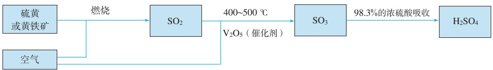

图5-4 工业制硫酸的原理示意图

硫酸在水里很容易电离出氢离子，具有酸性。浓硫酸还具有很强的吸水性和脱水性等特殊的性质。它能吸收存在于周围环境中的水分，也能将蔗糖、纸张、棉布和木材等有机物中的氢和氧按水的组成比脱去。 

图5-5 浓硫酸与蔗糖反应

浓硫酸还具有很强的氧化性，能氧化大多数金属单质和部分非金属单质。 

# 【实验5-3】

在带导管的橡胶塞侧面挖一个凹槽，并嵌入下端卷成螺旋状的铜丝。在试管中加入 $2 \mathrm{~mL}$ 浓硫酸，塞好橡胶塞，使铜丝与浓硫酸接触。加热，将产生的气体通入品红溶液，观察实验现象。向外拉铜丝，终止反应。冷却后，将试管里的物质慢慢倒入盛有少量水的另一支试管里，观察溶液的颜色。 

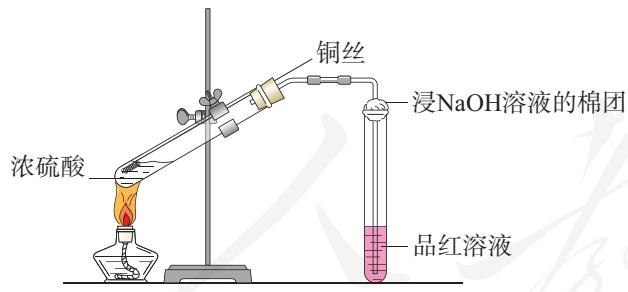

图5-6 浓硫酸与铜反应

在加热的条件下，浓硫酸与铜反应，生成硫酸铜、二氧化硫和水。 

$$
2 \mathrm {H} _ {2} \mathrm {S O} _ {4} (\text {浓}) + \mathrm {C u} \triangleq \mathrm {C u S O} _ {4} + \mathrm {S O} _ {2} \uparrow + 2 \mathrm {H} _ {2} \mathrm {O}
$$

在这个反应里，浓硫酸氧化了铜，自身被还原成二氧化硫。浓硫酸是氧化剂，铜是还原剂。 

# 注意

浓硫酸具有很强的腐蚀性，在实验中应注意安全防护！ 

在加热时，浓硫酸也能与木炭发生反应，生成二氧化碳、二氧化硫和水。 

$$
2 \mathrm {H} _ {2} \mathrm {S O} _ {4} (\text {浓}) + \mathrm {C} \xlongequal {\triangle} \mathrm {C O} _ {2} \uparrow + 2 \mathrm {S O} _ {2} \uparrow + 2 \mathrm {H} _ {2} \mathrm {O}
$$

# 思考与讨论

(1) 硫酸具有酸的哪些共同的性质? 请举例写出相关反应的离子方程式。 

(2) 实验室用金属与酸反应制取氢气时, 往往用稀硫酸, 而不用浓硫酸, 这是为什么? 

# 资料卡片

# 硫酸盐

硫酸钙 自然界中的硫酸钙常以石膏 $\left(\mathrm{CaSO}_{4} \cdot 2\mathrm{H}_{2}\mathrm{O}\right)$ 的形式存在。石膏被加热到 $150^{\circ} \mathrm{C}$ 时，会失去所含大部分结晶水而变成熟石膏 $\left(2\mathrm{CaSO}_{4} \cdot \mathrm{H}_{2}\mathrm{O}\right)$ 。熟石膏与水混合成糊状物后会很快凝固，重新变成石膏。利用这种性质，石膏可被用来制作各种模型和医疗用的石膏绷带。在工业上，石膏还被用来调节水泥的硬化速率。 

硫酸钡 自然界中的硫酸钡以重晶石 

$\left(\mathrm{BaSO}_{4}\right)$ 的形式存在。重晶石是生产其他钡盐的原料。硫酸钡不溶于水和酸，且不容易被X射线透过，因此在医疗上可被用作消化系统X射线检查的内服药剂，俗称“钡餐”。 

硫酸铜 硫酸铜（ $\mathrm{CuSO_4}$ ）是白色的粉末，结合水后会变成蓝色晶体，俗称胆矾（ $\mathrm{CuSO_4 \cdot 5H_2O}$ ）。硫酸铜的这一性质可以用来检验酒精中是否含少量水。胆矾可以和石灰乳混合制成一种常用的农药——波尔多液。 

# 三、硫酸根离子的检验

# 【实验5-4】
在三支试管中分别加入少量稀硫酸、 $\mathrm{Na}_{2} \mathrm{SO}_{4}$ 溶液和 $\mathrm{Na}_{2} \mathrm{CO}_{3}$ 溶液, 然后各滴入几滴 $\mathrm{BaCl}_{2}$ 溶液, 观察现象。再分别加入少量稀盐酸, 振荡, 观察现象。从这个实验中你能得出什么结论? 写出相关反应的离子方程式。 

在溶液中， $\mathrm{SO}_4^{2-}$ 可与 $\mathrm{Ba}^{2+}$ 反应，生成不溶于稀盐酸的白色 $\mathrm{BaSO}_4$ 沉淀。 

$$
\mathrm {B a} ^ {2 +} + \mathrm {S O} _ {4} ^ {2 -} = \mathrm {B a S O} _ {4} \downarrow
$$

# 注意

$\mathrm{BaCl}_2$ 、 $\mathrm{Ba(OH)}_2$ 等可溶性钡的化合物和 $\mathrm{BaCO}_3$ 有毒！使用时须做好个人防护，相关废弃物应进行无害化处理。 

溶液中的 $\mathrm{CO}_{3}^{2-}$ 也能与 $\mathrm{Ba}^{2+}$ 反应生成白色沉淀，但 $\mathrm{BaCO}_{3}$ 沉淀可以与稀盐酸反应，放出 $\mathrm{CO}_{2}$ 。因此在实验室里，通常将溶液先用稀盐酸酸化，以排除 $\mathrm{CO}_{3}^{2-}$ 等可能造成的干扰，然后加入 $\mathrm{BaCl}_{2}$ 溶液来检验 $\mathrm{SO}_{4}^{2-}$ 的存在。 

# 思考与讨论

(1) 经溶解、过滤和蒸发操作得到的粗盐中还含有一些可溶性硫酸盐及 $\mathrm{MgCl}_{2} 、 \mathrm{CaCl}_{2}$ 等杂质。如果按照下表所示顺序除去它们, 应加入什么试剂? 写出相关反应的离子方程式 (可以参考附录 II )。 

<table><tr><td>杂质</td><td>加入的试剂</td><td>离子方程式</td></tr><tr><td>硫酸盐</td><td></td><td></td></tr><tr><td>MgCl2</td><td></td><td></td></tr><tr><td>CaCl2</td><td></td><td></td></tr></table>

(2) 加入你选择的试剂除去杂质后, 有没有引入其他离子? 用什么方法可以除去这些离子? 

(3) 设计除去杂质的实验方案时, 除了要考虑所加试剂的种类, 还要考虑哪些问题? 

# 四、不同价态含硫物质的转化

# 资料卡片

# 自然界中硫的存在和转化

硫元素广泛存在于自然界中，是植物生长不可缺少的元素，组成生命体的蛋白质中就含有硫。游离态的硫存在于火山口附近或地壳的岩层中。在岩层深处和海底的无氧环境下，硫元素与铁、铜等金属元素形成的化合物通常以硫化物的形式存在，如黄铁矿（ $\mathrm{FeS}_2$ ）、黄铜矿（ $\mathrm{CuFeS}_2$ ）等。在地表附近，由于受氧气和水的长期作用，硫化物会转化为硫酸盐，如石膏（ $\mathrm{CaSO}_4 \cdot 2\mathrm{H}_2\mathrm{O}$ ）、芒硝（ $\mathrm{Na_2SO_4 \cdot 10H_2O}$ ）等。火山口附近的硫单质会被大气中的氧气氧化成二氧化 

硫，二氧化硫可被进一步氧化生成三氧化硫，二氧化硫和三氧化硫遇水分别形成亚硫酸和硫酸。 

图5-7 自然界中硫元素的存在示意图

从图5-7可以看出，自然界中的含硫物质在一定条件下能够相互转化。这种转化在人工条件下也能发生，硫酸的工业生产就是人类通过控制化学反应条件而实现的含硫物质的相互转化。那么，在实验室里如何实现不同价态含硫物质的相互转化呢？ 

# 探究

# 不同价态含硫物质的转化

（1）下图是人们总结的不同价态硫元素的转化关系，请尽可能多地列举每种价态的硫元素所对应的物质，并根据硫元素化合价的变化，分析各种物质在氧化还原反应中表现氧化性还是还原性。 

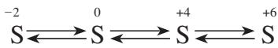

（2）从上述转化关系中选择你感兴趣的一种或几种，设计实验实现其转化，并填写下表。 

# 提示

常用的氧化剂有浓硫酸、 $\mathrm{Cl}_2$ 、 $\mathrm{KMnO}_4$ 等，还原剂有金属单质、 $\mathrm{H}_{2}$ 、 $\mathrm{Na}_2\mathrm{S}$ 等。 

<table><tr><td>转化目标(价态变化)</td><td>转化前的含硫物质</td><td>选择试剂(氧化剂或还原剂)</td><td>转化后的含硫物质</td><td>预期现象</td></tr><tr><td>-2→0</td><td></td><td></td><td></td><td></td></tr><tr><td>......</td><td></td><td></td><td></td><td></td></tr><tr><td></td><td></td><td></td><td></td><td></td></tr></table>

（3）综合考虑实验安全和环境保护，选择一种实验方案进行实验。实验过程中及时观察和记录实验现象，并对其进行分析，通过推理得出结论，就你的结论和发现的问题与同学交流。 

硫元素常见的化合价有-2、0、+4和+6，可以通过氧化还原反应实现不同价态含硫物质的相互转化。利用氧化剂，可将硫元素从低价态转化到高价态；利用还原剂，可将硫元素从高价态转化到低价态。 

# 方法导引

# 化学实验设计

化学实验设计是指实验者在实施化学实验之前，根据一定的实验目的，运用化学知识与技能，按照一定的实验方法，对实验的原理、试剂、仪器与装置、步骤和方法等所进行的规划。例如，设计“不同价态含硫物质的转化”实验，当确定了要实现的转化关系后，需要明确转化前后的含硫物质是哪些，通过怎样的反应（氧化/还原）实现转化，用到的氧化剂或还原剂是什么，等等。 

进行化学实验设计时，应遵循科学性、可行性、安全性和绿色化原则。化学实验设计一般以实验设计方案的形式呈现，通常包括实验课题、实验目的、实验原理、实验仪器与试剂、实验步骤及注意事项、实验数据及处理、实验结论与讨论等。 

# 化学与职业

# 化工工程师

化工工程师是解决人类在生产、生活等领域面临的化工相关问题的专业技术人才，工作在石油炼制、化肥生产、医药开发和环境治理等领域。其主要工作是依据科学原理，统筹各方面的资源，设计化工生产的工艺流程，并监控生产过程，及时解决生产中遇到的技术问题。 

化工工程师需要具有高度的社会责任感、团队精神、全局观念、风险管控意识和创新能力，并具备化学、化工、安全、经济、环境等方面的专业知识。 

图5-8 化工工程师通过观察仪表参数监控化工生产过程

1.下列物质中的硫元素不能表现出氧化性的是（ ）。 

A. $\mathrm{Na}_{2} \mathrm{~S}$ 

B. S 

C. $\mathrm{SO}_{2}$ 

D. $\mathrm{H}_{2} \mathrm{SO}_{4}$ 

2. 下列关于 $\mathrm{SO}_2$ 的叙述正确的是（ ）。 

A. $\mathrm{SO}_{2}$ 是无色、无臭、有毒的气体 

B. ${\mathrm{{SO}}}_{2}$ 与 $\mathrm{{NaOH}}$ 溶液反应生成 ${\mathrm{{Na}}}_{2}{\mathrm{{SO}}}_{4}$ 

C. $\mathrm{SO}_2$ 能使紫色的 $\mathrm{KMnO}_4$ 溶液褪色 

D. $\mathrm{SO}_{2}$ 有毒, 不能用作食品添加剂 

3.下列事实与括号中浓硫酸的性质对应关系正确的是（ ）。 

A. 空气中敞口久置的浓硫酸质量增大（挥发性） 

B. 浓硫酸在加热条件下与铜反应（脱水性） 

C. 用浓硫酸在纸上书写的字迹变黑（氧化性） 

D. 浓硫酸可用来干燥某些气体（吸水性） 

4. 在实验室中，几位同学围绕浓硫酸的化学性质进行了如下实验探究：将适量的蔗糖放入烧杯中，加入几滴水，搅拌均匀；然后再加入适量浓硫酸，迅速搅拌，观察到蔗糖逐渐变黑，体积膨胀，并产生有刺激性气味的气体。 

（1）生成的黑色物质是 （填化学式）。 

(2) 有刺激性气味的气体的主要成分是____（填化学式），写出产生该气体的反应的化学方程式：__________。 

（3）上述实验现象表明浓硫酸具有 （填字母）。 

a. 酸性 

b. 吸水性 

c. 脱水性 

d. 强氧化性 

5. 如何证明酸雨中含有硫酸？请简述相关的实验操作步骤。 

6. 现有两支分别盛有相同体积浓硫酸和稀硫酸的试管，请用简单的方法区别它们。 

7. 某工厂使用的煤中硫的质量分数为 $0.64\%$ ，该工厂每天燃烧这种煤 $100 \mathrm{t}$ ，试计算： 

(1) 如果煤中的硫全部转化为 $\mathrm{SO}_{2}$ , 该厂每天产生 $\mathrm{SO}_{2}$ 的质量及这些 $\mathrm{SO}_{2}$ 在标准状况下的体积; 

(2) 如果把产生的 $\mathrm{SO}_{2}$ 全部用来生产硫酸, 理论上每年 (按 365 天计) 可得到 $98\%$ 的浓硫酸的质量。 

8. 请分析下图，并上网查阅相关资料，简述硫在自然界的循环过程，思考人类活动对硫的循环有什么影响。 

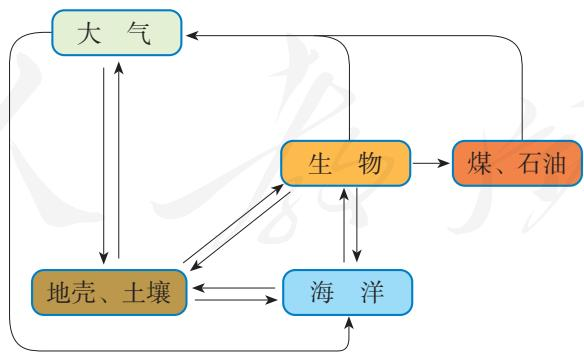

硫元素在自然界的循环

# 第二节

# 氮及其化合物

氮元素位于元素周期表的第二周期、第VA族。氮原子的最外电子层有5个电子，既不容易得到3个电子，也不容易失去5个电子。因此，氮原子一般通过共用电子对与其他原子相互结合构成物质。在自然界里，氮元素主要以氮分子的形式存在于空气中，部分氮元素存在于动植物体内的蛋白质中，还有部分氮元素存在于土壤、海洋里的硝酸盐和铵盐中。氮是自然界各种生物体生命活动不可缺少的重要元素，自然界是怎样通过氮的循环为生物体提供氮元素的呢？ 

# 一、氮气与氮的固定

由于氮分子内两个氮原子间以共价三键（ $\mathrm{N} \equiv \mathrm{N}$ ）结合，断开该化学键需要较多的能量，所以氮气的化学性质很稳定，通常情况下难以与其他物质发生化学反应，无法被大多数生物体直接吸收。但在高温、放电等条件下，氮分子获得了足够的能量，使 $\mathrm{N} \equiv \mathrm{N}$ 断裂，氮气能够与镁、氧气、氢气等物质发生化合反应，分别生成氮化镁、一氧化氮和氨气等。 

$$
\mathrm {N} _ {2} + 3 \mathrm {M g} \xlongequal {\text {点 燃}} \mathrm {M g} _ {3} \mathrm {N} _ {2}
$$

$$
\mathrm {N} _ {2} + \mathrm {O} _ {2} \xlongequal {\text {放 电 或 高 温}} 2 \mathrm {N O}
$$

$$
\mathrm {N} _ {2} + 3 \mathrm {H} _ {2} \xrightarrow [ \text {催 化 剂} ]{\text {高 温 、 高 压}} 2 \mathrm {N H} _ {3}
$$

将大气中游离态的氮转化为氮的化合物的过程叫做氮的固定。大自然通过闪电释放的能量将空气中的氮气转化为含氮的化合物，或者通过豆科植物的根瘤菌将氮气转化 

氮气 nitrogen 

固氮 nitrogenfixation 

# 数据

氮气 

熔点：-210℃ 

沸点：-196℃ 

密度： $1.25\mathrm{g / L}$ 

成氨，从而实现自然固氮。 

人类则通过控制条件，将氮气氧化或还原为氮的化合物，实现人工固氮。最重要的人工固氮途径就是工业合成氨，它不仅为农作物的生长提供了必需的氮元素，而且为其他化工产品（如炸药、农药、染料等）的生产提供了重要的原料。 

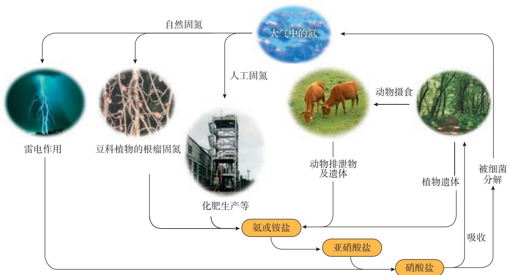

图5-9 自然界中氮的循环

# 科学史话

# 合成氨

由于氮气的化学性质很不活泼，以氮气和氢气为原料合成氨的工业化生产曾是一个较难的课题。1909年，德国化学家哈伯（F. Haber，1868—1934）经过反复实验研究后发现，在 $500\sim 600^{\circ}\mathrm{C}$ 、 $17.5\mathrm{MPa}\sim 20.0\mathrm{MPa}$ 和饿为催化剂的条件下，反应后氨的含量可超过 $6\%$ ，具备了工业化生产的可能性。为了把哈伯合成氨的实验室方法转化为规模化的工业生产，德国工程师博施（C. Bosch，1874—1940）作出了重要贡献。1913年，一 

个年产量7000t的合成氨工厂建成并投产，合成氨的工业化生产终于实现。从此，合成氨成为化学工业中迅速发展的重要领域。由于合成氨工业生产的实现和相关研究对化学理论与技术发展的推动，哈伯和博施都获得了诺贝尔化学奖。 

合成氨是人类科学技术发展史上的一项重大成就，在很大程度上解决了地球上因粮食不足而导致的饥饿问题，是化学和技术对社会发展与进步的巨大贡献。 

# 二、一氧化氮和二氧化氮

一氧化氮和二氧化氮是氮的两种重要氧化物。 

一氧化氮是无色的有毒气体，不溶于水，在常温下很容易与氧气化合，生成二氧化氮。 

$$
2 \mathrm {N O} + \mathrm {O} _ {2} = 2 \mathrm {N O} _ {2}
$$

二氧化氮是红棕色、有刺激性气味的有毒气体，密度比空气的大，易液化，易溶于水。二氧化氮溶于水时生成硝酸和一氧化氮，工业上利用这一原理生产硝酸。 

$$
3 N O _ {2} + H _ {2} O = 2 H N O _ {3} + N O
$$

# 【实验5-5】

如图5-10所示，在一支 $50 \mathrm{~mL}$ 的注射器里充入 $20 \mathrm{~mL} \mathrm{NO}$ ，然后吸入 $5 \mathrm{~mL}$ 水，用乳胶管和弹簧夹封住管口，振荡注射器，观察现象。打开弹簧夹，快速吸入 $10 \mathrm{~mL}$ 空气后夹上弹簧夹，观察现象。振荡注射器，再观察现象。 

图5-10 二氧化氮溶于水的实验

# 思考与讨论

实验5-5中发生了哪些化学反应？如果要将注射器中的NO充分转化，可以采取什么措施？上述实验对工业上生产硝酸有什么启示？ 

# 三、氨和铵盐

氨是无色、有刺激性气味的气体，密度比空气的小。氨很容易液化，液化时放热。液氨汽化时要吸收大量的热，使周围温度急剧降低。因此，液氨可用作制冷剂。 

# 【实验5-6】

如图5- 11所示，在干燥的圆底烧瓶里充满 $\mathrm{NH}_{3}$ ，用带有玻璃管和胶头滴管（预先吸入水）的橡胶塞塞紧瓶口。倒置烧瓶，使玻璃管插入盛有水的烧杯中（预先在水里滴入少量酚酞溶液）。打开弹簧夹，挤压胶头滴管，使水进入烧瓶。观察并描述现象，分析出现这些现象的可能原因。 

图5-11 氨溶于水的喷泉实验

氨是一种极易溶于水的气体，在常温常压下，1体积水大约可溶解700体积氨。氨溶于水时，会与水结合成一水合氨 $\left(\mathrm{NH}_{3} \cdot \mathrm{H}_{2} \mathrm{O}\right)$ ，一水合氨中有一小部分电离形成 $\mathrm{NH}_{4}^{+}$ 和 $\mathrm{OH}^{-}$ 。 

$$
\mathrm {N H} _ {3} + \mathrm {H} _ {2} \mathrm {O} \rightleftharpoons \mathrm {N H} _ {3} \cdot \mathrm {H} _ {2} \mathrm {O} \rightleftharpoons \mathrm {N H} _ {4} ^ {+} + \mathrm {O H} ^ {-}
$$

图5-12 氨与氯化氢反应

氨的水溶液（俗称氨水）显弱碱性，能使酚酞溶液变红或使红色石蕊试纸变蓝。 

氨可以与酸反应生成铵盐。如氨遇到氯化氢时，会迅速反应生成氯化铵晶体。 

$$
\mathrm {N H} _ {3} + \mathrm {H C l} = \mathrm {N H} _ {4} \mathrm {C l}
$$

氨中氮元素的化合价为-3价。氨具有还原性，在加热和有催化剂（如铂）的条件下，能被氧气氧化生成一氧化氮和水。氨的催化氧化是工业制硝酸的基础。 

$$
4 \mathrm {N H} _ {3} + 5 \mathrm {O} _ {2} \xlongequal [ \triangle ] {\text {催 化 剂}} 4 \mathrm {N O} + 6 \mathrm {H} _ {2} \mathrm {O}
$$

氨 ammonia 

硝酸 nitric acid 

铵盐是农业上常用的化肥，如硫酸铵、碳酸氢铵、硝酸铵等。绝大多数铵盐易溶于水，受热易分解，与碱反应会放出氨。 

$$
\begin{array}{l} \mathrm {N H} _ {4} \mathrm {C l} \triangleq \mathrm {N H} _ {3} \uparrow + \mathrm {H C l} \uparrow \\ \mathrm {N H} _ {4} \mathrm {H C O} _ {3} \triangleq \mathrm {N H} _ {3} \uparrow + \mathrm {H} _ {2} \mathrm {O} + \mathrm {C O} _ {2} \uparrow \\ 2 \mathrm {N H} _ {4} \mathrm {C l} + \mathrm {C a} (\mathrm {O H}) _ {2} \stackrel {\triangle} {=} \mathrm {C a C l} _ {2} + 2 \mathrm {H} _ {2} \mathrm {O} + 2 \mathrm {N H} _ {3} \uparrow \\ \end{array}
$$

# 【实验5-7】

向盛有少量 $\mathrm{NH}_{4} \mathrm{Cl}$ 溶液、 $\mathrm{NH}_{4} \mathrm{NO}_{3}$ 溶液和 $(\mathrm{NH}_{4})_{2} \mathrm{SO}_{4}$ 溶液的三支试管中分别加入 $\mathrm{NaOH}$ 溶液并加热（注意通风），用镊子夹住一片湿润的红色石蕊试纸放在试管口。观察现象，分析现象产生的原因，写出反应的离子方程式。 

在实验室中，常利用铵盐与强碱反应产生氨这一性质来检验铵根离子的存在和制取氨。 

$$
\mathrm {N H} _ {4} ^ {+} + \mathrm {O H} ^ {-} \stackrel {\triangle} {=} \mathrm {N H} _ {3} \uparrow + \mathrm {H} _ {2} \mathrm {O}
$$

# 思考与讨论

图5-13为实验室制取氨的简易装置示意图。请仔细观察实验装置，思考如何检验试管中已收集满氨，如何吸收处理实验中多余的氨。 

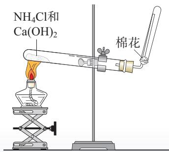

图5-13 实验室制取氨的简易装置示意图

# 四、硝酸

硝酸是无色、易挥发、有刺激性气味的液体。浓硝酸见光或者受热会分解产生二氧化氮，所以一般将其保存在棕色试剂瓶中，并放置在阴凉处。 

$$
4 H N O _ {3} \underset {\text {或 光 照}} {\overset {\triangle} {\rightleftharpoons}} 4 N O _ {2} \uparrow + O _ {2} \uparrow + 2 H _ {2} O
$$

硝酸具有很强的氧化性，硝酸的浓度不同，与金属反应的产物也不同。 

# 【实验5-8】

如图 5-14 所示，在橡胶塞侧面挖一个凹槽，并嵌入下端卷成螺旋状的铜丝。向两支具支试管中分别加入 $2 \mathrm{~mL}$ 浓硝酸和稀硝酸，用橡胶塞塞住试管口，使铜丝与硝酸接触，观察并比较实验现象。向上拉铜丝，终止反应。 

浓硝酸、稀硝酸与铜反应的化学方程式分别为： 

$$
4 \mathrm {H N O} _ {3} (\text {浓}) + \mathrm {C u} = \mathrm {C u} \left(\mathrm {N O} _ {3}\right) _ {2} + 2 \mathrm {N O} _ {2} \uparrow + 2 \mathrm {H} _ {2} \mathrm {O}
$$

$$
8 \mathrm {H N O} _ {3} (\text {稀}) + 3 \mathrm {C u} = 3 \mathrm {C u} \left(\mathrm {N O} _ {3}\right) _ {2} + 2 \mathrm {N O} \uparrow + 4 \mathrm {H} _ {2} \mathrm {O}
$$

值得注意的是，有些金属如铁、铝等虽然能与稀硝酸或稀硫酸反应，但在常温下却可以用铁或铝制容器来盛装浓硝酸或浓硫酸。这是因为常温下，铁、铝的表面被浓硝酸或浓硫酸氧化，生成了一层致密的氧化物薄膜，这层薄 

# 注意

硝酸具有腐蚀性和挥发性，使用时须注意防护和通风！ 

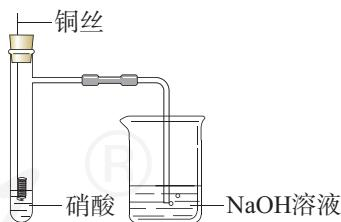

图5-14 硝酸与铜反应

# 资料卡片

# 王水

浓硝酸和浓盐酸的混合物（体积比为 $1:3$ ）叫做王水，能使一些不溶于硝酸的金属如金、铂等溶解。 

膜阻止了酸与内层金属的进一步反应。当加热时，铁、铝会与浓硝酸或浓硫酸发生反应。 

# 思考与讨论

硝酸是重要的化工原料，用于制化肥、农药、炸药、染料等。工业上制硝酸的原理是将氨经过一系列反应得到硝酸，如下图所示： 

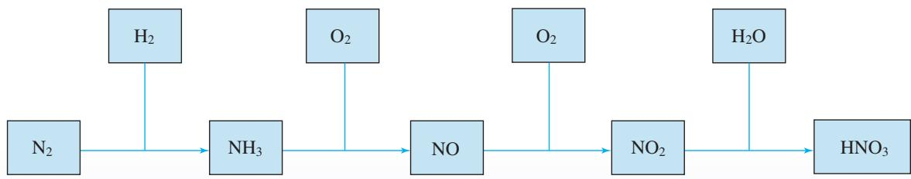

（1）写出每一步反应的化学方程式。 

(2) 请分析上述反应中的物质类别和氮元素化合价的变化情况, 以及每一步反应中含氮物质发生的是氧化反应还是还原反应。 

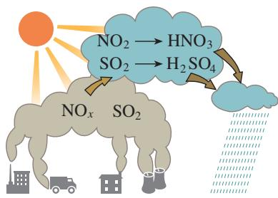

图5-15 酸雨的形成示意图

图5-16 酸雨会破坏森林

# 五、酸雨及防治

煤、石油和某些金属矿物中含有硫，在燃烧或冶炼时往往会生成二氧化硫。在机动车发动机中，燃料燃烧产生的高温条件会使空气中的氮气与氧气反应，生成氮氧化物。它们会引起呼吸道疾病，危害人体健康，严重时会使人死亡。 

二氧化硫、氮氧化物以及它们在大气中发生反应后的生成物溶于雨水会形成酸雨。正常雨水由于溶解了二氧化碳，其 $\mathrm{pH}$ 约为5.6，而酸雨的 $\mathrm{pH}$ 小于5.6。 

酸雨有很大的危害，能直接损伤农作物，破坏森林和草原，使土壤、湖泊酸化，还会加速建筑物、桥梁、工业设备、运输工具和电缆的腐蚀。 

二氧化硫和二氧化氮都是有用的化工原料，但当它们分散在大气中时，就成了难以处理的污染物。因此，工业废气排放到大气中之前，必须进行适当处理，防止有害物质污染大气，并充分利用原料。 

# 研究与实践

# 测定雨水的 $\mathrm{pH}$

# 【研究目的】

酸雨对环境危害巨大，人们已经采取多种措施来防治酸雨。通过以下活动了解测定雨水pH的方法，认识酸雨的危害，激发保护环境的紧迫感。 

# 【研究任务】

# （1）收集资料

以“酸雨”为关键词进行搜索，了解酸雨的形成原因、基本类型、相关危害及预防和治理措施。 

图5-17 用 $\mathrm{pH}$ 计测量水样的酸度

# (2) 测定雨水的 $\mathrm{pH}$

根据收集的资料，确定测定雨水pH的过程和方法并进行实践，对结果进行分析和讨论。可参考如下过程： 

①下雨时用容器直接收集一些雨水作为样品，静置，以蒸馏水或自来水作为参照，观察并比较它们的外观； 

(2)用 $\mathrm{pH}$ 试纸（或 $\mathrm{pH}$ 计）测量雨水和蒸馏水的酸度并记录； 

(3)有条件的话, 可连续取样并测定一段时间 (如一周) 内本地雨水、地表水或自来水的 $\mathrm{pH}$ , 将得到的数据列表或作图, 确定你所在地区本时间段内雨水等的平均酸度。 

# 【结果与讨论】

(1) 通过你测得的数据判断本次降雨是否为酸雨。若是酸雨, 请分析形成酸雨可能的原因, 并提出减轻酸雨危害的建议。 

(2) 本次实践活动及结果对你有什么启发? 请撰写研究报告, 并与同学讨论。 

1. 下列关于 $\mathrm{N}_{2}$ 的叙述错误的是（ ）。 

A. $\mathrm{N}_{2}$ 既可作氧化剂又可作还原剂 

B. 在雷雨天, 空气中的 $\mathrm{N}_{2}$ 与 $\mathrm{O}_{2}$ 可反应生成 $\mathrm{NO}$ 

C. 氮的固定是将 $\mathrm{N}_{2}$ 转化成含氮的化合物 

D. $1 \mathrm{~mol} \mathrm{~N}_{2}$ 可与 $3 \mathrm{~mol} \mathrm{H}_{2}$ 完全反应生成 $2 \mathrm{~mol} \mathrm{NH}_{3}$ 

2. 在 $\mathrm{NO}_2$ 与水的反应中，（ ）。 

A. 氮元素的化合价不发生变化 

B. $\mathrm{NO}_{2}$ 只是氧化剂 

C. $\mathrm{NO}_{2}$ 只是还原剂 

D. $\mathrm{NO}_{2}$ 既是氧化剂，又是还原剂 

3. 只用一种试剂,将 $\mathrm{NH}_{4} \mathrm{Cl}$ 、 $(\mathrm{NH}_{4})_{2} \mathrm{SO}_{4}$ 、 $\mathrm{Na}_{2} \mathrm{SO}_{4}$ 、 $\mathrm{NaCl} 4$ 种物质的溶液区分开, 这种试剂是 ( )。 

A. NaOH溶液 

B. $\mathrm{AgNO}_3$ 溶液 

C. $\mathrm{BaCl}_2$ 溶液 

D. $\mathrm{Ba(OH)}_2$ 溶液 

4.根据图5-11“氨溶于水的喷泉实验”装置图，以下说法不正确的是（ ）。 

A. 该实验证明氨气极易溶于水 

B. 烧瓶充满氯气, 胶头滴管和烧杯中加入浓碱液也可能形成喷泉 

C. 红色喷泉说明氨水显碱性 

D. 烧杯中换成其他液体无法形成喷泉 

5. 工业上可以废铜屑为原料制备硝酸铜，下列4种方法中，适宜采用的是哪一种？请从节约原料和环境保护的角度说明原因。 

① $\mathrm{Cu} + \mathrm{HNO}_3$ (浓) $\longrightarrow \mathrm{Cu(NO_3)_2}$ 

② $\mathrm{Cu} + \mathrm{HNO}_3$ （稀） $\longrightarrow \mathrm{Cu(NO_3)_2}$ 

③ $\mathrm{Cu} \xrightarrow[\triangle]{\text { 空气 }} \mathrm{CuO} \xrightarrow{\mathrm{HNO}_{3}} \mathrm{Cu}\left(\mathrm{NO}_{3}\right)_{2}$ 

浓硫酸 ④ $\mathrm{Cu}\xrightarrow[\triangle]{\text{浓硫酸}}\mathrm{CuSO}_4\xrightarrow[\mathrm{Ba}(\mathrm{NO}_3)_2]{\mathrm{Ba}(\mathrm{NO}_3)_2}\mathrm{Cu}(\mathrm{NO}_3)_2$ 

6. 利用图5-14所示装置进行铜与硝酸反应的实验 

(1) 硝酸一般盛放在棕色试剂瓶中, 请用化学方程式说明其原因: 

(2) 使用稀硝酸进行实验: 反应开始后, 铜丝逐渐变细, 有气泡产生, 溶液变蓝。 

$①$ 铜与稀硝酸反应的离子方程式为 

② 实验中观察到试管中的气体略有红棕色，其原因是 （用化学方程式表示）。 

(3) 使用浓硝酸进行实验: 反应剧烈进行, 铜丝逐渐变细, 溶液变绿, 试管上方出现红棕色气体。 

$①$ 铜与浓硝酸反应的化学方程式为 

(2) 某同学推测反应后溶液呈绿色的原因是 $\mathrm{NO}_{2}$ 在溶液中达到饱和, $\mathrm{NO}_{2}$ 的饱和溶液呈黄色,硝酸铜溶液呈蓝色, 两者混合后呈绿色。他取少量该绿色溶液, 向其中加入适量水后溶液变为蓝色, 可能的原因是 (用化学方程式表示)。 

7. 汽车尾气中含有CO、NO等多种污染物，已成为城市空气的主要污染源。汽车尾气中的NO是如何产生的？请推测可能的原因，并写出有关反应的化学方程式。 

8. 根据图5-9简单描述氮在自然界的循环过程，并思考和讨论以下问题。 

（1）氮在自然界中主要以哪些形式存在？ 

（2）人体蛋白质中的氮是从哪里来的？ 

（3）自然界中有哪些固定氮的途径？ 

（4）人类的哪些活动参与了氮的循环？ 

# 第三节

# 无机非金属材料

材料是人类赖以生存和发展的物质基础，人类使用的材料除了金属材料，还有无机非金属材料等。从组成上看，许多无机非金属材料含有硅、氧等元素，具有耐高温、抗腐蚀、硬度高等特点，以及特殊的光学、电学等性能。随着工业生产和社会发展对材料性能要求的提高，一批新型无机非金属材料相继诞生，成为航空、航天、信息和新能源等高技术领域必需的材料。 

# 一、硅酸盐材料

传统的无机非金属材料多为硅酸盐材料，在日常生活中随处可见，如制作餐具的陶瓷、窗户上的玻璃、建筑用的水泥等。 

# 资料卡片

# 硅酸盐的结构

在硅酸盐中，Si和O构成了硅氧四面体，其结构如图5-18所示。每个Si结合4个O，Si在中心，O在四面体的4个顶角；许多这样的四面体还可以通过顶角的O相互连接，每个O为两个四面体所共有，与2个Si相结合。硅氧四面体结构的特殊性，决定了硅酸盐材料大多具有硬度高、难溶于水、耐高温、耐腐蚀等特点。 

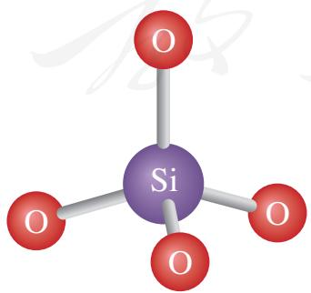

图5-18 硅氧四面体的结构示意图

无机非金属材料 

inorganic nonmetallic materials 

硅酸盐 silicate 

图5-19 我国古代烧制的精美瓷器

# 1. 陶瓷

陶瓷是以黏土（主要成分为含水的铝硅酸盐）为主要原料，经高温烧结而成的。我国具有悠久的陶瓷制造历史，在新石器时代，我们的祖先已能烧制陶器，至唐宋时期，我国的陶瓷制品已经享誉海内外。目前，陶瓷仍然在人类的生产和生活中扮演着重要的角色，得到了广泛应用，如用于生产建筑材料、绝缘材料、日用器皿、卫生洁具等。 

图5-20 高压输电线路使用了陶瓷绝缘材料

# 2.玻璃

普通玻璃的主要成分为 $\mathrm{Na}_2\mathrm{SiO}_3$ 、 $\mathrm{CaSiO}_3$ 和 $\mathrm{SiO}_2$ ，它是以纯碱、石灰石和石英砂（主要成分是 $\mathrm{SiO}_2$ ）为原料，经混合、粉碎，在玻璃窑中熔融，发生复杂的物理和化学变化而制得的。玻璃可用于生产建筑材料、光学仪器和各种器皿，还可制造玻璃纤维用于高强度复合材料等。 

# 资料卡片

生产中采用不同的原料和工艺，可以制得多种具有不同性能和用途的玻璃。例如，用含有铅的原料制造的光学玻璃，透光性好，折射率高，可以用来制造眼镜、照相机和光学仪器的透镜；加入硼酸盐制成耐化学腐蚀、耐温度急剧变化的玻璃，可用于实验室使用的玻璃仪器；加入一些金属氧化物或盐可以得到彩色玻璃，常用于建筑和装饰。 

图5-21 金属氧化物可以使玻璃呈现不同的颜色

# 3. 水泥

普通硅酸盐水泥的生产以黏土和石灰石为主要原料。二者与其他辅料经混合、研磨后在水泥回转窑中煅烧，发生复杂的物理和化学变化，加入适量石膏调节水泥硬化速率，再磨成细粉就能得到普通水泥。水泥、沙子和碎石等与水混合可以得到混凝土，大量用于建筑和水利工程。 

图5-22 长江三峡大坝使用了大量水泥

# 二、新型无机非金属材料

随着科学技术的发展，无机非金属材料突破了传统的硅酸盐体系，一系列新型无机非金属材料相继问世。其中有一些是高纯度的含硅元素的材料，如单晶硅、二氧化硅等，具有特殊的光学和电学性能，是现代信息技术的基础材料；还有一些含有碳、氮等其他元素，在航天、能源和医疗等领域有着广泛的应用。 

# 1. 硅和二氧化硅

现代信息技术是建立在半导体材料基础上的。位于元素周期表第三周期、第IVA族的硅元素，正好处于金属与非金属的过渡位置，其单质的导电性介于导体与绝缘体之间，是应用最为广泛的半导体材料。 

硅在自然界主要以硅酸盐（如地壳中的大多数矿物）和氧化物（如水晶、玛瑙）的形式存在。晶体硅中的杂质会影响其导电性能，因此必须制备高纯度的硅。工业上用焦炭还原石英砂可以制得含有少量杂质的粗硅。将粗硅通过化学方法进一步提纯，才能得到高纯硅。 

$$
\mathrm {S i O} _ {2} + 2 \mathrm {C} \stackrel {\text {高 温}} {=} \mathrm {S i} + 2 \mathrm {C O} \uparrow
$$

硅 silicon 

二氧化硅 silicon dioxide 

# 高纯硅的制备

工业上制备高纯硅，一般需要先制得纯度为 $98\%$ 左右的粗硅，再以其为原料制备高纯硅。例如，可以将粗硅转化为三氯硅烷（ $\mathrm{SiHCl}_3$ ），再经氢气还原得到高纯硅。 

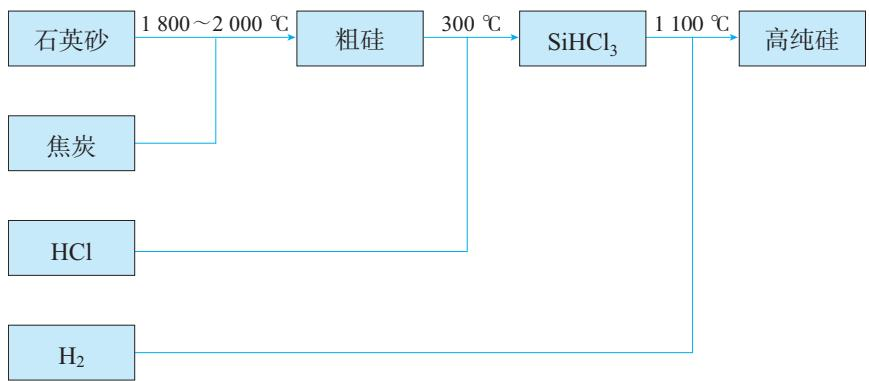

图5-23 工业制备高纯硅的原理示意图

其中涉及的主要化学反应为： 

图5-24 硅晶片是生产芯片的基础材料

$$
\mathrm {S i O} _ {2} + 2 \mathrm {C} \xrightarrow {1 8 0 0 \sim 2 0 0 0 ^ {\circ} \mathrm {C}} \mathrm {S i} + 2 \mathrm {C O} \uparrow
$$

$$
\mathrm {S i} + 3 \mathrm {H C l} \stackrel {3 0 0 ^ {\circ} \mathrm {C}} {=} \mathrm {S i H C l} _ {3} + \mathrm {H} _ {2}
$$

$$
\mathrm {S i H C l} _ {3} + \mathrm {H} _ {2} \stackrel {1 1 0 0 ^ {\circ} \mathrm {C}} {=} \mathrm {S i} + 3 \mathrm {H C l}
$$

高纯硅广泛应用于信息技术和新能源技术等领域。利用其半导体性能可以制成计算机、通信设备和家用电器等的芯片，以及光伏电站、人造卫星和电动汽车等的硅太阳能电池。 

二氧化硅可用来生产光导纤维。光导纤维的通信容量大，抗干扰性能好，传输的信号不易衰减，能有效提高通信效率。 

图5-25 硅太阳能电池

图5-26 光导纤维

# 2.新型陶瓷

新型陶瓷在组成上不再限于传统的硅酸盐体系，在光学、热学、电学、磁学等方面具有很多新的特性和功能，进一步拓展了陶瓷的应用领域。例如，碳化硅（SiC）俗称金刚砂，其中的碳原子和硅原子通过共价键连接，具有类似金刚石的结构，硬度很大，可用作砂纸和砂轮的磨料。碳化硅还具有优异的高温抗氧化性能，使用温度可达 $1600^{\circ}\mathrm{C}$ ，大大超过了普通金属材料所能承受的温度，可用作耐高温结构材料、耐高温半导体材料等。 

图5-27 耐高温的碳化硅陶瓷轴承

# 科学·技术·社会

# 新型陶瓷

随着人们对材料性能要求的不断提高，具有特殊功能的陶瓷材料迅速发展，一系列如高温结构陶瓷、压电陶瓷、透明陶瓷和超导陶瓷等新型陶瓷相继问世。这些新型陶瓷与传统陶瓷相比，在成分上有了很大变化。 

- 高温结构陶瓷一般用碳化硅、氮化硅或某些金属氧化物等在高温下烧结而成，具有耐高温、抗氧化、耐磨蚀等优良性能。与金属材料相比，更能适应严酷的环境，可用于火箭发动机、汽车发动机和高温电极材料等。 

- 压电陶瓷主要有钛酸盐和锆酸盐等，能实现机械能与电能的相互转化。可用于滤波器、扬声器、超声波探伤器和点火器等。 

- 透明陶瓷主要有氧化铝、氧化钇等氧 

化物透明陶瓷和氮化铝、氟化钙等非氧化物透明陶瓷，具有优异的光学性能，耐高温，绝缘性好。可用于高压钠灯、激光器和高温探测窗等。 

- 超导陶瓷在某一临界温度下电阻为零，具有超导性，可用于电力、交通、医疗等领域。 

图5-28 超导陶瓷可应用于磁悬浮技术

# 3. 碳纳米材料

碳纳米材料是近年来人们十分关注的一类新型无机非金属材料，主要包括富勒烯、碳纳米管、石墨烯等，在能源、信息、医药等领域有着广阔的应用前景。 

富勒烯是由碳原子构成的一系列笼形分子的总称，其中的 $\mathrm{C}_{60}$ 是富勒烯的代表物。 $\mathrm{C}_{60}$ 的发现为纳米科学提供了重要的研究对象，开启了碳纳米材料研究和应用的新时代。 

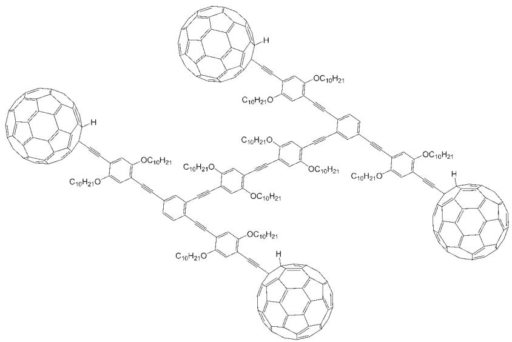

图5-29 用 $\mathrm{C}_{60}$ 作车轮的“纳米汽车”

图5-30 电子显微镜下放大30万倍的碳纳米管

碳纳米管可以看成是由石墨片层卷成的管状物，具有纳米尺度的直径。碳纳米管的比表面积大，有相当高的强度和优良的电学性能，可用于生产复合材料、电池和传感器等。 

石墨烯是只有一个碳原子直径厚度的单层石墨，其独特的结构使其电阻率低、热导率高，具有很高的强度。作为一种具有优异性能的新型材料，石墨烯在光电器件、超级电容器、电池和复合材料等方面的应用研究正在不断深入。 

动力电池

超轻海绵

图5-31 使用了石墨烯材料的动力电池和超轻海绵

1. 下列叙述错误的是（ ）。 

A. 硅在自然界中主要以单质形式存在 

B. 硅是应用最广泛的半导体材料 

C. 高纯度的硅可用于制造计算机芯片 

D. 二氧化硅可用于生产玻璃 

2. 下列物品或设施： 

①陶瓷餐具 ②砖瓦 ③混凝土桥墩 ④门窗玻璃 ⑤水晶镜片 

$⑥$ 石英钟 $⑦$ 水晶项链 $⑧$ 硅太阳能电池 $⑨$ 石英光导纤维 $⑩$ 计算机芯片 

(1) 含有硅单质的是__________（填序号，下同）。 

(2) 含有二氧化硅的是 

（3）含有硅酸盐的是 

3. 氢氟酸是HF的水溶液，可与 $\mathrm{SiO}_2$ 发生反应生成 $\mathrm{SiF}_4$ 和 $\mathrm{H}_2\mathrm{O}$ 。请写出该反应的化学方程式。想一想为什么可以用氢氟酸溶蚀玻璃生产磨砂玻璃。 

4. $\mathrm{SiO}_{2}$ 是一种酸性氧化物, 能与强碱溶液反应。例如, $\mathrm{SiO}_{2}$ 与 $\mathrm{NaOH}$ 反应可生成 $\mathrm{Na}_{2} \mathrm{SiO}_{3}$ 。 $\mathrm{Na}_{2} \mathrm{SiO}_{3}$ 的水溶液俗称水玻璃, 具有黏结力强、耐高温等特性, 可以用作黏合剂和防火剂。实验室盛放碱溶液的试剂瓶应使用橡胶塞, 而不用玻璃塞。请解释原因, 并写出相关反应的化学方程式。 

5. 氮化硅是一种性能优异的无机非金属材料，它的熔点高，硬度大，电绝缘性好，化学性质稳定，但生产成本较高。 

（1）根据以上描述，推测氮化硅可能有哪些用途： （填字母）。 

a. 制作坩埚 

b. 用作建筑陶瓷 

c. 制作耐高温轴承 

d. 制作切削刀具 

(2) 请画出氮和硅的原子结构示意图, 并根据元素周期律的知识, 写出氮化硅的化学式。 

(3) 氮化硅在 19 世纪已经被化学家合成出来, 但直到 100 多年后才逐渐应用于工业领域。材料的基础研究和实际应用之间存在着一定距离, 你认为二者之间的关系是怎样的? 请查阅相关资料,与同学交流你的观点。 

# 一、物质的性质及转化

# 1. 认识物质结构与性质的关系

运用元素的原子结构知识，可以预测和解释物质的性质。请以硫和氮为例进行说明。 

# 2. 从物质类别的视角认识物质间的转化关系

研究非金属及其化合物，可以按照物质的类别认识各类物质及其转化关系。请以硫为例进行说明。 

# 3. 从元素价态的视角认识物质间的转化关系

把一种原料转化成多种产品，路径之一是通过氧化还原反应改变主要元素的化合价，从而实现物质转化。请以含氮物质的相互转化为例，说明如何实现下列转化关系。 

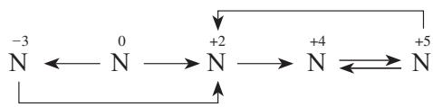

# 4. 辨识化学物质

通过对构成物质的阴、阳离子的检验，可以辨识化学物质。例如，在实验室可通过检验 $\mathrm{SO}_4^{2-}$ 或 $\mathrm{NH}_4^+$ 来辨识硫酸盐或铵盐。请你说明具体的检验方法。你还了解更多的辨识物质的方法吗？ 

# 5. 基于性质认识实验室制取物质的方法

以氨的实验室制取为例，谈谈在实验室里通过化学方法制取某种物质，通常需要考虑哪些问题。 

# 二、无机非金属材料

无机非金属材料主要是通过化学方法从自然界的物质获得的，具有优良的性能与广泛的用途。请谈谈你对无机非金属材料的认识，以及化学科学对于新材料研发的重要作用。 

# 复习与提高

1. 能实现下列物质间直接转化的元素是 (   )。 

$\mathrm{O_2}$ 单质 $\rightarrow$ 氧化物 $\rightarrow$ 酸（或碱） $\rightarrow$ 盐 

A. Si 

B. S 

C. Cu 

D. Fe 

2. 下列气体中，既可用浓硫酸干燥，又可用NaOH固体干燥的是（ ）。 

A. $\mathrm{Cl}_2$ 

B. ${\mathrm{O}}_{2}$ 

C. $\mathrm{SO}_{2}$ 

D. $\mathrm{NH}_{3}$ 

3. 在氮的单质和常见的含氮化合物中： 

(1) 常用作保护气（如填充灯泡、焊接保护等）的物质是 , 原因是 

(2) 常用作制冷剂的物质是 , 原因是 

(3) 能与酸反应生成盐, 在常温下为气态的物质是 ; 它与盐酸等强酸反应的离子方程式是 

(4) 在通常状况下是晶体, 易溶于水, 可用作氮肥, 遇碱会放出有刺激性气味气体的一类物质是 ; 它们与 $\mathrm{NaOH}$ 等强碱的溶液在加热条件下反应的离子方程式是 

4. 非金属单质A经下图所示的过程可转化为含氧酸D，已知D为强酸。请回答下列问题。 

$\mathrm{A}\xrightarrow{\mathrm{O}_2}\mathrm{B}\xrightarrow{\mathrm{O}_2}\mathrm{C}\xrightarrow{\mathrm{H}_2\mathrm{O}}\mathrm{D}$ 

(1) 若 A 在常温下为固体, B 是能使品红溶液褪色的有刺激性气味的无色气体。 

(1) D的化学式是 

(2)在工业生产中, B气体大量排放, 被雨水吸收后形成的______会污染环境。 

（2）若A在常温下为气体，C是红棕色的气体。 

(1) A、C 的化学式分别是 _______ 、 _______ 。 

(2) D的浓溶液在常温下可与铜反应并生成C气体, 该反应的化学方程式为________;该反应________（填“属于”或“不属于”）氧化还原反应。 

5. 浓硫酸与木炭在加热条件下可发生化学反应, 为检验反应的产物, 某同学设计了如下图所示的实验。请据此回答下列问题。 

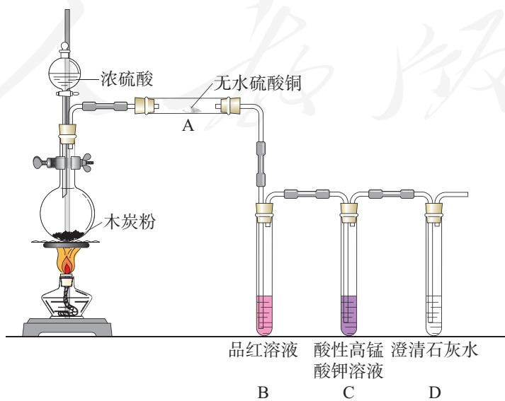

(1) A中的实验现象是 , 证明产物中有 

(2) B中的实验现象是 , 证明产物中有 

（3）装置C和D的作用是什么？ 

6. 在右图所示的物质转化关系中, A是常见的气态氢化物, B是能使带火星的木条复燃的无色、无臭气体, E的相对分子质量比D的大17, G是一种紫红色金属单质（反应条件和部分生成物未列出）。 

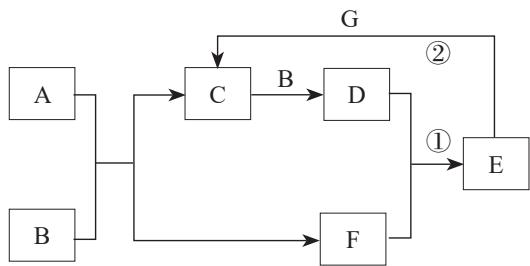

(1) A 的电子式为 , B 的化学式为 

（2）请写出反应①的化学方程式和反应②的离子方程式。 

7. 氮化硅 $\left(\mathrm{Si}_{3} \mathrm{~N}_{4}\right)$ 可由石英与焦炭在高温的氮气流中通过以下反应制备： 

$$
3 \mathrm {S i O} _ {2} + 6 \mathrm {C} + 2 \mathrm {N} _ {2} \stackrel {\text {高 温}} {=} \mathrm {S i} _ {3} \mathrm {N} _ {4} + 6 \mathrm {C O}
$$

(1) 请写出氮化硅中氮元素的化合价, 以及以上反应中的氧化剂和还原剂。 

(2) 若该反应生成 $11.2 \mathrm{~L}$ 一氧化碳（标准状况），则生成氮化硅的质量是多少？ 

8. 请用实验方法证明某无色晶体是 $\mathrm{(NH_4)_2SO_4}$ 

9. 氨既是一种重要的化工产品，又是一种重要的化工原料。下图为合成氨以及氨氧化制硝酸的流程示意图。 

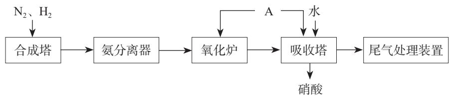

（1）写出合成塔和氧化炉中发生反应的化学方程式，并指出其中的氧化剂和还原剂。 

（2）请思考A是什么物质，以及向吸收塔中通入A的作用。 

（3）工业生产中为了盛装大量浓硝酸，可选择 作为罐体材料。 

a. 铜 

b.铂 

c. 铝 

d. 镁 

(4) 为避免硝酸生产尾气中的氮氧化物污染环境, 人们开发了溶液吸收、催化还原等尾气处理方法。前者使用具有碱性的 $\mathrm{Na}_{2} \mathrm{CO}_{3}$ 溶液等吸收尾气, 后者使用 $\mathrm{NH}_{3}$ 或其他物质将氮氧化物还原为 $\mathrm{N}_{2}$ 。请以尾气中的 $\mathrm{NO}_{2}$ 处理为例, 写出相关反应的化学方程式, 并查阅资料, 了解还有哪些尾气处理方法。 

10. 为测定空气中 $\mathrm{SO}_2$ 的含量, 某课外小组的同学将空气样品经过管道通入密闭容器中的 $200 \mathrm{~mL} 0.100 \mathrm{~mol} / \mathrm{L}$ 的酸性 $\mathrm{KMnO}_4$ 溶液。已知 $\mathrm{SO}_2$ 与该溶液反应的离子方程式为: 

$$
5 \mathrm {S O} _ {2} + 2 \mathrm {M n O} _ {4} ^ {-} + 2 \mathrm {H} _ {2} \mathrm {O} = 5 \mathrm {S O} _ {4} ^ {2 -} + 2 \mathrm {M n} ^ {2 +} + 4 \mathrm {H} ^ {+}
$$

若管道中空气流量为 $a \mathrm{~L} / \mathrm{min}$ , 经过 $b \mathrm{~min}$ 溶液恰好褪色, 假定样品中的 $\mathrm{SO}_{2}$ 可被溶液充分吸收, 则该空气样品中 $\mathrm{SO}_{2}$ 的含量 (单位为 $\mathrm{g} / \mathrm{L}$ ) 是多少? 

# 实验活动4

# 用化学沉淀法去除粗盐中的杂质离子

# 【实验目的】

1. 用化学沉淀法去除粗盐中的 $\mathrm{Ca}^{2+}$ 、 $\mathrm{Mg}^{2+}$ 和 $\mathrm{SO}_4^{2-}$ 。 

2. 熟练掌握溶解、过滤、蒸发等操作，认识化学方法在物质分离和提纯中的重要作用。 

# 【实验用品】

天平、药匙、量筒、烧杯、玻璃棒、胶头滴管、漏斗、滤纸、蒸发皿、坩埚钳、铁架台（带铁圈）、陶土网①、酒精灯、火柴。 

粗盐、蒸馏水、 $0.1\mathrm{mol/LBaCl}_2$ 溶液、 $20\%$ NaOH溶液、饱和 $\mathrm{Na}_2\mathrm{CO}_3$ 溶液、 $6\mathrm{mol/L}$ 盐酸、 $\mathrm{pH}$ 试纸。 

# 【实验步骤】

1. 用天平称取 $5.0 \mathrm{~g}$ 粗盐，放入 $100 \mathrm{~mL}$ 烧杯中，然后加入 $20 \mathrm{~mL}$ 蒸馏水，用玻璃棒搅拌，使粗盐全部溶解，得到粗盐水。 

2. 向粗盐水中滴加过量的 $\mathrm{BaCl}_2$ 溶液（约 $2\sim 3\mathrm{mL}$ ），使 $\mathrm{SO}_4^{2-}$ 与 $\mathrm{Ba}^{2+}$ 完全反应生成 $\mathrm{BaSO}_4$ 沉淀，将烧杯静置。 

3. 静置后, 沿烧杯壁向上层清液中继续滴加 $2 \sim 3$ 滴 $\mathrm{BaCl}_{2}$ 溶液。若溶液不出现浑浊, 则表明 $\mathrm{SO}_{4}^{2-}$ 已沉淀完全; 若出现浑浊, 则应继续滴加 $\mathrm{BaCl}_{2}$ 溶液, 直至 $\mathrm{SO}_{4}^{2-}$ 沉淀完全。 

4. 向粗盐水中滴加过量的 $\mathrm{NaOH}$ 溶液（约 $0.25 \mathrm{~mL}$ ），使 $\mathrm{Mg}^{2+}$ 与 $\mathrm{OH}^{-}$ 完全反应生成 $\mathrm{Mg(OH)}_{2}$ 沉淀；然后滴加过量的饱和 $\mathrm{Na}_{2} \mathrm{CO}_{3}$ 溶液（ $2 \sim 3 \mathrm{~mL}$ ），使 $\mathrm{Ca}^{2+}$ 、 $\mathrm{Ba}^{2+}$ （请思考： $\mathrm{Ba}^{2+}$ 是从哪里来的？）与 $\mathrm{CO}_{3}^{2-}$ 完全反应生成沉淀。 

5. 用与第3步类似的方法分别检验 $\mathrm{Mg}^{2+}$ 、 $\mathrm{Ca}^{2+}$ 和 $\mathrm{Ba}^{2+}$ 是否沉淀完全。 

6. 将烧杯静置，然后过滤，除去生成的沉淀和不溶性杂质。 

7. 向所得滤液中滴加盐酸, 用玻璃棒搅拌, 直到没有气泡冒出, 并用 $\mathrm{pH}$ 试纸检验,使滤液呈中性或微酸性。 

8. 将滤液倒入蒸发皿中，用酒精灯加热，同时用玻璃棒不断搅拌。当蒸发皿中出现较多固体时，停止加热，利用蒸发皿的余热使滤液蒸干。 

9. 用坩埚钳将蒸发皿夹持到陶土网上冷却，得到去除了杂质离子的精盐。 

# 【问题和讨论】

1. 本实验中加入试剂的顺序是什么？按照其他顺序加入试剂能否达到同样的目的？ 

2. 为什么每次所加的试剂都要略微过量？第7步加入盐酸的目的是什么？ 

3. 第6步和第7步的操作顺序能否颠倒？为什么？ 

# 实验活动5

# 不同价态含硫物质的转化

# 【实验目的】

1. 通过实验加深对硫及其化合物性质的认识。 

2. 应用氧化还原反应原理实现不同价态含硫物质的转化。 

# 【实验用品】

试管、天平、量筒、酒精灯、铁架台、试管架、橡胶塞、乳胶管、胶头滴管、玻璃导管、陶土网、玻璃棒、药匙、棉花、镊子、火柴。 

浓硫酸、铜片、硫粉、铁粉、 $\mathrm{Na}_2\mathrm{S}$ 溶液、酸性 $\mathrm{KMnO}_4$ 溶液、 $\mathrm{NaOH}$ 溶液、 $\mathrm{H}_2\mathrm{SO}_3$ 溶液、品红溶液。 

# 注意

实验中可能产生少量有毒、有刺激性气味的气体。因此要注意通风，控制试剂的用量，严格按照要求进行操作，避免污染空气，保证实验安全。 

# 【实验步骤】

1. 在两支试管中分别加入 $1 \mathrm{~mL} \mathrm{Na}_{2} \mathrm{~S}$ 溶液, 向其中一支边振荡边滴加 $\mathrm{H}_{2} \mathrm{SO}_{3}$ 溶液, 另一支边振荡边滴加酸性 $\mathrm{KMnO}_{4}$ 溶液, 用浸 NaOH 溶液的棉团分别塞住两个试管口, 观察并记录实验现象。 

2. 如下图所示连接仪器装置，向试管中加入 $1 \mathrm{~mL}$ 浓硫酸和一小块铜片，塞上带导管的单孔橡胶塞，加热，观察并记录实验现象。 

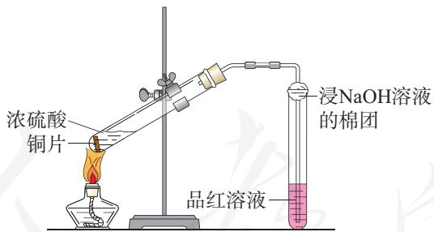

3. 将 $0.5 \mathrm{~g}$ 硫粉和 $1.0 \mathrm{~g}$ 铁粉均匀混合, 放在陶土网上堆成条状。用灼热的玻璃棒触及混合粉末的一端, 当混合物呈红热状态时, 移开玻璃棒, 观察并记录实验现象。 

# 【问题和讨论】

1. 在上述实验中，含硫物质中硫元素的价态发生了怎样的变化？ 

2. 铁粉与硫粉在空气中混合燃烧时，可能发生哪些化学反应？ 

3. 在实验过程中你遇到了哪些问题？你是如何解决的？ 

# 第六章

# 化学反应与能量

化学反应与能量变化 

化学反应的速率与限度 

现代社会的一切活动都离不开能量，化学反应在发生物质变化的同时伴随有能量变化，是人类获取能量的重要途径。 

为了更好地利用化学反应中的物质和能量变化，在化学研究和工业生产中还需要关注化学反应的快慢和程度。能量、速率与限度是认识和研究化学反应的重要视角。 

# 第一节

# 化学反应与能量变化

现代社会中，人类的一切活动（从衣食住行到文化娱乐，从社会生产到科学研究等）都离不开能量，而许多能量的利用与化学反应中的能量变化密切相关。从煤、石油和天然气等提供的热能，到各种化学电池提供的电能，都是通过化学反应获得的。 

# 一、化学反应与热能

热能 thermal energy 

化石燃料燃烧会释放大量的热。除了燃烧，其他化学反应也伴随着放热或吸热现象。 

# 【实验6-1】

在一支试管中加入 $2 \mathrm{~mL} 2 \mathrm{~mol} / \mathrm{L}$ 盐酸，并用温度计测量其温度。再向试管中放入用砂纸打磨光亮的镁条，观察现象，并测量溶液温度的变化。 

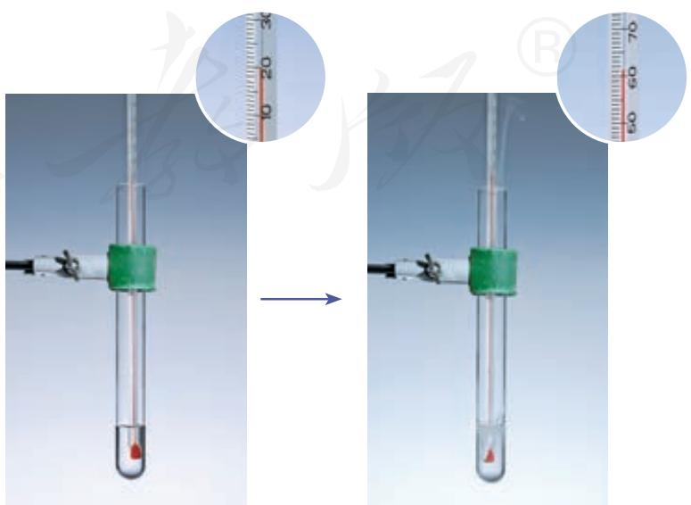

图6-1 盐酸与镁反应前后溶液的温度变化

# 【实验6-2】

将 $20 \mathrm{~g} \mathrm{Ba}(\mathrm{OH})_{2} \cdot 8 \mathrm{H}_{2} \mathrm{O}$ 晶体研细后与 $10 \mathrm{~g} \mathrm{NH}_{4} \mathrm{Cl}$ 晶体一起放入烧杯中，并将烧杯放在滴有几滴水的木片上。用玻璃棒快速搅拌，闻到气味后迅速用玻璃片盖上烧杯，用手触摸杯壁下部，试着用手拿起烧杯。观察现象。 

上述两个实验中，反应前后的温度变化说明反应过程中伴有热量的释放或吸收。化学上把释放热量的化学反应称为放热反应，如镁条、铝片与盐酸的反应，木炭、氢气、甲烷等在氧气中的燃烧，氢气与氯气的化合等都是放热反应；把吸收热量的化学反应称为吸热反应，如氢氧化钡与氯化铵的反应，盐酸与碳酸氢钠的反应，灼热的炭与二氧化碳的反应等都是吸热反应。 

化学反应过程中为什么会有能量变化？为什么有的化学反应释放热量，有的化学反应吸收热量？ 

我们知道，物质中的原子之间是通过化学键相结合的，当化学反应发生时，反应物的化学键断裂要吸收能量，而生成物的化学键形成要放出能量。以氢气与氯气化合生成氯化氢的反应为例： 

$$
\mathrm {H} _ {2} (\mathrm {g}) + \mathrm {C l} _ {2} (\mathrm {g}) = 2 \mathrm {H C l} (\mathrm {g})
$$

在 $25\mathrm{C}$ 和 $101\mathrm{kPa}$ 条件下，断开 $1\mathrm{molH_2}$ 中的化学键要吸收 $436\mathrm{kJ}$ 的能量，断开 $1\mathrm{molCl_2}$ 中的化学键要吸收 $243\mathrm{kJ}$ 的能量，反应中 $1\mathrm{molH_2}$ 和 $1\mathrm{molCl_2}$ 中的化学键断裂所需能量共为 $679\mathrm{kJ}$ ；而形成 $2\mathrm{molHCl}$ 中的化学键要释放 $862\mathrm{kJ}$ 的能量。化学键的断裂与形成是化学反应中能量变化的主要原因，化学反应中的物质变化总会伴随着能量变化，通常主要表现为热量的释放或吸收。一般情况下，如果一个化学反应过程中放出的能量多于吸收的能量，则有能量向环境释放，发生放热反应；反之，放出的能量少于吸收的能量，则需从环境吸收能量，发生吸热反应。在 $\mathrm{H}_2$ 与 $\mathrm{Cl}_2$ 的反应过程中，释放的能量大于吸收的能量，发生了放热反应。 

各种物质都具有能量，物质的组成、结构与状态不同， 

图6-2 化学反应吸热使烧杯与木片间的水凝结成冰

放热反应 

exothermic reaction 

吸热反应 

endothermic reaction 

化学能 chemical energy 

所具有的能量也不同。放热反应可以看成是反应物所具有的化学能转化为热能释放出来，吸热反应可以看成是热能转化为化学能被生成物所“储存”。因此，一个化学反应是释放热量还是吸收热量，与反应物总能量和生成物总能量的相对大小有关。如图6-3所示，如果反应物的总能量高于生成物的总能量，发生反应时会向环境释放能量；如果反应物的总能量低于生成物的总能量，发生反应时需要从环境吸收能量。 

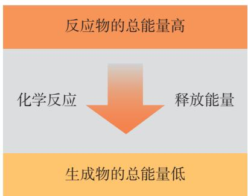

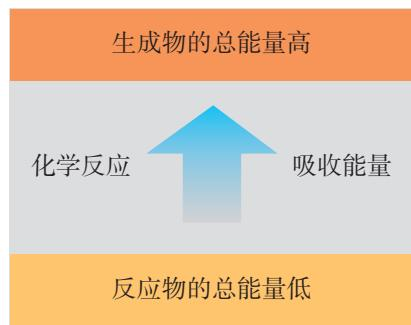

图6-3 化学反应与能量变化的关系示意图

人类利用化学反应中的热能始于火的发现。从早期的以树枝杂草为主要能源，到现代以煤、石油和天然气为主要能源，人类获取热能的主要途径都是通过物质的燃烧。随着社会的进步和人类生活水平的提高，能源的消耗越来越多（如图6-4）。而化石燃料作为人类利用最多的常规能源，其利用过程中面临两方面亟待解决的问题：一是其短期内不可再生，储量有限，随着能源消费需求的不断增加，能源消费量与储量之间的矛盾日益突显；二是煤和石油产品燃烧排放的粉尘、 $\mathrm{SO}_2$ 、 $\mathrm{NO}_x$ 、CO等是大气污染物的主 

图6-4 不同社会发展水平时期的人均耗能量

要来源。为了改善人类的生存环境，促进社会可持续发展，节能和寻找清洁的新能源成为人类的必然选择。 

# 资料卡片

表 6-1 2015年我国能源消费总量和构成

<table><tr><td rowspan="3">消费量 (折合成标准煤) 万吨</td><td rowspan="2">消费总量</td><td colspan="4">分类消费总量</td></tr><tr><td>煤炭</td><td>石油</td><td>天然气</td><td>水电、风电、核电</td></tr><tr><td>429 905</td><td>273 849</td><td>78 673</td><td>25 364</td><td>52 019</td></tr><tr><td>占比/%</td><td>100</td><td>64</td><td>18</td><td>6</td><td>12</td></tr></table>

节能不是简单地减少能源的使用，更重要的是要充分有效地利用能源。例如，在燃料利用过程中，节能的主要环节一个是燃料燃烧阶段，可通过改进锅炉的炉型和燃料空气比、清理积灰等方法提高燃料的燃烧效率；另一个环节是能量利用阶段，可通过使用节能灯，改进电动机的材料和结构，以及发电厂、钢铁厂余热与城市供热联产等措施促进能源循环利用，有效提高能源利用率。 

理想的新能源应具有资源丰富、可以再生、对环境无污染等特点。目前，人们比较关注的新能源有太阳能、风能、地热能、海洋能和氢能等。 

# 思考与讨论

煤、汽油和柴油等作为燃料大量使用会造成空气污染，但不使用它们又会严重影响现代社会的生产和生活。对此，请从社会不同人群的角度，提出你的想法或建议，并与同学讨论。 

# 信息搜索

（1）利用互联网（如国家统计局网站）搜索近10年我国每年的能源消费总量和能源矿产储量的数据及变化趋势，体会节能的重要性和必要性。 

（2）通过查阅书刊或互联网搜索，了解煤和石油产品的燃烧排放物对环境和气候的影响，以及人类正在采取的应对措施。 

# 二、化学反应与电能

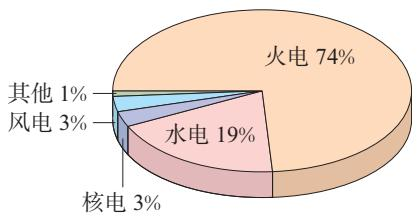

图6-5 2015年我国电力生产量构成图

我们日常使用的电能主要来自火力发电。火力发电是通过化石燃料燃烧时发生的氧化还原反应，使化学能转化为热能，加热水使之汽化为蒸汽以推动蒸汽轮机，带动发电机发电。火力发电过程中，化学能经过一系列能量转化过程，间接转化为电能。其中，燃烧（氧化还原反应）是关键。 

$$
\text {化 学 能} \xrightarrow {\text {燃 料 燃 烧}} \text {热 能} \xrightarrow {\text {蒸 汽 轮 机}} \text {机 械 能} \xrightarrow {\text {发 电 机}} \text {电 能}
$$

要想使氧化还原反应释放的能量直接转化为电能，就要设计一种装置，使反应中的电子转移在一定条件下形成电流。化学电池就是这样一种装置。 

图6-6 原电池实验

# 【实验6-3】

(1) 将锌片和铜片插入盛有稀硫酸的烧杯中, 观察现象。 

(2) 用导线连接锌片和铜片, 观察、比较导线连接前后的现象。 

（3）如图6-6所示，用导线在锌片和铜片之间串联一个电流表，观察电流表的指针是否偏转。 

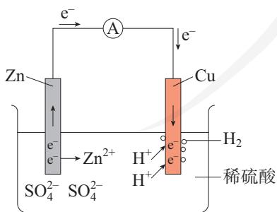

图6-7 原电池原理示意图

可以看到，当锌片与铜片插入稀硫酸时，锌片上有气泡产生，铜片上无气泡产生；当用导线将锌片和铜片相连后，铜片上有气泡产生；串联电流表后，电流表指针发生偏转，说明导线中有电流通过。 

如图6-7所示，上述实验中，当插入稀硫酸的锌片和铜片用导线连接时，由于锌比铜活泼，与稀硫酸作用容易失去电子，被氧化成锌离子而进入溶液。 

锌片: $Z n - 2 e^{-} = Z n^{2+}$ (氧化反应) 

电子由锌片通过导线流向铜片，溶液中的氢离子从铜片获得电子，被还原成氢原子，氢原子结合成氢分子从铜片上放出。 

铜片: $2 \mathrm{H}^{+} + 2 \mathrm{e}^{-} = \mathrm{H}_{2} \uparrow$ (还原反应) 

上述实验和分析表明，通过特定的装置使氧化反应与还原反应分别在两个不同的区域进行，可以使氧化还原反应中转移的电子通过导体发生定向移动，形成电流，从而实现化学能向电能的转化。这种把化学能转化为电能的装置叫做原电池。在原电池中，电子流出的一极是负极（如锌片，电极被氧化），电子流入的一极是正极（如铜片， $\mathrm{H}^+$ 在正极上被还原）。 

原电池 primarybattery 

# 探究

# 简易电池的设计与制作

# 【目的】

根据原电池原理，设计和制作简易电池，体会原电池的构成要素。 

# 【用品】

水果（苹果、柑橘或柠檬等），食盐水，滤纸，铜片、铁片、铝片等金属片，石墨棒，导线，小型用电器（发光二极管、电子音乐卡或小电动机等），电流表。 

# 【实验】

# （1）水果电池

参考图6-8所示水果电池，自选水果及相关用品，制作水果电池。 

# （2）简易电池

参考图6-9，制作简易电池，并试验和比较不同材料作电极的效果。 

# （3）设计演示原电池的趣味实验

利用发光二极管、电子音乐卡或小电动机等，设计一个演示原电池的趣味实验（如电压不足，可将几个电池串联起来）。 

# 【问题和讨论】

(1) 水果电池中, 水果的作用是什么? 

(2) 通过比较不同材料作电极的简易电池,你是否发现电极材料的选择有一些值得注意的问题? 请与同学交流你的经验。 

(3) 在以上实验中, 电池不可或缺的构成部分有哪些? 

图6-8 水果电池

图6-9 简易电池

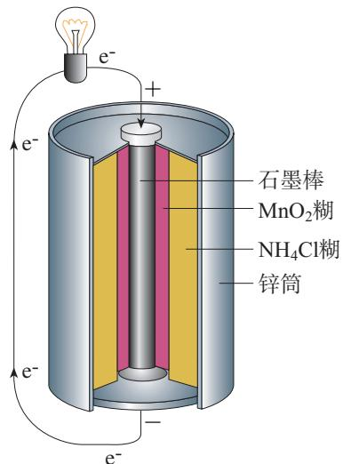

图6-10 锌锰干电池构造示意图

干电池 drybattery 

蓄电池 storagebattery 

锂离子电池 

lithium ion battery 

燃料电池 fuel cell 

图6-12 锂离子电池

根据原电池原理，人们研制出很多结构和性能各异的化学电池，以满足不同的用电需要。 

常见的锌锰干电池的构造如图6-10所示。其中，石墨棒作正极，氯化铵糊作电解质溶液，锌筒作负极。在使用过程中，电子由锌筒（负极）流向石墨棒（正极），锌逐渐消耗，二氧化锰不断被还原，电池电压逐渐降低，最后失效。这种电池放电之后不能充电（内部的氧化还原反应无法逆向进行），属于一次电池。 

有些电池放电时所进行的氧化还原反应，在充电时可以逆向进行，使电池恢复到放电前的状态，从而实现放电（化学能转化为电能）与充电（电能转化为化学能）的循环。这种充电电池属于二次电池。常见的充电电池有铅酸蓄电池、镍氢电池、锂离子电池等，目前汽车上使用的大多是铅酸蓄电池（如图6-11）。 

图6-11 汽车用铅酸蓄电池

化学电池是新能源和可再生能源的重要组成部分。科学技术的进步加速了电池技术的发展，锌锰电池、铅酸蓄电池等传统电池的性能有了明显提高；各种高效、安全、环保的新型化学电池不断涌现，其中锂离子电池和燃料电池发展较快。手机、笔记本计算机、照相机和摄像机等电器所用的电池大多为锂离子电池。 

# @ 信息搜索

通过网络、书籍等渠道，调查了解不同类型电池的性能、构成、特点、应用范围及发展历史，选2~3类列表比较，并结合其发展的前景，谈谈你对研发新型电池意义的理解。 

# 发展中的燃料电池

燃料电池是一种将燃料（如氢气、甲烷、乙醇）和氧化剂（如氧气）的化学能直接转化为电能的电化学反应装置，具有清洁、安全、高效等特点。燃料电池的能量转化率可以超过 $80\%$ 。当以氢气为燃料时，产物为水；以甲烷为燃料时，产物为水和二氧化碳。与常规发电厂相比，其二氧化碳排放量明显降低。燃料电池与干电池或蓄电池的主要差别 

在于反应物不是储存在电池内部，而是从外部提供，这时电池起着类似试管、烧杯等反应器的作用。 

燃料电池的供电量易于调节，能适应用电器负载的变化，而且不需要很长的充电时间，在航天、军事和交通等领域有广阔的应用前景。 

图6-13 我国研制的燃料电池和超级电容混合动力有轨电车

# 化学与职业

# 电池研发人员

电池研发与生产、生活和军事等领域的发展密切相关。电池研发人员的工作包括电池构成材料的研制、电池性能的改进和应用的拓展等。以燃料电池为例，研发中需要研究电极、电解质等电池基本构成材料的性质和材料之间的相容性；研究不同类型的电池构成材料在不同用途时对温度、湿度等环境因素的适应性；还要研究使用什么样的电池材料使电池的容量更大；等等。这些研究工作关系着电池的效率、寿命、安全性、适用 

性和制造成本。在许多科研机构和生产企业中，都有具备着扎实的化学基础的研究人员从事电池研发工作。 

图6-14 电池研发人员正在进行电池性能测试

# 研究与实践

# 了解车用能源

# 【研究目的】

人们为给汽车提供动力，提高能源利用率，减少环境污染，在不断开发新的车用能源。通过以下活动，从不同角度分析和比较不同燃料和能量转化方式的优劣，体会开发新的车用能源的重要意义。 

# 【研究任务】

（1）汽车发展至今，在能源使用上经历了不同的发展阶段。查阅资料，了解汽车发展的过程和车用能源的种类。 

(2) 以氢气、甲烷 $\left(\mathrm{CH}_{4}\right)$ 、辛烷 $\left(\mathrm{C}_{8} \mathrm{H}_{18}\right)$ 和乙醇 $\left(\mathrm{C}_{2} \mathrm{H}_{6} \mathrm{O}\right)$ 为例（你也可以尝试分析其他燃料），为汽车选择燃料。 

① 写出不同燃料发生能量转化时涉及的主要化学反应。 

② 查阅资料，比较相同质量的燃料燃烧时放出热量的多少，并结合燃料的物质状态分析其优劣。 

(3) 从来源、环保等其他角度分析不同燃料的优劣。 

（3）了解蒸汽机、内燃机和燃料电池等的能量转化方式，从转化效率、技术可行性等角度进行比较。 

# 【结果与讨论】

(1) 你最终选择了哪种燃料和哪种能量转化方式? 你在选择时重点考虑了哪些因素? 

(2) 通过了解车用能源的发展过程, 你得到什么启示? 请与同学讨论。 

# 练习与应用

1. 化学反应的本质是有新物质生成，物质的变化是化学反应的基本特征之一。化学反应的另一基本特征是__________，通常表现为__________的释放或吸收。 

2. 原电池是一种可将________直接转化为________的装置，其中发生的化学反应属于________。原电池的必要组成部分有________。 

3.下列说法错误的是（ ）。 

A. 化学反应必然伴随发生能量变化 

B. 化学反应中的能量变化与反应物的质量无关 

C. 能量变化必然伴随发生化学反应 

D. 化学反应中的能量变化主要是由化学键变化引起的 

4. 一定条件下，石墨转化为金刚石要吸收能量。在该条件下，下列结论正确的是（）。 

A. 金刚石比石墨稳定 

B. 等质量的金刚石和石墨完全燃烧释放的热量相同 

C. 金刚石转化为石墨是吸热反应 

D. $1 \mathrm{~mol} \mathrm{C}$ (金刚石) 比 $1 \mathrm{~mol} \mathrm{C}$ (石墨) 的总能量高 

5. 下列关于右图所示装置的叙述，错误的是（ ）。 

A. 锌是负极, 其质量逐渐减小 

B. 氢离子在铜表面被还原, 产生气泡 

C. 电流从锌片经导线流向铜片 

D. 电子从锌片经导线流向铜片 

6.下列说法正确的是（ ）。 

A. 图1所示装置能将化学能转化为电能 

B. 图2所示反应为吸热反应 

C. 锌锰干电池中, 锌筒作正极 

D. 蓄电池充电时也发生了氧化还原反应 

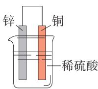

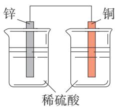

图1

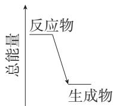

图2

7. 几位同学以相同大小的铜片和锌片为电极研究水果电池，得到的实验数据如下表所示： 

<table><tr><td>实验编号</td><td>水果种类</td><td>电极间距离/cm</td><td>电流/μA</td></tr><tr><td>1</td><td>番茄</td><td>1</td><td>98.7</td></tr><tr><td>2</td><td>番茄</td><td>2</td><td>72.5</td></tr><tr><td>3</td><td>苹果</td><td>2</td><td>27.2</td></tr></table>

(1) 该实验的目的是探究水果种类和 对水果电池电流的影响。 

(2) 该实验所用装置中, 负极的材料是 , 该装置将转化为电能。 

（3）能表明水果种类对电流有影响的实验编号是 和 

（4）请你再提出一个可能影响水果电池电流的因素： 

8. 我国将落实创新、协调、绿色、开放、共享的发展理念，全面推进节能减排和低碳发展，迈向生态文明新时代。为此，如果从不同能源对环境的影响考虑，你认为我国在煤、石油等传统能源和新能源的利用及发展上应采取哪些措施？ 

9. 便携式化学电池使用方便，但仍然存在一些不足，如电压较低，寿命较短，处理不当可能会造成环境污染。有人认为这些不足是由其制造技术不完善造成的，也有人认为是由其工作原理决定的。你的看法和依据是什么？请查阅资料，与老师和同学交流、讨论。 

# 第二节

# 化学反应的速率与限度

在化学反应的研究和实际应用中，人们除了选择合适的化学反应以实现所期待的物质转化或能量转化，还要关注化学反应进行的快慢和程度，以提高生产效率。 

# 一、化学反应的速率

在化学实验和日常生活中，我们经常观察到这样的现象：有的化学反应进行得快，有的化学反应进行得慢。 

# 思考与讨论

你了解下图涉及的化学反应进行的快慢吗？反应的快慢程度与我们有什么关系？ 

爆炸

牛奶变质

铁桥生锈

溶洞形成

图6-15 快慢差别很大的化学变化

不同的化学反应进行的快慢千差万别，快与慢是相对而言的，是一种定性的比较。在科学研究和实际应用中，对化学反应进行的快慢进行定量的描述或比较时，要使用同一定义或标准下的数据。与物理学中物体的运动快慢用速率表示类似，化学反应过程进行的快慢用反应速率来表示。 

化学反应速率通常用单位时间内反应物浓度的减小或生成物浓度的增大来表示（取正值）。浓度常以 $\mathrm{mol} / \mathrm{L}$ 为单位，时间常以 $\mathrm{min}$ （分）或s（秒）为单位，化学反应速率的单位相应为 $\mathrm{mol} / (\mathrm{L} \cdot \mathrm{min})$ 或 $\mathrm{mol} / (\mathrm{L} \cdot \mathrm{s})$ 。例如，某反应的反应物浓度在 $5 \mathrm{~min}$ 内由 $6 \mathrm{~mol} / \mathrm{L}$ 变成了 $2 \mathrm{~mol} / \mathrm{L}$ ，则以该反应物浓度的变化表示的该反应在这段时间内的平均反应速率为 $0.8 \mathrm{~mol} / (\mathrm{L} \cdot \mathrm{min})$ 。 

化学反应的速率往往受到反应条件的影响。例如，过氧化氢溶液在常温下分解放出氧气的速率很小，但是加入催化剂二氧化锰后，分解速率增大。像这样通过改变化学反应的条件来调控化学反应速率的情况，在实际的生产和生活中常常会遇到。对于有些化学反应，我们希望其越慢越好，如食物的变质、橡胶和塑料的老化、金属的锈蚀；有些则希望其快一些，如氨、硫酸等化工产品的生产。调控化学反应速率常常是决定化学实验成败或化工生产成本的关键。有哪些因素能够影响化学反应速率呢？ 

化学反应速率 

chemical reaction rate 

# 探究

# 影响化学反应速率的因素

# 【问题】

我们已经知道催化剂可以影响化学反应速率，此外，还有哪些反应条件会影响化学反应的速率？ 

# 【假设】

影响化学反应速率的因素可能有反应温度、反应物浓度等。 

# 【用品】

$5\% \mathrm{H}_2\mathrm{O}_2$ 溶液、 $1\mathrm{mol} / \mathrm{LFeCl}_3$ 溶液、 $0.1\mathrm{mol} / \mathrm{L}$ 盐酸、 $1\mathrm{mol} / \mathrm{L}$ 盐酸、大理石碎块、冷水、热水、试管、试管夹、烧杯、量筒、胶头滴管。 

# 【实验】

# （1）反应温度的影响

在两支大小相同的试管中均加入 $2 \mathrm{~mL} 5 \% \mathrm{H}_{2} \mathrm{O}_{2}$ 溶液，同时滴入2滴 $1 \mathrm{~mol} / \mathrm{L} \mathrm{FeCl}_{3}$ 溶液。待试管中均有适量气泡出现时，将其中一支试管放入盛有冷水的烧杯中，另一支试管放入盛有热水的烧杯中，观察现象并进行对比。 

<table><tr><td>不同温度环境</td><td>实验现象</td></tr><tr><td>冷水</td><td></td></tr><tr><td>热水</td><td></td></tr></table>

# (2) 反应物浓度的影响

利用实验室提供的用品，设计实验方案并提请教师审阅，待教师同意后进行实验（提示：探究某影响因素时，需保持其他条件因素相同）。 

步骤： 

记录： 

<table><tr><td></td><td></td></tr><tr><td></td><td></td></tr><tr><td></td><td></td></tr></table>

# 【结论】

<table><tr><td>影响因素</td><td>如何影响</td></tr><tr><td>催化剂</td><td>催化剂可以改变化学反应速率</td></tr><tr><td></td><td></td></tr><tr><td></td><td></td></tr></table>

# 【问题和讨论】

影响化学反应速率的因素还可能有哪些？请选择其中一个因素，设计实验验证方案，与同学交流。 

# 方法导引

# 变量控制

科学研究中，对于多因素（多变量）的问题，常常采用只改变其中的某一个因素，控制其他因素不变的研究方法，使多因素的问题变成几个单因素的问题，分别加以研究，最后再将几个单因素问题的研究结果加以综合。这种变量控制的方法是科学探究中常用的方法。例如，以上探究在比较不同温度对化学反应速率的影响时，控制浓度和其他影响因素相同；而比较不同浓度对化学反应速率的影响时，则控制温度和其他影响因素相同；最后综合得出影响化学反应速率的多种因素。 

大量实验事实和科学研究证明：一般条件下，当其他条件相同时，增大反应物浓度，化学反应速率增大，降低反应物浓度，化学反应速率减小；升高温度，化学反应速率增大，降低温度，化学反应速率减小；催化剂可以改变化学反应速率。 

对于气体来说，在相同温度下，压强越大，一定质量气体的体积越小，单位体积内气体的分子数越多（如图6-16）。增大压强（减小容器容积）相当于增大反应物的浓度，化学反应速率增大；减小压强（增大容器容积）相当于减小反应物的浓度，化学反应速率减小。此外，在日常生活和化学实验中，如果我们细心观察和思考，还会发现更多影响化学反应速率的因素。 

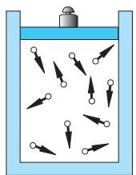

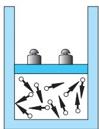

图6-16 压强增大，气体浓度增大

# 思考与讨论

下列调控反应速率的措施或实验中, 分别利用或体现了哪些影响反应速率的因素? 

（1）向炉膛内鼓风，用煤粉代替煤块可以使炉火更旺。 

(2) 把食物存放在冰箱里, 在糕点包装内放置除氧剂可以延长食品保质期。 

(3) 做化学实验时, 为加速反应的进行, 通常将块状或颗粒状的固体试剂研细并混匀。 

(4) 铁在空气中和在纯氧中反应的剧烈程度明显不同。 

# 神奇的催化剂

催化剂是现代化学中关键而神奇的物质之一。据统计，有 $80\%$ 以上的化工生产过程（如氨、硫酸、硝酸的合成，乙烯、丙烯、苯乙烯的聚合，煤、石油、天然气的综合利用，等等）使用了催化剂，目的是增大反应速率，提高生产效率。在资源利用、能源开发、医药制造、环境保护等领域，催化剂有着广泛的应用。催化剂十分神奇，它能极大地提高化学反应速率（可使反应速率增大几个到十几个数量级），而自身的组成、化学性质和质量在反应前后不发生变化；它和一些反应体系的关系就像钥匙与锁的关系，具有一定的选择性。 

生物体内几乎所有的化学反应（如淀粉、脂肪、蛋白质的水解，DNA的复制等）都是由生物体内存在的特殊催化剂——酶所催化的。酶比一般的催化剂具有更高的选择 

性和催化效率，而且是在正常体温的条件下发生作用，反应条件温和。受酶的启示，科学家开辟了设计和合成催化剂的新途径，正在研制具有生物酶某些特性的化学酶，以期实现“仿酶催化”。催化剂的神奇面纱至今尚未完全揭开，对催化剂的研究是当代化学一个极具魅力和应用前景的重要课题。 

图6-17 氨氧化法制硝酸使用的网状铂-钯-铑合金催化剂

# 二、化学反应的限度

化学反应是按照化学方程式中的计量关系进行的，我们正是据此进行有关化学方程式的计算。你是否思考过这样的问题：一个化学反应在实际进行时（如化学实验、化工生产等），反应物是否会按化学方程式中的计量关系完全转变成产物？如果能，是在什么条件下？如果不能，原因是什么？ 

我们知道，在 $\mathrm{SO}_2$ 与 $\mathrm{H}_2\mathrm{O}$ 的反应中，由于生成物 $\mathrm{H}_2\mathrm{SO}_3$ 不稳定，会部分地分解为 $\mathrm{SO}_2$ 与 $\mathrm{H}_2\mathrm{O}$ ，该反应是一个可逆反应，不能进行到底。另外，我们学习过的 $\mathrm{H}_2$ 与 $\mathrm{N}_2$ 生成 $\mathrm{NH}_3$ 的反应也是可逆反应，同样不能进行到底。 

科学研究表明，很多化学反应都是可逆反应。在一定 

条件下，某个可逆反应在开始进行时，反应物的浓度最大，生成物浓度为零，因此正反应速率大于逆反应速率。随着反应的进行，反应物的浓度逐渐减小，正反应速率逐渐减小；生成物的浓度逐渐增大，逆反应速率逐渐增大。当反应进行到一定程度时，正反应速率与逆反应速率相等（如图6-18），反应物的浓度和生成物的浓度都不再改变，达到一种表面静止的状态，我们称之为化学平衡状态，简称化学平衡。化学平衡状态是可逆反应在一定条件下所能达到的或完成的最大程度，即该反应进行的限度。化学反应的限度决定了反应物在该条件下转化为生成物的最大转化率①。 

任何可逆反应在给定条件下的进程都有一定的限度，只是不同反应的限度不同。改变反应条件可以在一定程度上改变一个化学反应的限度，亦即改变该反应的化学平衡状态。因此，通过调控反应条件可使反应结果更好地符合人们预期的目的，这在工农业生产和环境保护等方面已经得到广泛的应用。 

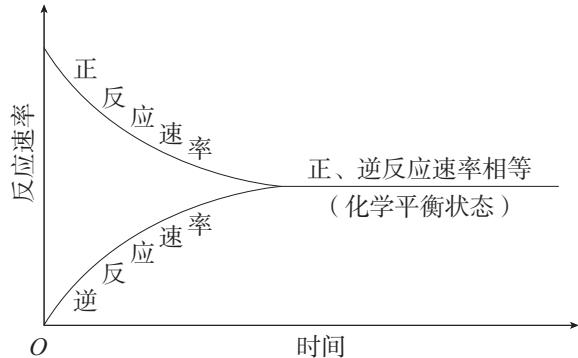

图6-18 一定条件下的可逆反应中，正反应速率和逆反应速率随时间变化的示意图

# 三、化学反应条件的控制

在生产和生活中，人们希望促进有利的化学反应（提高反应速率，提高反应物的转化率即原料的利用率），抑制有害的化学反应（降低反应速率，控制副反应的发生，减少甚至消除有害物质的产生），这就需要进行化学反应条件的控制。 

化学平衡 

chemical equilibrium 

在化工生产中，为了提高反应进行的程度而调控反应条件时，需要考虑控制反应条件的成本和实际可能性。例如，合成氨的生产在温度较低时，氨的产率较高；压强越大，氨的产率越高。但温度低，反应速率小，需要很长时间才能达到化学平衡，生产成本高，工业上通常选择在 $400 \sim 500^{\circ} \mathrm{C}$ 下进行。而压强越大，对动力和生产设备的要求也越高，合成氨厂随着生产规模和设备条件的不同，采用的压强通常为 $10 \mathrm{MPa} \sim 30 \mathrm{MPa}$ 。 

# 思考与讨论

为提高燃料的燃烧效率，应如何调控燃烧反应的条件？（提示：可以从以下几方面考虑，如燃料的状态、空气用量、炉膛材料、烟道废气中热能的利用，等等。） 

# 科学史话

# 炼铁高炉尾气之谜

高炉炼铁的主要反应是： 

$$
\mathrm {F e} _ {2} \mathrm {O} _ {3} + 3 \mathrm {C O} \xlongequal {\text {高 温}} 2 \mathrm {F e} + 3 \mathrm {C O} _ {2}
$$

其中产生CO的反应是： 

$\mathrm{C}(\text{焦炭}) + \mathrm{O}_2(\text{空气}) \stackrel{\text{高温}}{=} \mathrm{CO}_2(\text{放出热量})$ 

$\mathrm{C}$ （焦炭） $+\mathrm{CO}_{2}$ 高温 2CO（吸收热量） 

生产中炼制生铁所需焦炭的实际用量，远高于按照化学方程式计算所需的量，而且从高炉炉顶出来的气体中总是含有没有利用的CO。开始，炼铁工程师们认为是CO与铁矿石接触不充分造成的，于是设法增加高炉的高度。然而，令人吃惊的是，高炉增高后，高炉尾气中CO的比例竟然没有改变。这成了炼铁技术中的科学悬念，人们一 

直在探究其中的原因。直到19世纪下半叶，法国化学家勒夏特列（H.-L. Le Chatelier, 1850—1936）经过深入的研究，才将这一谜底揭开。原来，产生上述现象的原因是： $\mathrm{C} + \mathrm{CO}_2 \rightleftharpoons 2\mathrm{CO}$ 是一个可逆反应，并且自下而上发生在高炉中有焦炭的地方。后来的研究证明，在高炉中 $\mathrm{Fe}_2\mathrm{O}_3$ 与 $\mathrm{CO}$ 反应也不能全部转化为 $\mathrm{Fe}$ 和 $\mathrm{CO}_2$ 。 

图6-19 首钢炼铁高炉

1. 请根据已有知识和经验填写下表。 

<table><tr><td>影响化学反应速率
的条件</td><td>如何影响</td><td>实例</td></tr><tr><td>温度</td><td></td><td></td></tr><tr><td>浓度</td><td></td><td></td></tr><tr><td>固体的表面积</td><td></td><td></td></tr><tr><td>催化剂</td><td></td><td></td></tr></table>

2. 对于反应 $2 \mathrm{SO}_{2}(\mathrm{~g}) + \mathrm{O}_{2}(\mathrm{~g}) \rightleftharpoons 2 \mathrm{SO}_{3}(\mathrm{~g})$ , 如下表所示, 保持其他条件不变, 只改变一个反应条件时,生成 $\mathrm{SO}_{3}$ 的反应速率会如何变化? (在下表空格内填 “增大” “减小” 或 “不变”。) 

<table><tr><td>改变条件</td><td>升高温度</td><td>降低温度</td><td>增大氧气的浓度</td><td>使用催化剂</td><td>减小容器容积</td><td>恒容下充入Ne</td></tr><tr><td>生成SO3的速率</td><td></td><td></td><td></td><td></td><td></td><td></td></tr></table>

3. 下列措施中，不能增大化学反应速率的是（ ）。 

A. Zn与稀硫酸反应制取 $\mathrm{H}_{2}$ 时, 加入蒸馏水 

B. Al在 $\mathrm{O}_{2}$ 中燃烧生成 $\mathrm{Al}_{2} \mathrm{O}_{3}$ , 用铝粉代替铝片 

C. $\mathrm{CaCO}_{3}$ 与稀盐酸反应生成 $\mathrm{CO}_{2}$ 时, 适当升高温度 

D. KClO $_3$ 分解制取 $\mathrm{O}_2$ 时, 添加少量 $\mathrm{MnO}_2$ 

4. 在一定条件下, 某可逆反应的正反应速率和逆反应速率随时间变化的曲线如下图所示。下列有关说法正确的是 ( )。 

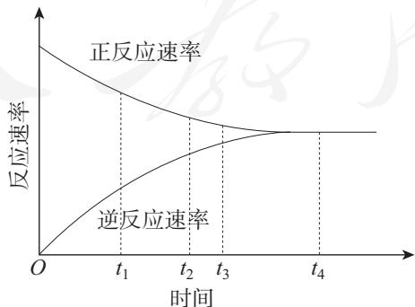

A. $t_{1}$ 时刻，反应逆向进行 

B. $t_{2}$ 时刻, 正反应速率大于逆反应速率 

C. $t_{2}$ 时刻，达到反应进行的限度 

D. $t_{A}$ 时刻, 反应处于平衡状态 

5. 下列关于化学平衡状态的叙述错误的是（ ）。 

A. 化学平衡是所有可逆反应都存在的一种状态 

B. 在给定条件下, 达到平衡时可逆反应完成程度达到最大 

C. 达到平衡时, 正、逆反应速率均为零 

D. 达到平衡时, 反应物和生成物的浓度不再发生变化 

6. 一定条件下的密闭容器中, 发生可逆反应 $\mathrm{N}_{2}(\mathrm{~g}) + 3 \mathrm{H}_{2}(\mathrm{~g}) \rightleftharpoons 2 \mathrm{NH}_{3}(\mathrm{~g})$ 。下列情况不能说明该反应一定达到化学平衡的是 ( )。 

A. $\mathrm{NH}_{3}$ 的质量保持不变 

B. ${\mathrm{H}}_{2}$ 的含量保持不变 

C. 正反应和逆反应的速率相等 

D. ${\mathrm{N}}_{2}$ 、 ${\mathrm{H}}_{2}$ 和 ${\mathrm{{NH}}}_{3}$ 的物质的量之比为 $1 : 3 : 2$ 

7. 工业制硫酸中的一步重要反应是 $\mathrm{SO}_2$ 在 $400\sim 500^{\circ}\mathrm{C}$ 下的催化氧化： 

$$
2 \mathrm {S O} _ {2} + \mathrm {O} _ {2} \xlongequal [ \triangle ] {\text {催 化 剂}} 2 \mathrm {S O} _ {3}
$$

这是一个正反应放热的可逆反应。如果反应在密闭容器中进行，下列有关说法错误的是（ ）。 

A. 使用催化剂是为了增大反应速率，提高生产效率 

B. 在上述条件下, $\mathrm{SO}_{2}$ 不可能 $100\%$ 地转化为 $\mathrm{SO}_{3}$ 

C. 提高反应时的温度, 可以实现 $\mathrm{SO}_{2}$ 的完全转化 

D. 通过调控反应条件, 可以提高该反应进行的程度 

8. 日常生活中的下列做法，与调控反应速率有关的是________（填序号），请利用本节所学知识进行解释。 

① 食品抽真空包装 

(2) 在铁制品表面刷油漆 

③ 向门窗合页里注油 

(4) 用冰箱冷藏食物 

9. 某课外实验小组利用压强传感器、数据采集器和计算机等数字化实验设备，探究镁与不同浓度盐酸的反应速率，两组实验所用试剂如下： 

<table><tr><td rowspan="2">序号</td><td rowspan="2">镁条的质量/g</td><td colspan="2">盐酸</td></tr><tr><td>物质的量浓度/(mol·L-1)</td><td>体积/mL</td></tr><tr><td>1</td><td>0.01</td><td>1.0</td><td>2</td></tr><tr><td>2</td><td>0.01</td><td>0.5</td><td>2</td></tr></table>

实验结果如下图所示。 

（1）试说明该图中曲线的含义。 

(2) 结合实验条件, 分析两条曲线的区别。 

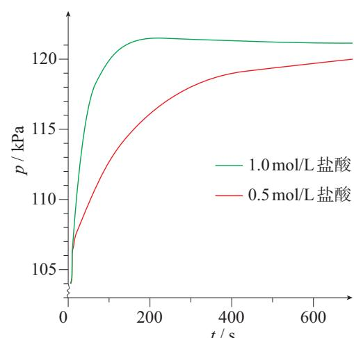

10. 在许多食品外包装上都有类似下图所示的说明，你能用化学反应速率的知识加以解释吗？你还能找出类似的例子吗？ 

配料：小麦粉、饮用水、红小豆、白砂糖、酵母、食品添加剂（碳酸钠）。 

储存条件：常温，阴凉、干燥、通风处储存，避免高温、潮湿。 

食用方法：开袋即可食用，加热食用更佳，未食用的请放入冰箱冷藏保鲜，保存不当或过期的食品切勿食用。 

保质期：常温 $(20\sim 25^{\circ}C)$ ，一、四季度4天，二、三季度3天；冷藏 $(4^{\circ}C$ 以下)，7天；冷冻 $(-18^{\circ}C$ 以下)，6个月。 

11. 在通常情况下，面粉并不会发生爆炸。但是，当面粉在相对密闭的空间内悬浮在空气中，达到一定浓度时，遇火却会发生剧烈的反应，导致爆炸。试用本节所学的知识对此作出解释。 

12. 实验室通常用大理石（或石灰石）与稀盐酸反应制取二氧化碳，不用纯碱与盐酸或硫酸反应制取二氧化碳的考虑是：（1）纯碱比大理石（或石灰石）成本高，不经济；（2）反应速率太快，难以控制和收集产物。反应速率可以通过改变反应条件来控制。作为研究，请你提出用纯碱与盐酸反应制取二氧化碳的适宜途径，并用实验来检验你的设计。 

# 一、从能量变化的视角认识化学反应

化学反应总是伴随着能量变化，物质的化学能可以转化为热、光、声、电等多种能量形式。本章主要学习化学反应中较为常见的热能和电能的转化与利用。 

# 1. 化学反应中的能量转化

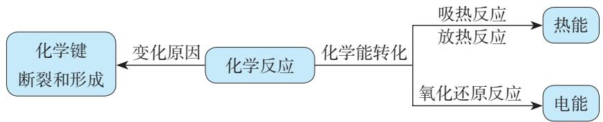

# 2. 化学能转化为电能

原电池可将化学能转化为电能。 

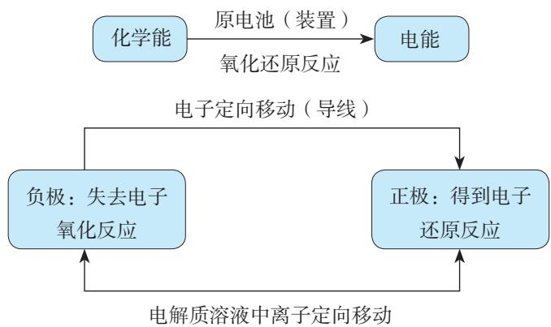

# 二、从化学反应速率和限度的视角认识化学反应

从化学反应速率和限度两个视角认识和调控化学反应，在生活、生产和科学研究中具有重要意义。 

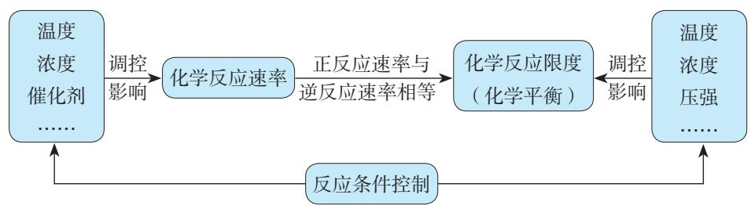

# 复习与提高

1. 已知化学能与其他形式的能可以相互转化。请回答下列问题。 

（1）化学能与其他形式的能相互转化的途径是 

（2）填写下表： 

<table><tr><td>化学反应</td><td>能量转化形式</td></tr><tr><td>①CH4+2O2点燃 CO2+2H2O</td><td>由____能转化为____能</td></tr><tr><td>②Pb + PbO2+ 2H2SO4放电 2PbSO4+ 2H2O</td><td></td></tr><tr><td>③CaCO3高温 CaO + CO2↑</td><td></td></tr><tr><td>④mH2O + nCO2光 叶绿素 Cn(H2O)m + nO2</td><td></td></tr></table>

（3）上述反应中属于氧化还原反应的是 （填序号）。 

2. 一定条件下，在容积为 $2 \mathrm{~L}$ 的密闭容器中发生反应： $3 \mathrm{~A}(\mathrm{g}) + \mathrm{B}(\mathrm{g}) \rightleftharpoons 2 \mathrm{C}(\mathrm{g})$ 。开始时加入 $4 \mathrm{~mol} \mathrm{~A}$ 、 $6 \mathrm{~mol} \mathrm{~B}$ 、 $2 \mathrm{~mol} \mathrm{C}$ ，在 $2 \mathrm{~min}$ 末测得 C 的物质的量是 $3 \mathrm{~mol}$ 。 

（1）用A的浓度变化表示反应的平均速率： 

（2）在 $2\mathrm{min}$ 末，B的浓度为 

(3) 若改变下列一个条件, 推测该反应的速率发生的变化 (填 “增大” “减小” 或 “不变”: 

(1) 升高温度, 化学反应速率 

(2) 充入 $1 \mathrm{~mol} \mathrm{~B}$ , 化学反应速率 ; 

(3) 将容器的容积变为 $3 \mathrm{~L}$ , 化学反应速率 

3. C、CO、 $\mathrm{CH}_{4}$ 和 $\mathrm{C}_{2} \mathrm{H}_{5} \mathrm{OH}$ 是常用的燃料, $1 \mathrm{~mol}$ 上述物质分别完全燃烧生成 $\mathrm{CO}_{2}(\mathrm{~g})$ 及 $\mathrm{H}_{2} \mathrm{O}(\mathrm{l})$ 时, 放出的热量依次为 $393.5 \mathrm{~kJ} 、 283.0 \mathrm{~kJ} 、 890.3 \mathrm{~kJ}$ 和 $1366.8 \mathrm{~kJ}$ 。相同质量的这4种燃料完全燃烧, 放出热量最多的是 ( )。 

A. C 

B. CO 

C. $\mathrm{CH}_{4}$ 

D. $\mathrm{C}_{2} \mathrm{H}_{5} \mathrm{OH}$ 

4. 氢气是非常有前途的新型能源，氢能开发中的一个重要问题就是如何制取氢气。以下研究方向你认为不可行的是（）。 

A. 建设水电站，用电力分解水制取氢气 

B. 设法将太阳光聚焦, 产生高温, 使水分解产生氢气 

C. 寻找更多的化石燃料, 利用其燃烧放热, 使水分解产生氢气 

D. 寻找特殊的化学物质作催化剂, 用于分解水制取氢气 

5. 把 $a 、 b 、 c 、 d$ 4 种金属浸入稀硫酸中, 用导线两两相连可以组成各种原电池。若 $a 、 b$ 相连, $a$ 为负极; $c 、 d$ 相连, $d$ 上有气泡逸出; $a 、 c$ 相连时, $a$ 质量减少; $b 、 d$ 相连, $b$ 为正极。则 4 种金属的活动性顺序由大到小排列为 ( )。 

A. $a > c > d > b$ 

B. $a > c > b > d$ 

C. $b > d > c > a$ 

D. $a > b > c > d$ 

6. 某化学兴趣小组为了探索铝电极在原电池中的作用, 设计并进行了以下一系列实验, 实验结果记录如下: 

<table><tr><td>编号</td><td>电极材料</td><td>电解质溶液</td><td>电流表指针偏转方向</td></tr><tr><td>1</td><td>Mg、Al</td><td>稀盐酸</td><td>偏向Al</td></tr><tr><td>2</td><td>Al、Cu</td><td>稀盐酸</td><td>偏向Cu</td></tr><tr><td>3</td><td>Al、石墨</td><td>稀盐酸</td><td>偏向石墨</td></tr><tr><td>4</td><td>Mg、Al</td><td>NaOH溶液</td><td>偏向Mg</td></tr></table>

根据上表中记录的实验现象，回答下列问题。 

（1）实验1、2中Al电极的作用是否相同？ 

(2) 实验3中铝为____极, 电极反应式为 $2 \mathrm{Al} - 6 \mathrm{e}^{-} = 2 \mathrm{Al}^{3+}$ ; 石墨为____极, 电极反应式为 $6 \mathrm{H}^{+} + 6 \mathrm{e}^{-} = 3 \mathrm{H}_{2} \uparrow$ ; 电池总反应式为________。 

(3) 实验4中的铝为____极，原因是________________________。写出铝电极的电极反应式：________________________。 

(4) 根据以上实验结果, 在原电池中相对活泼的金属作正极还是作负极受到哪些因素的影响? 

7. 某同学用相同质量的锌粉先后与 $1 \mathrm{~mol} / \mathrm{L}$ 盐酸及相同体积未知浓度的盐酸反应, 记录相关数据, 并作出两个反应过程中放出气体的体积随反应时间的变化图 (如右图所示)。 

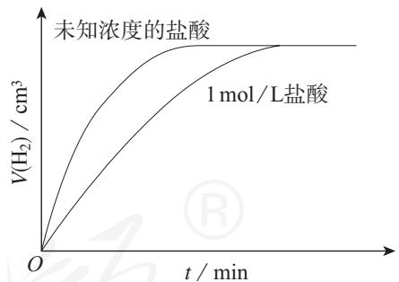

(1) 如果请你做这一实验, 你如何测量反应放出气体的体积? 

（2）请根据图示判断并解释，该同学所用未知浓度的盐酸，其浓度是高于还是低于 $1\mathrm{mol} / \mathrm{L}$ 。 

(3) 如果用 $1 \mathrm{~mol} / \mathrm{L}$ 硫酸代替上述实验中的 $1 \mathrm{~mol} / \mathrm{L}$ 盐酸, 二者的反应速率是否相同? 请说明原因。 

8. $1\mathrm{mol}$ C、 $1\mathrm{mol}$ CO分别按下式反应（燃烧）： 

$\mathrm{C(s) + \frac{1}{2}O_2(g) = CO(g)}$ 放热 $110.5\mathrm{kJ}$ 

$\mathrm{CO(g) + \frac{1}{2}O_2(g) = CO_2(g)}$ 放热 $283.0\mathrm{kJ}$ 

$\mathrm{C(s) + O_2(g) = CO_2(g)}$ 放热 $393.5\mathrm{kJ}$ 

分析上述化学方程式及有关数据，说明为什么煤炭充分燃烧不仅能够节约能源，还可以减少对环境的污染。 

9. 冷敷袋俗称冰袋，在日常生活中有降温、保鲜和镇痛等多种用途。 

（1）制作冷敷袋可以利用（ ）。 

a. 放热的化学变化 

b. 吸热的化学变化 

c. 放热的物理变化 

d.吸热的物理变化 

（2）以下是三种常见冷敷袋所盛装的主要物质，请从（1）的选项中找出其对应的主要工作原理。 

$①$ 冰 

② 硝酸铵 + 水 

③ 硝酸铵 + 水合碳酸钠 

(3) 请写出十水合碳酸钠 $\left(\mathrm{Na}_{2} \mathrm{CO}_{3} \cdot 10 \mathrm{H}_{2} \mathrm{O}\right)$ 与硝酸铵在一定条件下反应的化学方程式, 并从反应物、生成物总能量高低的角度解释该反应有能量变化的原因。(提示: 该反应产生了两种气体。) 

（4）请从使用的便捷性、安全性等角度比较上述三种冷敷袋，并与同学讨论。 

10. 某温度时，在容积为 $2 \mathrm{~L}$ 的密闭容器中发生 A、B 两种物质间的转化反应，A、B 物质的量随时间变化的曲线如右图所示。请分析图中数据，回答下列问题。 

（1）该反应的化学方程式为 

(2) 反应开始至 $4 \mathrm{~min}$ , A 的平均反应速率为 

(3) $4 \mathrm{~min}$ 时, 反应是否达到化学平衡? (填 “是” 或 “否”); $16 \mathrm{~min}$ 时, 正反应速率逆反应速率 (填 “>” “<” 或 “=” )。 

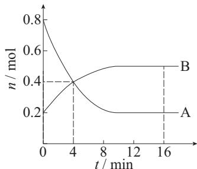

11. 近年来电池研发领域涌现出的纸电池，其组成与传统电池类似，主要包括电极、电解液和隔离膜（如下图所示），电极和电解液均“嵌”在纸中。纸电池像纸一样轻薄柔软，在制作方法和应用范围上与传统电池相比均有很大的突破。 

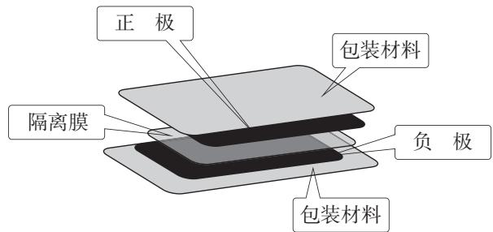

(1) 某学生在课外活动时, 根据纸电池的结构示意图, 利用实验室中的氯化钠、蒸馏水和滤纸制备了电解液和隔离膜, 用铜片分别与锌片和另一种银白色金属片, 先后制作了两个简易电池。在用电流表测试这两个电池时, 发现电流表的指针都发生了偏转, 但偏转方向相反。你能对该同学的实验结果作出解释吗? 

(2) 请利用家庭易得材料, 设计制作一个简易电池, 并试验其能否产生电流（画出设计图, 并标明所用材料）。 

(3) 根据纸的特性, 试推测纸电池会有哪些不同于传统电池的特别之处, 并通过网络搜索验证你的推测。 

# 实验活动6

# 化学能转化成电能

# 【实验目的】

1. 理解氧化还原反应在化学能转化成电能过程中的作用，体会化学的价值。 

2. 认识原电池的构成要素及其作用。 

# 【实验用品】

烧杯、导线、电流表。 

锌片、铜片、石墨棒、稀硫酸。 

# 【实验步骤】

1. 电极材料的实验 

(1) 用导线将电流表分别与锌片、铜片相连接, 使锌片与铜片接触, 观察电流表指针是否发生偏转; 用石墨棒代替铜片进行上述实验。解释所观察到的现象。 

<table><tr><td>电极材料</td><td>电流表指针是否发生偏转</td><td>解释</td></tr><tr><td>锌片、铜片</td><td></td><td rowspan="2"></td></tr><tr><td>锌片、石墨棒</td><td></td></tr></table>

(2) 将锌片插入盛有稀硫酸的烧杯里, 观察现象; 再插入铜片, 观察现象; 取出铜片, 插入石墨棒, 观察现象。 

<table><tr><td>电极材料</td><td>实验现象</td><td>解释</td></tr><tr><td>锌片</td><td></td><td></td></tr><tr><td>锌片、铜片</td><td></td><td></td></tr><tr><td>锌片、石墨棒</td><td></td><td></td></tr></table>

2. 原电池实验 

如下表所示，选择不同的电极材料，以及稀硫酸、导线和电流表，组装原电池，试验其能否产生电流，并作出解释。 

<table><tr><td>电极材料</td><td>实验现象</td><td>解释</td></tr><tr><td>锌片、铜片</td><td></td><td></td></tr><tr><td>锌片、石墨棒</td><td></td><td></td></tr><tr><td>铜片、石墨棒</td><td></td><td></td></tr></table>

# 【问题和讨论】

1. 根据以上实验，说明原电池的工作原理和构成要素，以及组装原电池的操作注意事项。 

2.能否用铁片作为电极代替铜锌原电池中的锌片？为什么？ 

# 实验活动7

# 化学反应速率的影响因素

# 【实验目的】

1. 体验浓度、温度和催化剂对化学反应速率的影响。 

2. 理解改变反应条件可以调控化学反应的速率。 

# 【实验原理】

1. 硫代硫酸钠与硫酸的反应 

硫代硫酸钠与硫酸反应会生成不溶于水的硫： 

$$
\mathrm {N a} _ {2} \mathrm {S} _ {2} \mathrm {O} _ {3} + \mathrm {H} _ {2} \mathrm {S O} _ {4} = \mathrm {N a} _ {2} \mathrm {S O} _ {4} + \mathrm {S O} _ {2} \uparrow + \mathrm {S} \downarrow + \mathrm {H} _ {2} \mathrm {O}
$$

反应生成的硫使溶液出现乳白色浑浊，比较浑浊现象出现所需时间的长短，可以判断该反应进行的快慢。在不同浓度和温度条件下分别进行上述反应，并比较其反应快慢，可以看出反应物浓度和温度对该反应速率的影响。 

2. 过氧化氢分解会产生氧气，在有或无催化剂存在下进行对比实验，通过观察氧气产生的快慢可以看出催化剂对该反应速率的影响。 

# 【实验用品】

烧杯、试管、量筒、试管架、胶头滴管、温度计、药匙、秒表。 

0.1 mol/L $\mathrm{Na}_2\mathrm{S}_2\mathrm{O}_3$ 溶液、0.1 mol/L $\mathrm{H}_2\mathrm{SO}_4$ 溶液、 $10\% \mathrm{H}_2\mathrm{O}_2$ 溶液、1 mol/L $\mathrm{FeCl}_3$ 溶液、 $\mathrm{MnO}_2$ 粉末、蒸馏水。 

# 【实验步骤】

# 1. 浓度对化学反应速率的影响

取两支大小相同的试管，分别加入 $2 \mathrm{~mL}$ 和 $1 \mathrm{~mL} 0.1 \mathrm{~mol} / \mathrm{L} \mathrm{Na}_{2} \mathrm{~S}_{2} \mathrm{O}_{3}$ 溶液，向盛有 $1 \mathrm{~mL} \mathrm{Na}_{2} \mathrm{~S}_{2} \mathrm{O}_{3}$ 溶液的试管中加入 $1 \mathrm{~mL}$ 蒸馏水，摇匀。再同时向上述两支试管中加入 $2 \mathrm{~mL} 0.1 \mathrm{~mol} / \mathrm{L} \mathrm{H}_{2} \mathrm{SO}_{4}$ 溶液，振荡。观察、比较两支试管中溶液出现浑浊的快慢。 

<table><tr><td>实验编号</td><td>加入0.1mol/LNa2S2O3溶液的体积
mL</td><td>加入水的体积
mL</td><td>加入0.1mol/LH2SO4溶液的体积
mL</td><td>出现浑浊所用时间
s</td></tr><tr><td>1</td><td>2</td><td>0</td><td>2</td><td></td></tr><tr><td>2</td><td>1</td><td>1</td><td>2</td><td></td></tr></table>

# 2. 温度对化学反应速率的影响

取两支大小相同的试管，各加入 $2 \mathrm{~mL} 0.1 \mathrm{~mol} / \mathrm{L} \mathrm{Na}_{2} \mathrm{~S}_{2} \mathrm{O}_{3}$ 溶液，分别放入盛有冷水和热水的两个烧杯中。再同时向上述两支试管中加入 $2 \mathrm{~mL} 0.1 \mathrm{~mol} / \mathrm{L} \mathrm{H}_{2} \mathrm{SO}_{4}$ 溶液，振荡。观察、比较两支试管中溶液出现浑浊的快慢。 

<table><tr><td>实验编号</td><td>加入0.1mol/LNa2S2O3溶液的体积mL</td><td>加入0.1mol/LH2SO4溶液的体积mL</td><td>水浴温度℃</td><td>出现浑浊所用时间s</td></tr><tr><td>1</td><td>2</td><td>2</td><td></td><td></td></tr><tr><td>2</td><td>2</td><td>2</td><td></td><td></td></tr></table>

# 3. 催化剂对化学反应速率的影响

向三支大小相同的试管中各加入 $2 \mathrm{~mL} 10 \% \mathrm{H}_{2} \mathrm{O}_{2}$ 溶液，再向其中的两支试管中分别加入少量 $\mathrm{MnO}_{2}$ 粉末和 2 滴 $1 \mathrm{~mol} / \mathrm{L} \mathrm{FeCl}_{3}$ 溶液。观察、比较三支试管中气泡出现的快慢。 

# 【问题和讨论】

在通常情况下，铁与冷水或热水都不发生反应，但红热的铁与水蒸气则可发生反应，生成 $\mathrm{Fe}_3\mathrm{O}_4$ 和 $\mathrm{H}_2$ 。试从反应条件的角度思考并解释这一事实。 

# 第七章

# 有机化合物

$\bullet$ 认识有机化合物 

- 乙烯与有机高分子材料 

乙醇与乙酸 

基本营养物质 

碳在地壳中的含量很低，但是含有碳元素的有机化合物却分布极广。有机化合物不仅构成了生机勃勃的生命世界，也是燃料、材料、食品和药物的主要来源。 

与无机化合物相比，有机化合物的组成元素并不复杂，但化合物数量众多，性质各异。对有机化合物的研究，需要在了解碳原子成键规律的基础上，认识有机化合物的分子结构，以及决定其分类与性质的特征基团，进而认识有机化学反应，实现有机化合物之间的转化，合成新的物质。 

# 第一节

# 认识有机化合物

目前，人们在自然界发现和人工合成的物质已超过1亿种，其中绝大多数都是有机化合物，而且新的有机化合物仍在源源不断地被发现或合成出来。有机化合物为什么如此繁多？它们的结构和性质具有哪些一般特点？ 

# 一、有机化合物中碳原子的成键特点

我们熟悉的甲烷（ $\mathrm{CH}_4$ ）是最简单的有机化合物，其分子中的碳原子以最外层的4个电子分别与4个氢原子的电子形成了4个C—H共价键。甲烷的电子式和结构式可分别表示为： 

有机化合物 

organic compound 

甲烷 methane 

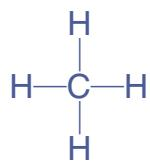

有机化合物中的每个碳原子不仅能与其他原子形成4个共价键，而且碳原子与碳原子之间也能形成共价键，可以形成单键、双键或三键。 

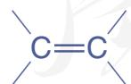

图7-1 碳原子之间可以形成单键、双键或三键

多个碳原子之间可以结合成碳链，也可以结合成碳环，构成有机物链状或环状的碳骨架。 

有机物分子可能只含有一个或几个碳原子，也可能含有成千上万个碳原子。含有相同碳原子数的有机物分子，可能因为碳原子间成键方式或碳骨架的不同而具有多种结构。 

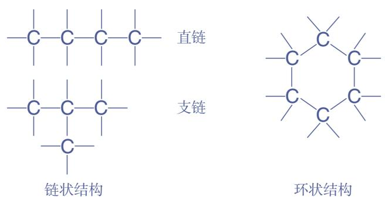

图7-2 有机化合物碳骨架的基本类型示意图

# 思考与讨论

请结合下图显示的4个碳原子相互结合的几种方式，分析以碳为骨架的有机物种类繁多的原因。 

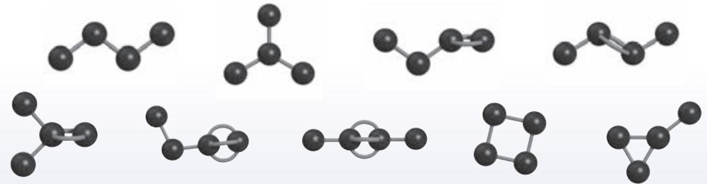

图7-3 4个碳原子相互结合的几种方式

# 资料卡片

# 使用模型研究物质结构

将微观的分子结构通过模型呈现出来，便于我们了解分子中原子的结合方式与空间位置关系，获取更多的结构信息。随着现代信息技术的发展，除了实物模型，还可以通过计算机对物质的结构进行模拟和计算。这是人们探索物质结构的重要方法，也是学习化学的直观工具。 

图7-4 鲍林 $①$ 使用模型研究物质结构

# 二、烷烃

# 1. 烷烃的结构

通过甲烷的结构式，我们可以知道甲烷分子中原子的连接顺序。那么这些原子有着怎样的空间位置关系呢？ 

烷烃 alkane 

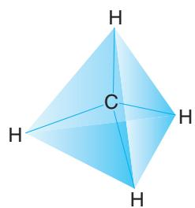

分子结构示意图

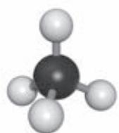

球棍模型

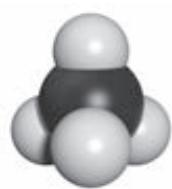

空间填充模型

图7-5 甲烷的分子结构示意图与分子结构模型

实验数据表明，甲烷分子中的5个原子不在同一平面上，而是形成了正四面体的空间结构。碳原子位于正四面体的中心，4个氢原子分别位于4个顶点。分子中的4个C—H的长度和强度相同，相互之间的夹角相等。 

# 思考与讨论

(1) 与甲烷结构相似的有机化合物还有很多, 随着分子中碳原子数的增加, 还有乙烷、丙烷、丁烷等一系列有机化合物。请根据碳原子的成键规律和下表提供的信息, 写出丁烷的结构式和乙烷、丙烷、丁烷的分子式, 并由此归纳这类有机化合物分子式的通式。 

<table><tr><td>有机化合物</td><td>乙烷</td><td>丙烷</td><td>丁烷</td></tr><tr><td>分子中碳原子数</td><td>2</td><td>3</td><td>4</td></tr><tr><td>结构式</td><td>HH
H-C-C-H
HH</td><td>HH
H-C-C-C-H
HH</td><td></td></tr><tr><td>分子式</td><td></td><td></td><td></td></tr></table>

(2) 与同学交流, 比较大家写出的丁烷的结构式是否相同, 思考产生这种现象的可能原因。 

(3) 结合图7-6中的分子结构模型, 总结这类有机化合物的组成和分子结构特点。 

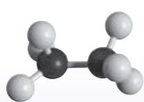

乙烷

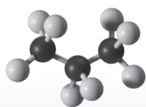

丙烷

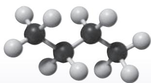

丁烷

图7-6 乙烷、丙烷和丁烷的分子结构模型

以上这些有机化合物只含有碳和氢两种元素，分子中的碳原子之间都以单键结合，碳原子的剩余价键均与氢原子结合，使碳原子的化合价都达到“饱和”。这样的一类有机化合物称为饱和烃，也称为烷烃。 

烷烃中最简单的是甲烷，其余随碳原子数的增加，依次为乙烷、丙烷、丁烷等。碳原子数不多于10时，以甲、乙、丙、丁、戊、己、庚、辛、壬、癸依次代表碳原子数；碳原子数在10以上时，以汉字数字代表，如“十一烷”。为了书写方便，有机物通常用结构简式表示，如乙烷、丙烷和十一烷的结构简式可以分别表示为 $\mathrm{CH}_3\mathrm{CH}_3$ 产 $\mathrm{CH}_3\mathrm{CH}_2\mathrm{CH}_3$ 和 $\mathrm{CH}_3(\mathrm{CH}_2)_9\mathrm{CH}_3$ 。 

从以上几种烷烃的结构简式可以看出，相邻烷烃分子在组成上均相差一个 $\mathrm{CH}_2$ 原子团，如果链状烷烃中的碳原子数为 $n$ ，氢原子数就是 $2n + 2$ ，其分子式可以用通式 $\mathrm{C}_n\mathrm{H}_{2n + 2}$ 表示。像这些结构相似，在分子组成上相差一个或若干个 $\mathrm{CH}_2$ 原子团的化合物互称为同系物。 

甲烷、乙烷和丙烷的结构各只有一种，丁烷却有两种不同的结构（如图7-7），一种是碳原子形成直链的正丁烷，另一种是带有支链的异丁烷。二者的组成虽然相同，但分子中原子的结合顺序不同，分子结构不同，因此性质就存在一定差异，是两种不同的化合物。 

像这种化合物具有相同的分子式，但具有不同结构的现象称为同分异构现象，具有同分异构现象的化合物互称为同分异构体。随着碳原子数的增加，烷烃的同分异构体的数目也就越多。例如，戊烷有3种，己烷有5种，而癸烷则有75种之多。同分异构现象的广泛存在也是有机物种类繁多的重要原因之一。 

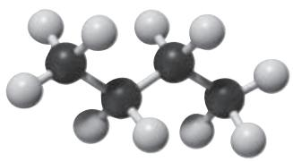

正丁烷

（熔点-138.4℃，沸点-0.5℃）

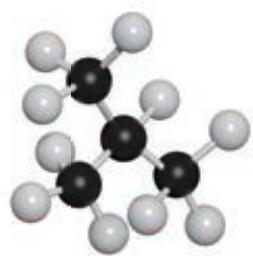

异丁烷

（熔点-159.4℃，沸点-11.6℃）

图7-7 正丁烷和异丁烷的分子结构模型

饱和烃 

saturated hydrocarbon 

同分异构现象 isomerism 

同分异构体 isomer 

# 2. 烷烃的性质

# 思考与讨论

天然气、沼气和煤层气的主要成分是甲烷；护肤品、医用软膏中的“凡士林”和蜡烛、蜡笔中的石蜡，其主要成分是含碳原子数较多的烷烃。请结合生活经验和初中化学的有关知识，想一想烷烃可能具有哪些性质。 

# 数据

甲烷 

熔点：-182℃ 

沸点：-164℃ 

密度： $0.717\mathrm{g / L}$ 

烷烃均为难溶于水的无色物质，其熔点、沸点和密度一般随着分子中碳原子数的增加（同时相对分子质量也在增大）而升高，在常温下的状态由气态变为液态，再到固态。 

在通常情况下，烷烃比较稳定，与强酸、强碱或高锰酸钾等强氧化剂不发生反应。但物质的稳定性是相对的，在特定条件下，烷烃也会发生某些反应。 

与甲烷类似，烷烃可以在空气中完全燃烧，发生氧化反应，生成二氧化碳和水，并放出大量的热。这是烷烃被用作燃料时发生的主要反应。 

$$
\begin{array}{l} \mathrm {C H} _ {4} + 2 \mathrm {O} _ {2} \xrightarrow {\text {点 燃}} \mathrm {C O} _ {2} + 2 \mathrm {H} _ {2} \mathrm {O} \\ \mathrm {C} _ {3} \mathrm {H} _ {8} + 5 \mathrm {O} _ {2} \xrightarrow {\text {点 燃}} 3 \mathrm {C O} _ {2} + 4 \mathrm {H} _ {2} \mathrm {O} \\ \end{array}
$$

# 资料卡片

煤矿中的爆炸事故多与甲烷气体爆炸有关。为了保证安全生产，必须采取通风、严禁烟火等措施。 

烷烃在较高温度下会发生分解。这个性质常被应用于石油化工和天然气化工生产中，从烷烃可得到一系列重要的化工基本原料和燃料。 

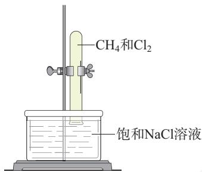

图7-8 甲烷与氯气反应

# 【实验7-1】

取两支试管, 均通过排饱和 $\mathrm{NaCl}$ 溶液的方法收集半试管 $\mathrm{CH}_{4}$ 和半试管 $\mathrm{Cl}_{2}$ , 分别用铁架台固定好 (如图 7-8)。将其中一支试管用铝箔套上, 另一支试管放在光亮处 (不要放在日光直射的地方)。静置, 比较两支试管内的现象。 

在室温下，甲烷与氯气的混合气体无光照时不发生反应。光照时，试管内气体颜色逐渐变浅，试管壁出现油状液滴，试管内水面上升。甲烷与氯气发生了化学反应： 

一氯甲烷（沸点： $-24.2\%$ ）

生成的一氯甲烷在常温下是气体，可与氯气进一步反应，依次又生成了二氯甲烷、三氯甲烷（氯仿）和四氯甲烷（四氯化碳）。这4种产物都不溶于水，三氯甲烷和四氯甲烷是工业上重要的有机溶剂。 

二氯甲烷（沸点： $39.8\%$ ）

三氯甲烷（沸点： $61.7\%$ ）

四氯甲烷（沸点： $76.5\%$ ）

在上述反应中，甲烷分子中的4个氢原子被氯原子逐一替代，生成4种不同的取代产物。像这样，有机物分子里的某些原子或原子团被其他原子或原子团所替代的反应叫做取代反应。烷烃在一定条件下，可以与卤素单质发生取代反应。 

烷烃是一类最基本的有机物，从结构上可以看作其他各类有机物的母体。烷烃的性质在一定程度上体现了有机物的通性。与无机物相比，大多数有机物的熔点比较低，且难溶于水，易溶于汽油、乙醇、苯等有机溶剂；大多数有机物容易燃烧，受热会发生分解；有机物的化学反应比较复杂，常伴有副反应发生，很多反应需要在加热、光照或使用催化剂的条件下进行。有机物除了有以上通性，依据其组成和结构的不同，还具有很多特性，我们在以后的学习中会逐步接触。 

取代反应 

substitution reaction 

# 练习与应用

1. 在有机化合物中, 碳原子既可以与其他元素的原子形成共价键, 也可以相互成键。两个碳原子之间可以形成的共价键的类型有________、________和________; 多个碳原子可以相互结合, 形成的碳骨架的类型有________和________。 

2. 在甲烷分子中, 碳原子以最外层的____个电子分别与氢原子形成____个____键。甲烷分子中的5个原子不在同一平面上, 而是形成了____的空间结构: 碳原子位于_____, 氢原子位于______; 分子中的4个C—H的长度和强度_____, 相互之间的夹角______。 

3. 下列气体的主要成分不是甲烷的是（ ）。 

A. 沼气 

B. 天然气 

C. 煤气 

D. 煤层气 

4. 烷烃分子中的碳原子与其他原子的结合方式是（ ）。 

A. 形成4对共用电子对 

B. 通过非极性键 

C. 通过两个共价键 

D. 通过离子键和共价键 

5. 正丁烷与异丁烷互为同分异构体的依据是（ ）。 

A. 具有相似的化学性质 

B. 相对分子质量相同, 

但分子的空间结构不同。 

C. 具有相似的物理性质 

D. 分子式相同, 但分子内碳原子的连接方式不同 

6. 在一定条件下，下列物质可与甲烷发生化学反应的是（ ）。 

A. $\mathrm{Cl}_2$ 

B. 浓硫酸 

C. ${\mathrm{O}}_{2}$ 

D. 酸性 $\mathrm{KMnO}_4$ 溶液 

7. 戊烷有三种同分异构体，分别是正戊烷、异戊烷和新戊烷。请参考图 7-7，写出它们的结构简式。 

8. 某种烷烃完全燃烧后生成了 $17.6 \mathrm{~g} \mathrm{CO}_{2}$ 和 $9.0 \mathrm{~g} \mathrm{H}_{2} \mathrm{O}$ 。请据此推测其分子式，并写出可能的结构简式。 

9. 天然气和煤气是常见的气体燃料，被人们广泛应用于工业生产和日常生活中。 

（1）查阅资料，了解煤气的主要成分和生产方法。 

(2) 写出天然气、煤气的主要成分在完全燃烧时发生反应的化学方程式。 

(3) 根据以上反应, 在相同条件下燃烧等体积的天然气和煤气, 消耗氧气体积较大的是哪一种? 

(4) 某灶具原来使用的燃料是煤气, 如果改用天然气, 其进风口应改大还是改小? 如不进行调节,可能产生什么后果? 

10. 甲烷是最简单的有机化合物，很早就被人类发现。然而化学家为搞清楚甲烷的结构却用了上百年的时间，其间曾相继提出下列图示来表示甲烷的结构： 

请分析以上图示所蕴含的化学信息，与同学交流讨论，并对其进行评价，从中体验人类对物质结构认识不断深化的探索历程。 

# 第二节

# 乙烯与有机高分子材料

乙烯是石油化学工业重要的基本原料，通过一系列化学反应，可以从乙烯得到有机高分子材料、药物等成千上万种有用的物质。乙烯的用途广泛，其产量可以用来衡量一个国家石油化学工业的发展水平。 

# 一、乙烯

乙烯是一种无色、稍有气味的气体，密度比空气的略小，难溶于水。乙烯的分子式是 $\mathrm{C}_2\mathrm{H}_4$ ，结构式是 $\mathrm{H}$ $\mathrm{C} = \mathrm{C}$ H，其分子中的氢原子数少于乙烷分子中的氢原子数，碳原子的价键没有全部被氢原子“饱和”。 

乙烯分子中含有碳碳双键，在组成和结构上与只含碳碳单键和碳氢键的烷烃有较大差异，因此在性质上也有很多不同。碳碳双键使乙烯表现出较活泼的化学性质。 

# 1. 氧化反应

# 【实验7-2】
(1) 点燃纯净的乙烯, 观察燃烧时的现象。 

(2) 将乙烯通入盛有酸性高锰酸钾溶液的试管中, 观察现象。 

乙烯能在空气中燃烧，火焰明亮且伴有黑烟，生成二氧化碳和水，同时放出大量的热。 

$$
\mathrm {C} _ {2} \mathrm {H} _ {4} + 3 \mathrm {O} _ {2} \xrightarrow {\text {点 燃}} 2 \mathrm {C O} _ {2} + 2 \mathrm {H} _ {2} \mathrm {O}
$$

图7-9 乙烯的分子结构模型

# 数据

乙烯 

熔点：-169℃ 

沸点：-104℃ 

密度： $1.25\mathrm{g / L}$ 

图7-10 乙烯与高锰酸钾反应

乙烯可使酸性高锰酸钾溶液褪色，被高锰酸钾等氧化剂氧化。 

图7-11 乙烯与溴反应

# 2. 加成反应

# 【实验7-3】

将乙烯通入盛有溴的四氯化碳溶液的试管中, 观察现象。 

乙烯与溴发生化学反应，使溴的四氯化碳溶液褪色。反应中，乙烯双键中的一个键断裂，两个溴原子分别加在两个价键不饱和的碳原子上，生成无色的1,2-二溴乙烷①液体。 

1,2-二溴乙烷

乙烯 ethene 

加成反应 addition reaction 

这种有机物分子中的不饱和碳原子与其他原子或原子团直接结合生成新的化合物的反应叫做加成反应。 

乙烯不仅可以与溴发生加成反应，在一定条件下，还可以与氯气、氢气、氯化氢和水等物质发生加成反应。 

$$
\mathrm {C H} _ {2} = \mathrm {C H} _ {2} + \mathrm {H} _ {2} \xrightarrow [ \triangle ]{\text {催 化 剂}} \mathrm {C H} _ {3} - \mathrm {C H} _ {3}
$$

$$
\mathrm {C H} _ {2} = \mathrm {C H} _ {2} + \mathrm {H} - \mathrm {O H} \xrightarrow [ \text {加 热 、 加 压} ]{\text {催 化 剂}} \mathrm {C H} _ {3} - \mathrm {C H} _ {2} - \mathrm {O H}
$$

工业上可以利用乙烯与水的加成反应制取乙醇。 

# 3. 聚合反应

在适当的温度、压强和催化剂存在的条件下，乙烯分子中碳碳双键中的一个键断裂，分子间通过碳原子相互结合形成很长的碳链，生成相对分子质量很大的聚合物——聚乙烯。 

$$
\mathrm {C H} _ {2} = \mathrm {C H} _ {2} + \mathrm {C H} _ {2} = \mathrm {C H} _ {2} + \mathrm {C H} _ {2} = \mathrm {C H} _ {2} + \dots \xrightarrow {\text {催 化 剂}}
$$

$$
\dots \mathrm {C H} _ {2} \mathrm {C H} _ {2} \mathrm {C H} _ {2} \mathrm {C H} _ {2} \mathrm {C H} _ {2} \mathrm {C H} _ {2} \mathrm {C H} _ {2} \dots
$$

这个反应还可以用下式表示： 

$$
n \mathrm {C H} _ {2} = \mathrm {C H} _ {2} \xrightarrow [ \text {聚 乙 烯} ]{\text {催 化 剂}} \left[ \mathrm {C H} _ {2} - \mathrm {C H} _ {2} \right] _ {n}
$$

像这样，由相对分子质量小的化合物分子互相结合成相对分子质量大的聚合物的反应叫做聚合反应。聚合反应在有机高分子材料的生产中有着广泛的应用。乙烯的聚合反应同时也是加成反应，这样的反应又被称为加成聚合反应，简称加聚反应。 

聚合反应生成的高分子是由较小的结构单元重复连接而成的。例如，聚乙烯分子可以用 $\left[\mathrm{CH}_{2}-\mathrm{CH}_{2}\right]_{n}$ 来表示，其中重复的结构单元“— $\mathrm{CH}_{2}-\mathrm{CH}_{2}-$ ”称为链节，链节的数目 $n$ 称为聚合度。能合成高分子的小分子物质称为单体，乙烯就是聚乙烯的单体。 

图7-12 聚乙烯的分子结构模型（局部）

# 二、烃

有机化合物都含有碳元素，还常含有氢、氧，以及氮、卤素、硫、磷等元素。其中仅含碳和氢两种元素的有机化合物称为碳氢化合物，也称为烃。 

根据烃分子中碳原子间成键方式的不同，可以对烃进行分类，如图7-13所示。分子中的碳原子之间只以单键结合，剩余价键均被氢原子“饱和”的烃称为饱和烃，即烷烃；分子中碳原子的价键没有全部被氢原子“饱和”的烃称为不饱和烃，其中分子中含有碳碳双键的称为烯烃，含有碳碳三键的称为炔烃，含有苯环的称为芳香烃。根据碳骨架的不同，还可以将烃分为链状烃和环状烃。 

聚合反应 polymerization 加聚反应 additionpolymerization 

# 信息搜索

除了被用作化工原料，乙烯还可以调节植物生长，可用于催熟果实。在两个透明的塑料袋中各放一个未成熟的水果，向其中的一个袋子里再放一个成熟的水果，将袋口密封，观察并比较水果的变化。请查阅资料，与同学交流，解释以上现象。 

碳氢化合物（烃） 

hydrocarbon 

不饱和烃 

unsaturated hydrocarbon 

烯烃 alkene 

炔烃 alkyne 

芳香烃 

aromatic hydrocarbon 

乙炔 acetylene 

苯 benzene 

除了烯烃，炔烃也是一类重要的不饱和烃，乙炔是最简单的炔烃。苯是芳香烃的母体，是一种具有环状分子结构的不饱和烃，其结构式习惯上简写为 $\bigcirc$ 。实际上苯分子中6个碳原子之间的键完全相同，所以也常用 $\bigcirc$ 来表示苯分子的结构。 

图7-13 烃的分类

# 探究

# 烃的分子结构

# 【目的】

以甲烷、乙烯和乙炔为例，借助模型认识烃的分子结构。 

# 【活动】

(1) 根据碳原子的成键规律和甲烷、乙烯、乙炔的结构式, 写出三者的电子式,并讨论其分子中有哪些类型的化学键。 

(2) 结合以上分析, 使用分子结构模型 (或橡皮泥、黏土、泡沫塑料、牙签等代用品) 搭建甲烷、乙烯和乙炔分子的球棍模型。展示并描述三者的分子结构特点。 

记录： 

<table><tr><td>烃</td><td>甲烷</td><td>乙烯</td><td>乙炔</td></tr><tr><td>电子式</td><td></td><td></td><td></td></tr><tr><td>化学键</td><td></td><td></td><td></td></tr><tr><td>分子结构特点</td><td></td><td></td><td></td></tr></table>

# 【问题和讨论】

(1) 比较甲烷和乙烯的化学性质, 分析其与二者的分子结构之间存在哪些联系,与同学讨论。 

(2) 乙炔是甲烷或乙烯的同系物吗? 为什么? 

# 科学史话

# 芳香族化合物与苯

芳香族化合物是一种习惯说法。历史上芳香族化合物是一类从植物中提取的具有芳香气味的物质。现在这个名称已失去了原来的意义，一般指分子中含有苯环的有机物，它们并不一定有香味。 

苯是芳香族化合物的母体，是一种重要的有机化工原料和有机溶剂，被广泛用于生产医药、农药、香料、染料、洗涤剂和合成高分子材料等。早在19世纪初，英国科学家法拉第（M. Faraday，1791—1867）就发现了苯，并将其称为“氢的重碳化合物”。后来，法国化学家热拉尔（C.-F. Gerhardt，1816—1856）等人又确定了苯的相对分子质量为78，分子式为 $\mathrm{C_6H_6}$ 。苯分子中氢的相对含量如此之低，看上去是高度不饱和的化合物，应具有比较活泼的化学性质。然而实验事实却否定了以上推测，这使化学家们感到惊讶。苯 

到底具有怎样的特殊结构呢？ 

奥地利化学家洛施密特（J.Loschmidt，1821—1895）曾提出苯具有环状结构。德国化学家凯库勒（F.A.Kekulé，1829—1896）在分析了大量实验事实后认为，苯分子中6个碳原子之间的结合非常牢固，形成了一个很稳定的“核”，可以与其他碳原子相连形成芳香族化合物；而这个稳定的“核”具有闭合的环状结构，由碳原子以单、双键相互交替结合而成（ $\left\langle \right\rangle$ ，习惯上称之为凯库勒式）。 

苯的结构的提出具有划时代的意义，有力地推动了有机化学的发展。然而凯库勒式仍存在一定局限。现在人们知道，苯分子具有平面正六边形结构，相邻碳原子之间的键完全相同，其键长介于碳碳单键和碳碳双键的键长之间。 

# 三、有机高分子材料

材料是现代社会发展的重要支柱。除了我们学过的金属材料和无机非金属材料，还有一大类非常重要的材料——有机高分子材料，其全球年产量已超过3亿吨， 

相应的体积超过了同时期生产的钢铁的体积。有机高分子材料在生活和生产的各领域中都有极为广泛的应用。 

人们很早就开始使用的棉花、羊毛、天然橡胶等属于天然有机高分子材料，现在使用更多的则是塑料、合成纤维、合成橡胶、黏合剂、涂料等合成有机高分子材料。 

# 1. 塑料

塑料的主要成分是合成树脂，像聚乙烯、聚丙烯、聚氯乙烯、酚醛树脂等都是生产塑料的合成树脂。此外，人们还根据需要加入一些具有特定作用的添加剂，如能提高塑性的增塑剂，防止塑料老化的防老剂，以及增强材料、着色剂等，再经过压制等加工处理，才能得到各种塑料制品。塑料具有强度高、密度小、耐腐蚀、易加工等优良的性能，在日常生活和工业生产中大量代替了钢铁、木材等传统材料。塑料的品种很多，用途也各不相同。 

表 7-1 几种常见塑料的性能与主要用途

<table><tr><td>名称</td><td>性能</td><td colspan="2">主要用途</td></tr><tr><td>聚乙烯(英文缩写:PE)</td><td>绝缘性好,耐化学腐蚀,耐寒,无毒;耐热性差,容易老化</td><td>可制成薄膜,用于食品、药物的包装材料,以及日常用品、绝缘材料等</td><td>聚乙烯制成的食品包装袋</td></tr><tr><td>聚氯乙烯(英文缩写:PVC)</td><td>绝缘性好,耐化学腐蚀,机械强度较高;热稳定性差</td><td>可制成薄膜、管道、日常用品、绝缘材料等</td><td>聚氯乙烯可制成电线外面的绝缘层</td></tr><tr><td>聚苯乙烯(英文缩写:PS)</td><td>绝缘性好,耐化学腐蚀,无毒;质脆,耐热性差</td><td>可制成日常用品、绝缘材料,还可制成泡沫塑料用于防震、保温、隔音</td><td>聚苯乙烯制成的泡沫包装材料</td></tr><tr><td>聚四氟乙烯(英文缩写:PTFE)</td><td>耐化学腐蚀,耐溶剂性好,耐低温、高温,绝缘性好;加工困难</td><td>可制成化工、医药等行业使用的耐腐蚀、耐高温、耐低温制品</td><td>聚四氟乙烯制成的实验仪器</td></tr><tr><td>聚丙烯(英文缩写:PP)</td><td>机械强度较高,绝缘性好,耐化学腐蚀,无毒;低温发脆,容易老化</td><td>可制成薄膜、管道、日常用品、包装材料等</td><td>聚丙烯制成的管道</td></tr><tr><td>聚甲基丙烯酸甲酯(俗称有机玻璃,英文缩写:PMMA)</td><td>透光性好,易加工;耐磨性较差,能溶于有机溶剂</td><td>可制成飞机和车辆的风挡、光学仪器、医疗器械、广告牌等</td><td>有机玻璃制成的飞机风挡</td></tr><tr><td>脲醛塑料(俗称电玉,英文缩写:UF)</td><td>绝缘性好,耐溶剂性好;不耐酸</td><td>可制成电器开关、插座及日常用品等</td><td>脲醛塑料制成的电器插座</td></tr></table>

# 2. 橡胶

橡胶是一类具有高弹性的高分子材料，是制造汽车、飞机轮胎和各种密封材料所必需的原料。人们很早就知道从橡胶树等植物中获得天然橡胶，但天然橡胶远不能满足人们的需要，于是化学家开始研究如何用化学方法人工合成橡胶。经过分析发现，天然橡胶的主要成分是聚异戊二烯。 

图7-14 硫化后的橡胶适合制造轮胎，加入炭黑可提高轮胎的耐磨性

通过模仿天然橡胶的分子组成和结构，人们以异戊二烯为单体进行聚合反应，制得了异戊橡胶。异戊橡胶的性能与天然橡胶十分接近，又被称为合成天然橡胶。随着技术的发展，人们还开发了丁苯橡胶、顺丁橡胶、氯丁橡胶等一系列合成橡胶。 

许多橡胶具有线型结构，有一定弹性，但强度和韧性差。为了克服这些缺点，工业上常用硫与橡胶作用进行橡胶硫化，使线型的高分子链之间通过硫原子形成化学键，产生交联，形成网状结构。硫化橡胶具有更好的强度、韧性、弹性和化学稳定性。人们还开发了耐热和耐酸、碱腐蚀的氟橡胶，耐高温和严寒的硅橡胶等特种橡胶。特种橡胶在航空、航天和国防等尖端技术领域中发挥着重要的作用。 

图7-15 橡胶消声瓦可有效降低潜艇航行时的噪声，提高潜艇的隐蔽性

# 3. 纤维

人类用棉花、羊毛、蚕丝和麻等天然纤维纺纱织布已有悠久的历史，但天然纤维无论是在产量上还是在质量上都不能满足人类的需要。随着化学科学的发展，人类开始用化学方法将农林产品中的纤维素、蛋白质等天然高分子加工成黏胶纤维、大豆蛋白纤维等再生纤维，后来发展到以石油、天然气和煤等为原料制成有机小分子单体， 

再经聚合反应生产合成纤维。再生纤维与合成纤维统称为化学纤维。 

常见的合成纤维有聚丙烯纤维（丙纶）、聚氯乙烯纤维（氯纶）、聚丙烯腈纤维（腈纶）、聚对苯二甲酸乙二酯纤维（涤纶）和聚酰胺纤维（锦纶、芳纶）等。合成纤维具有强度高、弹性好、耐磨、耐化学腐蚀、不易虫蛀等优良性能，除了供人类穿着外，还可以制成绳索、渔网、工业用滤布，以及飞机、船舶的结构材料等，广泛应用于工农业生产的各个领域。 

图7-16“神舟”飞船航天员穿的航天服使用了多种合成纤维

# 思考与讨论

请利用图示或表格等形式，对学过的常见材料进行归纳和分类，并注明其性能特点和主要用途。 

# 科学·技术·社会

# 黏合剂和涂料

黏合剂又称胶黏剂，日常生活中常用的糊、胶水就是最普通的黏合剂。黏合剂根据来源可分为天然黏合剂和合成黏合剂。人们很早就使用动物的皮或鱼鰻熬胶，用于黏结木材。合成黏合剂的黏结力强，性能优异，得到了广泛的应用。近几十年来，汽车、电子等行业的发展对黏合剂的性能提出了更高的要求，一系列具有耐高温、耐低温、导电、导磁和导热等性能的特种黏合剂相继问世。 

涂料是一类含有机高分子的混合液或粉末，能在物体表面形成附着坚固的涂膜，油漆就是一种常见的涂料。涂料可用于建筑、 

船舶、车辆，以及家电、家具的保护和装饰。特种涂料在化工、航空等领域具有重要的用途。 

图7-17 我国研制的高性能歼击机使用了隐形涂料

1. 乙烯与甲烷在分子结构上的主要差异是________。乙烯的化学性质与甲烷的相比，较为________。乙烯属于________（填“饱和烃”或“不饱和烃”），在一定条件下可以发生________反应和________反应。 

2. 下列过程中发生的化学反应属于加成反应的是（ ）。 

A. 用光照射甲烷与氯气的混合气体 

B. 将乙烯通入溴的四氯化碳溶液中 

C. 在镍做催化剂的条件下, 乙烯与氢气反应 

D. 甲烷在空气中不完全燃烧 

3. 根据乙烯的性质可以推测丙烯（ $\mathrm{CH}_2=\mathrm{CH}-\mathrm{CH}_3$ ）的性质，下列说法错误的是（ ）。 

A. 丙烯能使酸性高锰酸钾溶液褪色 

B. 丙烯能在空气中燃烧 

C. 丙烯与溴发生加成反应的产物是 $\mathrm{CH}_{2} \mathrm{Br}-\mathrm{CH}_{2}-\mathrm{CH}_{2} \mathrm{Br}$ 

D. 聚丙烯的结构可以表示为 $\left[\mathrm{CH}_{2}-\mathrm{CH}\right]_{n}$ CH3 

4. 下列叙述正确的是（ ）。 

A. 高分子材料能以石油、煤等化石燃料为原料进行生产 

B. 聚乙烯的分子中含有碳碳双键 

C. 高分子材料中的有机物分子均呈链状结构 

D. 橡胶硫化的过程中发生了化学反应 

5. 下列反应中, 属于取代反应的是 (填序号, 下同), 属于氧化反应的是 , 属于加成反应的是 

$①$ 由乙烯制乙醇 

② 乙烷在空气中燃烧 

(3) 乙烯使溴的四氯化碳溶液褪色 

(4) 乙烯使酸性高锰酸钾溶液褪色 

⑤ 乙烷在光照下与氯气反应 

6. 比较甲烷与氯气、乙烯与溴的反应，以及甲烷和乙烯在空气中燃烧时发生的反应，将反应类型、反应条件、生成物和反应时发生的现象填入下表。 

<table><tr><td>反应物</td><td>反应类型</td><td>反应条件</td><td>生成物</td><td>现象</td></tr><tr><td>甲烷、氯气</td><td></td><td></td><td></td><td></td></tr><tr><td>乙烯、溴</td><td></td><td></td><td></td><td></td></tr><tr><td>甲烷、氧气</td><td></td><td></td><td></td><td></td></tr><tr><td>乙烯、氧气</td><td></td><td></td><td></td><td></td></tr></table>

7. 请写出以下反应的化学方程式。 

（1）乙烯与氯气发生加成反应。 

（2）乙烯与氯化氢发生加成反应。 

（3）氯乙烯（ $\mathrm{CH}_2 = \mathrm{CHCl}$ ）发生加聚反应生成聚氯乙烯。 

8. 汽车车身两侧遮罩车轮的挡板（翼子板），传统上多使用金属材料制造，现在已有塑料材质的问世。这种改变可能有哪些好处？请查阅资料，结合塑料的性能进行说明，并了解汽车上还有哪些部件使用了有机高分子材料。 

# 第三节

# 乙醇与乙酸

人们很早就知道用粮食或水果发酵生产酒和醋。酒中含有的乙醇和醋中含有的乙酸是两种常见的有机化合物。 

# 一、乙醇

早在几千年前，人类就掌握了发酵法酿酒的技术。各种酒类都含有浓度不等的乙醇，故乙醇俗称酒精。乙醇是无色、有特殊香味的液体，密度比水的小，易挥发。乙醇是一种重要的有机溶剂，能够溶解多种有机物和无机物，并能与水以任意比例互溶。 

乙醇的分子式是 $\mathrm{C}_{2} \mathrm{H}_{6} \mathrm{O}$ , 结构式为: 

可简写为 $\mathrm{CH}_3\mathrm{CH}_2\mathrm{OH}$ 或 $\mathrm{C}_2\mathrm{H}_5\mathrm{OH}$ , 其中的一OH原子团称为羟基。乙醇可以看成是乙烷分子中的一个氢原子被羟基取代后的产物。像这样, 烃分子中的氢原子被其他原子或原子团所取代而生成的一系列化合物称为烃的衍生物。前面提及的一氯甲烷、二氯甲烷和1,2-二溴乙烷等卤代烃也属于烃的衍生物。烃的衍生物与其母体化合物相比, 其性质因分子中取代基团的存在而不同。 

# 1. 乙醇与钠反应

# 【实验7-4】

在盛有少量无水乙醇的试管中，加入一小块新切的、 

# 数据

乙醇 

熔点：-117℃ 

沸点： $78.5\,^{\circ}\mathrm{C}$ 

密度： $0.789\mathrm{g / cm}^3$ 

图7-18 乙醇的分子结构模型

乙醇 ethanol 

烃的衍生物 

derivative of hydrocarbon 

图7-19 乙醇与钠反应

官能团 functional group 

# i 提示

烃分子失去1个氢原子后所剩余的部分叫做烃基，可以用—R来表示。如—CH3叫甲基，一 $\mathrm{CH}_2\mathrm{CH}_3$ 叫乙基。烃的衍生物分子一般可以看成是烃基和官能团相互结合组成的。例如，乙醇分子可以看成是由乙基和羟基组成的： $\mathrm{CH}_3\mathrm{CH}_2\div \mathrm{OH}$ 

图7-20 乙醇的催化氧化

用滤纸吸干表面煤油的钠，在试管口迅速塞上带尖嘴导管的橡胶塞，用小试管收集气体并检验其纯度，然后点燃（如图7-19），再将干燥的小烧杯罩在火焰上。待烧杯壁上出现液滴后，迅速倒转烧杯，向其中加入少量澄清石灰水。观察现象，并与前面做过的水与钠反应的实验现象进行比较。 

与烷烃不同，乙醇由于分子中羟基的存在，可以与钠发生反应。在该反应中，钠置换了羟基中的氢，生成了氢气和乙醇钠。 

$$
2 \mathrm {C H} _ {3} \mathrm {C H} _ {2} \mathrm {O H} + 2 \mathrm {N a} \longrightarrow 2 \mathrm {C H} _ {3} \mathrm {C H} _ {2} \mathrm {O N a} + \mathrm {H} _ {2} \uparrow
$$

乙醇羟基中的氢原子不如水分子中的氢原子活泼。实验现象表明，乙醇与钠的反应比相同条件下水与钠的反应缓和得多。 

乙醇具有与乙烷不同的性质，从分子结构角度分析，是因为取代氢原子的羟基对乙醇的性质产生了影响。像这种决定有机化合物特性的原子或原子团叫做官能团。羟基是醇类物质的官能团，碳碳双键和碳碳三键分别是烯烃和炔烃的官能团。 

# 2. 氧化反应

乙醇在空气中燃烧时生成二氧化碳和水，同时放出大量的热。 

$$
\mathrm {C H} _ {3} \mathrm {C H} _ {2} \mathrm {O H} + 3 \mathrm {O} _ {2} \xrightarrow {\text {点 燃}} 2 \mathrm {C O} _ {2} + 3 \mathrm {H} _ {2} \mathrm {O}
$$

在一定条件下，乙醇还能被氧化为其他产物。 

# 【实验7-5】

向试管中加入少量乙醇，取一根铜丝，下端绕成螺旋状，在酒精灯上灼烧后插入乙醇，反复几次。注意观察反应现象，小心地闻试管中液体产生的气味。 

乙醇在加热和有催化剂（如铜或银）存在等条件下，可以被空气中的氧气氧化为乙醛（ $\mathrm{CH}_3\mathrm{CHO}$ ）。 

$$
2 \mathrm {C H} _ {3} \mathrm {C H} _ {2} \mathrm {O H} + \mathrm {O} _ {2} \xrightarrow [ \triangle ]{\text {催 化 剂}} 2 \mathrm {C H} _ {3} \mathrm {C H O} + 2 \mathrm {H} _ {2} \mathrm {O}
$$

O 乙醛的官能团是醛基（一C—H，或写作一CHO），在适当条件下乙醛可以被氧气进一步氧化，生成乙酸 $\mathrm{(CH_3COOH)}$ 

乙醇还可以与酸性高锰酸钾溶液或酸性重铬酸钾 $\left(\mathrm{K}_{2} \mathrm{Cr}_{2} \mathrm{O}_{7}\right)$ 溶液反应，被氧化成乙酸。 

乙醇可用作燃料，还是重要的有机化工原料和溶剂，用于生产医药、香料、化妆品、涂料等。医疗上常用 $75\%$ （体积分数）的乙醇溶液作消毒剂。 

乙醛 acetaldehyde 

乙酸 aceticacid 

# 资料卡片

酒类产品标签中的酒精度是指乙醇的体积分数，白酒一般在 $25\% \sim 68\%$ ，啤酒一般在 $3\% \sim 5\%$ 。乙醇进入人体后，会在肝中通过酶的催化作用被氧化为乙醛和乙酸，最终被氧化为二氧化碳和水。过量饮酒会加重肝负担，血液中较高浓度的乙醇和乙醛也会对人体产生毒害作用。 

# 二、乙酸

食醋是生活中常见的调味品，其中含有 $3\% \sim 5\%$ 的乙酸，所以乙酸又被称为醋酸。乙酸是有强烈刺激性气味的无色液体。当温度低于熔点时，乙酸可凝结成类似冰的晶体，所以纯净的乙酸又叫冰醋酸。乙酸易溶于水和乙醇。 

乙酸是烃的含氧衍生物，分子式为 $\mathrm{C}_2\mathrm{H}_4\mathrm{O}_2$ ，结构简式为 $\mathrm{CH}_3\mathrm{COOH}$ 。乙酸的官能团是羧基（一C—OH，或写作一COOH）。乙酸的化学性质主要由其分子中的羧基决定。 

# 1. 酸性

乙酸是一种重要的有机酸，具有酸性。 

# 数据

乙酸 

熔点： $16.6\mathrm{^\circ C}$ 

沸点： $118\mathrm{^\circ C}$ 

密度： $1.05\mathrm{g / cm}^3$ 

图7-21 乙酸的分子结构模型

图7-22 乙酸乙酯的制备装置示意图

# 注意

乙醇和乙酸乙酯是常用的化工原料和有机溶剂。它们在储存时应置于密闭容器，存放在阴凉、通风处，并与氧化剂、易燃物等分开存放，注意远离火种和热源。 

酯 ester 

酯化反应 

esterification reaction 

# 思考与讨论

(1) 食醋可以清除水壶中的少量水垢（主要成分是碳酸钙），这是利用了乙酸的什么性质？请写出相关反应的化学方程式。 

(2) 如何比较乙酸与碳酸、盐酸的酸性强弱？请查阅资料，与同学讨论，根据生活经验设计实验方案。 

# 2. 酯化反应

# 【实验7-6】

在一支试管中加入 $3 \mathrm{~mL}$ 乙醇, 然后边振荡试管边慢慢加入 $2 \mathrm{~mL}$ 浓硫酸和 $2 \mathrm{~mL}$ 乙酸, 再加入几片碎瓷片。连接好装置, 用酒精灯小心加热, 将产生的蒸气经导管通到饱和 $\mathrm{Na}_{2} \mathrm{CO}_{3}$ 溶液的液面上 (如图 7-22), 观察现象。 

在反应过程中，右侧试管内液体的上层有无色透明的油状液体产生，并可以闻到香味，这种有香味的液体是乙酸乙酯。该反应的化学方程式为： 

这种酸与醇反应生成酯和水的反应，叫做酯化反应。为了提高酯化反应的速率，一般需要加热，并加入浓硫酸等催化剂。酯化反应是可逆反应，乙酸乙酯会与水发生水解反应生成乙酸和乙醇。 

乙酸乙酯是酯类物质中的一种，其官能团是酯基（—C—O—R，或写作—COOR）。很多鲜花和水果的香味都来自酯，如草莓中含有乙酸乙酯和乙酸异戊酯，苹果中含有戊酸戊酯。这些分子中碳原子数较少、相对分子质量较小的低级酯具有一定的挥发性，有芳香气味，可用作饮料、糖果、化妆品中的香料和有机溶剂。 

# 三、官能团与有机化合物的分类

通过对乙烯、乙醇和乙酸性质的学习，我们认识到官能团对有机物的性质具有决定作用，含有相同官能团的有机物在性质上具有相似之处。因此我们可以根据有机物分子中所含官能团的不同，从结构和性质上对数量庞大的有机物进行分类（如表7-2）。 

表 7-2 常见的有机化合物类别、官能团和代表物

<table><tr><td>有机化合物类别</td><td>官能团</td><td>代表物</td></tr><tr><td>烷烃</td><td>-</td><td>CH4甲烷</td></tr><tr><td>烯烃</td><td>C=C碳碳双键</td><td>CH2=CH2乙烯</td></tr><tr><td>炔烃</td><td>-C≡C-碳碳三键</td><td>CH≡CH乙炔</td></tr><tr><td>芳香烃</td><td>-</td><td>苯</td></tr><tr><td>卤代烃</td><td>-C-X 碳卤键(-X 卤素原子)</td><td>CH3CH2Br 溴乙烷</td></tr><tr><td>醇</td><td>-OH 羟基</td><td>CH3CH2OH 乙醇</td></tr><tr><td>醛</td><td>O
-Cl-H 醛基</td><td>O
-Cl CH3-C-H 乙醛</td></tr><tr><td>羧酸</td><td>O
-Cl-OH 羧基</td><td>O
-Cl CH3-C-OH 乙酸</td></tr><tr><td>酯</td><td>O
-Cl-O-R 酯基</td><td>O
-Cl CH3-C-O-C2H5 乙酸乙酯</td></tr></table>

# 方法导引

# 认识有机化合物的一般思路

认识一种有机物，可先从结构入手，分析其碳骨架和官能团，了解它所属的有机物类别；再结合这类有机物的一般性质，推测该有机物可能具有的性质，并通过实验进行验证；在此基础上进一步了解该有机物的用途。另外，还可以根据有机物发生 

的化学反应，了解其在有机物转化（有机合成）中的作用。与认识无机物类似，认识有机物也体现了“结构决定性质”的观念。各类有机物在结构和性质上具有的明显规律性，有助于我们更好地认识有机物。 

# 练习与应用

1. 从结构上看，烃的衍生物是________分子中的________被________所取代的产物。含有相同官能团的有机物在性质上________，因此我们可以根据有机物分子中________的不同对有机物进行分类。 

2. 乙醇和乙酸都是烃的衍生物，其分子中的官能团分别是 和 。乙醇可以发生反应生成乙醛，乙醛的官能团是 。乙醇和乙酸在 条件下可以发生反应生成乙酸乙酯，乙酸乙酯的官能团是 

3.下列说法中正确的是（ ）。 

A. 乙醇分子中有一OH基团, 所以乙醇溶于水后溶液显碱性 

B. 乙醇与钠反应可以产生氢气, 所以乙醇溶于水后溶液显酸性 

C. 乙醇在空气中燃烧生成二氧化碳和水, 说明乙醇分子中含有 C、H、O三种元素 

D. 乙醇羟基中的氢原子比乙烷中的氢原子活泼 

4. 下列物质中不能用来鉴别乙醇和乙酸的是（ ）。 

A. 铁粉 

B. 溴水 

C. 碳酸钠溶液 

D. 紫色石蕊溶液 

5. $46 \mathrm{~g}$ 某无色液体与足量钠完全反应，得到 $11.2 \mathrm{~L}$ 氢气（标准状况），该物质可能是（ ）。 

A. $\mathrm{CH}_3\mathrm{COOH}$ 

B. $\mathrm{H}_{2} \mathrm{O}$ 

C. $\mathrm{CH}_3\mathrm{COOC}_2\mathrm{H}_5$ 

D. $\mathrm{C}_{2} \mathrm{H}_{5} \mathrm{OH}$ 

6. 请描述下列物质与水混合并静置后的现象，结合该物质的性质进行解释。 

① 溴水 

② $\mathrm{CH}_3\mathrm{CH}_2\mathrm{OH}$ 

$③$ $\mathrm{CH}_3\mathrm{COOH}$ 

$④$ $\mathrm{CCl_4}$ 

⑤ $\mathrm{CH}_3\mathrm{COOC}_2\mathrm{H}_5$ 

⑥ $\mathrm{C}_{6} \mathrm{H}_{14}$ 

7. $30 \mathrm{~g}$ 乙酸与 $46 \mathrm{~g}$ 乙醇在一定条件下发生酯化反应, 如果实际产率为 $68 \%$ , 则可得到的乙酸乙酯的质量是多少? 

8. 写出下列物质间转化的化学方程式，并注明反应条件，分析转化过程中官能团与有机物类别的变化。 

9. 人们常说 “酒是陈的香”, 而有的酒在存放过程中却会变酸。请查阅资料, 结合本节所学内容对上述现象进行解释。 

# 第四节

# 基本营养物质

生命活动需要一系列复杂的化学过程来维持，食物中的营养物质是这些过程的物质和能量基础。我们已经知道，营养物质主要包括糖类、蛋白质、油脂、维生素、无机盐和水。除了水，人们每天摄入量较大的是糖类、蛋白质和油脂这三类有机物，它们既是人体必需的基本营养物质，也是食品工业的重要原料。 

# 一、糖类

糖类是绿色植物光合作用的产物，也是人类最重要的能量来源。人们最初发现的这一类化合物的化学组成大多符合 $\mathrm{C}_n(\mathrm{H}_2\mathrm{O})_m$ 的通式，因此糖类也被称为碳水化合物。葡萄糖（ $\mathrm{C}_6\mathrm{H}_{12}\mathrm{O}_6$ ）、蔗糖（ $\mathrm{C}_{12}\mathrm{H}_{22}\mathrm{O}_{11}$ ）和淀粉 $\left[\left(\mathrm{C}_6\mathrm{H}_{10}\mathrm{O}_5\right)_n\right]$ 等都属于糖类。 

糖类 saccharide 

碳水化合物 carbohydrate 

葡萄糖 glucose 

蔗糖 sucrose 

淀粉 starch 

表 7-3 常见的糖类物质

<table><tr><td>类别</td><td>特点</td><td>代表物</td><td>代表物的分子式</td><td>代表物在自然界的存在</td><td>代表物的用途</td></tr><tr><td>单糖</td><td>不能水解为更简单的糖分子</td><td>葡萄糖、果糖</td><td>C6H12O6</td><td>葡萄糖和果糖:水果、蜂蜜</td><td>营养物质、食品工业原料</td></tr><tr><td>二糖</td><td>水解后能生成两分子单糖</td><td>蔗糖、麦芽糖、乳糖</td><td>C12H22O11</td><td>蔗糖:甘蔗、甜菜乳糖:哺乳动物的乳汁</td><td>营养物质、食品工业原料</td></tr><tr><td>多糖</td><td>水解后能生成多分子单糖</td><td>淀粉、纤维素</td><td>(C6H10O5)n</td><td>淀粉:植物的种子或块根纤维素:植物的茎、叶</td><td>淀粉:营养物质、食品工业原料纤维素:造纸和纺织工业原料</td></tr></table>

图7-23 葡萄糖与氢氧化铜反应

图7-24 葡萄糖的银镜反应

图7-25 淀粉与碘反应

葡萄糖和果糖的分子式完全相同，但分子结构不同，二者互为同分异构体。蔗糖和麦芽糖的分子式相同，结构不同，也互为同分异构体。淀粉和纤维素是天然有机高分子，分子中的结构单元数目不同，分子式不同，不能互称为同分异构体。 

葡萄糖是最重要的单糖，是构成多种二糖和多糖的基本单元。葡萄糖是一种有甜味的无色晶体，能溶于水，其分子式是 $\mathrm{C}_{6} \mathrm{H}_{12} \mathrm{O}_{6}$ ，结构简式为： 

CH2OH-CHOH-CHOH-CHOH-CHOH-CHO 

# 【实验7-7】

(1) 在试管中加入 $2 \mathrm{~mL} 10 \% \mathrm{NaOH}$ 溶液, 滴加 5 滴 $5 \% \mathrm{CuSO}_{4}$ 溶液, 得到新制的 $\mathrm{Cu(OH)}_{2}$ 。再加入 $2 \mathrm{~mL} 10 \%$ 葡萄糖溶液, 加热, 观察现象。 

(2) 在洁净的试管中加入 $1 \mathrm{~mL} 2 \% \mathrm{AgNO}_{3}$ 溶液, 然后一边振荡试管, 一边逐滴加入 $2 \%$ 氨水, 直到最初产生的沉淀恰好溶解为止, 得到银氨溶液。再加入 $1 \mathrm{~mL} 10 \%$ 葡萄糖溶液, 振荡, 然后放在水浴中加热, 观察现象。 

葡萄糖与新制的氢氧化铜反应，生成砖红色的氧化亚铜沉淀；与银氨溶液反应生成银，在试管内壁形成光亮的银镜。这两个反应可用来检验葡萄糖。 

# 资料卡片

糖尿病患者的糖代谢功能紊乱，其血液和尿液中的葡萄糖含量会超出正常范围。测定患者血液或尿液中的葡萄糖含量有助于判断病情，可使用根据葡萄糖特征反应原理制备的试纸进行测试。 

# 【实验7-8】

(1) 回忆生物课中学习的检验淀粉的方法。将碘溶液滴到一片馒头或土豆上, 观察现象。 

(2) 在试管中加入 $0.5 \mathrm{~g}$ 淀粉和 $4 \mathrm{~mL} 2 \mathrm{~mol} / \mathrm{L} \mathrm{H}_{2} \mathrm{SO}_{4}$ 溶液, 加热。待溶液冷却后向其中加入 $\mathrm{NaOH}$ 溶液, 将溶液 

调至碱性, 再加入少量新制的 $\mathrm{Cu}(\mathrm{OH})_{2}$ , 加热。观察并解 

释实验现象。 

蔗糖、淀粉和纤维素等在稀酸的催化下能发生水解反应，最终生成单糖。工业上一般用淀粉水解的方法生产葡萄糖。 

摄入人体内的淀粉在酶的催化作用下也可以发生逐步水解，最终生成葡萄糖。葡萄糖经缓慢氧化转变为二氧化碳和水，同时放出能量（如图7-26）。食草动物的体内有纤维素水解酶，可将纤维素水解生成葡萄糖。人体内没有类似的酶，无法吸收和利用纤维素。但食物中的纤维素能刺激肠道蠕动，有助于消化，因此人们应摄入一定量的蔬菜、水果和粗粮等含纤维素较多的食物。 

淀粉和纤维素也是重要的工业原料，二者水解生成的葡萄糖在酶的催化下可以转变为乙醇。这个转化过程被广泛应用于酿酒和利用生物质生产燃料乙醇。 

$$
\begin{array}{r} {\mathrm {C} _ {6} \mathrm {H} _ {1 2} \mathrm {O} _ {6} \xrightarrow [ \text {葡 萄 糖} ]{\text {酶}} 2 \mathrm {C} _ {2} \mathrm {H} _ {5} \mathrm {O H} + 2 \mathrm {C O} _ {2} \uparrow} \end{array}
$$

# 二、蛋白质

蛋白质是构成细胞的基本物质，存在于各类生物体内。一切重要的生命现象都与蛋白质密切相关。蛋白质是一类非常复杂的天然有机高分子，由碳、氢、氧、氮、硫等元素组成。蛋白质在酸、碱或酶的作用下能发生水解，生成多肽，多肽进一步水解，最终生成氨基酸。 

图7-26 淀粉在人体内的变化

# 信息搜索

我国人民很早就掌握了用粮食酿酒和制醋的技术。请查阅资料，了解我国酿酒和制醋的传统方法，并结合生物课中使用糯米自制米酒的实践活动，分析该过程中发生了哪些化学变化。 

# 思考与讨论

观察甘氨酸和苯丙氨酸的结构简式，辨认其中的官能团，并说明其结构的共同点。 

甘氨酸

苯丙氨酸

蛋白质 protein 

氨基酸 amino acid 

# 1.20中国邮政CHINA

人工合成硅烷牛磺酸酯五十周年（1985） 

图7-27 我国为纪念人工全合成结晶牛胰岛素五十周年而发行的邮票

氨基酸分子中都含有氨基（一 $\mathrm{NH}_2$ ）和羧基。在一定条件下，氨基酸之间能发生聚合反应，生成更为复杂的多肽，进而构成蛋白质。人体从食物中摄取的蛋白质在消化道内酶的作用下，经过水解反应生成各种氨基酸。氨基酸被吸收后可结合成人体所需要的蛋白质。研究蛋白质的结构、功能和合成对探索生命活动规律、促进人类健康具有重要意义。我国科学家于1965年在世界上首次完成了具有生命活力的蛋白质——结晶牛胰岛素的全合成，对蛋白质的研究作出了重要贡献。 

有的蛋白质能溶于水，如鸡蛋清等；有的则难溶于水，如丝、毛等。蛋白质除了可以水解为氨基酸，还具有一些其他的性质。 

图7-28 蛋白质的变性

# 【实验7-9】

(1) 向盛有鸡蛋清溶液的试管中加几滴醋酸铅溶液, 观察现象。 

(2) 向盛有鸡蛋清溶液的试管中加几滴浓硝酸, 加热,观察现象。 

（3）在酒精灯的火焰上分别灼烧一小段头发和丝织品，小心地闻气味。 

# 思考与讨论

（1）为什么医院里用高温蒸煮、紫外线照射或涂抹医用酒精等方法进行消毒？ 

（2）在生物实验室里，常用甲醛溶液（俗称福尔马林）保存动物标本。在农业上，可以用硫酸铜、生石灰和水制成波尔多液来防治农作物病害。想一想为什么。 

蛋白质在一些化学试剂，如重金属的盐类、强酸、强碱、乙醇、甲醛等，以及一些物理因素，如加热、紫外线等的作用下会发生变性，溶解度下降，并失去生理活性。蛋白质还可以与一些试剂发生显色反应，如很多蛋白质与浓硝酸作用时呈黄色，可用于蛋白质的检验。此外，蛋白质被灼烧时，会产生类似烧焦羽毛的特殊气味。 

蛋白质是人类必需的营养物质，在工业上也有很多应用。用蚕丝织成的丝绸可以制作服装；从动物皮、骨中提取的明胶可用作食品增稠剂，生产医药用胶囊和摄影用感光材料，驴皮制的阿胶还是一种中药材；从牛奶和大豆中提取的酪素可以用来制作食品和涂料。绝大多数酶也是蛋白质，是生物体内重要的催化剂，在医药、食品、纺织等领域中有重要的应用价值。 

# 三、油脂

油脂是重要的营养物质，我们日常食用的花生油、大豆油和动物油等都属于油脂。在室温下，植物油脂通常呈液态，叫做油；动物油脂通常呈固态，叫做脂肪。油脂的密度比水的小，黏度比较大，触摸时有明显的油腻感。油脂难溶于水，易溶于有机溶剂。食品工业中根据这一性质，常使用有机溶剂来提取植物种子里的油。 

油脂可以看作是高级脂肪酸与甘油（丙三醇）通过酯化反应生成的酯。其结构可以表示为： 

油脂结构中的R、R'、R"代表高级脂肪酸的烃基，可以相同或不同。常见的高级脂肪酸有饱和脂肪酸，如硬脂酸（ $\mathrm{C_{17}H_{35}COOH}$ ）和软脂酸（ $\mathrm{C_{15}H_{31}COOH}$ ），以及不饱和脂肪酸，如油酸（ $\mathrm{C_{17}H_{33}COOH}$ ）和亚油酸（ $\mathrm{C_{17}H_{31}COOH}$ ）。 

脂肪酸的饱和程度对油脂的熔点影响很大。植物油含较多不饱和脂肪酸的甘油酯，熔点较低；动物油含较多饱和脂肪酸的甘油酯，熔点较高。工业上常将液态植物油在一定条件下与氢气发生加成反应，提高其饱和程度，生成固态的氢化植物油。氢化植物油性质稳定，不易变质，便于运输和储存，可用来生产人造奶油、起酥油、代可可脂等食品工业原料。 

油脂在人体小肠中通过酶的催化可以发生水解反应，生成高级脂肪酸和甘油，然后再分别进行氧化分解，释放能量。在工业上可利用油脂在碱性条件下的水解反应（即皂化反应）获得高级脂肪酸盐和甘油，进行肥皂生产。油脂能促进脂溶性维生素（如维生素A、D、E、K）的吸收，并为人体提供亚油酸等必需脂肪酸。在烹饪过程中，油脂不仅是加热介质，还会赋予食物令人愉悦的风味和口感。 

油 oil 

脂肪 fat 

# 资料卡片

常见的食用油中普遍含有油酸等不饱和脂肪酸的甘油酯，其分子中含有碳碳双键，在空气中放置久了会被氧化，产生过氧化物和醛类等。变质的油脂带有一种难闻的“哈喇”味，不能食用。因此很多食品的包装中常有一小包含有铁粉等物质的脱氧剂，市售的食用油中也普遍加入叔丁基对苯二酚（TBHQ）等抗氧化剂，以确保食品安全。 

图7-29 食品包装中的脱氧剂

# 科学·技术·社会

# 奶油

奶油俗称黄油，是将牛乳中的脂肪成分经过提炼浓缩而得到的动物油脂产品。奶油中含有较多的饱和脂肪酸甘油酯，熔化温度在 $30\%$ 左右，比一般植物油的高。这使其在室温下有一定硬度，具有可塑性，适于糕点裱花和保持糕点外形完整；同时，奶油的熔化温度并不太高，因此入口即化，具有良好的口感。另外，奶油具有浓郁的奶香味，还含有较丰富的脂溶性维生素，一直是制作蛋糕、饼干、面包等烘焙食品和巧克力、冰淇淋的重要原料，受到人们的普遍喜爱。 

奶油不易保存，且生产成本较高，因此人们很早就开始寻找其代用品。人们发现，液态植物油可以与氢气发生加成反应，生成类似动物脂肪的硬化油脂，即氢化植物油。氢化植物油不易变质，且成本低廉，被大量用来生产人造奶油。 

人造奶油，又称人造黄油、植物奶油、麦 

淇淋，是以氢化植物油和植物油为主要原料，加入水、乳制品、乳化剂、防腐剂、抗氧化剂、香精、色素、维生素等物质生产出来的。其外观和风味与天然奶油十分接近，具有良好的加工性能，能够延长食品的保质期，且成本较低，在现代食品工业中得到了广泛的应用。 

图7-30 奶油和人造奶油的来源与用途示意图

# 化学与职业

# 营养师

在生活中，面对丰富多样的食品，如何根据个人的身体状况选择更适合的品种？在医院里，如何根据患者的病情制定有针对性的食谱，使患者更好地康复？在运动训练中，如何通过饮食及时补充体力，保证训练效果？遇到这些问题时，营养师会根据食品科学、营养学和医学专业知识，结合服务对象的特殊需求进行膳食指导。营养师要了解 

食物的化学成分，关注各类营养素对健康的影响，熟悉食物营养和食品加工知识，需要具备坚实的化学，特别是有机化学知识基础。目前，营养师在我国还是一个新兴职业。随着公众对健康生活要求的不断提高，将有越来越多的营养师出现在医院、学校、餐厅和食品企业中，成为人们的健康顾问。 

# 研究与实践

# 了解食品中的有机化合物

# 【研究目的】

有机化合物是一般食品的主要成分，其种类和含量在很大程度上决定着食品的营养价值。通过研究与实践，初步了解一些食品的成分，体会有机化学与人体健康和食品生产的密切联系，认识化学在生产和生活中的重要作用。 

# 【研究任务】

（1）收集几种食品的包装，根据食品标签中的配料表，指出其中的哪些配料是有机化合物或含有机化合物。选择其中的几种物质，根据本章所学知识，并查阅资料，分析其所属的有机化合物类别和在食品生产中的作用。 

（2）请以糕点、糖果和冷饮生产中普遍使用的奶油和人造奶油为例，查阅资料，从食品生产者的角度说明使用这些油脂的必要性。 

(3) 奶油中含有较多的饱和脂肪, 人造奶油使用的氢化植物油在其生产过程中会产生一些反式脂肪。请以 “饱和脂肪” “反式脂肪” 为关键词, 搜集相关信息, 从消费者和营养师的角度, 说明食品中油脂的作用和对人体健康的影响。 

（4）“有机食品”“垃圾食品”与食品中的有机化合物成分是否有关？请查阅资料，了解其具体含义。 

# 【结果与讨论】

(1) 与同学分享你研究的结果, 并就有机化合物在食品生产中的作用进行交流。 

(2) 请从化学的角度, 讨论饮食搭配与人体健康的关系。 

# 练习与应用

1. 下列关于葡萄糖和蔗糖的叙述错误的是（ ）。 

A. 分子式不同 

B. 分子结构不同 

C. 不是同分异构体, 但属于同系物 

D. 蔗糖可以水解生成葡萄糖和果糖 

2. 下列关于淀粉和纤维素的叙述正确的是（ ）。 

A. 分子式都是 $\left(\mathrm{C}_{6} \mathrm{H}_{10} \mathrm{O}_{5}\right)_{n}$ , 是同分异构体 

B. 都能为人体提供能量 

C. 都可以发生水解, 最终产物都是葡萄糖 

D. 都是天然高分子 

3. 有广告称某品牌的八宝粥（含糯米、红豆、桂圆等）不含糖，适合糖尿病患者食用。你认为下列判断错误的是（）。 

A. 该广告有可能误导消费者 

B. 糖尿病患者应少吃含糖的食品, 该八宝粥未加糖, 可以放心食用 

C. 不含糖不等于没有糖类物质, 糖尿病患者食用时需慎重考虑 

D. 不能盲从广告的宣传 

4. 下列关于蛋白质的叙述正确的是（ ）。 

A. 蛋白质在人体内消化后会产生氨基酸 

B. 温度越高，酶的催化效率越高 

C. 重金属盐能使蛋白质变性, 所以吞服 “钡餐” 会引起中毒 

D. 蛋白质遇到浓硫酸会显黄色 

5. 油脂的下列性质和用途与其含有的碳碳双键有关的是（ ）。 

A. 某些油脂兼有酯和烯烃的一些化学性质 

B. 油脂可用于生产甘油 

C. 油脂可以为人体提供能量 

D. 植物油可用于生产氢化植物油 

6. 判断下列说法是否正确，若不正确，请予改正。 

（1）糖类和蛋白质都是高分子。 

（2）糖类、油脂和蛋白质都是由C、H、O三种元素组成的。 

（3）淀粉和纤维素可用于生产乙醇。 

（4）油脂都不能使溴水褪色。 

7. 某学生进行蔗糖的水解实验, 并检验水解产物中是否含有葡萄糖。他的操作如下: 取少量纯蔗糖加适量水配成溶液; 向蔗糖溶液中加入 $3 \sim 5$ 滴稀硫酸; 将混合液煮沸几分钟, 冷却; 向冷却后的溶液中加入银氨溶液, 水浴加热, 没有银镜产生。 

(1) 产生上述实验结果的原因可能是____（填字母）。 

a. 蔗糖尚未水解 

b. 煮沸后的溶液中没有加碱中和作催化剂的酸 

c. 加热温度不够高 

d. 蔗糖水解的产物中没有葡萄糖 

（2）正确的操作应当是 

8. 用 $10 \mathrm{t}$ 含淀粉 $15 \%$ 的甘薯, 可以生产葡萄糖的质量是多少 (假设葡萄糖的产率为 $80 \%$ )? 

9. 请简要回答下列问题 

(1) 未成熟苹果的果肉遇碘酒呈现蓝色, 成熟苹果的汁液能与银氨溶液发生反应, 试解释原因。 

(2) 在以淀粉为原料生产葡萄糖的水解过程中, 可用什么方法来检验淀粉的水解是否完全? 

(3) 为什么可以用热的碱性溶液洗涤沾有油脂的器皿? 

(4) 如何鉴别蚕丝和人造丝（主要成分为纤维素）织物？ 

# 一、有机化合物结构的辨识

碳骨架和官能团是辨识有机化合物的两个重要视角。 

# 1. 碳骨架

两个碳原子之间可以形成单键、双键或三键，多个碳原子之间可以结合成碳链或碳环。 

# 2. 官能团

有机化合物中的碳碳双键、羟基、羧基、酯基等官能团是辨识有机化合物类别、决定有机化合物特性的特征基团。 

# 二、有机化合物的性质及转化

# 1. 几种重要的有机化学反应

# 2. 有机化合物的转化

有机化合物间在一定条件下可以发生转化，转化过程中碳骨架、官能团和有机化合物的类别可能发生变化。 

# 三、一些重要有机化合物的结构、性质和用途

1. 依据有机化合物官能团的结构特征，可初步解释和推断有机化合物的性质，依据性质可以分析和预测用途。 

2. 请列表总结一些有机化合物（如甲烷、乙烯、聚乙烯、乙醇、乙酸、糖类、油脂、蛋白质等）的分子结构、性质和用途，进一步认识结构、性质和用途之间的关系。 

# 复习与提高

1. 下列叙述正确的是（ ）。 

A. 乙烯主要用作植物生长调节剂 

B. 糯米中的淀粉水解后就酿成了酒 

C. 食用油和白酒都应密封保存 

D. 乙酸乙酯可用作食品添加剂 

2.下列物质不属于天然有机高分子的是（ ）。 

A.纤维素 

B. 蛋白质 

C. 蔗糖 

D. 淀粉 

3. 氟利昂-12是甲烷的氯、氟代物，结构式为 $\mathrm{Cl}-\mathrm{C}-\mathrm{Cl}$ 。下列叙述正确的是（ ）。 

A. 它有两种同分异构体 

B. 它是平面结构的分子 

C. 它只有一种结构 

D. 它有 4 种同分异构体 

4. 相同物质的量浓度的下列物质的稀溶液，其中 $\mathrm{pH}$ 最小的是（ ）。 

A. 乙醇 

B. 乙酸 

C. 碳酸钠 

D. 蔗糖 

5.下列物质中，水解的最终产物可以发生银镜反应的是（ ）。 

A.蔗糖 

B. 乙酸乙酯 

C. 油脂 

D. 蛋白质 

6. 四氯乙烯（ClC=CCl）是一种衣物干洗剂，聚四氟乙烯（ $\left[\begin{array}{c|c} \mathrm{F} & \mathrm{F} \\ \mid & \mid \\ \mathrm{C}-\mathrm{C}_{n} & \end{array}\right]$ ）是家用不粘锅内侧涂层的主要成分。下列关于四氯乙烯和聚四氟乙烯的叙述正确的是（ ）。 

A. 它们都可以由乙烯发生加成反应得到 

B. 四氯乙烯对油脂有较好的溶解作用, 聚四氟乙烯的化学性质比较活泼 

C. 它们的分子中都不含氢原子 

D. 它们都能发生加成反应, 都能使酸性高锰酸钾溶液褪色 

7. 判断下列说法是否正确，若不正确，请予改正。 

（1）所含元素种类相同而结构不同的化合物互为同分异构体。 

(2) 某有机物完全燃烧后生成 $\mathrm{CO}_{2}$ 和 $\mathrm{H}_{2} \mathrm{O}$ , 说明该有机物中一定含有 C、H、O 三种元素。 

（3）等体积 $\mathrm{CH}_4$ 与 $\mathrm{Cl}_2$ 的混合气体在光照下反应，生成物是 $\mathrm{CH}_3\mathrm{Cl}$ 和 $\mathrm{HCl}$ 。 

(4) $\mathrm{CH}_{2} = \mathrm{CH}_{2}$ 与 $\mathrm{Cl}_{2}$ 加成反应的产物是 $\mathrm{CH}_{2}-\mathrm{CH}_{2}$ 。 Cl 

（5）判断蔗糖水解产物中是否有葡萄糖的方法：向水解液中直接加入新制的 $\mathrm{Cu(OH)_2}$ 。 

（6）鉴别乙醇、乙酸和乙酸乙酯的方法：分别加入 $\mathrm{Na_2CO_3}$ 溶液。 

8. 某有机物的结构简式为 $\mathrm{HO}-\mathrm{CH}_{2} \mathrm{CH}=\mathrm{CHCH}_{2}-\mathrm{COOH}$ , 该有机物可能发生哪些类型的化学反应? 

9. 已知 A 是石油化学工业重要的基本原料, 相对分子质量为 28 , 在一定条件下能发生下图所示的转化关系。 

(1) 写出有机物 $\mathrm{A} \sim \mathrm{F}$ 的结构简式、分子中官能团的名称和所属的有机物类别。 

（2）写出实现下列转化的化学方程式，并注明反应类型。 

① $\mathrm{A} \rightarrow \mathrm{F}$ 

② $\mathrm{B} \rightarrow \mathrm{C}$ 

③ $\mathrm{B} + \mathrm{D} \rightarrow \mathrm{E}$ 

10. 用土豆丝做菜时, 一般先将其放入水中泡一下, 我们会发现水变浑浊, 并产生白色沉淀。已知其主要成分是有机物 A, 遇碘水后显蓝色, 在一定条件下可与水发生反应, 最终生成 B。B 能发生银镜反应, 还可以在酶的催化下生成一种液体燃料 C。 

(1) A 的名称是 , 分子式是 , A (填 “能” 或 “不能”) 发生银镜反应。 

(2) B 的名称是 , 分子式是 , B (填 “能” 或 “不能”) 发生水解反应。 

(3) C的名称是____。在汽油中加入适量C作为汽车燃料, 可以节约石油资源, 并减少汽车尾气对空气的污染。工业上生产C主要有两种途径, 一种是以乙烯为原料进行合成, 另一种是以富含淀粉或纤维素的农林产品为原料, 通过发酵法合成。请写出相关反应的化学方程式。查阅资料, 进一步比较两种生产方法的特点并对其进行评价。 

11. 某有机物由碳、氢、氧、氮 4 种元素组成, 其中含碳 $32 \%$ , 氢 $6.7 \%$ , 氧 $43 \%$ (均为质量分数)。该有机物的相对分子质量为 75 。 

（1）请通过计算写出该有机物的分子式。 

(2) 该有机物是蛋白质水解的产物, 它与乙醇反应生成的酯可用于合成医药和农药, 请写出生成该酯的化学方程式。 

12. 丙烯酸乙酯天然存在于菠萝等水果中，是一种食品用合成香料，可以用乙烯、丙烯等石油化工产品为原料进行合成： 

(1) 由乙烯生成有机物 A 的化学反应的类型是 

(2) 有机物B中含有的官能团是________（填名称）。A与B反应生成丙烯酸乙酯的化学方程式是________，该反应的类型是________。 

(3) 久置的丙烯酸乙酯自身会发生聚合反应, 所得聚合物具有较好的弹性, 可用于生产织物和皮革处理剂。请用化学方程式表示上述聚合过程。 

(4) 丙烯酸乙酯可能具有哪些物理和化学性质? 请查阅资料, 并与同学讨论, 了解其性质与你的推测是否一致。 

# 实验活动8

# 搭建球棍模型认识有机化合物分子结构的特点

# 【实验目的】

1. 加深对有机化合物分子结构的认识。 

2. 初步了解使用模型研究物质结构的方法。 

# 【实验用品】

分子结构模型（或橡皮泥、黏土、泡沫塑料、牙签等代用品）。 

# 【实验步骤】

1. 填写下表，并搭建甲烷分子的球棍模型。 

<table><tr><td colspan="2">甲烷</td></tr><tr><td>分子式</td><td>结构式</td></tr><tr><td></td><td></td></tr><tr><td colspan="2">结构特点</td></tr><tr><td colspan="2"></td></tr></table>

2. 填写下表，并搭建乙烷、乙烯和乙炔分子的球棍模型，比较三者的空间结构。 

<table><tr><td colspan="2">乙烷</td><td colspan="2">乙烯</td><td colspan="2">乙炔</td></tr><tr><td>分子式</td><td>结构式</td><td>分子式</td><td>结构式</td><td>分子式</td><td>结构式</td></tr><tr><td></td><td></td><td></td><td></td><td></td><td></td></tr><tr><td colspan="2">结构特点</td><td colspan="2">结构特点</td><td colspan="2">结构特点</td></tr><tr><td colspan="2"></td><td colspan="2"></td><td colspan="2"></td></tr></table>

# 【问题和讨论】

1. 通过以上有机物分子球棍模型的搭建，归纳碳原子的成键特征和各类烃分子中的化学键类型。 

2. 根据二氯甲烷的结构式推测其是否有同分异构体，并通过搭建球棍模型进行验证，体会结构式与分子空间结构之间的关系。 

3. 分子中含有4个碳原子的烃可能有多少种结构？尝试用球棍模型进行探究。 

# 实验活动9

# 乙醇、乙酸的主要性质

# 【实验目的】

1. 通过实验加深对乙醇、乙酸主要性质的认识。 

2. 初步了解有机化合物的制备方法。 

3. 提高实验设计能力，体会实验设计在科学探究中的应用。 

# 【实验用品】

试管、试管夹、量筒、胶头滴管、玻璃导管、乳胶管、橡胶塞、铁架台、试管架、酒精灯、火柴、碎瓷片。 

乙醇、乙酸、饱和 $\mathrm{Na}_{2} \mathrm{CO}_{3}$ 溶液、浓硫酸、铜丝。设计实验所需其他用品: 

# 【实验步骤】

1. 乙醇的性质 

(1) 向试管中加入少量乙醇, 观察其状态, 闻其气味。 

（2）设计实验，验证乙醇的燃烧产物。 

(3) 在试管中加入少量乙醇, 把一端弯成螺旋状的铜丝放在酒精灯外焰上加热, 使铜丝表面生成一薄层黑色的 $\mathrm{CuO}$ , 立即将其插入盛有乙醇的试管中, 这样反复操作几次。注意小心地闻生成物的气味, 并观察铜丝表面的变化。 

2. 乙酸的性质 

(1) 向试管中加入少量乙酸, 观察其状态, 小心地闻其气味。 

(2) 设计实验, 证明乙酸具有酸的通性, 并比较乙酸与碳酸的酸性强弱。 

(3) 在一支试管中加入 $2 \mathrm{~mL}$ 乙醇, 然后边振荡试管边慢慢加入 $0.5 \mathrm{~mL}$ 浓硫酸和 $2 \mathrm{~mL}$ 乙酸, 再加入几片碎瓷片。在另一支试管中加入 $3 \mathrm{~mL}$ 饱和 $\mathrm{Na}_{2} \mathrm{CO}_{3}$ 溶液, 按图 7-22 所示把装置连接好。用小火加热试管里的混合物, 产生的蒸气经导管通到饱和 $\mathrm{Na}_{2} \mathrm{CO}_{3}$ 溶液的上方约 $0.5 \mathrm{~cm}$ 处, 注意观察该试管内的变化。取下盛有饱和 $\mathrm{Na}_{2} \mathrm{CO}_{3}$ 溶液的试管, 并停止加热。振荡盛有饱和 $\mathrm{Na}_{2} \mathrm{CO}_{3}$ 溶液的试管, 静置, 待溶液分层后, 观察上层的油状液体, 并注意闻气味。 

# 【问题和讨论】

1. 在乙醇氧化生成乙醛的实验中，加热铜丝及将它插入乙醇里的操作为什么要反复进行几次？ 

2. 在制取乙酸乙酯的实验中，浓硫酸和饱和 $\mathrm{Na_2CO_3}$ 溶液各起什么作用？在实验过程中，盛有饱和 $\mathrm{Na_2CO_3}$ 溶液的试管内发生了哪些变化？请解释相关现象。 

3. 写出实验过程中有关反应的化学方程式。 

# 第八章

# 化学与可持续发展

自然资源的开发利用 

- 化学品的合理使用 

环境保护与绿色化学 

资源、能源、材料、环保、健康、安全等是当今社会重要的研究主题，化学与这些主题密切相关，在其研究与应用中发挥着重要作用。 

按照绿色化学思想和循环经济原则，利用化学变化可以改变原有物质的组成和结构，合成新物质，使之具有更加优异的性能；可以科学、安全、有效和合理地开发自然资源和使用各种化学品，为建设美丽家园发挥化学科学的重要价值。 

# 第一节

# 自然资源的开发利用

# 资料卡片

# 自然资源与可持续发展

自然资源是人类社会发展不可或缺的自然物质基础，包括土地与土壤资源、矿产资源、生物资源、水资源、能源资源、环境资源等，根据其能否再生可以分为可再生资源和不可再生资源。可持续发展的目标是在满足人类需要的同时，强调人类的行为要受到自然界的制约，强调人类代际之间、人类与其他生物种群之间、不同国家和不同地区之间的公平。它包括经济可持续发展、社会可持续发展、资源可持续发展、环境可持续发展等方面。 

化学是人类利用自然资源和应对环境问题的重要科学依据。本节我们将以金属矿物、海水资源和化石燃料的综合利用为例，认识化学的应用价值，了解与此有关的环境与发展问题。 

# 一、金属矿物的开发利用

除了金、铂等极少数金属，绝大多数金属元素以化合物的形式存在于自然界。化学要研究如何合理、高效地开发利用这些金属矿物，将其中的金属从其化合物中还原出来，用于生产各种金属材料，这一过程在工业上称为金属的冶炼。根据金属活泼性的不同，可以采用不同的冶炼方法。对一些不活泼金属，可以直接用加热分解的方法将它们从其化合物中还原出来。例如： 

$$
2 \mathrm {H g O} \xlongequal {\triangle} 2 \mathrm {H g} + \mathrm {O} _ {2} \uparrow
$$

$$
2 \mathrm {A g} _ {2} \mathrm {O} \stackrel {\triangle} {=} 4 \mathrm {A g} + \mathrm {O} _ {2} \uparrow
$$

对一些非常活泼的金属，采用一般的还原剂很难将它们从其化合物中还原出来，工业上常用电解法冶炼。例如： 

$$
\mathrm {M g C l} _ {2} (\text {熔 融}) \stackrel {\text {电 解}} {=} \mathrm {M g} + \mathrm {C l} _ {2} \uparrow
$$

$$
2 \mathrm {A l} _ {2} \mathrm {O} _ {3} (\text {熔 融}) \xlongequal [ \text {冰 晶 石} ] {\text {电 解}} 4 \mathrm {A l} + 3 \mathrm {O} _ {2} \uparrow
$$

$$
2 \mathrm {N a C l} (\text {熔 融}) \xlongequal {\text {电 解}} 2 \mathrm {N a} + \mathrm {C l} _ {2} \uparrow
$$

大部分金属的冶炼都是通过在高温下发生的氧化还原反应来完成的，常用的还原剂有焦炭、一氧化碳、氢气等，如我们在初中学过的用碳还原氧化铜和一氧化碳还原氧化铁。一些活泼金属也可作还原剂，将相对不活泼的金属从其化合物中置换出来。例如，铝热反应的原理是： 

$$
\mathrm {F e} _ {2} \mathrm {O} _ {3} + 2 \mathrm {A l} \xlongequal {\text {高 温}} 2 \mathrm {F e} + \mathrm {A l} _ {2} \mathrm {O} _ {3}
$$

地球上的金属矿物资源是有限的，且分布不均。人类通过金属的冶炼，每年从自然界中提取数以亿吨计的金属，这个过程中会消耗许多能量，也易造成环境污染。而金属腐蚀现象普遍存在，也造成了大量损失。因此，合理开发和利用金属资源显得尤为重要，其主要途径有提高金属矿物的利用率，开发环保高效的金属冶炼方法，防止金属的腐蚀，加强废旧金属的回收和再利用，使用其他材料代替金属材料，等等。 

# 思考与讨论

计算表明，生产 $1 \mathrm{~mol}$ 铝消耗的电能至少为 $1.8 \times 10^{6} \mathrm{~J}$ ，回收铝质饮料罐得到铝与从铝土矿制铝相比，前者的能耗仅为后者的 $3\% \sim 5\%$ 。通过对上述数据的分析和比较，结合图8-1和图8-2，你想到了什么？请将你的想法与同学交流。 

图8-1 铝的生产原理示意图

图8-2 与生产 $1\mathrm{kg}$ 铝相关联的消耗

# 二、海水资源的开发利用

海洋约占地球表面积的 $71\%$ ，其中的水资源和其他化学资源具有十分巨大的开发潜力。 

海水中水的储量约为 $1.3 \times 10^{18} \mathrm{t}$ ，约占地球上总水量的 $97\%$ 。海水水资源的利用，主要包括海水淡化和直接利用海水进行循环冷却等。海水淡化的方法主要有蒸馏法、反渗透法和电渗析法等。其中蒸馏法的历史最久，技术和工艺也比较成熟。 

我国海水制盐具有悠久的历史。目前，从海水中制得的氯化钠除了供食用，还作为化工原料用于生产烧碱、纯碱、钠、氯气、盐酸等。从海水中制取镁、钾、溴及其他化工产品，就是在传统海水制盐工业的基础上发展起来的。海水淡化与化工生产、能源开发等相结合已经成为海水综合利用的重要方向（如图8-3）。 

图8-3 海水的综合利用示意图

# 资料卡片

# 海水中的化学元素

由于与岩石、大气和生物的相互作用，海水中溶解和悬浮着大量的无机物和有机物。海水中含量最多的O、H两种元素，加上Cl、Na、Mg、S、Ca、K、Br、C、Sr、B、F等11种元素，其总含量超过 $99\%$ ，其他元素为微量。虽然海水中元素的种类很多，总储量很大，但许多元素的富集程度却很低。例如，海水中金元素的总储量约为 $5 \times 10^{6} \mathrm{t}$ ，而1t海水中金元素的含量仅为 $4 \times 10^{-6} \mathrm{~g}$ 。海洋还是一个远未充分开发的巨大化学资源宝库。 

# 思考与讨论

溴及其化合物在医药、农药、染料和阻燃剂等的生产中有广泛应用。目前，人们主要从海水和盐湖水中提取溴。 

工业上常用的一种海水提溴技术叫做“吹出法”，其过程主要包括氧化（用氯气氧化海水中的溴离子）、吹出（用空气将生成的溴吹出）、吸收（用二氧化硫作还原剂使溴转化为氢溴酸，以使其与空气分离）、蒸馏（再用氯气将氢溴酸氧化为溴后蒸馏分离）等环节（如图8-4）。请分析并讨论以上生产流程，写出氧化和吸收环节主要反应的离子方程式。 

图8-4 海水提溴工艺流程示意图

除了上面一些实例，从海水获得其他物质和能量也具有广阔的前景。例如，铀和重水是核能开发中的重要原料，从海水中提取铀和重水具有一定的战略意义；潮汐能、波浪能等新型能源的开发和利用也越来越受到重视。 

# 信息搜索

以“海水淡化”“海水制盐”“海水提溴”等为关键词，在网络上搜集相关资料，进一步了解海水资源综合利用的途径。 

# 三、煤、石油和天然气的综合利用

煤 coal 

石油 petroleum 

天然气 natural gas 

迄今为止，煤、石油和天然气仍是人类使用的主要能源，同时它们也是重要的化工原料。如何实现化石燃料的综合利用，提高利用率，减少化石燃料燃烧所造成的环境污染，是人类面临的重大挑战。 

煤是由有机物和少量无机物组成的复杂混合物，其组成以碳元素为主，还含有少量氢、氧、氮、硫等元素。通过煤的干馏、气化和液化获得清洁的燃料和多种化工原料，是目前实现煤的综合利用的主要途径。 

煤的干馏是指将煤隔绝空气加强热使之分解的过程，工业上也叫煤的焦化。从煤的干馏产物中可以获得重要的化工原料（如表8-1）。 

表 8-1 煤干馏的主要产品和用途

<table><tr><td colspan="2">产品</td><td>主要成分</td><td>用途</td></tr><tr><td rowspan="3">出炉煤气</td><td>焦炉气</td><td>氢气、甲烷、乙烯、一氧化碳</td><td>气体燃料、化工原料</td></tr><tr><td>粗氨水</td><td>氨、铵盐</td><td rowspan="3">化肥、炸药、染料、医药、农药、合成材料</td></tr><tr><td>粗苯</td><td>苯、甲苯、二甲苯</td></tr><tr><td rowspan="3" colspan="2">煤焦油</td><td>苯、甲苯、二甲苯</td></tr><tr><td>酚类、萘</td><td>染料、医药、农药、合成材料</td></tr><tr><td>沥青</td><td>筑路材料、碳素电极</td></tr><tr><td colspan="2">焦炭</td><td>碳</td><td>冶金、合成氨造气、电石、燃料</td></tr></table>

煤的气化是将煤转化为可燃性气体的过程，主要反应是碳与水蒸气反应生成水煤气等。 

$$
\mathrm {C} + \mathrm {H} _ {2} \mathrm {O} (\mathrm {g}) \stackrel {\text {高 温}} {=} \mathrm {C O} + \mathrm {H} _ {2}
$$

煤可以直接液化，使煤与氢气作用生成液体燃料；煤也可以间接液化，一般是先转化为一氧化碳和氢气，然后在催化剂的作用下合成甲醇等。 

天然气是一种清洁的化石燃料，它作为化工原料则主要用于合成氨和生产甲醇等。以含一个碳原子的甲烷为原料，通过化学变化合成含两个或多个碳原子的其他有机化合物，是一项具有重大实用价值的研究课题。 

# 天然气水合物

天然气水合物是天然气与水在高压、低温条件下形成的类冰状结晶物质，主要成分是甲烷水合物，其组成可表示为 $\mathrm{CH}_4\cdot n\mathrm{H}_2\mathrm{O}$ 甲烷分子处于由多个水分子形成的笼中。天然气水合物的外观像冰，具有可燃性，故又被称为“可燃冰”。它被认为是21世纪的高效清洁能源。但是，储量巨大的天然气水合物的分解和甲烷释放，可能会诱发海底地质灾害，加重温室效应。目前，开发利用天然气水合物已经成为人们关注的重要领域，相 

关研究取得了多项进展。我国的天然气水合物开采技术处于世界先进水平。 

图8-5 我国南海可燃冰试开采成功

石油是由多种碳氢化合物组成的混合物，成分复杂，需要先在炼油厂进行精炼。利用石油中各组分沸点的不同进行分离的过程叫做分馏。 

石油经分馏后可以获得汽油、煤油、柴油等含碳原子少的轻质油，但其产量难以满足社会需求，而含碳原子多的重油却供大于求。因此，需要通过催化裂化过程将重油裂化为汽油等物质，再进一步裂解，可以获得很多重要的化工原料。例如： 

通过石油裂化和裂解可以得到乙烯、丙烯、甲烷等重要的基本化工原料。另外，石油在加热和催化剂的作用下，可以通过结构的调整，使链状烃转化为环状烃，如苯或甲苯等。 

分馏 fractionation 

裂化 cracking 

裂解 pyrolysis 

图8-6 石油的分馏和裂化及产品用途示意图

目前，多数石油产品仍作为燃料使用，只有一部分转化为化工、纺织、建材、医药、日用化学品等行业的基本原料。 

图8-7 石油化工产品的应用及投入产出示意图

以煤、石油和天然气为原料，通过化学反应获得许多性能优异的合成高分子材料，如我们熟悉的塑料、合成橡胶和合成纤维，使人类在利用自然资源的进程中前进了一大步。例如，在石油工业发展的早期，乙烯和丙烯都曾被当作炼油厂的废气而白白烧掉，聚乙烯和聚丙烯的研制成功使乙烯、丙烯这些曾经的“废弃物”得到了充分利用。随着合成材料的大量生产和使用，急剧增加的废弃物也给人类社会造成了巨大的环境压力。 

# 科学·技术·社会

# 生物质资源的利用

人类对生物质资源的开发利用具有悠久的历史。古代人类在长期实践中学会了种植农作物、用薪柴生火、酿酒、造醋、制作饴糖、植物药用，等等。现代科技的发展为开发利用生物质资源奠定了更加坚实的基础。人们利用物理、化学和生物方法将生物质资源转化为材料（如木材、纸张）、燃料（如生物乙醇、生物柴油），以及基本化工原料（如木炭、乙 

醇、甲醇、甲烷）等。目前，我国可供开发利用的生物质资源主要有农业、林业产品的废弃物（如农作物秸秆、林木加工余料），生产和生活的废弃物（如厨余垃圾、畜禽粪便）等。随着科技和社会的发展，以来自生物质的纤维素、淀粉和油脂等为原料的化工生产路线，替代以煤、石油和天然气为原料的路线，将是一条绿色的可持续发展途径。 

# 练习与应用

1. 下列过程属于物理变化的是（ ）。 

A. 煤的干馏 

B. 石油分馏 

C. 石油裂化 

D. 乙烯聚合 

2. 完成下列反应的化学方程式，并指明其中的氧化剂和还原剂。 

$$
\mathrm {S n O} _ {2} + \mathrm {C} - \mathrm {S n} + \mathrm {C O}
$$

$$
\mathrm {W O} _ {3} + \mathrm {H} _ {2} - \mathrm {W} + \mathrm {H} _ {2} \mathrm {O}
$$

$$
\mathrm {P b S} + \mathrm {O} _ {2} - \mathrm {P b O} + \mathrm {S O} _ {2}
$$

$$
\mathrm {U F} _ {4} + \mathrm {M g} - \mathrm {U} + \mathrm {M g F} _ {2}
$$

3. 蓝铜矿的主要成分为 $2 \mathrm{CuCO}_{3} \cdot \mathrm{Cu}(\mathrm{OH})_{2}$ , 将它与焦炭一起加热时, 可以生成 $\mathrm{Cu} 、 \mathrm{CO}_{2}$ 和 $\mathrm{H}_{2} \mathrm{O}$ 。请写出该反应的化学方程式, 并注明反应类型。 

4. 某种磁铁矿样品含 $\mathrm{Fe}_{3} \mathrm{O}_{4} 76.0 \%$ , $\mathrm{SiO}_{2} 11.0 \%$ , 其他不含铁的杂质 $13.0 \%$ , 请计算这种矿样中铁的质量分数。 

5. 海带中含有碘元素。从海带中提取碘的实验过程如下图所示： 

（1）实验步骤①会用到下列仪器中的______（填字母）。 

a. 酒精灯 

b. 漏斗 

c. 坍埚 

d. 泥三角 

（2）步骤 $③$ 的操作名称是 

（3）步骤 $④$ 中反应的离子方程式为 

(4) 请设计一种检验水溶液中是否含有碘单质的方法: 

(5) 海带灰中含有的硫酸盐、碳酸盐等，在实验步骤____（填序号）中实现与碘分离。 

6. 镁及其合金是用途很广的金属材料，可以通过以下步骤从海水中提取镁。 

(1) 为了使 $\mathrm{MgSO}_{4}$ 转化为 $\mathrm{Mg(OH)}_{2}$ , 试剂①可以选用________; 要使 $\mathrm{MgSO}_{4}$ 完全转化为沉淀,加入试剂①的量应________。 

(2) 加入试剂①后, 能够分离得到 $\mathrm{Mg}(\mathrm{OH})_{2}$ 沉淀的方法是 

（3）试剂 $②$ 可以选用 

(4) 无水 $\mathrm{MgCl}_{2}$ 在熔融状态下, 通电后会产生 $\mathrm{Mg}$ 和 $\mathrm{Cl}_{2}$ , 该反应的化学方程式为 

7. 制取非金属单质（如 $\mathrm{O}_{2} 、 \mathrm{Br}_{2}$ 和 $\mathrm{Cl}_{2}$ 等）与制取金属单质的化学原理类似，也是主要利用氧化还原反应，采用热分解、置换、电解等方法，使非金属元素由化合态转变为游离态。请结合具体实例，写出有关反应的化学方程式。 

8. 由金属矿物转变成金属，一般要经过采矿、选矿和冶炼等过程。在这些过程中可能会产生噪声、粉尘、烟雾、有害气体、污水、固体废物等，造成环境污染。请你查阅有关资料，总结采矿、选矿和冶炼这三个阶段可能产生的主要污染，以及为减轻和消除污染应采取的措施。 

9. 20世纪70年代以来，人们逐渐认识到，如果继续过分依赖化石燃料作为主要能源，有可能出现严重的能源危机。因此，必须在节约使用的同时寻找新的替代能源。请回答下列问题。 

（1）以石油为例，请你分析和归纳，一种比较好的能源应该具有哪些特点。 

(2) 如果用氢能、生物质能、核能、风能等来代替石油作为主要能源, 这样做可能带来哪些问题?你认为应该怎样做会更好些? 

(3) 煤、石油和天然气等化石燃料应该作为能源使用, 还是应该作为原料加工成医药、化工产品? 对这样有争议的问题, 你的看法是什么? 请查阅有关资料说明你的观点。 

# 第二节

# 化学品的合理使用

化学品可以分为大宗化学品和精细化学品两大类。乙烯、硫酸、纯碱和化肥等属于大宗化学品，医药、农药、日用化学品、食品添加剂等属于精细化学品。生产精细化学品已经成为当代化学工业结构调整的重点之一。科学、安全、有效和合理地使用化学品是每一位生产者和消费者的要求和责任。 

# 一、化肥、农药的合理施用

施用化肥和农药是保障农作物增产、减少农作物损失的重要措施。然而，化肥和农药施用不当也会给人类和环境带来危害。 

合理施用化肥，除了要考虑土壤酸碱性、作物营养状况等因素，还必须根据化肥本身的性质进行科学施用。例如，硝酸铵是一种高效氮肥，但受热或经撞击易发生爆炸，因此必须作改性处理后才能施用。由于很多化肥易溶于水，过量施用不仅会造成浪费，部分化肥会随着雨水流入河流和湖泊，造成水体富营养化，产生水华等污染现象。另外，不合理施用化肥还会影响土壤的酸碱性和土壤结构。 

农药在农作物病虫害的综合防治中占有重要地位。人类早期使用的农药有除虫菊、烟草等植物和波尔多液、石灰硫黄合剂等无机物。后来，人们研制出了有机氯农药、有机磷农药、氨基甲酸酯和拟除虫菊酯类农药等有机合成农药，使农药向着高效、低毒和低残留的方向发展。农药对生态系统和自然环境的影响是广泛而复杂的。 

图8-8 除虫菊中含有的除虫菊酯是一种天然杀虫剂

# 注意事项：

使用后再次进入房间时要注意充分通风。切勿向人畜、食物、餐具直接喷射。切勿将罐体戳破。切勿撞击。切勿倒置喷射。切勿再次充装回收。过敏者禁用，使用中有任何不良反应请及时就医。用后请洗手。对鱼、家蚕有害，蚕室及其附近禁用。 

# 中毒急救：

若不慎溅入眼睛，请立即用大量清水冲洗并及时就医。药液不可吞服，若发生误服或吸入不适请立即就医。若不慎触及皮肤，请用肥皂水清洗，并用清水冲洗干净。 

# 储存和运输：

请放在儿童触及不到的地方。储于阴凉、干燥处。勿与食品、种子、饮料、粮食、饲料及易燃易爆品同储同运。本品属压力容器，内含易燃物，切勿受太阳直射，切勿接近火源和电源。切勿放置在温度超过 $50\%$ 或潮湿的地方，如阳台、厨房、浴室、汽车驾驶室。轻装轻卸，避免暴晒、雨淋。如遇火险，使用二氧化碳、干粉或泡沫灭火器。 

图8-9 某种含拟除虫菊酯的杀虫气雾剂及包装上的部分说明文字

例如，农药可能会破坏害虫与天敌之间的生态平衡，一些害虫还会产生抗药性；蜜蜂等传粉昆虫对农药很敏感，大田用药如不注意就会引起这些昆虫的大量死亡；农药施用方法、用量和时机不当，会造成土壤和作物的农药残留超标，以及大气、地表水和地下水的污染。 

# 科学·技术·社会

# 滴滴涕的功与过

历史上，滴滴涕（DDT）和六六六等有机氯杀虫剂揭开了人类施用有机合成农药的新篇章。它们有较高和较宽广的杀虫活性，对人体的急性毒性较低，还有容易生产、价格低廉等优点。 

在第二次世界大战期间和战后，DDT的施用使疟蚊、跳蚤和苍蝇等得到有效的防治，控制了疟疾、伤寒、鼠疫、霍乱等传染病的流行，挽救了数千万人的生命，为人类的卫 

生防疫事业作出了巨大的贡献。但由于DDT对光、空气、酸、碱等表现出很稳定的化学性质，难溶于水，易溶于脂肪，大量施用后会长期存在于自然界中而难以降解，并通过食物链富集在动物的脂肪中，从而对鸟类等昆虫的天敌产生慢性毒害。另外，长期施用DDT，一些害虫体内的酶会使DDT发生催化反应脱去HCl变成DDE。结构的改变使DDE的毒性较低，害虫就具有了对DDT的抗药性。 

图8-10 有机氯杀虫剂的分子结构及变化

20世纪中期后，像DDT这样的杀虫剂对环境所产生的负面作用逐渐受到公众的广泛关注。一些国家从20世纪70年代开始禁止生产和施用DDT。DDT等有机物在2001年被首批列入《关于持久性有机污染物的斯德哥尔摩公约》受控名单。 

图8-11 DDT通过生物链富集示意图

# 思考与讨论

以“农业生产中是否应该继续施用化肥和农药”为题进行小组辩论。可以参考下列正方和反方的一些观点。 

正方观点举例： 

（1）解决全球快速增长人口的吃饭问题。 

（2）与有机肥料和天然农药相比，化肥和有机合成农药用量少、见效快。 

（3）降低生产成本，促进农业机械化发展。 

反方观点举例： 

（1）滥用农药会破坏当地的生态环境。 

(2) 研制和施用杀虫剂等农药已经进入了恶性循环（如图8-12）。 

（3）绿色食品的口味更好。很多食品味道不好可能与化肥和农药的施用有关。 

图8-12 滥用杀虫剂会造成恶性循环

# 二、合理用药

药物的种类很多，按照来源可以分为天然药物与合成药物。现有药物中的大部分属于合成药物。 

药物在人体内有着不同的作用方式，有的是通过改变机体细胞周围的物理、化学环境而发挥药效，如抗酸药能中和胃里过多的胃酸，缓解胃部不适。更多的药物是通过药物分子与机体生物大分子的功能基团结合而发挥药效，其分子结构与生物活性密切相关。具有相同生物活性的药物分子常包含相同的结构成分；某些药物分子的结构稍加改变则可能失去生物活性。 

# 资料卡片

# 处方药与非处方药

处方药需要凭医生处方才能从药房或药店获得，并要在医生的指导下使用。非处方药则不需要凭医生处方，消费者可自行购买和使用，其包装上有“OTC”标识。 

阿司匹林是一种重要的合成药物，化学名称为乙酰水杨酸，具有解热镇痛作用。阿司匹林的发现源于柳树皮中含有的一种物质——水杨酸，阿司匹林就是以水杨酸为原料生产的。 

# 思考与讨论

选择一种抗酸药，仔细查阅药品包装和说明书中的信息，如药品名称、成分、性状、功能主治、规格、用法用量、不良反应、禁忌、注意事项、储藏方法、生产日期和有效期等，了解其中有关安全性和有效性的信息，并设计实验方案验证这种抗酸药的有效成分。 

图8-13 珍爱生命，拒绝毒品

药物在促进人类健康的同时，可能对机体产生与用药目的无关的有害作用。以阿司匹林为例，它在人体内产生的水杨酸会刺激胃黏膜，长期大量服用可能会导致胃痛、头痛、眩晕、恶心等不适症状。我国和世界卫生组织（WHO）都建立了有关药品不良反应的报告、监测制度和相关法规。 

合理用药必须在医生、药师指导下，遵循安全、有效、经济和适当等原则，主要考虑药物和机体两个方面。药物方面要考虑剂量、剂型、给药途径和时间等因素，如为了发挥药物的最佳疗效，减少毒副作用，有的药物宜使用片剂，有的宜使用注射剂。机体方面要考虑患者年龄、性别、症状、心理和遗传等因素，如在用药时儿童是必须与成年人区别对待的特殊群体。 

滥用药物危害巨大。例如，没有医生处方长期服用安眠药或镇静剂；滥用抗生素；运动员服用兴奋剂；等等。吸毒对个人和社会的危害极大。每一个人，尤其是青少年一定要远离毒品。 

# 化学与药物设计、合成

药物的分子结构、用量和用时的定性、定量研究是药物设计、合成、筛选和合理用药的基础。分子结构及其修饰往往是决定药效的关键，药物的用量和用时也是影响药效的重要因素。 

（1）青蒿素 

青蒿素

蒿甲醚

青蒿琥酯

图8-14 青蒿素类药物的分子结构

（2）长效缓释药物 

缓释药物可以减少每天吃药的次数，方便了人们的药物使用。制造缓释药物的方法很多，常用的有改变药物的剂型，如用高分子同药物混合，制成黏结性很强的片剂或 

20世纪70年代，我国科学家受中医古籍启发，从传统中药中成功分离提取出抗疟疾有效成分青蒿素。他们对青蒿素分子进行结构修饰和改造，得到了一系列抗疟疾新药，挽救了成千上万人的生命，为治疗这种严重影响人类健康的疾病作出了重大贡献。 

图8-15 我国科学家屠呦呦因青蒿素的研究获得2015年诺贝尔生理学或医学奖

微胶囊，使药物中的有效成分缓慢释放；或者将生物活性基团嫁接到高分子的基体上制成高分子药物。例如，将阿司匹林与聚甲基丙烯酸连接起来，得到的缓释阿司匹林可作为抗血栓长效药。 

# 三、安全使用食品添加剂

如果你留意过食品标签上的配料表，常会看到其中标注的食品添加剂。食品添加剂是指为改善食品品质和色、香、味，以及防腐、保鲜和加工工艺的需要而加入食品中的人工合成或天然物质。 

图8-16 食品配料表

食品添加剂 food additive 

# 思考与讨论

结合图8-16，举例说明食品中含有的食品添加剂。作为一名消费者，你如何看待食品广告中“零添加”“绝不含防腐剂”这样的说法？ 

在现代食品工业中，食品添加剂的使用满足了人们对食品多样化的需求，保证了市场供应。目前我国使用的食品添加剂有上千个品种，按照来源可以分为天然的和人工合成的两大类；按照主要功能可以分为二十多类，以下是几种常见的类别。 

图8-17 糖果中使用了着色剂

# 1. 着色剂、增味剂

有些食品在加工过程中，其中含有的色素有可能减少、消失或者改变颜色，有些食品营养丰富但色泽较差，添加着色剂可以改善这些状况。天然色素可以从植物或微生物中得到，常见的有红曲红、 $\beta$ -胡萝卜素、姜黄、叶绿素铜钠盐、焦糖色等。合成色素的着色力强，稳定性好，成本较低，常见的有苋菜红、柠檬黄、靛蓝等。 

柠檬黄

味精能增加食品的鲜味，是一种常用的增味剂，其化学名称为谷氨酸钠。通常状况下它是一种无色晶体，易溶于水。味精最早是从海带中发现和提取出来的，现在主要以淀粉为原料通过发酵法生产。 

谷氨酸钠

# 2. 膨松剂、凝固剂

加工馒头、面包和饼干等产品时，加入的一些膨松剂（如碳酸氢铵、碳酸氢钠等）可中和酸并受热分解，产生大量气体，使面团疏松、多孔，生产的食品松软或酥脆， 

易于消化吸收。实际生产中还会使用由碳酸盐和酸性物质等混合而成的复合膨松剂。 

为了改善食品的形态，食品加工中还会使用凝固剂等物质。例如，豆腐是我国具有悠久历史的传统美食，它是利用盐卤等物质能使豆浆中的蛋白质聚沉的原理制成的。盐卤中含有的氯化镁、硫酸钙，另外还有葡萄糖酸-δ-内酯等都是制作豆腐常用的凝固剂。 

# 3. 防腐剂、抗氧化剂

防止食品腐败变质需要杀灭微生物或者控制其滋生条件，如采用加入食盐、干燥、加热、冷冻、抽真空等方法。有的方法可能会改变食品原有的味道，有的需要一定的设备才能进行。添加少量防腐剂可以克服上述缺点，又便于食品的工业化生产。常见的防腐剂有苯甲酸及其钠盐、山梨酸及其钾盐等。亚硝酸钠是一种防腐剂和护色剂，可用于一些肉制品如腊肉、香肠等的生产。它不但使肉制品较长时间地保持鲜红色，而且具有防止变质的作用。但是，亚硝酸钠具有一定毒性，还会与食物作用生成致癌物。因此，食品中亚硝酸钠的最大使用量和残留量都有严格规定。同时，亚硝酸钠的外观与食盐相似，应防止误食中毒。 

有些食品会因在空气中被氧化而变质，需要加入抗氧化剂。例如，抗坏血酸（即维生素C）能被氧化为脱氢抗坏血酸而发挥抗氧化作用，是水果罐头中常用的抗氧化剂。 

# 4. 营养强化剂

由于人们的年龄阶段（如婴幼儿时期、中老年时期等）、工作环境及地方性营养状况等的特殊要求，需要在食品中加入营养强化剂，以补充必要的营养成分。例如，在食盐中添加碘酸钾，在奶粉中添加维生素、碳酸钙、硫酸亚铁、硫酸锌等。是否需要含有营养强化剂的食品，应 

# 信息搜索

有人认为“食品添加剂是现代食品工业的灵魂”；有人对此不以为然，还举出近年来发生的一些“食品安全事件”作为证据进行反驳。请分别按照上述观点提到的两个主题搜索信息，并对安全使用食品添加剂的注意事项进行归纳和总结。 

根据个人不同情况和医生、营养师的建议而作出选择。 

随着食品工业的发展，食品添加剂已成为人类生活中不可缺少的物质，其安全使用问题越来越受到人们的关注。什么物质可以用作食品添加剂，以及食品添加剂的使用量和残留量，相关管理部门都有严格的规定。在规定范围内合理使用食品添加剂，对人体健康不会产生不良影响。但是违反规定，将一些不能作为食品添加剂的物质当作食品添加剂，或者超量使用食品添加剂，都会损害人体健康。 

表 8-2 部分防腐剂和抗氧化剂的使用规定

（摘自GB2760—2014《食品安全国家标准食品添加剂使用标准》）

图8-18 《食品安全国家标准食品添加剂使用标准》

<table><tr><td>功能类别</td><td>食品添加剂</td><td>使用范围(举例)</td><td>最大使用量(g·kg-1)</td></tr><tr><td rowspan="6">防腐剂</td><td rowspan="3">苯甲酸及其钠盐</td><td>果蔬汁(浆)类饮料</td><td>1.0</td></tr><tr><td>酱油、醋、酱及酱制品</td><td>1.0</td></tr><tr><td>腌渍的蔬菜</td><td>1.0</td></tr><tr><td rowspan="3">山梨酸及其钾盐</td><td>面包、糕点</td><td>1.0</td></tr><tr><td>熟肉制品</td><td>0.075</td></tr><tr><td>预制水产品(半成品)</td><td>0.075</td></tr><tr><td rowspan="2">抗氧化剂</td><td>抗坏血酸(维生素C)</td><td>去皮或预切的鲜水果</td><td>5.0</td></tr><tr><td>丁基羟基茴香醚(BHA)</td><td>脂肪、油和乳化脂肪制品</td><td>0.2</td></tr></table>

# 资料卡片

# 食品添加剂的使用

食品添加剂使用时应符合以下基本要求： 

① 不应对人体产生任何健康危害； 

② 不应掩盖食品腐败变质； 

③ 不应掩盖食品本身或加工过程中的质量缺陷，或以掺杂、掺假、伪造为目的而使用食品添加剂； 

④ 不应降低食品本身的营养价值； 

⑤ 在达到预期效果的前提下尽可能降低在食品中的使用量。 

在下列情况下可使用食品添加剂： 

① 保持或提高食品本身的营养价值； 

$②$ 作为某些特殊膳食用食品的必要配料或成分； 

(3) 提高食品的质量和稳定性，改进其感官特性； 

④ 便于食品的生产、加工、包装、运输或者储藏。 

# 研究与实践

# 豆腐的制作

# 【研究目的】

豆制品营养丰富、味道鲜美，是大众喜爱的传统食物。通过制作豆腐，了解其中蕴含的化学原理，加深对胶体和蛋白质性质等知识的理解，培养热爱生活的态度及运用科学知识和方法的能力。 

# 【研究任务】

（1）收集资料 

(1)以“豆腐”“豆腐制作”等为关键词检索资料，了解豆腐的制作原理、制作过程及营养特点，体会中华饮食文化的价值。 

②了解国家标准中有关石膏、氯化镁等凝固剂的特点及使用规定。 

(2) 制作豆腐 

根据收集的资料制作豆腐（注意点卤的适宜温度和凝固剂的用量），可参考下图。 

① 泡豆

②磨豆

(3)过滤

④煮浆

⑤点卤

$⑥$ 成形
图8-19 豆腐的传统制作过程

# 【结果与讨论】

（1）分享制作的豆腐并评判其品质。 

(2) 撰写研究报告, 与同学讨论。 

1.下列物质不能用作食品添加剂的是（ ）。 

A. 氯化镁 

B. 亚硝酸钠 

C. 山梨酸钾 

D. 三聚氰胺 

2. 下列有关合理用药的说法中正确的是（ ）。 

A. 非处方药的包装上印有 “OTC” 标识 

B. 每日早、中、晚三次与每隔 8 小时一次, 服药效果相同 

C. 一次忘记服药, 下次可以增加一倍剂量服用 

D. 长期服用阿司匹林可预防某些疾病, 没有副作用 

3. 请将下列常见食品添加剂按照其主要功能进行分类（填序号）： 

①谷氨酸钠 

②碳酸氢钠 

③硫酸钙 

④ 碘酸钾 

$⑤$ 苯甲酸钠 

(6)铁强化酱油中的乙二胺四乙酸铁钠 

⑦焦糖色 

⑧硫酸锌 

（1）着色剂________；（2）增味剂________；（3）膨松剂________； 

（4）凝固剂________；（5）防腐剂________；（6）营养强化剂________。 

4. 碳酸钠和碳酸氢钠在食品工业中均可用作食品添加剂，它们也是生活中常见的日用化学品。 

(1) 为了解碳酸钠和碳酸氢钠的性质, 请根据以下提示设计实验并完成实验报告。 

①观察二者的颜色和状态； 

② 观察其在冷水和热水中的溶解情况； 

(3)测定其饱和溶液的 $\mathrm{pH}$ ; 

④向其溶液中分别逐滴加入盐酸，观察现象。 

(2) 根据以上实验的结果和已学过的知识, 列表比较碳酸钠和碳酸氢钠性质的异同。 

(3) 举例说明碳酸钠和碳酸氢钠在日常生活或食品工业中的用途, 根据二者的性质进行解释, 并与同学讨论。 

5. 农药残留问题经常会成为公众关心的话题。请查阅有关资料，回答下列问题。 

(1) 为了减少农药残留, 选择和施用农药时应该注意什么问题? 

(2) 日常生活中可以采取哪些措施来防止农药残留对人体的危害? 

6. 某抗酸药每片含有 $\mathrm{CaCO_3} 534 \mathrm{mg}$ , $\mathrm{Mg(OH)_2} 180 \mathrm{mg}$ 。 

（1）写出该抗酸药发挥药效时的化学方程式 

(2) 服用抗酸药时, 为什么一般要嚼碎后吞服? 

7.（1）为什么说毒品祸害之大，甚于洪水猛兽？请参考下列提示回答。 

个人方面：毒品损害身体，对肝、肾和脑损害尤其大，使人无力工作；毒品会改变人的性格，使人无心工作。 

家庭方面：吸毒者除对毒品外，对家人及家事都不感兴趣；为了买毒品不停地搜刮金钱，使家庭贫困，甚至解体。 

社会方面：贩毒者铤而走险，危害社会；吸毒注射器共用，传播疾病。 

（2）请你设计一幅说明毒品危害的宣传画，并与同学交流。 

# 第三节

# 环境保护与绿色化学

人类和其他生物生存的生物圈与大气圈、水圈和岩石圈不断地进行着物质和能量的交换，共同构成了地球生态系统。通常所说的环境问题，主要是指由于人类不合理地开发和利用自然资源而造成的生态环境破坏，以及工农业生产和人类生活所造成的环境污染。 

# 一、化学与环境保护

要研究污染物的存在、分布和转化规律，就需要对污染物的存在形态、含量等进行分析和测定，为控制和消除污染提供可靠的数据。化学工作者所承担的环境质量监测工作是进行环境质量评价和污染治理的基础。 

工业生产需要大量的原料，消耗大量的能源，在得到所需产品的同时产生了大量废气、废水和废渣（简称“三废”），处理不当就会污染环境。化学在“三废”治理方面发挥着重要的作用。 

除了自然因素，大气污染物主要来自化石燃料的燃烧和工业生产过程产生的废气及其携带的颗粒物。这些污染物在太阳辐射等因素作用下，经过复杂变化形成次生污染物（如图8-21），在一定的天气条件下会造成酸雨、雾霾、光化学烟雾等污染现象。 

图8-21 次生污染物的形成示意图

图8-20 大气环境和水环境监测

工农业生产和生活中产生的污水往往含有复杂的成分，任意排放会导致土壤和水体的污染，必须经过多步处理才能达到排放标准（如图8-22）。污水的处理方法很多，常用的有物理法、化学法和生物法等。例如，加入硫酸亚铁、硫酸铝、聚合氯化铝等混凝剂，可使污水中的细小悬浮物等聚集成较大的颗粒，然后经沉淀、过滤除去。对其他溶解在水中的污染物，则要根据其化学性质采用中和法、氧化还原法和沉淀法等进行处理。 

图8-22 污水处理流程示意图

工业废渣和生活垃圾等固体废物的处理应遵循无害化、减量化和资源化的原则，达到减少环境污染和资源回收利用这两个重要目的。 

# 思考与讨论

（1）含硫氧化物和含氮氧化物是形成酸雨的主要物质。工业上常利用它们与一些物质发生反应加以控制、消除和回收利用。请举例说明这些方法所依据的化学反应和反应类型。 

（2）含氮、磷元素的大量污水任意排入河流、湖泊和近海水域，会出现水华、赤潮等水体污染问题。你认为在城市和农村出现的这种水体污染各有什么特点？请查阅资料，了解有关的污染及治理情况，并与同学交流。 

图8-23 水华

水中氮、磷元素过多，造成藻类疯长，消耗水中溶解的氧，使水体变成浑浊的绿色，水质恶化。 

# 二、绿色化学

长期以来，科学技术为人类带来了巨大的物质财富，而社会发展却面临着越来越大的环境压力。如何协调资源开发利用与环境保护的关系，实现人类社会的可持续发展？绿色化学的理论和实践为人类解决环境问题提供了全新的思路。 

绿色化学也称环境友好化学，其核心思想就是改变“先污染后治理”的观念和做法，利用化学原理和技术手段，减少或消除产品在生产和应用中涉及的有害化学物质，实现从源头减少或消除环境污染（如图8-24）。 

图8-24 绿色化学示意图

简单而言，化学反应就是原子重新组合的过程。因此，按照绿色化学的思想，最理想的“原子经济性反应”就是反应物的原子全部转化为期望的最终产物，这时原子利用率（即期望产物的总质量与生成物的总质量之比）为 $100\%$ 。 

绿色化学 green chemistry 

# 思考与讨论

以乙烯为原料生产环氧乙烷，过去主要使用的是氯代乙醇法，包括以下两步反应： 

$$
\begin{array}{l} \mathrm {C H} _ {2} = \mathrm {C H} _ {2} + \mathrm {C l} _ {2} + \mathrm {H} _ {2} \mathrm {O} \longrightarrow \mathrm {C l C H} _ {2} \mathrm {C H} _ {2} \mathrm {O H} + \mathrm {H C l} \\ 2 \mathrm {C l} \mathrm {C H} _ {2} \mathrm {C H} _ {2} \mathrm {O H} + \mathrm {C a} (\mathrm {O H}) _ {2} \longrightarrow 2 \mathrm {H} _ {2} \mathrm {C} \longrightarrow \mathrm {C H} _ {2} + \mathrm {C a C l} _ {2} + 2 \mathrm {H} _ {2} \mathrm {O} \\ \end{array}
$$

总的反应可表示为： 

$$
\mathrm {C H} _ {2} = \mathrm {C H} _ {2} + \mathrm {C l} _ {2} + \mathrm {C a} (\mathrm {O H}) _ {2} \longrightarrow \mathrm {H} _ {2} \mathrm {C} \xrightarrow {\mathrm {O}} \mathrm {C H} _ {2} + \mathrm {C a C l} _ {2} + \mathrm {H} _ {2} \mathrm {O}
$$

现代石油化工采用银作催化剂，可以实现一步完成： 

$$
2 \mathrm {C H} _ {2} = \mathrm {C H} _ {2} + \mathrm {O} _ {2} \xrightarrow {\mathrm {A g}} 2 \mathrm {H} _ {2} \mathrm {C} - \mathrm {C H} _ {2}
$$

试计算两种生产工艺的原子利用率。你还能举出其他原子利用率为 $100\%$ 的化学反应类型和实际例子吗？原子利用率与产率相同吗？请仔细分析和体会绿色化学对化学研究和化工生产提出了哪些新的挑战。 

开发和利用自然资源，必须遵循减量化（reduce）、再利用（reuse）和再循环（recycle）的原则，践行绿色发展理念，保护生态环境。这关系到人类的生存和可持续发展，需要全社会共同努力，为子孙后代留下良好的生存空间和更加美好的未来。 

# 科学·技术·社会

# 人工光合作用

据估计，绿色植物等通过光合作用，每年可合成约 $2 \times 10^{11} \mathrm{t}$ 有机物，这种能力着实令人羡慕，也引发了人们模拟这一奇妙的物质和能量转化过程的兴趣。面对日渐枯竭的化石燃料，面对臭氧层被破坏、全球变暖、空气污染、酸雨等全球性和区域性环境问题，人们设想利用人工光合作用固定二氧化碳，制造燃料和基本化工原料，利用阳光发电，光解水制氢气，等等。人工光合作用研究的 

目标并不只是简单地模仿，而是希望“人工树叶”能够做得更好，以摆脱自然条件的限制，实现大规模工业化生产。目前，该领域已经取得了一些令人振奋的突破。尽管从实验室走向工业化生产还有很长的路，很多问题有待研究，如深入研究光合作用的机理，开发新型催化剂，研制高效安全的储氢材料，但人们探索和创新的脚步不会停歇。 

# 环境保护工程师

大气、水和土壤与人们的生活息息相关，保护环境是我们的共同责任。环境保护工程师的主要工作是预防和治理环境污染，包括对环境问题的调查研究、分析监测、管理监督和对环境污染的控制与治理等。例如，应用光谱分析、滴定分析等化学分析方法对环境中的污染物进行分析和鉴定；研究大气中 $\mathrm{PM}_{10}$ 浓度、 $\mathrm{PM}_{2.5}$ 浓度和臭氧浓度；测定土壤和水样品的成分，检测其中的农药残留和废弃物污染等。这些数据、分析和研究，既可作为向公众发布环境信息、提供生活服务的基础，也可为政府决策提出相应的环境保护和环境治理方案，为制定政策提供参考。环境保护工程师在一些研究单位和企业从事着与环境保护相关的工作，如规划和建造污水 

处理厂、城市资源再生系统，规划、设计居民区的给排水系统，监控和治理各类生产中“三废”的排放等。 

环境保护是一项关乎国计民生的事业，要想成为一名合格的环境保护工程师，必须要有高度的社会责任感，并具备分析化学、环境化学、环境微生物学、环境监测、环境质量评价和环境工程等相关的知识。 

图8-25 环境保护工程师在监测站点查看 $\mathrm{PM}_{2.5}$ 监测设备运行情况

# 练习与应用

1.下列做法值得提倡的是（ ）。 

A. 选用回收废纸制造的纸箱 

B. 选用一次性筷子、纸杯和塑料袋 

C. 将生活垃圾进行分类处理 

D. 选乘公共交通工具出行 

2.我国酸雨的形成主要是由于（ ）。 

A. 森林遭到乱砍滥伐，破坏了生态环境 

B. 大量燃烧含硫化石燃料 

C. 大气中二氧化碳的含量增大 

D. 汽车排出大量尾气 

3. 下列废旧塑料制品的处理途径不恰当的是（ ）。 

A. 焚烧回收热能 

B. 深挖填埋 

C. 制成再生制品 

D. 裂解为化工原料 

4. 甲基丙烯酸甲酯是合成有机玻璃的单体。 

旧的合成方法是： 

$$
\left(\mathrm {C H} _ {3}\right) _ {2} \mathrm {C} = \mathrm {O} + \mathrm {H C N} \longrightarrow \left(\mathrm {C H} _ {3}\right) _ {2} \mathrm {C} (\mathrm {O H}) \mathrm {C N}
$$

$$
\left(\mathrm {C H} _ {3}\right) _ {2} \mathrm {C} (\mathrm {O H}) \mathrm {C N} + \mathrm {C H} _ {3} \mathrm {O H} + \mathrm {H} _ {2} \mathrm {S O} _ {4} \longrightarrow \mathrm {C H} _ {2} = \mathrm {C} \left(\mathrm {C H} _ {3}\right) \mathrm {C O O C H} _ {3} + \mathrm {N H} _ {4} \mathrm {H S O} _ {4}
$$

新的合成方法是： 

$$
\mathrm {C H} _ {3} \mathrm {C} \equiv \mathrm {C H} + \mathrm {C O} + \mathrm {C H} _ {3} \mathrm {O H} \longrightarrow \mathrm {C H} _ {2} = \mathrm {C} (\mathrm {C H} _ {3}) \mathrm {C O O C H} _ {3}
$$

与旧方法相比，新方法的优点是（ ）。 

A. 原料无爆炸危险 

B. 原料都是无毒物质 

C. 没有副产物, 原料利用率高 

D. 对设备腐蚀性小 

5. 空气质量是政府和公众普遍关注的问题。 

(1) 目前, 环保部门监测和公布的大气污染物主要有哪些物质? 

(2) 在汽油中加入某种含铅化合物可以提高汽油的抗爆震性能, 但我国已明令禁止生产、销售和使用含铅汽油, 其主要原因是什么? 

（3）控制城市空气污染可以从哪些方面考虑？举例说明有哪些切实可行的措施。 

6. NO是大气污染物之一。目前有一种治理方法是在 $400^{\circ} \mathrm{C}$ 左右、有催化剂存在的条件下，使 $\mathrm{NH}_{3}$ 与NO反应生成无污染的 $\mathrm{N}_{2}$ 和 $\mathrm{H}_{2} \mathrm{O}$ 。请写出该反应的化学方程式。 

7. 某城镇的生产和生活区的分布情况如下图所示，河流中 $a 、 b 、 c 、 d$ 处某次水样抽测结果如下表所示。 

<table><tr><td rowspan="2">测量项目</td><td colspan="4">地点</td></tr><tr><td>a</td><td>b</td><td>c</td><td>d</td></tr><tr><td>水温/℃</td><td>15</td><td>18</td><td>26</td><td>25</td></tr><tr><td>pH</td><td>6</td><td>8</td><td>5</td><td>5</td></tr><tr><td>溶解氧量/(mg·L-1)</td><td>11</td><td>9</td><td>7</td><td>3</td></tr></table>

(1) 导致 $b 、 c$ 处水样 $\mathrm{pH}$ 变化的原因可能是 

(2) $d$ 处鱼类大量减少, 产生这种现象的原因可能是 

8. 某地区已探明蕴藏着丰富的赤铁矿（主要成分为 $\mathrm{Fe}_{2} \mathrm{O}_{3}$ ，还含有 $\mathrm{SiO}_{2}$ 等杂质）、煤、石灰石和黏土。现拟在该地区建设大型炼铁厂。 

(1) 随着铁矿的开发和炼铁厂的建立, 需要在该地区相应建立焦化厂、发电厂、水泥厂等，形成一定规模的工业体系。请据此确定下图中相应工厂的名称: A_、B_、 

C、D。 

(2) 以赤铁矿为原料, 写出高炉炼铁过程中得到生铁的化学方程式。 

(3) 从“三废”利用和环境保护等角度考虑, 该地区的企业在生产中应采取哪些措施 (写出两种措施即可)? 

# 一、自然资源的开发利用

以金属矿物、海水和化石燃料等自然资源综合利用为例，认识和体会化学的应用。认识化学对于构建清洁低碳、安全高效的能源体系所发挥的作用。 

# 二、化学品的合理使用

利用化学反应从自然资源中获得的大量化学品，应科学、安全、有效和合理地使用。 

# 三、环境保护与绿色化学

化学在环境质量监测与评价、环境保护和清洁生产、清洁能源等方面发挥着重要的作用。绿色化学的研究目的在于使化工生产实现从源头减少或消除环境污染。 

结合下图，分析化学在社会可持续发展中的作用，体会人与自然和谐相处的意义。 

# 复习与提高

1. 加碘食盐中的碘以碘酸钾（ $\mathrm{KIO}_3$ ）的形式存在。已知在溶液中 $\mathrm{IO}_3^-$ 与 $\Gamma^{-}$ 可发生反应： 

$$
\mathrm {I O} _ {3} ^ {-} + 5 \mathrm {I} ^ {-} + 6 \mathrm {H} ^ {+} = 3 \mathrm {I} _ {2} + 3 \mathrm {H} _ {2} \mathrm {O}
$$

根据上述反应，可用试纸和一些常见试剂进行检验，证明食盐中存在 $\mathrm{IO}_3^-$ 。可供选用的物质有： 

$①$ 蒸馏水 $②$ 蓝色石蕊试纸 $③$ 碘化钾淀粉试纸 $④$ 淀粉 $⑤$ 蔗糖 $⑥$ 乙酸 $⑦$ 乙醇 

进行上述实验时必须使用的物质是（ ）。 

A. ①③ 

B. ①③⑥ 

C. ②④⑥ 

D.①②④⑤⑦ 

2. 沼气在我国部分农村地区有广泛的应用。在一定的温度、湿度和酸碱度条件下, 秸秆、杂草、人畜粪便等在沼气池经隔绝空气发酵可产生沼气（如右图所示）。沼气是一种混合气体, 其中 $\mathrm{CH}_{4}$ 含量一般为 $50\% \sim 70\%$ , 其余为 $\mathrm{CO}_{2}$ 和少量的其他气体。沼气池中主要发生了下列变化: 

(1) 动、植物废弃物中含有纤维素、蛋白质和脂肪, 细菌将它们变成可溶性化合物; 

（2）微生物将这些可溶性化合物转变成有机酸； 

(3) 微生物将一些有机酸变成 $\mathrm{CH}_{4}$ ; 

（4）发酵池中产生了液体肥料； 

(5) 发酵池中还产生 $\mathrm{CO}_{2} 、 \mathrm{H}_{2} \mathrm{~S}$ 等气体。 

根据以上描述，将画线部分的物质填入以下图示中的合适位置。 

3. 从石油中可以获得汽油等燃料和乙烯、丙烯等化工原料。 

(1) 每升汽油燃烧时能产生约 $3.5 \times 10^{4} \mathrm{~kJ}$ 的能量, 发动机只能将其中的部分能量转化为有用功,损耗的能量主要转化成了什么? 

（2）请写出下列转化反应的化学方程式，并注明反应类型。 

① 乙烯 $\rightarrow 1,2$ -二氯乙烷。 

②丙烯 $\rightarrow$ 聚丙烯。 

（3）举例说明乙烯和丙烯的一些用途。 

4. 煤的干馏实验如右图所示： 

(1) 煤干馏后得到的固体、液体和气体分别主要含有什么物质? 

(2) 煤焦油经过分馏可以得到萘（ $\left(\right)$ , 请写出萘的相对分子质量及完全燃烧后的产物。 

(3) 如何证明所得水层中含有氨? 若用硫酸回收氨以生产化肥, 请根据所得产物的化学式计算这种化肥中氮元素的质量分数。 

5. 某种甲烷水合物晶体中，平均每46个水分子构成8个分子笼，每个分子笼可容纳1个甲烷分子或水分子。若这8个分子笼中有6个容纳的是甲烷分子，另外2个被水分子填充，请写出这种甲烷水合物晶体的平均组成。 

6. 腈纶织物广泛用作衣物、床上用品等。腈纶是由丙烯腈（ $\mathrm{CH}_{2}=\mathrm{CH}-\mathrm{CN}$ ）聚合而成的，丙烯腈可以由丙烯与氨和氧气反应制得，而丙烯主要来自石脑油的裂解，例如： $\mathrm{C}_{10} \mathrm{H}_{22} \longrightarrow 2 \mathrm{C}_{3} \mathrm{H}_{6}+\mathrm{X}$ 。 

(1) 写出上述反应式中 $\mathrm{X}$ 的名称、分子式和结构简式。 

(2) 合成纤维（如腈纶等）部分取代了棉、麻等天然纤维，为什么前者作为废弃物易产生环境污染，而后者却不会？ 

(3) 天然纤维中含有的纤维素属于糖类, 绿色植物将二氧化碳和水变成糖类的过程称为什么? 写出由二氧化碳和水生成葡萄糖的化学方程式。 

7. 工业上以铝土矿（主要成分可表示为 $\mathrm{Al}_{2} \mathrm{O}_{3} \cdot n \mathrm{H}_{2} \mathrm{O}$ ）为原料生产铝，主要包括下列过程： 

(1) 将粉碎、筛选后的铝土矿溶解在 $\mathrm{NaOH}$ 溶液中; 

② 通入过量 $\mathrm{CO}_{2}$ , 使①所得溶液中析出 $\mathrm{Al}(\mathrm{OH})_{3}$ 固体; 

③ 使 $\mathrm{Al(OH)_3}$ 脱水生成 $\mathrm{Al_2O_3}$ 

④ 电解熔融 $\mathrm{Al}_{2} \mathrm{O}_{3}$ 生成铝。 

请写出上述各有关反应的化学方程式，并推测哪一步转化过程消耗的能量最多，为什么？ 

8. 孔雀石的主要成分为 $\mathrm{CuCO}_{3} \cdot \mathrm{Cu(OH)}_{2}$ 。某同学设计的从孔雀石中提取铜的方案如下： 

(1) 将孔雀石粉碎后, 加入过量的稀硫酸; 

(2) 将反应后的混合物过滤; 

③ 向滤液中加入一种金属粉末。 

请根据上述实验方案回答下列问题 

（1）①中可观察到的现象是什么？ 

（2）③ 中加入的金属粉末可以是什么？请说明理由。 

（3）设计从滤液中获得铜的另外一种方案。 

9. 以金红石（主要成分为 $\mathrm{TiO}_2$ ）为原料生产钛的步骤主要有： 

① 在高温下，向金红石与焦炭的混合物中通入 $\mathrm{Cl}_2$ ，得到 $\mathrm{TiCl}_4$ 和一种可燃性气体； 

(2) 在稀有气体（如氩）氛围和加热的条件下，用镁与 $\mathrm{TiCl}_{4}$ 反应可得到钛。 

请写出上述两步反应的化学方程式，并分析步骤②中稀有气体氛围的作用。 

10. 有的同学认为，根据质量守恒定律和能量守恒定律，物质是不灭的，能量转化是守恒的，那为什么会出现资源危机呢？对于这样的问题你是怎样考虑的？物质资源和能源两者相比较，哪一个将会更多地制约着人类的生存和发展？ 

11. 关于未来人类与自然资源的关系问题，有两种典型的观点：一种是悲观的，认为根据目前人类对资源的开发速度，自然资源将在最近的 $30 \sim 50$ 年内用完，已经建立的工业体系可能会在不久的将来崩溃；一种是乐观的，认为应当充分相信技术发展的潜力，随着技术的发展，人类不但不会用完资源，而且可以不断地扩大资源的利用范围。请针对这两种观点谈谈你的看法。 

# 附录I

名词索引

<table><tr><td>名词</td><td>页码</td><td>名词</td><td>页码</td></tr><tr><td>氨</td><td>13</td><td>农药</td><td>107</td></tr><tr><td>铵盐</td><td>14</td><td>葡萄糖</td><td>84</td></tr><tr><td>饱和烃</td><td>69</td><td>取代反应</td><td>65</td></tr><tr><td>不饱和烃</td><td>69</td><td>热能</td><td>32</td></tr><tr><td>催化剂</td><td>46</td><td>三键</td><td>60</td></tr><tr><td>单键</td><td>60</td><td>三氧化硫</td><td>3</td></tr><tr><td>蛋白质</td><td>85</td><td>石油</td><td>103</td></tr><tr><td>氮气</td><td>11</td><td>食品添加剂</td><td>111</td></tr><tr><td>二氧化氮</td><td>13</td><td>双键</td><td>60</td></tr><tr><td>二氧化硫</td><td>2</td><td>酸雨</td><td>16</td></tr><tr><td>放热反应</td><td>33</td><td>糖类(碳水化合物)</td><td>83</td></tr><tr><td>高分子材料</td><td>72</td><td>天然气</td><td>102</td></tr><tr><td>固氮</td><td>11</td><td>烃(碳氢化合物)</td><td>69</td></tr><tr><td>官能团</td><td>78</td><td>烃的衍生物</td><td>77</td></tr><tr><td>硅酸盐材料</td><td>19</td><td>同分异构体</td><td>63</td></tr><tr><td>化学反应速率</td><td>43</td><td>同分异构现象</td><td>63</td></tr><tr><td>化学肥料</td><td>107</td><td>同系物</td><td>63</td></tr><tr><td>化学能</td><td>34</td><td>烷烃</td><td>63</td></tr><tr><td>化学平衡</td><td>47</td><td>无机非金属材料</td><td>19</td></tr><tr><td>环境保护</td><td>117</td><td>吸热反应</td><td>33</td></tr><tr><td>加成反应</td><td>68</td><td>硝酸</td><td>15</td></tr><tr><td>加聚反应</td><td>69</td><td>一氧化氮</td><td>13</td></tr><tr><td>甲烷</td><td>60</td><td>乙醇</td><td>77</td></tr><tr><td>聚合反应</td><td>69</td><td>乙酸</td><td>79</td></tr><tr><td>可逆反应</td><td>3</td><td>乙烯</td><td>67</td></tr><tr><td>硫</td><td>2</td><td>油脂</td><td>87</td></tr><tr><td>硫酸</td><td>4</td><td>有机化合物</td><td>59</td></tr><tr><td>绿色化学</td><td>119</td><td>原电池</td><td>37</td></tr><tr><td>煤</td><td>102</td><td>酯化反应</td><td>80</td></tr></table>

# 附录Ⅱ

部分酸、碱和盐的溶解性表（室温）

<table><tr><td rowspan="2">阳离子</td><td colspan="5">阴离子</td></tr><tr><td>OH-</td><td>NO3-</td><td>Cl-</td><td>SO42-</td><td>CO32-</td></tr><tr><td>H+</td><td></td><td>溶、挥</td><td>溶、挥</td><td>溶</td><td>溶、挥</td></tr><tr><td>NH4+</td><td>溶、挥</td><td>溶</td><td>溶</td><td>溶</td><td>溶</td></tr><tr><td>K+</td><td>溶</td><td>溶</td><td>溶</td><td>溶</td><td>溶</td></tr><tr><td>Na+</td><td>溶</td><td>溶</td><td>溶</td><td>溶</td><td>溶</td></tr><tr><td>Ba2+</td><td>溶</td><td>溶</td><td>溶</td><td>不</td><td>不</td></tr><tr><td>Ca2+</td><td>微</td><td>溶</td><td>溶</td><td>微</td><td>不</td></tr><tr><td>Mg2+</td><td>不</td><td>溶</td><td>溶</td><td>溶</td><td>微</td></tr><tr><td>Al3+</td><td>不</td><td>溶</td><td>溶</td><td>溶</td><td>-</td></tr><tr><td>Mn2+</td><td>不</td><td>溶</td><td>溶</td><td>溶</td><td>不</td></tr><tr><td>Zn2+</td><td>不</td><td>溶</td><td>溶</td><td>溶</td><td>不</td></tr><tr><td>Fe2+</td><td>不</td><td>溶</td><td>溶</td><td>溶</td><td>不</td></tr><tr><td>Fe3+</td><td>不</td><td>溶</td><td>溶</td><td>溶</td><td>-</td></tr><tr><td>Cu2+</td><td>不</td><td>溶</td><td>溶</td><td>溶</td><td>-</td></tr><tr><td>Ag+</td><td>-</td><td>溶</td><td>不</td><td>微</td><td>不</td></tr></table>

说明：“溶”表示那种物质可溶于水，“不”表示不溶于水，“微”表示微溶于水，“挥”表示挥发性，“一”表示那种物质不存在或遇到水就分解了。 

# 附录Ⅲ

一些常见元素中英文名称对照表

<table><tr><td>元素符号</td><td>中文名称(拼音)</td><td>英文名</td><td>元素符号</td><td>中文名称(拼音)</td><td>英文名</td></tr><tr><td>Ag</td><td>银(yín)</td><td>silver</td><td>Al</td><td>铝(lǚ)</td><td>aluminum</td></tr><tr><td>Ar</td><td>氩(yà)</td><td>argon</td><td>Au</td><td>金(jīn)</td><td>gold</td></tr><tr><td>B</td><td>硼(péng)</td><td>boron</td><td>Ba</td><td>钡(bèi)</td><td>barium</td></tr><tr><td>Be</td><td>铍(pí)</td><td>beryllium</td><td>Br</td><td>溴(xiù)</td><td>bromine</td></tr><tr><td>C</td><td>碳(tàn)</td><td>carbon</td><td>Ca</td><td>钙(gài)</td><td>calcium</td></tr><tr><td>Cl</td><td>氯(lù)</td><td>chlorine</td><td>Co</td><td>钴(gǔ)</td><td>cobalt</td></tr><tr><td>Cr</td><td>铬(gè)</td><td>chromium</td><td>Cu</td><td>铜(tóng)</td><td>copper</td></tr><tr><td>F</td><td>氟(fú)</td><td>fluorine</td><td>Fe</td><td>铁(tiě)</td><td>iron</td></tr><tr><td>Ga</td><td>镓(jiā)</td><td>gallium</td><td>Ge</td><td>锗(zhě)</td><td>germanium</td></tr><tr><td>H</td><td>氢(qīng)</td><td>hydrogen</td><td>He</td><td>氮(hài)</td><td>helium</td></tr><tr><td>Hg</td><td>汞(gǒng)</td><td>mercury</td><td>I</td><td>碘(diǎn)</td><td>iodine</td></tr><tr><td>K</td><td>钾(jiǎ)</td><td>potassium</td><td>Kr</td><td>氪(kè)</td><td>krypton</td></tr><tr><td>Li</td><td>锂(lǐ)</td><td>lithium</td><td>Mg</td><td>镁(měi)</td><td>magnesium</td></tr><tr><td>Mn</td><td>锰(měng)</td><td>manganese</td><td>N</td><td>氮(dàn)</td><td>nitrogen</td></tr><tr><td>Na</td><td>钠(nà)</td><td>sodium</td><td>Ne</td><td>氖(nǎi)</td><td>neon</td></tr><tr><td>Ni</td><td>镍(niè)</td><td>nickel</td><td>O</td><td>氧(yǎng)</td><td>oxygen</td></tr><tr><td>P</td><td>磷(lín)</td><td>phosphorus</td><td>Pb</td><td>铅(qiān)</td><td>lead</td></tr><tr><td>Pt</td><td>铂(bó)</td><td>platinum</td><td>Ra</td><td>镭(lei)</td><td>radium</td></tr><tr><td>Rn</td><td>氦(dōng)</td><td>radon</td><td>S</td><td>硫(liú)</td><td>sulphur</td></tr><tr><td>Sc</td><td>钪(kàng)</td><td>scandium</td><td>Se</td><td>硒(xī)</td><td>selenium</td></tr><tr><td>Si</td><td>硅(guī)</td><td>silicon</td><td>Sn</td><td>锡(xī)</td><td>tin</td></tr><tr><td>Sr</td><td>锶(sī)</td><td>strontium</td><td>Ti</td><td>钛(tài)</td><td>titanium</td></tr><tr><td>U</td><td>铀(yóu)</td><td>uranium</td><td>V</td><td>钒(fán)</td><td>vanadium</td></tr><tr><td>W</td><td>钨(wū)</td><td>tungsten</td><td>Xe</td><td>氙(xiān)</td><td>xenon</td></tr><tr><td>Zn</td><td>锌(xīn)</td><td>zinc</td><td></td><td></td><td></td></tr></table>

# 附录IV

相对原子质量表

(按照元素符号的字母次序排列)

<table><tr><td colspan="2">元素</td><td rowspan="2">相对原子质量</td><td colspan="2">元素</td><td rowspan="2">相对原子质量</td><td colspan="2">元素</td><td rowspan="2">相对原子质量</td></tr><tr><td>符号</td><td>名称</td><td>符号</td><td>名称</td><td>符号</td><td>名称</td></tr><tr><td>Ac</td><td>锕</td><td>[227]</td><td>Ge</td><td>锗</td><td>72.63(1)</td><td>Po</td><td>钋</td><td>[209]</td></tr><tr><td>Ag</td><td>银</td><td>107.868 2(2)</td><td>H</td><td>氢</td><td>[1.007 84;1.008 11]</td><td>Pr</td><td>镨</td><td>140.907 65(2)</td></tr><tr><td>Al</td><td>铝</td><td>26.981 538 6(8)</td><td>He</td><td>氮</td><td>4.002 602(2)</td><td>Pt</td><td>铂</td><td>195.084(9)</td></tr><tr><td>Am</td><td>镅</td><td>[243]</td><td>Hf</td><td>铪</td><td>178.49(2)</td><td>Pu</td><td>钚</td><td>[244]</td></tr><tr><td>Ar</td><td>氩</td><td>39.948(1)</td><td>Hg</td><td>汞</td><td>200.59(2)</td><td>Ra</td><td>镭</td><td>[226]</td></tr><tr><td>As</td><td>砷</td><td>74.921 60(2)</td><td>Ho</td><td>钬</td><td>164.930 32(2)</td><td>Rb</td><td>铷</td><td>85.467 8(3)</td></tr><tr><td>At</td><td>砹</td><td>[210]</td><td>Hs</td><td>镤</td><td>[277]</td><td>Re</td><td>铼</td><td>186.207(1)</td></tr><tr><td>Au</td><td>金</td><td>196.966 569(4)</td><td>I</td><td>碘</td><td>126.904 47(3)</td><td>Rf</td><td>锔</td><td>[265]</td></tr><tr><td>B</td><td>硼</td><td>[10.806;10.821]</td><td>In</td><td>铟</td><td>114.818(3)</td><td>Rg</td><td>铊</td><td>[280]</td></tr><tr><td>Ba</td><td>钡</td><td>137.327(7)</td><td>Ir</td><td>铱</td><td>192.217(3)</td><td>Rh</td><td>镱</td><td>102.905 50(2)</td></tr><tr><td>Be</td><td>铍</td><td>9.012 182(3)</td><td>K</td><td>钾</td><td>39.098 3(1)</td><td>Rn</td><td>氪</td><td>[222]</td></tr><tr><td>Bh</td><td>铍</td><td>[270]</td><td>Kr</td><td>氪</td><td>83.798(2)</td><td>Ru</td><td>钌</td><td>101.07(2)</td></tr><tr><td>Bi</td><td>铋</td><td>208.980 40(1)</td><td>La</td><td>镧</td><td>138.905 47(7)</td><td>S</td><td>硫</td><td>[32.059;32.076]</td></tr><tr><td>Bk</td><td>锫</td><td>[247]</td><td>Li</td><td>锂</td><td>[6.938;6.997]</td><td>Sb</td><td>锑</td><td>121.760(1)</td></tr><tr><td>Br</td><td>溴</td><td>79.904(1)</td><td>Lr</td><td>锷</td><td>[262]</td><td>Sc</td><td>钪</td><td>44.955 912(6)</td></tr><tr><td>C</td><td>碳</td><td>[12.009 6;12.011 6]</td><td>Lu</td><td>镥</td><td>174.966 8(1)</td><td>Se</td><td>硒</td><td>78.96(3)</td></tr><tr><td>Ca</td><td>钙</td><td>40.078(4)</td><td>Lv</td><td>钇</td><td>[293]</td><td>Sg</td><td>镥</td><td>[271]</td></tr><tr><td>Cd</td><td>镉</td><td>112.411(8)</td><td>Mc</td><td>镤</td><td>[288]</td><td>Si</td><td>硅</td><td>[28.084;28.086]</td></tr><tr><td>Ce</td><td>铈</td><td>140.116(1)</td><td>Md</td><td>钌</td><td>[258]</td><td>Sm</td><td>钐</td><td>150.36(2)</td></tr><tr><td>Cf</td><td>锎</td><td>[251]</td><td>Mg</td><td>镁</td><td>24.305 0(6)</td><td>Sn</td><td>锡</td><td>118.710(7)</td></tr><tr><td>Cl</td><td>氯</td><td>[35.446;35.457]</td><td>Mn</td><td>锰</td><td>54.938 045(5)</td><td>Sr</td><td>锶</td><td>87.62(1)</td></tr><tr><td>Cm</td><td>锔</td><td>[247]</td><td>Mo</td><td>钼</td><td>95.96(2)</td><td>Ta</td><td>钽</td><td>180.947 88(2)</td></tr><tr><td>Cn</td><td>锔</td><td>[285]</td><td>Mt</td><td>镄</td><td>[276]</td><td>Tb</td><td>铽</td><td>158.925 35(2)</td></tr><tr><td>Co</td><td>钴</td><td>58.933 195(5)</td><td>N</td><td>氮</td><td>[14.006 43;14.007 28]</td><td>Tc</td><td>锝</td><td>[98]</td></tr><tr><td>Cr</td><td>铬</td><td>51.996 1(6)</td><td>Na</td><td>钠</td><td>22.989 769 28(2)</td><td>Te</td><td>碲</td><td>127.60(3)</td></tr><tr><td>Cs</td><td>铯</td><td>132.905 451 9(2)</td><td>Nb</td><td>铌</td><td>92.906 38(2)</td><td>Th</td><td>钍</td><td>232.038 06(2)</td></tr><tr><td>Cu</td><td>铜</td><td>63.546(3)</td><td>Nd</td><td>钕</td><td>144.242(3)</td><td>Ti</td><td>钬</td><td>47.867(1)</td></tr><tr><td>Db</td><td>钷</td><td>[268]</td><td>Ne</td><td>氪</td><td>20.179 7(6)</td><td>Tl</td><td>铊</td><td>[204.382;204.385]</td></tr><tr><td>Ds</td><td>钛</td><td>[281]</td><td>Nh</td><td>钬</td><td>[284]</td><td>Tm</td><td>铥</td><td>168.934 21(2)</td></tr><tr><td>Dy</td><td>镝</td><td>162.500(1)</td><td>Ni</td><td>镍</td><td>58.693 4(4)</td><td>Ts</td><td>硼</td><td>[294]</td></tr><tr><td>Er</td><td>铒</td><td>167.259(3)</td><td>No</td><td>锘</td><td>[259]</td><td>U</td><td>铀</td><td>238.028 91(3)</td></tr><tr><td>Es</td><td>镜</td><td>[252]</td><td>Np</td><td>镰</td><td>[237]</td><td>V</td><td>钒</td><td>50.941 5(1)</td></tr><tr><td>Eu</td><td>铕</td><td>151.964(1)</td><td>O</td><td>氧</td><td>[15.999 03;15.999 77]</td><td>W</td><td>钨</td><td>183.84(1)</td></tr><tr><td>F</td><td>氟</td><td>18.998 403 2(5)</td><td>Og</td><td>氪</td><td>[294]</td><td>Xe</td><td>氙</td><td>131.293(6)</td></tr><tr><td>Fe</td><td>铁</td><td>55.845(2)</td><td>Os</td><td>锇</td><td>190.23(3)</td><td>Y</td><td>钇</td><td>88.905 85(2)</td></tr><tr><td>Fl</td><td>铁</td><td>[289]</td><td>P</td><td>磷</td><td>30.973 762(2)</td><td>Yb</td><td>镱</td><td>173.054(5)</td></tr><tr><td>Fm</td><td>镄</td><td>[257]</td><td>Pa</td><td>镤</td><td>231.035 88(2)</td><td>Zn</td><td>锌</td><td>65.38(2)</td></tr><tr><td>Fr</td><td>钫</td><td>[223]</td><td>Pb</td><td>铅</td><td>207.2(1)</td><td>Zr</td><td>锆</td><td>91.224(2)</td></tr><tr><td>Ga</td><td>镓</td><td>69.723(1)</td><td>Pd</td><td>钯</td><td>106.42(1)</td><td></td><td></td><td></td></tr><tr><td>Gd</td><td>钆</td><td>157.25(3)</td><td>Pm</td><td>钜</td><td>[145]</td><td></td><td></td><td></td></tr></table>

注：1. 相对原子质量录自国际纯粹与应用化学联合会（IUPAC）公布的“标准相对原子质量2009”，以 $^{12}\mathrm{C} = 12$ 为基准。 

2. 相对原子质量加方括号的为放射性元素半衰期最长的同位素的质量数。 

3. 相对原子质量末尾数的不确定度加注在其后的括号内。 

4. [a; b] 表示该元素的相对原子质量依据其同位素丰度变化而介于 a 和 b 之间。 
