# 化 学

九年级下册

# 课题1

# 金属材料

图8-1金属材料的使用历史悠久

三星堆遗址出土的青铜大面具,距今已有3000余年的历史

提起金属材料,你应该不会感到陌生。人类使用金属材料的历史十分悠久(如图8-1)。金属材料是指用纯金属或合金等制成的材料。金属有哪些物理性质?合金又有哪些特性呢?

山西永济黄河铁牛,铸造于724年

铁 iron铜 copper铝 aluminium

# 一、常见金属的物理性质

关于金属的使用,也许你已有不少经验,如知道铁锅可以用来炒菜、做饭,铁丝、铝丝和铜丝可以导电,也可以弯曲等。图8-2所示是金属的一些物理性质和用途。

金属除了具有一些共同的物理性质,还具有各自的特性。例如,铁、铝等大多数金属呈银白色,但铜却呈红色,金呈黄色。金属的导电性、导热

性、密度、熔点、硬度等物理性质差别也较大(如表8-1)。

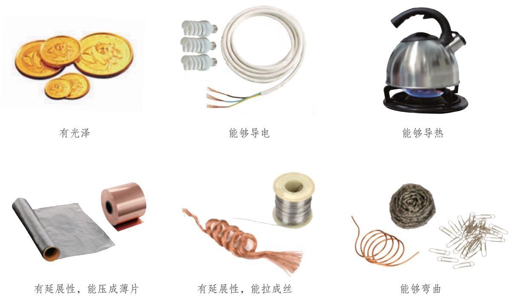

图8-2金属的一些物理性质和用途

表8-1一些金属物理性质的比较

<table><tr><td>物理性质</td><td colspan="8">物理性质比较</td></tr><tr><td>导电性（以银的 导电性为 100作标准）</td><td>银 （优）100</td><td>铜 99</td><td>金 74</td><td>铝 61</td><td>锌 27</td><td>17</td><td>7.9</td><td>（良） Y</td></tr><tr><td>密度/（g·cm-³）</td><td>金</td><td>铅</td><td>银</td><td>铜</td><td>铁</td><td>锌</td><td>铝</td><td></td></tr><tr><td></td><td>（大）19.3</td><td>11.3</td><td>10.5</td><td>9.0</td><td>7.9</td><td>7.1</td><td>2.7</td><td>? （小）</td></tr><tr><td rowspan="2">熔点/℃</td><td>钨</td><td>铁</td><td>铜</td><td>金</td><td>银</td><td>铝</td><td>锡</td><td></td></tr><tr><td>（高）3414</td><td>1538</td><td>1 085</td><td>1 064</td><td>962</td><td>660</td><td>232</td><td>? （低）</td></tr><tr><td rowspan="2">硬度（以金刚石的 硬度为10作标准）</td><td>铬</td><td>铁</td><td></td><td>铜</td><td>金</td><td>铝</td><td>铅</td><td></td></tr><tr><td>（大） 9</td><td>4~5</td><td>2.5~4</td><td>2.5~3</td><td>2.5~3</td><td>2~2.9</td><td>1.5</td><td>（小） ?</td></tr></table>

# 资料卡片

# 金属之最

·地壳中含量最高的金属元素—铝人体中含量最高的金属元素—钙  
. 目前世界年产量最高的金属—铁  
. 导电性、导热性最好的金属—银  
. 硬度最大的金属 铬  
·熔点最高的金属- 钨  
熔点最低的金属 汞  
密度最大的金属  
. 密度最小的金属 一锂

合金alloy

# 思考与讨论

根据你的生活经验和表8-1所提供的信息,并查阅有关资料分析下列问题。

(1)为什么菜刀、镰刀、锤子等用铁制而不用铝制?(2)银的导电性比铜的好,为什么电线一般用铜制而不用银制?(3)为什么灯泡里的灯丝用钨制而不用锡制?如果用锡制的话,可能会出现什么情况?(4)为什么有的铁制品如水龙头等要镀铬?如果镀金会怎样?

通过上述讨论,可以得出以下结论:

物质的性质在很大程度上决定了物质的用途,但这不是唯一的决定因素;在考虑物质的用途时,还需要考虑价格、资源,废料是否易于回收和对环境的影响,以及是否美观、使用是否便利等多种因素。

# 二、合金

钢铁是使用最多的合金材料。你也许会认为,钢的性能比生铁的好,是因为钢是很纯的铁。其实,钢是含有少量碳及其他金属或非金属的铁合金。就像厨师在炒菜时那样,他们常常会在菜里加入各种调料,以改善菜的色、香、味,并使菜的营养价值更高。如果在纯金属中加热熔合某些金属或非金属,就可以制得具有金属特征的合金。生铁和钢就是含碳量不同的两种铁合金。生铁的含碳量为 $2 \% { \sim } 4 . 3 \%$ ,钢的含碳量为 $0 . 0 3 \% { \sim } 2 \%$ 。除了含碳,生铁中还含有硅、锰等,不锈钢中还含有铬、镍等。由于在纯金属铁中熔合了一定量的碳、硅、锰或碳、铬、镍等,组成发生改变,合金性能也随之发生改变。例如:纯铁较软,而生铁比纯铁硬;不锈钢不仅比纯铁硬,而且其抗锈蚀性能也比纯铁好得多。因此,日常生活、工农业生产和科学研究中,大量使用的常常不是纯铁,而是铁的合金。

# 【实验8-1】

# 

比较黄铜片(铜锌合金)和铜片、硬铝片(铝合金)和铝片的光泽与颜色;如图8-3所示将它们互相刻画,比较它们的硬度。

图8-3比较合金和纯金属的硬度

<table><tr><td rowspan=2 colspan=1>性质比较</td><td rowspan=1 colspan=4>现象</td><td rowspan=2 colspan=1>结论</td></tr><tr><td rowspan=1 colspan=1>黄铜</td><td rowspan=1 colspan=1>铜</td><td rowspan=1 colspan=1>硬铝</td><td rowspan=1 colspan=1>铝</td></tr><tr><td rowspan=1 colspan=1>光泽和颜色</td><td rowspan=1 colspan=1></td><td rowspan=1 colspan=1></td><td rowspan=1 colspan=1></td><td rowspan=1 colspan=1></td><td rowspan=2 colspan=1></td></tr><tr><td rowspan=1 colspan=1>硬度</td><td rowspan=1 colspan=2></td><td rowspan=1 colspan=2></td></tr></table>

# 思考与讨论

查阅资料,了解焊锡(锡铅合金)和伍德合金(铅、铋、锡和镉组成的合金)的用途。根据下表提供的数据,你能得到什么启示?

<table><tr><td rowspan=2 colspan=1>纯金属或合金</td><td rowspan=1 colspan=4>纯金属</td><td rowspan=1 colspan=2>合金</td></tr><tr><td rowspan=1 colspan=1>铅</td><td rowspan=1 colspan=1>铋</td><td rowspan=1 colspan=1>锡</td><td rowspan=1 colspan=1>镉</td><td rowspan=1 colspan=1>焊锡</td><td rowspan=1 colspan=1>伍德合金</td></tr><tr><td rowspan=1 colspan=1>熔点/℃</td><td rowspan=1 colspan=1>327</td><td rowspan=1 colspan=1>271</td><td rowspan=1 colspan=1>232</td><td rowspan=1 colspan=1>321</td><td rowspan=1 colspan=1>183</td><td rowspan=1 colspan=1>70</td></tr><tr><td rowspan=1 colspan=1>启示</td><td rowspan=1 colspan=6></td></tr></table>

图8-4由铜合金制造的我国古代钱币

图8-5使用了合金材料的嫦娥四号着陆器

合金的很多性能与组成它们的纯金属不同,使合金更适合于不同的用途。因此,金属材料中合金的使用更加广泛(如图8-4、图8-5)。

目前已制得的纯金属只有几十种,但由这些纯金属(或纯金属与非金属)按一定组成和质量比制得的合金已达几千种。表8-2中列出了一些常见合金的主要成分、性能和用途。

表8-2一些常见合金的主要成分、性能和用途

<table><tr><td rowspan=1 colspan=1>合金</td><td rowspan=1 colspan=1>主要成分</td><td rowspan=1 colspan=1>主要性能</td><td rowspan=1 colspan=1>主要用途</td></tr><tr><td rowspan=1 colspan=1>不锈钢</td><td rowspan=1 colspan=1>铁、铬、镍</td><td rowspan=1 colspan=1>抗腐蚀性好</td><td rowspan=1 colspan=1>医疗器械、炊具、容器、反应釜</td></tr><tr><td rowspan=1 colspan=1>锰钢</td><td rowspan=1 colspan=1>铁、锰、碳</td><td rowspan=1 colspan=1>韧性好、硬度大</td><td rowspan=1 colspan=1>钢轨、挖掘机铲斗、坦克装甲、自行车架</td></tr><tr><td rowspan=1 colspan=1>黄铜</td><td rowspan=1 colspan=1>铜、锌</td><td rowspan=1 colspan=1>强度高、可塑性好、易加工、耐腐蚀</td><td rowspan=1 colspan=1>机器零件、仪表、日用品</td></tr><tr><td rowspan=1 colspan=1>青铜</td><td rowspan=1 colspan=1>铜、锡</td><td rowspan=1 colspan=1>强度高、可塑性好、耐磨、耐腐蚀</td><td rowspan=1 colspan=1>机器零件，如轴承、齿轮</td></tr><tr><td rowspan=1 colspan=1>白铜</td><td rowspan=1 colspan=1>铜、镍</td><td rowspan=1 colspan=1>光泽好、耐磨、耐腐蚀、易加工</td><td rowspan=1 colspan=1>钱币、饰品</td></tr><tr><td rowspan=1 colspan=1>焊锡</td><td rowspan=1 colspan=1>锡、铅</td><td rowspan=1 colspan=1>熔点低</td><td rowspan=1 colspan=1>焊接金属</td></tr><tr><td rowspan=1 colspan=1>硬铝</td><td rowspan=1 colspan=1>铝、铜、镁、硅</td><td rowspan=1 colspan=1>强度高、硬度大</td><td rowspan=1 colspan=1>火箭、飞机、轮船</td></tr><tr><td rowspan=1 colspan=1>18K①黄金</td><td rowspan=1 colspan=1>金、银、铜</td><td rowspan=1 colspan=1>光泽好、耐磨、易加工</td><td rowspan=1 colspan=1>金饰品</td></tr></table>

钛和钛合金被认为是21世纪的重要金属材料,它们具有很多优良的性能,如熔点高、密度小(钛的密度仅为 $4 . 5 ~ \mathrm { g / c m } ^ { 3 }$ )、可塑性好、易加工、机械性能好等。钛和钛合金的抗腐蚀性能非常好,即使把它们放在海水中数年,取出后仍光亮如初,其抗腐蚀性能远优于不锈钢。钛和钛合金被广泛用于火箭、导弹、航天器、船舶、化工设备、通信设备和医疗(如图8-6)等。

我国的多项重大工程建设中使用了多种金属材料,凝聚了许多劳动者的智慧。例如,我国研发人员克服了工艺控制上的重重困难,生产出了厚度仅为 $0 . 0 1 5 \mathrm { m m }$ 的超薄不锈钢精密箔材(如图8-7),实现了高精尖设备制造的创新性突破。又如,火箭发动机上的金属焊接是项极其精细的工程,要完成焊接,焊接工不仅要有高超的焊接技术,而且要有执着专注、精益求精、一丝不苟、追求卓越的工匠精神(如图8-8)。

图8-6钛合金与人体具有很好的相容性,可用来制造人造骨

钛titanium

图8-7我国生产的超薄不锈钢精密箔材

图8-8我国工匠正在焊接火箭发动机喷管

# 科学·技术·社会

# 形状记忆合金

形状记忆合金是具有形状记忆效应的合金,被广泛用于制造人造卫星和宇宙飞船的天线,水暖系统、防火门和电路断电的自动控制开关,以及牙齿矫正器等医疗器械。例如,人造卫星和宇宙飞船上的天线是由钛镍形状记忆合金制造的,它具有形状记忆功能。制造时先将钛镍形状记忆合金制成抛物面形状的天线,然后在低温下将天线揉成一团,放入人造卫星或宇宙飞船舱内。当人造卫星或宇宙飞船发射并进入正常运行轨道后,天线在舱外经太阳光照射温度升高,就会自动恢复原来的抛物面形状(如图8-9)。

图8-9用钛镍形状记忆合金制成的人造卫星天线

# 调查与研究

查阅资料,了解航天领域中常用的金属材料有哪些,它们各有哪些特性和用途,以及我国航天领域中的新型金属材料研究进展,撰写研究报告,并在班内展示、交流。

# 学完本课题你知道了什么

1.金属具有很多共同的物理性质。例如,它们都有金属光泽,大多数为电和热的优良导体,有延展性,密度较大,熔点较高。

2.物质的性质在很大程度上决定了物质的用途,但这不是唯一的决定因素。

3.金属材料包括铁、铝、铜等纯金属和合金。在纯金属中加热熔合某些金属或非金属而制得的合金,其性能会发生改变。合金具有更为广泛的用途。

# 练习与应用

1.下列生活用品中,利用金属导电性的是( )。

A.铁锅 B.铜导线 C.铝箔包装纸 D.金饰品

.铜能被加工成厚度仅为 $7 \mu \mathrm { m }$ 的超薄铜箔,说明铜具有良好的( )。

A.导电性 B.延展性 C.导热性 D.抗腐蚀性

3.下列有关金属材料的说法中,正确的是( )。

A.焊锡是锡铅合金 B.合金中只含金属元素C.钛的熔点高、密度大 D.合金的硬度一般比其组成金属的小

4.下列物质中,不属于合金的是( )。

A.18K黄金 B.用来制作仪表的黄铜C.用来切割玻璃的金刚石 D.建造国产航母的新型钢材

5.下列说法中,不正确的是( )。

A.青铜的硬度比纯铜的大 B.金具有金属光泽属于金的化学性质C.生铁的含碳量比钢的高 D.钛和钛合金用于制造火箭、导弹等

6.制造高铁钢轨使用了锰钢。下列说法中,不正确的是( )。

A.锰钢是一种铁合金 B.锰钢的主要成分是铁、锰、碳C.锰钢比铁的韧性好、硬度大 D.锰钢中的含碳量大于 $3 \%$ 

7.判断下列说法是否正确。

(1)地壳中含量最高的金属元素是铁。  
(2)钢的性能优良,所以钢是很纯的铁。  
(3)多数合金的抗腐蚀性比其组成金属的好。

8.选用哪种合金来制造下列用品?根据生活经验或查阅资料,说明理由。

(1)外科手术刀 (2)防盗门 (3)门锁 (4)自行车支架

9.某金属材料的一些性质如下表所示,试推测该材料的可能用途,并与同学进行讨论。

<table><tr><td rowspan=1 colspan=1>熔点</td><td rowspan=1 colspan=1>1 000 °℃</td></tr><tr><td rowspan=1 colspan=1>密度</td><td rowspan=1 colspan=1>4 g/cm³</td></tr><tr><td rowspan=1 colspan=1>强度</td><td rowspan=1 colspan=1>高</td></tr><tr><td rowspan=1 colspan=1>导电性</td><td rowspan=1 colspan=1>良好</td></tr><tr><td rowspan=1 colspan=1>导热性</td><td rowspan=1 colspan=1>良好</td></tr><tr><td rowspan=1 colspan=1>抗腐蚀性</td><td rowspan=1 colspan=1>优异</td></tr></table>

10. $1 . 1 \ \mathrm { g }$ 某钢样在纯氧中完全燃烧,得到 $0 . 0 1 3 \ \mathrm { g }$ 二氧化碳。计算此钢样中碳的质量分数(计算结果保留一位小数)。

# 课题2

# 金属的化学性质

金属的用途不仅与它们的物理性质有密切关系,而且与它们的化学性质有密切关系。

# 一、金属与氧气的反应

我们已经知道镁和铁都能与氧气反应。实验表明,大多数金属能与氧气发生反应,但反应的难易程度是不同的。例如,镁、铝等在常温下就能与氧气反应。铝在空气中与氧气反应,其表面生成一层致密的氧化铝( $\mathrm { A l } _ { 2 } \mathrm { O } _ { 3 }$ )薄膜,从而阻止铝进一步被氧化,因此,铝具有很好的抗腐蚀性能。

$$
4 \mathsf { A l } + 3 \mathsf { O } _ { 2 } = 2 \mathsf { A l } _ { 2 } \mathsf { O } _ { 3 }
$$

铁、铜等在常温下几乎不与氧气反应,但在高温时能与氧气反应。“真金不怕火炼”说明即使在高温时金也不与氧气反应。可以看出,镁、铝比较活泼,铁、铜次之,金最不活泼。

# 二、金属与稀盐酸、稀硫酸的反应

很多金属不仅能与氧气反应,还能与稀盐酸或稀硫酸反应。金属能否与稀盐酸或稀硫酸反应,可反映金属的活动性。

# 探究

# 金属与稀盐酸或稀硫酸的反应

# 【问题】

是不是所有的金属都能与稀盐酸或稀硫酸发生反应?从反应类型来看,金属与稀盐酸或稀硫酸的反应有什么特点?

# 10第八单元金属和金属材料

# 【实验】

(1)在试管中放入少量镁,加入 $5 ~ \mathrm { m L }$ 稀盐酸,将燃着的木条放在试管口,观察现象,并判断反应后生成了什么气体。

参照上述实验步骤,分别向盛有少量锌、铁、铜的试管中加入 $5 \mathrm { m L }$ 稀盐酸,观察现象(如图8-10)。如果有气体生成,判断生成的是什么气体。

(2)用稀硫酸代替稀盐酸进行上述实验。

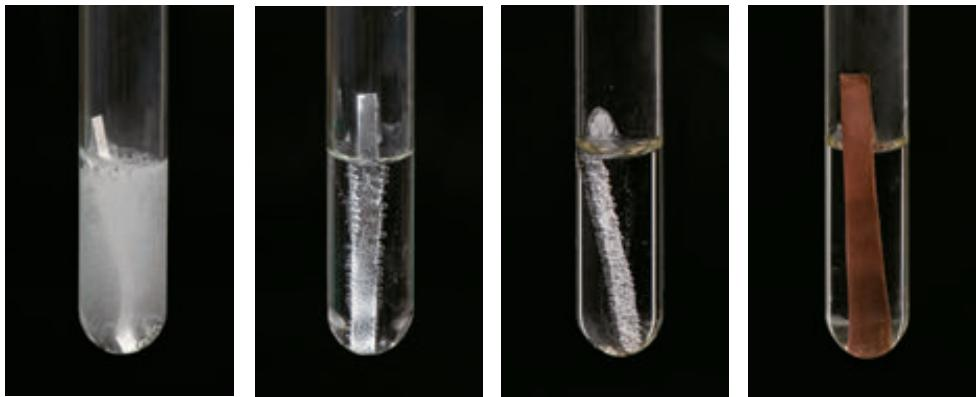

图8-10镁、锌、铁、铜分别在稀盐酸中

<table><tr><td rowspan=2 colspan=1>金属</td><td rowspan=1 colspan=2>现象</td><td rowspan=1 colspan=2>化学方程式</td></tr><tr><td rowspan=1 colspan=1>稀盐酸</td><td rowspan=1 colspan=1>稀硫酸</td><td rowspan=1 colspan=1>稀盐酸</td><td rowspan=1 colspan=1>稀硫酸</td></tr><tr><td rowspan=1 colspan=1>镁</td><td rowspan=1 colspan=1></td><td rowspan=1 colspan=1></td><td rowspan=1 colspan=1></td><td rowspan=1 colspan=1></td></tr><tr><td rowspan=1 colspan=1>锌</td><td rowspan=1 colspan=1></td><td rowspan=1 colspan=1></td><td rowspan=1 colspan=1></td><td rowspan=1 colspan=1></td></tr><tr><td rowspan=1 colspan=1>铁</td><td rowspan=1 colspan=1></td><td rowspan=1 colspan=1></td><td rowspan=1 colspan=1></td><td rowspan=1 colspan=1></td></tr><tr><td rowspan=1 colspan=1>铜</td><td rowspan=1 colspan=1></td><td rowspan=1 colspan=1></td><td rowspan=1 colspan=1></td><td rowspan=1 colspan=1></td></tr></table>

# 【分析与结论】

(1)哪些金属能与稀盐酸或稀硫酸反应?反应后生成了什么气体?哪些金属不能与稀盐酸或稀硫酸反应?

(2)对于能发生的反应,根据其化学方程式,从反应物和生成物的类别如单质、化合物的角度,分析这些反应有什么特点,将这一类反应与化合反应、分解反应进行比较。

置换反应displacement reaction

在上述探究中,镁、锌、铁能与稀盐酸、稀硫酸发生反应,反应都生成可燃性气体—氢气,而铜不能与稀盐酸、稀硫酸反应。分析镁、锌、铁与稀盐酸(或稀硫酸)的反应:

Mg! 十 2HCI MgCl2!Zn 十 i 2HCI i ZnCl2 H2Fe 十 1 2HCI i 1 FeCl2 H2↑ 个单质 化合物 化合物 单质

这几个反应都是由一种单质与一种化合物反应,生成另一种单质和另一种化合物,这种反应叫作置换反应。

通过上述探究还可以得出,镁、锌、铁的金属活动性比铜的强,它们能置换出稀盐酸或稀硫酸中的氢。

# 三、金属活动性顺序

我们已经知道,把铁丝放在硫酸铜溶液中,铁丝上会有红色的铜生成。铁可以把铜从硫酸铜溶液中置换出来,说明铁的金属活动性比铜的强,这是比较金属活动性的依据之一。

# 探究

# 金属活动性顺序

【问题】

如何设计实验,探究铝、铜、银的金属活动性顺序?

【实验】

(1)将一根用砂纸打磨过的铝丝浸入硫酸铜溶液中(如图8-11),过一会儿取出,观察现象。

# 12第八单元金属和金属材料

(2)将一根洁净的铜丝浸入硝酸银溶液中(如图8-12),过一会儿取出,观察现象。

(3)将另一根洁净的铜丝浸入硫酸铝溶液中,过一会儿取出,观察现象。

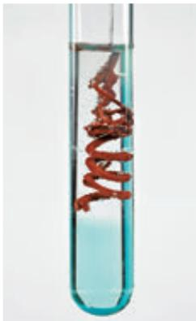

图8-11铝与硫酸铜溶液的反应

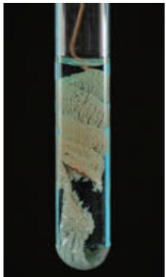

图8-12铜与硝酸银溶液的反应

<table><tr><td rowspan=1 colspan=1>实验内容</td><td rowspan=1 colspan=1>现象</td><td rowspan=1 colspan=1>化学方程式</td></tr><tr><td rowspan=1 colspan=1>将铝丝浸入硫酸铜溶液中</td><td rowspan=1 colspan=1></td><td rowspan=1 colspan=1></td></tr><tr><td rowspan=1 colspan=1>将铜丝浸入硝酸银溶液中</td><td rowspan=1 colspan=1></td><td rowspan=1 colspan=1></td></tr><tr><td rowspan=1 colspan=1>将铜丝浸入硫酸铝溶液中</td><td rowspan=1 colspan=1></td><td rowspan=1 colspan=1></td></tr></table>

# 【分析与结论】

(1)上述能发生反应的化学方程式的特点是什么?它们属于哪种反应类型?

(2)通过上述实验,你能得出铝、铜、银的金属活动性顺序吗?

Al Cu Ag 

金属活动性 O

经过许多实验探究,人们总结出了常见金属在水溶液中的活动性顺序:

金属活动性顺序metal activity series

K Ca Na Mg Al Zn Fe Sn Pb (H) Cu Hg Ag Pt Au 

金属活动性由强逐渐减弱

金属活动性顺序在工农业生产和科学研究中具有重要应用,一般情况下,它可以帮助你作出以下预测和判断:

(1)在金属活动性顺序里,金属的位置越靠前,它的活动性就越强;

(2)在金属活动性顺序里,位于氢前面的金属能置换出稀盐酸、稀硫酸中的氢;

(3)在金属活动性顺序里,位于前面的金属能把位于后面的金属从它们化合物的溶液里置换出来。

# 方法导引

# 预测

运用金属活动性顺序,我们可以预测某种金属是否能与稀盐酸、稀硫酸或其他金属的化合物溶液发生置换反应。

预测是在已有信息的基础上,依据一定规律和方法对未知事物所进行的一种推测。在化学研究中,可以通过化学实验等方法来验证所作预测的合理性,其思路可用右图表示。

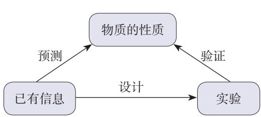

# 学完本课题你知道了什么

1.很多金属能与氧气、稀盐酸、稀硫酸等发生反应,但反应的难易程度不同。

2.由一种单质与一种化合物反应,生成另一种单质和另一种化合物的反应叫作置换反应。

3.常见金属的活动性顺序如下:

K Ca Na Mg Al Zn Fe Sn Pb (H) Cu Hg Ag Pt Au 

金属活动性由强逐渐减弱

金属活动性顺序可以用来预测常见金属的某些化学性质,并解释有关的实验现象和实际应用。

# 练习与应用

1.下列金属中,金属活动性最弱的是( )。

A.铁 B.银C.锌 D.铜

2.下列物质中,不能由金属与稀盐酸反应直接生成的是( )。

A. $\mathrm { Z n C l } _ { 2 }$ B. $\mathrm { F e C l } _ { 2 }$   
C. $\mathrm { C u C l } _ { 2 }$ D. $\mathrm { M g C l } _ { 2 }$ 

3.写出下列反应的化学方程式,并注明反应类型(CO与 $\mathrm { F e } _ { 3 } \mathrm { O } _ { 4 }$ 的反应除外)。

$$
\begin{array} { r } { \mathrm { C } \longrightarrow \mathrm { C O } _ { 2 } \longrightarrow \mathrm { C O } _ { 4 } } \\ { \qquad \mathrm { F e } \longrightarrow \mathrm { F e } _ { 3 } \qquad \ Z ^ { \mathrm { F e S O } _ { 4 } } } \\ { \qquad \mathrm { F e } \longrightarrow \mathrm { F e } _ { 3 } \mathrm { O } _ { 4 } } \end{array}
$$

4.写出镁、铜、氧气、稀盐酸两两间能发生反应的化学方程式,并注明反应类型。

5.下列物质间能否发生反应?若能反应,写出化学方程式。

(1)银与稀盐酸。  
(2)锌与硫酸铜溶液。  
(3)铜与硫酸锌溶液。  
(4)铝与硝酸银溶液。

6.填写下列表格(括号内为杂质)。

<table><tr><td rowspan=1 colspan=1>混合物</td><td rowspan=1 colspan=1>除去杂质的化学方程式</td><td rowspan=1 colspan=1>主要操作步骤</td></tr><tr><td rowspan=1 colspan=1>铜粉（Fe）</td><td rowspan=1 colspan=1></td><td rowspan=1 colspan=1></td></tr><tr><td rowspan=1 colspan=1>FeCl溶液（CuCl2）</td><td rowspan=1 colspan=1></td><td rowspan=1 colspan=1></td></tr></table>

7.现有X、Y、Z三种金属,如果将X和Y分别放入稀硫酸中,X溶解并产生氢气,Y不反应;如果将Y和Z分别放入硝酸银溶液中,过一会儿,在Y表面有银析出,而Z表面没有变化。根据以上实验事实,判断X、Y和Z的金属活动性顺序。

8.镁、锌、铁三种金属各 $3 0 ~ \mathrm { g }$ ,分别与足量稀盐酸反应,生成氢气的质量各是多少(计算结果保留一位小数)?

# 课题3

# 金属资源的利用和保护

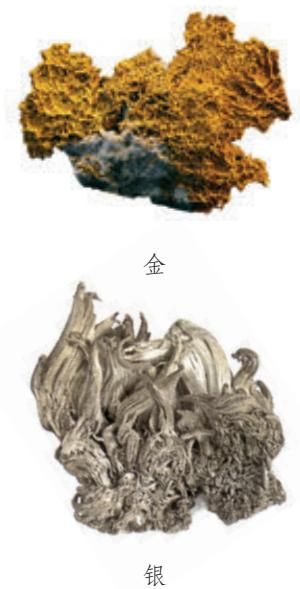

图8-13自然界中以单质形式存在的金和银

地球上的金属资源广泛地存在于地壳和海洋中,除了金、银等有单质形式存在(如图8-13),金属多以化合物的形式存在。

# 一、金属矿物

大多数金属在自然界中是以金属矿物形式存在的。我国是世界上为数不多的已知金属矿物种类比较齐全的国家之一,矿物储量也很丰富,其中钨、钼、钛、锡、锑等储量居世界前列,铜、铝、锰等储量在世界上也占有重要地位。一些金属矿石如图8-14所示。

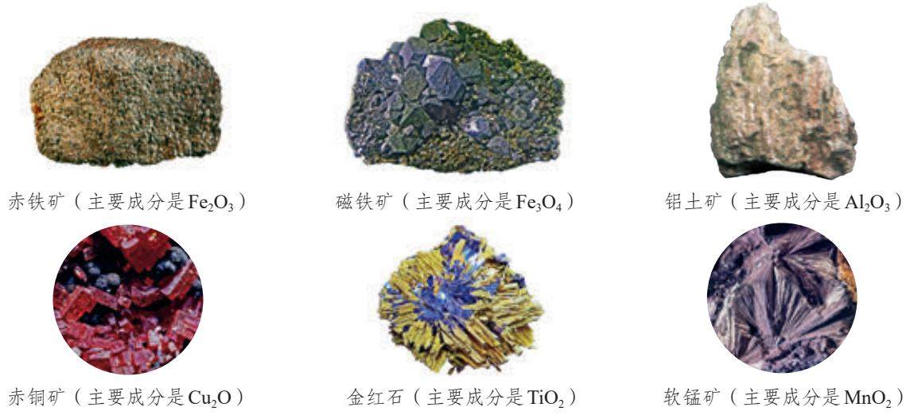

图8-14一些金属矿石

大自然为人类提供了丰富的金属矿物资源,人类每年要从有开采价值的金属矿石中提炼大量的金属,用于工农业生产和其他领域。其中,提炼量最大的是铁。

# 二、铁的冶炼

早在春秋时期,我国已生产和使用铁器。战国时期,铁制工具的大量使用提高了生产力水平。随后,铁逐渐成为最主要的金属材料。《天工开物》中有我国古代炼铁的记载(如图8-15)。

图8-15《天工开物》记载的我国古代炼铁示意图

炼铁的主要原理是一氧化碳与氧化铁反应,其化学方程式如下:

$$
\mathsf { F e } _ { 2 } \mathsf { O } _ { 3 } + 3 \mathsf { C O } \overset { \overset { \mathrm { \scriptsize ~ . ~ } } { \boxed { \mathsf { H } } } \mathrm { \scriptsize { \Sigma } } } { \longrightarrow } 2 \mathsf { F e } + 3 \mathsf { C O } _ { 2 }
$$

把铁矿石冶炼成铁是一个复杂的过程。把赤铁矿石、焦炭和石灰石①一起加入高炉,在高温下,利用炉内反应生成的一氧化碳把铁从氧化铁里还原出来。炼铁高炉及炉内的主要化学反应如图8-16所示。

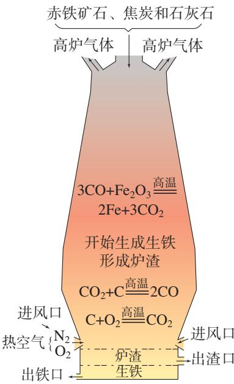

图8-16炼铁高炉及炉内主要化学反应示意图

在实际生产时(如图8-17),炼铁所用的原料或所得的产物一般都含有杂质,在计算用料和产量时,应考虑到杂质问题。

图8-17 宝钢炼铁高炉

【例题】用1000t含氧化铁 $80 \%$ 的赤铁矿石,理论上可以炼出含铁 $9 6 \%$ 的生铁的质量是多少(计算结果保留一位小数)?

【解】1000t赤铁矿石中含氧化铁的质量为:

$$
1 \ 0 0 0 \ \mathrm { t } \times 8 0 \% = 8 0 0 \ \mathrm { t }
$$

设:800t氧化铁理论上可以炼出的铁的质量为 $x$ 。

$$
\mathrm { F e } _ { 2 } \mathrm { O } _ { 3 } + 3 \mathrm { C O } \overset { \overset {  } { \scriptscriptstyle { \boxplus } } \overset {  } { \scriptscriptstyle { \boxplus } } \overset {  } { \scriptscriptstyle { \boxplus } } } { = } 2 \mathrm { F e } + 3 \mathrm { C O } _ { 2 }
$$

$$
2 \times 5 6
$$

$$
\frac { 1 6 0 } { 2 \times 5 6 } = \frac { 8 0 0 \mathrm { ~ t ~ } } { x }
$$

$$
x = { \frac { 2 \times 5 6 \times 8 0 0 ~ \mathrm { t } } { 1 6 0 } }
$$

折合为含铁 $9 6 \%$ 的生铁的质量为:

$$
5 6 0 \mathrm { ~ t ~ } \div 9 6 \% = 5 8 3 . 3 \mathrm { ~ t ~ }
$$

答:理论上可以炼出含铁 $9 6 \%$ 的生铁的质量是583.3 to

# 三、金属资源保护

一方面,人类每年要从自然界获取大量的金属矿物资源以提炼金属;另一方面,世界上每年又有大量的金属设备和材料因腐蚀而报废。如何防止金属腐蚀已成为科学研究和技术领域中的重大问题。

# 1.金属的腐蚀与防护

# 探究

# 道

# 铁钉生锈的条件

【问题】

铁钉容易生锈(铁锈的主要成分是 $\mathrm { F e } _ { 2 } \mathrm { O } _ { 3 } \cdot x \mathrm { H } _ { 2 } \mathrm { O }$ )。那么,铁钉生锈需要哪些条件呢?

# 【实验】

现有洁净无锈的铁钉、试管、经煮沸迅速冷却的蒸馏水(思考:为什么要用蒸馏水?)、植物油、棉花和氯化钙(干燥剂)。你还可以选用其他物品。

(1)仔细观察并参考图8-18所示的装置,设计实验并探究铁钉生锈的条件。

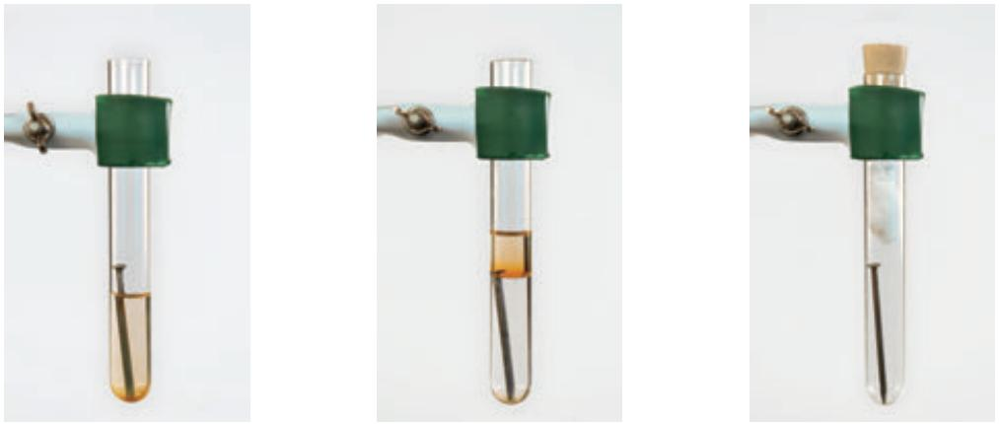

图8-18铁钉生锈条件的探究实验

(2)每天观察铁钉生锈的现象,连续观察约一周,认真做好记录。

# 【分析与结论】

(1)上述实验设计是如何控制变量的?(2)对铁钉生锈的条件,你能得出哪些结论?

以上探究中铁钉生锈的过程,实际上是铁与空气中的氧气、水蒸气等发生化学反应的过程。铁生锈需要条件。例如,要有能够与铁发生反应的物质,反应物要能相互接触,生成物不会对反应起阻碍作用,等等。铁与氧气、水等反应生成的铁锈很疏松,不能阻碍里层的铁继续与氧气、水等反应,因此铁制品可以全部锈蚀。

了解了铁生锈的条件,就可以根据这些条件,寻找防止铁制品锈蚀的方法。

# 思考与讨论

(1)通过对铁钉生锈条件的探究,你对防止铁制品锈蚀有什么建议?

(2)自行车的构件如支架、链条、钢圈等(如图8-19),分别采取了哪些防锈措施?

图8-19自行车

# 2.保护金属资源

金属矿物的储量有限,而且不能再生。怎样保护金属资源呢?

除了防止金属腐蚀,保护金属资源的第二条有效途径是回收利用废旧金属。例如,回收利用铝质饮料罐与制造新的铝质饮料罐相比,既能节约金属资源,又能节约能源。目前,世界上已有 $50 \%$ 以上的铁和 $90 \%$ 以上的金得到了回收利用。

废旧金属的回收利用还可以减少对环境的污染。例如,废旧电池中含有铅、镍、镉、钴等,如果将废旧电池随意丢弃,这些金属渗出会污染地下水和

土壤,危害人类健康。而将这些金属回收利用,既可以减少其对环境的危害,又可以节约金属资源。如从汽车用过的铅酸蓄电池中回收铅,从废旧锂离子电池中回收锂、钴、镍等,对保护环境和实现金属资源的循环利用均具有重要的意义。

保护金属资源的第三条有效途径是有计划、合理地开采金属矿物,严禁不顾国家利益的乱采矿。此外,还有寻找金属的代用品等途径。例如,目前已经广泛使用塑料来代替钢和其他合金制造管道、齿轮和汽车零部件等。

# 思考与讨论

查阅资料,了解我国的稀土储量、稀土生产量,以及我国稀土资源的合理利用与保护,并与同学交流。

# 科学·技术·社会

# 稀土资源的利用和保护

稀土元素是储量较少的一类金属元素的统称,有“工业的维生素”的美誉,是重要的战略资源,广泛应用于新能源、新材料、航空航天、电子信息等尖端科技领域。

稀土资源是不可再生的,过度开采会面临枯竭。我国针对稀土资源开采已有相应的措施,如制定并实施了稀土行业发展规划,对稀土出口实行配额管理等。

说到我国的稀土,必须感谢一位国际著名的中国化学家,他就是2008年度国家最高科学技术奖获得者徐光宪院士(如图8-20)。徐光宪和他的团队研发了稀土分离技术,使我国能够自主分离稀土产品,打破了发达国家在国际稀土市场上的垄断地位。到目前为止,我国的稀土储量居世界第一位,稀土的年生产量和年消费量也都居世界前列。

图8-20徐光宪(1920—2015)

# 调查与研究

调查你的家庭及所在社区废旧金属的主要品种、回收情况和回收价值等,对如何回收利用废旧金属提出建议。

# 学完本课题你知道了什么

1.把赤铁矿石冶炼成铁的主要原理是在高温下,一氧化碳把铁从氧化铁里还原出来:

$$
\mathrm { F e } _ { 2 } \mathrm { O } _ { 3 } { + } 3 \mathrm { C O } \stackrel { \stackrel { \mathrm { \scriptsize ~ \equiv ~ } } { \mathrm { \scriptsize ~ \equiv ~ } } \gamma \mathrm { \scriptsize { H } } } { \longrightarrow } 2 \mathrm { F e } { + } 3 \mathrm { C O } _ { 2 }
$$

2.在实际生产时,所用的原料或所得的产物一般都含有杂质,在计算用料和产量时,应考虑杂质问题。

3.铁生锈的主要条件是铁与空气和水(或水蒸气)直接接触,如果隔绝了空气或水,就能在一定程度上防止铁生锈。在铁制品表面涂油、刷漆、镀耐磨和耐腐蚀的铬,以及制造耐腐蚀的合金等,都能防止铁制品锈蚀。

4.保护金属资源的有效途径是防止金属腐蚀、回收利用废旧金属、合理开采金属矿物,以及寻找金属的代用品等。

# 练习与应用

1.下列金属中,在自然界主要以化合物形式存在,且提炼量最大的是( )。

A.铝 B.金 C.银 D.铁

2.下列有关保护金属资源的措施中,不合理的是( )。

A.回收利用废旧金属 B.防止金属腐蚀C.有计划、合理地开采金属矿物 D.用导电性最好的银取代铜、铝制作导线

3.要证明铁钉生锈的过程中一定有氧气参加了反应,则下列实验中必须完成的是( )。

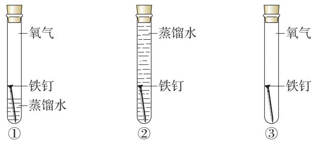

A $\textcircled{1} \textcircled{2}$ B. $\textcircled{1} \textcircled{3}$   
C. $\textcircled{2} \textcircled{3}$ D. $\textcircled{1} \textcircled{2} \textcircled{3 }$ 

4.某赤铁矿样品中铁元素的质量分数为 $6 3 \%$ ,则该矿石样品中 $\mathrm { F e } _ { 2 } \mathrm { O } _ { 3 }$ 的质量分数为( )。

A. $9 5 \%$ B. $8 5 \%$   
C. $90 \%$ D. $80 \%$ 

5.写出下列金属矿石主要成分的化学式。

(1)磁铁矿: 。  
(2)赤铜矿: 。  
(3)铝土矿: 。

6.回答下列问题。

(1)为什么沙漠地区的铁制品锈蚀较慢?

(2)金属在自然界存在的形式有哪些?请举例说明。

7.我国古代将炉甘石( $Z _ { \mathrm { { n C O } _ { 3 } } }$ )、赤铜( $\mathrm { C u } _ { 2 } \mathrm { O }$ )和木炭粉混合后加热到约 $8 0 0 ~ \mathrm { { ‰} }$ ,得到一种外观似金子的锌和铜的合金,试写出相关反应的化学方程式(提示: $Z _ { \mathrm { { n C O } _ { 3 } } }$ 受热分解可生成 $Z _ { \mathrm { n O } }$ 等)。

8.某钢铁厂每天需消耗5000 t含 $\mathrm { F e } _ { 2 } \mathrm { O } _ { 3 } 7 6 \%$ 的赤铁矿石,该厂理论上可日产含Fe $9 8 \%$ 的生铁的质量是多少(计算结果保留一位小数)?

9.查阅资料,了解我国金属矿物的种类和储量,并写成小论文,与同学交流。

# 整理与提升

# 一、认识金属的性质及用途

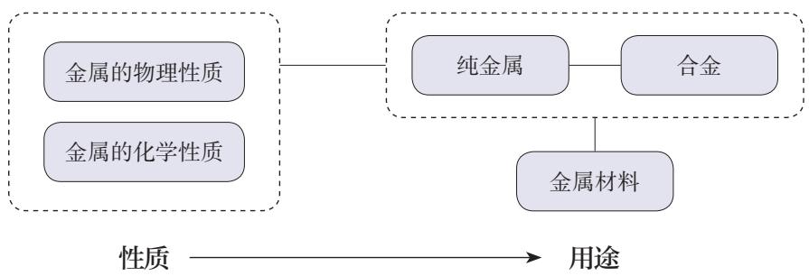

1.金属具有一些共同的物理性质,但也有各自的特性。

2.很多金属的化学性质具有一定的相似性,但反应的难易程度不同;依据金属活动性顺序,可以预测常见金属的某些化学性质。

3.通过了解金属材料在现代交通、航空航天、国防科技等领域的广泛应用,初步认识化学、技术、社会之间的相互关系。

# 二、了解化学反应的类型

根据反应物和生成物的种类和数量等特点,可将已学过的化学反应分为化合反应、分解反应和置换反应等类型。

# 三、金属资源的利用和保护

1.通常应用化学方法从金属矿石中提炼金属。写出利用赤铁矿石冶炼铁的主要反应原理。

2.列举铁生锈的主要条件及防止铁制品锈蚀的主要措施。

3.列举保护金属资源的有效途径。

# 复习与提高

1.下列说法中,不正确的是( )。

A.不锈钢属于金属材料  
B.合金与纯金属性能不同是因为组成发生了改变  
C.钛和钛合金的抗腐蚀性能不如不锈钢  
D.生铁和钢是铁、碳等形成的合金

2.《吕氏春秋》中记载“金(铜单质)柔锡(锡单质)柔,合两柔则刚”。这句话说明合金具有的特性是( )。

A.熔点一般比其组成金属的低 B.硬度一般比其组成金属的大C.抗腐蚀性一般比其组成金属的强 D.耐磨性一般比其组成金属的好

3.下表所示是验证 $Z \mathrm { n }$ 、Fe、Ag三种金属活动性顺序的4种实验方案,其中“_”表示未进行金属化合物溶液与金属之间的实验。各实验方案中,不能达到实验目的的是( )。

<table><tr><td rowspan=1 colspan=1>金属化合物溶液</td><td rowspan=1 colspan=1>①</td><td rowspan=1 colspan=1>②</td><td rowspan=1 colspan=1>③</td><td rowspan=1 colspan=1>④</td></tr><tr><td rowspan=1 colspan=1>ZnSO4溶液</td><td rowspan=1 colspan=1></td><td rowspan=1 colspan=1>Fe</td><td rowspan=1 colspan=1>Ag</td><td rowspan=1 colspan=1>Fe</td></tr><tr><td rowspan=1 colspan=1>FeSO4溶液</td><td rowspan=1 colspan=1>Zn</td><td rowspan=1 colspan=1>Ag</td><td rowspan=1 colspan=1>Zn</td><td rowspan=1 colspan=1></td></tr><tr><td rowspan=1 colspan=1>AgNO3溶液</td><td rowspan=1 colspan=1>Fe</td><td rowspan=1 colspan=1></td><td rowspan=1 colspan=1></td><td rowspan=1 colspan=1>Fe</td></tr></table>

A. $\textcircled{1}$ B. $\textcircled{2}$ C. $\textcircled{3}$ D. $\textcircled{4}$ 

4.某同学绘制了含铁元素的部分物质转化关系图(图中“→”表示一种物质可以转化为另一种物质,部分反应物、生成物及反应条件已略去)。下列说法中,正确的是( )。

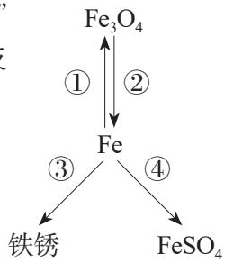

A.铁丝能在空气中剧烈燃烧实现转化 $\textcircled{1}$ B.转化 $\textcircled{2}$ 可通过 $\mathrm { F e } _ { 3 } \mathrm { O } _ { 4 }$ 与CO在常温下反应实现C.氧气和水同时存在是实现转化 $\textcircled{3}$ 的主要条件D.通过Fe与 $\mathrm { Z n S O _ { 4 } }$ 溶液反应可实现转化 $\textcircled{4}$ 

5.请回答下列有关金属材料的问题。

(1)通过锤打可将金属加工成不同形状的金属制品,这是利用了金属的 性。  
(2)钢与纯铁比较,具有的优点有 。  
(3)硬铝用于制造火箭、飞机的外壳,利用了硬铝 小、 大等优良性能。

6.请回答下列问题。

(1)工业冶炼铝的原理为电解熔融的 $\mathrm { A l } _ { 2 } \mathrm { O } _ { 3 }$ ,生成铝和一种气体。该反应的化学方程式为 0

(2)向硫酸铜溶液中加入铁粉,充分反应后过滤,得到滤渣和滤液。向滤渣中加入稀硫酸,有气泡冒出,则滤液中含有的物质是 (填化学式,水除外)。

(3)钛与盐酸反应的化学方程式为 $2 \mathrm { T i } + 6 \mathrm { H C l } { = } 2 \mathrm { X } + 3 \mathrm { H } _ { 2 } \uparrow$ ,则X的化学式是 0若将钛放入硝酸银溶液中,则 (填“有”或“没有”)银析出。

7.某实验小组对镍(Ni)、铁、铜的金属活动性顺序进行实验探究。请补充下列实验报告。

【猜想】结合已知的金属活动性顺序,小组同学作出如下猜想。

猜想一: $\mathrm { N i { > } F e > } \mathrm { C u }$ 猜想二: 猜想三: $\mathrm { F e { > } C u { > } N i }$ 

【实验】

<table><tr><td rowspan=1 colspan=1>实验内容</td><td rowspan=1 colspan=1>现象</td><td rowspan=1 colspan=1>结论</td></tr><tr><td rowspan=1 colspan=1>①</td><td rowspan=1 colspan=1>镍片上有气泡产生</td><td rowspan=1 colspan=1>猜想        错误</td></tr><tr><td rowspan=1 colspan=1>②向试管中加入适量NiSO4溶液，将用砂纸打磨过的铁片浸入NiSO4溶液中</td><td rowspan=1 colspan=1>铁片上</td><td rowspan=1 colspan=1>猜想二正确</td></tr></table>

实验 $\textcircled{2}$ 中发生反应的化学方程式为 。

【结论】三种金属的活动性顺序为 。

8.竖炉炼铁的工艺流程示意图如下所示,请回答下列问题。

(1)赤铁矿石属于 (填“纯净物”或“混合物”)。粉碎机将矿石粉碎的目的是。

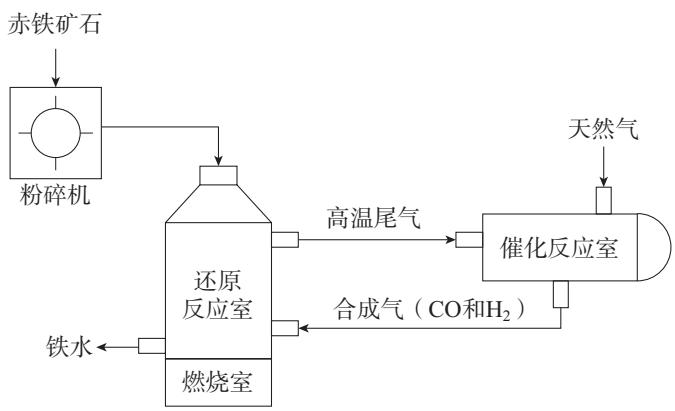

(2)还原反应室中发生的两个还原氧化铁的反应,化学方程式分别为 $\mathrm { F e } _ { 2 } \mathrm { O } _ { 3 } +$ $3 \mathrm { H } _ { 2 }$ 高温 $2 \mathrm { F e } + 3 \mathrm { H } _ { 2 } \mathrm { O }$ 和。

(3)催化反应室中发生的反应之一为 $\mathrm { C H } _ { 4 } + \mathrm { X } \frac { \underset { \mathrm { \tiny ~  ~ } } { \ast } \langle \underset { \mathrm { \tiny ~  ~ } } { \ast } \langle \underset { \mathrm { \tiny ~  ~ } } { \ast } \rangle   } { \underset { \mathrm { \tiny ~  ~ } } { \ast } \mathrm { \langle \underset { \mathrm { \tiny ~  ~ } } { \ast } \rangle  \mathrm { \tiny ~  ~ } } } 2 \mathrm { C O } + 2 \mathrm { H } _ { 2 }$ 。其中,X的化学式为

# 实验活动5 常见金属的物理性质和化学性质

# 【实验目的】

1.巩固和加深对金属性质的认识。  
2.进一步提高实验设计能力。

# 【实验用品】

试管、酒精灯、坩蜗钳、电池、导线、小灯泡、火柴。

镁条、锌粒、铝片、铁片、铜片、黄铜片(或白铜片)、稀盐酸、稀硫酸、硫酸铜溶液、硝酸银溶液。

你还需要的实验用品: 。

# 【实验步骤】

1.金属的物理性质

(1)观察并描述镁、铝、铁、铜的颜色和光泽。  
(2)通过相互刻画,比较铜片和铝片、铜片和黄铜片(或白铜片)的硬度。  
(3)请你设计并进行实验,证明金属具有导电性(或导热性、延展性)。

2.金属的化学性质

(1)用坩蜗钳夹取一块铜片,放在酒精灯火焰上加热,观察铜片表面的变化。

(2)向5支试管中分别放入少量镁条、铝片、锌粒、铁片、铜片,然后各加入 $5 \mathrm { m L }$ 稀盐酸(或稀硫酸),观察现象。如果有气体生成,判断生成的是什么气体。

(3)请你设计并进行实验,比较铁、铜、银的金属活动性。

# 想一想

可以利用什么反应比较不同金属的活动性?

<table><tr><td rowspan=1 colspan=1>实验内容（文字或图示步骤均可）</td><td rowspan=1 colspan=1>现象</td><td rowspan=1 colspan=1>结论</td></tr><tr><td rowspan=1 colspan=1></td><td rowspan=1 colspan=1></td><td rowspan=1 colspan=1></td></tr></table>

# 【问题与交流】

1.归纳常见金属的主要物理性质和化学性质,与同学交流。

2.归纳比较金属活动性的实验设计原理,与同学交流。

# 跨学科实践活动7

# 垃圾的分类与回收利用

随着经济和社会的发展,如何处理垃圾已成为事关人居环境和生态安全的重要问题。建设生态文明与美丽中国,合理的垃圾分类、有效的垃圾回收与利用必不可少。

# 【活动目标】

了解垃圾处理的必要性和重要性;应用物质的分类、物质的性质与应用、物质的变化等化学知识,结合物理、生物学、道德与法治、地理等课程相关知识,认识垃圾分类与回收利用的方法及途径,宣传和践行资源节约、循环利用的生活方式。

# 【活动设计与实施】

# 任务一了解垃圾及其处理的意义

1.查阅资料,了解什么是垃圾,以及日常生活中居民接触的垃圾有什么特点。2.结合生物学、道德与法治、地理等课程知识,从健康与卫生、社会与环境、资源循环利用等不同角度,讨论垃圾处理的意义。

# 任务二认识垃圾的分类

1.查阅资料,了解不同地区、不同场所垃圾分类的依据和方法。2.走访社区,根据所在社区垃圾分类的实际情况,设计科学合理、通俗易懂、简便易行的垃圾分类宣传图。

# 任务三了解垃圾的回收利用

1.举例说明从源头减少金属垃圾产生的方法;举例说明生产和生活中金属垃圾再利用的方法。

2.结合化学、物理、生物学课程中有关物质的变化、能量的转化等知识,查阅资料,设计金属垃圾回收利用(直接利用或间接利用)的方案,实施其中可操作的部分,并对金属的回收利用提出建议。

3.查阅资料,举例说明从源头减少其他种类垃圾(如塑料类垃圾、纸张类垃圾、厨余垃圾等)的方法,并设计回收利用的方案。

4.访问所在地区的垃圾处理站,了解垃圾集中后回收利用的方法及流程。尝试绘制垃圾回收利用流程图,结合任务二中垃圾分类宣传图,设计并制作垃圾的分类与回收利用的宣传展板。

# 【展示与交流】

1.展示你设计的垃圾回收利用方案,试从环境效益、社会效益和经济效益等角度进行互评。  
2.选择社区内合适的位置设置宣传展板,开展垃圾分类与回收利用的宣讲活动。

人民教育出版社

# 第九单元溶液

溶液及其应用溶解度溶质的质量分数

溶液在工农业生产和科学研究中有广泛的应用,与人们的生活息息相关。那么,溶液具有哪些特征?如何表示溶液的组成?

饱和溶液、溶解度、溶质的质量分数等概念的学习,可以使我们从定量的角度认识溶液的组成,体会定量研究在实际应用中的意义与价值。

# 课题1

# 溶液及其应用

图9-1海水中含有80多种元素

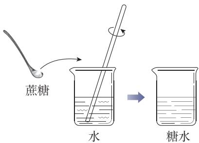

图9-2蔗糖溶解示意图

地球的绝大部分表面被蓝色的海洋覆盖着。海洋不仅是美丽的,也是富饶的。海水中溶解了许多物质,是一个巨大的资源宝库(如图9-1)。那么,物质在水中是怎样溶解的呢?

# 一、溶液的形成

# 【实验9-1

如图9-2所示,在 $2 0 ~ \mathrm { m L }$ 水中加入一药匙蔗糖,用玻璃棒搅拌,观察现象。

蔗糖放入水中后,蔗糖表面的分子在水分子的作用下,逐步向水里扩散,最终蔗糖分子均一地分散到水分子中间,形成一种混合物— -蔗糖溶液。如果把氯化钠放入水中,氯化钠在水分子的作用下,也会向水里扩散,最终均一地分散到水分子中间,形成氯化钠溶液,只不过氯化钠在溶液中是以钠离子和氯离子的形式存在。取出蔗糖溶液(或氯化钠溶液)中的任意一部分进行分析,它们的组成是完全相同的,即溶液是均一的;只要水分不蒸发,温度不变化,蔗糖与水(或氯化钠与水)不会分离,即溶液是稳定的。

像这样一种或几种物质分散到另一种物质里,形成的均一、稳定的混合物,叫作溶液。能溶解其他物质的物质叫作溶剂,被溶解的物质叫作溶质。溶液是由溶质和溶剂组成的。例如:在上述蔗糖溶液中,蔗糖是溶质,水是溶剂;在氯化钠溶液中,氯化钠是溶质,水是溶剂。

水是一种最常用的溶剂,能溶解很多种物质。汽油、酒精等也可以作溶剂,如汽油能溶解油脂,酒精能溶解碘,等等。

溶液solution溶剂 利solvent溶质solute

# 【实验9-2】

如图9-3所示,在两支试管中各加入一小粒碘,然后分别加入5mL水和5mL汽油;另取两支试管各加入一小粒高锰酸钾,然后分别加入5mL水和5mL汽油。振荡,观察并记录实验现象。

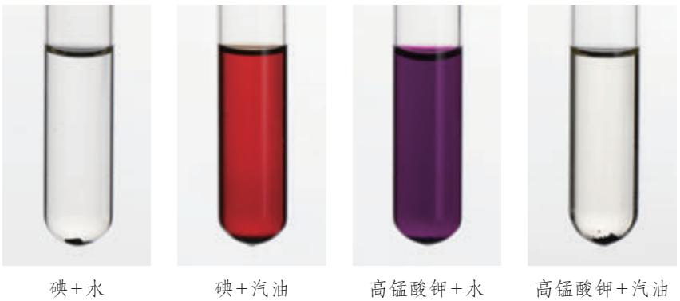

图9-3碘和高锰酸钾的溶解性比较

<table><tr><td rowspan=1 colspan=1>溶质</td><td rowspan=1 colspan=1>溶剂</td><td rowspan=1 colspan=1>现象</td></tr><tr><td rowspan=1 colspan=1>碘</td><td rowspan=1 colspan=1>水</td><td rowspan=1 colspan=1></td></tr><tr><td rowspan=1 colspan=1>碘</td><td rowspan=1 colspan=1>汽油</td><td rowspan=1 colspan=1></td></tr><tr><td rowspan=1 colspan=1>高锰酸钾</td><td rowspan=1 colspan=1>水</td><td rowspan=1 colspan=1></td></tr><tr><td rowspan=1 colspan=1>高锰酸钾</td><td rowspan=1 colspan=1>汽油</td><td rowspan=1 colspan=1></td></tr></table>

实验表明,碘几乎不溶于水,却可以溶解在汽油中;高锰酸钾几乎不溶于汽油,却可以溶解在水中。这说明,同一种物质在不同溶剂中的溶解性是不同的,不同的物质在同一溶剂中的溶解性也是不同的。

# 【实验9-3】

如图9-4所示,在盛有2mL水的试管中滴入两滴红墨水(用红墨水是为了显色,便于观察),振荡。然后将试管倾斜,用滴管沿试管内壁(注意:滴管不要接触试管内壁)缓缓加入2mL乙醇,不要振荡,观察液体是否分层。然后振荡,静置几分钟,观察现象。

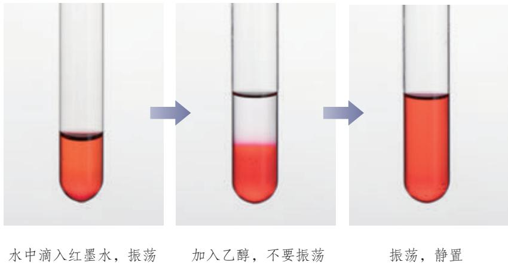

图9-4乙醇能溶解在水中

<table><tr><td rowspan=1 colspan=1>实验内容</td><td rowspan=1 colspan=1>现象</td><td rowspan=1 colspan=1>结论</td></tr><tr><td rowspan=1 colspan=1>加入乙醇，不振荡</td><td rowspan=1 colspan=1></td><td rowspan=3 colspan=1></td></tr><tr><td rowspan=1 colspan=1>加入乙醇后振荡</td><td rowspan=1 colspan=1></td></tr><tr><td rowspan=1 colspan=1>静置</td><td rowspan=1 colspan=1></td></tr></table>

溶质可以是固体,也可以是液体或气体。如果两种液体互相溶解时,一般把量多的一种叫作溶剂,量少的一种叫作溶质。如果其中有一种是水,一般把水叫作溶剂。如实验9-3水和乙醇形成的溶液中,乙醇为溶质,水为溶剂。通常不指明溶剂的溶液,一般是指水作溶剂形成的溶液。

# 【实验9-4】

# 

# 注意

向三个烧杯中各加入 $1 0 0 ~ \mathrm { m L }$ 水,用温度计测量水的温度。取NaCl、NH4NO、NaOH固体各两药匙,分别加入上述三个烧杯中,用玻璃棒搅拌至固体全部溶解,再用温度计分别测量三种溶液的温度。记录并分析测量所得数据。

氢氧化钠有强烈的腐蚀性,使用时必须十分小心,防止溅到眼睛、皮肤、衣服等上面。实验时戴好护目镜。

<table><tr><td rowspan=1 colspan=1>溶质</td><td rowspan=1 colspan=1>NaC1</td><td rowspan=1 colspan=1>NH4NO3</td><td rowspan=1 colspan=1>NaOH</td></tr><tr><td rowspan=1 colspan=1>加入溶质前水的温度/℃</td><td rowspan=1 colspan=1></td><td rowspan=1 colspan=1></td><td rowspan=1 colspan=1></td></tr><tr><td rowspan=1 colspan=1>溶质溶解后溶液的温度/℃</td><td rowspan=1 colspan=1></td><td rowspan=1 colspan=1></td><td rowspan=1 colspan=1></td></tr><tr><td rowspan=1 colspan=1>结论</td><td rowspan=1 colspan=3></td></tr></table>

物质在溶解形成溶液时,溶液的温度与加入溶质前溶剂的温度相比会发生改变,这说明物质在溶解过程中通常伴随着热量的变化。在溶解时,有些物质会出现吸热现象,有些物质则会出现放热现象。

# 二、溶液的应用

溶液的应用非常广泛,日常生活、工农业生产、科学研究和医疗等领域都会用到溶液(如图9-5)。

无土栽培的蔬菜依靠营养液生长

化学实验室中使用的溶液图9-5溶液的广泛应用

医疗上使用的溶液

在溶液中进行的化学反应通常比较快。所以,在实验室和化工生产中,常常先将几种固体反应物溶解,然后将这些溶液混合后振荡或搅动,以加快反应的进行。

溶液对于动植物的生理活动也具有重要意义。人的各种体液都是含有多种溶质的溶液,体内发生的化学反应也是在溶液中进行的。医疗上常用的葡萄糖溶液、生理盐水①和各种眼药水等,都是根据人的生理需求配制的溶液。植物从土壤中获得的各种养料,需要溶解形成溶液后才能被吸收。在现代农业生产中,无土栽培的作物就是从营养液中吸收养料而生长的。

# 资料卡片

# 乳浊液和悬浊液

振荡植物油与水的混合物,可以得到乳状浑浊的液体。在这种液体里分散着不溶于水的、由许多分子集合而成的小液滴,这种液体叫作乳浊液(如图9-6)。把少量泥土放入水中搅拌,也会得到一种浑浊的液体。在这种液体里悬浮着很多不溶于水的固体小颗粒,使液体呈现浑浊状态,这种液体叫作悬浊液(如图9-7)。

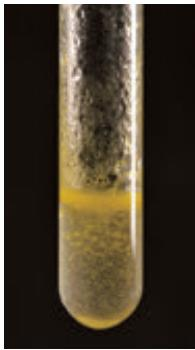

图9-6乳浊液

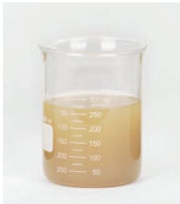

图9-7悬浊液

分散在溶液、乳浊液和悬浊液中的粒子大小是不同的。在溶液中溶质粒子的直径小于 $1 \mathrm { n m }$ ;在悬浊液和乳浊液中,粒子的直径大于 $1 0 0 \mathrm { n m }$ 。

乳浊液和悬浊液具有广泛的用途。例如,用X射线检查肠胃病时,让患者服用的钡餐就是硫酸钡的悬浊液。粉刷墙壁用的乳胶漆的主要原料一一合成树脂乳液是乳浊液。在农业上,为了合理使用农药,常把不溶于水的固体或液体农药配制成悬浊液或乳浊液,用来喷洒遭受病虫害的农作物。这样农药药液散失得少,附着在叶面上的多,药液喷洒均匀,既节省农药,又提高药效,使用还很方便。

# 学完本课题你知道了什么

1.一种或几种物质分散到另一种物质里,形成的均一、稳定的混合物,叫作溶液。能溶解其他物质的物质叫作溶剂;被溶解的物质叫作溶质。

2.水是一种最常用的溶剂。溶质可以是固体、液体或气体。

3.溶质在溶解的过程中通常伴随着热量的变化。

4.溶液在生产和生活中的应用非常广泛。

# 练习与应用

1.下列说法中,正确的是( )。

A.均一、稳定的液体一定是溶液B.溶液是均一、稳定的混合物C.长期放置后不会分层的液体一定是溶液D.溶液一定是无色的,且溶剂一定是水

2.下列各组物质中,前者为化合物,后者为溶液的一组是( )。

A.液氧、双氧水 B.氯化氢气体、稀盐酸C.蒸馏水、乙醇 D.澄清石灰水、干冰

3.下列说法中,不正确的是( )。

A.汽油、酒精都可以作溶剂  
B.溶质可以是固体、液体或气体  
C.溶液中各部分的组成不一定相同  
D.将固体试剂配制成溶液进行化学反应,可以增大反应速率

4.在盛有水的烧杯中加入以下某种物质,形成溶液后温度下降。这种物质可能是( )。

A.氯化钠 B.硝酸铵C.氢氧化钠 D.生石灰

5.如右图所示,将物质A加入水中,用玻璃棒搅拌,A“消失”在水中形成A溶液。

(1)A溶液一定是 (填“纯净物”或“混合物”)。

(2)用玻璃棒搅拌的目的是。

(3)若A为氯化钠,则其在溶液中以(填粒子符号)的形式存在;若A为蔗糖,则其在溶液中以(填粒子名称)的形式存在。

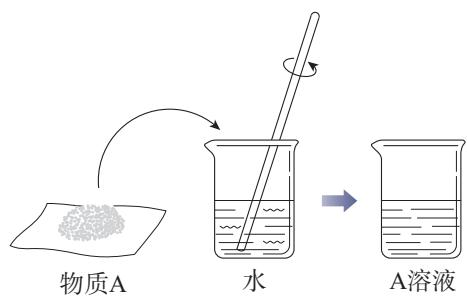

6.写出下列溶液中的溶质和溶剂(能用化学式表示的,写出化学式)。

<table><tr><td rowspan=1 colspan=1>溶液</td><td rowspan=1 colspan=1>溶质</td><td rowspan=1 colspan=1>溶剂</td></tr><tr><td rowspan=1 colspan=1>稀硫酸</td><td rowspan=1 colspan=1></td><td rowspan=1 colspan=1></td></tr><tr><td rowspan=1 colspan=1>高锰酸钾溶液</td><td rowspan=1 colspan=1></td><td rowspan=1 colspan=1></td></tr><tr><td rowspan=1 colspan=1>硫酸铜溶液</td><td rowspan=1 colspan=1></td><td rowspan=1 colspan=1></td></tr><tr><td rowspan=1 colspan=1>碳酸钠溶液</td><td rowspan=1 colspan=1></td><td rowspan=1 colspan=1></td></tr><tr><td rowspan=1 colspan=1>澄清石灰水</td><td rowspan=1 colspan=1></td><td rowspan=1 colspan=1></td></tr><tr><td rowspan=1 colspan=1>医用酒精</td><td rowspan=1 colspan=1></td><td rowspan=1 colspan=1></td></tr><tr><td rowspan=1 colspan=1>碘的汽油溶液</td><td rowspan=1 colspan=1></td><td rowspan=1 colspan=1></td></tr></table>

7.生理盐水是医疗上常用的一种溶液,合格的生理盐水是无色透明的。一瓶合格的生理盐水密封放置一段时间后,是否会出现浑浊现象?为什么?

8.在许多情况下,人们希望能够较快地溶解某些固体。根据你的生活经验,请说出哪些方法可以加快冰糖晶体在水中的溶解,并说明理由。

# 课题2

# 溶解度

我们已经知道,蔗糖或氯化钠易溶于水。那么,在一定条件下,它们能不能无限度地溶解在一定量的水中呢?

# 一、饱和溶液

# 【实验9-5】

在室温下,如图9-8所示,向盛有 $1 0 ~ \mathrm { m L }$ 水的烧杯中加入2g氯化钠,搅拌;待溶解后,再加入2g氯化钠,搅拌,观察现象。然后再加入10mL水,搅拌,观察现象。

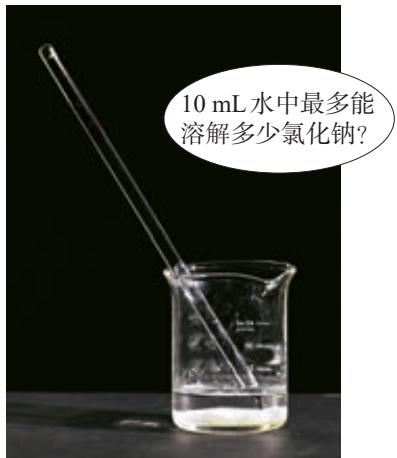

图9-8氯化钠在水中的溶解

<table><tr><td rowspan=1 colspan=1>实验内容</td><td rowspan=1 colspan=1>现象</td><td rowspan=1 colspan=1>分析</td></tr><tr><td rowspan=1 colspan=1>加入2g氯化钠，搅拌</td><td rowspan=1 colspan=1></td><td rowspan=1 colspan=1></td></tr><tr><td rowspan=1 colspan=1>再加入2g氯化钠，搅拌</td><td rowspan=1 colspan=1></td><td rowspan=1 colspan=1></td></tr><tr><td rowspan=1 colspan=1>再加入10mL水，搅拌</td><td rowspan=1 colspan=1></td><td rowspan=1 colspan=1></td></tr></table>

在一定温度下,向一定量溶剂里加入某种溶质,当溶质不能继续溶解时,所得到的溶液叫作这种溶质的饱和溶液;还能继续溶解溶质的溶液,叫作这种溶质的不饱和溶液。

在实验9-5中,当氯化钠能继续溶解时,溶液是不饱和的;当氯化钠固体不能继续溶解而有剩余时,溶液就变成了饱和的。当再加入水,溶液又从饱和的变成不饱和的,剩余的氯化钠固体则可以继续溶解。

饱和溶液saturated solution  
不饱和溶液unsaturated solution

# 【实验9-6】

在室温下,向盛有 $1 0 ~ \mathrm { m L }$ 水的烧杯中加入3g硝酸钾,搅拌;待溶解后,再加入3g硝酸钾,搅拌,观察现象。当烧杯中硝酸钾固体有剩余而不再溶解时,加热烧杯一段时间(如图9-9),观察剩余固体有什么变化。然后再加入3g硝酸钾,搅拌,观察现象。静置,待溶液冷却后,观察现象。

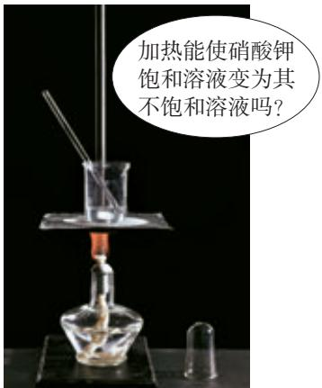

图9-9硝酸钾在水中的溶解

<table><tr><td rowspan=1 colspan=1>实验内容</td><td rowspan=1 colspan=1>现象</td><td rowspan=1 colspan=1>分析</td></tr><tr><td rowspan=1 colspan=1>加入3g硝酸钾，搅拌</td><td rowspan=1 colspan=1></td><td rowspan=1 colspan=1></td></tr><tr><td rowspan=1 colspan=1>再加入3g硝酸钾，搅拌</td><td rowspan=1 colspan=1></td><td rowspan=1 colspan=1></td></tr><tr><td rowspan=1 colspan=1>加热烧杯</td><td rowspan=1 colspan=1></td><td rowspan=1 colspan=1></td></tr><tr><td rowspan=1 colspan=1>再加入3g硝酸钾，搅拌</td><td rowspan=1 colspan=1></td><td rowspan=1 colspan=1></td></tr><tr><td rowspan=1 colspan=1>静置，冷却</td><td rowspan=1 colspan=1></td><td rowspan=1 colspan=1></td></tr></table>

结晶crystallization

在实验9-6中,第二次加入的硝酸钾不能全部溶解,但加热后,剩余的硝酸钾固体能够继续溶解,且再次加入的硝酸钾也能全部溶解。这说明,当温度升高时,室温下的硝酸钾饱和溶液变成了较高温度下的不饱和溶液,因而能继续溶解硝酸钾。

上述实验说明,在增加溶剂或升高温度的情况下,饱和溶液可以变成不饱和溶液。因此,只有指明“在一定量溶剂里”和“在一定温度下”,溶液的“饱和”和“不饱和”才有确定的意义。

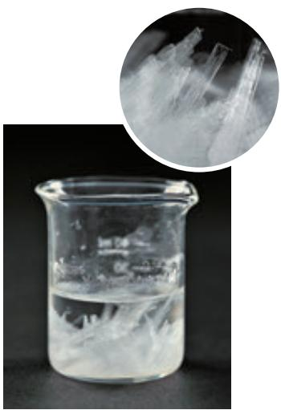

图9-10硝酸钾晶体从饱和溶液中析出

在实验9-6中还可以看到,当热的硝酸钾溶液冷却后,烧杯底部出现了固体。这是因为在冷却过程中,硝酸钾不饱和溶液变成了饱和溶液;温度继续降低,过多的硝酸钾会从饱和溶液中以晶体的形式析出(如图9-10),这一过程叫作结晶。结晶可以使溶质从溶液中析出,从而实现混合物的分离。

# 思考与讨论

你听说过用海水晒盐吗?查阅资料,了解用海水晒盐的过程,与同学交流。

除了冷却热的饱和溶液的方法,蒸发溶剂也是一种获得晶体的常用方法。例如,用海水晒盐并获得氯化钠等产品的大致过程如下:

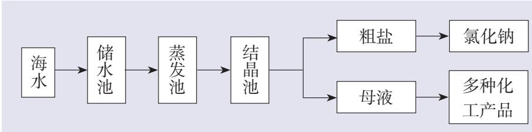

晒盐时,利用涨潮将海水引入“储水池”;待海水澄清后,引入“蒸发池”,经过风吹和日晒后水分部分蒸发;水分蒸发到一定程度后引入“结晶池”,继续风吹和日晒,海水就会慢慢成为食盐的饱和溶液;再晒,食盐晶体就会逐渐从海水中析出,得到粗盐,同时得到含有大量化工原料的母液(叫作苦卤)。

综上所述,在一般情况下,不饱和溶液与饱和溶液之间的转化关系及结晶的方法可以表示如下:

增加溶质、蒸发溶剂或降低温度 蒸发溶剂不饱和溶液< →饱和溶液 →结晶增加溶剂或升高温度 冷却

# 二、溶解度

溶解度solubility

通过上述实验,我们大致可以得出以下结论:在室温下, $1 0 ~ \mathrm { m L }$ 水中所能溶解的氯化钠或硝酸钾的质量都有一个限度,这就是形成其饱和溶液时所能溶解的最大质量。在一定温度下,绝大多数物质在一定量溶剂里的溶解是有限度的。化学上用溶解度表示这种溶解的限度。

# 资料卡片

溶解度的相对大小(20℃)

固体的溶解度表示在一定温度下,某固态物质在 $\boldsymbol { 1 0 0 } \ \mathrm { g }$ 溶剂里达到饱和状态时所溶解的质量。如果不指明溶剂,通常所说的溶解度是指物质在水里的溶解度。例如,在 $2 0 ~ \mathrm { { ‰} }$ 时, $\boldsymbol { 1 0 0 \ \mathrm { g } }$ 水里最多能溶解 $3 6 ~ \mathrm { g }$ 氯化钠(这时溶液达到饱和状态),我们就说在 $2 0 ~ \mathrm { { ‰} }$ 时,氯化钠在水里的溶解度是 $3 6 \mathrm { g }$ 。

表9-1几种物质在不同温度时的溶解度

<table><tr><td rowspan=1 colspan=1>溶解度/g</td><td rowspan=1 colspan=1>一般称为</td></tr><tr><td rowspan=1 colspan=1><0.01</td><td rowspan=1 colspan=1>难溶</td></tr><tr><td rowspan=1 colspan=1>0.01~1</td><td rowspan=1 colspan=1>微溶</td></tr><tr><td rowspan=1 colspan=1>1~10</td><td rowspan=1 colspan=1>可溶</td></tr><tr><td rowspan=1 colspan=1>>10</td><td rowspan=1 colspan=1>易溶</td></tr></table>

用实验的方法可以测出物质在不同温度时的溶解度,如表9-1所示。

<table><tr><td rowspan=1 colspan=2>温度/℃</td><td rowspan=1 colspan=1>0</td><td rowspan=1 colspan=1>10</td><td rowspan=1 colspan=1>20</td><td rowspan=1 colspan=1>30</td><td rowspan=1 colspan=1>40</td><td rowspan=1 colspan=1>50</td><td rowspan=1 colspan=1>60</td><td rowspan=1 colspan=1>70</td><td rowspan=1 colspan=1>80</td><td rowspan=1 colspan=1>90</td><td rowspan=1 colspan=1>100</td></tr><tr><td rowspan=4 colspan=1>武g</td><td rowspan=1 colspan=1>NaC1</td><td rowspan=1 colspan=1>35.7</td><td rowspan=1 colspan=1>35.8</td><td rowspan=1 colspan=1>36.0</td><td rowspan=1 colspan=1>36.3</td><td rowspan=1 colspan=1>36.6</td><td rowspan=1 colspan=1>37.0</td><td rowspan=1 colspan=1>37.3</td><td rowspan=1 colspan=1>37.8</td><td rowspan=1 colspan=1>38.4</td><td rowspan=1 colspan=1>39.0</td><td rowspan=1 colspan=1>39.8</td></tr><tr><td rowspan=1 colspan=1>KC1</td><td rowspan=1 colspan=1>27.6</td><td rowspan=1 colspan=1>31.0</td><td rowspan=1 colspan=1>34.0</td><td rowspan=1 colspan=1>37.0</td><td rowspan=1 colspan=1>40.0</td><td rowspan=1 colspan=1>42.6</td><td rowspan=1 colspan=1>45.5</td><td rowspan=1 colspan=1>48.3</td><td rowspan=1 colspan=1>51.1</td><td rowspan=1 colspan=1>54.0</td><td rowspan=1 colspan=1>56.7</td></tr><tr><td rowspan=1 colspan=1>NH4C1</td><td rowspan=1 colspan=1>29.4</td><td rowspan=1 colspan=1>33.3</td><td rowspan=1 colspan=1>37.2</td><td rowspan=1 colspan=1>41.4</td><td rowspan=1 colspan=1>45.8</td><td rowspan=1 colspan=1>50.4</td><td rowspan=1 colspan=1>55.2</td><td rowspan=1 colspan=1>60.2</td><td rowspan=1 colspan=1>65.6</td><td rowspan=1 colspan=1>71.3</td><td rowspan=1 colspan=1> 77.3</td></tr><tr><td rowspan=1 colspan=1>KNO3</td><td rowspan=1 colspan=1>13.3</td><td rowspan=1 colspan=1>20.9</td><td rowspan=1 colspan=1>31.6</td><td rowspan=1 colspan=1>45.8</td><td rowspan=1 colspan=1>63.9</td><td rowspan=1 colspan=1>85.5</td><td rowspan=1 colspan=1>110</td><td rowspan=1 colspan=1>138</td><td rowspan=1 colspan=1>169</td><td rowspan=1 colspan=1>202</td><td rowspan=1 colspan=1>246</td></tr></table>

# 探究

# 溶解度曲线

【问题】

如何根据表9-1的数据推测表中物质在某一未测温度(如 $2 5 \ \mathrm { ~ ‰ ~ }$ 、 $8 5 ~ \mathrm { { ‰ } }$ 等)时的溶解度呢?

# 【方案设计】

根据表9-1的数据绘制曲线,并获得所需要的信息。

# 【方案实施】

(1)绘制溶解度曲线。

用纵坐标表示溶解度,横坐标表示温度,根据表9-1所提供的数据,在坐标纸上(或利用计算机软件)绘制几种物质的溶解度随温度变化的曲线——溶解度曲线。

(2)应用溶解度曲线。

在绘制的溶解度曲线上,查出上述几种物质在 $2 5 ~ \mathrm { { ‰} }$ 和 $8 5 ~ \mathrm { { ^ \circ C } }$ 时的溶解度。

<table><tr><td rowspan=1 colspan=2>温度/℃</td><td rowspan=1 colspan=1>25</td><td rowspan=1 colspan=1>85</td></tr><tr><td rowspan=4 colspan=1>武</td><td rowspan=1 colspan=1>NaC1</td><td rowspan=1 colspan=1></td><td rowspan=1 colspan=1></td></tr><tr><td rowspan=1 colspan=1>KC1</td><td rowspan=1 colspan=1></td><td rowspan=1 colspan=1></td></tr><tr><td rowspan=1 colspan=1>NH4C1</td><td rowspan=1 colspan=1></td><td rowspan=1 colspan=1></td></tr><tr><td rowspan=1 colspan=1>KNO3</td><td rowspan=1 colspan=1></td><td rowspan=1 colspan=1></td></tr></table>

(3)分析溶解度曲线。

图9-11和图9-12给出了几种固体的溶解度曲线。请与你绘制的溶解度曲线进行比较,并讨论以下问题,得出结论。

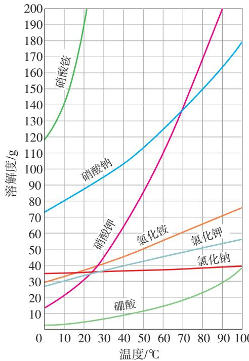

图9-11几种固体的溶解度曲线

$\textcircled{1}$ 这些固体的溶解度随温度的变化有什么规律?举例说明。

$\textcircled{2}$ 从溶解度曲线中,你还能获得哪些信息?

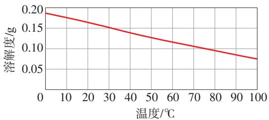

图9-12氢氧化钙的溶解度曲线

结论:

利用溶解度曲线,我们可以查出某物质在不同温度时的溶解度,可以比较不同物质在同一温度时溶解度的大小,可以比较不同物质的溶解度受温度变化影响的大小,可以看出物质的溶解度随温度变化的规律,等等。

从图9-11和图9-12可以看出,多数固体的溶解度随温度的升高而增大,如硝酸钾、氯化铵等;少数固体的溶解度受温度变化的影响很小,如氯化钠;极少数固体的溶解度随温度的升高而减小,如氢氧化钙。

# 思考与讨论

溶解度数据表(如表9-1)和溶解度曲线(如图9-11)都可以表示物质在不同温度时的溶解度,二者有什么区别?通过溶解度数据表和溶解度曲线所提供的不同信息,你能否体会到数据处理的方法不同,获得结果的形式和作用就不同?与同学交流。

# 方法导引

# 数据处理

以表格或曲线的形式呈现物质的溶解度及其变化,就是对实验测得的溶解度的原始数据进行处理的结果。

数据处理是对已有数据进行加工的过程,目的是从大量的、可能是无序的数据中,抽取出有价值、有意义的数据,通过处理、分析,发现规律。列表和作图是常用的数据处理方法。数据处理在科学研究、工农业生产和经济活动等领域有广泛的应用。

人民教育出版社

因为称量气体的质量比较困难,所以气体的溶解度常用体积来表示。通常用的气体的溶解度,是指该气体的压强为 $1 0 1 \ \mathrm { k P a }$ 和一定温度时,在1体积水里溶解达到饱和状态时的气体体积①。例如,氮气的压强为 $1 0 1 \ \mathrm { k P a }$ 、温度为 $0 ~ \mathrm { { ^ \circ C } }$ 时,1体积水里最多能溶解0.024体积的氮气,则在 $0 \textrm {‰}$ 时,氮气的溶解度为0.024。

# 思考与讨论

如图9-13所示,打开汽水(含有二氧化碳气体的饮料)瓶盖时,汽水有时会喷出来。请分析原因,并与同学交流。

图9-13打开瓶盖后汽水自动喷出

# 科学·技术·社会

# 如何增加养鱼池水中的含氧量

海水、河水或湖水中都溶解了一定量的氧气。养鱼池中常常由于浮游生物大量繁殖、天气异常等导致水中含氧量降低,造成鱼缺氧,缺氧严重时甚至会造成鱼大量死亡。因此,要设法增加水中的含氧量。给养鱼池增氧的方法很多,常见的方法是利用增氧机把水喷向空中(如图9-14)或把水搅动起来,这样可以增大空气与水的接触面积,从而增加水中氧气的溶解量。在寒冷的冬季,北方养鱼池的冰面上总要打很多洞,目的也是增加水中氧气的溶解量。

图9-14把水喷向空中可以增加水中氧气的溶解量

# 调查与研究

空间站的环境控制和生命保障系统对长期在轨驻留的航天员而言至关重要。查阅资料,了解中国空间站所采用的航天员饮用水保障技术,并与同学交流。

# 学完本课题你知道了什么

1.在一定温度下,向一定量溶剂里加入某种溶质,当溶质不能继续溶解时,所得的溶液叫作这种溶质的饱和溶液。  
2.固体的溶解度表示在一定温度下,某固态物质在 $\boldsymbol { 1 0 0 \ \mathrm { g } }$ 溶剂里达到饱和状态时所溶解的质量。  
3.气体的溶解度通常是指该气体的压强为 $1 0 1 \ \mathrm { k P a }$ 和一定温度时,在1体积水里溶解达到饱和状态时的气体体积。  
4.物质的溶解度随温度变化的曲线叫作溶解度曲线。利用溶解度曲线,可以获得许多有关物质溶解度的信息。

# 练习与应用

1.下列关于饱和溶液的说法中,正确的是( )。

A.不能再溶解某种溶质的溶液B.在一定量的溶剂里不能再溶解某种溶质的溶液C.在一定温度下,不能再溶解某种溶质的溶液D.在一定温度下,一定量的溶剂里不能再溶解某种溶质的溶液

2.在 $2 0 ~ \mathrm { { ^ { \circ } C } }$ 时,将 $1 7 \ \mathrm { g \ K C l }$ 加入 $5 0 ~ \mathrm { g }$ 水中,完全溶解后溶液恰好达到饱和状态,则该温度下KCI的溶解度是( )。

A $1 7 \ \mathrm { g }$ B. $5 0 \ \mathrm { g }$   
C. $3 4 \ \mathrm { g }$ D. $1 0 0 \ \mathrm { g }$ 

3.保持温度不变,将 $2 0 ~ \mathrm { ~ \mathscr ~ { ~ C ~ } ~ }$ 的 $\mathrm { K N O } _ { 3 }$ 溶液蒸发掉 $1 0 \ \mathrm { g }$ 水,则下列各量一定保持不变的是( )。

A.溶质质量 B.溶剂质量C.溶液质量 D. $\mathrm { K N O } _ { 3 }$ 的溶解度

4.不同温度下NaCl的溶解度如下表所示。在 $2 0 ~ \mathrm { \textdegree C }$ 时,将 $5 0 \ \mathrm { g \ N a C l }$ 加入盛有 $\boldsymbol { 1 0 0 \ \mathrm { g } }$ 水的烧杯中,充分溶解得到溶液。下列说法中,正确的是( )。

<table><tr><td rowspan=1 colspan=1>温度/℃</td><td rowspan=1 colspan=1>20</td><td rowspan=1 colspan=1>40</td><td rowspan=1 colspan=1>60</td><td rowspan=1 colspan=1>80</td><td rowspan=1 colspan=1>100</td></tr><tr><td rowspan=1 colspan=1>溶解度/g</td><td rowspan=1 colspan=1>36.0</td><td rowspan=1 colspan=1>36.6</td><td rowspan=1 colspan=1>37.3</td><td rowspan=1 colspan=1>38.4</td><td rowspan=1 colspan=1>39.8</td></tr></table>

A. $2 0 ~ \mathrm { { ^ { \circ } C } }$ 时烧杯中溶液的质量为 $1 5 0 \ \mathrm { g }$ B. $2 0 ~ \mathrm { { ^ { \circ } C } }$ 时再加入 $5 0 \ \mathrm { g }$ 水,充分搅拌后烧杯中仍有固体剩余C.升温到 $1 0 0 ~ \mathrm { { ‰} }$ ,烧杯中的饱和溶液变为不饱和溶液D. $2 0 { \sim } 1 0 0 ~ \mathrm { ^ { \circ } C }$ 时,NaCl的溶解度随温度的升高而增大

5.请列出三种方法,把接近饱和状态的 $\mathrm { K N O } _ { 3 }$ 溶液变为饱和溶液。

6.甲、乙两种物质的溶解度曲线如右图所示。请根据图示回答下列问题。

(1)甲、乙两种物质中,溶解度受温度影响较大的是。

(2) $M$ 点的意义是。

(3)在 $a _ { 2 }$ $\mathcal { C }$ 时,乙的溶解度为 。在 $a _ { 2 } \textrm { ‰}$ 时,将 $5 0 ~ \mathrm { g }$ 甲加入 $5 0 ~ \mathrm { g }$ 水中,充分溶解后所得溶液的质量为

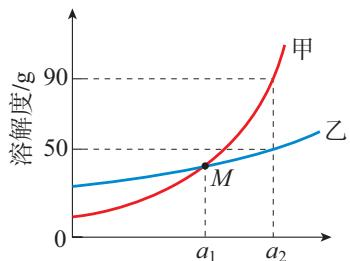

温度/ $\mathcal { C }$ 

7.下图所示是用海水晒盐并获得氯化钠等产品的大致过程。

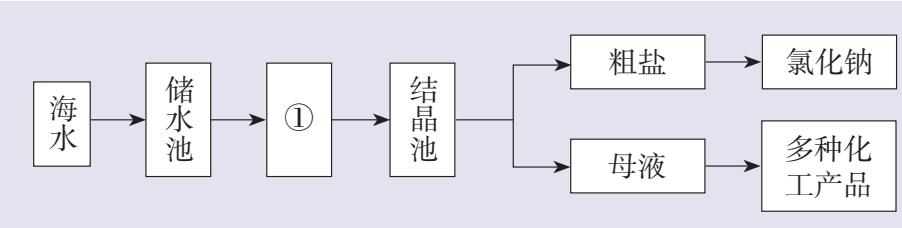

(1)图中 $\textcircled{1}$ 是 (填“蒸发”或“冷却”)池。

(2)根据海水晒盐的原理,下列说法中,正确的是 (填字母)。

a.海水进入“储水池”,海水的成分基本不变b.在 $\textcircled{1}$ 中,海水中氯化钠的质量逐渐增大c.在 $\textcircled{1}$ 中,海水中水的质量逐渐减小d.析出晶体后的母液是氯化钠的不饱和溶液

8.山西运城盐湖地区的“垦畦浇晒”产盐法,发展成熟于隋唐时期,至今仍在沿用。查阅资料,了解“垦畦浇晒”产盐法的生产步骤及这种古法产盐工艺的历史价值,并以流程图、小论文等形式进行说明。

# 课题3

# 溶质的质量分数

我们都有这样的生活经验:在两杯等量的水中分别加入1勺蔗糖和2勺蔗糖,完全溶解后两杯糖水的甜度是不同的,表明这两杯糖水的浓稀程度不同。那么,在化学中如何定量地表示溶液的浓稀程度呢?

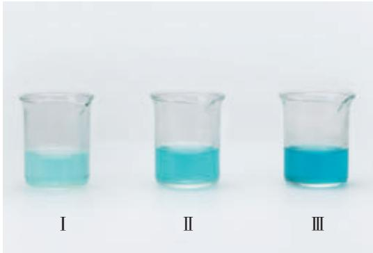

图9-15三种浓稀程度不同的硫酸铜溶液

# 【实验9-7】

在室温下,向三个小烧杯中各加入 $2 0 ~ \mathrm { m L ^ { ( 1 ) } }$ 水,然后分别加入0.1g、$0 . 5 \ \mathrm { g } \_ { \mathrm { 2 } \mathrm { ~ g } }$ 无水硫酸铜,用玻璃棒搅拌,使硫酸铜全部溶解,比较三种硫酸铜溶液的颜色(如图9-15)。在这三种溶液中,哪种溶液最浓?哪种溶液最稀?你判断的根据是什么?

<table><tr><td rowspan=1 colspan=1>烧杯编号</td><td rowspan=1 colspan=1>溶液颜色比较</td><td rowspan=1 colspan=1>溶剂质量/g</td><td rowspan=1 colspan=1>溶质质量/g</td><td rowspan=1 colspan=1>溶液质量/g</td></tr><tr><td rowspan=1 colspan=1>I</td><td rowspan=1 colspan=1></td><td rowspan=1 colspan=1></td><td rowspan=1 colspan=1></td><td rowspan=1 colspan=1></td></tr><tr><td rowspan=1 colspan=1>Ⅱ</td><td rowspan=1 colspan=1></td><td rowspan=1 colspan=1></td><td rowspan=1 colspan=1></td><td rowspan=1 colspan=1></td></tr><tr><td rowspan=1 colspan=1>Ⅲ</td><td rowspan=1 colspan=1></td><td rowspan=1 colspan=1></td><td rowspan=1 colspan=1></td><td rowspan=1 colspan=1></td></tr></table>

一般情况下,对于有色溶液来说,根据颜色的深浅可以判断溶液的浓稀程度。这种方法比较粗略,不能准确地表明一定量的溶液里究竟含有多少溶质。在实际应用中,常常要准确知道一定量的溶液里所含溶质的量,即浓度。例如:在施用农药时,如果药液过浓,会毒害农作物;如果药液过稀,则不能有效地杀虫灭菌。因此,我们需要准确地知道一定量的药液里所含农药有效成分的量。

表示浓度的方法很多,这里主要介绍溶质的质量分数。

溶液中溶质的质量分数是溶质质量与溶液质量之比,可用下式进行计算:

溶质的质量分数 $= \frac { \sqrt [ 4 ] { \frac { 1 } { 1 2 } } \sqrt { \frac { 1 } { 1 1 } } \frac { 1 } { 1 2 } } { \sqrt [ 3 ] { \frac { 1 } { 1 2 } } \sqrt [ 3 ] { \frac { 1 } { 1 2 } } \frac { 1 } { 1 2 } } \times 1 0 0 \%$ 

# 【实验9-8’

# 

在室温下,根据下表给定的质量配制氯化钠溶液(如图9-16),观察固体能否全部溶解,并计算溶液中溶质的质量分数。

<table><tr><td rowspan=1 colspan=1>溶质质量/g</td><td rowspan=1 colspan=1>溶剂（水）质量/g</td><td rowspan=1 colspan=1>固体能否全部溶解</td><td rowspan=1 colspan=1>溶质的质量分数</td></tr><tr><td rowspan=1 colspan=1>10</td><td rowspan=1 colspan=1>90</td><td rowspan=1 colspan=1></td><td rowspan=1 colspan=1></td></tr><tr><td rowspan=1 colspan=1>20</td><td rowspan=1 colspan=1>80</td><td rowspan=1 colspan=1></td><td rowspan=1 colspan=1></td></tr></table>

# 思考与讨论

已知 $2 0 ~ \mathrm { ‰}$ 时,氯化钠的溶解度是 $3 6 ~ \mathrm { g }$ 。有人说:‘ $2 0 ~ \mathrm { { ^ { \circ } C } }$ 时氯化钠饱和溶液中溶质的质量分数为$3 6 \%$ 。”这种说法对吗?为什么?

溶质的质量分数mass fraction of solute

10g氯化钠

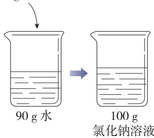

20g氯化钠

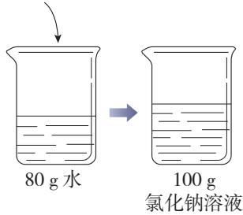

图9-16配制两种质量分数不同的氯化钠溶液示意图

【例题1】在农业生产中,可利用质量分数为$1 6 \%$ 的氯化钠溶液选种。现要配制 $1 5 0 ~ \mathrm { k g }$ 这种溶液,需要氯化钠和水的质量各是多少?

【解】

溶质的质量分数 $= \frac { \sqrt { 2 } \times \sqrt { 1 1 } \sqrt { 1 1 } \frac { 1 1 } { \sqrt { 1 1 } } \frac { 1 1 } { \sqrt { 1 1 } } } { \sqrt { 1 1 } \times \sqrt { 1 1 } \times \sqrt { 1 1 } } \times 1 0 0 \%$ 

溶质质量 $=$ 溶液质量 $\times$ 溶质的质量分数

$$
\begin{array} { l } { { = 1 5 0 \mathrm { k g } \times 1 6 \% } } \\ { { \ } } \\ { { = 2 4 \mathrm { k g } } } \end{array}
$$

溶剂质量 $=$ 溶液质量-溶质质量$\begin{array} { l } { { = 1 5 0 \mathrm { k g } - 2 4 \mathrm { k g } } } \\ { { \ } } \\ { { = 1 2 6 \mathrm { k g } } } \end{array}$ 答:需要 $2 4 \mathrm { k g }$ 氯化钠和 $1 2 6 \mathrm { k g }$ 水。

【例题2】化学实验室有质量分数为 $9 8 \%$ 的浓硫酸,现需要用较稀的硫酸进行实验。要把 $5 0 \ \mathrm { g }$ 上述浓硫酸稀释为质量分数为 $20 \%$ 的硫酸,需要水的质量是多少?

# 资料卡片

# 体积分数

除了质量分数,人们有时也用体积分数来表示浓度。例如,用作消毒剂的医用酒精中乙醇的体积分数为 $7 5 \%$ ,就是指每100体积的医用酒精中含75体积的乙醇。

【分析】溶液稀释前后,溶质的质量不变。

【解】设:稀释后溶液的质量为 $x$ 。

$$
5 0 \ \mathrm { g } \times 9 8 \% = x \times 2 0 \%
$$

$$
x = \frac { 5 0 { \mathrm { ~ g } } \times 9 8 \% } { 2 0 \% }
$$

$$
= 2 4 5 \ \mathrm { g }
$$

需要水的质量 $\begin{array} { c } { { \vdots = 2 4 5 \mathrm { ~ g - ~ } 5 0 \mathrm { ~ g } } } \\ { { } } \\ { { = 1 9 5 \mathrm { ~ g } } } \end{array}$ 答:需要水的质量是 $1 9 5 \ \mathrm { g }$ 。

在实验室中用固体配制一定溶质质量分数的溶液,步骤如下:计算所需固体和水的质量;用天平称量固体、量筒量取水;将固体和水混合,并用玻璃棒搅拌,使固体全部溶解;把配制好的溶液装入试剂瓶,贴上标签,放入试剂柜。

# 学完本课题你知道了什么

溶液中溶质的质量分数是溶质质量与溶液质量之比:

溶质的质量分数 $= \frac { \langle \dot { \mathcal { B } } - \mathcal { P } _ { \overline { { { \mathcal { D } } } } } ^ { \pm } \mathcal { P } _ { \overline { { { \mathcal { P } } } } } ^ { \pm } \frac { \Theta } { \Xi } } { \langle \dot { \mathcal { B } } - \dot { \mathcal { N } } _ { \overline { { { \mathcal { P } } } } } ^ { \pm } \mathcal { P } _ { \overline { { { \mathcal { P } } } } } ^ { \pm } } \times 1 0 0 \%$ 

可利用上式进行溶质质量分数的有关计算,并根据需要配制一定溶质质量分数的溶液。

# 练习与应用

1.下列对质量分数为 $10 \%$ 的 $\mathrm { N a O H }$ 溶液的理解中,不正确的是( )。

A. $1 0 \mathrm { g }$ 溶液中含有 $1 \mathrm { g N a O H }$   
B.溶液中溶质质量与溶剂质量之比为 $1 : 9$   
C. $1 0 0 \mathrm { g }$ 水中溶解有 $1 0 \mathrm { g N a O H }$   
D.将 $5 \mathrm { g N a O H }$ 固体完全溶解在 $4 5 \ \mathrm { g }$ 水中,可配制成该溶液

2.在其他条件不变的情况下,对 $\mathrm { K N O } _ { 3 }$ 溶液(编号为 $\textcircled{1}$ )进行下图所示实验。

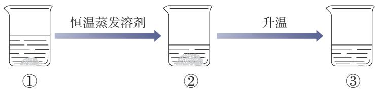

下列对编号 $\textcircled{1}$ 、 $\textcircled{2}$ 、 $\textcircled{3}$ 的溶液中溶质质量分数大小的比较,正确的是( )。

A. $\textcircled { 1 } > \textcircled { 2 } > \textcircled { 3 }$ B. $\textcircled{1} = \textcircled { 2 } > \textcircled { 3 }$   
C. $\textcircled{1} = \textcircled { 2 } < \textcircled { 3 }$ D. $\textcircled{1} < \textcircled { 2 } < \textcircled { 3 }$ 

3.在温度不变的情况下,对甲中的100mLNaCl饱和溶液进行下图所示实验。下列结论中,不正确的是( )。

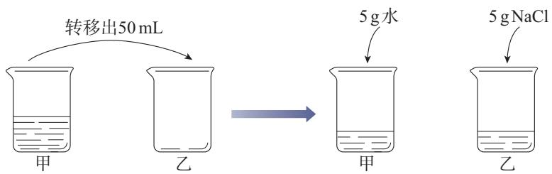

实验一

实验二

A.实验一后,甲和乙的溶液中溶质的质量分数相等B.实验二后,乙的溶液中溶质的质量分数增大C.实验二后,甲中溶液变为不饱和溶液D.实验二后,甲和乙的溶液中溶质的质量相等

4.在 $2 0 \textrm { ‰}$ 时,将 $4 0 \mathrm { g K N O } _ { 3 }$ 固体加入 $1 0 0 \mathrm { g }$ 水中,充分搅拌后,仍有 $8 . 4 \mathrm { g K N O } _ { 3 }$ 固体未溶解。

(1)所得溶液是 $2 0 ~ \mathrm { { ^ { \circ } C } }$ 时 $\mathrm { K N O } _ { 3 }$ 的 (填“饱和”或“不饱和”)溶液。  
(2)计算 $2 0 ~ \mathrm { { ^ { \circ } C } }$ 时 ${ \mathrm { K N O } } _ { 3 }$ 的溶解度。  
(3)计算所得溶液中 $\mathrm { K N O } _ { 3 }$ 的质量分数(计算结果保留一位小数)。

5.质量分数为 $2 \%$ 的过氧乙酸溶液常用于环境消毒。欲配制 $45 0 \mathrm { ~ g ~ } 2 \%$ 的过氧乙酸溶液,计算所需质量分数为 $1 5 \%$ 的过氧乙酸溶液的质量。

6. $1 0 0 \mathrm { g }$ 某浓度的稀硫酸恰好与 $1 3 \mathrm { g }$ 锌完全反应。试计算这种稀硫酸中溶质的质量分数。

7.请根据以下步骤自制汽水:

$\textcircled{1}$ 在 $5 0 0 \mathrm { m L }$ 饮料瓶中加入2勺蔗糖、 $1 . 5 \mathrm { g }$ 食品级碳酸氢钠;  
$\textcircled{2}$ 注入饮用水;  
$\textcircled{3}$ 加入 $1 . 5 \mathrm { g }$ 食品级柠檬酸,并立即旋紧瓶盖,摇匀。  
(1)查阅资料,说明加入柠檬酸后立即旋紧瓶盖的原因。  
(2)如果在炎热的夏天,将制得的汽水放入冰箱冷藏一段时间后取出,打开瓶盖时可能会出现什么现象?试根据所学知识解释原因。

# 整理与提升

# 一、认识溶液及其组成

1.定性认识

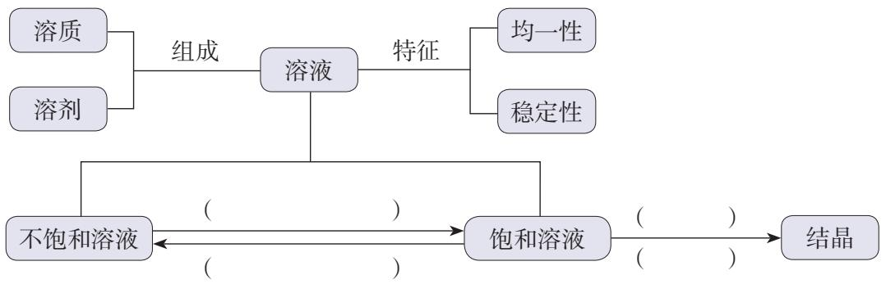

2.定量认识

限度 浓度溶解度 溶液 溶质的质量分数

<table><tr><td rowspan=1 colspan=1>有关的量</td><td rowspan=1 colspan=1>固体的溶解度</td><td rowspan=1 colspan=1>溶质的质量分数</td></tr><tr><td rowspan=1 colspan=1>含义</td><td rowspan=1 colspan=1></td><td rowspan=1 colspan=1></td></tr><tr><td rowspan=1 colspan=1>区别和联系</td><td rowspan=1 colspan=2></td></tr></table>

在实验室中,可按照一定的步骤配制一定溶质质量分数的溶液。

# 二、认识溶液的应用

举例说明生产、生活等领域中溶液的使用,体会溶液的应用价值。

# 复习与提高

1.下列医疗常用的溶液中,溶剂不是水的是( )。

A.葡萄糖注射液 B.生理盐水C.医用酒精 D.碘酒

2.在一定温度下,某饱和氯化钠溶液露置于空气中一段时间后,容器底部有少量固体析出。此时( )。

A.溶液的质量不变B.溶液中溶质的质量分数不变C.溶液中溶剂的质量不变D.溶液变为不饱和溶液

3.宋代《开宝本草》中记载了 $\mathrm { K N O } _ { 3 }$ 的制取过程,“所在山泽,冬月地上有霜,扫取以水淋汁后,乃煎炼而成”。上述制取过程中未涉及的实验过程是( )。

A.溶解 B.蒸发C.结晶 D.蒸馏

4.不同温度下 $\mathrm { K N O } _ { 3 }$ 的溶解度如下表所示。下列说法中,正确的是( )。

<table><tr><td rowspan=1 colspan=1>温度/℃</td><td rowspan=1 colspan=1>30</td><td rowspan=1 colspan=1>40</td><td rowspan=1 colspan=1>50</td></tr><tr><td rowspan=1 colspan=1>溶解度/g</td><td rowspan=1 colspan=1>45.8</td><td rowspan=1 colspan=1>63.9</td><td rowspan=1 colspan=1>85.5</td></tr></table>

A.在 $3 0 ~ \mathrm { { ^ {circ } C } }$ 时, $1 0 0 \mathrm { g K N O } _ { 3 }$ 饱和溶液中溶质的质量为 $4 5 . 8 \ \mathrm { g }$ B.在 $4 0 ~ \mathrm { { ^ \circ C } }$ 时, $1 0 0 \mathrm { g K N O } _ { 3 }$ 饱和溶液中溶质的质量分数为 $6 3 . 9 \%$ C.在 $4 0 ~ \mathrm { { ^ \circ C } }$ 时,将 $7 0 \mathrm { g K N O } _ { 3 }$ 固体加入 $1 0 0 \ \mathrm { g }$ 水中得到 $1 7 0 \ \mathrm { g }$ 溶液D.在 $5 0 ~ \mathrm { { ^ { \circ } C } }$ 时, $1 0 0 \ \mathrm { g }$ 水中最多能溶解 $8 5 . 5 \mathrm { g } \mathrm { K N O } _ { 3 }$ 固体

5.在 $2 0 ~ \mathrm { { ^ { \circ } C } }$ 时,按下表数据配制 $\mathrm { M g C l } _ { 2 }$ 溶液(已知: $2 0 ~ \mathrm { { ^ { \circ } C } }$ 时 $\mathrm { M g C l } _ { 2 }$ 的溶解度为 $5 4 . 6 \ \mathrm { g }$ )。

<table><tr><td rowspan=1 colspan=1>序号</td><td rowspan=1 colspan=1>①</td><td rowspan=1 colspan=1>②</td><td rowspan=1 colspan=1>③</td><td rowspan=1 colspan=1>④</td></tr><tr><td rowspan=1 colspan=1>MgCl2的质量/g</td><td rowspan=1 colspan=1>30</td><td rowspan=1 colspan=1>40</td><td rowspan=1 colspan=1>50</td><td rowspan=1 colspan=1>60</td></tr><tr><td rowspan=1 colspan=1>水的质量/g</td><td rowspan=1 colspan=1>100</td><td rowspan=1 colspan=1>100</td><td rowspan=1 colspan=1>100</td><td rowspan=1 colspan=1>100</td></tr></table>

(1)所得溶液中,属于饱和溶液的是( )。

A $\textcircled{1}$ B. $\textcircled{2}$   
C. $\textcircled{3}$ D. $\textcircled{4}$ 

(2)所得溶液中,溶质与溶剂的质量比为 $1 : 2$ 的是( )。

A $\textcircled{1}$ B. $\textcircled{2}$ 

C. $\textcircled{3}$ D. $\textcircled{4}$ (3) $\textcircled{1}$ 所得溶液中溶质的质量分数为( )。

A. $2 3 . 1 \%$ B. $3 0 . 0 \%$   
C. $3 5 . 3 \%$ D. $4 2 . 9 \%$ 

6.甲、乙两种物质的溶解度曲线如下图所示。

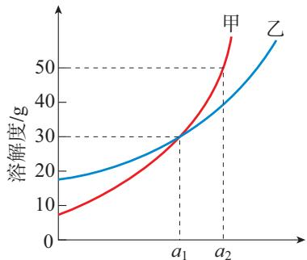

温度/℃

(1)在 $a _ { 1 } \textrm { } ^ { \circ } \mathrm { C }$ 时,甲、乙溶液中溶质的质量分数 (填“一定”或“不一定”)相等。

(2)在 $a _ { 1 } \textrm { ‰}$ 时,将 $2 0 \ \mathrm { g }$ 乙加入 $5 0 ~ \mathrm { g }$ 水中,充分溶解后所得溶液为 (填“饱和”或“不饱和”)溶液。

(3)在 $a _ { 2 } ~ \mathrm { { ^ C } }$ 时,将 $6 0 \ \mathrm { g }$ 甲加入 $1 0 0 \ \mathrm { g }$ 水中,所得溶液中溶质的质量分数为(计算结果保留一位小数)。

7.我国某盐湖地区有“夏天晒盐,冬天捞碱”的说法,这里的“盐”是指NaCl,“碱”是指 ${ \mathrm { N a } } _ { 2 } { \mathrm { C O } } _ { 3 }$ 。请根据 $\mathrm { N a C l }$ 、 ${ \mathrm { N a } } _ { 2 } { \mathrm { C O } } _ { 3 }$ 的溶解度曲线回答下列问题。

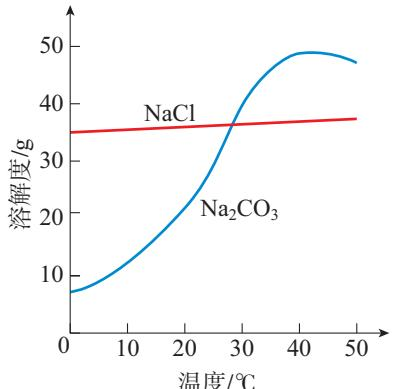

(1)当温度小于 时,NaCl的溶解度大于 ${ \mathrm { N a } } _ { 2 } { \mathrm { C O } } _ { 3 }$ 的溶解度。

(2)夏天晒“盐”,需要经过 (填“蒸发结晶”或“降温结晶”)的过程。冬天捞“碱”,需要经过 (填“蒸发结晶”或“降温结晶”)的过程。

人们根据气候条件实现“盐”和“碱”的分离,这主要是利用“盐”和“碱”的 不同这一性质。

(3)冬天捞“碱”后湖水中一定含有的溶质是 (填化学式,下同),此时湖水中的 一定是饱和的。

8.在实验室中选用下图所示仪器,配制 $5 0 \ \mathrm { g }$ 质量分数为 $1 0 \%$ 的氯化钠溶液。

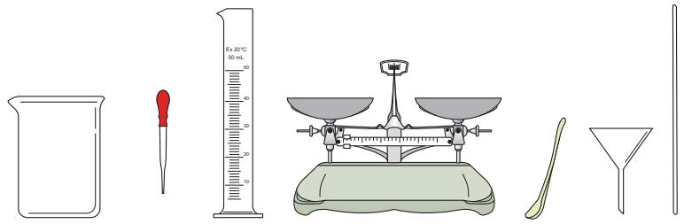

(1)计算所需氯化钠的质量。

(2)配制过程中,上图中的仪器不会用到的是 (填仪器名称)。

(3)若其他操作正确,量取水时俯视读数,对所配溶液中溶质的质量分数有什么影响?

9.为确定实验室某瓶盐酸(如右下图所示)中溶质的质量分数是否与标签标示相符,某同学利用此盐酸与大理石反应(杂质不参与反应,忽略HC1的挥发性)进行实验探究,数据记录如下表所示。

<table><tr><td rowspan=1 colspan=2>反应前物质的质量/g</td><td rowspan=2 colspan=1>充分反应后剩余物的总质量/g</td></tr><tr><td rowspan=1 colspan=1>盐酸</td><td rowspan=1 colspan=1>大理石（足量）</td></tr><tr><td rowspan=1 colspan=1>53.0</td><td rowspan=1 colspan=1>6.0</td><td rowspan=1 colspan=1>56.8</td></tr></table>

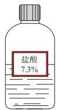

(1)计算实验中生成的 $\mathrm { C O } _ { 2 }$ 的质量。

(2)通过计算,确定该盐酸中溶质的质量分数是否与标签标示相符。

10.合理使用消毒剂,对于控制传染病的传播、保障人体健康具有重要作用。查阅资料,了解常用消毒剂(如医用酒精、“84”消毒液、碘酒等)的有效成分、应用范围、使用方法和注意事项等,并通过表格等形式进行整理,与同学交流。

# 实验活动6 一定溶质质量分数的氯化钠溶液的配制

# 【实验目的】

1.练习配制一定溶质质量分数的溶液。  
2.加深对溶质质量分数概念的理解。

# 【实验用品】

天平、称量纸、烧杯、玻璃棒、药匙、量筒、胶头滴管、空试剂瓶、空白标签。  
氯化钠、蒸馏水。

# 【实验步骤】

1.配制质量分数为 $6 \%$ 的氯化钠溶液。

(1)计算:配制 $5 0 \ \mathrm { g }$ 质量分数为 $6 \%$ 的氯化钠溶液,需要氯化钠 _g,水 g。

(2)称量:用天平称量所需质量的氯化钠,放入烧杯中。

(3)量取:用量筒量取所需体积的水,倒入盛有氯化钠的烧杯中。

(4)溶解:用玻璃棒搅拌,使氯化钠溶解。

整个配制过程如图9-17所示。

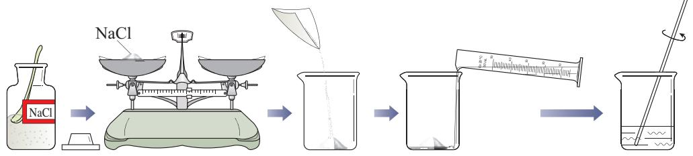

图9-17配制一定溶质质量分数的氯化钠溶液示意图

2.配制质量分数为 $3 \%$ 的氯化钠溶液。

用已配好的质量分数为 $6 \%$ 的氯化钠溶液(密度为$1 . 0 4 ~ \mathrm { g / c m } ^ { 3 }$ ),配制 $5 0 \ \mathrm { g }$ 质量分数为 $3 \%$ 的氯化钠溶液。

# 想一想

(1)计算:配制 $5 0 \mathrm { g }$ 质量分数为 $3 \%$ 的氯化钠溶液,需要质量分数为 $6 \%$ 的氯化钠溶液 g(体积 mL),水 g(体积 mL)。

由浓溶液配制稀溶液时,计算的依据是什么?

(2)量取:用量筒分别量取所需体积的氯化钠溶液和水,倒入烧杯中。

(3)混匀:用玻璃棒搅拌,使液体混合均匀。

3.把配制好的上述两种氯化钠溶液分别装入试剂瓶,盖好瓶塞并贴上标签(标签上应标明试剂名称和溶液中溶质的质量分数),放入试剂柜。

# 【问题与交流】

1.用量筒量取液体,读数时应注意什么?  
2.准确配制一定溶质质量分数的溶液,在实际应用中有什么重要意义?请举例说明。

# 实验活动7 粗盐中难溶性杂质的去除

# 【实验目的】

1.体验初步提纯固体混合物的实验过程。  
2.学习蒸发操作技能,巩固溶解、过滤操作技能。

# 【实验用品】

烧杯、玻璃棒、蒸发皿、坩蜗钳、酒精灯、漏斗、药匙、量筒、铁架台(带铁圈)、天平、称量纸、滤纸、火柴。

粗盐、蒸馏水。

# 【实验步骤】

1.溶解

用天平称取 $5 . 0 ~ \mathrm { g }$ 粗盐,用药匙将该粗盐逐渐加入盛有 $1 0 ~ \mathrm { m L }$ 水的烧杯中,边加边用玻璃棒搅拌(思考:起什么作用?),一直加到粗盐不再溶解为止。观察所得液体是否浑浊。

称量剩下的粗盐,计算 $1 0 ~ \mathrm { m L }$ 水中溶解粗盐的质量。

<table><tr><td rowspan=1 colspan=1>称取粗盐/g</td><td rowspan=1 colspan=1>剩余粗盐/g</td><td rowspan=1 colspan=1>溶解粗盐/g</td></tr><tr><td rowspan=1 colspan=1>5.0</td><td rowspan=1 colspan=1></td><td rowspan=1 colspan=1></td></tr></table>

2.过滤

如图9-18所示,过滤步骤1中所得液体。仔细观察滤纸上剩余物及滤液的颜色。

# 3.蒸发

# 提示

将所得澄清滤液倒入蒸发皿。如图9-19所示,用酒精灯加热。

如滤液仍浑浊,应再过滤一次。

在加热过程中,用玻璃棒不断搅拌溶液,防止因局部温度过高,造成液滴飞溅。当蒸发皿中出现较多固体时,停止加热。利用蒸发皿的余热使滤液蒸干。观察蒸发皿中固体的外观。

# 注意

停止加热后,不要立即把蒸发皿放在实验台上,以免烫坏实验台面。

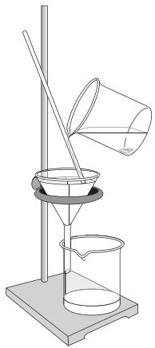

图9-18过滤

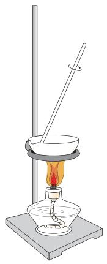

图9-19蒸发

4.计算产率

用玻璃棒把固体转移到称量纸上,称量后,将固体回收到指定的容器中。将提纯后的固体(精盐)与粗盐作比较,并计算精盐的产率。

<table><tr><td rowspan=1 colspan=1>溶解粗盐/g</td><td rowspan=1 colspan=1>精盐/g</td><td rowspan=1 colspan=1>精盐产率/%</td></tr><tr><td rowspan=1 colspan=1></td><td rowspan=1 colspan=1></td><td rowspan=1 colspan=1></td></tr></table>

# 【问题与交流】

1.制取粗盐时,晒盐和煮盐的目的都是通过蒸发盐溶液中的水分使之浓缩。能否采用降低溶液温度的方法来达到同一目的?(提示:根据氯化钠的溶解度曲线考虑。)

2.本实验中采用的方法利用了氯化钠的哪些性质?考虑到粗盐的来源,请判断这样提纯得到的精盐是否为纯净物。

# 跨学科实践活动8

# 海洋资源的综合利用与制盐

美丽、浩瀚的海洋是一个巨大的资源宝库。海洋资源的综合利用,是解决当前人类社会面临的资源短缺等难题的重要途径之一,对于促进经济和社会可持续发展具有重要意义。

# 【活动目标】

了解海洋中的资源,认识不同类型海洋资源的利用情况。通过海水制盐的实践活动,形成利用物质性质差异实现物质分离的思路与方法。了解氯化钠在工业生产中的应用及对人体健康的重要作用。

# 【活动设计与实施】

# 任务一了解海洋中的资源

1.查阅资料,说明海洋能为人类提供哪些资源,并将这些资源进行分类;了解我国渤海、黄海、东海和南海等不同海域资源的分布状况。  
2.查阅资料,说明海洋可再生能源的种类;选择其中一种能源,说明其利用现状。总结海洋可再生能源的优势和不足。

# 任务二从海水制取粗盐

1.查阅资料,了解海水中所溶解的主要物质及其质量分数(可采用图、表等形

式呈现)。

2.根据海水中各物质的质量分数,以及各物质的溶解度随温度变化情况,设计并实施实验方案,将氯化钠从海水(可以用自制海水代替)中分离出来。

# 任务三从粗盐制取精盐

1.查阅资料,说明从粗盐到精盐需要经过哪些处理步骤。2.查阅国家标准,了解我国关于食用盐理化指标的相关规定。

# 任务四了解氯化钠的重要价值

1.查阅资料,利用图、表等形式说明氯化钠在工业生产中的广泛应用。2.了解氯化钠的生理功能,以及食用盐摄入过多或过少对人体健康的影响。3.调查市场上销售的食用盐种类,了解它们的成分及主要功能。请为自己的家庭选择食用盐,并说出选择的依据。

# 【展示与交流】

1.展示制得的粗盐。归纳并交流利用物质性质差异实现物质分离的思路与方法。2.整理有关资料,撰写活动报告,并与同学交流。

# 第十单元常见的酸、碱、盐

溶液的酸碱性常见的酸和碱常见的盐

酸、碱、盐在生产和生活中有着广泛的应用。酸、碱、盐具有怎样的性质?应如何进行研究和利用呢?

通过认识常见酸、碱、盐的主要性质和用途,以及从类别的视角认识酸、碱具有的共性,可以深化对物质多样性的认识。

# 课题1

# 溶液的酸碱性

石蕊litmus  
酚酞phenolphthalein  
酸碱指示剂acid-base indicator

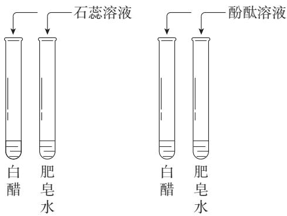

图10-1向溶液中加入酸碱指示剂

在日常生活中,我们对于“酸性”“碱性”并不陌生,如食醋有酸性,肥皂水有碱性。许多溶液都具有酸性或碱性,那么,如何认识和检验溶液的酸碱性呢?

# 一、酸碱指示剂

我们曾经做过碳酸使紫色石蕊溶液变成红色、氨水使无色酚酞溶液变成红色的实验。石蕊和酚酞属于酸碱指示剂,酸碱指示剂通常也简称指示剂。

# 【实验10-1】

将4支试管分成两组,向每组的两支试管中分别加入少量白醋和肥皂水。然后向其中一组试管中滴加紫色石蕊溶液,向另一组试管中滴加无色酚酞溶液(如图10-1)。观察并记录实验现象。

<table><tr><td rowspan=1 colspan=1>溶液</td><td rowspan=1 colspan=1>滴加紫色石蕊溶液后的颜色变化</td><td rowspan=1 colspan=1>滴加无色酚酞溶液后的颜色变化</td></tr><tr><td rowspan=1 colspan=1>白醋</td><td rowspan=1 colspan=1></td><td rowspan=1 colspan=1></td></tr><tr><td rowspan=1 colspan=1>肥皂水</td><td rowspan=1 colspan=1></td><td rowspan=1 colspan=1></td></tr></table>

可以看到,酸性溶液能使紫色石蕊溶液变成红色,不能使无色酚酞溶液变色;碱性溶液能使紫色石蕊溶液变成蓝色,使无色酚酞溶液变成红色。

利用酸碱指示剂可以检验溶液的酸碱性。

# 二、溶液酸碱度的表示- pH

在生产、生活和科学研究中,往往需要精确地知道溶液酸碱性的强弱程度,即溶液的酸碱度。怎样表示和测定溶液的酸碱度呢?

对于生产、生活和科学研究中的稀溶液,其酸碱度常用pH来表示, $\mathsf { p H }$ 的范围通常为 $0 { \sim } 1 4$ 

测定pH的简便方法是使用pH试纸(如图10-2)。

图10-2一种pH试纸和标准比色卡

# 【实验10-2】

在白瓷板或玻璃片上放一小片pH试纸,用干燥、洁净的玻璃棒分别蘸取下列溶液点到pH试纸上,把试纸显示的颜色与标准比色卡比较,读出pH。

# 科学史话

# 酸碱指示剂的发现

英国化学家波义耳在一次实验中不慎将浓盐酸溅到一束紫罗兰花的花瓣上,喜爱花的他马上进行冲洗,一会儿却发现紫色的花瓣变红了。惊奇的他没有放过这一偶然的发现,而是进行了进一步的实验和思考。结果发现,许多种花瓣的浸出液遇到酸性溶液或碱性溶液都能变色,其中变色效果最好的是地衣类生物——石蕊,这就是最早使用的酸碱指示剂。之后,人们从地衣类生物中提取蓝色粉末状的石蕊色素,制成了酸碱指示剂。

<table><tr><td rowspan=1 colspan=1>溶液</td><td rowspan=1 colspan=1>pH</td><td rowspan=1 colspan=1>酸碱性</td></tr><tr><td rowspan=1 colspan=1>白醋</td><td rowspan=1 colspan=1></td><td rowspan=1 colspan=1></td></tr><tr><td rowspan=1 colspan=1>食盐水</td><td rowspan=1 colspan=1></td><td rowspan=1 colspan=1></td></tr><tr><td rowspan=1 colspan=1>肥皂水</td><td rowspan=1 colspan=1></td><td rowspan=1 colspan=1></td></tr></table>

酸性溶液的 $\mathrm { p H } { < } 7$ ;

中性溶液的 $\mathrm { p H } = 7$ ;

碱性溶液的 $\mathrm { p H } { > } 7$ 

$\mathsf { p H }$ 越小,表示溶液的酸性越强;pH越大,表示溶液的碱性越强(如图10-3)。

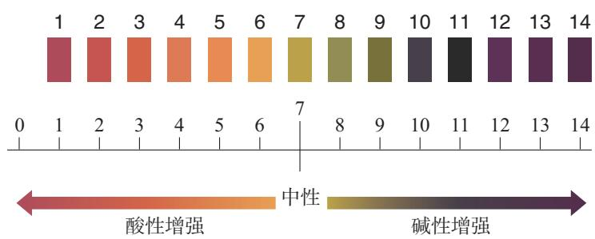

图10-3pH和溶液的酸碱性

# 资料卡片

# 酸度计

酸度计又叫pH计,是较精确测定溶液酸碱度的仪器。酸度计有不同的型号(如图10-4),在精度和外观等方面有所不同。

图10-4两种酸度计

# 【实验10-3】

# 

选择生活中的一些物质,测定它们的pH,并记录在下表中。图10-5所示的物质供选择时参考。

<table><tr><td rowspan=1 colspan=1>生活中的物质</td><td rowspan=1 colspan=1>pH</td><td rowspan=1 colspan=1>酸碱性</td><td rowspan=1 colspan=1>生活中的物质</td><td rowspan=1 colspan=1>pH</td><td rowspan=1 colspan=1>酸碱性</td></tr><tr><td rowspan=1 colspan=1></td><td rowspan=1 colspan=1></td><td rowspan=1 colspan=1></td><td rowspan=1 colspan=1></td><td rowspan=1 colspan=1></td><td rowspan=1 colspan=1></td></tr><tr><td rowspan=1 colspan=1></td><td rowspan=1 colspan=1></td><td rowspan=1 colspan=1></td><td rowspan=1 colspan=1></td><td rowspan=1 colspan=1></td><td rowspan=1 colspan=1></td></tr><tr><td rowspan=1 colspan=1></td><td rowspan=1 colspan=1></td><td rowspan=1 colspan=1></td><td rowspan=1 colspan=1></td><td rowspan=1 colspan=1></td><td rowspan=1 colspan=1></td></tr></table>

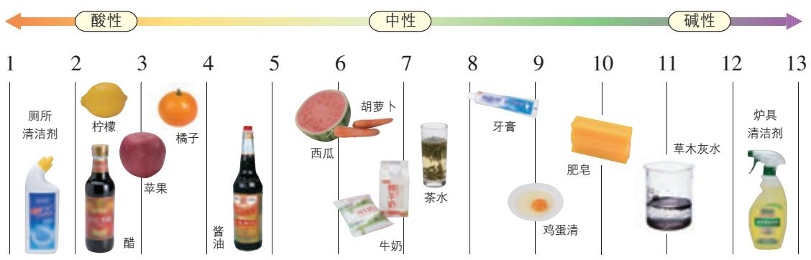

图10-5身边一些物质的pH

了解溶液的酸碱度,对生产、生活及人类的生命活动具有重要的意义。

健康人的体液必须维持在一定的酸碱度范围内,如胃液pH的正常范围是 $0 . 9 { \sim } 1 . 5$ ,如果出现异常,则可能患有疾病。测定人体内或排出的液体的 $\mathsf { p H }$ ,可以帮助人们了解身体的健康状况。

在化工生产中,许多反应都必须在一定pH范围的溶液里进行。在农业生产中,农作物一般适宜在 $\mathrm { p H } = 7$ 或接近7的土壤中生长; $\mathrm { p H } { < } 4$ 的酸

# 资料卡片

人体内的一些液体和排泄物的正常pH范围

<table><tr><td rowspan=1 colspan=1>血浆</td><td rowspan=1 colspan=1>7.35~7.45</td></tr><tr><td rowspan=1 colspan=1>唾液</td><td rowspan=1 colspan=1>6.6~7.1</td></tr><tr><td rowspan=1 colspan=1>胃液</td><td rowspan=1 colspan=1>0.9~1.5</td></tr><tr><td rowspan=1 colspan=1>乳汁</td><td rowspan=1 colspan=1>6.8~7.3</td></tr><tr><td rowspan=1 colspan=1>肝胆汁</td><td rowspan=1 colspan=1>7.1~8.5</td></tr><tr><td rowspan=1 colspan=1>胰液</td><td rowspan=1 colspan=1>7.8~8.4</td></tr><tr><td rowspan=1 colspan=1>尿液</td><td rowspan=1 colspan=1>4.4~8.0</td></tr></table>

性土壤或 $\mathrm { p H } { > } 8$ 的碱性土壤,一般需要经过改良才适于种植。

某些工厂排出的二氧化硫等酸性气体如果未经处理或未达标排放到空气中,可能导致降雨的酸性增强(正常雨水的 $\mathrm { p H } \approx 5 . 6 $ )。我们把 $\mathrm { p H } { < } 5 . 6$ 的降雨称为酸雨。酸雨会导致土壤的酸性增强,不利于农作物生长。

# 学完本课题你知道了什么

1.酸碱指示剂可以检验溶液的酸碱性。指示剂与酸性溶液或碱性溶液作用显示不同的颜色。例如:紫色石蕊溶液遇酸性溶液变成红色,遇碱性溶液变成蓝色;无色酚酞溶液遇酸性溶液不变色,遇碱性溶液变成红色。

2.溶液的酸碱度可用pH表示,用pH试纸可以测定溶液的酸碱度。$\mathrm { p H } { < } 7$ ,溶液为酸性;$\mathrm { p H } = 7$ ,溶液为中性;$\mathrm { p H } { > } 7$ ,溶液为碱性。

3.了解溶液的酸碱性,对于生产、生活及人类的生命活动具有重要意义。

# 练习与应用

1.某同学测出一些食物的 $\mathsf { p H }$ 如下表所示。

<table><tr><td rowspan=1 colspan=1>食物</td><td rowspan=1 colspan=1>葡萄汁</td><td rowspan=1 colspan=1>苹果汁</td><td rowspan=1 colspan=1>牛奶</td><td rowspan=1 colspan=1>鸡蛋清</td></tr><tr><td rowspan=1 colspan=1>pH</td><td rowspan=1 colspan=1>3.6</td><td rowspan=1 colspan=1>2.9</td><td rowspan=1 colspan=1>6.4</td><td rowspan=1 colspan=1>9.0</td></tr></table>

下列说法中,不正确的是( )。

A.鸡蛋清和牛奶都呈碱性  
B.苹果汁和葡萄汁都呈酸性  
C.苹果汁的酸性比葡萄汁的强  
D.胃酸过多的人应少饮葡萄汁和苹果汁

2.实验室中有A、B两种溶液,经测定,A溶液 $\mathrm { p H } = 4 . 5$ ,B溶液 $\mathrm { p H } { = } 1 0 . 2$ 。则A溶液呈 性,能使紫色石蕊溶液变 色;B溶液呈 性,能使无色酚酞溶液变 色。

3.测定溶液的pH可以使用pH试纸,方法是用 蘸取待测溶液,点到上,然后再与 对照,得到该溶液的 $\mathsf { p H }$ 。

4.土壤的酸碱性对植物生长非常重要。适宜某种植物生长的土壤的pH范围是 $7 . 2 { \sim } 8 . 3$ ,属于 (填“酸性”或“碱性”)土壤。

5.某实验小组开展了下列活动:每隔5分钟采集一次雨水样品,并用 $\mathsf { p H }$ 计测其 $\mathsf { p H }$ ,所测得数据如下表所示。

<table><tr><td rowspan=1 colspan=1>测定时间</td><td rowspan=1 colspan=1>17:05</td><td rowspan=1 colspan=1>17:10</td><td rowspan=1 colspan=1>17:15</td><td rowspan=1 colspan=1>17:20</td><td rowspan=1 colspan=1>17:25</td><td rowspan=1 colspan=1>17:30</td><td rowspan=1 colspan=1>17:35</td></tr><tr><td rowspan=1 colspan=1>pH</td><td rowspan=1 colspan=1>4.95</td><td rowspan=1 colspan=1>4.94</td><td rowspan=1 colspan=1>4.94</td><td rowspan=1 colspan=1>4.88</td><td rowspan=1 colspan=1>4.86</td><td rowspan=1 colspan=1>4.85</td><td rowspan=1 colspan=1>4.85</td></tr></table>

(1)绘制pH-时间曲线图,观察曲线的变化。

(2)雨水是否为酸雨?在测定期间,雨水的酸性是增强了还是减弱了?

(3)查阅资料,了解我国在酸雨治理方面采取的措施,并与同学交流。

6.阅读“科学史话——酸碱指示剂的发现”,并查阅相关信息,从中你获得了什么启示?以短文、简报或其他形式与同学分享。

7.查阅资料,了解用植物自制酸碱指示剂的方法。

(1)选择几种植物的花瓣或叶片(如牵牛花、月季花、紫甘蓝等)自制酸碱指示剂,并试验指示剂在不同溶液中的颜色变化。

<table><tr><td rowspan=2 colspan=1>自制酸碱指示剂（汁液）</td><td rowspan=1 colspan=2>在不同溶液中的颜色变化</td></tr><tr><td rowspan=1 colspan=1>白醋</td><td rowspan=1 colspan=1>肥皂水</td></tr><tr><td rowspan=1 colspan=1></td><td rowspan=1 colspan=1></td><td rowspan=1 colspan=1></td></tr><tr><td rowspan=1 colspan=1></td><td rowspan=1 colspan=1></td><td rowspan=1 colspan=1></td></tr><tr><td rowspan=1 colspan=1></td><td rowspan=1 colspan=1></td><td rowspan=1 colspan=1></td></tr></table>

(2)比较制得的指示剂,说明哪一种在酸性、碱性溶液中颜色变化更明显。

(3)撰写活动报告,并与同学交流。

# 课题2

# 常见的酸和碱

酸acid盐酸hydrochloric acid硫酸sulfuric acid

# 想一想

闻气味时应采用怎样的方法?

# 注意

酸有腐蚀性!不要将酸沾到皮肤或衣服上!实验时戴好护目镜。

“酸”最早指“有酸味的酒”。在酿酒的时候,有时把比较珍贵的酒放在窖中保存,酒在微生物的作用下会产生酸味。“碱”最早表示灰。人们将草木灰放到水中,利用得到的碱性灰汁洗浴、印染等。这里学习的酸和碱是指两类不同的物质。

# 一、常见的酸

# 1.几种常见的酸

在实验室,我们经常用到的酸是盐酸和硫酸。盐酸和硫酸有哪些性质和用途呢?

# 【实验10-4】

# 

(1)观察盐酸、硫酸的颜色和状态。

(2)分别打开盛有盐酸、硫酸的试剂瓶的瓶盖,观察并小心闻其气味。

<table><tr><td rowspan=1 colspan=1>酸</td><td rowspan=1 colspan=1>盐酸（HC1）</td><td rowspan=1 colspan=1>硫酸（HSO4）</td></tr><tr><td rowspan=1 colspan=1>颜色、状态</td><td rowspan=1 colspan=1></td><td rowspan=1 colspan=1></td></tr><tr><td rowspan=1 colspan=1>打开试剂瓶瓶盖后的现象</td><td rowspan=1 colspan=1></td><td rowspan=1 colspan=1></td></tr><tr><td rowspan=1 colspan=1>气味</td><td rowspan=1 colspan=1></td><td rowspan=1 colspan=1></td></tr><tr><td rowspan=1 colspan=1>密度</td><td rowspan=1 colspan=1>常用浓盐酸（质量分数为37%~38%）1.19 g/cm³</td><td rowspan=1 colspan=1>常用浓硫酸（质量分数为98%）1.84 g/cm³</td></tr></table>

# 【实验10-5】

# 

将纸、小木棍、布放在玻璃片上,完成下列实验。

<table><tr><td rowspan=1 colspan=1>实验内容</td><td rowspan=1 colspan=1>放置一会儿后的现象</td></tr><tr><td rowspan=1 colspan=1>用玻璃棒蘸浓硫酸在纸上写字</td><td rowspan=1 colspan=1></td></tr><tr><td rowspan=1 colspan=1>用小木棍蘸少量浓硫酸</td><td rowspan=1 colspan=1></td></tr><tr><td rowspan=1 colspan=1>将浓硫酸滴到一小块布上</td><td rowspan=1 colspan=1></td></tr></table>

浓硫酸有强烈的腐蚀性(如图10-6)。它能夺取纸张、木材、布料、皮肤(都由含碳、氢、氧等元素的化合物组成)里的水分①,生成黑色的炭。所以,使用浓硫酸时应十分小心。

# 【实验10-6】

# 

如图10-7所示,将浓硫酸沿烧杯内壁缓慢地注入盛有水的烧杯,用玻璃棒不断搅拌,用温度计测量温度变化。

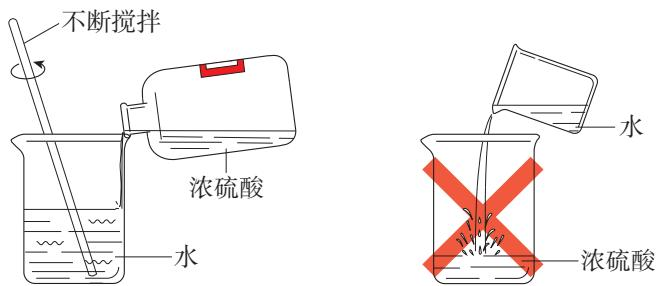

图10-7稀释浓硫酸的正确操作图10-8稀释浓硫酸的错误操作

通过上面的实验可以将浓硫酸稀释,实验时是将浓硫酸缓慢注入水中,那么,为什么不能将水注入浓硫酸中呢(如图10-8)?

图10-6浓硫酸有腐蚀性

# 注意

在稀释浓硫酸时,一定要将浓硫酸沿容器内壁慢慢注入水中,并不断搅拌。切不可将水倒入浓硫酸中。实验时戴好护目镜。

如果将水注入浓硫酸,由于水的密度较小,水会浮在浓硫酸上面,浓硫酸溶解时放出的热能使水立刻沸腾,使硫酸液滴向四周飞溅。这是非常危险的操作!

如果不慎将浓硫酸沾到皮肤上,应立即用大量水冲洗,然后涂上质量分数为 $3 \% { \sim } 5 \%$ 的碳酸氢钠溶液。

盐酸、硫酸等酸具有非常广泛的用途(如表10-1)。

表10-1盐酸、硫酸的主要用途

<table><tr><td rowspan=1 colspan=1>酸</td><td rowspan=1 colspan=1>用途</td></tr><tr><td rowspan=1 colspan=1>盐酸</td><td rowspan=1 colspan=1>用于金属表面除锈、制造药物（如盐酸二甲双胍）等；人体胃液中含有盐酸，可帮助消化</td></tr><tr><td rowspan=1 colspan=1>硫酸</td><td rowspan=1 colspan=1>用于生产化肥、农药、火药、染料及冶炼金属、精炼石油和金属除锈等；浓硫酸有吸水性，在实验室中常用它作干燥剂</td></tr></table>

在实验室和化工生产中常用的酸还有硝酸$\mathrm { \nabla { H N O _ { 3 } } }$ )、醋酸( $\mathrm { C H } _ { 3 } \mathrm { C O O H }$ )等。另外,生活中常见的许多物质中也含有酸(如图10-9)。

图10-9生活中的一些物质含有酸

# 2.酸的化学性质

# 酸的化学性质

# 【问题与预测】

(1)结合课题1的内容,预测稀盐酸、稀硫酸能使石蕊溶液和酚酞溶液分别呈现什么颜色。

(2)稀盐酸和稀硫酸是否具有相似的化学性质?

# 【实验与分析】

(1)如图10-10所示,在白色点滴板上进行实验,观察并记录实验现象。

<table><tr><td rowspan=1 colspan=1>酸</td><td rowspan=1 colspan=1>滴加紫色石蕊溶液后的颜色变化</td><td rowspan=1 colspan=1>滴加无色酚酞溶液后的颜色变化</td></tr><tr><td rowspan=1 colspan=1>稀盐酸</td><td rowspan=1 colspan=1></td><td rowspan=1 colspan=1></td></tr><tr><td rowspan=1 colspan=1>稀硫酸</td><td rowspan=1 colspan=1></td><td rowspan=1 colspan=1></td></tr></table>

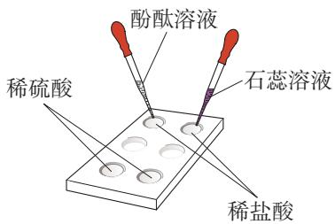

图10-10酸与指示剂作用

(2)回忆第八单元所学的几种金属分别与稀盐酸和稀硫酸的反应,写出化学方程式。

<table><tr><td rowspan=1 colspan=1>金属</td><td rowspan=1 colspan=1>与稀盐酸反应</td><td rowspan=1 colspan=1>与稀硫酸反应</td></tr><tr><td rowspan=1 colspan=1>镁</td><td rowspan=1 colspan=1></td><td rowspan=1 colspan=1></td></tr><tr><td rowspan=1 colspan=1>锌</td><td rowspan=1 colspan=1></td><td rowspan=1 colspan=1></td></tr><tr><td rowspan=1 colspan=1>铁</td><td rowspan=1 colspan=1></td><td rowspan=1 colspan=1></td></tr></table>

分析:以上反应的生成物有什么共同之处?

(3)在分别盛有稀盐酸和稀硫酸的试管中各放入生锈的铁钉,过一会儿取出铁钉,用水洗净,铁钉表面和溶液颜色有什么变化?

<table><tr><td rowspan=1 colspan=1>反应物</td><td rowspan=1 colspan=1>现象</td><td rowspan=1 colspan=1>化学方程式</td></tr><tr><td rowspan=1 colspan=1>铁锈+稀盐酸</td><td rowspan=1 colspan=1></td><td rowspan=1 colspan=1>Fe2O +6HCl 2FeCl +3HO</td></tr><tr><td rowspan=1 colspan=1>铁锈+稀硫酸</td><td rowspan=1 colspan=1></td><td rowspan=1 colspan=1>Fe2O3 + 3HSO4 = Fe2(SO4)3 + 3HO</td></tr></table>

分析:

$\textcircled{1}$ 以上反应的生成物有什么共同之处?

$\textcircled{2}$ 利用上面的反应可以清除铁制品表面的锈,除锈时能否将铁制品长时间浸在酸中?为什么?

# 【结论】

根据以上实验与分析,结合前面学过的知识,归纳稀盐酸、稀硫酸等酸有哪些相似的化学性质。

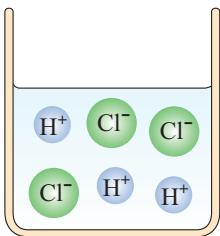

图10-12 HCl在水中解离出离子示意图

稀盐酸、稀硫酸等酸为什么会有相似的化学性质呢?

# 【实验10-7】

如图10-11所示,分别试验稀盐酸、稀硫酸、蒸馏水和乙醇的导电性(可以将小灯泡换成发光二极管)。

图10-11试验物质的导电性

可以看到,蒸馏水和乙醇不导电,而稀盐酸、稀硫酸却能导电。这说明,在稀盐酸、稀硫酸中存在带电荷的粒子。通过研究和分析可知,像盐酸、硫酸这样的酸,在水中都能解离出 $\mathrm { H } ^ { + }$ 和酸根离子(如图10-12),即在不同酸的溶液中都含有 $\mathrm { H } ^ { + }$ ,所以,酸有一些相似的化学性质。

# 二、常见的碱

# 1.几种常见的碱

氢氧化钠是一种常见的碱,俗称苛性钠、火碱或烧碱。氢氧化钠有强烈的腐蚀性,如果不慎沾到皮肤上,应立即用大量的水冲洗,再涂上质量分数为 $1 \%$ 的硼酸溶液。

# 【实验10-8】

# 

用镊子夹取3小片氢氧化钠,如下表所示,分别进行实验(切勿用手拿)。

碱base  
氢氧化钠sodium hydroxide

# 注意

氢氧化钠有强烈的腐蚀性,使用时必须十分小心,防止溅到眼睛、皮肤、衣服等上面。实验时戴好护目镜。

<table><tr><td rowspan=1 colspan=1>实验内容</td><td rowspan=1 colspan=1>现象</td><td rowspan=1 colspan=1>分析</td></tr><tr><td rowspan=1 colspan=1>观察氢氧化钠的颜色和状态</td><td rowspan=1 colspan=1></td><td rowspan=1 colspan=1></td></tr><tr><td rowspan=1 colspan=1>将氢氧化钠放在表面皿上，放置一会儿</td><td rowspan=1 colspan=1></td><td rowspan=1 colspan=1></td></tr><tr><td rowspan=1 colspan=1>将氢氧化钠放入试管中，加入少量水，测量温度的变化</td><td rowspan=1 colspan=1></td><td rowspan=1 colspan=1></td></tr></table>

氢氧化钠曝露在空气中容易吸收水分,使表面潮湿并逐渐溶解,这种现象叫作潮解。因此,氢氧化钠可用作某些气体的干燥剂。

氢氧化钠是一种重要的化工原料,广泛应用于制肥皂,以及石油、造纸、纺织和印染等工业。氢氧化钠能与油脂反应,在生活中可用来去除油污,如炉具清洁剂的成分之一就是氢氧化钠,去污时就是利用这一反应原理。

潮解deliquescence

# 注意

氢氧化钙对皮肤、衣服等有腐蚀作用,使用时应小心。实验时戴好护目镜。

# 【实验10-9】

# 

取一小药匙氢氧化钙,观察它的颜色和状态,然后放入小烧杯中,加入30mL水,用玻璃棒搅拌,观察氢氧化钙在水中的溶解情况。

<table><tr><td rowspan=1 colspan=1>实验内容</td><td rowspan=1 colspan=1>现象</td></tr><tr><td rowspan=1 colspan=1>观察氢氧化钙的颜色和状态</td><td rowspan=1 colspan=1></td></tr><tr><td rowspan=1 colspan=1>观察氢氧化钙在水中的溶解情况</td><td rowspan=1 colspan=1></td></tr></table>

氢氧化钙也是一种常见的碱,俗称熟石灰或消石灰。氢氧化钙是白色粉末状物质,微溶于水,其水溶液俗称石灰水。当石灰水中存在较多未溶解的熟石灰时,就称为石灰乳或石灰浆。

图10-13涂刷了石灰浆的树木

氢氧化钙在生产和生活中具有广泛的用途。例如:建筑上用熟石灰与沙子混合来砌砖;在树木上涂刷含有硫黄粉等的石灰浆(如图10-13),可保护树木,防止冻伤,并防止害虫产卵;农业上可用石灰乳与硫酸铜溶液等配制成具有杀菌作用的波尔多液,作为农药使用;熟石灰还可用来改良酸性土壤;等等。

除了氢氧化钠、氢氧化钙,常见的碱还有氢氧化钾(KOH)等。

# 2.碱的化学性质

# 探究

# 碱的化学性质

# 【问题与预测】

(1)氢氧化钠溶液、氢氧化钙溶液能使石蕊溶液和酚酞溶液分别呈现什么

72第十单元常见的酸、碱、盐

颜色?

(2)已知氢氧化钙能与二氧化碳反应,氢氧化钠与二氧化碳也能发生反应吗?

# 【实验与分析】

(1)设计实验并实施,验证你对上述问题(1)的预测。

(2)讨论分析。

$\textcircled{1}$ 回忆检验二氧化碳的反应,写出化学方程式:○

$\textcircled{2}$ 从物质的组成和类别的角度,与上述反应进行比较和分析,写出氢氧化钠与二氧化碳反应的化学方程式:

$\textcircled{3}$ 上面两个反应有什么共同之处?三氧化硫( $\mathrm { S O } _ { 3 }$ )与碱的反应与上面的两个反应类似,试写出氢氧化钠与三氧化硫反应的化学方程式:

# 【结论与思考】

(1)根据以上实验与分析,归纳氢氧化钠、氢氧化钙等碱有哪些相似的化学性质。

(2)利用碱的化学性质解释下列事实: $\textcircled{1}$ 熟石灰与沙子混合砌砖; $\textcircled{2}$ 氢氧化钠必须密封保存。

(3)通过本单元的探究活动,尝试归纳认识物质性质的一般思路和方法。

通过实验与分析我们知道,氢氧化钠、氢氧化钙等碱有一些相似的化学性质。这是为什么呢?

研究表明,与盐酸、硫酸等酸类似,像氢氧化钠、氢氧化钙这样的碱,在水中都能解离出金属离子和 $\mathrm { O H } ^ { - }$ (如图10-14),即在不同碱的溶液中都含有 $\mathrm { O H } ^ { - }$ ,所以,碱有一些相似的化学性质。

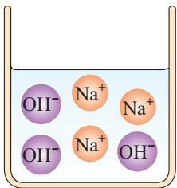

图10-14 NaOH在水中解离出离子示意图

酸和碱的组成不同,在性质上存在差异。

# 方法导引

# 认识物质性质的一般思路和方法

我们通过实验探究认识了常见酸、碱的性质和用途,并通过对酸和碱组成的分析,从类别的角度初步认识了酸、碱各具有相似的化学性质,以及酸和碱具有差异性。

在研究物质的性质时,常采用观察、实验及归纳概括、分析解释等科学方法,从物质的存在、组成、变化和用途等视角认识物质的性质;从物质的类别认识具体物质的性质;从物质的共性和差异性认识一类物质的性质;等等。

# 三、中和反应

酸有相似的化学性质,碱也有相似的化学性质。那么,酸与碱能否发生反应呢?

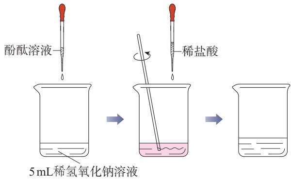

图10-15向稀氢氧化钠溶液中滴加稀盐酸示意图

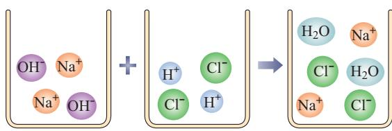

图10-16氢氧化钠与盐酸反应示意图

# 【实验10-10】

S 8 

如图10-15所示,在烧杯中加入5 mL稀氢氧化钠溶液,滴入几滴酚酞溶液。然后用滴管慢慢滴入稀盐酸,并不断搅拌溶液,至溶液颜色恰好变成无色为止。

在上面的实验中,氢氧化钠与盐酸反应,生成了氯化钠和水(如图10-16)。

$$
N a O H + H C l = N a C l + H _ { 2 } O
$$

实际上,其他酸与碱也能发生类

似的反应。例如:

$$
C a ( O H ) _ { 2 } + 2 H C l = C a C l _ { 2 } + 2 H _ { 2 } O
$$

$$
2 N a O H + H _ { 2 } S O _ { 4 } = N a _ { 2 } S O _ { 4 } + 2 H _ { 2 } O
$$

硫酸钠

可以发现,上述反应中生成的氯化钠、氯化钙和硫酸钠都是由金属离子和酸根离子构成的,我们把这样的化合物叫作盐。

酸与碱作用生成盐和水的反应,叫作中和反应。中和反应在日常生活和工农业生产中有着广泛的应用。

中和反应neutralization reaction

人的胃液里含有适量盐酸,可以帮助消化。但如果患有某些胃肠病,胃会分泌过量胃酸,造成胃部不适以致消化不良。在这种情况下,遵医嘱服用某些含有碱性物质的药物,可以中和过多的胃酸。

蜂或蚂蚁叮咬人的皮肤后,在皮肤内分泌出蚁酸,会使叮咬处很快出现肿、痛或瘙痒等症状。如果涂一些含有碱性物质的溶液,就可减轻症状。

工厂生产过程中产生的污水,需进行一系列的处理。例如:硫酸厂的污水中含有硫酸等物质,可以用熟石灰进行中和处理;印染厂的碱性废水可用硫酸进行中和处理。

农作物生长对土壤的酸碱性有一定的要求。在农业生产中,常根据土壤和植物种植情况来调节土壤的酸碱性,如用熟石灰中和土壤酸性,以利于农作物生长。调节土壤的pH是改良土壤的方法之一。

# 思考与讨论

根据你的生活经验或查阅资料,举出利用中和反应的实例。

# 学完本课题你知道了什么

1.盐酸、硫酸等酸溶液中都含有 $\mathrm { H } ^ { + }$ ,酸有相似的化学性质。氢氧化钠、氢氧化钙等碱溶液中都含有$\mathrm { O H } ^ { - }$ ,碱有相似的化学性质。酸和碱在性质上存在差异。

(1)酸和碱都能与指示剂反应。指示剂遇酸或碱显示不同的颜色。

(2)酸能与某些金属反应,生成盐和氢气,也能与某些金属氧化物反应,生成盐和水。

(3)碱能与某些非金属氧化物反应,生成盐和水。

(4)酸与碱能发生中和反应,生成盐和水。

2.酸和碱有腐蚀性,应妥善保存,使用时要注意安全。

3.酸和碱在生产和生活中具有广泛的用途。

4.认识物质性质的一般思路和方法。

# 练习与应用

1.盐酸不慎洒到大理石地面上,会有气体产生。这种气体是( )。

A.二氧化硫 B.二氧化碳 C.氢气 D.氧气

2.下列关于氢氧化钠的说法中,不正确的是( )。

A.对皮肤有强烈的腐蚀作用  
B.水溶液能使石蕊溶液变红  
C.易溶于水,溶解时放出大量的热  
D.能去除油污,是炉具清洁剂的成分之一

3.下列物质中,可用于改良酸性土壤的是( )。

A.食盐 B.醋酸 C.盐酸 D.熟石灰

4.请回答下列问题。

(1)固体氢氧化钠曝露在空气中,容易 而使表面潮湿并逐渐溶解,这种现象叫作 ;同时吸收空气中的 而变质,生成 。因此,氢氧化钠固体必须 保存。

(2)盛有浓硫酸的试剂瓶口放置一段时间后,溶质的质量分数变 (填“大”或“小”),原因是 0

(3)实验室中含有盐酸的废水若直接倒入下水道会造成铸铁管道腐蚀,所以,需将废液处理后再排放。你的处理方法是

(4)实验室制取下列气体时,能用氢氧化钠作干燥剂的是 (填字母)。

a.二氧化碳 b.氯化氢 c.氧气

5.运用化学知识解释和解决下列实际问题。

(1)服用含氢氧化铝[ $\mathrm { \bf ~ A l ( O H ) } _ { 3 }$ 」的药物可以治疗胃酸过多症。

(2)松花蛋是我国的传统风味食品,用生石灰、草木灰(含有 ${ \mathrm { K } } _ { 2 } { \mathrm { C O } } _ { 3 }$ )、食盐等腌制而成,在食用时一般要加少量食醋。

(3)热水瓶用久后,瓶胆内壁常附着一层水垢[主要成分是 $\mathrm { C a C O } _ { 3 }$ 和 $\mathrm { M g ( O H ) } _ { 2 }$ ],可以用醋酸来洗涤。

6.某同学利用下图所示实验研究物质的性质。一段时间后,可观察到烧杯 $\textcircled{2}$ 中溶液的颜色有什么变化?请从物质性质及化学反应的角度,解释产生上述现象的原因。

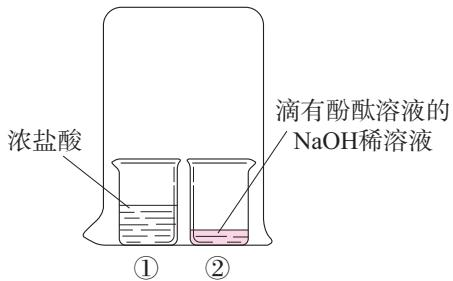

7.在某些产品的包装袋内,有一个装有白色颗粒状固体的小纸袋,上面写着“强力干燥剂,本产品主要成分为生石灰”。为什么生石灰能作干燥剂?如果将小纸袋拿出来放在空气中,一段时间后,会发现纸袋内的白色颗粒粘在一起成为块状,这是为什么?试写出有关反应的化学方程式。

8.某工厂利用废铁屑与废硫酸反应制取硫酸亚铁。现有废硫酸 $9 . 8 ~ \mathrm { t }$ ( $\mathrm { H } _ { 2 } \mathrm { S O } _ { 4 }$ 的质量分数为$20 \%$ ),与足量的废铁屑反应,可生产 $\mathrm { F e S O _ { 4 } }$ 的质量是多少?

# 课题3

# 常见的盐

盐salt  
氯化钠sodium chloride

日常生活中所说的盐,通常指食盐(主要成分是NaCl);而化学中的盐,是指一类组成里含有金属离子(或铵根离子①)和酸根离子的化合物,如氯化钠、碳酸钠( ${ \mathrm { N a } } _ { 2 } { \mathrm { C O } } _ { 3 }$ )、碳酸氢钠( ${ \mathrm { N a H C O } } _ { 3 }$ )、碳酸钙( $\mathrm { C a C O } _ { 3 }$ )、高锰酸钾( ${ \mathrm { K M n O } } _ { 4 }$ )、硫酸铜( $\mathrm { C u S O _ { 4 } }$ )和硝酸钠( ${ \mathrm { N a N O } } _ { 3 }$ )等。生活中常见的盐有哪些性质和用途呢?

# 一、氯化钠

氯化钠不仅是重要的调味品,也是维持人的正常生理活动所必不可少的。人体内所含的氯化钠大部分以离子形式存在于体液中。钠离子对神经调节、维持细胞内外正常的水分分布和促进细胞内外物质交换起重要作用;氯离子是胃液中的主要成分,具有促生盐酸、帮助消化和增进食欲的作用。人们每天都要摄入一些食盐(成年人每天摄入食盐不超过 $5 \ \mathrm { g }$ )来补充由于出汗、排尿等排出的氯化钠,以满足人体的正常需要,但长期食用过多食盐不利于人体健康。

氯化钠的用途很多。例如:医疗上的生理盐水是用氯化钠配制的;农业上可以用氯化钠溶液来选

种;工业上可以用氯化钠作原料制取碳酸钠、氢氧化钠、氯气和盐酸等;公路上曾经使用氯化钠作融雪剂。此外,我国民间有用食盐腌渍蔬菜、鱼、肉、蛋等食物的习惯,这样可使食品具有独特风味,并能延长保存时间。

氯化钠在自然界中分布很广,海水、盐湖(如图10-17)、盐井和盐矿都是氯化钠的来源。我国地域辽阔,氯化钠资源极为丰富。

# 二、碳酸钠、碳酸氢钠和碳酸钙

除了氯化钠,碳酸钠、碳酸氢钠和碳酸钙也是常见的盐。

碳酸钠俗称纯碱、苏打,是重要的工业原料,广泛用于玻璃、造纸、纺织等行业及洗涤剂的生产。碳酸氢钠俗称小苏打,是制作面点所用发酵粉的主要成分之一;在医疗上,它是治疗胃酸过多症的一种药剂。无论在古代还是现代,石灰石、大理石都是重要的建筑材料(如图10-18),它们的主要成分都是碳酸钙;在医疗上,碳酸钙还可用作补钙剂。

图10-17察尔汗盐湖(我国最大的盐湖,湖中的盐结晶形成各种形状的“盐花”)

图10-18北京故宫的大理石(汉白玉)栏杆

碳酸钠sodium carbonate  
碳酸氢钠sodium bicarbonate  
碳酸钙calcium carbonate

图10-19碳酸钠与稀盐酸反应的装置

在学习二氧化碳的实验室制法时,我们已经知道碳酸钙可以与稀盐酸反应:

$\left\{ \begin{array} { l } { \mathsf { C a C O } _ { 3 } + 2 \mathsf { H C l } = \mathsf { C a C l } _ { 2 } + \mathsf { H } _ { 2 } \mathsf { C O } _ { 3 } } \\ { \mathsf { H } _ { 2 } \mathsf { C O } _ { 3 } = \mathsf { C O } _ { 2 } \uparrow + \mathsf { H } _ { 2 } \mathsf { O } } \end{array} \right.$ $C a C O _ { 3 } + 2 H C l = C a C l _ { 2 } + C O _ { 2 } \uparrow + H _ { 2 } O$ 

分析碳酸钠和碳酸氢钠的组成,它们是否也能与稀盐酸发生类似的反应呢?

# 【实验10-11】

向盛有0.5g碳酸钠的试管中加入2mL稀盐酸,迅速用带导管的橡胶塞塞紧试管口,并将导管另一端插入盛有澄清石灰水的试管中(如图10-19),观察、记录并分析现象。

用碳酸氢钠代替碳酸钠进行上述实验,观察、记录并分析现象。

<table><tr><td rowspan=1 colspan=1>实验内容</td><td rowspan=1 colspan=1>现象</td><td rowspan=1 colspan=1>分析</td></tr><tr><td rowspan=1 colspan=1>碳酸钠+稀盐酸</td><td rowspan=1 colspan=1></td><td rowspan=1 colspan=1></td></tr><tr><td rowspan=1 colspan=1>碳酸氢钠+稀盐酸</td><td rowspan=1 colspan=1></td><td rowspan=1 colspan=1></td></tr></table>

上述反应可以用化学方程式表示如下:

$$
N a _ { 2 } C O _ { 3 } + 2 H C l = 2 N a C l + C O _ { 2 } \uparrow + H _ { 2 } O
$$

$$
N a H C O _ { 3 } + H C l = N a C l + C O _ { 2 } \uparrow + H _ { 2 } O
$$

# 三、复分解反应

碳酸钠不仅能与稀盐酸发生反应,还能与澄清石灰水发生反应。

# 【实验10-12】

向盛有澄清石灰水的试管中滴加碳酸钠溶液,观察、记录并分析现象。

<table><tr><td>现象</td><td></td></tr><tr><td>分析</td><td></td></tr></table>

上述反应的化学方程式可以表示如下:

$$
N a _ { 2 } C O _ { 3 } + C a ( O H ) _ { 2 } = C a C O _ { 3 } \downarrow + 2 N a O H
$$

分析以上几个反应,它们都发生在溶液中,都是由两种化合物互相交换成分,生成另外两种化合物的反应,这样的反应叫作复分解反应。

复分解反应double decomposition  
reaction

# 【实验10-13】

向两支分别盛有少量氢氧化钠溶液和氯化钡溶液的试管中滴加硫酸铜溶液,观察并记录实验现象。

<table><tr><td rowspan=1 colspan=1>实验内容</td><td rowspan=1 colspan=1>现象</td><td rowspan=1 colspan=1>化学方程式</td></tr><tr><td rowspan=1 colspan=1>NaOH溶液+CuSO4溶液</td><td rowspan=1 colspan=1></td><td rowspan=1 colspan=1>2NaOH + CuSO4 = Cu(OH) ↓ + Na2SO4</td></tr><tr><td rowspan=1 colspan=1>BaCl溶液+CuSO4溶液</td><td rowspan=1 colspan=1></td><td rowspan=1 colspan=1>BaCl2 + CuSO4 = BaSO4 ↓ + CuCl</td></tr></table>

# 思考与讨论

(1)上述两个反应是否属于复分解反应?观察到的现象有什么共同之处?

(2)碳酸钠、碳酸钙等含碳酸根离子的盐与稀盐酸发生复分解反应时,可观察到的共同现象是什么?

(3)前面学过的酸碱中和反应是否也属于复分解反应?中和反应的生成物中,相同的生成物是什么?

酸、碱、盐之间有的能发生复分解反应,有的不能发生。只有两种化合物互相交换成分,有沉淀或有气体或有水生成时,才是发生了复分解反应。

# 思考与讨论

参考附录I“部分酸、碱和盐的溶解性表(室温)”,判断下列溶液两两混合后能否发生复分解反应。

稀硫酸、稀盐酸、NaOH溶液、NaCl溶液、$\mathrm { K } _ { 2 } \mathrm { C O } _ { 3 }$ 溶液、 $\mathrm { B a } ( \mathrm { N O } _ { 3 } ) _ { 2 }$ 溶液。

判断的时候你都考虑了哪些因素?对于能发生复分解反应的,试写出化学方程式。

# 四、化肥

植物的生长需要养分,土壤所能提供的养分是有限的,因此要靠施肥来补充。人类最初使用的肥料是动物粪便、植物体等沤制的天然有机肥料。18世纪,人们对化学元素与植物生长间的关系有了一定的了解,在19世纪中期,出现了以化学和物理方法制成的、含农作物生长所需营养元素的化学肥料(简称化肥)。常见的化肥中,除了尿素、氨水等,很多属于盐。

农作物所必需的营养元素有碳、氢、氧、氮、磷、钾、钙、镁等,其中氮、磷、钾需要量较大但常供应不足,因此氮肥、磷肥和钾肥是最主要的化肥。表10-2中列出了氮肥、磷肥和钾肥的化学成分及主要作用。

表10-2氮肥、磷肥和钾肥的化学成分及主要作用

<table><tr><td rowspan=1 colspan=1>分类</td><td rowspan=1 colspan=1>化学成分</td><td rowspan=1 colspan=1>主要作用</td></tr><tr><td rowspan=1 colspan=1>氮肥</td><td rowspan=1 colspan=1>尿素［CO(NH2)]、氯化铵（NH4CI）、硝酸钠（NaNO3）等</td><td rowspan=1 colspan=1>氮是植物体内蛋白质、核酸和叶绿素的组成元素。氮肥可以促进植物茎、叶生长茂盛，使叶色浓绿，提高植物蛋白质含量</td></tr><tr><td rowspan=1 colspan=1>磷肥</td><td rowspan=1 colspan=1>磷酸钙［Ca(PO4)］等</td><td rowspan=1 colspan=1>磷是植物体内核酸、蛋白质和酶等多种重要化合物的组成元素。磷肥可以促进作物生长，还可以增强作物的抗寒、抗旱能力</td></tr><tr><td rowspan=1 colspan=1>钾肥</td><td rowspan=1 colspan=1>硫酸钾（KSO4）、氯化钾（KC1）等</td><td rowspan=1 colspan=1>钾在植物代谢活跃的器官和组织中的分布量较高。钾肥可以保证各种代谢过程顺利进行、促进植物生长、增强抗病虫害和抗倒伏能力</td></tr></table>

有些化肥同时含有氮、磷、钾中的两种或三种营养元素,能同时均匀地供给作物几种养分,如磷酸二氢铵( $\mathrm { N H } _ { 4 } \mathrm { H } _ { 2 } \mathrm { P O } _ { 4 }$ )和硝酸钾( $\mathrm { K N O } _ { 3 }$ )等,这样的化肥属于复合肥料。

随着世界人口的增长,人类对农产品的需求量不断增大,施用化肥成为农作物增产的有力措施(如图10-20),解决了部分地区粮食短缺的问题。但是,不合理地施用化肥会造成土壤退化,以及土壤、水和大气环境的污染。因此,要根据土壤和气候条件、作物营养特点、化肥性质及其在土壤中的变化等,有针对性、均衡适度地施用化肥,提高施用效率,减少负面作用。

图10-20为提高农作物产量合理施用化肥

# 思考与讨论

施用化肥增加了粮食产量,然而世界粮食产量仍低于粮食需求。查阅资料,综合考虑人口数量、耕地面积、粮食产量和环境影响等因素,讨论施用化肥的必要性,以及如何处理施用化肥与绿色发展的关系。

# 科学·技术·社会

# 我国化学工业的先驱

我国近代很长一段时间里,精盐和纯碱均依赖进口。1914年,留学归国的范旭东(1883一1945)创办了久大精盐公司,通过不断的实验研究,制出了氯化钠含量超过 $9 0 \%$ 的精盐,结束了精盐依靠进口的时代。

受范旭东的邀请,侯德榜(1890—1974)学成归国后潜心研究纯碱的制造技术,不仅突破了国外对制碱技术的封锁,生产的纯碱在国际上荣获金奖,还成功改进了西方制碱工艺,发明了将制碱与制氨结合起来的“联合制碱法”(又称“侯氏制碱法”)。该方法既生产纯碱又制得化肥,大大提高了原料的利用率,降低了生产成本,减少了对环境的污染。

在范旭东和侯德榜(如图10-21)等化学工业先驱的共同努力下,我国拥有了第一批民族化工企业,产品种类涉及酸、碱、盐,为我国基本化工原料工业奠定了基础。

图10-21范旭东(左)和侯德榜(右)的雕像及他们倡导的信条

# 学完本课题你知道了什么

1.氯化钠、碳酸钠、碳酸氢钠和碳酸钙等盐在生产和生活中都有广泛的用途。

2.组成里含有碳酸根离子或碳酸氢根离子( $\mathrm { H C O } _ { 3 } ^ { - }$ )的盐都能与盐酸反应,有二氧化碳气体生成。

3.酸、碱、盐之间可以发生复分解反应,反应时有沉淀或有气体或有水生成。

4.化肥对提高农作物的产量有重要作用,应合理施用。氮肥、磷肥和钾肥是最主要的化肥。

# 练习与应用

1.下列有关物质用途的说法中,正确的是( )。

A.常用氢氧化钠改良酸性土壤 B.碳酸钠可以用作治疗胃酸过多症的药剂C.碳酸钙可以用作补钙剂 D.磷酸钙是一种复合肥料

2.下列反应中,不属于复分解反应的是( )。

A. $\mathrm { H } _ { 2 } \mathrm { S O } _ { 4 } + \mathrm { C a } ( \mathrm { O H } ) _ { 2 } = \mathrm { C a S O } _ { 4 } + 2 \mathrm { H } _ { 2 } \mathrm { O }$ B. $\mathrm { H } _ { 2 } \mathrm { S O } _ { 4 } + \mathrm { B a C l } _ { 2 } = \mathrm { B a S O } _ { 4 } \downarrow + 2 \mathrm { H C l }$ C. $\mathrm { N a _ { 2 } C O _ { 3 } + C a ( O H ) _ { 2 } = C a C O _ { 3 } \downarrow + 2 N a O H }$ D. $2 \mathrm { H C l } + \mathrm { F e } = \mathrm { F e C l } _ { 2 } + \mathrm { H } _ { 2 } \uparrow$ ↑ 

3.解释下述现象。

(1)鸡蛋壳的主要成分是碳酸钙。将一个新鲜的鸡蛋放在盛有足量稀盐酸的玻璃杯中,可观察到鸡蛋一边冒气泡一边沉到杯底,一会儿又慢慢上浮,到接近液面时又下沉。

(2)馒头、面包等发面食品松软可口,它们的一个特点是有许多小孔。根据发酵粉(含碳酸氢钠和有机酸等)与面粉、水混合制作发面食品的事实,说明碳酸氢钠在其中的作用。

4.亚硝酸钠是一种工业用盐,外形与食盐相似,误食会危害人体健康。亚硝酸钠易溶于水,且溶解度随温度变化较大,它的水溶液呈碱性,食盐水溶液呈中性。如何鉴别亚硝酸钠和食盐?说明选用的试剂及操作方法。

5.“测土配方施肥”是测定土壤养分含量后,科学施用配方肥的农业技术。某地计划种植水稻,经测定,土壤中需补充钾元素 $8 ~ \mathrm { k g }$ 、氮元素 $1 0 ~ \mathrm { k g }$ ,试计算至少需要购买硝酸钾、硝酸铵的质量各是多少(计算结果保留一位小数)。

# 整理与提升

# 一、了解检测溶液酸碱性的基本方法

1.定性检验:用酸碱指示剂可以检验溶液的酸碱性。

2.定量测定:用pH试纸或相关的仪器可以测定溶液的酸碱性强弱程度——酸碱度。

# 二、认识常见酸、碱、盐发生的反应

1.盐酸、硫酸等酸,氢氧化钠、氢氧化钙等碱,各具有相似的化学性质。通过化学反应可以实现物质的转化。

2.某些酸、碱、盐能发生复分解反应。

(1)复分解反应:两种化合物互相交换成分,有 或或 生成。

(2)请将你学过的盐所发生的复分解反应分类整理并填入下表中。

<table><tr><td rowspan=1 colspan=1>复分解反应</td><td rowspan=1 colspan=1>举例</td></tr><tr><td rowspan=1 colspan=1>盐与酸反应</td><td rowspan=1 colspan=1></td></tr><tr><td rowspan=1 colspan=1>盐与碱反应</td><td rowspan=1 colspan=1></td></tr><tr><td rowspan=1 colspan=1>盐与盐反应</td><td rowspan=1 colspan=1></td></tr></table>

# 三、了解认识物质性质的思路与方法

通过酸、碱、盐的学习,可以形成认识物质性质的一般思路与方法。

1.运用观察、实验,以及归纳概括、分析解释等科学方法探究物质的性质。

2.从物质的存在、组成、变化和用途等视角认识物质的性质。

3.通过物质的共性和差异性认识一类物质的性质。

# 四、认识物质的多样性,体会分类研究的意义

请依据物质的组成和性质(主要考虑化学性质),尝试按照下列标准对物质进行分类,并按要求填人下面的框图中,认识物质的多样性。

1.物质组成是否单一。  
2.纯净物中元素组成是否单一。  
3.单质性质的差异。  
4.化合物组成和性质的差异。

# 复习与提高

1. $2 5 ~ \mathrm { { ^ \circ C } }$ 时4种洗手液的 $\mathrm { p H }$ 如下图所示。下列说法中,不正确的是( )。

洗手液a 蒸馏水 洗手液d√ √3 4 56 7 8↑91011121314洗手液b 洗手液c

A.a的酸性比b的强  
B.a用蒸馏水稀释后pH减小  
C.c的碱性比d的弱  
D.a和d混合液的pH可能等于7

2.下列各组物质的稀溶液中,仅用酚酞溶液及同组物质之间的反应就能鉴别出来的是( )。

A. NaOH、 $\mathrm { H } _ { 2 } \mathrm { S O } _ { 4 }$ 、 $\mathrm { H N O } _ { 3 }$ B.KOH、HCl、NaOH C.KOH、NaCl、NaOH D.KOH、NaCl、HCl 

3.某实验小组分别向几种试剂中滴加自制的紫薯汁,现象如下表所示。

<table><tr><td rowspan=1 colspan=1>试剂</td><td rowspan=1 colspan=1>稀盐酸</td><td rowspan=1 colspan=1>氢氧化钠溶液</td><td rowspan=1 colspan=1>蒸馏水</td><td rowspan=1 colspan=1>白醋</td><td rowspan=1 colspan=1>草木灰水</td></tr><tr><td rowspan=1 colspan=1>现象</td><td rowspan=1 colspan=1>红色</td><td rowspan=1 colspan=1>绿色</td><td rowspan=1 colspan=1>紫色</td><td rowspan=1 colspan=1>红色</td><td rowspan=1 colspan=1>绿色</td></tr></table>

(1)紫薯汁 (填“能”或“不能”)作酸碱指示剂。

(2)草木灰水呈 (填“酸性”“中性”或“碱性”)。

4.过氧乙酸是一种无色透明的液体,作为一种较为广泛使用的灭菌剂,它可以迅速杀灭微生物,包括细菌、真菌等。它有强烈的刺激性气味,易挥发,易溶于水,有强酸性,易分解。

(1)上述信息中,属于过氧乙酸物理性质的有 。

(2)过氧乙酸溶液的pH 7(填“>”“=”或“<")。

(3)下列说法中,正确的有 (填字母)。

a.配制过氧乙酸溶液时,应戴乳胶手套,防止溶液溅到皮肤上  
b.可用过氧乙酸对铁质器具进行消毒  
c.如果过氧乙酸不慎沾到皮肤上,应立即用大量清水冲洗  
d.过氧乙酸长时间放置不会降低其杀菌效果

5.某同学用pH传感器测定稀盐酸滴入氢氧化钠溶液过程中 $\mathsf { p H }$ 的变化,测定结果如下图所示。

(1)当反应进行至A点时,滴入稀盐酸的体积为 mL,反应的化学方程式为,此时溶液中的溶质是(写化学式)。

(2)当反应进行至 $B$ 点时,溶液的 $\mathrm { p H = }$ ,说明此时溶液呈 性,溶液中的溶质是 (写化学式)。

(3) $C$ 点时,溶液中的溶质是 (写化学式)。

(4)若用酚酞溶液作该反应的指示剂,溶液在 (填“A”“B”或“C”)时呈红色。

6.《周礼·考工记》中记载,古人曾在草木灰(含有 ${ \mathrm { K } } _ { 2 } { \mathrm { C O } } _ { 3 }$ )的水溶液中加入贝壳烧成的灰(主要成分为CaO),利用生成物中能够去污的成分来清洗丝帛。

(1)请写出上述过程中反应的化学方程式,并注明反应类型。

(2)请你推测生成物中能够去污的成分,并说明理由。

7.某工厂化验室用 $1 5 \%$ 的氢氧化钠溶液洗涤一定量石油产品中的残余硫酸,共消耗氢氧化钠溶液 $4 0 \ \mathrm { g }$ ,洗涤后的溶液呈中性。这一定量石油产品中含 $\mathrm { H } _ { 2 } \mathrm { S O } _ { 4 }$ 的质量是多少?

# 实验活动8 常见酸、碱的化学性质

# 【实验目的】

1.加深对酸和碱的主要性质的认识。  
2.通过实验解释生活中的一些现象。

# 【实验用品】

白色点滴板、试管、镊子、蒸发皿、坩蜗钳、玻璃棒、药匙、酒精灯、铁架台(带铁圈)、胶头滴管、火柴。

稀盐酸、稀硫酸、氢氧化钠溶液、氢氧化钙溶液、硫酸铜溶液、氢氧化钙粉末、石蕊溶液、酚酞溶液、pH试纸、生锈的铁钉。

你还需要的实验室用品:你还需要的生活用品:

# 注意

酸和碱有腐蚀性,实验时要注意安全!实验时戴好护目镜。

# 【实验步骤】 $\textcircled{6}$ 

1.参考图10-22进行实验,比较酸、碱与指示剂的作用。

图10-22酸、碱与指示剂作用

2.选择实验室或生活中的几种溶液,进行下列实验:

(1)分别用石蕊溶液和酚酞溶液检验溶液的酸碱性;

(2)用pH试纸测定溶液的酸碱度。

<table><tr><td rowspan=1 colspan=1>选择的溶液</td><td rowspan=1 colspan=1>滴加石蕊溶液后的颜色变化</td><td rowspan=1 colspan=1>滴加酚酞溶液后的颜色变化</td><td rowspan=1 colspan=1>溶液的酸碱性</td><td rowspan=1 colspan=1>pH</td></tr><tr><td rowspan=1 colspan=1></td><td rowspan=1 colspan=1></td><td rowspan=1 colspan=1></td><td rowspan=1 colspan=1></td><td rowspan=1 colspan=1></td></tr><tr><td rowspan=1 colspan=1></td><td rowspan=1 colspan=1></td><td rowspan=1 colspan=1></td><td rowspan=1 colspan=1></td><td rowspan=1 colspan=1></td></tr><tr><td rowspan=1 colspan=1></td><td rowspan=1 colspan=1></td><td rowspan=1 colspan=1></td><td rowspan=1 colspan=1></td><td rowspan=1 colspan=1></td></tr><tr><td rowspan=1 colspan=1></td><td rowspan=1 colspan=1></td><td rowspan=1 colspan=1></td><td rowspan=1 colspan=1></td><td rowspan=1 colspan=1></td></tr><tr><td rowspan=1 colspan=1></td><td rowspan=1 colspan=1></td><td rowspan=1 colspan=1></td><td rowspan=1 colspan=1></td><td rowspan=1 colspan=1></td></tr></table>

3.(1)取两个生锈的铁钉分别放入两支试管中,然后各加入2mL稀盐酸,观察现象。(2)当观察到铁钉表面没有铁锈,铁钉变得光亮时,将其中一支试管中的铁钉取出,洗净。继续观察另一支试管中的现象,过一段时间将铁钉取出,洗净。比较两个铁钉。  
4.在试管中加入 $2 \mathrm { m L }$ 硫酸铜溶液,然后滴入几滴氢氧化钠溶液,观察现象。再向试管中加入稀盐酸,观察现象。  
5.(1)在试管中加入1mL氢氧化钠溶液,滴入几滴酚酞溶液。然后边用滴管慢慢滴入稀盐酸,边不断振荡试管,至溶液颜色恰好变成无色为止。(2)取上述反应后的无色溶液 $1 \mathrm { m L }$ ,置于蒸发皿中加热,使液体蒸干,观察现象。  
6.(1)向两支试管中各加入相同量的氢氧化钙粉末(用药匙的柄把一端挑一点),然后各加入1mL水,振荡;再各滴入两滴酚酞溶液,观察现象。(2)继续向其中一支试管中加入 $1 \mathrm { m L }$ 水,振荡;向另一支试管中加入1mL稀盐酸,振荡;比较两支试管中的现象。

# 【问题与交流】

1.步骤3的实验目的是什么?写出有关反应的化学方程式。

2.通过步骤6,可以验证氢氧化钙的哪些性质?

# 跨学科实践活动9

# 探究土壤酸碱性对植物生长的影响

土壤中发生着各种化学反应。地质条件和生态环境不同,使得土壤的酸碱性存在差异。研究土壤酸碱性对植物生长的影响,对种植业及其发展具有重要意义。

# 【活动目标】

应用溶液酸碱性及酸、碱、盐的性质等化学知识,结合生物学、地理等课程相关知识,探究土壤酸碱性对植物生长的影响。初步制订土壤改良的方案。

# 【活动设计与实施】

# 任务一测定土壤的酸碱性

1.查阅资料,了解测定土壤酸碱性的方法,如土样采集、试液配制及检测手段等。  
2.选取校园或农田的土壤,选择适合的方法,设计实验,测定土壤的酸碱性。

# 任务二探究植物生长适宜的pH

1.结合生物学的知识,或查阅资料,举例说明不同植物的生长对土壤酸碱性的要求,了解植物的生长特点,如生长环境、生长周期等。

2.选择一种适合的植物,在不同pH的土壤中进行种植(或用溶液模拟环境进行栽培)实验,并制订观察和记录方案;说明土壤酸碱性对该植物生长的影响,确定其适宜生长的pH。

# 任务三 调查我国土壤酸碱性分布

1.结合地理学知识,根据地理区域划分(或自行划分区域),调查我国土壤酸碱性的分布情况。2.查阅资料,了解地质、环境等条件对土壤酸碱性的影响。

# 任务四制订土壤改良方案

1.查阅资料,并结合访谈、实地调研等形式,了解目前我国主要使用的土壤酸碱性改良剂及使用的原因。2.结合自己家乡农作物种植或家庭花卉种植的情况,初步制订改良土壤酸碱性的方案。

# 【展示与交流】

1.小组展示种植的植物,交流对植物生长与土壤酸碱性关系的认识和实践的体会。2.撰写活动报告,以墙报、讲座或论文等形式进行交流。

# 第十一单元化学与社会

化学是材料科学、生命科学、环境科学、能源科学、信息技术和航空航天工程等现代科学技术的重要基础,与社会可持续发展所必需的物质和能量关系密切。在维护人体健康和公共安全、保障能源和粮食供给、促进资源合理利用和生态环境保护、实现人与自然和谐共生的过程中,化学始终发挥着不可替代的作用。

# 课题1

# 化学与人体健康

图11-1人体中元素的含量

人体中的各种物质及其发生的化学变化,为生命活动提供了必需的物质和能量基础,与人体健康关系密切。

# 一、人体中的元素

# 思考与讨论

(1)根据生活经验和生物学课程中学到的知识,你认为人体从环境中摄取了哪些物质?其中含有哪些元素?请举例说明。

(2)结合图11-1,了解人体中的元素及其含量。已知人体内水的质量分数为 $60 \% { \sim } 7 0 \%$ ,人体内水以外的部分,含量最高的元素是什么?

所有的生命都起源于自然,并通过新陈代谢与环境进行着物质和能量交换,因此人体中的元素在自然界都能找到。在人体中含量超过 $0 . 0 1 \%$ 的氧、碳、氢、氮等11种元素,其质量占人体质量

的 $9 9 \%$ 以上,称为常量元素。还有一些元素的含量在 $0 . 0 1 \%$ 以下,如铁、锌、氟、碘等,它们也是维持人体正常生命活动所必需的,称为微量元素。

人体中的氧、碳、氢、氮元素主要以蛋白质、脂肪、糖类、核酸等有机化合物①和水的形式存在,其余元素主要以无机盐的形式存在于骨骼和体液中。这些元素有些是构成人体组织的重要成分,有些能够调节人体的新陈代谢,为维持生命活动的正常进行,保障人体健康发挥着重要作用。

人体中的元素通过新陈代谢保持含量相对稳定。人体必需的元素摄入不足或摄入过量均不利于健康(如表11-1)。另外,人体如果摄入某些元素,如汞( $\mathrm { H g }$ )、铅(Pb)、镉(Cd)等会对健康造成损害。

常量元素major element  
微量元素trace element

表11-1部分元素对人体健康的影响及14\~18岁人群每天的适宜摄入量(或推荐摄入量)

<table><tr><td colspan="1" rowspan="1">元素</td><td colspan="1" rowspan="1">对人体健康的影响</td><td colspan="1" rowspan="1">适宜摄入量（或推荐摄入量）/mg</td></tr><tr><td colspan="1" rowspan="1">钾</td><td colspan="1" rowspan="1">钾主要以K的形式存在于细胞内液，对维持体内酸碱平衡和神经、肌肉的功能等具有重要意义。钾缺乏会引起肌肉无力和心律失常，影响肾功能</td><td colspan="1" rowspan="1">2 200</td></tr><tr><td colspan="1" rowspan="1">钠</td><td colspan="1" rowspan="1">钠主要以Na+的形式存在于细胞外液，对维持体内水量的恒定、酸碱平衡和血压等具有重要意义。钠缺乏会引起血压降低和肌肉痉挛。钠摄入过多会增加患高血压和心血管疾病的风险</td><td colspan="1" rowspan="1">1 600</td></tr><tr><td colspan="1" rowspan="1">钙</td><td colspan="1" rowspan="1">钙是人体骨骼和牙齿的重要成分。幼儿及青少年缺钙易患佝偻病，导致生长发育不良，老年人缺钙会导致骨质疏松和骨折</td><td colspan="1" rowspan="1">1 000</td></tr><tr><td colspan="1" rowspan="1">铁</td><td colspan="1" rowspan="1">铁是血红蛋白的重要成分，参与体内氧气的运输，有助于维持正常的造血功能。缺铁会引起贫血</td><td colspan="1" rowspan="1">16~18</td></tr><tr><td colspan="1" rowspan="1">氟</td><td colspan="1" rowspan="1">氟主要存在于骨骼和牙齿中。缺氟易产生龋齿，摄入过量会引起氟斑牙和氟骨症</td><td colspan="1" rowspan="1">1.5</td></tr><tr><td colspan="1" rowspan="1">碘</td><td colspan="1" rowspan="1">碘是甲状腺激素的重要成分。成人缺碘会引起甲状腺肿大，儿童缺碘会影响生长和智力发育。碘摄入过量也会引起甲状腺肿大</td><td colspan="1" rowspan="1">0.12</td></tr></table>

# 调查与研究

(1)图11-2所示的几种食品有哪些共同之处?市场上还有哪些类似的食品?查看它们的标签,了解其主要成分和使用注意事项。

图11-2几种营养强化食品

图11-3某运动饮料包装上的营养成分表和配料

(2)收集几种运动饮料,根据营养成分表和配料(如图11-3)找出它们能为人体提供哪些元素。讨论为什么运动员在剧烈运动后,常会饮用一些运动饮料。

(3)以“痛痛病”“水俣病”为关键词,上网查找这些疾病是怎样产生的,思考如何避免有害元素对环境和人体健康造成危害。

# 二、合理膳食

# 思考与讨论

回顾生物学、体育与健康等课程中学到的有关食物、营养物质和人体新陈代谢的知识,讨论各种元素是通过哪些物质进入人体的,这些物质在人体中发生了怎样的变化。

谷物、蔬菜、水果、肉类等食物看似千差万别,但从化学的角度看,其成分主要是水、糖类、蛋白质、油脂、无机盐①和维生素这六类营养物质。

糖类、蛋白质等相对分子质量较大的有机物分子进入人体后,在酶的作用下会生成容易被人体吸收利用的小分子物质。例如,粮食中的淀粉$\big [ ( \mathrm { C } _ { 6 } \mathrm { H } _ { 1 0 } \mathrm { O } _ { 5 } ) _ { n } \big . \big ]$ 」属于糖类,在消化道内与水发生一系列反应,最终生成葡萄糖( $\mathrm { C _ { 6 } H _ { 1 2 } O _ { 6 } }$ ),葡萄糖在体内经缓慢氧化,最终可生成二氧化碳和水,同时为生命活动提供能量。食物中的糖类是人体主要的供能物质。

$$
C _ { 6 } H _ { 1 2 } O _ { 6 } + 6 O _ { 2 } = 6 C O _ { 2 } + 6 H _ { 2 } O
$$

葡萄糖

食物中的蛋白质进入人体后,在消化道内与水反应生成氨基酸。氨基酸在人体内可以重新合成人体所需要的多种蛋白质,促进生长发育,也可以被氧化,生成尿素、二氧化碳和水等物质,同时放出能量。

植物油脂在常温下一般呈液态,习惯上称为油;动物油脂一般呈固态,习惯上称为脂肪。食物中的油脂在人体内氧化时比相同质量的糖类能放出

# 想一想

维生素、无机盐和水对人体有哪些作用?请结合生活常识,以及生物学、体育与健康等课程中学到的知识进行思考。

更多的能量。人体内的脂肪是重要的备用能源。

为了保证身体健康,我们不仅要按时适量进餐,避免营养不足或营养过剩,而且要有合理的膳食结构,保证营养均衡。同时,还应注意食品安全,避免摄入变质食物和有毒、有害物质。我国制定的《中华人民共和国食品安全法》等法律、法规和一系列食品安全国家标准,对食品的原料选择、生产加工、运输储存和监督管理等环节提出了严格要求,有效保障了公众的身体健康和生命安全。

# 调查与研究

科学家根据我国居民的饮食习惯,研究制定了“中国居民平衡膳食宝塔”,如图11-4所示。请参照此图,搜索信息并讨论下列问题。

(1)收集自己感兴趣的食品的包装,根据其中的配料和营养成分表,讨论其营养是否均衡,思考为什么偏食和挑食不利于身体健康。

(2)在收集的食品配料中找出食品添加剂,查阅资料(如有关食品添加剂的国家标准等),了解食品添加剂的作用和使用时应遵循的原则。

(3)记录家中一段时间的食谱,研究这些食谱的营养搭配是否合理。在提出改进建议的基础上,尝试为家人做一顿营养餐,并与同学分享体会。

图11-4中国居民平衡膳食宝塔①

# 三、合理用药

保持身心健康,不仅需要选择健康的生活方式,合理膳食,患病时还要及时治疗。药物是用于预防、治疗、诊断疾病的化学物质,如主要来源于植物、动物和矿物等的中药,以及使用化学或生物方法人工合成的药物等。药物为帮助人类战胜疾病、促进社会发展发挥了巨大的作用。

为了充分发挥药效,减少药物对人体的不良影响,我们应合理使用药物,如遵从医生和药师的要求,仔细阅读药物说明书,在正确的时间以适当的剂量和方式用药。毒品会严重损害人体器官,并使人产生强烈的药物依赖性,引发疾病和犯罪等问题,对个人、家庭和社会危害极大。青少年一定要珍爱生命、远离毒品。

# 调查与研究

(1)青蒿素(如图11-5)是我国科学家从传统中药中提取的抗疟疾有效成分。屠呦呦研究员因青蒿素的研究获得2015年诺贝尔生理学或医学奖。请查阅资料,了解屠呦呦等科学家发现青蒿素的研究过程,以及化学在其中发挥的作用。

(2)对乙酰氨基酚是通过化学方法合成的一种常用解热镇痛药(如图11-6),请查阅其说明书,思考以下问题。

图11-5青蒿素样品和青蒿素类药物①

$\textcircled{1}$ 对乙酰氨基酚的化学式是什么?它是有机化合物还是无机化合物?

$\textcircled{2}$ 请结合对乙酰氨基酚片的说明书,思考应该如何理解“是药三分毒”的说法,以及用药时如何避免药物可能带来的不良反应。

图11-6对乙酰氨基酚片

# 科学·技术·社会

# 消毒防腐药

消毒防腐药是用来杀灭病原微生物或抑制其生长的化学物质,一般用于体表、医疗器械及环境的消毒防腐。碘、过氧化氢、次氯酸钠、乙醇、苯酚、甲醛,以及含重金属汞、银的化合物等,在规定剂量和范围内可作为消毒防腐药。消毒防腐药在控制传染病的传播,防范和应对生物安全风险,保障人民生命健康等方面发挥了重要作用。

# 科学史话

# 青霉素

1928年,英国细菌学家弗莱明(A.Fleming,1881—1955)在实验室中发现培养皿里青霉菌旁边的葡萄球菌消失了,从而发现了青霉素。英国化学家钱恩(E.B.Chain,1906—1979)和病理学家弗洛里(H.W.Florey,1898—1968)制备了有实用意义的青霉素。他们三人共享了1945年的诺贝尔生理学或医学奖。在用X射线衍射法测定青霉素的分子结构(如图11-7)后,人们开辟了人工合成抗生素的道路,通过改变青霉素的分子结构,得到了一系列青霉素类药物。我国的青霉素等抗生素曾全部依赖进口,价格昂贵。新中国成立后,我国迅速建立了抗生素工业,科学防控传染病,为人民的身体健康提供了重要保障。伴随青霉素等抗生素的广泛使用,人们发现抗生素滥用会导致细菌产生耐药性。因此,青霉素等抗生素必须凭处方购买,并在医师的指导下合理使用。

图11-7青霉素的分子结构

# 学完本课题你知道了什么

1.人体中的元素根据含量高低可分为常量元素和微量元素。常量元素和一些微量元素是人体必需的。人体必需的元素摄入不足或过量均不利于健康。要防止摄入有害元素,避免对健康造成损害。

2.营养物质主要包括水、糖类、蛋白质、油脂、无机盐和维生素。要通过合理膳食全面摄入各类营养物质,保证营养均衡。同时,要避免摄入变质食物和有毒、有害物质,注意食品安全。

3.药物对保障人体健康具有重要作用,要合理用药。

# 练习与应用

1.下列物质中,可以为人体提供能量的是( )。

$\textcircled{1}$ 水 $\textcircled{2}$ 葡萄糖 $\textcircled{3}$ 牛奶 $\textcircled{4}$ 花生油 $\textcircled{5}$ 食盐

A. $\textcircled{1} \textcircled{2} \textcircled{3}$   
B. $\textcircled{2} \textcircled{3} \textcircled{4}$   
C. $\textcircled{1} \textcircled{2} \textcircled{3} \textcircled { 4 }$   
D. $\textcircled{2} \textcircled{3} \textcircled{4} \textcircled{5}$ 

2.下列有关营养物质的说法中,不正确的是( )。

A.淀粉虽然没有甜味,但属于糖类  
B.蛋白质、糖类和油脂属于有机物  
C.谷物和肉类不能为人体提供维生素  
D.甘薯和马铃薯中含有淀粉,可以为人体提供能量

3.烟草燃烧产生的烟气中含有烟碱(又称尼古丁,化学式为 $\mathrm { C _ { 1 0 } H _ { 1 4 } N _ { 2 } }$ )、焦油、一氧化碳和可吸入颗粒物等物质。下列有关说法中,不正确的是( )。

A.吸烟危害人体健康  
B.尼古丁和一氧化碳都是有机物  
C.烟草中一定含有碳元素和氢元素  
D.尼古丁中碳元素的质量分数比一氧化碳中的大

4.人体摄入锌不足会引起多种疾病,缺锌者可在医生指导下通过服用葡萄糖酸锌口服液来补锌。已知葡萄糖酸锌的化学式为 $\mathrm { C } _ { 1 2 } \mathrm { H } _ { 2 2 } \mathrm { O } _ { 1 4 } Z \mathrm { n }$ 。

(1)葡萄糖酸锌是由 种元素组成的,其中属于常量元素的是 (填元素符号,下同),属于微量元素的是 0

(2)葡萄糖酸锌中锌元素的质量分数为 。某种葡萄糖酸锌口服液的包装上显示:“本品每毫升含葡萄糖酸锌 $3 . 5 ~ \mathrm { m g } ^ { \prime \prime }$ “每支 $1 0 ~ \mathrm { m L }$ ”,则每支口服液中锌的含量是 mg。(计算结果均保留一位小数。)

5.某种饼干包装袋上的说明如下表所示,请据此回答下列问题。

<table><tr><td rowspan=1 colspan=1>商品名称</td><td rowspan=1 colspan=1>××饼干</td></tr><tr><td rowspan=1 colspan=1>配料</td><td rowspan=1 colspan=1>小麦粉、白砂糖、精炼植物油、鲜鸡蛋、奶油、食盐、膨松剂、食用香精</td></tr><tr><td rowspan=1 colspan=1>规格</td><td rowspan=1 colspan=1>400 g</td></tr><tr><td rowspan=1 colspan=1>储藏方法</td><td rowspan=1 colspan=1>存放于阴凉干燥处，避免阳光直射</td></tr><tr><td rowspan=1 colspan=1>保质期</td><td rowspan=1 colspan=1>270天</td></tr></table>

(1)在这种饼干的配料中,富含蛋白质的是 ,富含油脂的是,富含糖类的是 _。在人体组织里,葡萄糖在酶的催化作用下经缓慢氧化最终转化为 ,这个反应的化学方程式为 。

(2)食品配料中的各种成分一般按含量从高到低的顺序排列。如果某同学准备用这种饼干作为午餐,你认为他摄入的营养 (填“均衡”或“不均衡”),理由是 。

(3)过期的食品可能会出现哪些变化?根据该说明中的储藏方法,想一想为什么要这样做。

6.收集家中一些常用药品的包装和说明书,了解其有效成分、保存条件、使用方法和注意事项。

7.通过网络搜索和参观展览等途径,了解我国为打击毒品犯罪制定的法律,认识毒品的危害及预防毒品危害的方法。

8.查阅资料,了解化学在防治疾病和应对突发公共卫生事件过程中发挥了哪些作用。

# 课题2

# 化学与可持续发展

为了实现人类社会的可持续发展,我们需要在保持良好生态环境的前提下,合理地开发和利用自然资源。在这个过程中,化学能够发挥怎样的作用?

# 思考与讨论

请从物质的组成及转化视角,举例说明空气、水、化石燃料和金属矿物等自然资源的利用方式。想一想还有哪些自然资源通过化学方法得到了开发和利用,产生了哪些材料或能源。

随着时代的发展,从自然资源中直接获取的天然物质在数量和性能上都难以满足社会的需要。人们借助化学方法分析物质的组成,通过化学反应得到一系列新的材料和能源,为社会可持续发展提供了物质保障和前进动力。

# 一、化学与能源利用

# 思考与讨论

回顾第七单元学过的知识,讨论化石能源的利用方式,以及人们为降低化石能源利用对环境的影响而采取的措施。

为了改变传统的能源利用方式,人们通过化学反应将化石能源转化为清洁、便利的二次能源(如电能、石油制品等),开发可再生和环境友好的新能源(如风能、太阳能、氢能、生物质能等),为能源利用开辟了新的途径。无论是煤的清洁利用(如图11-8)、电解水制氢(如图11-9),还是风力发电机(如图11-10)、光伏电池、燃料电池和电动汽车锂离子电池的生产,都是化学大显身手的重要领域。

图11-8我国建成的煤制乙醇工厂(采用了自主研发的新型催化剂和环境友好合成路线)

图11-9我国建成的光伏电解水制氢工厂(图中为储氢罐和电解车间)

图11-10我国生产的超大型复合材料风电叶片

# 科学·技术·社会

# 风电制氢

风能是一种绿色清洁能源,但受天气状况影响较大,风力发电输出不均衡,风电输送和消纳存在一定困难。我国利用高原和海上丰富的风能资源发展风电,并通过风电电解水制氢,有效克服了风电的天然缺陷,为经济发展提供了大量清洁能源。风能与氢能联合开发,带动了上下游产业链的发展。多学科融合协作和科技创新,资源、技术与产业密切配合,实现了自然资源利用、生态环境保护与经济社会高质量发展的有机统一。

# 二、化学与材料开发

煤、石油等化石燃料和秸秆等生物质直接燃烧,其应用范围有限且污染严重。如果通过化学反应进行物质转化,就能得到煤气、沼气等清洁燃料和化工原料,以及塑料、合成橡胶、合成纤维等高分子①材料。化学在材料的研制和创新中均发挥着重要作用。

人工合成的高分子材料(简称合成材料)与天然高分子材料(如天然橡胶和棉花、羊毛等天然纤维)都是由大量小分子聚合而成的聚合物,具有链状或网状结构(如图11-11)。但合成材料在某些方面具有更为优异的性能(如表11-2),而且便于大规模工业化生产,成本较低,产量稳定(如图11-12)。这使人类结束了严重依赖天然高分子材料的历史,能够自主设计并合成具有特殊性能的材料,更好地满足工农业生产和日常生活的需求。

塑料plastic  
合成橡胶synthetic rubber  
合成纤维synthetic fiber  
高分子材料polymer materials

图11-11高分子材料的结构示意图

表11-2常见的合成材料

<table><tr><td rowspan=1 colspan=1>合成材料</td><td rowspan=1 colspan=1>主要性能</td><td rowspan=1 colspan=1>常见类型</td><td rowspan=1 colspan=1>应用举例</td></tr><tr><td rowspan=1 colspan=1>塑料</td><td rowspan=1 colspan=1>密度小，耐腐蚀，易加工</td><td rowspan=1 colspan=1>聚乙烯、聚丙烯、聚氯乙烯、聚苯乙烯、聚酯等</td><td rowspan=1 colspan=1>绝缘材料、包装材料、农用薄膜、管道、机械零件等福</td></tr><tr><td rowspan=1 colspan=1>合成橡胶</td><td rowspan=1 colspan=1>弹性和绝缘性好</td><td rowspan=1 colspan=1>顺丁橡胶、丁苯橡胶、异戊橡胶、硅橡胶等</td><td rowspan=1 colspan=1>轮胎、密封制品、防护用品等</td></tr><tr><td rowspan=1 colspan=1>合成纤维</td><td rowspan=1 colspan=1>强度高，弹性好，耐磨，耐腐蚀</td><td rowspan=1 colspan=1>聚丙烯纤维（丙纶）、聚对苯二甲酸乙二酯纤维（涤纶）、聚丙烯腈纤维（腈纶）等</td><td rowspan=1 colspan=1>纺织原料、过滤材料、建筑材料等</td></tr></table>

图11-12合成材料的生产优势

现代航空航天、信息技术、生物医药和海洋工程等的发展,对材料性能提出了更高的要求。人们不断改进钢铁、铝合金等金属材料,玻璃、陶瓷、水泥等无机非金属材料和塑料、合成纤维、合成橡胶等高分子材料的性能,并将几种材料复合起来,综合各组分性能的优点,形成复合材料,如碳纤维复合材料、玻璃纤维增强塑料(玻璃钢)、芳纶复合材料等(如图11-13);还开发了大量具有光、电、磁等特殊性质的功能材料。新型材料的广泛应用,对人类的生产、生活和社会发展产生了深远影响。

图11-13我国研制的大型军用运输机——运-20

运-20的发动机、防护涂层和机体使用了多种新型合金材料、合成材料及复合材料,提高了航程和运载能力

# 探究

# 区分棉纤维、羊毛纤维和涤纶

【问题】

日常生活中有很多棉纤维、羊毛纤维和涤纶面料制成的衣物。如何通过实验区分这三种纤维?

# 【信息搜索】

查阅资料,了解棉纤维、羊毛纤维和涤纶的化学成分。

【预测】

从物质组成和转化的视角分析:三种纤维的主要成分都属于有机物,可以燃烧;同时,三者的成分不同,燃烧时的现象和产物的状态不同。

# 【实验】

收集三种纤维,依次用坩埚钳夹持,将其点燃,观察、记录燃烧时的现象和产物的状态。

# 【结论与思考】

(1)设计表格对比和分析三种纤维的化学成分和上述实验现象,总结通过燃烧区分三种纤维的方法和注意事项。

(2)以上探究活动对你制订废弃材料的处理方案有哪些启发?

社会的可持续发展要以自然资源的合理开发和利用为基础。如果对物质的获取、使用或处理不当,就会引发一系列环境和社会问题。各种资源从开采、提炼到制成产品,再到产品的使用与回收,其中的每个环节都离不开物质的转化(如图11-14),与物质的组成、结构、性质和应用密切相关,而这些正是化学的研究对象。化学与相关技术的发展,遵循增进人类福祉、尊重生命权利、合理控制风险等原则,充分考虑资源供给和环境承载能力,将为解决影响可持续发展的社会性科学议题开辟新的途径,为人类创造更加美好的生活。

图11-14物质的转化贯穿资源利用的每个环节

# 调查与研究

(1)垃圾是放错位置的资源。请结合化学、生物学等课程知识,通过调查访问和资料搜索,了解塑料垃圾的种类、化学成分(如表11-3)和可能产生的危害,并根据家庭、学校或社区的特点,有针对性地设计塑料垃圾资源化方案并实施(如图11-15)。

图11-15再生资源回收车

表11-3我国制定的塑料包装制品回收标志及对应的塑料名称(部分)

<table><tr><td rowspan=1 colspan=1>回收标志</td><td rowspan=1 colspan=1>>PET<</td><td rowspan=1 colspan=1>>PE-HD<</td><td rowspan=1 colspan=1>>PVC<</td><td rowspan=1 colspan=1>>PE-LD<</td><td rowspan=1 colspan=1>>PP<</td><td rowspan=1 colspan=1>>PS<</td></tr><tr><td rowspan=1 colspan=1>塑料名称</td><td rowspan=1 colspan=1>聚对苯二甲酸乙二酯</td><td rowspan=1 colspan=1>高密度聚乙烯</td><td rowspan=1 colspan=1>聚氯乙烯</td><td rowspan=1 colspan=1>低密度聚乙烯</td><td rowspan=1 colspan=1>聚丙烯</td><td rowspan=1 colspan=1>聚苯乙烯</td></tr></table>

(2)请查阅资料,了解世界环境日(6月5日)的由来和近几年的主题,以及化学在解决环境问题、促进社会可持续发展方面发挥的作用。

# 方法导引

# 跨学科融合解决实际问题的思路

学习的目的在于应用,在于解决实际问题。在解决与化学有关的实际问题时,我们要应用化学知识和观念,从物质的组成与结构、变化与转化、性质与应用等视角,分析该问题涉及哪些化学物质,发生了哪些变化,变化需要什么条件,存在哪些定量关系,等等。然后,结合这些物质的获取途径和相关变化的实现方法,分析其对社会、环境等因素的影响,提出解决方案。

在生产和生活中,我们遇到的实际问题大多比较复杂,涉及不同领域,需要我们运用跨学科融合的思路来解决。例如,风能的有效利用,涉及地理、物理、化学等基础学科,以及材料、机械、电力等技术领域,需要全面考虑环境保护、经济效益等多方面的需求,综合运用各学科知识,采用合适的方法,进行系统规划和实施。

# 学完本课题你知道了什么

1.化学通过物质转化创造新的物质,帮助人类合理开发和利用自然资源,为社会发展奠定物质和能量基础。

2.塑料、合成纤维和合成橡胶等合成材料是对天然高分子材料的重要补充,化学在新材料的开发中起着重要作用。

3.要充分考虑资源供给与环境承载能力,维护良好生态,保障社会的可持续发展。

# 练习与应用

1.下列关于自然资源的说法中,不正确的是( )。

A.煤、石油和天然气等化石能源不可再生B.金属矿物的储量有限,因此废旧金属应回收利用C.一些自然资源在开发和利用过程中会涉及化学变化D.煤在燃烧过程中会污染环境,增加碳排放,因此应停止使用

2.为保护环境、节约资源,下列物品中,可回收利用的是( )。$\textcircled{1}$ 废电线 $\textcircled{2}$ 汽水瓶 $\textcircled{3}$ 旧书报 $\textcircled{4}$ 旧衣物 $\textcircled{5}$ 旧塑料袋

A. $\textcircled{2} \textcircled{3} \textcircled{5}$   
B. $\textcircled{1} \textcircled{2 } \textcircled{3} \textcircled{5}$   
C. $\textcircled{1} \textcircled{3} \textcircled{4} \textcircled{5}$   
D. $\textcircled{1} \textcircled { 2 } \textcircled { 3 } \textcircled { 4 } \textcircled { 5 }$ 

3.服装标签标注了服装所用纤维的成分及含量等信息。某件服装的标签中标注如下,下列关于该服装的说法中,不正确的是( )。

面料:涤纶 $56 \%$ ,棉 $44 \%$ 里料:涤纶 $100 \%$ 

A.涤纶和棉纤维可利用燃烧区分B.该服装的面料和里料都使用了有机物C.多年后该服装无法作为再生资源回收利用D.该服装使用了天然高分子材料与合成材料

4.下列做法中,不符合绿色、低碳、循环发展理念的是( )。

A.开发可再生能源  
B.推广使用一次性餐具  
C.选择公共交通工具出行  
D.进行生活垃圾分类和定时定点投放

5.请根据下图提供的线索,查阅资料,了解不同时期照明利用的能源和使用的材料,体会能源利用及材料发展给人类生活和环境带来的巨大变化。

6.二氧化碳既是光合作用的原料,也是一种温室气体。二氧化碳的捕集、封存和利用对绿色低碳和可持续发展具有重要意义。请通过收集资料,了解近年来我国科技工作者在能源、粮食和环保等领域对二氧化碳进行研究所取得的成果,与同学交流。

7.下图所示的沙漠光伏发电是一种新型能源利用方式,近年来在我国得到了快速发展。请查阅资料,与同学讨论以下问题,体会科学、技术、工程融合解决实际问题的思路和方法,及其对推动绿色发展和建设美丽中国的意义。

(1)沙漠光伏电厂的选址、建设与运行需要考虑哪些因素?涉及哪些学科?

(2)举例说明建设沙漠光伏电厂要用到哪些材料,并了解这些材料是如何生产的。

(3)我国哪些地区已经建成或正在建设这类电厂?这对当地的社会发展和环境产生了哪些积极影响?原因是什么?

我国近年来建成的沙漠光伏电厂

# 整理与提升

# 一、化学与人体健康

1.人体中含量超过 $0 . 0 1 \%$ 的元素称为常量元素,含量在 $0 . 0 1 \%$ 以下的元素称为微量元素。食物的营养物质主要包括水、糖类、蛋白质、油脂、无机盐和维生素。

2.维护人体健康,需要选择健康的生活方式,合理膳食,还要预防和治疗疾病,合理使用药物。

# 二、化学与可持续发展

社会的可持续发展离不开从自然资源中获取的物质和能量。在资源的开发和利用过程中,需要充分考虑资源供给与环境承载能力,做到人与自然和谐共生。化学在其中发挥着重要作用。

# 复习与提高

1.下列物质中,能为人体补充较多蛋白质的是( )。

A.红茶 B.牛奶C.汽水 D.苹果汁

2.下列过程中,发生了化学变化的有()。$\textcircled{1}$ 轧钢 $\textcircled{2}$ 植物生长 $\textcircled{3}$ 水力发电 $\textcircled{4}$ 食物消化 $\textcircled{5}$ 回收废弃塑料生产液体燃料

A. $\textcircled{1} \textcircled{2} \textcircled{3}$ B. $\textcircled{1} \textcircled{3} \textcircled{5}$   
C. $\textcircled{2} \textcircled{3} \textcircled{4}$ D. $\textcircled{2} \textcircled{4} \textcircled{5}$ 

3.维生素A( $\mathrm { C } _ { 2 0 } \mathrm { H } _ { 3 0 } \mathrm { O }$ )和维生素C( $\mathrm { C _ { 6 } H _ { 8 } O _ { 6 } }$ )都是人体必需的营养物质。下列有关说法中,正确的是( )。

A.维生素A和维生素C对人体的作用相同B.维生素A和维生素C可作为补药长期大量服用C.日常饮食中主要通过肉类和蛋类摄取这两种维生素D.维生素A中氢的质量分数大于维生素C中氢的质量分数

4.下列有关燃油汽车和电动汽车的说法中,不正确的是( )。

A.燃油汽车使用的化石能源不可再生  
B.电动汽车使用的电能都来自可再生能源  
C.在燃油汽车的发动机中,汽油或柴油发生了化学反应  
D.制造燃油汽车和电动汽车都使用了金属材料和高分子材料

5.“绿色化学”提倡从源头避免有害物质的使用与排放,在科学研究和工业生产中选择环境友好的化学反应过程。下列措施中,不符合“绿色化学”理念的是( )。

A.选择副反应少的化学反应  
B.选择水作为反应物的溶剂  
C.产生有害废弃物后再进行治理  
D.选择无毒、无害的反应物作为生产原料

6.判断下列说法是否正确,并说明理由。

(1)常量元素在日常饮食中容易获取,不需要在饮食中进行营养强化。  
(2)食物中的蛋白质能被人体直接用于生长发育。  
(3)橡胶和纤维只能通过人工合成获取。  
(4)玻璃钢是一种新型金属材料。  
(5)氢能的生产过程不涉及化学变化。  
(6)环境问题的解决需要化学与其他学科共同参与。

7.某类奶粉中蛋白质含量的国家标准为每 $\boldsymbol { 1 0 0 \ \mathrm { g } }$ 奶粉中含蛋白质不少于 $1 6 . 5 \ \mathrm { g }$ ,其测定原理是通过测出样品中氮的含量而求出蛋白质的含量。已知氮在蛋白质中的平均含量为$1 6 \%$ 。某实验小组通过实验测出某袋奶粉中氮的含量为 $3 . 5 \%$ ,请你通过计算帮助他们判断该奶粉的蛋白质含量是否符合国家标准。

8.下图为我国某地环境监测站2012年和2022年记录的大气中二氧化硫的浓度数据,分析数据并回答下列问题。

(1)查阅资料,说明二氧化硫会对环境产生哪些影响,大气中二氧化硫的浓度受哪些自然和人为因素影响。

(2)分析图中数据的季节和年度变化规律,讨论此地大气中二氧化硫浓度数据发生以上变化的可能原因。

9.了解我国在生态环境保护,以及食品、药品和化学品安全等方面颁布的法律和法规。找出其中一部法律或法规中与化学相关的内容,设计普法宣传海报,并与同学交流。

10.联合国大会曾设立“基础科学促进可持续发展国际年”。请分组交流以下问题,提出自己的看法。

(1)搜集媒体报道中与化学相关的信息,汇总公众对化学和化学物质的评价,并分析形成相关评价的原因。

(2)选择一项影响可持续发展的社会性科学议题(如粮食、能源、材料、环境、健康、安全等领域的议题),讨论其产生的原因,分析化学在解决方案中发挥的作用,体会基础科学与工程技术协同创新对促进社会可持续发展的意义。

# 跨学科实践活动10

# 调查我国航天科技领域中新型材料、新型能源的应用

近年来,我国航天重大工程取得了一系列辉煌成就。“神舟”问天、“嫦娥”揽月、“北斗”指路、“祝融”探火、“羲和”逐日、“天和”遨游星辰、“悟空”“慧眼”探索宇宙奥秘飞天逐梦变为现实,离不开对新型材料和新型能源的不断探索。

# 【活动目标】

了解新型材料和新型能源在我国航天科技领域中的应用,加深对物质的性质与应用、能量的转化和转移等的认识。形成创新意识,进一步树立民族自豪感。

# 【活动设计与实施】

# 任务一了解我国宇航产品的基本情况

查阅资料,了解我国宇航产品的发展、种类和主要用途,尝试绘制包含这些信息的示意图。

# 任务二了解宇航产品的材料选择

1.查阅资料,结合金属材料、高分子材料等知识,了解并分析宇航产品的主体结构、外部涂层、功能部件等所使用的材料及其特点。

2.根据调查的材料信息完善示意图。

# 任务三了解宇航产品的能源选择

1.火箭的能源。查阅资料,结合燃烧、能量等知识,了解并分析火箭的推进剂,说明不同推进剂的特点。

2.航天器开展工作的能源。查阅资料,了解并分析人造卫星、宇宙飞船、空间探测器、空间站等航天器在开展工作时所使用的能源种类及其特点。

3.根据调查的能源信息进一步完善示意图。

# 任务四设想航天科技领域中未来的新型材料和能源

查阅资料,了解目前正处于试验阶段的新型材料和新型能源。设想一款未来的宇航产品,绘制出它的外观,并将其用途、所使用的材料、能源等标注在图中。

# 【展示与交流】

1.展示最终形成的示意图,交流并尝试总结宇航产品在材料和能源选择时的一般思路。

2.介绍你设想的未来的宇航产品,说明设计思路,并讨论未来航天科技领域新型材料和能源可能的发展方向。

# 附录 $\mathrm { I }$ 

# 部分酸、碱和盐的溶解性表(室温)

<table><tr><td rowspan=2 colspan=1>阳离子</td><td rowspan=1 colspan=5>阴离子</td></tr><tr><td rowspan=1 colspan=1>OH</td><td rowspan=1 colspan=1>NO3</td><td rowspan=1 colspan=1>CI</td><td rowspan=1 colspan=1>SO²-</td><td rowspan=1 colspan=1>CO²-</td></tr><tr><td rowspan=1 colspan=1>H+</td><td rowspan=1 colspan=1></td><td rowspan=1 colspan=1>溶、挥</td><td rowspan=1 colspan=1>溶、挥</td><td rowspan=1 colspan=1>溶</td><td rowspan=1 colspan=1>溶、挥</td></tr><tr><td rowspan=1 colspan=1>NH4</td><td rowspan=1 colspan=1>溶、挥</td><td rowspan=1 colspan=1>溶</td><td rowspan=1 colspan=1>溶</td><td rowspan=1 colspan=1>溶</td><td rowspan=1 colspan=1>溶</td></tr><tr><td rowspan=1 colspan=1>K+</td><td rowspan=1 colspan=1>溶</td><td rowspan=1 colspan=1>溶</td><td rowspan=1 colspan=1>溶</td><td rowspan=1 colspan=1>溶</td><td rowspan=1 colspan=1>溶</td></tr><tr><td rowspan=1 colspan=1>Na+</td><td rowspan=1 colspan=1>溶</td><td rowspan=1 colspan=1>溶</td><td rowspan=1 colspan=1>溶</td><td rowspan=1 colspan=1>溶</td><td rowspan=1 colspan=1>溶</td></tr><tr><td rowspan=1 colspan=1>Ba2+</td><td rowspan=1 colspan=1>溶</td><td rowspan=1 colspan=1>溶</td><td rowspan=1 colspan=1>溶</td><td rowspan=1 colspan=1>难</td><td rowspan=1 colspan=1>难</td></tr><tr><td rowspan=1 colspan=1>Ca²+</td><td rowspan=1 colspan=1>微</td><td rowspan=1 colspan=1>溶</td><td rowspan=1 colspan=1>溶</td><td rowspan=1 colspan=1>微</td><td rowspan=1 colspan=1>难</td></tr><tr><td rowspan=1 colspan=1>Mg2+</td><td rowspan=1 colspan=1>难</td><td rowspan=1 colspan=1>溶</td><td rowspan=1 colspan=1>溶</td><td rowspan=1 colspan=1>溶</td><td rowspan=1 colspan=1>微</td></tr><tr><td rowspan=1 colspan=1>A13</td><td rowspan=1 colspan=1>难</td><td rowspan=1 colspan=1>溶</td><td rowspan=1 colspan=1>溶</td><td rowspan=1 colspan=1>溶</td><td rowspan=1 colspan=1>二</td></tr><tr><td rowspan=1 colspan=1>Mn2+</td><td rowspan=1 colspan=1>难</td><td rowspan=1 colspan=1>溶</td><td rowspan=1 colspan=1>溶</td><td rowspan=1 colspan=1>溶</td><td rowspan=1 colspan=1>难</td></tr><tr><td rowspan=1 colspan=1>Zn2+</td><td rowspan=1 colspan=1>难</td><td rowspan=1 colspan=1>溶</td><td rowspan=1 colspan=1>溶</td><td rowspan=1 colspan=1>溶</td><td rowspan=1 colspan=1>难</td></tr><tr><td rowspan=1 colspan=1>Fe2+</td><td rowspan=1 colspan=1>难</td><td rowspan=1 colspan=1>溶</td><td rowspan=1 colspan=1>溶</td><td rowspan=1 colspan=1>溶</td><td rowspan=1 colspan=1>难</td></tr><tr><td rowspan=1 colspan=1>Fe3+</td><td rowspan=1 colspan=1>难</td><td rowspan=1 colspan=1>溶</td><td rowspan=1 colspan=1>溶</td><td rowspan=1 colspan=1>溶</td><td rowspan=1 colspan=1></td></tr><tr><td rowspan=1 colspan=1>Cu2+</td><td rowspan=1 colspan=1>难</td><td rowspan=1 colspan=1>溶</td><td rowspan=1 colspan=1>溶</td><td rowspan=1 colspan=1>溶</td><td rowspan=1 colspan=1></td></tr><tr><td rowspan=1 colspan=1>Ag+</td><td rowspan=1 colspan=1></td><td rowspan=1 colspan=1>溶</td><td rowspan=1 colspan=1>难</td><td rowspan=1 colspan=1>微</td><td rowspan=1 colspan=1>难</td></tr></table>

说明:“溶”表示那种物质可溶于水,“难”表示难溶于水,“微”表示微溶于水,“挥”表示挥发性,“—”表示那种物质不存在或遇到水就分解了。

# 附录 $\mathbb { I }$ 

# 名词索引

<table><tr><td rowspan=1 colspan=1>名词</td><td rowspan=1 colspan=1>页码</td><td rowspan=1 colspan=1>名词</td><td rowspan=1 colspan=1>页码</td></tr><tr><td rowspan=1 colspan=1>饱和溶液</td><td rowspan=1 colspan=1>37</td><td rowspan=1 colspan=1>氢氧化钠</td><td rowspan=1 colspan=1>71</td></tr><tr><td rowspan=1 colspan=1>不饱和溶液</td><td rowspan=1 colspan=1>37</td><td rowspan=1 colspan=1>溶剂</td><td rowspan=1 colspan=1>31</td></tr><tr><td rowspan=1 colspan=1>常量元素</td><td rowspan=1 colspan=1>95</td><td rowspan=1 colspan=1>溶解度</td><td rowspan=1 colspan=1>39</td></tr><tr><td rowspan=1 colspan=1>潮解</td><td rowspan=1 colspan=1>71</td><td rowspan=1 colspan=1>溶液</td><td rowspan=1 colspan=1>31</td></tr><tr><td rowspan=1 colspan=1>蛋白质</td><td rowspan=1 colspan=1>97</td><td rowspan=1 colspan=1>溶质</td><td rowspan=1 colspan=1>31</td></tr><tr><td rowspan=1 colspan=1>酚酞</td><td rowspan=1 colspan=1>60</td><td rowspan=1 colspan=1>溶质的质量分数</td><td rowspan=1 colspan=1>47</td></tr><tr><td rowspan=1 colspan=1>复分解反应</td><td rowspan=1 colspan=1>81</td><td rowspan=1 colspan=1>生铁</td><td rowspan=1 colspan=1>4</td></tr><tr><td rowspan=1 colspan=1>复合肥料</td><td rowspan=1 colspan=1>83</td><td rowspan=1 colspan=1>石蕊</td><td rowspan=1 colspan=1>60</td></tr><tr><td rowspan=1 colspan=1>钢</td><td rowspan=1 colspan=1>4</td><td rowspan=1 colspan=1>塑料</td><td rowspan=1 colspan=1>105</td></tr><tr><td rowspan=1 colspan=1>高分子材料</td><td rowspan=1 colspan=1>105</td><td rowspan=1 colspan=1>酸</td><td rowspan=1 colspan=1>66</td></tr><tr><td rowspan=1 colspan=1>合成材料</td><td rowspan=1 colspan=1>105</td><td rowspan=1 colspan=1>酸碱指示剂</td><td rowspan=1 colspan=1>60</td></tr><tr><td rowspan=1 colspan=1>合成纤维</td><td rowspan=1 colspan=1>105</td><td rowspan=1 colspan=1>钛</td><td rowspan=1 colspan=1>7</td></tr><tr><td rowspan=1 colspan=1>合成橡胶</td><td rowspan=1 colspan=1>105</td><td rowspan=1 colspan=1>碳酸钙</td><td rowspan=1 colspan=1>79</td></tr><tr><td rowspan=1 colspan=1>合金</td><td rowspan=1 colspan=1>4</td><td rowspan=1 colspan=1>碳酸钠</td><td rowspan=1 colspan=1>79</td></tr><tr><td rowspan=1 colspan=1>化肥</td><td rowspan=1 colspan=1>82</td><td rowspan=1 colspan=1>碳酸氢钠</td><td rowspan=1 colspan=1>79</td></tr><tr><td rowspan=1 colspan=1>碱</td><td rowspan=1 colspan=1>71</td><td rowspan=1 colspan=1>糖类</td><td rowspan=1 colspan=1>97</td></tr><tr><td rowspan=1 colspan=1>结晶</td><td rowspan=1 colspan=1>38</td><td rowspan=1 colspan=1>微量元素</td><td rowspan=1 colspan=1>95</td></tr><tr><td rowspan=1 colspan=1>金属材料</td><td rowspan=1 colspan=1>2</td><td rowspan=1 colspan=1>盐</td><td rowspan=1 colspan=1>78</td></tr><tr><td rowspan=1 colspan=1>金属活动性顺序</td><td rowspan=1 colspan=1>13</td><td rowspan=1 colspan=1>盐酸</td><td rowspan=1 colspan=1>66</td></tr><tr><td rowspan=1 colspan=1>硫酸</td><td rowspan=1 colspan=1>66</td><td rowspan=1 colspan=1>营养物质</td><td rowspan=1 colspan=1>97</td></tr><tr><td rowspan=1 colspan=1>氯化钠</td><td rowspan=1 colspan=1>78</td><td rowspan=1 colspan=1>油脂</td><td rowspan=1 colspan=1>97</td></tr><tr><td rowspan=1 colspan=1>葡萄糖</td><td rowspan=1 colspan=1>97</td><td rowspan=1 colspan=1>置换反应</td><td rowspan=1 colspan=1>12</td></tr><tr><td rowspan=1 colspan=1>氢氧化钙</td><td rowspan=1 colspan=1>72</td><td rowspan=1 colspan=1>中和反应</td><td rowspan=1 colspan=1>75</td></tr></table>

