# 化学

# 八年级

# 全一册

# 绪论

# 化学使世界变得更加绚丽多彩

当你翻开这本崭新的化学教科书时，是否会想：什么是化学？化学有什么用？为什么要学习化学？接下来，我们将打开一扇新的科学大门，去探索化学世界的奥秘。 

人类的衣、食、住、行都离不开化学。例如，很多色彩鲜艳的衣料来自化学方法合成的纤维和染料，粮食和蔬菜的丰产需要合理施用化肥和农药，建筑要用到水泥、钢材、玻璃、塑料和涂料等材料，交通工具要使用汽油、柴油等燃料。 

人类认识化学并使之成为一门独立的学科，经历了漫长的探索过程。早在远古时期，我们的祖先在生存中学会了使用火，继而陆续发现了一些物质的变化，如在绿色的孔雀石等铜矿石上燃烧炭火，有红色的铜生成。这些都是人类最早的化学实践活动。在长期的生产和生活实践中，人们逐步积累了大量有关物质及其变化的实用知识和技能，制得了许多对人类生存具有重要意义的用品（如图1～图3①）。 

图1 新石器时代人面鱼纹彩陶盆（使用天然矿物颜料描绘后烧制得到图案，仰韶文化的彩陶代表作之一，彩陶艺术精品）

图2 商代四羊青铜方尊（器物纹饰精美、铸造精湛，体现了艺术与技术的完美结合）

图3 西汉彩绘雁鱼青铜钉灯（钉灯是带导烟管的灯，烟气通过鱼身和雁颈导入雁体，可减少室内烟氛，具有实用性、艺术性和科学性）

我国是发明陶瓷、冶金、酿造、印染、造纸和火药等较早的国家。在一些文物和科学技术典籍中对此有生动而详尽的体现和记载（如图4、图5）。 

图4 东汉酿酒画像砖（画面反映了酿酒和销售的场景）

图5 明代宋应星（1587—约1666）的著作《天工开物》的封面和其中的造纸示意图（局部）

在很长的时间里，人类对物质变化的认识多依赖经验或猜想，是零散的、不系统的。到了近代，拉瓦锡①等化学家发现质量守恒定律，道尔顿②、阿伏加德罗③等科学家先后提出原子论、分子学说，门捷列夫④等化学家发现元素周期律，使化学研究和学习变得有规律可循，为化学的发展奠定了基础。进入20世纪，随着对原子结构及微观粒子运动规律认识的不断发展，人们对物质的研究和认识从宏观深入微观，达到了原子和分子水平。技术的进步也促进了化学研究的发展，人们已经能通过先进的仪器探测物质中原子和分子的排列情况并操纵单个原子（如图6）。 

图6 扫描隧道显微镜及获得的某种有机物分子的图像

经过几代科学家的努力，我国在化学基础研究领域取得长足发展。例如，对物质结构理论和高效催化剂进行深入研究，合成结晶牛胰岛素等生物活性物质，创建稀土分离理论，研究耐高温合金材料等。我国在化学应用领域的技术研发及高端制造已达到世界先进水平（如图7~图9）。 

图7 我国研制的高强度芳纶复合材料已应用于国防、交通等领域高端装备的制造，实现了关键材料自主可控

图8 我国研制的世界最大口径碳化硅单体反射镜

图9 国产航空发动机使用了耐高温、高强度的合金材料

化学家在探索物质世界的过程中，运用实验等科学研究方法获取了大量证据，认识到物质是在不断变化的，物质间是可以相互转化的。化学不仅研究自然界已经存在的物质，还创造和研究自然界原本不存在的物质。目前，人们发现和合成的物质已有上亿种，其中很多是自然界原本没有的，如新型半导体材料、有记忆功能的金属材料，以及合成高分子材料等。 

化学是研究物质的组成、结构、性质、转化及应用的一门基础学科，其特征是从分子层次认识物质，通过化学变化创造物质。 

在科学技术和社会飞速发展的今天，作为实用的、富于创造性的中心学科，化学与数学、物理、生物学等其他学科相互渗透、融合，已成为能源科学、材料科学、环境科学、生命科学、信息科学及航空航天工程等现代科学技术的重要基础。化学在防治环境污染、解决粮食问题、应对能源危机和突发公共卫生事件等人类面临的重大挑战中发挥着不可替代的作用。21世纪以来，化学研究和应用更加重视绿色、低碳、循环发展，化学已成为推动社会可持续发展的重要力量，化学将使世界变得更加绚丽多彩！ 

我们作为现代社会的公民，学习化学，将能从化学视角认识物质世界，学会认识物质和创造物质的本领；了解化学的研究方法，提升分析问题和解决问题的能力；养成科学态度，具有责任担当。 

新时代，新机遇，少年强则国强！希望同学们学好化学，为实现中华民族伟大复兴贡献自己的力量。 

本书主要栏目及说明

<table><tr><td>【实验X-X】</td><td>资料卡片</td></tr><tr><td>针对相关内容设计的实验，可教师演示、边讲边做或学生独立完成</td><td>与学习内容相关的背景、解释、数据和常识等拓展性内容</td></tr><tr><td>探究</td><td>科学史话</td></tr><tr><td>体现科学探究过程和思路的活动，以实验探究为主，兼顾其他形式</td><td>与化学相关的科学家、科学发现和科学发展历程等拓展性内容</td></tr><tr><td>实验活动</td><td>科学·技术·社会</td></tr><tr><td>课程标准中要求的“学生必做实验”</td><td>有关科学、技术、社会和环境等的拓展性内容</td></tr><tr><td>思考与讨论</td><td>调查与研究</td></tr><tr><td>与学习内容相关、有思考性的问题，需要独立思考后进行讨论</td><td>拓展学习内容的信息搜索、实地调研和交流研讨等活动</td></tr><tr><td>方法导引</td><td>跨学科实践活动</td></tr><tr><td>科学研究和化学学习过程中的基本思路与方法</td><td>课程标准中列出的“跨学科实践活动”，供选择；文中图标表示内容与相应“跨学科实践活动”有关联</td></tr><tr><td>学完本课题你知道了什么</td><td>练习与应用</td></tr><tr><td>针对每课题梳理、提炼的核心内容等</td><td>针对每课题内容，依据课程标准中的学业要求设计的习题</td></tr><tr><td>整理与提升</td><td>复习与提高</td></tr><tr><td>针对各单元内容，从建构主题大概念、形成观念和提升认识的角度进行的归纳与总结</td><td>针对各单元内容，依据课程标准中的学业要求和学业质量设计的习题</td></tr></table>

# 第一单元

# 走进化学世界

- 物质的变化和性质 

化学实验与科学探究 

大到宇宙中的天体，小到肉眼看不见的粒子，构成了千姿百态的物质世界。各种物质之间存在着多种相互作用，也不断地发生着变化。认识物质及其变化，是研究、解释自然现象和解决实际问题的前提。 

科学探究是研究物质及其变化的重要实践活动。实验既是科学探究的重要形式，也是学习化学的主要方法和途径。严谨求实的科学态度是开展化学实验探究的基本保证。 

生活中处处有化学 

# 课题1

# 物质的变化和性质

我们每天都生活在不断变化的物质世界里。你是否认真观察、思考过身边的物质发生了哪些变化？物质在变化中表现出哪些性质？ 

# 提示

<table><tr><td colspan="2">与实验有关的图标及说明</td></tr><tr><td>护目镜</td><td>进行化学实验需要戴好护目镜，以保护眼睛</td></tr><tr><td>洗手</td><td>实验结束后，离开实验室前需用肥皂等清洗双手</td></tr><tr><td>用电</td><td>实验中会用到电器。禁止湿手操作，实验完毕应及时切断电源</td></tr><tr><td>排风</td><td>实验中会用到或产生有害气体，或产生烟、雾。应开启排风管道或排风扇</td></tr><tr><td>热烫</td><td>实验中会用到加热操作，或用到温度较高的仪器。应选择合适的工具进行操作，避免直接触碰</td></tr><tr><td>明火</td><td>实验中会用到明火。要正确使用火源，并束好长发，系紧宽松衣物</td></tr><tr><td>锐器</td><td>实验中会用到锋利物品。应按照实验操作使用，避免锐器指向自己或他人，防止扎伤或割伤</td></tr></table>

# 一、化学变化和物理变化

我们知道，水在一定条件下可以变成水蒸气或冰，钢铁制品在潮湿的地方会生锈，煤、木材和柴草可以在空气中燃烧而发光、放热，等等。从化学的角度看，物质的这些变化有什么本质区别呢？让我们先来做几个实验 

# 【实验1-1】

(1) 把盛有少量水的试管斜夹在铁架台上。在试管底部小心加热, 

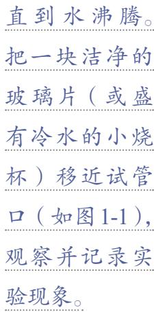

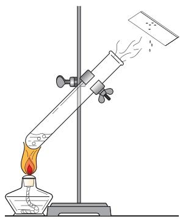

图1-1 水的沸腾

(2) 将盛有一小块石蜡的试管置于盛有沸水的烧杯中（如图 1-2），观察并记录实验现象。 

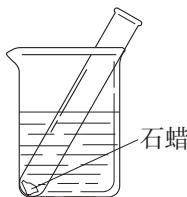

图1-2 石蜡的熔化

(3) 在一支试管中加入 $1 \sim 2 \mathrm{~mL}$ 氢氧化钠溶液,向其中滴加硫酸铜溶液 (如图 1-3), 观察并记录实验现象。 

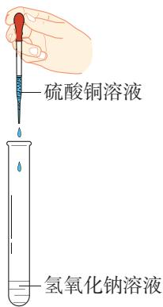

图1-3 氢氧化钠溶液与硫酸铜溶液反应

(4) 在盛有少量大理石的试管中加入适量稀盐酸（如图 1-4），观察并记录实验现象。 

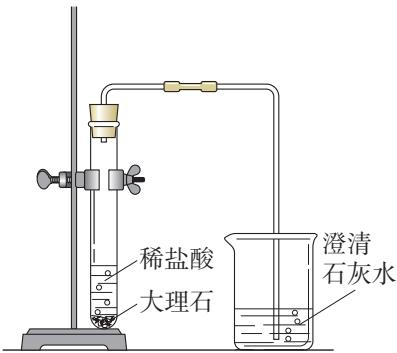

图1-4 大理石与稀盐酸反应

# 注意

实验中要特别注意保护眼睛，戴好护目镜。如不慎有少量试剂（尤其是有腐蚀性或有毒的试剂）溅入眼睛，要立即用水冲洗，边洗边眨眼睛，必要时去医院就诊。 

# 注意

氢氧化钠溶液和盐酸对皮肤和衣服具有腐蚀作用，使用时应小心！ 

实验记录

<table><tr><td>实验编号</td><td>变化前的物质</td><td>变化时发生 的现象</td><td>变化后的物质</td><td>变化后有无 新物质生成</td></tr><tr><td>(1)</td><td>液态的水</td><td></td><td>气态的水（水蒸 气）</td><td></td></tr><tr><td>(2)</td><td>固态的石蜡</td><td></td><td>液态的石蜡</td><td></td></tr><tr><td>(3)</td><td>蓝色的硫酸铜溶 液等</td><td></td><td>蓝色的氢氧化铜 沉淀等</td><td></td></tr><tr><td>(4)</td><td>颗粒状大理石等</td><td></td><td>二氧化碳气体等</td><td></td></tr></table>

# 方法导引

# 实验现象的观察与描述

在实验1-1中，我们通过观察实验现象，初步认识了物质的变化。实验是认识物质的变化和性质的一种基本方法。实验时要重点观察实验前后试剂的颜色、状态、气味等的变化，观察时要全面、细致；要用语言和文字客观、全面、准确地对观察到的现象进行描述，为进一步研究物质及其变化提供证据。 

在实验1-1（1）和实验1-1（2）中，水和石蜡发生了形态的变化，但没有生成新物质。这种没有生成新物质的变化叫作物理变化。汽油挥发、铁水凝固等都属于物理变化。 

在实验1-1（3）和实验1-1（4）中，硫酸铜和大理石在变化中都生成了新物质。这种生成新物质的变化叫作化学变化，又叫化学反应。天然气燃烧、铁生锈、粮食酿酒等都属于化学变化。 

化学变化的特征是有新物质生成，常表现为改变颜色、放出气体、生成沉淀等。化学变化不但 

化学反应 

chemical reaction 

生成新物质，而且伴随着能量的变化，这种能量变化常表现为放热、吸热、发光等。在实验中观察到的现象（如图1-5），常常可以帮助我们判断物质是否发生了化学变化。 

图1-5 化学变化中伴随发生的一些现象

在物质发生化学变化的过程中，会同时发生物理变化。例如，点燃蜡烛时，石蜡燃烧生成水和二氧化碳是化学变化，而石蜡受热熔化是物理变化。 

# 二、化学性质和物理性质

我们将物质在化学变化中表现出来的性质叫作化学性质。例如，铁能在潮湿的空气中生锈，铜能在潮湿的空气中生成铜绿，木炭能在空气中燃烧生成二氧化碳并发光、放热，硫酸铜溶液可与氢氧化钠溶液反应生成蓝色的氢氧化铜沉淀等，大理石可与稀盐酸反应生成二氧化碳气体等。 

化学性质 

chemical property 

物质不需要发生化学变化就表现出来的性质叫作物理性质。物质的颜色、气味、硬度、熔点、沸点、密度等都属于它的物理性质。如表1-1所示，通常状况下，氧气是一种无色的气体，水是一种无色的液体。当外界条件改变时，物质的某些性质也会随着变化。因此，描述物质性质时往往要注明条件。了解物质的物理性质，对于研究它们的组成、结构和变化也非常重要。 

下面就有关物质物理性质的几个基本概念作一些简要介绍。 

# 1. 熔点和沸点

我们知道，当温度升高时，固态的冰会变成液态的水。物质从固态变成液态的过程叫作熔化，物质熔化时的温度叫作熔点。把水加热到一定温度，水就会沸腾。液体沸腾时的温度叫作沸点。实验证明，液体的沸点与压强有关。 

物体所受压力与受力面积之比叫作压强①。 

表1-1 一些常见物质的物理性质（大气压为 $101\mathrm{kPa}^{2}$ ）

<table><tr><td>物质</td><td>颜色(通常状况)</td><td>熔点/℃</td><td>沸点/℃</td></tr><tr><td>水</td><td>无色(液体)</td><td>0</td><td>100</td></tr><tr><td>铁</td><td>银白色(固体)</td><td>1538</td><td>2861</td></tr><tr><td>铝</td><td>银白色(固体)</td><td>660</td><td>2519</td></tr><tr><td>氧气</td><td>无色(气体)</td><td>-218.8</td><td>-183.0</td></tr></table>

# 2. 密度

对于体积相同的铁块和铝块，有经验的人用手掂量一下，就可以鉴别出哪块是铁，哪块是铝。这是由于体积相同的铁块和铝块，它们的质量是不同的。某种物质的质量与它的体积之比，叫作这种物质的密度③。表1-2列出了一些物质的密度。 

# 注意

闻气体时应该小心，用手轻轻地在瓶口扇动，使极少量气体飘进鼻孔。 

# 【实验1-2】

分别取一集气瓶氧气和一集气瓶二氧化碳, 观察它们的颜色, 闻一闻气味。点燃一根小木条, 将其分别慢慢地放入盛有氧气和二氧化碳的集气瓶中, 观察木条燃烧的现象并记录发生的变化。 

# 思考与讨论

结合自己的生活经验和知识，尽可能多地描述氧气和二氧化碳的性质，试着判断哪些属于物理性质，哪些属于化学性质，思考利用哪些方法可以区分这两种物质，并与同学交流。 

我们在生活中了解到很多事实，如水和二氧化碳可以用来灭火，乙醇（俗称酒精）可作燃料，石墨可用于制铅笔芯，等等。物质的这些用途都是由它们的性质决定的。对物质的变化和性质的学习，一定会使你对身边的物质世界有更新的认识。 

# 学完本课题你知道了什么

1. 化学是研究物质的组成、结构、性质、转化及应用的一门基础学科，其特征是从分子层次认识物质，通过化学变化创造物质。 

2. 生成新物质的变化叫作化学变化，又叫作化学反应；没有生成新物质的变化叫作物理变化。 

3. 物质在化学变化中表现出来的性质叫作化学性质，不需要发生化学变化就表现出来的性质叫作物理性质。 

# 练习与应用

1. 下列词语包含的物质变化中，有一种与其他三种有所区别，该词语是（ ）。 

A. 花香四溢 

B. 冰雪消融 

C. 蜡炬成灰 

D. 沙里淘金 

2. 中华民族的发明创造为人类文明进步作出了巨大贡献。我国的下列古代发明及应用中，不涉及化学变化的是（ ）。 

A. 用黏土烧制陶瓷 

B. 黑火药爆炸 

C. 用粮食酿醋 

D. 活字印刷 

3. 下列事例中，哪些是物理变化，哪些是化学变化？简要说明判断的理由。 

（1）碘升华。 

（2）天然气燃烧。 

（3）酒精挥发。 

（4）水结成冰。 

（5）大理石遇到稀盐酸后有二氧化碳和水生成。 

4. 酒精是医疗及日常生活中常用的消毒剂。以下是对酒精的一些描述: ①无色透明; ②具有特殊气味; ③易挥发; ④能与水以任意比例互溶; ⑤易燃烧; ⑥点燃酒精灯时, 酒精在灯芯上汽化; ⑦燃烧时能生成水和二氧化碳。 

在上述描述中，哪些是酒精的物理性质，哪些是酒精的化学性质？ 

5. 生活经验告诉我们，食物一般都有保质期。哪些现象可以帮助我们判断食物已经变质了？请举例说明。 

6. 观察你身边的物质, 如食盐、水、蔗糖、铜导线、铁钉、食醋等, 描述它们的性质和用途。尝试分析其性质中哪些属于物理性质, 哪些属于化学性质。 

# 课题2

# 化学实验与科学探究

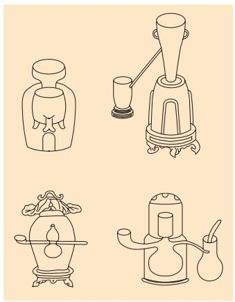

图1-6 中国古代炼丹设备示意图

化学是一门以实验为基础的科学，实验是科学探究的重要手段，许多重大的化学发现都是通过实验得到的。 

说来你也许会惊讶，化学实验室的前身是古代炼丹术士和炼金术士的作坊。在那里诞生了许多实验器具（如图1-6）和分离物质的方法，如过滤、蒸馏等，同时也积累了大量的化学知识。在此基础上，化学实验室逐步成为科学探究的重要场所（如图1-7、图1-8）。 

图1-7 拉瓦锡纪念馆一角（拉瓦锡利用天平进行定量研究，认识了物质燃烧的本质）

图1-8 中学化学实验室

# 一、走进化学实验室

当我们走进化学实验室时，要仔细阅读实验室规则，了解实验室的基本布局，知道疏散通道、灭火器材等的位置。 

在化学实验室里，我们要认识一些常用的化学试剂和实验仪器（如图1-9和附录I），学习一些实验基本操作，如取用化学试剂、加热及连接仪器装置等，以便安全和正确地进行实验，并获得可靠的实验结果。 

图1-9 常用的化学实验仪器

# 1. 化学试剂的取用

实验室里所用的化学试剂一般存放在化学试剂柜中（如图1-10）。有些试剂易爆、易燃、有毒或有腐蚀性（如图1-11），为保证安全，实验前要仔细阅读实验室化学试剂取用规则。 

图1-10 化学试剂柜

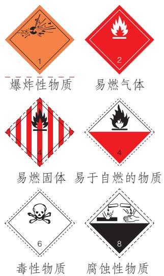

图1-11 危险化学品标志①（部分）

# 资料卡片

# 实验室化学试剂取用规则

（1）不能用手接触试剂，不要把鼻孔凑到容器口闻试剂（特别是气体）的气味，不得尝任何试剂的味道。 

（2）注意节约试剂。应该严格按照实验规定的用量取用试剂。如果没有说明用量，液体一般按最少量（ $1\sim 2\mathrm{mL}$ ）取用，固体只需铺满试管底部。 

（3）实验剩余试剂既不能放回原瓶，也不能随意丢弃，更不能拿出实验室，要放入指定的容器内。 

图1-12 向试管中加入块状试剂

图1-13 向试管中加入粉末状试剂

# （1）固体试剂的取用

固体试剂通常保存在广口瓶里，取用固体试剂一般用药匙。有些块状的试剂（如大理石等）可用镊子夹取。用过的药匙或镊子要立刻擦拭干净，以备下次使用。 

把密度较大的块状试剂放入玻璃容器时，应该先把容器横放，把块状试剂放入容器口（如图1-12），再把容器慢慢地竖立起来，使块状试剂缓缓地滑到容器的底部，以免打破容器。 

向试管中装入粉末状试剂时，为避免试剂沾在管口或管壁上，可先将试管横放，把盛有试剂的药匙（或用小纸条折叠成的纸槽）小心地送至试管底部（如图1-13），然后把试管竖立起来。 

# 【实验1-3】

(1) 取少量块状大理石放入试管中, 并将试管放在试管架上备用。 

(2) 取少量碳酸钠粉末放入另一支试管中, 并将试管放在试管架上备用。 

# （2）液体试剂的取用

液体试剂通常盛放在细口瓶里，常用倾倒法取用（如图1-14）。 

# 思考与讨论

（1）瓶塞为什么要倒放在实验台上？ 

（2）倾倒液体时，细口瓶贴标签的一面要朝向手心，为什么？瓶口为什么要紧挨着试管口？应该快速地倒，还是缓慢地倒？ 

（3）倒完液体后，为什么要立即盖紧瓶塞，并把试剂瓶放回原处？ 

取用一定量的液体试剂时，常用量筒量出体积。读数时，量筒必须放平，视线要与量筒内液体凹液面的最低处保持水平，再读出液体的体积（如图1-15）。 

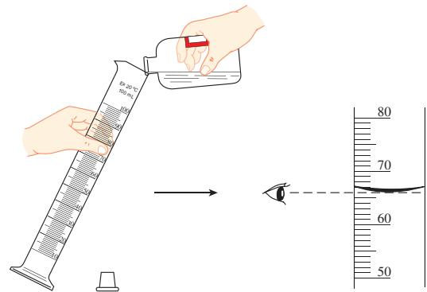

图1-15 液体的量取

# 思考与讨论

量取液体时，如果视线没有与量筒内液体凹液面的最低处保持水平，而是采用仰视或俯视的方法，将会对读数产生什么影响？ 

取用少量液体时一般用胶头滴管（如图1-16）。取液后的胶头滴管，应保持橡胶帽在上，不要平放或倒置，防止液体倒流沾污试剂或腐蚀橡胶帽；不要把胶头滴管放在实验台上，以免沾污胶头滴管。用过的胶头滴管要立即用水洗净（滴瓶上的滴管不要用水洗），以备再用。严禁用未经清洗的胶头滴管吸取其他试剂。 

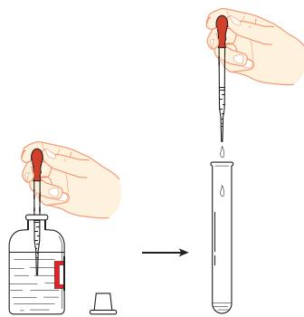

图1-16 用胶头滴管取液体

# 注意

碳酸钠粉末与稀盐酸的反应可能会很剧烈，要注意安全，实验时戴好护目镜。 

 【实验1-4】
(1) 在试管中加入适量澄清石灰水, 滴加两滴酚酞溶液, 观察溶液颜色的变化。 

(2) 用 $10 \mathrm{~mL}$ 量筒量取 $2 \mathrm{~mL}$ 稀盐酸, 倒入实验 1-3 中盛有碳酸钠粉末 (或大理石) 的试管中,观察现象。 

<table><tr><td>实验内容</td><td>现象</td></tr><tr><td>(1)向澄清石灰水中滴加酚酞溶液</td><td></td></tr><tr><td>(2)碳酸钠粉末(或大理石)与稀盐酸反应</td><td></td></tr></table>

# 2. 物质的加热

加热是最常见的反应条件，这一实验基本操作常要使用酒精灯。酒精灯的使用方法如图1-17所示。使用时，要注意以下几点： 

(1) 绝对禁止向燃着的酒精灯里添加酒精,以免失火; 

（2）绝对禁止用酒精灯引燃另一只酒精灯（如图1-18）； 

（3）用完酒精灯后，不可用嘴吹灭，必须用灯帽盖灭，盖灭后轻提一下灯帽，再重新盖好； 

（4）如不慎碰倒酒精灯，不要惊慌，万一洒出的酒精在实验台上燃烧起来，应立刻用湿抹布扑盖。 

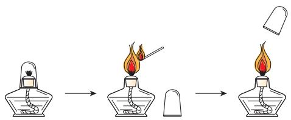

图1-17 酒精灯的使用

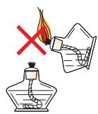

图1-18 绝对禁止用酒精灯引燃另一只酒精灯

给物质加热时，要用酒精灯的外焰（如图1-19）。用酒精灯加热试管中的液体的方法如图1-20所示，应避免图1-21所示的错误操作。 

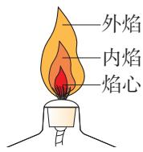

图1-19 酒精灯的灯焰

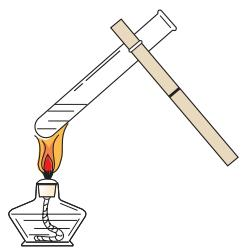

图1-20 用酒精灯加热试管中的液体

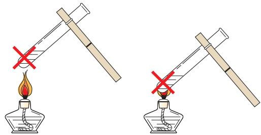

图1-21 错误的加热操作

用酒精灯加热试管中的液体时，还要注意以下几点： 

(1) 试管外壁应该干燥, 试管中液体的体积不应超过试管容积的 $\frac{1}{3}$ ; 

(2) 用试管夹夹持试管时, 应从试管底部套上、取下; 

(3) 加热时, 应先使试管底部均匀受热, 然后用酒精灯的外焰固定加热; 

(4) 试管口不要对着自己或他人; 

（5）加热后的试管，不能立即接触冷水或用冷水冲洗。 

# 【实验1-5】

用 $10 \mathrm{~mL}$ 量筒量取 $2 \mathrm{~mL}$ 氢氧化钠溶液, 倒入试管中, 然后用滴管向该试管中滴加硫酸铜溶液, 观察现象。用试管夹夹住该试管 (夹在距试管口 $\frac{1}{4} \sim \frac{1}{3}$ 处), 按图 1-20 所示的方法加热, 观察现象。 

<table><tr><td>实验内容</td><td>现象</td></tr><tr><td>向氢氧化钠溶液中滴加硫酸铜溶液</td><td></td></tr><tr><td>加热上述反应后生成的物质</td><td></td></tr></table>

图1-22 把玻璃导管插入橡胶塞的孔里

图1-23 在玻璃导管上套上乳胶管

图1-24 用橡胶塞塞住试管

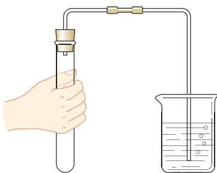

图1-25 检查装置的气密性

# 想一想

为什么有气泡冒出说明装置不漏气？ 

# 3. 仪器装置的连接

正确连接仪器装置是进行化学实验的重要环节。在初中化学实验中用得较多的是连接玻璃导管和橡胶塞、乳胶管，以及连接橡胶塞和试管等容器的操作。装置连接好后一般要检查其气密性。 

(1) 把玻璃导管插入带孔橡胶塞时, 先把导管口用水润湿, 然后对准橡胶塞上的孔稍稍用力转动, 将其插入 (如图 1-22)。 

（2）在连接玻璃导管和乳胶管时，先把导管口用水润湿，然后稍稍用力把玻璃导管插入乳胶管（如图1-23）。 

（3）在连接橡胶塞和容器时，应把橡胶塞慢慢转动着塞进容器口（如图1-24）。切不可把容器放在实验台上再使劲塞进塞子，以防损坏容器。 

（4）检查装置的气密性时，可用手紧握试管，观察水中的导管口有没有气泡冒出（如图1-25）。如果有气泡冒出，说明装置不漏气；如果没有气泡冒出，要仔细寻找原因和解决办法，如塞紧或更换橡胶塞，确认装置不漏气后才能进行实验。 

# 4. 玻璃仪器的洗涤

做实验必须使用干净的仪器，否则会影响实验效果。现以洗涤试管为例（如图1-26），说明洗涤玻璃仪器的方法。 

先倒净试管内的废液，再注入半试管水，振荡后把水倒掉，再注入水，振荡后再倒掉，这样连洗几次。如果内壁附有不易洗掉的物质，要用试管刷刷洗。刷洗时须转动或上下移动试管刷，但用力不能过猛，以防损坏试管。 

洗过的玻璃仪器内壁附着的水既不聚成水滴，也不成股流下时，表明仪器已洗干净。洗净的玻璃仪器应放在指定的地方，如试管要倒扣在试管架上。 

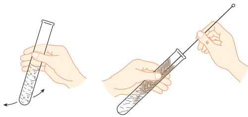

图1-26 试管的洗涤

# 【实验1-6】

将实验中所用的试管等玻璃仪器刷洗干净，并整理实验台和实验室。 

实验完毕，应及时整理实验台和实验室，彻底清洗双手，确认水、电等关闭后离开实验室。 

# 二、走进科学探究

科学探究是获取科学知识、理解科学本质、认识客观世界的重要途径。在进行科学探究时，常通过观察和实验等方法获取证据，通过分析和推理得出结论。 

# 探究

蜡烛主要由石蜡和棉线烛芯组成。运用除味觉以外的感官，在一支蜡烛点燃前、燃烧时和熄灭后的三个阶段进行观察，你能够观察到哪些现象？ 

你可以按下面的实验步骤进行观察和描述，也可以增加或更改某些观察的内容。 

# 【实验】

(1) 观察蜡烛的颜色、状态、形状, 闻一闻气味, 并进行描述。用小刀切下一块石蜡放入水中, 根据实验现象对石蜡的硬度和密度进行初步判断。 

(2) 点燃蜡烛, 仔细观察燃着的部分, 描述火焰附近石蜡的状态变化、烛芯的变化、火焰的分层情况等。 

分别取一个干燥的烧杯和一个用澄清石灰水润湿内壁的烧杯，先后罩在火焰上方（如图1-27），观察并描述烧杯中的现象。 

图1-27 验证蜡烛燃烧的产物

图1-28 点蜡烛刚熄灭时产生的白烟

(3) 熄灭蜡烛, 观察并描述蜡烛熄灭时的现象。用燃着的火柴去点蜡烛刚熄灭时产生的白烟 (如图 1-28), 蜡烛能否重新燃烧? 蜡烛熄灭后, 其颜色、长度等与点燃前相比有什么变化? 

<table><tr><td>实验步骤</td><td>对现象的描述</td></tr><tr><td>(1)</td><td></td></tr><tr><td>(2)</td><td></td></tr><tr><td>(3)</td><td></td></tr></table>

# 【交流与讨论】

(1) 将填写的表格与同学交流，比较谁观察到的现象更多，谁描述得更细致、更准确。与同学交流活动体会。 

（2）围绕蜡烛的燃烧，你还可以提出哪些问题？ 

对蜡烛及其燃烧的探究活动，体现了化学学习的以下特点。 

(1) 关注物质的性质。例如, 石蜡的颜色、硬度、密度、熔点等物理性质, 以及能否燃烧、燃烧产物能否使澄清石灰水变浑浊等化学性质。 

(2) 关注物质的变化。例如, 石蜡受热时熔化等物理变化, 燃烧时生成二氧化碳和水等化学变化。 

（3）关注物质变化的过程，以及对结果的讨论和解释。对物质在变化前、变化中和变化后的现象进行系统、细致的观察和描述；基于证据，经过分析和推理等思考过程，得出可靠的结论。 

探究（或实验）后，应认真完成报告。可以参考以下格式，也可以自己设计报告的格式。 

<table><tr><td colspan="5">探究（或实验）报告</td></tr><tr><td>姓名：</td><td colspan="2">合作者:</td><td>班级：</td><td>日期：</td></tr><tr><td colspan="5">探究（或实验）名称：</td></tr><tr><td colspan="5">探究（或实验）目的：</td></tr><tr><td colspan="5">探究（或实验）用品：</td></tr><tr><td colspan="5">探究（或实验）过程</td></tr><tr><td colspan="2">步骤和方法</td><td colspan="2">现象</td><td>分析或解释</td></tr><tr><td colspan="2"></td><td colspan="2"></td><td></td></tr><tr><td colspan="5">探究（或实验）结论：</td></tr><tr><td colspan="5">问题和建议：</td></tr></table>

# 学完本课题你知道了什么

1. 化学实验室是科学探究的重要场所，要遵守实验室规则，特别要注意安全。 

2. 实验基本操作主要有化学试剂的取用、物质的加热、仪器装置的连接、玻璃仪器的洗涤等，正确的操作是实验成功的重要保证。 

3. 在进行科学探究时, 要在教师指导下明确探究目的,通过实验等方法收集证据, 实验时应细致观察、准确描述和记录实验现象, 并通过分析和推理得出结论, 认真完成报告。 

# 练习与应用

1. 写出下图所示仪器的名称。 

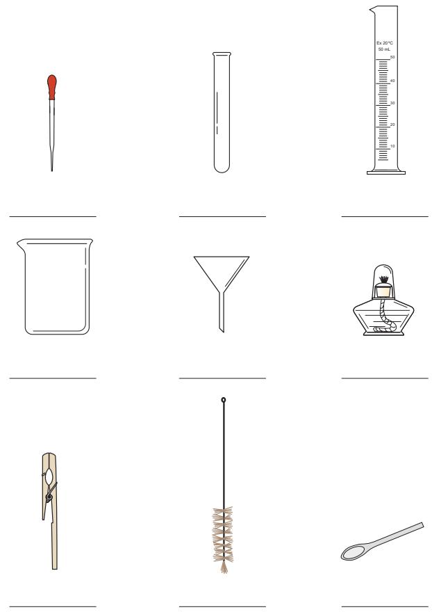

2. 判断下列图示的操作是否正确，若不正确，请写出正确的操作方法。 

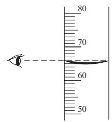

读取量筒内液体的体积

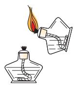

引燃酒精灯

向试管内滴加液体

向试管内倾倒液体

3. 判断下列操作是否正确，并说明理由。 

（1）闻气体气味时，将鼻孔凑近集气瓶口。 

（2）取用固体试剂后，立刻擦拭药匙或镊子。 

（3）读取量筒内液体的体积时，量筒没有放平。 

（4）加热试管中的液体时，试管口对着自己或他人。 

（5）将刚结束加热的试管立即用冷水冲洗干净。 

（6）连接试管与橡胶塞时，将试管抵在实验台上使劲塞进塞子。 

（7）实验结束后，离开实验室前用肥皂等清洗双手。 

4. 回忆蜡烛及其燃烧的探究活动，举例说明你关注了蜡烛及其燃烧产物的哪些物理性质和化学性质。观察到的变化中，哪些属于物理变化，哪些属于化学变化？ 

5. 利用家中的瓶子、杯子、勺子、筷子，以及食盐、冰糖和水等，练习固体试剂取用和液体倾倒的操作，指出其代替的仪器的名称或试剂的类型，并回忆相关操作的注意事项。 

# 整理与提升

# 一、什么是化学

化学是研究物质的组成、结构、性质、转化及应用的一门基础学科，其特征是从分子层次认识物质，通过化学变化创造物质。 

# 二、认识物质的变化和性质

通过实验可以探究物质的变化和性质。 

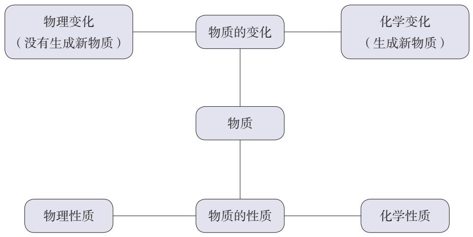

# 三、科学探究是学习化学的重要途径

实验是科学探究的重要手段。遵守化学实验室规则，正确进行实验操作，认真、细致地观察和描述实验现象，准确记录实验结果，是获得可靠实验结论的基本保证。 

# 复习与提高

1. 下列描述中，涉及化学性质的是（ ）。 

A. 水是无色透明的液体 

B. 冰的密度比水的小 

C. 铁能在潮湿的空气中生锈 

D. 铁的熔点很高 

2. 下列物质的用途中，主要利用其化学性质的是（ ）。 

A. 煤油作为温度计的测温材料 

B. 铜和铝用于生产电缆 

C. 钢铁作为建筑材料 

D. 天然气作为家用燃料 

3. 下列变化中，一定是化学变化的是（ ）。 

A. 有颜色改变的变化 

B. 需要加热的变化 

C. 有新物质生成的变化 

D. 产生光和热的变化 

4. 做化学实验要养成良好的习惯。下图所示实验后仪器放置的状态中，正确的是（ ）。 

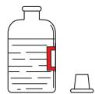

A.

B.

C.

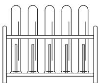

D.

5. 探究蜡烛及其燃烧时，发现罩在蜡烛火焰上方的烧杯内壁被熏黑。下列做法中，不可取的是（ ）。 

A. 如实记录并准确描述该现象 

B. 重复实验，观察是否有相同现象 

C. 忽略该异常现象, 换一个烧杯继续实验 

D. 向教师请教或查阅有关资料, 了解生成黑色物质的可能原因 

6. 向试管中加入固体试剂时，先横放试管，用镊子将块状试剂放入试管口，再慢慢将试管竖立起来的原因是________，用药匙或纸槽将粉末状试剂送至试管底部，再将试管竖立起来的原因是________。 

7. 下图所示的仪器中，不能用作化学反应容器的是 ______ 和 ______（填仪器名称，下同），可以直接加热的是 ______ ，需放置在陶土网上加热的是 ______ ，用于储存和取用液体试剂的是 ______ 。 

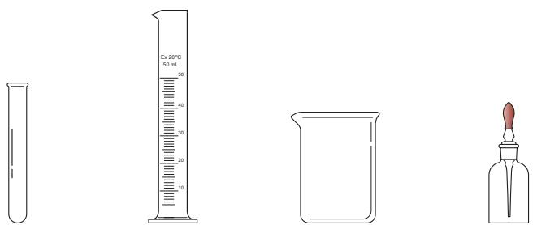

8. 指出下列操作可能导致的后果。 

（1）倾倒液体时，细口瓶的标签未朝向手心： 

(2) 胶头滴管使用后, 未经清洗就吸取其他试剂: 

（3）加热试管中的液体时，没有先使试管底部均匀受热： 

（4）用嘴吹灭酒精灯： 

9. 某同学用 $50 \mathrm{~mL}$ 量筒量取液体, 如下图所示。量筒内液体的实际体积为 $\_ \_ \_ \_ \_ \mathrm{mL}$ , 该同学的读数 (填 “大于” “等于” 或 “小于”) 实际体积。 

10. 用图 1-25 所示方法检查装置的气密性时，导管末端可能会出现下图所示的现象。如果装置的气密性好，很快会出现的是 ______（填字母，下同），冷却后会出现的是 ______；如果装置的气密性不好，最有可能出现的是 ______。 

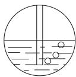

a

b

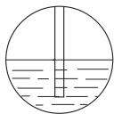

C

11. 查阅英国科学家法拉第（M. Faraday，1791—1867）有关蜡烛的讲座内容，了解他在探究蜡烛及其燃烧时，如何提出问题、进行猜想，如何利用实验进行验证，如何在观察、描述后通过分析和推理得出结论。撰写心得，与同学交流。 

# 第二单元

# 空气和氧气

我们周围的空气 

$\bullet$ 氧气 

制取氧气 

我们生活的地球表面有一层厚厚的空气，你可能已经知道它的成分，但你知道各成分的含量是多少吗？各种成分又有哪些用途呢？ 

我们可以通过化学实验认识空气的成分，以及空气中的重要气体——氧气的性质，初步了解化学研究的方法，养成注重实证的科学态度。 

# 课题1

# 我们周围的空气

空气 air 

我们知道空气是无色无臭的，虽然看不见，但可以通过呼吸体会它的存在。那么，如何通过实验来测定空气的组成呢？ 

图2-1 拉瓦锡

# 一、空气的组成

二百多年前，法国化学家拉瓦锡（如图2-1）研究了空气的成分（如图2-2）。他把少量汞放在密闭的容器里连续加热12天，发现有一部分银白色的液态汞变成红色粉末，同时容器里空气的体积减小了。他研究了容器里的剩余气体，发现这部分气体既不能供给呼吸，也不能支持燃烧。他认为这些气体全部是氮气（拉丁文原意是“不能维持生命”，氮气的化学符号是 $\mathrm{N}_2$ ）。 

拉瓦锡又把汞表面生成的红色粉末收集起来， 

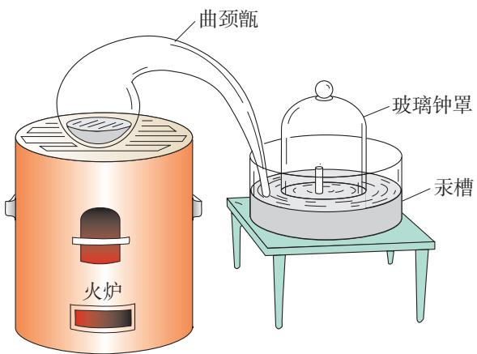

图2-2 拉瓦锡研究空气成分所用的装置示意图

放在另一个较小的容器里再加强热，得到了汞（化学符号 $\mathrm{Hg}$ ）和氧气（化学符号 $\mathrm{O}_2$ ），而且氧气的体积恰好等于密闭容器里所减小的体积。他把得到的氧气加到前一个容器里剩下的气体中，结果所得气体的性质与空气的完全一样。通过实验和分析，拉瓦锡得出了空气由氧气和氮气组成的结论。 

在19世纪末以前，人们深信空气中仅含有氧气和氮气。后来人们又发现了氦、氖、氩、氪、氙、氡等稀有气体①，才认识到空气中除了氧气和氮气，还有其他成分。目前，人们已能用实验方法精确地测定空气的成分。 

通过实验测定，空气的成分按体积计算，大约是：氮气 $78\%$ 、氧气 $21\%$ 、稀有气体 $0.94\%$ 、二氧化碳 $0.03\%$ 、其他气体 $0.03\%$ （如图2-3）。 

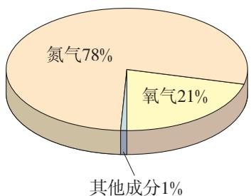

图2-3 空气成分示意图

# 思考与讨论

仿照拉瓦锡实验的原理, 我们可以探究空气中氧气的含量。例如, 红磷 (化学符号 $\mathrm{P}$ ) 与空气中的氧气反应, 生成一种叫作五氧化二磷 (化学符号 $\mathrm{P}_{2} \mathrm{O}_{5}$ ) 的新物质, 这一反应可以用文字表示如下: 

$$
\text {红 磷} + \text {氧 气} \xrightarrow {\text {点 燃}} \text {五 氧 化 二 磷}
$$

按图2-4所示的实验装置进行实验。在集气瓶内加入少量水，将水面上方空间分为5等份，并做好标记。用弹簧夹夹紧乳胶管。在燃烧匙内放入足量的红磷，用酒精灯加热，点燃红磷后立即伸入瓶中，并塞紧橡胶塞。待红磷熄灭并冷却至室温，打开弹簧夹，可以观察到烧杯中的水被吸入集气瓶，瓶内液面上升。请讨论并解释这个实验的原理。 

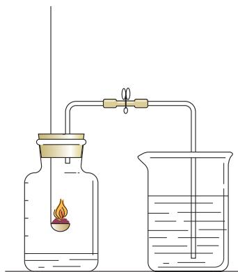

图2-4探究空气中氧气含量的装置

混合物 mixture 

纯净物 pure substance 

像空气这样，由两种或两种以上的物质混合而成的物质叫作混合物，组成混合物的各种成分保持着它们各自的性质。氮气、氧气、二氧化碳等分别只由一种物质组成，它们都是纯净物。纯净物可以用化学符号来表示，如氮气可表示为 $\mathrm{N}_{2}$ ，氧气、二氧化碳可分别表示为 $\mathrm{O}_{2}$ 、 $\mathrm{CO}_{2}$ 。上面实验中使用的红磷（P）和生成的五氧化二磷（ $\mathrm{P}_{2} \mathrm{O}_{5}$ ）也都是纯净物。 

# 科学·技术·社会

# 测定空气中氧气含量的数字化实验

数字化实验利用传感器和信息处理终端进行实验数据的采集与分析。实验时一般将传感器、数据采集器和计算机依次相连，采集实验过程中各种物理量（如温度、压强、浓度等）的数据，通过软件对数据进行记录、呈现和分析。 

我们可以将测定空气中氧气的含量 

设计成数字化实验（如图2-5）。实验步骤如下：（1）将氧气传感器与数据采集器、计算机连接；（2）把氧气传感器插入盛有空气的容器，采集数据；（3）通过相关软件处理数据，并在计算机屏幕上显示空气中氧气的含量。 

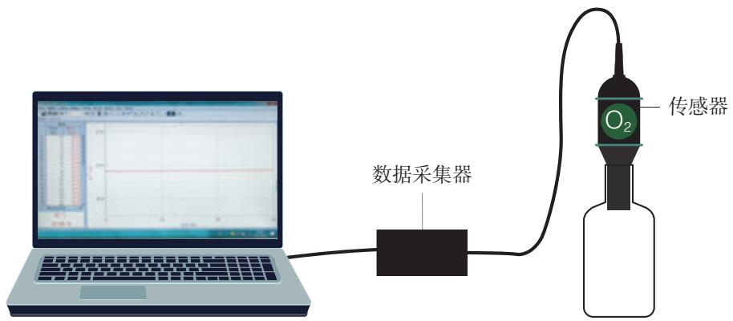

图2-5 测定空气中氧气含量的数字化实验示意图

# 二、空气是一种宝贵的资源

空气中的各种成分广泛应用于工农业生产、医疗和科研等领域，是人类生产活动的重要资源。 

# 1. 氧气

过去，人们曾把氧气叫作“养气”，这充分说明了氧气的重要性。燃料燃烧离不开氧气，医疗急救、炼钢、化工生产、气割、气焊和航空航天等都要用到氧气（如图2-6）。 

动植物呼吸

炼钢

医疗

气焊

图2-6 氧气的用途

# 2. 氮气

氮气具有广泛的用途（如图2-7），它是制造硝酸和氮肥的重要原料。由于氮气的化学性质不活泼，因此常被用作保护气，如焊接金属时用氮气作保护气，食品包装中充入氮气以防腐。医疗上可利用液氮进行冷冻治疗。超导材料在液氮的低温环境下能显示超导性能。 

制造氮肥

食品充氮防腐

冷冻

图2-7 氮气的用途

# 思考与讨论

在探究空气中氧气含量的实验中，集气瓶内剩下的气体主要是氮气。请结合实验和日常生活经验讨论下列问题。 

(1) 燃烧着的红磷熄灭了, 这种现象说明氮气能不能支持燃烧? 

(2) 集气瓶内液面上升到一定高度后, 还能继续上升吗? 这种现象能不能说明氮气不易溶于水? 

根据日常生活经验及上面的讨论，填写下表，描述氮气的物理性质。 

<table><tr><td>物质</td><td>颜色</td><td>气味</td><td>标准状况①下的密度</td><td>熔点</td><td>沸点</td><td>是否易溶于水</td></tr><tr><td>氮气</td><td></td><td></td><td>1.251 g/L</td><td>-210 °C</td><td>-196 °C</td><td></td></tr></table>

红磷在氮气中不能继续燃烧的事实，说明氮气不支持燃烧。许多实验事实都表明，氮气的化学性质不如氧气的活泼。 

# 3. 稀有气体

在空气的成分中，稀有气体（氦、氖、氩、氪、氙和氡）所占比例虽然很小，但它们却是一类很重要的气体。它们都没有颜色，没有气味，化学性质很不活泼。 

在生产和科学研究中，稀有气体具有广泛的用途（如图2-8）。稀有气体在通电时能发出不同颜色的光，可用于航标灯、照明灯、闪光灯、霓虹灯等。液态氦可用于制造低温环境。 

氮气 nitrogen稀有气体 rare gas 

氦气球

霓虹灯

激光器

图2-8 稀有气体的用途

# 科学·技术·社会

# 利用氩氦刀治疗肿瘤

氩氦刀不是一般意义上的手术刀，而是一种低温冷冻微创治疗肿瘤的设备。治疗时，利用氩气使病变组织快速降温冷冻，利用氦气使病变组织快速升温解冻，从而消除 

肿瘤，因此被称为氩氮刀。氩氦刀对降温和升温的速度，以及冷冻区域的大小与形状都可以进行精确设定和控制。 

# 三、保护大气环境

洁净的空气对于人类和其他动植物都是非常重要的。但是，随着工业的发展，排放到空气中的有害气体和烟尘对空气造成了污染。被污染的空气会严重损害人体健康，影响作物生长，破坏生态平衡。臭氧层破坏和酸雨也与空气污染有关。 

为了保护大气环境，人类正在积极行动起来，使用清洁能源，加强空气质量监测，积极植树、种草等，持续深入打好蓝天保卫战。 

# 思考与讨论

（1）举例说明空气污染造成的危害。 

(2) 2013年秋季, 我国发布《大气污染防治行动计划》, 加强了对空气污染的综合治理。请查阅资料, 结合自身体会, 了解我国空气质量改善取得的成就, 并与同学交流。 

(3) 为了保护人类赖以生存的空气, 你能做些什么? 

# 资料卡片

# 空气质量指数日报

空气质量指数日报的主要内容包括“空气质量指数”“首要污染物”“空气质量指数类别”等（如图2-9）。 

空气质量指数（air quality index，AQI）是依据常规监测的几种空气污染物浓度计算得到的。目前计入空气质量评价的主要污染物为：二氧化硫、一氧化碳、二氧化氮、可吸入颗粒物（粒径小于等于 $10\mu \mathrm{m}$ 的颗粒物， $\mathrm{PM}_{10}$ ）、细颗粒物（粒径小于等于 $2.5\mu \mathrm{m}$ 的颗粒物， $\mathrm{PM}_{2.5}$ ）和臭氧等。根据空气质量指数可以对空气质量分级（如表2-1）。 

空气质量指数日报可以及时准确地反映空气质量状况，增强人们对环境的关注，促进人们对环境保护工作的理解和支持，提高全民的环境保护意识，促进人们生活质量的提高。 

城市空气质量

图2-9 空气质量指数日报（生态环境部发布）

表2-1 空气质量分级标准

<table><tr><td>空气质量指数</td><td>0~50</td><td>51~100</td><td>101~150</td><td>151~200</td><td>201~300</td><td>&gt;300</td></tr><tr><td>空气质量指数级别</td><td>一级</td><td>二级</td><td>三级</td><td>四级</td><td>五级</td><td>六级</td></tr><tr><td>空气质量指数类别</td><td>优</td><td>良</td><td>轻度污染</td><td>中度污染</td><td>重度污染</td><td>严重污染</td></tr></table>

# 调查与研究

（1）通过多种途径收集你所在地区近阶段的空气质量指数日报。以日期为横坐标，空气质量指数为纵坐标，利用收集的数据作图。 

（2）用照片、漫画、短文等记录你所在地区为保护大气环境所采取的措施。 

（3）调查市售便携式空气质量检测仪的种类和功能。 

（4）把活动过程及你对改善空气质量的建议写成小论文，与同学交流。 

# 学完本课题你知道了什么

1. 空气的成分按体积计算，大约是：氮气 $78\%$ 、氧气 $21\%$ 、稀有气体等其他成分 $1\%$ 。 

2. 纯净物由一种物质组成，混合物由两种或两种以上物质组成。氧气、氮气等是纯净物，空气是混合物。 

3. 空气是一种宝贵的自然资源，要保护大气环境，防止污染空气。 

# 练习与应用

1. 空气中含量较高且化学性质不活泼的气体是（ ）。 

A. 氧气 

B. 氮气 

C. 二氧化碳 

D. 水蒸气 

2. 科学家对火星的大气进行分析，得到下表所示数据。 

<table><tr><td>气体</td><td>二氧化碳</td><td>氮气</td><td>氩气</td></tr><tr><td>体积分数/%</td><td>95</td><td>2.7</td><td>1.6</td></tr></table>

与地球大气的成分相比，火星大气中含量更高的是（ ）。 

A. 氮气 

B. 氮气和氩气 

C. 二氧化碳和氮气 

D. 二氧化碳和氯气 

3. 下列物质中，属于混合物的是（ ）。 

A. 冰 

B. 液态氧 

C. 五氧化二磷 

D. 蜡烛燃烧后的产物 

4.下列说法中，正确的是（ 

A. 氮气的化学性质比较活泼 

B. 臭氧层破坏与空气污染无关 

C. 空气中含有氧气, 因此空气可直接用于医疗急救 

D. 空气中的稀有气体所占比例虽小, 但用途广泛 

5. 现有下列物质: ①氧气、②人体呼出的气体、③液氮、④空气中的稀有气体、⑤二氧化碳、⑥洁净的空气, 其中属于纯净物的是 (填序号)。请从①~⑥中选出一种混合物并说明其中的成分: 

6. 列举 4 种存在于空气中的纯净物及其主要用途, 谈谈你如何认识 “空气是一种宝贵的资源”。 

# 课题2

# 氧气

氧气 oxygen 

在标准状况下，氧气的密度是 $1.429 \mathrm{~g} / \mathrm{L}$ ，比空气的密度（ $1.293 \mathrm{~g} / \mathrm{L}$ ）略大。氧气不易溶于水，在室温下， $1 \mathrm{~L}$ 水只能溶解约 $30 \mathrm{~mL}$ 氧气。在压强为 $101 \mathrm{kPa}$ 时，氧气在 $-183.0^{\circ} \mathrm{C}$ 变为淡蓝色液体，在 $-218.8^{\circ} \mathrm{C}$ 变为淡蓝色固体。 

# 【实验2-1】

把带有火星的木条插入盛有氧气的集气瓶中，观察木条是否复燃。 

带有火星的木条在氧气中能够复燃，说明氧气能支持燃烧（如图2-10）。 

图2-11 木炭分别在空气和氧气中燃烧

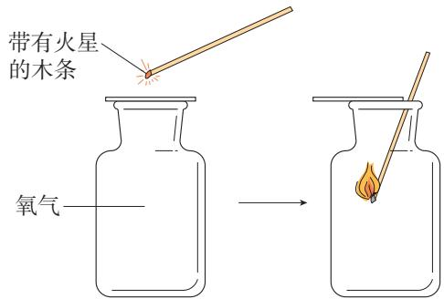

图2-10 氧气可以使带有火星的木条复燃

# 【实验2-2】

用坩埚钳夹取一小块木炭放在酒精灯火焰上加热，观察木炭在空气中燃烧的现象。然后把燃着的木炭插入充满氧气的集气瓶中（如图2-11），再观察木炭在氧气中燃烧的现象。比较木炭在空气和氧气中燃烧有什么不同。 

<table><tr><td>实验内容</td><td>现象</td></tr><tr><td>木炭在空气中燃烧</td><td></td></tr><tr><td>木炭在氧气中燃烧</td><td></td></tr></table>

木炭与氧气发生化学反应，生成了二氧化碳（ $\mathrm{CO}_{2}$ ）气体，并放出热量。这个反应可以表示如下： 

点燃 碳 + 氧气 二氧化碳 

# 【实验2-3】

在燃烧匙里放入少量硫，加热，直到发生燃烧，观察硫在空气中燃烧的现象。然后把盛有燃着的硫的燃烧匙插入充满氧气的集气瓶中（如图2-12），再观察硫在氧气中燃烧的现象。比较硫在空气和氧气中燃烧有什么不同。 

图2-12 硫分别在空气和氧气中燃烧

<table><tr><td>实验内容</td><td>现象</td></tr><tr><td>硫在空气中燃烧</td><td></td></tr><tr><td>硫在氧气中燃烧</td><td></td></tr></table>

硫与氧气发生化学反应，生成了一种有刺激性气味的二氧化硫（ $\mathrm{SO}_2$ ）气体，并放出热量。这个反应可以表示如下： 

点燃 硫 $+$ 氧气 二氧化硫 

# 思考与讨论

木炭和硫分别在空气和氧气中燃烧的现象不同，这说明了什么？ 

图2-13 铁丝在空气中加热时红热，在氧气中点燃发生剧烈燃烧

# 【实验2-4】

把两根光亮的细铁丝分别盘成螺旋状。取一根在酒精灯火焰上烧至红热，观察现象。另取一根，在其下端系一根火柴，点燃火柴，待火柴快燃尽时，插入盛有氧气的集气瓶中（预先放入一些水，如图2-13），观察现象。 

在空气中加热细铁丝时，铁丝红热，不能燃烧；但在氧气中点燃细铁丝可发生剧烈燃烧，火星四射。铁与氧气反应生成黑色的四氧化三铁（ $\mathrm{Fe}_{3} \mathrm{O}_{4}$ ）固体。这个反应可以表示如下： 

点燃 铁 $+$ 氧气 四氧化三铁 

通过以上几个实验，我们可以看出，可燃物在氧气中燃烧比在空气中燃烧要剧烈。例如，硫在空气中燃烧发出微弱的淡蓝色火焰，而在氧气中燃烧得更旺，发出蓝紫色火焰。又如，某些在空气中不能燃烧的物质却可以在氧气中燃烧。这说明氧气的化学性质比较活泼，同时也说明，物质在空气中燃烧，实际上是与其中的氧气发生反应，由于空气中的氧气含量相对较低，在空气中燃烧不如在氧气中剧烈。 

# 思考与讨论

（1）分析实验2-2、实验2-3和实验2-4，填写下表。 

<table><tr><td>实验编号</td><td>反应前的物质</td><td>反应后生成的物质</td><td>反应的文字表达式</td></tr><tr><td>2-2</td><td></td><td></td><td></td></tr><tr><td>2-3</td><td></td><td></td><td></td></tr><tr><td>2-4</td><td></td><td></td><td></td></tr></table>

(2) 上述三个化学反应有什么共同特点? 

通过实验和讨论，我们发现氧气与碳、硫、铁的反应有一个共同特点：它们都是由两种物质发生反应，生成另一种物质。我们把由两种或两种以上物质生成另一种物质的反应，叫作化合反应。 

这三个反应还有一个共同特点：它们都是物质与氧气发生的反应。这类反应属于氧化反应。 

物质在氧气中燃烧是较剧烈的氧化反应，但并不是所有的氧化反应都像燃烧那样剧烈并发光、放热。有些氧化反应进行得很慢，甚至不容易被察觉，这种氧化叫作缓慢氧化。缓慢氧化的例子很多，如细胞的呼吸作用、食物的腐烂、醋的酿造、农家肥的腐熟等都包含物质的缓慢氧化。 

化合反应 

combination reaction 

氧化反应 

oxidation reaction 

# 学完本课题你知道了什么

1. 氧气的化学性质比较活泼, 能支持燃烧, 在一定条件下能与碳、硫、铁等发生反应。 

2. 由两种或两种以上物质生成另一种物质的反应，叫作化合反应。物质与氧气发生的反应属于氧化反应。 

# 练习与应用

1. 下列对氧气的描述中，不正确的是（ ）。 

A. 氧气极易溶于水 

B. 氧气是一种化学性质比较活泼的气体 

C. 氧气在低温、高压时能变为液体或固体 

D. 通常状况下, 氧气是一种无色、无臭的气体 

# 人民教育出版社

2. 下列关于几种气体的说法中，不正确的是（ ）。 

A. 氧气可与铁反应生成四氧化三铁 

B. 二氧化硫是一种没有颜色和气味的气体 

C. 稀有气体在通电时能发出不同颜色的光, 可制作霓虹灯 

D. 氮气的化学性质不活泼, 可在食品包装袋中充入氮气以防腐 

3. 下列关于物质燃烧的说法中，正确的是（ ）。 

A. 红磷在空气中不能燃烧 

B. 木炭燃烧后生成黑色固体 

C. 硫燃烧时生成有刺激性气味的气体 

D. 铁丝插入盛有氧气的集气瓶中剧烈燃烧 

4. 氧气的下列性质中，属于化学性质的是（ ）。 

A. 颜色 

B. 密度 

C. 支持燃烧 

D. 熔点 

5. 已知下列反应在一定条件下都能发生，其中属于化合反应的是（ ）。 

A. 氧化汞 $\xrightarrow{\text { 加热 }}$ 汞+氧气 

B. 大理石 + 盐酸 $\longrightarrow$ 氯化钙 + 二氧化碳 + 水 

C. 酒精 + 氧气 $\xrightarrow{\text { 点燃 }}$ 水 + 二氧化碳 

D. 碳 + 氧气 $\xrightarrow{\text { 点燃 }}$ 二氧化碳 

6. 请用文字表示硫、红磷和铁丝分别在氧气中燃烧时发生的反应。 

硫： 

红磷： 

铁丝： 

7. 你家用什么燃料烧水做饭？燃料燃烧过程中你能观察到什么现象？燃料燃烧是不是化学变化？为什么？ 

8. 请结合氧气的化学性质，列举氧气在生产和生活中的用途。 

# 课题3

# 制取氧气

工业上一般采用分离空气的方法制取氧气。在实验室里，常采用高锰酸钾或过氧化氢分解等方法制取氧气。 

# 【实验2-5】

如图2-14所示连接好装置。检查装置的气密性后，把少量高锰酸钾装入试管中，在试管口放一团棉花①，用带有导管的橡胶塞塞紧试管，并把试管固定在铁架台上。将一个集气瓶盛满水，用玻璃片盖住瓶口，再将其与玻璃片一起倒立在盛水的水槽内。 

(1) 加热试管, 当导管口连续并比较均匀地放出气泡时, 把导管口伸入盛满水的集气瓶, 用排水法收集一瓶氧气。 

(2) 把带有火星的木条插入集气瓶中, 观察现象。 

图2-14 高锰酸钾分解制取氧气

<table><tr><td>实验编号</td><td>现象</td></tr><tr><td>(1)</td><td></td></tr><tr><td>(2)</td><td></td></tr></table>

高锰酸钾是一种暗紫色的固体，它受热时分解出氧气，同时还生成锰酸钾和二氧化锰。 

加热高锰酸钾 锰酸钾 + 二氧化锰 + 氧气 

# 资料卡片

# 工业上如何大量制取氧气

空气中含有大量氧气，是制取氧气廉价、易得的原料。怎样才能把氧气从空气中分离出来呢？我们知道，液态纯净物有一定的沸点。科学家正是利用了物质的这一性质，在低温条件下加压，使空气转变为液态，然后升温。由于液态氮的沸点比液态氧的沸点低，所以氮气首先从液态空气中分离出来，剩下的主要是液态氧。为了便于储存、运输和使用，通常把氧气加压后储存在蓝色的钢瓶中（如图2-15）。 

图2-15 储存氧气的钢瓶

除了用高锰酸钾分解的方法制取氧气，在实验室里还常常用过氧化氢分解的方法制取氧气。过氧化氢溶液为无色透明液体，在医疗上可用于消毒防腐。在常温下过氧化氢可以分解放出氧气。 

# 探究

# 过氧化氢分解制取氧气的反应中二氧化锰的作用

# 【问题】

在使用过氧化氢溶液制取氧气时，通常加入少量二氧化锰，这是为什么呢？ 

# 【实验】

（1）在试管中加入 $5\mathrm{mL}5\%$ 过氧化氢溶液，把带有火星的木条插入试管，观察现象。 

(2) 向上述试管中加入少量二氧化锰, 把带有火星的木条插入试管, 观察现象 (如图 2-16)。 

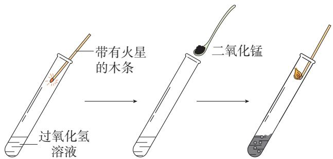

# 提示

仔细观察反应前后的二氧化锰。 

图2-16 过氧化氢分解实验示意图

(3) 待上述试管中没有现象发生时, 重新加入过氧化氢溶液, 并把带有火星的木条插入试管, 观察现象。待试管中又没有现象发生时, 再重复上述操作, 观察现象。 

<table><tr><td>实验编号</td><td>现象</td></tr><tr><td>(1)</td><td></td></tr><tr><td>(2)</td><td></td></tr><tr><td>(3)</td><td></td></tr></table>

# 【分析与结论】

（1）在实验（1）和实验（2）中，木条是否复燃？发生这种现象的原因可能是什么？ 

(2) 综合分析实验 (1) ~ 实验 (3) 中观察到的现象, 你认为二氧化锰在过氧化氢分解的反应中起了什么作用? 

在实验（1）中，带有火星的木条不能复燃，是因为过氧化氢在常温下分解缓慢，在较短时间内放出的氧气很少。在实验（2）中，木条复燃，是因为向过氧化氢溶液中加入少量二氧化锰使过氧化氢分解加速。这一反应可以表示如下： 

过氧化氢 二氧化锰 水 + 氧气 

在实验（3）中，实验重复多次，每次只消耗了过氧化氢，二氧化锰好像永远用不完。如果在实验前用精密的天平称量二氧化锰的质量，实验后把二氧化锰洗净、干燥，再称量，你会发现它的质量没有发生变化。把它再加到过氧化氢溶液中，还可以加速过氧化氢分解。这种在化学反应里能改变其他物质的化学反应速率，而本身的质量和化学性质在反应前后都没有发生变化的物质叫作催化剂。催化剂在化学反应中所起的作用叫作催化作用。硫酸铜等物质对过氧化氢的分解也具有催化作用。 

催化剂在化工生产中有重要而广泛的应用，生产化肥、农药、化工原料等都要使用催化剂。 

# 思考与讨论

分析上述两个制取氧气的反应，它们有什么共同特征？与化合反应有什么不同？ 

催化剂 catalyst 

分解反应 

decomposition reaction 

由一种反应物生成两种或两种以上其他物质的反应，叫作分解反应。在化学学习过程中，常常要用到分类的方法。例如，物质可以分为纯净物和混合物，化学反应可以分为化合反应、分解反应等。利用分类的方法学习化学，可以取得事半功倍的效果。我们还将利用这种方法学习更多的化学知识。 

# 方法导引

# 实验探究的一般思路

在“探究——过氧化氢分解制取氧气的反应中二氧化锰的作用”中，我们根据探究目的设计了三个对比实验方案；观察和记录实验中带有火星的木条是否复燃等实验现象，收集证据；通过基于证据的分析推理，最后形成了催化剂的概念。 

化学实验是学习化学的基本方法，是开展实验探究的重要方式。通常情况下，实验探究的一般思路可归纳为：明确探究目的 $\rightarrow$ 设计实验方案 $\rightarrow$ 实施实验 $\rightarrow$ 获取证据 $\rightarrow$ 分析推理 $\rightarrow$ 形成结论。 

# 科学·技术·社会

# 催化剂的作用

催化剂在化工生产中具有重要作用，大多数化工生产都有催化剂参与。例如，在合成氨工业中，即使在高温、高压下，氮气与氢气的化合反应仍然进行得十分缓慢，而以铁为主体的催化剂能使反应物在相对低的温度下较快发生反应。人类利用氮气和氢气合成氨，再生产含氮化肥，显著提高了农作物产量，有效保证了粮食安全。 

石油炼制过程需要使用高效催化剂生产汽油、煤油及其他石油化工产品。我国石油化工专家、2007年度国家最高科学 

技术奖获得者闵恩泽院士（如图2-17），研发了多种用于石油化工生产的催化剂，为我国炼油催化剂制造技术奠定了基础。 

图2-17 闵恩泽（1924—2016）

# 学完本课题你知道了什么

1. 在化学反应中, 一种反应物生成两种或两种以上其他物质的反应, 叫作分解反应。 

2. 实验室里可用高锰酸钾或过氧化氢分解的方法制取氧气。 

3. 在化学反应里能改变其他物质的化学反应速率，而本身的质量和化学性质在反应前后都没有发生变化的物质叫作催化剂。催化剂在化工生产中具有重要作用。 

# 练习与应用

1. 实验室用高锰酸钾制取氧气的实验中，不需要使用的一组仪器是（ ）。 

A. 烧杯、玻璃棒 

B. 试管、集气瓶 

C. 酒精灯、铁架台 

D. 导管、单孔橡胶塞 

2.下列说法中，不正确的是（ ）。 

A. 氧气可以用于航空航天 

B. 用排水法可以收集不易溶于水的气体 

C. 在过氧化氢的分解反应中, 二氧化锰起催化作用 

D. 氧气的化学性质很活泼, 在常温下能与所有物质发生化学反应 

3. 下列有关催化剂的说法中，正确的是（ ）。 

A. 能改变化学反应速率 

B. 在化学反应后其质量减小 

C. 在化学反应后其质量增加 

D. 在化学反应后其化学性质发生了变化 

4. 下列反应中，属于分解反应的是（ ）。 

A. 硫 + 氧气 $\xrightarrow{\text { 点燃 }}$ 二氧化硫 

点燃 B. 石蜡+氧气 $\rightarrow$ 二氧化碳+水 

C. 铁 + 氧气 $\xrightarrow{\text { 点燃 }}$ 四氧化三铁 

D. 高锰酸钾 $\xrightarrow{\text { 加热 }}$ 锰酸钾 + 二氧化锰 + 氧气 

5. 以下是实验室用高锰酸钾制取氧气并用排水法收集的主要操作步骤: ①将试管固定在铁架台上; ②检查装置的气密性; ③点燃酒精灯, 先使试管受热均匀, 然后对准试管中盛放试剂的部位加热; ④将试剂装入试管, 用带导管的单孔橡胶塞塞紧试管; ⑤收集完毕, 将导管从水槽中取出; ⑥用排水法收集氧气; ⑦熄灭酒精灯。请回答下列问题。 

（1）该实验正确的操作顺序是 （填序号）。 

(2) 可以用排水法收集氧气, 体现了氧气 的性质。 

（3）验证一瓶无色气体是氧气的简单方法是 

6. 请根据以下图示回答问题。 

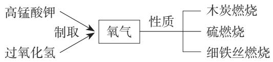

（1）请用文字表示制取氧气的反应，并比较两个反应的相同点和不同点。 

（2）请描述硫和细铁丝分别在氧气中燃烧的实验现象。 

(3) 在进行细铁丝在盛有氧气的集气瓶中燃烧的实验时, 常常要在集气瓶里预先加少量水, 这样做的目的是什么? 能否用少量细沙来代替水? 

7. 利用下图所示仪器、试剂及其他必要物品进行实验并探究。 

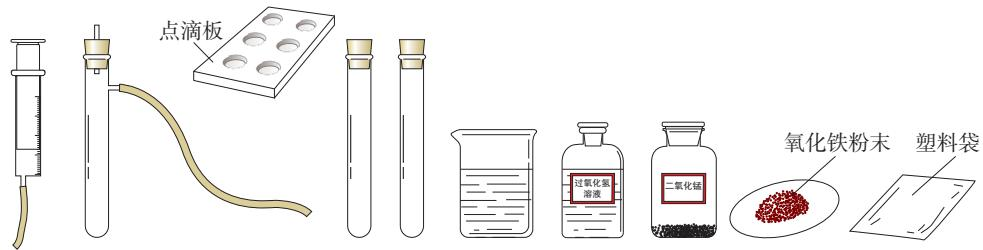

(1) 把少量二氧化锰加入盛有过氧化氢溶液的试管中与把过氧化氢溶液缓缓加入盛有少量二氧化锰的试管中的实验现象是否相同? 哪种方法可以得到平稳的氧气流? 

(2) 设计制取氧气和探究其性质的实验方案（下表可供参考，你也可以利用一些代用品自行设计实验方案），征得教师同意后实施你的方案，实验后进行小结。 

<table><tr><td>目的</td><td>寻找新的催化剂</td><td>制取氧气</td><td>探究氧气的性质</td></tr><tr><td>仪器、试剂</td><td></td><td></td><td></td></tr><tr><td>方案
(可画简图)</td><td>(提示:使用氧化铁代
替二氧化锰)</td><td></td><td></td></tr><tr><td>步骤</td><td></td><td></td><td></td></tr><tr><td>结论</td><td></td><td></td><td></td></tr></table>

（3）请结合以上探究，并查阅资料，尽可能多地写出制取氧气的方法。 

# 整理与提升

# 一、基于空气的组成认识物质及其分类

混合物： （举例）物质纯净物： （举例） 

# 二、认识氧气

性质：氧气用途：制取方法： 

初步建立物质的性质与用途的关系，知道可以用化学方法获得物质。 

# 三、初步了解化学反应的分类

1. 化合反应： （举例）。 

2. 分解反应： （举例）。 

# 四、保护大气环境

请以“空气是一种宝贵的资源”为主题，结合实例，谈谈你学完本单元的收获。 

# 复习与提高

1. 通过实验测定了空气组成的科学家是（ ）。 

A. 牛顿 

B. 道尔顿 

C. 拉瓦锡 

D. 门捷列夫 

2. 下列有关空气的说法中，不正确的是（ ）。 

A. 空气中含有稀有气体 

B. 空气是一种宝贵的资源 

C. 空气中的氮气易溶于水 

D. 空气中的氧气主要来自光合作用 

3.下列说法中，不正确的是（ ）。 

A. 石蜡浮于水面, 其密度比水的小 

B. 细铁丝在氧气中燃烧, 火星四射, 生成四氧化三铁 

C. 硫在空气中燃烧产生大量白烟，生成二氧化硫 

D. 蜡烛燃烧时发光、放热, 生成水和二氧化碳 

4. 按右图所示进行实验，容器中涌出的柱状泡沫被形象地称为“大象牙膏”。下列说法中，正确的是（ ）。 

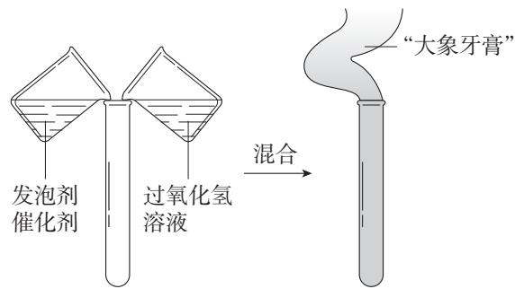

A. 产生的泡沫可用于灭火 

B. 过氧化氢分解生成水和氧气 

C. 没有催化剂, 过氧化氢不会分解 

D. 反应前后, 催化剂的化学性质不同 

5. 实验室某无色液体含有物质 A, 为了探究其成分, 实验小组进行了如下实验: ①用试管取适量该液体, 向其中加入少量黑色粉末 B, 在常温下能迅速产生无色气体 C, 而 B 的质量在反应前后没有改变; ②将产生的气体 C 收集起来, 把燃着的红磷置于盛有 C 的集气瓶中, 红磷剧烈燃烧; ③把燃着的硫置于盛有 C 的集气瓶中, 硫剧烈燃烧, 生成了一种有刺激性气味的气体 D。请回答下列问题。 

(1) 写出各物质的名称: A_、B_、C_、D_。 

(2) 请用文字表示上述实验中发生的化学反应, 并写出反应的类型 (化合反应或分解反应)。 

6. 某实验小组探究红砖粉末能否作为过氧化氢分解反应的催化剂，设计了如下实验并进行探究。请回答下列问题。 

<table><tr><td>实验步骤</td><td>现象</td><td>结论</td></tr><tr><td>①将带有火星的木条插入盛有过氧 化氢溶液的试管</td><td>木条不复燃</td><td>常温下过氧化氢分解得很 慢或不分解</td></tr><tr><td>②向上述试管中加入0.2g红砖粉 末,然后将带有火星的木条插入试管</td><td>木条复燃</td><td>红砖粉末是过氧化氢分解 反应的催化剂</td></tr><tr><td>③待上述试管中的反应停止时,重 新加入过氧化氢溶液,并把带有火星 的木条插入试管</td><td>木条复燃</td><td>在化学反应前后,红砖粉 末的质量没有改变,进一步 说明红砖粉末是催化剂</td></tr></table>

（1）请判断上述各步实验设计和结论是否合理，并说明理由。 

(2) 如果要证明红砖粉末是过氧化氢分解反应的催化剂, 还需要增加一个实验: 将上述实验后的剩余固体分离、洗净、干燥后称量。如果 , 则说明红砖粉末是过氧化氢分解反应的催化剂。 

# 实验活动1 氧气的实验室制取与性质

# 【实验目的】

1. 学习实验室制取氧气的方法。 

2. 加深对氧气性质的认识。 

# 【实验用品】

试管、集气瓶、水槽、单孔橡胶塞、乳胶管、玻璃导管、铁架台（带铁夹）、升降台、酒精灯、玻璃片、坩埚钳、棉花、火柴。 

高锰酸钾、木炭、澄清石灰水、细铁丝。 

# 【实验步骤】

# 1. 制取氧气

(1) 仔细观察图2-18所示的装置, 其中使用了哪些仪器? 哪部分是气体发生装置? 哪部分是气体收集装置? 为什么可以用排水法收集氧气? 

（2）用带有导管的橡胶塞塞紧试管，检查装置的气密性。确认装置不漏气后，拔出橡胶塞，在试管中加入少量高锰酸钾，并在试管口放一团棉花。用带有导管的橡胶塞塞紧管口，把试管口略向下倾斜①固定在铁架台上（如图2-18）。 

(3) 将两个集气瓶分别盛满水, 用玻璃片②先盖住瓶口的一小部分, 然后推动玻璃片将瓶口全部盖住, 把盛满水的集气瓶连同玻璃片一起倒立在盛水的水槽内。 

（4）加热试管。先使酒精灯火焰在试管下方来回移动，让试管均匀受热，然后对高锰酸钾所在的部位加热。 

导管口开始有气泡放出时，不宜立即收集。当气泡连续并比较均匀地放出时，再把导管口伸入盛满水的集气瓶。待集气瓶里的水排完以后，在水面下用玻璃片盖住瓶口。小心地把集气瓶移出水槽，正放在实验台上。用同样的方法再收集一瓶氧气（瓶中留少量水）。 

（5）停止加热时，先要把导管移出水面，然后再熄灭酒精灯。 

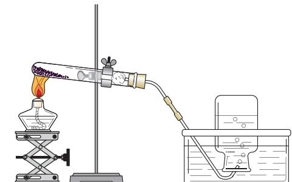

图2-18 高锰酸钾分解制取氧气的装置

# 想一想

为什么刚开始有气泡放出时不立即收集？ 

# 提示

如果先熄灭酒精灯，水槽中的水可能会倒吸入试管，使试管因骤然冷却而炸裂。 

# 2. 氧气的性质

(1) 如图2-19所示, 用坩埚钳夹取一小块木炭, 在酒精灯火焰上加热到发红, 插入以上实验收集的氧气中（由瓶口向下缓慢插入）, 观察木炭在氧气中燃烧的现象。燃烧停止后, 取出坩埚钳, 向集气瓶中加入少量澄清石灰水, 振荡, 观察现象。 

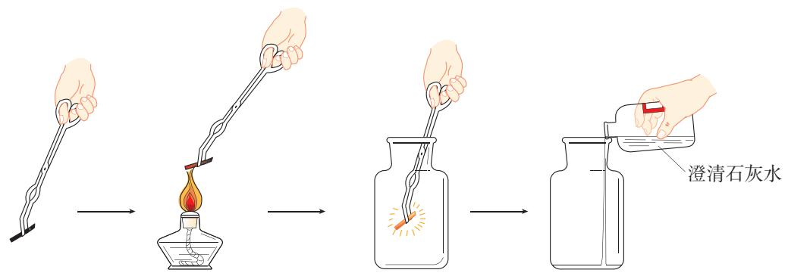

图2-19 木炭在氧气中燃烧实验示意图

(2) 点燃系在螺旋状细铁丝底端的火柴, 待火柴快燃尽时, 插入盛有氧气的集气瓶中 (瓶中预留少量水, 如图 2-20)。观察铁丝在氧气中燃烧的现象。 

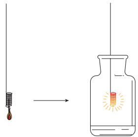

图2-20 铁丝在氧气中燃烧实验示意图

# 【问题与交流】

1. 检查装置的气密性时，除了用手紧握的方法，还可以用什么方法？ 

2. 如果某同学制得的氧气不纯，你认为可能的原因有哪些。 

3. 把红热的木炭插入盛有氧气的集气瓶时，为什么要由瓶口向下缓慢插入？ 

# 跨学科实践活动1

# 微型空气质量“检测站”的组装与使用

空气质量检测一般通过检测空气中主要污染物的含量来评价空气质量。我们可以通过组装与使用微型空气质量“检测站”来获取相关数据，从而了解空气质量状况。 

# 【活动目标】

结合物理、信息技术和工程等相关知识，组装一个微型空气质量“检测站”，并检测空气质量。通过实践活动，体会科学、技术、社会的相互关系。 

# 【活动设计与实施】

# 任务一 认识空气质量检测的意义

1. 空气中某些成分的含量过高就会造成污染。请查阅资料，了解空气的主要污染物，以及空气污染对人体健康和农作物生长的影响。 

2. 对空气质量进行检测，能使人们及时掌握空气质量状况，以便空气被污染时能及时采取应对措施。请结合实例说明我国为防治空气污染所采取的一些具体措施。 

# 任务二 参观与访谈

1. 参观本地环境保护部门的空气质量监测站，了解监测站安装了哪些仪器，监测哪些数据，以及相关数据是如何处理的。 

2. 与本地环境保护部门的工作人员进行交流，了解本地空气主要污染物 

的种类，以及空气质量受风向、风速、温度、降水量、湿度等因素的影响情况。 

# 任务三 微型空气质量“检测站”的组装

1. 借鉴监测站检测空气质量的思路，可以使用传感器组装简易装置对空气中的主要污染物进行检测。请结合本地空气污染的特征，选择你所需要的传感器（如 $\mathrm{SO}_2$ 传感器、 $\mathrm{PM}_{2.5}$ 传感器等）。 

2. 当同时检测空气中多种成分的含量时，研究传感器、数据采集器和计算机是如何连接的，并设计组装方案。 

3. 在教师的指导下，根据组装方案，把所需用品按要求进行组装，并在计算机上安装相应软件进行测试。 

# 任务四 微型空气质量“检测站”的使用

1. 组装好“检测站”后，选择不同地点，检测并记录相关数据。 

2. 根据检测结果，对空气质量进行分析和评价。 

# 【展示与交流】

1. 展示自己组装的微型空气质量“检测站”，与同学交流组装方法、使用说明及检测结果等，并相互评价。 

2. 在组装的“检测站”中，你使用什么设备来处理和显示检测数据？与同学交流使用不同设备的利弊。 

# 第三单元

# 物质构成的奥秘

- 分子和原子 

$\bullet$ 原子结构 

- 元素 

当我们对身边的物质有了一些认识和经验后，会对它们性质和变化的根源心生好奇。世上万物由什么构成？这是人类自古以来不断探索的问题。 

科学家运用实验、推理、假说和模型等方法不断探索物质构成的奥秘，开启了通往微观世界的大门，逐步形成了用元素与原子、分子的观点认识物质组成与结构、性质与变化的思路和方法。 

碳纳米管的结构示意图 

# 课题1

# 分子和原子

生活经验告诉我们，蔗糖可分成细小颗粒。试想，当它分到人的眼睛无法直接分辨时会得到什么？又以什么形式存在呢？ 

# 一、物质由微观粒子构成

走过花圃会闻到花香；湿的衣服经过晾晒会变干；蔗糖放到水里会逐渐“消失”，而水却有了甜味。 

让我们再观察下面的实验现象。 

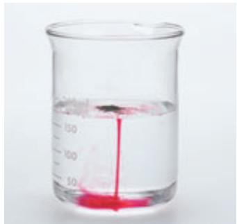

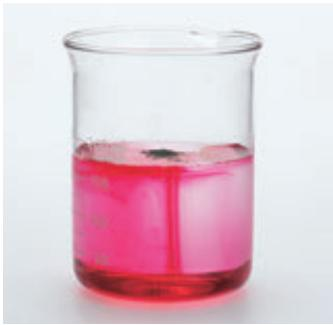

图3-1 品红在水中扩散

# 【实验3-1】

向盛有水的烧杯中加入少量品红，静置，观察现象。 

实验表明，品红在静置的水中会扩散（如图3-1）。 

上述生活和实验中的现象，在很久以前就引起了一些学者的探究兴趣。为了解释这类现象，他们提出物质由看不见的微小粒子构成的设想。 

科学技术的进步，证明了物质是由分子、原子等微观粒子构成的。现在我们通过先进的科学仪器不仅能够观察到一些分子和原子（如图3-2），还能移动原子（如图3-3）。 

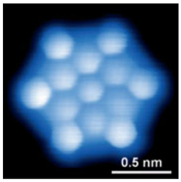

I

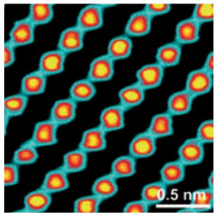

II

图3-2 用扫描隧道显微镜获得的某种有机物分子（I）和银原子（Ⅱ）的图像①

分子的质量和体积通常都很小。例如，1个水分子的质量约是 $3\times 10^{-26}\mathrm{kg}$ ，1滴水（以20滴水为 $1\mathrm{mL}$ 计）中大约有 $1.67\times 10^{21}$ 个水分子。如果10亿人来数1滴水里的水分子，每人每分钟数100个，日夜不停，需要3万多年才能数完。 

微观粒子（如分子）总是在不断运动着。花香在空气中的扩散、湿衣服中的水在晾晒时的挥发、蔗糖在水中的溶解及品红在水中的扩散都是分子运动的结果。在实验3-1中，如果使用的是热水，品红的扩散会更快一些。这是因为在受热的情况下，分子能量增大，运动加快。 

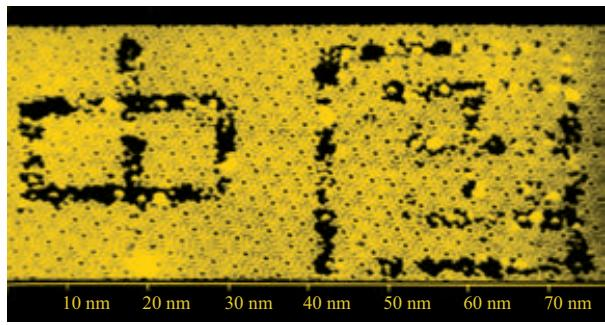

图3-3 通过移走硅原子形成的文字

# 探究
# 分子运动现象

# 【问题】

怎样才能认识分子运动呢？ 

# 【信息】

氨（ $\mathrm{NH}_3$ ）易溶于水，能使无色的酚酞溶液变成红色。 

# 【实验】

(1) 向盛有 $20 \mathrm{~mL}$ 蒸馏水的小烧杯 A 中滴入 5~6 滴酚酞溶液, 搅拌均匀, 观察溶液的颜色。 

(2) 从烧杯A中取少量溶液置于试管中, 向其中慢慢滴加浓氨水, 观察溶液颜色的变化。 

(3) 另取一个小烧杯B, 加入 $5 \mathrm{~mL}$ 浓氨水。用一个大烧杯罩住烧杯A和烧杯B（如图3-4）。观察几分钟, 有什么现象发生? 

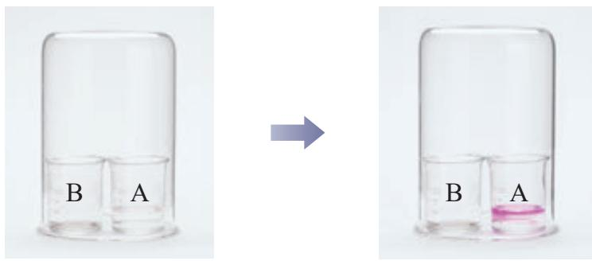

图3-4 分子运动现象的实验

<table><tr><td>实验编号</td><td>现象</td><td>分析</td></tr><tr><td>(1)</td><td></td><td></td></tr><tr><td>(2)</td><td></td><td></td></tr><tr><td>(3)</td><td></td><td></td></tr></table>

# 【分析与结论】

(1) 你能解释上述实验现象吗? 请与同学交流看法, 并将你的分析填入上表。 

(2）结论： 

我们知道气体可压缩储存于钢瓶中，这是因为分子之间有间隔，在受压的情况下分子间的间隔减小，加压、降温可以使气体液化。相同质量的同种物质在固态、液态和气态时的体积不同，表明其分子间的间隔不同。物体的热胀冷缩现象是因为物质分子间的间隔受热时增大，遇冷时缩小。 

# 二、分子可以分为原子

由分子构成的物质在发生物理变化时，分子本身没有发生变化。例如，水在蒸发时，它只是由液态变成了气态，而水分子没有变成其他分子，它的化学性质也没有改变。当品红溶于水时，品红分子和水分子都没有变成其他分子，它们的化学性质也各自保持不变。 

由分子构成的物质在发生化学变化时，一种物质的分子就会变成其他物质的分子。例如，我们在实验室用过氧化氢（ $\mathrm{H}_2\mathrm{O}_2$ ）制取氧气（ $\mathrm{O}_2$ ）时，过氧化氢分子就变成了与其化学性质不同的水分子（ $\mathrm{H}_2\mathrm{O}$ ）和氧分子。又如，氢气（ $\mathrm{H}_2$ ）在氯气（ $\mathrm{Cl}_2$ ）中燃烧时，氢分子和氯分子都发生了变化，生成了氯化氢分子（ $\mathrm{HCl}$ ），氢气和氯气的化学性质不再保持。可见，由分子构成的物质，分子是保持其化学性质的最小粒子。 

分子 molecule 原子 atom 

分子是由原子构成的。有些分子由同种原子构成，如1个氧分子是由2个氧原子构成的，1个氢分子是由2个氢原子构成的；大多数分子由两种或两种以上原子构成，如1个二氧化碳分子是由1个碳原子和2个氧原子构成的，1个氨分子是由1个氮原子和3个氢原子构成的（如图3-5）。 

氧分子 $\left(\mathrm{O}_{2}\right)$

氢分子 $\left(\mathrm{H}_{2}\right)$

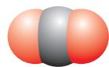

二氧化碳分子 $\mathrm{CO}_{2}$

氨分子 $\left(\mathrm{NH}_{3}\right)$

图3-5 几种分子的模型

在化学变化中，分子可以分为原子，原子又可以结合成新的分子。例如，用过氧化氢制取氧气时，过氧化氢分子分解，生成水分子和氧分子。又如，加热红色的氧化汞粉末时，氧化汞分子会分解成氧原子和汞原子，每2个氧原子结合成1个氧分子，许多汞原子聚集成金属汞（如图3-6）。可见，在化学变化中，分子的种类可以发生变化，而原子的种类不会发生变化。因此，原子是化学变化中的最小粒子。 

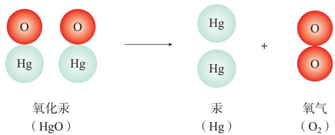

图3-6 氧化汞分子分解示意图

# 思考与讨论

氢气在氯气中燃烧生成氯化氢（如图3-7）。试分析在该反应中分子和原子的变化情况。 

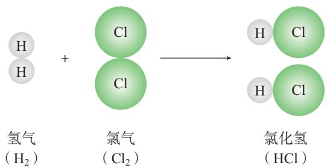

图3-7 氢气与氯气反应的示意图

# 科学·技术·社会

# 分子探针

分子探针是一类特殊的分子，它们既能与人体组织中的特定分子（靶分子）结合而对其进行标记，又能被检测设备识别定位。追踪靶分子可以获得疾病发生原因的相关信息，从而为精准医疗和药物研究等提供分子 

层次的科学依据。例如，一种能释放正电子的分子探针在癌症的PET/CT（正电子发射体层成像/计算机体层成像）诊断中发挥了重要作用。分子探针已成为医学和药学研究的热点和前沿领域。 

# 科学史话

# 原子的猜想与证实

1808年，道尔顿在《化学哲学的新体系》一书中论述了原子论的观点，这在化学发展史上具有里程碑意义。 

道尔顿提出的原子论观点主要有： 

（1）物质是由看不见的原子构成的，原子是不可分割的，在化学变化中其本性保持不变； 

（2）同种原子的形状、质量和性质都是相同的，不同种原子的形状、质量和性质是不同的； 

(3) 在化学变化中, 不同原子以简单整数比相互结合, 结合物的质量等于所含原子的质量之和。 

化学史研究表明，古代关于原子的猜想在近代被大量实验所证实，其间凝结了许多人的辛勤劳动和智慧。 

墨子（约前468—前376，我国古代哲学家）提出了“端”的观点，认为不断分割物质，直到无法再分时便得到“端”。 

德谟克利特（Democritus，约前460—前370，古希腊哲学家）认为宇宙间万物是由微小、坚硬、不可分的“原子（atom）”构成的。“atom”一词中，“a-”是表示否定的前缀，“-tom”表示“分割”，整体表示“不可分割”的意思。 

波义耳（R.Boyle，1627—1691，英国化学家）认为科学上不存在凭空的假说，必须以实验和观察为基础。他在《怀疑派化学家》一书中，提出应该把化学看作一门独立的科学。他赞同物质是由粒子构成的观点，并将化学变化中不能分解的物质叫作“元素”。 

拉瓦锡通过大量的定量实验，发现了在化学反应前后，参加反应的各物质的质量等于生成物的质量。这被称为质量守恒定律或物质不灭定律。 

普鲁斯特（J.-L.Proust，1754—1826，法国化学家）提出假说，认为每一种物质都有固定的组成，不管这种物质是天然的还是人造的，组成该物质的各种元素的质量比都是相同的。该定律被称为定比定律或定组成定律。 

里希特（J.B.Richter，1762—1807，德国化学家）等通过对大量酸与碱反应的定量研究，提出一定量的酸与一定量的碱反应的酸碱当量定律。 

道尔顿提出：若甲、乙两种原子能相互化合生成几种不同的化合物，则在这些化合物中，与一定质量甲化合的乙的质量互成简单整数比。这就是倍比定律。例如：碳与氧可形成两种物质，一种物质中，1份碳结合约1.33份氧；另一种物质中，1份碳结合约2.67份氧；这两种物质中氧的质量比为 $1:2$ 。 

# 学完本课题你知道了什么

1. 物质由分子、原子等微观粒子构成，这些微观粒子总在不停地运动。 

2. 在物理变化中, 分子不会变成其他分子; 在化学变化中, 分子会变成其他分子。构成物质的分子是保持该物质化学性质的最小粒子。 

3. 在化学变化中，分子可以分为原子，原子又可以结合成新的分子。 

4. 在化学变化中，原子不能再分，它是化学变化中的最小粒子。 

# 练习与应用

1. 下列关于空气及其成分的说法中，正确的是（ ）。 

A. 空气是由空气分子构成的 

B. 空气里氮气、氧气等分子均匀地混合在一起 

C. 氮气和氧气混合后, 其化学性质都发生改变 

D. 空气经过液化、汽化等过程得到氮气和氧气, 发生了化学变化 

2. 木炭在氧气中燃烧生成二氧化碳的示意图如下。下列有关叙述中, 不正确的是 ( )。 

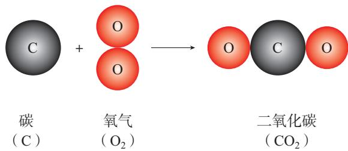

A. 该反应属于化合反应 

B. 反应前后原子种类发生了变化 

C. 二氧化碳与氧气、碳的化学性质不同 

D. 该反应是木炭在空气中燃烧时发生的主要反应 

3. 参照示例填写下列过程发生的变化及判断依据。 

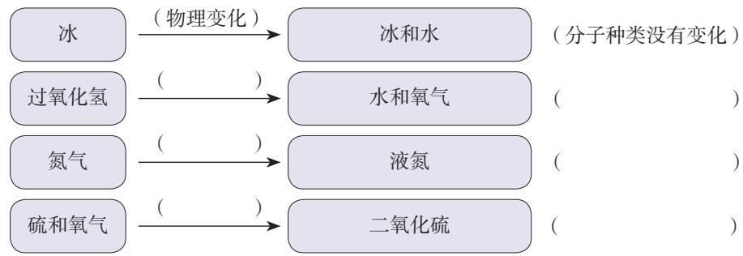

4. 以下示意图描述了两种物质的变化过程，请回答下列问题。 

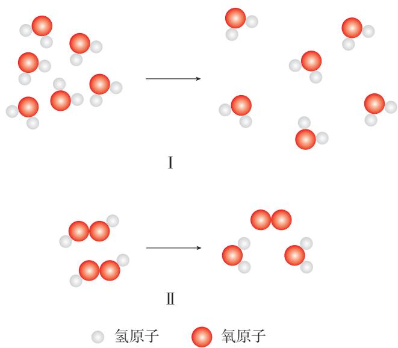

(1) 图 I 所示过程属于____（填“物理”或“化学”）变化，是因为其中的________（填“分子”或“原子”）种类________（填“有”或“无”）变化。 

(2) 图Ⅱ所示过程属于____（填“物理”或“化学”）变化，是因为其中的____（填“分子”或“原子”）种类____（填“有”或“无”）变化。 

5. 从分子及其运动的角度分析并解释下列现象。 

（1）香水要密封保存。 

（2）加油站严禁烟火。 

（3）热水能使压瘪的乒乓球复原。 

（4）氧气在加压后可装入钢瓶 

（5）王安石（宋代）《梅花》诗中“遥知不是雪，为有暗香来”描述的现象。 

# 课题2

# 原子结构

原子的体积很小。如果将一个原子与一个乒乓球相比，就相当于将一个乒乓球与地球相比（如图3-8）。原子能够结合成分子的奥秘，正是人们在研究这小小的原子的结构时被逐步揭示出来的。 

图3-8 原子的体积很小

# 一、原子的构成

科学实验证明，原子是由居其中心的原子核与核外电子构成的（如图3-9）。原子核一般由质子和中子构成。每个质子带1个单位的正电荷，每个电子带1个单位的负电荷，中子不带电荷。 

由于原子核内质子所带正电荷与核外电子所带负电荷数量相等、电性相反，所以原子不显电性。可见，原子核所带的正电荷数（核电荷数）等于核内质子数，也等于核外电子数（如表3-1）。 

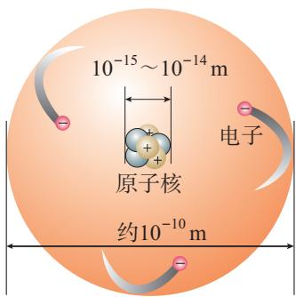

图3-9 原子的构成示意图

表3-1 几种原子的构成

<table><tr><td>原子种类</td><td>质子数</td><td>中子数</td><td>核外电子数</td></tr><tr><td>氢</td><td>1</td><td>0</td><td>1</td></tr><tr><td>碳</td><td>6</td><td>6</td><td>6</td></tr><tr><td>氧</td><td>8</td><td>8</td><td>8</td></tr><tr><td>钠</td><td>11</td><td>12</td><td>11</td></tr><tr><td>氯</td><td>17</td><td>18</td><td>17</td></tr></table>

电子 electron 

质子 proton 

中子 neutron 

图3-10 核外电子分层排布示意图

图3-11 氧原子的结构示意图

# 二、原子核外电子的排布

与原子相比，原子核的体积更小，如果把原子比作一个体育场，那么原子核只相当于体育场中的一只蚂蚁。因此，原子核外有很大的空间，电子就在这个空间里不停地运动着。 

科学研究表明，在含有多个电子的原子中，核外电子具有不同的运动状态，离核近的电子能量较低，离核越远，电子的能量越高。离核最近的电子层为第一层，次之为第二层，依次类推为第三、四、五、六、七层，离核最远的也叫最外层。核外电子的分层排布如图3-10所示。已知原子核外电子最少的只有1层，最多的有7层，最外层电子数一般不超过8个（只有1层的，电子数不超过2个）。 

用原子结构示意图可简明、方便地表示原子核外电子的排布（如图3-11）。 

# 资料卡片

# 部分原子的结构示意图

氢（H） 

氦（He） 

锂（Li） 

氛（Ne） 

钠（Na） 

氩（Ar） 

铍（Be） 

硼（B） 

碳（C） 

氮（N） 

氧（0） 

氟（F） 

氛（Ne） 

………… 

氦、氖、氩等稀有气体不易与其他物质发生反应，化学性质比较稳定。它们的原子最外层一般都有8个电子（氦有2个电子），这样的结构被认为是一种相对稳定的结构。钠、镁、铝等金属的原子最外层电子一般都少于4个，在化学反应中易失去电子；氯、氧、硫、磷等非金属的原子最外层电子一般都多于4个，在化学反应中易得到电子；它们都趋向于达到相对稳定的结构。金属、非金属的化学性质与其原子的核外电子排布，特别是最外层电子的数目有关。 

以钠与氯气的反应为例。钠原子的最外层有1个电子，氯原子的最外层有7个电子。当钠与氯气反应时，钠原子最外层的1个电子转移到氯原子的最外层，使两者都形成相对稳定的结构（如图3-12）。 

图3-12 钠与氯气反应生成氯化钠的示意图

离子 ion 

在上述过程中，钠原子因失去1个电子而带上1个单位的正电荷，氯原子因得到1个电子而带上1个单位的负电荷。这种带电荷的原子叫作离子。带正电荷的原子叫作阳离子，如钠离子（ $\mathrm{Na}^{+}$ ）①；带负电荷的原子叫作阴离子，如氯离子（ $\mathrm{Cl}^{-}$ ）。带相反电荷的钠离子与氯离子相互作用就形成了氯化钠。可见，离子也是构成物质的微观粒子。 

图3-13 相对质量示意图

表3-2 构成原子的粒子的质量

<table><tr><td>粒子种类</td><td>质量</td></tr><tr><td>质子</td><td>1.672 6×10-27kg</td></tr><tr><td>中子</td><td>1.674 9×10-27kg</td></tr><tr><td>电子</td><td>质子质量的 1/1836</td></tr></table>

# 三、相对原子质量

原子的质量很小。例如，1个氢原子的质量约为 $1.67 \times 10^{-27} \mathrm{~kg}$ ，1个氧原子的质量约为 $2.66 \times 10^{-26} \mathrm{~kg}$ 。由于原子质量的数值太小，书写和使用都不方便，所以国际上一致同意采用相对质量（如图3-13）。以一种碳原子①质量的 $\frac{1}{12}$ 为标准，其他原子的质量与它相比，得到相对原子质量（符号为 $A_{\mathrm{r}}$ ）。根据这个标准，氢的相对原子质量约为1，氧的相对原子质量约为16。 

如表3-2所示，构成原子的质子、中子的相对质量都约等于1；与质子、中子相比，电子的质量很小，整个原子的质量主要集中在原子核上。 

在一般的化学计算中，多采用相对原子质量的近似值（如表3-3）。相对原子质量可从书后附录Ⅱ中查到。 

# 资料卡片

# 张青莲与相对原子质量的测定

中国科学院院士张青莲教授（如图3-14）为相对原子质量的测定作出了卓越贡献。他于1983年当选为国际纯粹与应用化学联合会原子量与同位素丰度委员会委员。他主持测定的铟、铱、锑、铕、铈、铒、锗、镝、锌的相对原子质量数据被确认为国际标准。 

图3-14 张青莲（1908—2006）

# 方法导引

# 模型

氢分子、氧原子等的模型可以将微观粒子直观、生动地呈现在我们面前。构建和利用模型认识物质及其变化规律是一种常用的科学方法。 

模型是对原型的模拟，构建模型应以客观事实为依据，符合科学原理，通过类比、简化和抽象等方法突出原型的主要特征。化学中常用的模型主要有实物模型、理论模型和符号模型等。利用这些模型能帮助我们描述、解释和预测物质及其变化。随着人们对原型认识的不断深入，模型也会发生改变。 

# 科学史话

# 原子模型的演变

原子模型的演变反映了人类探索物质结构的漫长历程。 

# （1）道尔顿原子模型

我国古代哲学家提出了“端”的观点。古希腊哲学家也提出了意义相近的“原子”的概念。1808年，道尔顿在古代原子观点和科学实验的基础上系统地提出了原子论。上述“端”和“原子”可被认为是原子的“实心球模型”（如图3-15）。 

# （2）汤姆孙原子模型

19世纪末，英国物理学家汤姆孙（J.J.Thomson, 1856—1940）通过一系列实验发现了电子。在此基础上，他提出了一种原子模型，认为正电荷均匀分布在整个原子内，带负电荷的电子镶嵌其中（如图3-16）。 

图3-15 道尔顿原子模型示意图

图3-16 汤姆孙原子模型示意图

（3）卢瑟福原子模型 

1909年，英国物理学家卢瑟福（E.Rutherford, 1871—1937）进行了 $\alpha$ 粒子散射实验。1911年，他提出了原子的“核式结构模型”：原子中带正电荷部分的体积很小，但几乎占有全部质量，电子在原子核外运动（如图3-17）。 

直到19世纪末，人们都认为原子是不可再分的。电子、质子和中子的发现，使人们对物质结构的认识深入原子内部，意识到原子仍然具有一定的结构。 

图3-17 卢瑟福原子模型示意图

# 学完本课题你知道了什么

1. 原子的构成 

核外电子 每个电子带1个单位负电荷原子 原子核 质子 每个质子带1个单位正电荷中子 不带电荷 

在原子中，核电荷数 $=$ 质子数 $=$ 核外电子数。 

2. 原子中的核外电子是分层排布的，可以用原子结构示意图表示。 

3. 构成物质的微观粒子除了原子、分子，还有离子。带电荷的原子叫作离子。 

4. 以一种碳原子质量的 $\frac{1}{12}$ 为标准, 其他原子的质量与它相比, 得到相对原子质量。 

# 练习与应用

1. 下列各组微观粒子中，可以构成原子核的是（ ）。 

A. 质子和电子 

B. 质子和中子 

C. 电子和中子 

D. 质子、中子和电子 

# 人民教育出版社

2. 原子的质子数等于（ ）。 

A. 中子数 

B. 核外电子数 

C. 中子数和核外电子数之和 

D. 中子数和核外电子数之差 

3. 下列选项中，表示氧原子结构示意图的是（ ）。 

A. $(+7)25$ 

B. $(+7)28$ 

C. $(+8)26$ 

D. (8)(2)(8) 

4. 下列微观粒子中，其核电荷数小于核外电子数的是（ ）。 

A. 氯原子 

B. 氯离子 

C. 钠原子 

D. 钠离子 

5. 碳的相对原子质量是（ ）。 

A. $12 \mathrm{~g}$ 

B. 12 

C. $1.6605 \times 10^{-27} \mathrm{~kg}$ 

D. $\frac{1}{12} g$ 

6. 物质一般是由分子、原子或离子等微观粒子构成的。例如, 构成水的是 , 构成汞的是 , 构成氯化钠的是 和 

7. 右图所示某原子的核电荷数为 , 核外有 个电子层,第二层上有 个电子, 最外层上有 个电子。 

8. 填写下表中的空格。 

<table><tr><td>原子种类</td><td>核电荷数</td><td>质子数</td><td>中子数</td><td>核外电子数</td></tr><tr><td>氧</td><td>8</td><td></td><td>8</td><td></td></tr><tr><td>硫</td><td></td><td>16</td><td>16</td><td></td></tr><tr><td>镁</td><td></td><td></td><td>12</td><td>12</td></tr></table>

9. 从附录 II 中查出钠、镁、铝的相对原子质量（保留一位小数）。根据所查数据，比较相同质量的钠、镁、铝三种金属，哪一种所含的原子个数最多，哪一种所含的原子个数最少？为什么？ 

10. 已知碳-12原子的质量约为 $1.993 \times 10^{-26} \mathrm{~kg}$ ，一种铁原子的质量约为 $9.288 \times 10^{-26} \mathrm{~kg}$ 。计算这种铁原子的相对原子质量（计算结果保留一位小数）。 

# 课题3

# 元素

世上万物是由什么组成的？人们在认识了原子和原子结构之后，对组成万物的基本成分有了进一步的理解。 

图3-18 蛋壳、贝壳和石灰石的主要成分都是碳酸钙

# 一、元素

人们利用化学方法分析众多的物质，发现组成它们的基本成分——元素其实只有一百多种，就像可拼写出数十万个英文单词的字母只有26个一样。例如，蛋壳、贝壳和石灰石的主要成分都是碳酸钙（ $\mathrm{CaCO}_3$ ，如图3-18），而碳酸钙是由碳、氧、钙这三种元素组成的。又如，氧气（ $\mathrm{O}_2$ ）和二氧化碳（ $\mathrm{CO}_2$ ）的组成和性质不同，但它们都含有氧元素。 

氧分子和二氧化碳分子中都含有氧原子，这些氧原子的原子核内都含有8个质子，即核电荷数为8。化学上将质子数（即核电荷数）为8的所有氧原子统称为氧元素。同样，将质子数为1的所有氢原子统称为氢元素，将质子数为6的所有碳原子统称为碳元素。可见，元素是质子数（即核电荷数）相同的一类原子的总称。 

元素 element 

各种元素在地壳中的含量如图3-19所示，其中含量最高的是氧元素，它的质量分数接近 $50\%$ ，其次是硅元素。在地壳中含量较低的碳、氢、氮等元素，对动植物的生命活动有着重要作用。 

由一百多种元素组成的上亿种物质都是由原子、分子或离子构成的（如图3-20）。当物质发生化学变化时，原子的种类不变，元素也不会改变。 

图3-19 地壳中的元素含量（质量分数）

图3-20 多种多样的物质及其组成

# 思考与讨论

在下列化学反应中，反应物与生成物相比较，分子是否发生了变化？原子是否发生了变化？元素是否发生了变化？ 

硫 $+$ 氧气 点燃 $\rightarrow$ 二氧化硫（S） $(\mathrm{O}_2)$ （SO2） 

过氧化氢 二氧化锰 $\rightarrow$ 水 $+$ 氧气 $(\mathrm{H}_2\mathrm{O}_2)$ （20 $(\mathrm{H}_2\mathrm{O})(\mathrm{O}_2)$ 

# 二、元素符号

如果用文字、图形来表示一百多种元素及其组成的上亿种物质将十分麻烦。 

元素符号 atomic symbol 

国际上统一采用元素拉丁文名称的第一个字母（大写）来表示元素，如氢元素的符号为H，氧元素的符号为O；如果几种元素拉丁文名称的第一个字母相同，就附加一个小写字母来区别，如用Cl表示氯元素，Ca表示钙元素，Cu表示铜元素（如表3-3）。书写元素符号时应注意，由两个字母表示的元素符号，第二个字母必须小写。 

元素符号表示一种元素，还表示这种元素的一个原子。例如，元素符号O既表示氧元素，又表示氧元素的一个原子。 

表3-3 一些常见元素的名称、元素符号和相对原子质量（近似值）

<table><tr><td>元素名称</td><td>元素符号</td><td>相对原子质量</td><td>元素名称</td><td>元素符号</td><td>相对原子质量</td><td>元素名称</td><td>元素符号</td><td>相对原子质量</td></tr><tr><td>氢</td><td>H</td><td>1</td><td>镁</td><td>Mg</td><td>24</td><td>镍</td><td>Ni</td><td>59</td></tr><tr><td>氦</td><td>He</td><td>4</td><td>铝</td><td>Al</td><td>27</td><td>铜</td><td>Cu</td><td>63.5</td></tr><tr><td>锂</td><td>Li</td><td>7</td><td>硅</td><td>Si</td><td>28</td><td>锌</td><td>Zn</td><td>65</td></tr><tr><td>铍</td><td>Be</td><td>9</td><td>磷</td><td>P</td><td>31</td><td>银</td><td>Ag</td><td>108</td></tr><tr><td>硼</td><td>B</td><td>11</td><td>硫</td><td>S</td><td>32</td><td>锡</td><td>Sn</td><td>119</td></tr><tr><td>碳</td><td>C</td><td>12</td><td>氯</td><td>Cl</td><td>35.5</td><td>碘</td><td>I</td><td>127</td></tr><tr><td>氮</td><td>N</td><td>14</td><td>氩</td><td>Ar</td><td>40</td><td>钡</td><td>Ba</td><td>137</td></tr><tr><td>氧</td><td>O</td><td>16</td><td>钾</td><td>K</td><td>39</td><td>铂</td><td>Pt</td><td>195</td></tr><tr><td>氟</td><td>F</td><td>19</td><td>钙</td><td>Ca</td><td>40</td><td>金</td><td>Au</td><td>197</td></tr><tr><td>氖</td><td>Ne</td><td>20</td><td>锰</td><td>Mn</td><td>55</td><td>汞</td><td>Hg</td><td>201</td></tr><tr><td>钠</td><td>Na</td><td>23</td><td>铁</td><td>Fe</td><td>56</td><td>铅</td><td>Pb</td><td>207</td></tr></table>

# 资料卡片

# 元素符号和元素中文名称的由来

在古代，人们常用象形、会意等符号表示不同物质。道尔顿曾用图形加字母表示不同原子（如图3-21）。这种符号在表示物质组成时显得复杂，记忆和书写也不方便，后来被用字母表示的元素符号所替代。 

图3-21 道尔顿的元素符号

一种元素的中文名称只用一个字表示，除了我国自古以来就使用的金、银、铜、铁、锡、硫等，其余多为近代以来新造的。在我国近代化学启蒙者徐寿（如图3-22）与他人合译的《化学鉴原》中，许多元素的中文名称，如钠、铝、钾、钙、锌等沿用至今。元素名称用字有规律，从偏旁就可以知道它们属于哪一类元素：有金字旁的是金属元素，有石字旁的是固态非金属元素，有气字头的是气态非金属元素或稀有气体元素，有三点水的是液态非金属元素。只有金属元素汞例外，通常状况下它是液态。 

图3-22 徐寿（1818—1884）

# 三、元素周期表简介

超级市场里有成百上千种商品，为了便于顾客选购，必须分门别类，有序摆放（如图3-23）。我们周围的物质世界是由一百多种元素组成的，为了便于研究元素的性质和用途，也需要寻求它们之间的内在规律。为此，科学家们根据元素的原子结构和性质，把它们科学有序地排列起来，这样就得到了元素周期表（见本书插页）。 

元素周期表共有7个横行，18个纵列。每一个横行叫作一个周期，每一个纵列叫作一个族（8，9，10三个纵列共同组成一个族）。 

为了便于查找，元素周期表按元素原子核电荷数递增的顺序给元素编了号，叫作原子序数。原子序数与核电荷数在数值上相同。 

元素周期表对金属元素、非金属元素和稀有气体元素用不同的颜色进行区分，并标上了元素的相对原子质量。 

图3-23 超级市场的商品排列有序

元素周期表 

periodic table of elements 

元素周期表是学习和研究化学的重要工具，它的内容十分丰富。由于我们目前所学的知识不足，尚不能完全掌握，但仍然可以从表中获得许多信息。 

# 思考与讨论

（1）参见图3-19，将其中标明的元素按照一定标准进行分类（如含量的高低、属于金属元素还是属于非金属元素等），并在元素周期表中逐一查询这些元素的有关信息（如它们在元素周期表中的位置、元素符号、相对原子质量，等等）。 

（2）考察一下元素周期表，每周期开头的元素一般是金属元素还是非金属元素？靠近尾部的是金属元素还是非金属元素？结尾都是什么元素？这说明元素周期表中元素排列有什么规律呢？它与“元素周期表”这个名称有没有关系？ 

# 学完本课题你知道了什么

1. 元素是质子数（即核电荷数）相同的一类原子的总称。 

2. 当物质发生化学变化时，原子的种类不变，元素也不会改变。 

3. 每种元素都用一个国际通用的符号来表示。元素符号是学习化学的重要工具。学习化学时, 正确地记忆和书写一些常见的元素符号是必要的。 

4. 元素周期表是学习和研究化学的重要工具。 

# 练习与应用

1. 地壳中含量最高的元素是（ ）。 

A. Si 

B. Fe 

C. Al 

D. O 

2.下列说法中，不正确的是（ ）。 

A. 氯化氢、氯化钠都含有氯元素 

B. 1 个氯化氢分子是由 1 个氢原子和 1 个氯原子构成的 

C. 氯化氢是由氢、氯两种元素组成的 

D. 氯化氢是由氢气和氯气混合而成的 

3. 不同种元素的本质区别是（ ）。 

A. 原子的质子数不同 

B. 原子的中子数不同 

C. 相对原子质量不同 

D. 原子的核外电子数不同 

4. 写出元素名称或元素符号。 

Li ; Na ; Al ; Si ; K 

氮 ； 镁 ； 磷 ； 硫 ； 金 。 

5. 改正下列写错的元素符号。 

氦（he）；铜（CU）；锌（zN）。 

6. 写出下列符号的意义。 

O表示 ；2O表示 

$2\mathrm{Cl}^{-}$ 表示 $\mathrm{Na}^{+}$ 表示 

7. 分析下列各组物质的元素组成，将每组中相同元素的名称、元素符号、原子序数和相对原子质量填入括号内。 

8. 查阅元素周期表，写出原子序数为20、26和53的元素的名称和元素符号。举例说明生活中与它们有关的物质和用途。 

# 整理与提升

# 一、物质的组成与结构

在原子中，核电荷数 $=$ 质子数 $=$ 核外电子数。 

# 二、认识物质组成与结构的思路和方法

运用实验、模型等方法 

# 复习与提高

1. 下列事实中，能证明分子在化学变化中可分的是（ ）。 

A. 蔗糖溶解于水中 

B. 湿衣服晾晒变干 

C. 空气分离得到氧气 

D. 过氧化氢分解得到氧气 

2. 下列物质中，含有氧分子的是（ ）。 

A. 液态空气 

B. 二氧化锰 

C. 四氧化三铁 

D. 二氧化碳 

3. 在化学反应中，原子可能发生变化的是其（ ）。 

A. 质子数 

B. 核外电子数 

C. 中子数 

D. 相对原子质量 

4. 2020年12月17日，我国探月工程嫦娥五号返回器携带着 $1731 \mathrm{~g}$ 月壤样品安全着陆。月壤中含量丰富的氦-3可作为核聚变燃料，其原子核是由2个质子和1个中子构成的，氦-3的原子结构示意图为（）。 

A. $(+2)$ 

B. $(+2)_{3}$ 

C. $(+3)2$ 

D. (3) 21 

5. 我国化学家张青莲教授主持测定的铟（In）元素的相对原子质量被确认为国际标准。铟元素的相对原子质量为115，原子的核电荷数为49，其核外电子数为（）。 

A. 164 

B. 115 

C. 66 

D. 49 

6. 稀土元素是有重要用途的资源。铈元素（Ce）是一种常见的稀土元素，右图为元素周期表中铈元素的信息。下列有关说法中，不正确的是（）。 

A. 镍的原子序数是58 

B. 铈属于非金属元素 

C. 铈原子的质子数为58 

D. 铈的相对原子质量是 140.1 

7. 下图为两种气体发生反应的示意图，其中相同的球表示同一种原子。下列说法中，正确的是（ ）。 

A. 该反应的反应物分子不可分 

B. 该反应的生成物属于混合物 

C. 该反应前后的原子种类没有发生变化 

D. 该反应既不是化合反应也不是分解反应 

8. 氮气 $\left(\mathrm{N}_{2}\right)$ 与氢气 $\left(\mathrm{H}_{2}\right)$ 反应生成氨气 $\left(\mathrm{NH}_{3}\right)$ 的生产过程叫作合成氨。该反应对氮肥生产具有重要意义, 相关研究曾三次获得诺贝尔化学奖。请分别从元素组成和微观粒子构成的角度描述该反应中的物质及其变化。 

# 跨学科实践活动2

# 制作模型并展示科学家探索物质组成与结构的历程

学习和理解“物质的组成与结构”，有助于形成基于元素和分子、原子认识物质及其变化的视角，建立认识物质的宏观视角和微观视角之间的联系。 

# 【活动目标】

通过制作模型和展示科学家的探索历程，进一步认识物质是由微观粒子构成的，进一步体会用元素和分子、原子观点认识物质组成与结构的思路和方法。 

# 【活动设计与实施】

# 任务一 探究构成物质的微观粒子

1. 列举生活中的实例，说明物质是由分子、原子等微观粒子构成的。 

2. 归纳物理、化学等课程对微观粒子运动特点的描述及相关实验的原理，讨论不同学科探究思路和方法的区别与联系。 

3. 探究微观粒子需要观念、知识和方法的继承与创新，离不开科学仪器和实验技术的改进和突破。查阅资料，了解微观粒子基础研究领域的新技术和新方法。 

# 任务二 认识模型在探索物质组成与结构中的作用

1. 化学、物理和生物学等课程中有多种模型体现了物质的组成与结构。请总结这些模型有哪些不同的学科特点。 

2. 通过学习生物学课程，我们知道生物体的结构是有层次的。请结合化学课程“物质的组成与结构”的学习，概括元素、分子、原子（包括原子核、核外 

电子等）与物质的层次关系，尝试用概念图、简图等方式表达你的看法。 

3. 查阅资料，了解道尔顿、汤姆孙和卢瑟福等提出的原子模型，以及科学家认识原子结构的历程。这些资料对你有什么启示？用橡皮泥、绿豆、小米等材料制作上述三种原子模型，并说明实验、推理和假说等科学方法在探索原子结构中的作用。 

# 任务三 以水为例梳理物质组成与结构的认识思路

查阅资料，或在学习“第四单元课题2 水的组成”之后，完成下列任务。 

1. 了解科学家发现水的组成的历程（包含思路和方法），尝试用角色扮演、图示等方式展示。下列线索可供参考：发现氧气、氢气和水的组成的年代及相关科学家的贡献。 

2. 了解分子观点的形成过程及其在近代科学发展中的重要作用。结合这些资料，用纸板、橡皮泥等材料制作有关原子和分子的模型，并展示历史上科学家对氢气与氧气反应生成水的典型观点。 

# 【展示与交流】

1. 展示上述活动中的一些典型案例，与同学交流。 

2. 总结本次活动在知识、方法和观念等方面的收获。拟订一个主题，以报告、论文或图画等形式表达自己的认识和体会，并与同学交流。 

# 第四单元

# 自然界的水

$\bullet$ 水资源及其利用 

水的组成 

- 物质组成的表示 

水和空气、氧气一样，是人类重要的自然资源。如何利用和保护水资源？水是由哪些元素组成的？如何表示水的组成？ 

物质的组成可以用化学式表示。从宏观与微观、定性与定量的角度认识物质的组成，是研究物质及其变化的基础。 

# 课题1

# 水资源及其利用

水是一切生命赖以生存的重要物质基础。生命的孕育和维系离不开水，人类的日常生活和工农业生产也离不开水。你是否思考过，人类该如何更好地利用水资源？自然界的水是如何变成生活用水的？ 

图4-1 地球咸水、淡水的储量比

# 一、人类拥有的水资源

地球表面约 $71\%$ 被海洋覆盖着，海洋是地球上最大的储水库，海水约占地球水储量的 $96.53\%$ （如图4-1）。浩瀚的海洋中不仅繁衍着无数水生生物，还蕴藏着丰富的化学资源。海水中已被发现的化学元素有80多种。水能参与很多化学反应，本身就是一种化学资源。 

地球上水的储量虽然很大，但大部分是含盐量很高的海水，陆地水中也有咸水。淡水只约占地球水储量的 $2.53\%$ ，其中大部分还以冰雪等形式分布在两极、高山和永久冻土层中，难以被人类直接利用。 

我国的水资源总量为 $3.0 \times 10^{12} \mathrm{~m}^{3}$ ，但人均水资源量只有 $2.1 \times 10^{3} \mathrm{~m}^{3}$ ，且地域差距很大（如图4-2）。①一些地区水资源短缺，影响了人民生活和经济发展。 

图4-2 我国各地区人均水资源量（香港、澳门、台湾资料暂缺）

# 思考与讨论

如何将海水变成人们可利用的淡水？查阅资料，了解海水淡化的方法及相关技术，与同学交流。 

# 二、保护水资源

随着社会的发展，一方面人类生产和生活的用水量不断增加，另一方面水体污染也影响了水资源的利用，使本已紧张的水资源更显短缺。 

为了人类社会的可持续发展，我们必须保护水资源，既要合理利用水资源，又要防治水体污染。 

应用新技术、改进工艺和改变用水习惯可以大量节约工农业和生活用水，如工业用水重复使用、采用节水灌溉方式（如图4-3）、推广节水器具等。 

喷灌

滴灌

图4-3 节水灌溉

我国通过修建水库和实施跨流域调水等措施，有效改善了水资源时空分布不均的局面，解决了很多地区严重缺水、水资源随季节变化大等问题，为调配水资源和防洪发挥了重要作用。 

# 科学·技术·社会

# 调水工程

我国是世界上较早建设调水工程的国家，早在2000多年前就建成了都江堰（如图4-4）。这一古代工程至今仍在发挥重要作用，被联合国教科文组织列入《世界遗产名录》。新中国成立后，特别是 

改革开放以来，我国建设了引滦入津、引黄入晋和南水北调（如图4-5）等一大批重大调水工程，有效提高了受水区的供水保障能力，促进了经济发展。 

图4-4 都江堰

图4-5 南水北调

防治水体污染对于保护水资源具有重要意义。水体污染不仅影响工农业生产，破坏水生生态系统，还会直接危害人体健康。因此，必须采取措施预防和治理水体污染，保护和改善水质。应用新技术、新工艺可以减少污染物的产生；对污水进行处理，可以使之符合排放标准。 

污水经物理、化学或生物方法进行分级处理后，可作为工业生产、农业灌溉、园林绿化或景观用水。因此，对污水进行处理（如图4-6）也是合理利用水资源的重要方式，对统筹水资源、水环境、水生态治理，实现水资源的良性循环具有重要作用。 

污水处理流程示意图

位于广东省的全国第一家村级污水处理厂

图4-6 污水处理

# 调查与研究

（1）查阅家庭自来水账单（如图4-7），了解显示的收费项目中阶梯水价的内容与实施的意义。 

（2）调查家庭用水情况，与同学交流各种可行的家庭节水方法。针对自家的实际情况，制订水循环利用方案。 

图4-7 自来水账单

图4-8 黄河壶口瀑布

# 三、水的净化

自然界的河水、湖水、海水等天然水里含有许多杂质，不溶性杂质使其浑浊（如图4-8），可溶性杂质则可能使其有气味或颜色。天然水一般要经自来水厂净化处理才能变成生活用水。 

# 思考与讨论

如图4-9所示的净水过程主要通过哪些步骤除去水中杂质，将天然水变成生活用水？ 

图4-9 自来水厂净水过程示意图

沉降、过滤和吸附是工业生产和化学实验中分离混合物的常用方法。 

# 【实验4-1】

取两个烧杯，各盛大半烧杯浑浊的天然水（湖水或河水等）。向其中一个烧杯中加入3药匙明矾粉末，搅拌溶解后，分置于两个烧杯中，静置，观察现象。 

明矾等物质可以使水中悬浮的杂质较快沉降，使水逐渐澄清。要进一步将难溶物质从水中分离出去，可采用过滤的方法。 

# 【实验4-2】

取一张圆形滤纸，如图4-10所示折好并放入漏斗，使之紧贴漏斗内壁，并使滤纸边缘略低于漏斗口。用少量水润湿滤纸，并使滤纸与漏斗内壁之间不要有气泡。 

图4-10 过滤器的准备

图4-11 过滤操作示意图

如图4- 11所示，放置好漏斗，使漏斗下端管口紧靠烧杯内壁，以使滤液沿烧杯壁流下。取实验4- 1中处理过的一杯液体，沿玻璃棒慢慢向漏斗中倾倒，注意液面始终要低于滤纸的边缘。 

观察并比较未经处理的天然水和进行了不同程度处理的水的清澈程度。 

# 提示

玻璃棒的末端要轻轻地斜靠在三层滤纸的一边。 

# 思考与讨论

(1) 上面的过滤实验中, 有哪些操作关键点? 

（2）你可以利用什么物品代替实验室中的滤纸和漏斗来过滤液体？ 

图4-12 活性炭净水器示意图

如果用具有吸附作用的固体过滤液体，不仅可以滤去其中的不溶性物质，还可以吸附一些溶解的杂质，除去异味。市场上出售的净水器，有些就是利用活性炭来吸附、过滤水中的杂质的（如图4-12）。 

经沉降、过滤和吸附等净化处理后，浑浊的水变澄清了，但仍然不是纯水。水中的不溶性杂质被除去后，仍有一些溶解的杂质存在于水中。例如，有些地区的水很容易使水壶或盛水的器具结水垢，就是因为该地区的水中溶有较多可溶性钙、镁的化合物，在水加热或长久放置时，这些化合物会生成沉淀（水垢）。含有较多可溶性钙、镁化合物的水叫作硬水，不含或含较少可溶性钙、镁化合物的水叫作软水。 

使用硬水会给生活和生产带来许多麻烦。如果用硬水洗涤衣物，既浪费肥皂也洗不净衣物，时间长了还会使衣物变硬。锅炉用水硬度高了十分危 

图4-13 实验室常用的蒸馏装置

险，因为锅炉内结垢后不仅浪费燃料，而且会使锅炉内管道局部过热，易引起管道变形或损坏，严重时还可能引起爆炸。 

实验室用的蒸馏水是净化程度较高的水，可以通过蒸馏自来水制取（如图4-13）。 

# 【实验4-3】

在烧瓶中加入自来水，再加入几粒沸石（或碎瓷片），以防加热时出现暴沸。如图4-14所示连接好装置，使各连接部位严密不漏气。加热烧瓶，注意不要使液体沸腾得太剧烈，以防液体通过导管直接流到试管里。弃去开始馏出的部分液体，收集约 $10 \mathrm{~mL}$ 蒸馏水后，停止加热。 

图4-14 制取蒸馏水的简易装置

# 学完本课题你知道了什么

1. 水是宝贵的自然资源。地球上可利用的淡水资源是有限的，人类必须保护水资源，节约用水，防治水体污染。 

2. 可以通过多种方法净化水，如吸附、沉降、过滤、蒸馏等。 

1. 下列关于过滤操作的叙述中，不正确的是（ ）。 

A. 液面不要低于滤纸的边缘 

B. 滤纸的边缘要略低于漏斗口 

C. 玻璃棒要靠在三层滤纸的一边 

D. 漏斗下端管口要紧靠烧杯内壁 

2. 吸附、沉降、过滤和蒸馏是净化水的常用方法。请回答下列问题。 

（1）明矾可以使悬浮的杂质从水中 ________（填“吸附”“沉降”“过滤”或“蒸馏”）出来。 

(2) 过滤可以除去水中的 ________ (填 “可溶性” 或 “不溶性”) 杂质, 该方法用到的玻璃仪器有 ________ 。 

（3）单一操作净化程度较高的方法是 （填“吸附”“沉降”“过滤”或“蒸馏”）。 

(4) 综合运用沉降、过滤和蒸馏净水效果更好, 其先后顺序是 

3. 在生活中你见过或使用过哪些净化水的方法？与同学交流。 

4. 下图是我国“国家节水标志”。谈谈你对该标志的理解及由此获得的启示。 

5. 收集并分析下列资料中的一种或几种，从卫生和健康的角度对如何正确选择饮用水（自来水、矿泉水、纯净水、蒸馏水……）提出自己的看法或建议。 

（1）GB5749—2022《生活饮用水卫生标准》。 

(2) 市场上供应的各种饮用水（矿泉水、纯净水等）、饮水机的广告宣传品或说明书等。 

（3）有关饮用水卫生和健康的论述。 

（4）不同地区生活用水的水源（地下水、河水等）和水质情况。 

6. 你知道中国水周和世界水日吗？查阅资料，了解它们的由来、具体时间及近三年来的宣传主题。选择一个你感兴趣的主题，尝试绘制宣传海报或撰写小论文。 

# 课题2

# 水的组成

在很长的一段时间内，水被看作一种“元素”。直到18世纪末，人们通过对水的生成和分解实验的研究，才最终认识了水的组成。 

研究氢气的燃烧实验是人们认识水组成的开始。 

氢气是无色、无臭、难溶于水的气体，密度比空气的小。氢气在空气中燃烧时，产生淡蓝色火焰。混有一定量空气或氧气的氢气遇明火会发生爆炸，因此点燃氢气前一定要检验其纯度，方法如图4-15所示。点燃氢气时，发出尖锐爆鸣声表明气体不纯，声音很小则表示气体较纯。 

氢气 hydrogen 

图4-15 检验氢气的纯度

# 【实验4-4】
在带尖嘴的导管口点燃纯净的氢气，在火焰上方罩一个干燥的小烧杯（如图4-16），过一会儿，观察烧杯壁上的现象。 

研究表明，氢气在空气或氧气里燃烧生成水。之后，人们又研究了水的分解实验。 

图4-16 氢气在空气里燃烧

# 水的组成及变化

# 【问题】

水是由哪些元素组成的？水在通电时发生了什么变化？ 

# 【实验】

(1) 如图 4-17 所示，在电解器玻璃管中加满水①，接通直流电源，观察并记录玻璃管内的现象。 

图4-17 电解水实验

<table><tr><td>现象</td><td>与电源正极相连的玻璃管内</td><td>与电源负极相连的玻璃管内</td></tr><tr><td></td><td></td><td></td></tr><tr><td>比较两个玻璃管内现象的差异</td><td></td><td></td></tr></table>

（2）切断上述装置中的电源，用燃着的木条分别在两个玻璃管尖嘴口检验电解反应中产生的气体，观察并记录实验现象。 

# 提示

控制玻璃管活塞的开启程度，使气体慢慢放出。 

<table><tr><td>实验内容</td><td>检验与电源正极相连的玻璃管内的气体</td><td>检验与电源负极相连的玻璃管内的气体</td></tr><tr><td>现象</td><td></td><td></td></tr><tr><td>解释</td><td></td><td></td></tr></table>

# 【分析与结论】

(1) 水在通电后发生了什么变化? 

(2) 分析水的生成和分解实验, 说明其中的哪些现象和事实能够表明水不是一种元素, 而是由氢、氧两种元素组成的。 

# 科学史话

# 水的组成揭秘

18世纪末，英国化学家普里斯特利（J. Priestley，1733—1804）把“易燃空气”和空气混合后盛在干燥、洁净的玻璃瓶中，当用电火花点火时，发出震耳的爆鸣声，且玻璃瓶内壁出现了液滴。另一位英国科学家卡文迪什（H. Cavendish，1731—1810）用纯氧代替空气进行上述实验，确认所得液滴是水，并确认大约2份体积的“易燃空气”与1份体积的氧气恰好化合成水。 

上述实验实际已经揭示水不是一种元素，可惜两位科学家受当时错误观念的束缚，没能认识这一点，反将其解释为两种气体里都含有水。法国化学家拉瓦锡重复了他们的实验，并做了另一个实验：让水蒸气通过一根烧红的铁制枪管，得到“易燃空气”。通过分析和归纳，他得出结论：水不是一种元素，而是“易燃空气”与氧形成的化合物，并将“易燃空气”正式命名为“生成水的元素”（hydrogen），即氢。 

根据精确的实验结果，每个水分子是由2个氢原子和1个氧原子构成的，因此水可以表示为 $\mathrm{H}_2\mathrm{O}$ 。 

图4-18 水分子分解示意图

当水分子分解时，生成了氢原子和氧原子，2个氢原子结合成1个氢分子，很多氢分子聚集成氢气；2个氧原子结合成1个氧分子，很多氧分子聚集成氧气（如图4-18）。 

水中含有氢、氧两种元素。这种组成中含有 

化合物 compound  
单质 elementary substance  
氧化物 oxide 

不同种元素的纯净物叫作化合物，如二氧化碳 $\left(\mathrm{CO}_{2}\right)$ 、氧化铁（ $\mathrm{Fe}_2\mathrm{O}_3$ ）和高锰酸钾（ $\mathrm{KMnO}_4$ ）都是化合物。由两种元素组成的化合物中，其中一种元素是氧元素的叫作氧化物，如二氧化碳 $\left(\mathrm{CO}_{2}\right)$ 、氧化铁（ $\mathrm{Fe}_2\mathrm{O}_3$ ）、五氧化二磷（ $\mathrm{P}_2\mathrm{O}_5$ ）和水（ $\mathrm{H}_2\mathrm{O}$ ）都是氧化物。由同种元素组成的纯净物叫作单质，如氢气（ $\mathrm{H}_{2}$ ）、氧气（ $\mathrm{O}_{2}$ ）、氮气 $\left(\mathrm{N}_{2}\right)$ 、铁（ $\mathrm{Fe}$ ）和碳（C）等都是单质。 

# 方法导引

# 分类

在化学研究中，我们常依据一定的标准对物质及其变化进行分类。例如，依据元素组成将纯净物分为单质和化合物，依据反应物和生成物种类的多少将一些化学反应分为分解反应和化合反应等。 

分类是一种科学方法。根据研究对象的共同点和差异点，将其分为不同的类别，可以帮助我们分门别类地研究和认识物质及其变化的规律。 

# 学完本课题你知道了什么

1. 水是由氢元素和氧元素组成的。在通电条件下水可以发生分解反应。 

2. 分类是一种科学方法。依据一定的标准，可以对物质及其变化进行分类。 

3. 单质是由同种元素组成的纯净物, 化合物是由不同种元素组成的纯净物。由两种元素组成的化合物中, 其中一种元素是氧元素的叫作氧化物。 

1.下列物质中，属于化合物的是（ ）。 

A. 食醋 

B. 白酒 

C. 糖水 

D. 水 

2. 下列有关水的说法中，正确的是（ ）。 

A. 水由氢气和氧气组成 

B. 水分子由氢原子和氧原子构成 

C. 河水经过滤后就得到纯水 

D. 水转化为水蒸气后水分子变大 

3. 下列示意图中, 大小和颜色不同的小球分别表示不同元素的原子。其中表示混合物的是____（填字母，下同），表示纯净物的是____，表示单质的是____，表示化合物的是_____。 

a

b

C

d

4. 将下列物质分别按混合物、纯净物、单质、化合物、氧化物进行分类。 

（1）空气 

（2）氧气 

（3）水蒸气 

（4）二氧化硫 

（5）高锰酸钾 

（6）铁粉 

（7）氮气 

（8）二氧化锰 

5. 判断下列叙述是否正确，并说明理由。 

（1）自然界的物质都以化合物形式存在。 

（2）冰与水混合得到混合物。 

（3）凡是含氧元素的物质都是氧化物。 

6. 从不同的角度研究物质是化学中常用的研究思路。请阅读“科学史话——水的组成揭秘”，回答下列问题。 

（1）人们对水的组成的认识经历了相当长的时间。 

(1) 在普里斯特利的研究中，“易燃空气”实际上是 。请用文字表示其与空气混合后点火所发生的反应： 

(2) 在拉瓦锡的实验中, 水蒸气通过一根烧红的铁制枪管, 枪管内壁有黑色固体 (四氧化三铁) 生成, 同时得到了 “易燃空气”。请用文字表示这一化学反应: 

（2）在电解水的实验中，两个玻璃管上方产生的气体分别是 和 

（3）水是由 ______ 元素组成的，每个水分子是由 ______ 原子构成的。 

(4) 依据不同的分类标准, 你认为水分别属于哪些物质类别? 

# 课题3

# 物质组成的表示

物质是由元素组成的，元素可以用元素符号来表示。如何用元素符号表示物质的组成呢？ 

化学式 

chemical formula 

图4-19 化学式 $\mathrm{H}_2\mathrm{O}$ 的意义

# 一、化学式

我们已经知道， $\mathrm{H}_2\mathrm{O}$ 不仅表示水这种物质，而且表示水的组成。这种用元素符号和数字的组合表示物质组成的式子，叫作化学式①。除了 $\mathrm{H}_2\mathrm{O}$ ，前面学过的 $\mathrm{O}_2$ 、 $\mathrm{H}_2$ 、 $\mathrm{CO}_2$ 、 $\mathrm{HCl}$ 、 $\mathrm{Fe}_3\mathrm{O}_4$ 和 $\mathrm{HgO}$ 等化学符号也是化学式，它们分别表示氧气、氢气、二氧化碳、氯化氢、四氧化三铁和氧化汞等物质及其组成。 

每种纯净物的组成是固定不变的，所以表示每种物质组成的化学式只有一个。 

图4-19给出了化学式 $\mathrm{H}_2\mathrm{O}$ 的各种意义②。如果是2个水分子，则写成 $2\mathrm{H}_2\mathrm{O}$ 。 

# 思考与讨论

符号 $\mathrm{H}$ 、2H、 $\mathrm{H}_{2}$ 、 $2\mathrm{H}_{2}$ 各具有什么意义？ 

物质的组成是通过实验测定的，因此化学式的书写必须依据实验的结果。 

单质化学式的书写方式如表4-1所示。 

表4-1 单质化学式的书写方式

<table><tr><td>单质种类</td><td>书写方式</td></tr><tr><td>稀有气体</td><td>用元素符号表示,如氦气写为He,氖气写为Ne</td></tr><tr><td>金属和固态非金属</td><td>习惯上用元素符号表示,如铁写为Fe,碳写为C</td></tr><tr><td>气态非金属</td><td>在元素符号右下角写上表示分子中所含原子数的数字,如氧气 写为O2</td></tr></table>

在书写化合物的化学式时，除了要知道这种化合物含有哪几种元素及不同元素原子的个数比，还应注意以下几点： 

1. 当某组成元素的原子个数是 1 时, 1 省略不写; 

2. 书写氧化物的化学式时, 一般把氧的元素符号写在右边, 另一种元素符号写在左边, 如 $\mathrm{CO}_{2}$ ; 

3. 由金属元素与非金属元素组成的化合物,书写其化学式时, 一般把金属的元素符号写在左边, 非金属的元素符号写在右边, 如 $\mathrm{NaCl}$ 。 

由两种元素组成的化合物的名称，一般读作某化某，如NaCl读作氯化钠。有时还要读出化学式中各种元素的原子个数，如 $\mathrm{CO}_{2}$ 读作二氧化碳， $\mathrm{Fe}_{3} \mathrm{O}_{4}$ 读作四氧化三铁。 

# 二、化合价

化合物有固定的组成，即形成化合物的元素有固定的原子个数比，如表4-2所示。 

表4-2 一些物质组成元素的原子个数比

<table><tr><td>物质</td><td>HCl</td><td>H2O</td><td>CO2</td><td>Fe2O3</td></tr><tr><td>原子个数比</td><td>1:1</td><td>2:1</td><td>1:2</td><td>2:3</td></tr></table>

化合价 valence 

从表4-2可以看出：不同元素相互结合时，其原子个数比并不都是 $1:1$ ，如H与Cl结合的原子个数比为 $1:1$ ，生成HCl；H与O结合的原子个数比就是 $2:1$ ，生成 $\mathrm{H}_2\mathrm{O}$ 。我们如何知道不同元素以什么样的原子个数比相结合呢？一般情况下，通过元素的“化合价”可以认识其中的规律。元素的化合价有正、有负，在化合物里，正、负化合价的代数和为0。例如：在化合物里O通常为-2价，H通常为+1价，Cl通常为-1价，因此，当氢气与氧气反应时，2个氢原子结合1个氧原子生成 $\mathrm{H}_2\mathrm{O}$ ；氢气与氯气反应时，1个氢原子结合1个氯原子生成HCl。 

有一些物质，如 $\mathrm{Ca(OH)}_2$ 、 $\mathrm{CaCO}_3$ 等，它们中的一些带电荷的原子团，如 $\mathrm{OH}^-$ 、 $\mathrm{CO}_3^{2-}$ ，常作为一个整体参加反应。这样的原子团又叫作根①。根也有化合价，如 $\mathrm{OH}^-$ 为-1价。表4-3列出了一些常见元素和根的化合价。 

表4-3 一些常见元素和根的化合价

<table><tr><td>元素和根的名称</td><td>元素和根的符号</td><td>常见的化合价</td><td>元素和根的名称</td><td>元素和根的符号</td><td>常见的化合价</td></tr><tr><td>氢</td><td>H</td><td>+1</td><td>氯</td><td>Cl</td><td>-1、+1、+5、+7</td></tr><tr><td>钠</td><td>Na</td><td>+1</td><td>溴</td><td>Br</td><td>-1</td></tr><tr><td>钾</td><td>K</td><td>+1</td><td>氧</td><td>O</td><td>-2</td></tr><tr><td>铜</td><td>Cu</td><td>+1、+2</td><td>硫</td><td>S</td><td>-2、+4、+6</td></tr><tr><td>银</td><td>Ag</td><td>+1</td><td>氮</td><td>N</td><td>-3、+2、+3、+4、+5</td></tr><tr><td>镁</td><td>Mg</td><td>+2</td><td>磷</td><td>P</td><td>-3、+3、+5</td></tr><tr><td>钙</td><td>Ca</td><td>+2</td><td>碳</td><td>C</td><td>+2、+4</td></tr><tr><td>钡</td><td>Ba</td><td>+2</td><td>硅</td><td>Si</td><td>+4</td></tr><tr><td>锌</td><td>Zn</td><td>+2</td><td>氢氧根</td><td>OH-</td><td>-1</td></tr><tr><td>铝</td><td>Al</td><td>+3</td><td>硝酸根</td><td>NO3-</td><td>-1</td></tr><tr><td>锰</td><td>Mn</td><td>+2、+4、+6、+7</td><td>碳酸根</td><td>CO32-</td><td>-2</td></tr><tr><td>铁</td><td>Fe</td><td>+2、+3</td><td>硫酸根</td><td>SO42-</td><td>-2</td></tr><tr><td>氟</td><td>F</td><td>-1</td><td>铵根</td><td>NH4+</td><td>+1</td></tr></table>

在确定元素的化合价时，需要注意以下几点： 

1. 金属元素与非金属元素化合时，金属元素显正价，非金属元素显负价； 

2. 一些元素在不同物质中可显不同的化合价； 

3. 元素的化合价是元素的原子在形成化合物时表现出来的一种性质，因此，在单质里，元素的化合价为0。 

# 思考与讨论

观察表4-3中元素和根的化合价，尝试按一定规律对它们进行分类，并以不同的形式进行交流。 

知道了元素的化合价，可以根据化合价推求实际存在的化合物中元素原子的个数比，从而写出化合物的化学式。 

【例题】已知磷的某种氧化物中磷为 $+5$ 价，氧为 $-2$ 价，写出这种磷的氧化物的化学式。 

【解】（1）写出组成化合物的两种元素的符号，正价的写在左边，负价的写在右边。 

PO 

（2）求两种元素正、负化合价绝对值的最小公倍数。 

$$
5 \times 2 = 1 0
$$

（3）求各元素的原子数。 

最小公倍数 $=$ 原子数 正价绝对值（或负价绝对值） 

P: $\frac{10}{5} = 2$ 

$\mathrm{O}: \frac{10}{2} = 5$ 

(4) 把原子数写在各元素符号的右下方, 即得化学式。 

$\mathrm{P}_{2} \mathrm{O}_{5}$ 

（5）检查化学式，当正价总数与负价总数的代数和等于0时，化学式才可能是正确的。 

$$
\begin{array}{l} (+ 5) \times 2 + (- 2) \times 5 = + 1 0 - 1 0 \\ = 0 \\ \end{array}
$$

答：磷的这种氧化物的化学式是 $\mathrm{P}_2\mathrm{O}_5$ 。 

# 思考与讨论

(1) 在利用高锰酸钾制取氧气的反应中, 有三种含锰元素的物质: $\mathrm{KMnO}_{4}$ (高锰酸钾)、 $\mathrm{K}_{2} \mathrm{MnO}_{4}$ (锰酸钾) 和 $\mathrm{MnO}_{2}$ (二氧化锰)。查阅表 4-3, 尝试说出这三种物质中锰元素的化合价。 

(2) 写出溴化钠、氯化钙、氧化铝、二氧化氮的化学式。 

# 三、物质组成的定量认识

组成物质的各元素之间存在定量关系。我们可以利用化学式及相对原子质量进行计算，从定量角度认识物质的组成。 

化学式中各原子的相对原子质量的总和，就是相对分子质量（符号为 $M_{\mathrm{r}}$ ）。 

根据化学式可以进行以下计算。 

# 1. 计算相对分子质量

例如： 

$$
\begin{array}{l} \mathrm {O} _ {2} \text {的 相 对 分 子 质 量} = 1 6 \times 2 \\ = 3 2 \\ \end{array}
$$

$$
\begin{array}{l} \mathrm {H} _ {2} \mathrm {O} \text {的 相 对 分 子 质 量} = 1 \times 2 + 1 6 \\ = 1 8 \\ \end{array}
$$

# 2. 计算物质组成元素的质量比

例如： 

二氧化碳 $\left(\mathrm{CO}_{2}\right)$ 中碳元素和氧元素的质量比 $= 12: (16 \times 2)$ 

相对分子质量 

relative molecular mass 

# 想一想

计算相对分子质量时，元素符号右下角的数字如何处理？ 

# 3. 计算物质中某元素的质量分数

物质中某元素的质量分数，就是该元素的质量与组成物质的元素总质量之比。 

【例题】计算化肥硫酸铵 $\left[\mathrm{(NH_4)_2SO_4}\right]$ 中氮元素的质量分数（计算结果保留一位小数）。 

【解】根据化学式计算硫酸铵的相对分子质量： 

$$
\begin{array}{l} (\mathrm {N H} _ {4}) _ {2} \mathrm {S O} _ {4} \text {的 相 对 分 子 质 量} = (1 4 + 1 \times 4) \times 2 + 3 2 + 1 6 \times 4 \\ = 1 3 2 \\ \end{array}
$$

再计算氮元素的质量分数： 

$$
\begin{array}{l} \mathrm {N} \text {的质量分数} = \frac {\mathrm {N} \text {的相对原子质量} \times \mathrm {N} \text {的原子数}}{(\mathrm {NH} _ {4}) _ {2} \mathrm {SO} _ {4} \text {的相对分子质量}} \times 100 \% \\ = \frac {14 \times 2}{132} \times 100 \% \\ = 21.2\% \\ \end{array}
$$

答：硫酸铵中氮元素的质量分数为 $21.2\%$ 

药品、食品等商品的标签或说明书中，常用质量分数来表示物质的成分或纯度。 

# 调查与研究

查看家中药品、食品的说明书，了解这些商品的成分，以及各成分的质量分数。记录其中三种标签的有关情况，与同学交流。 

# 学完本课题你知道了什么

1. 化学式可以表示一种物质和该物质的元素组成，也可以表示该物质的一个分子和组成元素的原子个数比。 

2. 依据化合物的组成元素，以及各元素正、负化合价的代数和为0，可以推求物质的化学式。 

3. 根据化学式可以从定量的角度认识物质——计算物质的相对分子质量、物质组成元素的质量比及某元素的质量分数。 

1. 五氧化二氮的化学式是（ ）。 

A. $5 \mathrm{O}_{2} \mathrm{~N}$ 

B. $\mathrm{O}_{5} \mathrm{~N}_{2}$ 

C. $\mathrm{N}_{2} \mathrm{O}_{5}$ 

D. $2 \mathrm{~N}_{5} \mathrm{O}$ 

2. 下列符号对应的物质名称或含义中，不正确的是（ ）。 

A. $\mathrm{FeCl}_{2}$ ：氯化铁 

B. $\mathrm{KMnO}_{4}$ ：高锰酸钾 

C. $2 \mathrm{NO}_{2}$ : 2 个二氧化氮分子 

D. $\mathrm{O}_{2}: 1$ 个氧分子由 2 个氧原子构成 

3. 维生素 $\mathrm{C}\left(\mathrm{C}_{6} \mathrm{H}_{8} \mathrm{O}_{6}\right)$ 主要存在于蔬菜和水果中, 它能促进人体生长发育, 增强人体对疾病的抵抗力。下列关于维生素 C 的说法中, 不正确的是 ( )。 

A. 维生素C的相对分子质量为176 

B. 维生素C中氢元素的质量分数为 $5.4\%$ 

C. 维生素C中C、H、O三种元素的质量比为 $9: 1: 12$ 

D. 1 个维生素C分子由 6 个碳原子、8 个氢原子、6 个氧原子构成 

4. 用元素符号或化学式填空。 

7个氮原子 ;3个钠原子 

1个氢分子 ;4个二氧化碳分子 

5. 写出下列物质的名称。 

$\mathrm{SO}_2$ ； $\mathrm{MgCl}_2$ 

6. 根据下列元素在其氧化物中的化合价（已标在元素符号上方），写出相应氧化物的化学式。 

+4 +1 +2 +3 C ; Na ; Mg ; Al 

7. “84” 消毒液在应对突发公共卫生事件中起到了重要作用，其主要成分为NaClO（次氯酸钠）。已知NaClO中钠为+1价，氧为-2价。试计算： 

(1)NaClO中氯元素的化合价： 

(2)NaClO的相对分子质量； 

(3)NaClO中钠元素和氧元素的质量比； 

(4)NaClO中氯元素的质量分数。 

8. 碳酸钙 $\left(\mathrm{CaCO}_{3}\right)$ 是某种补钙药的主要成分, 该药品说明书标注每片药中含钙 $500 \mathrm{mg}$ 。若这些钙全部由碳酸钙提供, 试计算每片药中碳酸钙的质量。 

# 整理与提升

# 一、依据元素组成对纯净物进行分类

物质可分为纯净物和混合物。依据元素组成可以对纯净物进一步分类。 

# 二、认识物质组成的表示

1. 以水的组成为例，认识化学式可以表示物质的组成。 

2. 化学式可以帮助我们从多个角度认识物质的组成。请从宏观与微观、定性与定量等角度描述化学式 $\mathrm{H}_2\mathrm{O}$ 的意义。 

# 三、水资源的利用与保护

1. 保护水资源主要从合理利用水资源和防治水体污染两个方面采取措施。 

2. 天然水不是纯净的水，通过__________等方法可以使水得到不同程度的净化。 

# 复习与提高

1. 下列表述中，正确的是（ ）。 

A. 五氧化二磷: $\mathrm{P}_{2} \mathrm{O}_{5}$ 

B. 银元素：AG 

C. 2 个镁离子: $2 \mathrm{Mg}^{+2}$ 

D. 2 个氧原子: ${\mathrm{O}}_{2}$ 

2. 电解水的简易实验装置如下图所示。下列关于该实验的叙述中，不正确的是（）。 

A. 管 a 中的气体是氢气 

B. 管b中的气体能使燃着的木条燃烧得更旺 

C. 电解水的实验证明水是由氢、氧两种元素组成的 

D. 电解水生成的氢气与氧气的质量比是 $2: 1$ 

3. 某同学描述了某化学符号的含义: ①表示一种物质; ②表示一个分子; ③表示该物质由两种元素组成; ④表示一个分子由三个原子构成。该化学符号可能是 ( )。 

A. $\mathrm{O}_{2}$ 

B. NO 

C. $\mathrm{H}_{2} \mathrm{O}$ 

D. HClO 

4. 从二氧化碳的化学式中可以获得的信息是（ ）。 

A. 二氧化碳由 1 个碳元素和 2 个氧元素组成 

B. 二氧化碳分子由 1 个碳原子和 1 个氧分子构成 

C. 二氧化碳的相对分子质量是44 

D. 二氧化碳中碳原子与氧原子的质量比是 $1: 2$ 

5. 没食子酸 $\left(\mathrm{C}_{7} \mathrm{H}_{6} \mathrm{O}_{5}\right)$ 又称五倍子酸, 可从五倍子等植物中获得, 并用于制药。下列有关没食子酸的说法中, 正确的是 ( )。 

A. 属于氧化物 

B. 碳元素的质量分数为 $38.9\%$ 

C. 由 7 个碳元素、6 个氢元素、5 个氧元素组成 

D. 1 个分子由 7 个碳原子、6 个氢原子和 5 个氧原子构成 

6. 某元素的相对原子质量为 27 , 化合价为 +3 价, 则其氧化物中氧元素的质量分数为 (   )。 

A. $47.1\%$ 

B. $52.9\%$ 

C. $15.7\%$ 

D. $37.2\%$ 

7. 氯化钙的化学式是 ; $\mathrm{Na}_{2} \mathrm{SO}_{3}$ 中 $\mathrm{Na}$ 和 $\mathrm{O}$ 的化合价分别为 $+1$ 价、 $-2$ 价, 则 $\mathrm{S}$ 的化合价为 ; 地壳中含量最高的非金属元素与地壳中含量最高的金属元素组成的化合物的化学式是 

8. 青蒿琥酯 $\left(\mathrm{C}_{19} \mathrm{H}_{28} \mathrm{O}_{8}\right)$ 是我国自主研发的治疗疟疾的药物。该药物由 种元素组成，其中氢元素与氧元素的质量比是 

9. 某实验小组收集浑浊的河水，模拟自来水厂的净水过程，最终得到蒸馏水。净水过程如下图所示。 

（1）加入明矾的作用是 

(2) 操作①的名称是 , 该操作中玻璃棒的作用是 。若经操作①后得到的水依然浑浊, 可能的原因是 

(3) 操作②中利用物质C的吸附性去除异味和一些可溶性杂质, C可能是 

（4）操作③的名称是 

10.下图是一种加碘盐包装袋上的部分内容。请回答下列问题 

食品名称：天然海盐 

配料：精制盐、碘酸钾 

氯化钠： $\geqslant 98.5\mathrm{g} / 100\mathrm{g}$ 

碘酸钾（以I计）： $18\sim 33\mathrm{mg / kg}$ 

食用方法：烹饪时加入，建议每日摄 

入量不超过 $5\mathrm{g}$ 

储存条件：密封、避光、常温、防潮 

保质期：三年 

(1) 碘酸钾 $\left(\mathrm{KIO}_{3}\right)$ 的相对分子质量是多少? 碘酸钾中碘元素的质量分数是多少? 

(2) $400 \mathrm{~g}$ 该食盐中碘元素的质量范围是多少? 

# 实验活动2 水的组成及变化的探究

# 【实验目的】

1. 认识水的组成。 

2. 了解水在通电条件下发生的变化，进一步认识分解反应。 

3. 进一步体会科学探究的过程和方法。 

# 【实验用品】

水电解器、烧杯、直流电源、铁架台（带铁圈和滴定夹）、酒精灯、导线、火柴。 

硫酸钠溶液（或氢氧化钠溶液）、木条、蒸馏水。 

# 【实验步骤】
1. 水的生成 

回忆氢气在空气里燃烧的实验（实验4-4）：纯净的氢气在空气里安静地燃烧，在火焰上方罩一个干燥的小烧杯，可观察到烧杯壁上的现象是 

__________，说明________。 

2. 水的分解 

(1) 在电解器玻璃管中加满水（水中加入少量硫酸钠溶液或氢氧化钠溶液），用导线连接电解器与电源。 

（2）接通直流电源，观察玻璃管内的现象并记录。 

（3）切断上述装置的电源，用燃着的木条分别在两个玻璃管尖嘴口检验反应中产生的气体。 

# 【问题与交流】

1. 水在通电时发生了什么变化？生成了哪几种物质？ 

2. 哪些证据可以证明水是由氢、氧两种元素组成的？ 

# 跨学科实践活动3

# 水质检测及自制净水器

饮用水安全与人们的健康息息相关。水的净化和水质检测是保障饮用水安全的重要环节。 

# 【活动目标】

了解水的净化过程，掌握分离和提纯的基本方法及其与物质性质的关系。从化学、生物学、物理、地理等多学科视角分析并检测水质，体会科学、技术、工程融合解决问题的基本方法。关注饮用水安全与人体健康的关系。 

# 【活动设计与实施】

# 任务一 调查参观

1. 围绕我国生活饮用水卫生标准、饮用水的发展历史等查阅资料，了解科技进步为人类健康作出的贡献。 

2. 参观家庭或学校所在地区的自来水厂，了解自来水的生产过程，关注物质分离和提纯的方法及原理，尝试绘制自来水生产的工艺流程简图。 

# 任务二 水质检测

1. 取家庭或学校所在地区的天然水或其他水样，从化学、生物学、物理、地理 

等学科的角度进行综合分析，思考并确定应对该水样中的哪些指标进行检测。 

2. 选取一些指标，如硬度、浊度、微生物等，运用合适的方法及技术手段，设计实验对水样进行检测。 

# 任务三 动手制作

1. 了解家用净水器的净水原理，选择合适的物品，根据物质的性质和分离提纯的方法，动手制作净水器。 

2. 利用自制的净水器净化天然水，从技术与工程的角度进行评价，并进一步优化自制的净水器。 

# 【展示与交流】

1. 与同学交流你选取的水质检测指标，以及检测时用到的方法与技术手段。 

2. 展示自制的净水器，与同学交流制作方法、使用说明及净水效果等，并相互评价。 

3. 选择活动中感兴趣的话题制作科技小报或展板，走进社区，宣传水资源保护，共建优良的供水和用水环境。 

# 第五单元

# 化学反应的定量关系

$\bullet$ 质量守恒定律 

化学方程式 

化学不仅研究物质的组成与结构，还研究物质的性质与转化。物质的转化可以通过化学反应来实现。如何描述和认识化学反应呢？ 

化学方程式可以描述化学反应中的物质转化关系，帮助我们认识化学反应的定量关系，对生产、生活和科学研究具有重要意义。 

$$
\mathrm {F e} + \mathrm {C u S O} _ {4} = \mathrm {C u} + \mathrm {F e S O} _ {4}
$$

探究化学反应前后物质的质量关系实验 

# 课题1

# 质量守恒定律

我们已经知道，在化学反应前后，物质的种类发生了变化，如红磷与氧气化合生成五氧化二磷，电解水产生氢气和氧气。在这些变化中，反应物和生成物的质量之间存在什么关系？化学家很早就关注了这个问题，意识到需要在定性研究的基础上，进一步从定量的角度认识化学变化的规律。 

18世纪，拉瓦锡借助天平，对大量化学反应进行了较为精密的定量研究。他将45.0份质量的氧化汞加热分解，恰好得到41.5份质量的汞和3.5份质量的氧气，反应前后各物质的质量总和没有改变。这难道是巧合吗？ 

# 探究

# 化学反应前后物质的质量关系

# 【问题】

当物质发生化学反应生成新物质时，参加反应的物质的质量总和与生成物的质量总和有什么关系？ 

# 【预测】

你的预测： 

# 【实验】

根据以下实验方案分组进行实验①。 

方案一 如图5-1所示，将铜粉平铺于锥形瓶的底部，把上端系有小气球的玻璃导管插入单孔橡胶塞，用橡胶塞塞紧锥形瓶口。将装置放在天平①上称量，记录所称的质量 $m_{1}$ 。再将锥形瓶置于陶土网上，用酒精灯加热，观察实验现象。反应一段时间后停止加热，待装置冷却后再次称量，记录所称的质量 $m_{2}$ 。 

# 注意

用天平称量化学试剂时，干燥的固体试剂应放在纸上或容器（如小烧杯、表面皿）中称量，易潮解的试剂应放在容器中称量。 

# 想一想

在方案一的实验装置中，橡胶塞和小气球的作用是什么？如果没有它们，实验可能出现哪些结果？ 

图5-1 铜与氧气反应前后质量的测定

方案二 如图5-2所示，在锥形瓶中加入用砂纸打磨干净的铁丝，再小心地放入盛有硫酸铜溶液的小试管，塞好橡胶塞。将装置放在天平上称量，记录所称的质量 $m_{1}$ 。取下锥形瓶并将其倾斜，使小试管中的硫酸铜溶液流入锥形瓶，观察实验现象。反应一段时间后再次称量，记录所称的质量 $m_{2}$ 。 

图5-2 铁与硫酸铜溶液反应前后质量的测定

实验记录： 

<table><tr><td>实验方案</td><td>方案一</td><td>方案二</td></tr><tr><td>实验现象</td><td></td><td></td></tr><tr><td>反应前总质量 (m1)</td><td></td><td></td></tr><tr><td>反应后总质量 (m2)</td><td></td><td></td></tr></table>

# 【分析与结论】

(1) 请根据实验现象和数据, 分析反应前后的总质量分别来源于哪些物质, 并结合反应前后总质量的关系和物质的变化情况进行讨论。 

(2）结论： 

质量守恒定律 

law of mass conservation 

大量实验证明，参加化学反应的各物质的质量总和，等于反应后生成的各物质的质量总和。这个规律叫作质量守恒定律。 

# 【实验5-1】

在烧杯中加入碳酸钠，再小心地放入盛有盐酸的小试管，将装置放在天平上（如图5-3），记录所称的质量。取下烧杯并将其倾斜，使小试管中的盐酸流入烧杯，观察现象。反应一段时间后再次称量。比较反应前后的称量结果。 

图5-3 盐酸与碳酸钠反应及质量测定的装置

# 【实验5-2】

取一根用砂纸打磨干净的长镁条和一个陶土网，将它们一起放在天平上称量，记录所称的质量。在陶土网上方将镁条点燃（如图5-4），观察现象。将镁条燃烧后所得固体与陶土网一起放在天平上称量，比较反应前后的称量结果。 

# 想一想

做实验5-1和实验5-2之前，你预测反应前后的称量结果是否会有变化？ 

图5-4 镁条燃烧

# 思考与讨论

（1）实验5-1和实验5-2的称量结果与你实验前的预测是否一致？这样的结果是否与质量守恒定律矛盾？为什么？ 

（2）以氢气在氧气中燃烧生成水（如图5-5）为例，分析化学反应前后分子、原子的种类、数目和质量的变化情况，从微观视角说明化学反应为什么遵守质量守恒定律。 

图5-5 氢气与氧气反应生成水的示意图

在科学家对物质的组成和结构有了更深入的认识后，人们从微观本质上揭示了化学反应前后质量守恒的原因。化学反应的过程，就是参加反应的各物质（反应物）的原子重新组合生成新物质（生成物）的过程。化学反应前后，原子的种类和数目不变，原子的质量也没有改变，因此参加反应的各物质的质量总和一定等于生成的各物质的质量总和。 

# 科学史话

# 质量守恒定律的发现

质量守恒定律又称物质不灭定律，是自然科学的基本规律之一。古代哲学家在对物质本原及变化的思考过程中，提出了蕴含着质量守恒思想的朴素观点。限于当时的科学发展水平，这些观点还停留在思想层面，缺乏实验证据。随着工业的发展和天平在实验中的广泛应用，人们对物质的研究从简单定性发展到较精密的定量阶段。到了17世纪，化学家在探索燃烧现象和空气成分的过程中，研究了化学变化中的质量 

关系。英国化学家波义耳和俄国化学家罗蒙诺索夫（M.V.Lomonosov，1711—1765）进行加热金属的实验，并给出不同的解释。18世纪70年代，拉瓦锡在前人研究的基础上，建立了关于燃烧的正确化学理论。他在定量实验的基础上，证明化学反应中参与反应的物质与反应产物间质量保持恒定，为人们从定量角度研究化学变化提供了基本依据，对化学的发展产生了巨大影响。随着测量仪器精度的提高，质量守恒定律的正确性不断被科学家所验证。20世纪初，化学家进行了精确度很高的实验，使质量守恒定律确立在严谨的科学实验的基础上。 

# 学完本课题你知道了什么

1. 质量守恒定律是指参加化学反应的各物质的质量总和，等于反应后生成的各物质的质量总和。 

2. 化学反应的过程, 就是参加反应的各物质 (反应物) 的原子重新组合生成新物质 (生成物) 的过程。化学反应前后, 原子的种类、数目和质量不变,因此化学反应前后各物质的质量总和必然相等。 

# 练习与应用

1. 化学反应前后一定不变的是（ ）。 

(1)原子数目 

② 分子数目 

③元素种类 

④物质种类 

(5)原子种类 

⑥物质的总质量 

A. ①②⑥ 

B. ①④⑥ 

C. ②③⑤ 

D. ①③⑤⑥ 

2. 植物的光合作用可表示为： 

光二氧化碳+水叶绿体 淀粉+氧气 

根据以上信息，下列关于淀粉组成的推测中，正确的是（ ）。 

A. 只含碳、氢元素 

B. 含有碳、氧、氢三种元素 

C. 含有碳、氢元素，可能含有氧元素 

D. 无法确定是否含有碳、氢元素 

3. $10\mathrm{gA}$ 与足量B充分反应，生成 $8\mathrm{gC}$ 和 $4\mathrm{gD}$ ，则参加反应的A与B的质量比是（ ）。 

A. $1 : 1$ 

B. $2 : 1$ 

C. $4 : 1$ 

D. $5 : 1$ 

4. 在实验 5-1 中, 碳酸钠与盐酸反应, 生成氯化钠、二氧化碳和水。某实验小组第一次称量 (反应前) 的结果为 $88.2 \mathrm{~g}$ , 反应停止后再次称量的结果为 $87.7 \mathrm{~g}$ 。下列关于该实验的说法中, 正确的是 ( )。 

A. 反应物的质量为 $88.2 \mathrm{~g}$ 

B. 生成物的质量为 $87.7 \mathrm{~g}$ 

C. 生成物的质量为 $0.5 \mathrm{~g}$ 

D. 使用图 5-1 中的装置代替烧杯进行该实验, 反应前后称量的结果相同 

5. 以下示意图中，哪一幅较准确地描述了电解水的反应？请说明原因。 

(1) 

(2) 

(3） 

6. 根据质量守恒定律解释下列现象。 

(1) 铜粉在空气中加热后, 生成物的质量比铜粉的质量大。 

（2）高锰酸钾受热分解后，剩余固体的质量比高锰酸钾的质量小。 

(3) 纸在空气中燃烧后化为灰烬, 灰烬的质量比纸的质量小。 

7. 判断下列说法是否正确，并改正错误的说法。 

(1) 蜡烛燃烧后质量减小, 说明质量守恒定律不是普遍规律。 

（2）蜡烛燃烧后减小的质量等于生成的水和二氧化碳的质量之和。 

(3) 细铁丝在氧气中燃烧后, 生成物的质量比细铁丝的质量大, 因此这个反应不遵守质量守恒定律。 

(4) 一定质量的氢气和氧气混合后质量不变, 能够用来验证质量守恒定律。 

# 课题2

# 化学方程式

怎样才能准确、简便地描述化学变化，体现其中的物质转化关系与定量关系，从而更好地为生产、生活和科学研究服务呢？ 

# 一、化学方程式

我们已经知道，木炭在氧气中燃烧生成二氧化碳的反应可以用文字表示为： 

用文字表示化学反应书写起来不够简便，化学家用化学式等国际通用的化学符号来表示反应物和生成物的组成，以及各物质间的量的关系。例如，木炭在氧气中燃烧生成二氧化碳的反应可表示为： 

$$
\mathrm {C} + \mathrm {O} _ {2} \xlongequal {\text {点 燃}} \mathrm {C O} _ {2}
$$

这种用化学式来表示化学反应的式子，叫作化学方程式。化学方程式中的反应物、生成物和反应条件，体现了化学反应中的物质转化关系；化学方程式中各物质的相对分子质量（或相对原子 

化学方程式 

chemical equation 

质量）等信息，体现了化学反应的定量关系，如质量守恒和比例关系。 

# 思考与讨论

从定性和定量的角度分析以下反应的化学方程式，你能从中获得哪些信息？ 

(1) 我国早在西汉时期就发现铁与硫酸铜溶液反应会生成铜, 该反应的化学方程式为: 

$$
\mathrm {F e} + \mathrm {C u S O} _ {4} = \mathrm {C u} + \mathrm {F e S O} _ {4}
$$

(2) 氢气是有广阔发展前途的清洁能源, 氢气在氧气中燃烧生成水的反应是氢能利用的化学基础, 该反应的化学方程式为: 

$$
2 \mathrm {H} _ {2} + \mathrm {O} _ {2} \xlongequal {\text {点 燃}} 2 \mathrm {H} _ {2} \mathrm {O}
$$

# 二、化学方程式的书写

化学方程式反映了化学反应的客观事实。因此，我们在书写化学方程式时，要以客观事实为基础，写出反应物、生成物和反应条件，体现化学反应中的物质转化关系；还要根据质量守恒定律配平化学方程式，使等号两边各原子的种类与数目相等，体现化学反应的定量关系。 

下面以磷在空气中燃烧生成五氧化二磷的反应为例，说明书写化学方程式的具体步骤。 

1. 描述反应事实：在式子的左、右两边分别写出反应物和生成物的化学式，如果反应物或生成物不止一种，就分别用加号把它们连接起来；在反应物和生成物之间画一条短线，在短线上注明化学反应发生的条件，如加热（常用“ $\triangle$ ”号表示）、点燃、催化剂等。 

$$
\mathrm {P} + \mathrm {O} _ {2} \xrightarrow {\text {点 燃}} \mathrm {P} _ {2} \mathrm {O} _ {5}
$$

2. 配平化学方程式：检查式子左、右两边各元素原子的种类和数目，通过选取合适的化学计量数，使化学方程式遵守质量守恒定律，再将短线改为等号。 

$$
4 \mathrm {P} + 5 \mathrm {O} _ {2} \stackrel {\text {点 燃}} {=} 2 \mathrm {P} _ {2} \mathrm {O} _ {5}
$$

如果生成物中有气体，在气体物质的化学式右边要注“↑”号。对于溶液中的反应，如果生成物中有固体，在固体物质的化学式右边要注“↓”号。 

$$
\begin{array}{l} 2 \mathrm {K M n O} _ {4} \triangleq \mathrm {K} _ {2} \mathrm {M n O} _ {4} + \mathrm {M n O} _ {2} + \mathrm {O} _ {2} \uparrow \\ \mathrm {C u S O} _ {4} + 2 \mathrm {N a O H} = \mathrm {C u (O H)} _ {2} \downarrow + \mathrm {N a} _ {2} \mathrm {S O} _ {4} \\ \end{array}
$$

如果反应物和生成物中都有气体，气体生成物就不注“↑”号。同样，对于溶液中的反应，如果反应物和生成物中都有固体，固体生成物也不注“↓”号。 

$$
\begin{array}{l} \mathrm {S} + \mathrm {O} _ {2} \xlongequal {\text {点 燃}} \mathrm {S O} _ {2} \\ \mathrm {F e} + \mathrm {C u S O} _ {4} = \mathrm {C u} + \mathrm {F e S O} _ {4} \\ \end{array}
$$

# 资料卡片

# 配平化学方程式的方法

配平化学方程式的方法很多，在这里使用了比较简单、常用的方法——最小公倍数法。书写磷与氧气反应的化学方程式时，式子左边的氧原子数是2，右边的氧原子数是5，两数的最小公倍数是10。因此，在 $\mathrm{O}_2$ 前面配上5，在 $\mathrm{P}_2\mathrm{O}_5$ 前面配上2。此时，式子（ $\mathrm{P} + 5\mathrm{O}_2 - 2\mathrm{P}_2\mathrm{O}_5$ ）右边的磷原子数是4，左边的磷原子数是1，因此要在P的前面配上4。 

(1) 实验室和某些供氧器以二氧化锰为催化剂, 利用过氧化氢分解制取氧气。请写出该反应的化学方程式。 

(2) 请结合以上反应, 思考为什么要配平化学方程式, 如何判断化学方程式已配平。 

# 三、根据化学方程式进行简单计算

在利用化学反应进行物质转化的过程中，我们不仅要知道使用哪些原料，生成什么物质，还要了解这些物质有多少。例如：用一定量的原料最多可以生产多少产品？制备一定量的产品最少需要多少原料？ 

由于化学反应中各物质间存在固定的质量比，我们可以根据化学方程式所提供的信息，通过化学反应中一种物质的质量推算其他物质的质量，更合理、高效地开发和利用资源。下面，我们结合实例来了解根据化学方程式进行简单计算的步骤和方法。 

【例题1】在实验室使用高锰酸钾制取氧气时，如果加热分解 $7.9 \mathrm{~g}$ 高锰酸钾，可以得到氧气的质量是多少？ 

(1) 设未知量。 

（2）写出反应的化学方程式。 

(3) 找出比例关系, 写出相关物质的化学计量数与相对分子质量的乘积, 以及已知量、未知量。 

（4）列出比例式，求解。 

（5）简明地写出答案。 

【解】设：加热分解 $7.9 \mathrm{~g}$ 高锰酸钾可以得到氧气的质量为 $x$ 。 

$$
\begin{array}{c c} 2 \mathrm {K M n O} _ {4} \triangleq \mathrm {K} _ {2} \mathrm {M n O} _ {4} + \mathrm {M n O} _ {2} + \mathrm {O} _ {2} \uparrow \\ 2 \times (3 9 + 5 5 + 1 6 \times 4) & 1 \times (1 6 \times 2) \end{array}
$$

$$
7. 9 \mathrm {g}
$$

x 

$$
\frac {2 \times 1 5 8}{3 2} = \frac {7 . 9 \mathrm {g}}{x}
$$

$$
x = \frac {3 2 \times 7 . 9 \mathrm {g}}{2 \times 1 5 8}
$$

$$
= 0. 8 \mathrm {g}
$$

答：加热分解 $7.9 \mathrm{~g}$ 高锰酸钾，可以得到 $0.8 \mathrm{~g}$ 氧气。 

在实际运算过程中，还可以再简化些，具体格式可参照例题2。 

【例题2】工业上，煅烧石灰石（主要成分是 $\mathrm{CaCO_3}$ ）产生的生石灰（CaO）和二氧化碳可分别用于生产建筑材料和化肥。制取5.6t氧化钙，需要碳酸钙的质量是多少？ 

【解】设：需要碳酸钙的质量为 $x$ 。 

$$
\begin{array}{l} \mathrm {C a C O} _ {3} \stackrel {\text {高 温}} {=} \mathrm {C a O} + \mathrm {C O} _ {2} \uparrow \\ 1 0 0 \quad 5 6 \\ x \quad 5. 6 \mathrm {t} \\ \frac {1 0 0}{5 6} = \frac {x}{5 . 6 \mathrm {t}} \\ x = \frac {1 0 0 \times 5 . 6 \mathrm {t}}{5 6} \\ = 1 0 \mathrm {t} \\ \end{array}
$$

答：需要碳酸钙 $10\mathrm{t}$ 。 

需要注意的是，在实际生产和科学研究中，很多原料和产品是不纯的，在进行计算时应考虑杂质问题，这将在以后的课程中学习。 

# 学完本课题你知道了什么

1. 化学方程式体现了化学反应中的物质转化关系与定量关系。 

2. 书写化学方程式要遵守两个原则: 一是必须以客观事实为基础; 二是要遵守质量守恒定律。 

3. 根据实际参加反应的一种反应物或生成物的质量，可以计算出其他反应物或生成物的质量。 

# 方法导引

# 化学反应的定量认识

在例题中，我们通过化学方程式描述高锰酸钾和碳酸钙的分解反应，根据反应物和生成物间的质量比例关系计算相关物质的质量。这是在对化学反应定性认识的基础上，以化学方程式为工具，从定量的角度认识和应用化学反应规律。这将有助于我们在生产、生活和科学研究中，合理地利用化学反应开发各类资源，创造更多的经济、社会和生态效益。 

1. 从化学方程式中不能获得的信息是（ ）。 

A. 反应物和生成物 

B. 反应的快慢 

C. 反应发生所需要的条件 

D. 反应物和生成物的质量比 

2. 铝在氧气中燃烧生成氧化铝。在这个反应中，铝、氧气、氧化铝的质量比是（ ）。 

A. $27:32:102$ 

B. $108:96:204$ 

C. $4 : 3 : 2$ 

D. $27: 16: 43$ 

3. 在天然气净化和石油炼制过程中回收硫，不仅能减少空气污染，还能为工业制硫酸提供原料。制硫酸时，硫与氧气反应生成二氧化硫，该反应的化学方程式是__________。这个式子不仅表明反应物是__________，生成物是__________，反应条件是__________，而且表示参与反应的各物质之间的质量比例关系，即在点燃条件下，每________份质量的硫与________份质量的氧气恰好完全反应，生成________份质量的二氧化硫。 

4. 为了保护环境, 我国的城市燃气和集中供暖已广泛使用较为清洁的天然气。天然气的主要成分 $\mathrm{X}$ 在空气中完全燃烧, 反应的化学方程式为 $\mathrm{X} + 2 \mathrm{O}_{2} \xlongequal{\text { 点燃 }} \mathrm{CO}_{2} + a \mathrm{H}_{2} \mathrm{O}$ 。其中, $\mathrm{X}$ 只含有两种元素, 则 $a =$ , $\mathrm{X}$ 的化学式为 , 推断的依据是 

5. 下列化学方程式书写是否正确？如不正确，请说明原因。 

（1）氧化汞加热分解 $\mathrm{HgO = Hg + O_2\uparrow}$ 

(2) 过氧化氢在二氧化锰催化下分解 $2 \mathrm{H}_{2} \mathrm{O}_{2}-2 \mathrm{H}_{2} \mathrm{O}+\mathrm{O}_{2} \uparrow$ 

(3) 红磷在氧气中燃烧 $4 \mathrm{P} + 3 \mathrm{O}_{2} \uparrow$ 点燃 $2 \mathrm{P}_{2} \mathrm{O}_{3}$ 

6. 配平下列化学方程式。 

(1) $\mathrm{C}_{2} \mathrm{H}_{4} + \mathrm{O}_{2}$ 点燃 $\mathrm{CO}_{2} + \mathrm{H}_{2} \mathrm{O}$ 

(2) $\mathrm{CuSO}_4 + \mathrm{NaOH} = \mathrm{Cu(OH)}_2\downarrow + \mathrm{Na}_2\mathrm{SO}_4$ 

(3) $\mathrm{WO}_{3} + \mathrm{H}_{2}$ 高温 $\mathrm{W} + \mathrm{H}_{2} \mathrm{O}$ 

(4) $\mathrm{Fe}_{2} \mathrm{O}_{3} + \mathrm{CO}$ 高温 $\mathrm{Fe} + \mathrm{CO}_{2}$ 

7. 请写出下列反应的化学方程式。 

（1）电解水生成氢气和氧气。 

（2）镁条在氧气中燃烧生成氧化镁。 

（3）铁丝在氧气中燃烧生成四氧化三铁。 

(4) 氯酸钾 $\left(\mathrm{KClO}_{3}\right)$ 粉末在二氧化锰作催化剂并加热的条件下, 分解生成氯化钾和氧气。 

8. 氢气在氯气中燃烧生成氯化氢的反应可用于工业制备盐酸。请写出该反应的化学方程式，并计算 $100 \mathrm{~kg}$ 氢气完全反应需要氯气的质量和生成氯化氢的质量。 

# 整理与提升

# 一、认识化学反应中的质量关系

1. 质量守恒定律是自然科学的基本规律之一，它揭示了化学反应中反应物和生成物之间的质量关系。 

2. 质量守恒是化学反应前后原子的种类、数目和质量都没有发生变化的必然结果。 

# 二、认识化学方程式的含义

化学方程式能从定性和定量的角度描述和表示化学反应，体现化学反应中的物质转化关系与定量关系。 

# 复习与提高

1. 黑火药是我国古代“四大发明”之一，由木炭、硫和硝酸钾（ $\mathrm{KNO}_3$ ）按一定比例混合而成，燃烧后会生成二氧化碳等物质。下列说法中，正确的是（）。 

A. 黑火药由黑火药分子构成 

B. 黑火药的三种成分混合后不再保持各自的化学性质 

C. 黑火药燃烧前后, 碳原子的存在形式保持不变 

D. 黑火药燃烧前后, 原子的种类和数目保持不变 

2. 下列关于反应 $2\mathrm{H}_{2} + \mathrm{O}_{2} \xrightarrow{\text{点燃}} 2\mathrm{H}_{2}\mathrm{O}$ 的叙述中，不正确的是（ ）。 

A. $2 \mathrm{~g}$ 氢气与 $16 \mathrm{~g}$ 氧气反应生成 $18 \mathrm{~g}$ 水 

B. 参与该反应的氢气和氧气的分子数比为 $2: 1$ 

C. 该反应说明氢、氧两种元素只能组成一种物质 

D. 某新能源汽车利用该反应提供动力, 该车的尾气无污染 

3. 如果采用以下物质分解的方法制取相同质量的氧气，消耗原料质量最小的是（ ）。 

A. $\mathrm{H}_{2} \mathrm{O}_{2}$ 

B. $\mathrm{KMnO}_4$ 

C. $\mathrm{HgO}$ 

D. $\mathrm{H}_{2} \mathrm{O}$ 

4. 我国“神舟”系列载人飞船使用的某种发动机利用了 $\mathrm{N}_{2} \mathrm{H}_{4}$ 的分解反应: 

$$
3 \mathrm {N} _ {2} \mathrm {H} _ {4} \xlongequal {\text {催 化 剂}} \square \_ \uparrow + \square \_ \uparrow + 2 \mathrm {N H} _ {3} \uparrow
$$

横线上的两种物质均为单质。请将该反应的化学方程式补充完整。 

5. 汽车尾气催化处理装置可将尾气中的有毒气体进行转化，其中发生的某化学反应的物质种类变化示意图如下图所示（未配平）。请回答下列问题。 

（1）该反应的化学方程式是 

（2）下列关于该反应的叙述中，正确的是 （填字母）。 

a. 反应的产物均为无毒物质 

b. 反应前后，元素的化合价均发生改变 

c. 反应物和生成物中都有氮元素的氧化物 

d. 反应前后，原子和分子的数目均保持不变 

6. 火力发电厂为防止燃煤烟气中的二氧化硫污染环境，使用石灰石进行烟气脱硫，产生的硫酸钙可用于生产建筑材料。这个过程中会发生化学反应： 

$$
2 \mathrm {C a C O} _ {3} + 2 \mathrm {S O} _ {2} + \mathrm {O} _ {2} = 2 \mathrm {C a S O} _ {4} + 2 \mathrm {C O} _ {2}
$$

某火力发电厂每年燃煤产生 $20000 \mathrm{t}$ 二氧化硫，如果通过以上反应进行吸收，至少需要碳酸钙的质量是多少？ 

7. 某新能源汽车以氢气为燃料，使用 $1 \mathrm{~kg}$ 氢气平均可行驶 $150 \mathrm{~km}$ 。如果通过电解水产生氢气， $1000 \mathrm{~kg}$ 水分解产生的氢气理论上可供这辆汽车行驶多远？ 

8. 某实验小组使用下图所示实验装置，通过红热的玻璃导管引燃红磷来验证质量守恒定律。请回答下列问题。 

（1）锥形瓶内发生反应的化学方程式为 

(2) 该实验装置中, 小气球的作用是__________；__________（填“能”或“不能”）用玻璃棒来代替玻璃导管, 原因是____________________。 

（3）不选用敞口容器进行该实验的原因是 

(4) 下列图像中, 能够体现该实验过程中锥形瓶内物质质量与时间关系的是______ (填字母)。 

a

b

C

d

# 跨学科实践活动4

# 基于特定需求设计和制作简易供氧器

氧气与人体健康关系密切，在特定环境下，人们需要携带方便、操作简单、安全可靠，且成本较低的供氧器。我们能不能利用生活中的材料和相关试剂，设计和制作一个简易供氧器呢？ 

# 【活动目标】

进一步巩固对氧气性质和实验室制取氧气的原理与装置的认识，了解实现物质定量转化的方法，综合应用多学科知识和工程技术手段解决实际问题。 

# 【活动设计与实施】

# 任务一 了解需求

1. 讨论哪些人群在哪些场景或地域会用到供氧器，相应的供氧器应具有怎样的特点。 

2. 选择其中一种情况，通过讨论确定简易供氧器的设计和制作目标。 

# 任务二 获取信息

1. 查阅资料，了解目前商品化供氧器的类型。 

2. 结合本组的目标，阅读有参考价值 

的供氧器的说明书，尝试进行实物演示与拆解，了解其组成、结构、工作原理和操作方法。 

3. 比较其与实验室制取氧气在制氧原理、收集方法、仪器装置等方面的异同，综合运用多学科知识分析原因，总结供氧器的工作原理和组成特点。 

# 任务三 设计制作

1. 根据使用要求和已有条件，选择合适的制氧原理，设计供氧器的组成和结构，绘制设计图，通过计算确定相关试剂的用量，制作简易供氧器。 

2. 对产品进行试验，了解其供氧效果，并对试验结果进行分析，从工程技术角度进一步优化产品，编写自制供氧器的使用说明书。 

# 【展示与交流】

1. 展示自制供氧器，介绍产品的工作原理、制作方法和供氧效果等。 

2. 与同学交流和相互评价，分享活动收获和体会。 

# 第六单元

# 碳和碳的氧化物

$\bullet$ 碳单质的多样性 

$\bullet$ 碳的氧化物 

二氧化碳的实验室制取 

碳是一种常见的非金属元素，以多种形式存在于大气、地壳和生物体中。碳及其氧化物在生产、生活和科学技术领域有着广泛的应用。 

科学家发现了多种由碳元素组成的单质，这充分体现了物质的多样性。人们基于碳及其氧化物的变化认识其性质，又利用碳及其氧化物的性质探索其应用。与碳有关的化学研究正在不断深入和发展。 

元代夏永《岳阳楼图》（局部） 

# 课题1

# 碳单质的多样性

我们知道，丰富多彩的物质世界是由元素组成的。例如，氧气是由氧元素组成的，氢气是由氢元素组成的，水是由氢、氧两种元素组成的。不同的元素组成不同的物质。那么，在物质世界中，有没有同一种元素组成不同物质的例子呢？ 

研究表明，透明的金刚石、灰黑色的石墨和分子结构与足球相似的 $C_{60}$ 都是由碳元素组成的单质，但是它们的原子排列方式不同，物理性质存在着明显差异。 

# 一、碳的单质

# 1. 金刚石

纯净的金刚石是无色透明的固体（如图6-1）。天然采集的金刚石经过仔细琢磨后，可以成为璀璨夺目的装饰品——钻石。金刚石可用来裁玻璃、切割大理石、加工坚硬的金属，以及装在钻机的钻头上，钻凿坚硬的岩层等。根据金刚石的用途可以推测金刚石一定很硬。事实上，它是天然存在的最硬的物质。在特殊条件下制备的金刚石薄膜，其透光性好、硬度大，可用作透镜等光学仪器的涂层；其导热性好，可用于集成电路基板散热，提高芯片性能。 

金刚石 diamond 

金刚石

金刚石的结构

钻石

玻璃刀头上镶的金刚石可用来裁玻璃

图6-1 金刚石的结构及用途

# 2. 石墨

石墨是一种灰黑色、有金属光泽的固体（如图6-2）。石墨很软，有滑腻感。石墨的熔点高，具有优良的导电性能。 

石墨 graphite 

石墨

石墨的结构

铅笔芯

高铁列车的受电弓滑板

干电池

图6-2 石墨的结构及用途

在日常生活和工农业生产中，我们常常要用到木炭、焦炭、活性炭和炭黑等。这些物质的主要成分也是碳单质，它们的结构与石墨类似。 

# 【实验6-1】

在盛有半瓶水的小锥形瓶里，滴入一滴红墨水，使水略显红色。投入几块烘烤过的木炭（或活性炭），轻轻振荡锥形瓶，观察现象。 

<table><tr><td>现象</td><td></td></tr><tr><td>分析</td><td></td></tr></table>

木炭具有疏松多孔的结构，因此它具有吸附能力。可以利用木炭的这个性质来吸附一些食品和工业产品里的色素，也可以用它来吸附有异味的物质。活性炭的吸附作用比木炭的还要强，防毒面具里的滤毒罐就是利用活性炭来吸附毒气的（如图6-3），制糖工业中利用活性炭脱色生产白糖。随着社会的发展，活性炭的应用范围不断扩大，如城市污水、工业废水和饮用水在深度净化处理时都要用到活性炭，人们还利用活性炭来吸附室内装修产生的对人体有害的气体，等等。 

防毒面具

冰箱除臭剂

环保活性炭包

图6-3 活性炭的用途

# 思考与讨论

结合金刚石、石墨、木炭及活性炭的性质和用途，讨论物质的性质与用途之间有什么关系。 

# 3. $C_{60}$

科学家发现，除了金刚石、石墨，还有一些以单质形式存在的碳。其中，发现较早的是 $\mathrm{C}_{60}$ 。 

每个 $\mathrm{C}_{60}$ 分子是由 60 个碳原子构成的， $\mathrm{C}_{60}$ 的分子结构形似足球（如图 6-4）。 $\mathrm{C}_{60}$ 的发现使人类了解到一个全新的碳世界。 $\mathrm{C}_{60}$ 的独特结构决定了它具有一些特殊的物理和化学性质，可应用于超导、催化、能源及医学等领域。目前，人类对 $\mathrm{C}_{60}$ 的研究正在不断深入。我国的科研机构在 $\mathrm{C}_{60}$ 的制备和分离、性质和应用等方面的研究已取得不少成就，在国际上产生了重要影响。 

图6-4 $C_{60}$ 的分子结构和足球相似

# 资料卡片

# 碳单质的研究进展

20世纪90年代，一些以新的形态存在的碳单质相继被发现，如碳纳米管。碳纳米管的直径一般在几纳米（符号为nm）到几十纳米，它独特的结构（如图6-5）和性质受到人们的广泛关注。碳纳米管具有尺寸小、机械强度高、导电性好等特点，可应用于材料、催化、信息等诸多领域。 

2004年，科学家成功地从石墨中分离出单层的石墨片（即石墨烯，如图6-6），证实它在室温下可以单独稳定存在（过去一直认为这是不可能的）。这是目前世界上人工制得的最薄的材料——厚度仅为 $0.335 \mathrm{~nm}$ 。这一成果震惊了科学界，相关科学家获得2010年诺贝尔物理学奖。石墨烯优异的导电、导热性和其他奇特性质正激励着科学家不断去探索（如图6-7）。 

2010年，我国科学家通过化学方法合成了石墨炔。2017年，中外科学家联合研究团队又合成了T-碳。新 

图6-5 碳纳米管的结构

图6-6 石墨烯的结构

的碳单质不断被发现，碳单质家族又增加了新成员。可以相信，随着科学技术的发展，碳单质的用途将不断扩大。 

图6-7 使用了石墨烯发热材料的用品应用于北京冬奥会

图6-8 湖北出土的战国古墨

# 二、碳单质的化学性质

墨是我国传统文房用具之一，用炭黑等材料制成。我国制墨具有悠久的历史（如图6-8）。墨的制造和使用，促进了中华文化的传承与发展。 

我国古代书法家、画家用墨书写或绘制的字画能够保存很长时间而不变色，这是为什么呢？ 

在常温下，碳单质的化学性质不活泼。碳单质受日光照射或与空气、水接触，都不容易发生变化。如果温度升高，碳单质的活泼性又如何呢？ 

# 1. 碳单质与氧气反应

你还记得木炭在氧气中燃烧的现象吗？当木炭充分燃烧时，与氧气反应生成二氧化碳，同时放出大量的热。 

$$
\mathrm {C} + \mathrm {O} _ {2} \xlongequal {\text {点 燃}} \mathrm {C O} _ {2}
$$

当木炭燃烧不充分的时候，生成一氧化碳，同时放出热。 

$$
2 \mathrm {C} + \mathrm {O} _ {2} \xlongequal {\text {点 燃}} 2 \mathrm {C O}
$$

# 2. 碳单质与某些氧化物反应

# 【实验6-2】

如图6-9所示，把刚烘干的木炭粉末和氧化铜粉末混合均匀，小心地铺放进试管，并将试管固定在铁架台上，将导管插入澄清石灰水中。打开弹簧夹，用酒精灯（可加网罩使火焰集中并提高温度，最好使用酒精喷灯）加热混合物几分钟。然后先撤出导管，停止加热，用弹簧夹夹紧乳胶管，待试管冷却后再把试管里的粉末倒在纸上。观察现象并分析。 

图6-9 用木炭还原氧化铜

<table><tr><td>现象</td><td></td></tr><tr><td>分析</td><td></td></tr></table>

木炭与氧化铜反应，生成铜和二氧化碳。 

$$
2 \mathrm {C u O} + \mathrm {C} \xlongequal {\text {高 温}} 2 \mathrm {C u} + \mathrm {C O} _ {2} \uparrow
$$

在这个反应中，氧化铜失去氧而变成单质铜。这种含氧化合物里的氧被夺去的反应属于还原反应。上述反应说明，在高温下木炭能使氧化铜还原为铜。碳单质与某些氧化物的反应可用于冶金工业。例如，利用焦炭可以把铁从它的氧化物矿石里还原出来。 

$$
2 \mathrm {F e} _ {2} \mathrm {O} _ {3} + 3 \mathrm {C} \stackrel {\text {高 温}} {=} 4 \mathrm {F e} + 3 \mathrm {C O} _ {2} \uparrow
$$

此外，在高温条件下，碳单质还能使二氧化碳转化成一氧化碳。 

$$
\mathrm {C O} _ {2} + \mathrm {C} \xlongequal {\text {高 温}} 2 \mathrm {C O}
$$

还原反应 

reduction reaction 

# 学完本课题你知道了什么

1. 物质具有多样性。同一种元素可以组成不同的物质, 如金刚石、石墨和 $\mathrm{C}_{60}$ 等都是由碳元素组成的单质。 

2. 金刚石是天然存在的最硬的物质；石墨很软，熔点高，导电性好；木炭和活性炭具有吸附性。 

3. 在常温下, 碳单质的化学性质不活泼。在高温下, 碳单质能够与很多物质发生反应。 

4. 物质的性质与结构有关，在很大程度上决定了物质的用途。 

# 练习与应用

1. 金刚石和石墨都是由碳元素组成的单质，物理性质却有明显差异。其原因是（）。 

A. 构成它们的原子大小不同 

B. 构成它们的原子数目不同 

C. 金刚石和石墨由不同的原子构成 

D. 金刚石和石墨中碳原子的排列方式不同 

2. 物质的性质在很大程度上决定了物质的用途。请填写下表。 

<table><tr><td>物质</td><td>性质</td><td>用途</td></tr><tr><td>金刚石</td><td></td><td>用于钻机的钻头</td></tr><tr><td>石墨</td><td>导电性好</td><td></td></tr><tr><td></td><td>吸附性强</td><td>在防毒面具中吸附毒气</td></tr><tr><td>木炭</td><td></td><td>用作燃料</td></tr></table>

3. 文房四宝——笔、墨、纸、砚，在我国书法和绘画的发展历史上发挥了重要作用。 

(1) 在宣纸制作过程中, 有一道工序是用竹帘从纸浆中捞纸。该操作与化学实验中的________（填字母）有相似之处。 

a. 沉降 

b. 过滤 

c. 吸附 

d. 蒸馏 

(2)《富春山居图》是元代画家黄公望创作的水墨画, 此画能够保存至今而不变色的原因是 

(3) 竹子不仅可以用于制作毛笔笔杆, 还可以被加工成竹炭, 用于去除冰箱、衣柜、汽车等内部环境中的异味, 这是利用了竹炭的性。 

4. 阅读科普短文并回答下列问题 

$\mathrm{C}_{60}$ 在常温下为固体，密度为 $1.68 \mathrm{~g} / \mathrm{cm}^{3}$ ，熔点高于 $280^{\circ} \mathrm{C}$ ，可溶于苯和甲苯等溶剂。 $\mathrm{C}_{60}$ 分子具有空心球体结构，由 12 个正五边形和 20 个正六边形封闭而成。由于具有这种独特的分子结构， $\mathrm{C}_{60}$ 在气体储存、新型催化剂和超导材料的研制，以及光学和医学等领域具有应用前景。例如，研究表明， $\mathrm{C}_{60}$ 与 K 等金属反应生成的化合物是超导体。 

（1）下列叙述中，属于 $\mathrm{C}_{60}$ 的物理性质的是 （填字母）。 

a. 可溶于苯和甲苯 

b. 密度为 $1.68 \mathrm{~g} / \mathrm{cm}^{3}$ 

c. 熔点高于 $280^{\circ} \mathrm{C}$ 

d. $C_{60}$ 可与K等金属反应 

（2）请举例说明 $C_{60}$ 可能的应用： 

5. 请进行下列实验并回答问题 

(1) 把一根石墨电极或 6B 的铅笔芯用导线接入左下图所示电路, 接通电源后, 灯泡是否发光? 这个实验说明了什么? 

(2) 点燃一支蜡烛, 把冷碟子放在蜡烛火焰的上方 (如右下图)。过一会儿, 你将在碟子底部收集到亲手制得的炭黑。这个实验说明了什么? 

6. 我国高速铁路的发展走在了世界前列。高铁列车依靠车顶的受电弓滑板与接触网持续摩擦获取电力，从而维持高速运行。 

（1）石墨可用于制造受电弓滑板，这一应用与石墨的下列性质无关的是________（填字母）。 

a. 滑腻感 

b. 金属光泽 

c. 导电性 

d. 熔点高 

(2) 查阅资料, 了解受电弓滑板材料的发展历史, 体会材料的发展在推动社会进步方面发挥的重要作用。 

7. 写出碳单质在高温时还原氧化铜的化学方程式。要使 $80 \mathrm{~g}$ 氧化铜完全还原, 理论上至少需要碳单质的质量是多少? 

# 课题2

# 碳的氧化物

二氧化碳 

carbon dioxide 

图6-10 倾倒二氧化碳

图6-11二氧化碳的溶解性实验

常见的碳的氧化物有二氧化碳和一氧化碳。从化学式来看，1个二氧化碳（ $\mathrm{CO}_{2}$ ）分子比1个一氧化碳（CO）分子多1个氧原子，这就使得它们的性质有很大不同。 

# 一、二氧化碳

# 1. 二氧化碳的性质和用途

# 【实验6-3】

如图6-10所示，将二氧化碳气体慢慢倒入烧杯中，观察现象并分析。 

<table><tr><td>现象</td><td></td></tr><tr><td>分析</td><td></td></tr></table>

# 【实验6-4】

如图6-11所示，向一个收集满二氧化碳气体的质地较软的塑料瓶中加入约 $\frac{1}{3}$ 容积的水，立即旋紧瓶盖，振荡。观察现象并分析。 

<table><tr><td>现象</td><td></td></tr><tr><td>分析</td><td></td></tr></table>

根据实验6-3和实验6-4完成下表。 

<table><tr><td>物质</td><td>颜色</td><td>气味</td><td>密度（与空气的比较）①</td><td>溶解性</td><td>是否支持燃烧</td></tr><tr><td>二氧化碳</td><td></td><td></td><td></td><td></td><td></td></tr></table>

二氧化碳能溶于水。在通常状况下，1体积的水能溶解约1体积的二氧化碳，增大压强会溶解得更多。生产汽水等碳酸饮料就是利用了二氧化碳的这一性质。二氧化碳溶于水的过程中，有没有发生化学变化呢？ 

# 【实验6-5】

取三朵用石蕊②溶液染成紫色的干燥的纸花。如图6-12所示，向第一朵纸花喷水；将第二朵纸花放入盛满二氧化碳的集气瓶中；将第三朵纸花喷上水后，再放入盛满二氧化碳的集气瓶中。观察三朵纸花的颜色变化。将第三朵纸花取出，小心地用吹风机吹干，观察现象。 

I喷水

Ⅱ 放入二氧化碳中

Ⅲ 喷水后放入二氧化碳中

图6-12 二氧化碳与水反应的实验示意图

<table><tr><td>实验内容</td><td>Ⅰ</td><td>Ⅱ</td><td>Ⅲ</td><td>吹干第三朵纸花</td></tr><tr><td>现象</td><td></td><td></td><td></td><td></td></tr></table>

二氧化碳与水反应生成碳酸，碳酸能使紫色石蕊溶液变成红色。 

$$
\mathrm {C O} _ {2} + \mathrm {H} _ {2} \mathrm {O} = \mathrm {H} _ {2} \mathrm {C O} _ {3}
$$

碳酸很不稳定，容易分解生成二氧化碳和水。 

$$
\mathrm {H} _ {2} \mathrm {C O} _ {3} = \mathrm {C O} _ {2} \uparrow + \mathrm {H} _ {2} \mathrm {O}
$$

当吹干纸花时，碳酸分解，二氧化碳从溶液里逸出，所以纸花的颜色又变成紫色。 

二氧化碳能使澄清石灰水变浑浊，是因为二氧化碳与氢氧化钙 $\left[\mathrm{Ca}(\mathrm{OH})_{2}\right]$ 反应，生成了白色的碳酸钙沉淀。这个反应可以用来检验二氧化碳。 

$$
\mathrm {C O} _ {2} + \mathrm {C a} (\mathrm {O H}) _ {2} = \mathrm {C a C O} _ {3} \downarrow + \mathrm {H} _ {2} \mathrm {O}
$$

图6-13 干冰

在一定条件下，二氧化碳气体会变成液体或固体。固态二氧化碳叫“干冰”（如图6-13）。干冰升华时，吸收大量的热，因此可作制冷剂，广泛用于食品的冷藏保鲜和运输、医疗上血液制品和疫苗的储存和运输等方面。如果用飞机向云层中撒布干冰，由于干冰升华吸热，空气中的水蒸气迅速冷凝变成水滴，形成降雨。这就是干冰用于人工增雨的奥秘。 

此外，二氧化碳在生产和生活中还具有广泛的用途（如图6-14）。 

光合作用的原料

灭火

化工产品的原料

气体肥料

图6-14 二氧化碳的用途

# 2. 二氧化碳对生活和环境的影响

二氧化碳本身没有毒性，但二氧化碳不能供给呼吸。当空气中的二氧化碳超过正常含量时，会对人体健康产生影响（如表6-1）。因此，在人群密集的地方应该注意通风换气。 

表6-1 二氧化碳对人体健康的影响

<table><tr><td>空气中二氧化碳的体积分数/%</td><td>对人体健康的影响</td></tr><tr><td>3</td><td>使人呼吸急促</td></tr><tr><td>10</td><td>使人丧失知觉、呼吸停止，以致死亡</td></tr></table>

大气中的二氧化碳就像温室的玻璃或塑料薄膜一样，既能让阳光透过，又能吸收地面散发的热量，起到了使地球升温的作用，这种现象叫作温室效应。正是因为有了温室效应，地球表层温度才能适合人类生存。能产生温室效应的气体除了二氧化碳，还有臭氧（ $\mathrm{O}_3$ ）、甲烷（ $\mathrm{CH}_4$ ）、一氧化二氮（ $\mathrm{N}_2\mathrm{O}$ ）、氟氯代烷（商品名为氟利昂）等。 

第156页 

跨学科实践活动 

人和动植物的呼吸，煤、石油和天然气等化石燃料的燃烧消耗氧气，产生二氧化碳；而绿色植物等的光合作用吸收二氧化碳，释放氧气。自然界中存在碳循环（如图6-15），大气中二氧化碳的含量相对稳定。 

图6-15 自然界中的碳循环示意图（部分）

图6-16 全球变暖导致北极熊的栖息地缩小

但是近几十年来，一方面，随着工业的高速发展和人们生活水平的不断提高，人类消耗的化石燃料急剧增加，排入大气中的二氧化碳越来越多；另一方面，能够吸收二氧化碳的森林却因为人类的乱砍滥伐和天灾等因素不断减少，结果大气中二氧化碳的含量不断上升，导致温室效应增强，全球变暖。全球变暖已使人类的生存环境遭受严重的威胁。例如：导致两极的冰川融化，使海平面升高，可能淹没部分沿海城市；使土地沙漠化，造成农业减产；使暴雨等极端天气事件发生的频率和强度增大，导致旱涝灾害加剧；影响自然生态系统，改变生物多样性（如图6-16）；等等。 

# 3. 低碳行动与可持续发展

“人类只有一个地球！”为应对全球变暖这一重大挑战，实现人类社会可持续发展，国际社会倡导采取低碳行动，控制大气中二氧化碳的含量，防止温室效应进一步增强（如图6-17）。例如：世界各国签署限制二氧化碳排放的国际公约，并严格执行；减少使用化石燃料，更多地利用太阳能、风能等清洁能源；促进节能产品和技术的进一步开发和普及，提高能源的生产效率和使用效率；大力植树造林，严禁乱砍滥伐森林；采用物理、化学等方法，捕集、利用与封存二氧化碳；等等。在这一行动中，我国明确提出了减排目标：二氧化碳排放力争于2030年前达到峰值，努力争取2060年前实现碳中和。 

图6-17 低碳行动是人类应对全球变暖的重要措施

低碳行动关系到人类的生存和可持续发展，需要全面的国际合作和国家政策支持，还需要科学技术创新与产业结构调整，也离不开每个人的努力。化学在减少二氧化碳排放、增加二氧化碳吸收的科学技术创新方面发挥着重要作用。 

# 科学·技术·社会

# 二氧化碳的捕集、利用与封存

二氧化碳的捕集、利用与封存，是指将排放源产生的二氧化碳捕获、压缩后，作为工业原料利用，或输送到选定地点长期封存，而不是释放到大气中。这一过程主要利用了二氧化碳的物理性质和化学性质。 

二氧化碳的捕集可以采用化学吸收法，利用碱性吸收剂与二氧化碳反应生成不稳定的物质，该物质在一定条件下可发生分解 

重新释放二氧化碳，从而实现二氧化碳的捕集和利用。二氧化碳的封存主要是将捕集到的二氧化碳封存于地层深处或海底。 

2021年，我国首个海上二氧化碳封存示范项目启动，将在南海海底永久封存超过146万吨二氧化碳。2022年，我国首个百万吨级碳捕集、利用与封存项目投产，每年可减排二氧化碳超过100万吨。 

# 二、一氧化碳

一氧化碳是一种无色、无臭的气体，难溶于水。 

一氧化碳 

carbon monoxide 

一氧化碳能够燃烧，燃烧时放出大量的热，火焰呈蓝色。一氧化碳是水煤气等气体燃料的主要成分。 

$$
2 \mathrm {C O} + \mathrm {O} _ {2} \xlongequal {\text {点 燃}} 2 \mathrm {C O} _ {2}
$$

与木炭一样，一氧化碳也能使氧化铜还原成铜，同时生成二氧化碳。 

$$
\mathrm {C u O} + \mathrm {C O} \triangleq \mathrm {C u} + \mathrm {C O} _ {2}
$$

一氧化碳与某些氧化物的反应可用于冶金工业。例如，可利用一氧化碳来炼铁。 

一氧化碳极易与人体血液中的血红蛋白结合，使血红蛋白不能再与氧气结合，造成人体缺氧，严重时会危及生命。因此，冬天用煤火取暖时，一定要装烟囱，并且注意室内通风，防止一氧化碳中毒。 

如果发生一氧化碳中毒，轻度的应呼吸大量新鲜空气，严重的要立即送到医院进行治疗。 

# 思考与讨论

煤气厂为什么在家用煤气（含有一氧化碳）中掺入微量具有难闻气味的气体？如果发生煤气泄漏应该怎么办？ 

# 调查与研究

（1）查阅资料，了解历史上大气中二氧化碳含量的变化及其影响。 

（2）查阅资料，围绕自然界中的碳循环过程，运用图示等说明碳达峰、碳中和的含义。 

# 学完本课题你知道了什么

1. 二氧化碳不能燃烧，也不支持燃烧；二氧化碳能与水反应。 

2. 二氧化碳使澄清石灰水变浑浊的反应可以用来检验二氧化碳。 

3. 二氧化碳在生产和生活中具有广泛的用途，这些用途是由其性质决定的。 

4. 二氧化碳是一种温室气体。低碳行动是防止温室效应进一步增强的重要措施。 

5. 一氧化碳能够燃烧，能与某些氧化物反应，具有毒性。 

# 练习与应用

1. 下列关于二氧化碳用途的叙述中，不正确的是（ ）。 

A. 生产碳酸饮料 

B. 用作气体肥料 

C. 供给呼吸 

D. 用于人工增雨 

2. $\mathrm{CO}_{2}$ 和 $\mathrm{CO}$ 具有相同的（ ）。 

A. 相对分子质量 

B. 元素种类 

C. 碳元素的质量分数 

D. 分子种类 

3. 选择氧气、二氧化碳或一氧化碳填空，并写出有关反应的化学方程式。 

（1）能使带火星的木条复燃的是 ，能用于灭火的是 

(2) 绿色植物进行光合作用吸收的是 , 释放的是 ; 能产生温室效应的气体是 

(3) 能在空气中燃烧的是 , 反应的化学方程式为 

(4) 能使澄清石灰水变浑浊的是 , 反应的化学方程式为 ; 将 通入紫色石蕊溶液, 溶液变成红色,它与水反应的化学方程式为 

(5) 能使氧化铜还原成铜的是 , 反应的化学方程式为 

(6) 影视舞台上经常见到云雾缭绕的景象, 为产生这种景象可以使用固态________; 吸烟对人体有害, 燃着的香烟产生的烟气中含有几百种有害物质, 其中能与人体血液中的血红蛋白结合的有毒气体是________。 

4. 在牙膏中可加入轻质碳酸钙粉末作摩擦剂。工业上可用下图所示的方法生产轻质碳酸钙。 

请写出X的化学式及反应①、②、③的化学方程式。 

5. 请结合你学过的知识和生活经验，列举低碳行动的具体措施，完成下表。 

<table><tr><td>低碳行动</td><td>具体措施</td></tr><tr><td>减少二氧化碳排放</td><td></td></tr><tr><td>增加二氧化碳吸收</td><td></td></tr></table>

6. 请设计实验，比较人体吸入的空气与呼出的气体。 

(1) 定性比较: 请根据物质的性质设计实验方案, 分别比较空气和人体呼出的气体中二氧化碳、氧气的含量高低。 

(2) 定量测定: 利用气体传感器分别测定空气和人体呼出的气体中二氧化碳、氧气的含量, 并进行比较。 

通过上述实验，你能得出什么结论？在上述实验过程中，你用到了哪些科学方法？与同学交流。 

7. 2022年北京冬奥会中，国家速滑馆、首都体育馆等冰上竞赛场馆，采用了冬奥会历史上首次使用的二氧化碳制冰技术。查阅资料，了解这些场馆利用二氧化碳制冰的原理，以及这种制冰技术的优点，并与同学交流。 

# 课题3

# 二氧化碳的实验室制取

我们已经学习过氧气的实验室制法。请回忆一下，在实验室里制取氧气的方法有哪几种？二氧化碳在生产和生活中的用途非常广泛。那么，在实验室里如何制取二氧化碳呢？ 

# 一、实验室里制取二氧化碳的化学反应原理

在实验室里，常用稀盐酸与石灰石（或大理石，主要成分都是碳酸钙）反应来制取二氧化碳。反应的化学方程式可以表示如下： 

$$
\mathrm {C a C O} _ {3} + 2 \mathrm {H C l} = \mathrm {C a C l} _ {2} + \mathrm {H} _ {2} \mathrm {C O} _ {3}
$$

碳酸钙 

氯化钙 

碳酸 

碳酸很不稳定，容易分解生成二氧化碳和水。 

$$
\mathrm {H} _ {2} \mathrm {C O} _ {3} = \mathrm {C O} _ {2} \uparrow + \mathrm {H} _ {2} \mathrm {O}
$$

总的化学方程式是： 

$$
\mathrm {C a C O} _ {3} + 2 \mathrm {H C l} = \mathrm {C a C l} _ {2} + \mathrm {C O} _ {2} \uparrow + \mathrm {H} _ {2} \mathrm {O}
$$

# 思考与讨论

确定实验室里制取二氧化碳的化学反应原理时，需要考虑哪些因素？ 

# 二、实验室里制取二氧化碳的装置

# 探究
# 实验室里制取二氧化碳的装置

# 【问题】

如何设计实验室里制取二氧化碳的装置？ 

# 【方案设计】

实验室里制取气体的装置一般包括发生装置和收集装置。 

（1）确定气体发生装置的依据。 

从实验室制取气体的原理出发，根据反应物的状态（如固体与固体、固体与液体、液体与液体等）、反应条件（如是否需要加热、使用催化剂等）来确定气体发生装置，完成下表。 

<table><tr><td>气体</td><td>制取原理</td><td>反应物的状态</td><td>反应条件</td></tr><tr><td>二氧化碳</td><td>稀盐酸与石灰石(或大理石)反应</td><td></td><td></td></tr><tr><td rowspan="2">氧气</td><td>高锰酸钾分解</td><td></td><td></td></tr><tr><td>过氧化氢分解</td><td></td><td></td></tr></table>

（2）确定气体收集装置的依据。 

根据气体的性质选择气体收集方法（排空气法或排水法①），确定气体收集装置，完成下表。 

<table><tr><td>气体</td><td>气体的密度与空气的比较 (大或小)</td><td>是否溶于水,是否与水反应</td></tr><tr><td>二氧化碳</td><td></td><td></td></tr><tr><td>氧气</td><td></td><td></td></tr></table>

（3）选择仪器，设计装置。 

根据上述比较，分析制取二氧化碳、氧气的发生装置和收集装置各有什么不同，并设计实验室里制取二氧化碳的装置。 

图6-18所示仪器可供设计制取二氧化碳的装置时选择，你也可以另选或自制仪器，还可以利用代用品。 

锥形瓶

平底烧瓶

烧杯

试管

集气瓶

长颈漏斗

双孔 

带导管的橡胶塞

水槽

酒精灯

图6-18 可供选择的仪器

# 【评价与反思】

同学之间互相讨论和交流，分析各自设计的装置的优缺点。小组讨论，优化方案，设计一套安全可行的装置。 

在实验室里，我们可以采用图6-19所示的装置来制取二氧化碳。 

# 思考与讨论

请根据二氧化碳的性质讨论： 

(1) 怎样检验生成的气体是二氧化碳? 

(2) 用集气瓶收集二氧化碳时, 怎样证明集气瓶中已充满了二氧化碳? 

图6-19 实验室里制取二氧化碳的一种装置

检验二氧化碳和证明二氧化碳是否集满的方法如图6-20所示。 

图6-20 检验二氧化碳和证明二氧化碳是否集满的方法示意图

# 方法导引

# 实验室里制取气体的一般思路和方法

通过研究二氧化碳和氧气的实验室制取，我们可以总结出实验室里制取气体的一般思路和方法。 

(1) 确定制取气体的化学反应原理: 在实验室条件下 (如常温、加热、使用催化剂等), 选择什么试剂、通过什么反应来制取这种气体。确定原理时,需要综合考虑反应的速率大小, 产生的气体是否易于收集、是否纯净, 实验操作是否安全、简单, 实验过程是否会产生污染, 以及试剂的价格等因素。 

(2) 设计制取气体的实验装置: 根据反应物的状态和反应条件确定气体发生装置; 根据气体的性质 (如密度、是否溶于水、是否与水反应等) 确定气体收集装置 (如有必要, 还应考虑设置除去杂质的装置和尾气处理装置等)。 

(3) 验证得到的气体就是所要制取的气体: 根据气体的性质 (如可燃性或助燃性、与某些试剂反应有沉淀生成等) 进行验证。 

# 学完本课题你知道了什么

1. 实验室里可用石灰石（或大理石）与稀盐酸反应来制取二氧化碳。 

2. 实验室里制取二氧化碳的装置，检验二氧化碳和证明二氧化碳是否集满的方法。 

3. 实验室里制取气体的一般思路和方法。 

# 练习与应用

1. 实验室里采用图6-19所示的装置制取二氧化碳时，一般有5个步骤：①检查装置的气密性；②按要求组装好仪器；③向长颈漏斗中注入稀盐酸；④收集气体；⑤向锥形瓶中放入几小块石灰石。正确的操作顺序是__________（填序号）。 

2. 列举你知道的能生成二氧化碳的反应（能用化学方程式表示的，写出化学方程式），与同学讨论这些反应能否用于实验室里制取二氧化碳，并说明理由，完成下表。根据表格内容分析，选择用于物质制取的反应时，需要考虑哪些方面的问题。 

<table><tr><td>序号</td><td>生成二氧化碳的反应</td><td>能否用于实验室里制取二氧化碳及理由</td></tr><tr><td>1</td><td></td><td></td></tr><tr><td>2</td><td></td><td></td></tr><tr><td>3</td><td></td><td></td></tr><tr><td>4</td><td></td><td></td></tr><tr><td>……</td><td></td><td></td></tr></table>

3. 实验室里现有高锰酸钾、石灰石、稀硫酸和稀盐酸，以及下图所示的仪器。 

# 人民教育出版社

(1) 利用上述仪器和试剂可以制取二氧化碳。你选择的仪器是________（填序号），试剂是________，收集二氧化碳时证明是否集满的方法是________。 

(2) 若补充一种仪器________（填仪器名称），再利用上述仪器和试剂还可以制取氧气。你选择的仪器是________（填序号），试剂是________，反应的化学方程式为________。 

4. 实验室里用右图所示装置制取二氧化碳，并研究二氧化碳的性质。 

（1）装置A中长颈漏斗的下端插入液面以下的原因是 

(2) 装置 B 中观察到的实验现象是________，用化学方程式说明原因：________。 

(3) 若用装置C来检验二氧化碳, 则C中应加入的试剂为 , C中观察到的实验现象是 , 反应的化学方程式为 

5. $\mathrm{CaCl}_2 \cdot 2\mathrm{H}_2\mathrm{O}$ （二水合氯化钙）可用于食品加工、制药等领域。工业上生产 $\mathrm{CaCl}_2 \cdot 2\mathrm{H}_2\mathrm{O}$ 的主要流程示意图如下图所示。 

（1）石灰石的主要成分是 （填化学式）。 

（2）反应器中发生反应的化学方程式为 

(3) 上述流程中, 粉碎机和搅拌器所起的作用是什么? 

6. 足量稀盐酸与 $25 \mathrm{~g}$ 碳酸钙充分反应, 生成二氧化碳的质量是多少? 

# 整理与提升

# 一、认识多样的碳单质

以碳单质为例形成以下认识： 

1. 物质具有多样性； 

2. 物质的性质与结构有关； 

3. 物质的性质在很大程度上决定了物质的用途。 

# 二、认识碳及其化合物的性质及转化关系

写出图中所示反应的化学方程式。 

$①$ 

$②$ 

$③$ 

$④$ 

$⑤$ 

$⑥$ 

⑦ 

$⑧$ 

# 三、认识实验室里制取气体的一般思路和方法

1. 比较实验室里制取氧气和二氧化碳的方法。 

<table><tr><td>气体</td><td>化学反应原理</td><td>实验装置图</td><td>检验方法</td></tr><tr><td>氧气</td><td></td><td></td><td></td></tr><tr><td>二氧化碳</td><td></td><td></td><td></td></tr></table>

2. 归纳实验室里制取气体的一般思路和方法。 

# 复习与提高

1. 下列关于 $C_{60}$ 的说法中，正确的是（ ）。 

A. 它是一种单质 

B. 它是一种混合物 

C. 它的相对分子质量为 60 

D. 碳元素的化合价为 $+4$ 价 

2. 下列各组物质中，一定属于纯净物的是（ ）。 

A. 臭氧 

B. 洁净的空气 

C. 仅含碳、氧两种元素的物质 

D. 仅含氢、氧两种元素的物质 

3.下列物质的用途和性质的对应关系中，不正确的是（ ）。 

<table><tr><td>选项</td><td>用途</td><td>性质</td></tr><tr><td>A</td><td>活性炭用于制作口罩</td><td>活性炭具有吸附性</td></tr><tr><td>B</td><td>二氧化碳用于生产碳酸饮料</td><td>二氧化碳是无色、无臭的气体</td></tr><tr><td>C</td><td>氮气用于食品防腐</td><td>常温下氮气的化学性质不活泼</td></tr><tr><td>D</td><td>石墨用于制铅笔芯</td><td>石墨很软,有滑腻感,且为灰黑色</td></tr></table>

4. 从木炭与氧化铜反应的化学方程式获得的下列信息中，不正确的是（ ）。 

A. 在高温下木炭能使氧化铜还原为铜 

B. 氧化铜发生了还原反应 

C. 生成物是一种单质和一种氧化物 

D. 该反应属于分解反应 

5. 下列关于CO和 $\mathrm{CO}_{2}$ 的说法中，正确的是（ ）。 

A. CO和 $\mathrm{CO}_{2}$ 均能溶于水 

B. CO 和 $\mathrm{CO}_{2}$ 均具有可燃性 

C. CO和 $\mathrm{CO}_{2}$ 均能使氧化铜还原为铜 

D. CO 和 $\mathrm{CO}_{2}$ 在一定条件下可以相互转化 

6. 下列说法中，不正确的是（ ）。 

A. $\mathrm{CO}_{2} 、 \mathrm{CH}_{4} 、 \mathrm{O}_{3}$ 都是温室气体 

B. 氧元素未参与自然界中的碳循环过程 

C. 减少化石燃料的使用可减少 $\mathrm{CO}_{2}$ 排放 

D. 动物、植物的遗骸被微生物分解可产生 $\mathrm{CO}_{2}$ 

7. 请根据学过的知识回答下列问题 

（1）下列说法中，不正确的是 （填字母）。 

a. 碳元素属于非金属元素 

b. 碳原子核内质子数为6 

c. 碳的相对原子质量为 $12 \mathrm{~g}$ 

d. 仅含碳元素的物质一定是纯净物 

e. 一氧化碳中碳元素的化合价为 $+2$ 价 

(2) 干冰升华的过程中, 发生变化的是 (填字母)。 

a. 分子的质量 

b. 分子间的间隔 

c. 分子的种类 

d. 分子的体积 

(3) 现有下列含碳元素的物质: ①金刚石、② $\mathrm{C}_{60}$ 、③CO、④ $\mathrm{CO}_{2}$ 、⑤ $\mathrm{CaCO}_{3}$ 、⑥ $\mathrm{Ca(OH)}_{2} 、$ ⑦ $\mathrm{CH}_{4}$ 。其中, 属于碳单质的是________（填序号，下同），属于碳的化合物的是________，属于碳的氧化物的是________。 

8. 《天工开物》中有“凡石灰经火焚炼为用”的记载，这里的“石灰”指的是石灰石。上述记载涉及的主要反应的化学方程式为__________，反应的类型为__________。 

9. 长期盛放澄清石灰水的试剂瓶内壁往往附着一层白色固体，这层白色固体是怎样形成的？主要成分是什么？石灰水用完后，如何除去瓶壁上的白色固体？写出有关反应的化学方程式。 

10.二氧化碳是一种温室气体，其过量排放导致全球变暖日益引起人们的关注。 

(1) 为了控制大气中二氧化碳的含量, 以下措施不可行的是 (填字母)。 

a. 开发新能源 

b. 禁止使用化石燃料 

c. 大力植树造林 

d. 大力发展公共交通 

(2) 我国科研人员研制出一种新型催化剂, 在这种催化剂作用下, 二氧化碳可以转化为汽油, 主要转化过程如下图所示。 

①计算 $\left(\mathrm{CH}_{2}\right)_{n}$ 中碳、氢元素的质量比。 

(2) X是一种单质, 请写出X的化学式。 

(3)在一定条件下, I 中反应生成的另外一种物质为生活中常见的氧化物, 请写出该反应的化学方程式。 

(4)这项研究成果的重要意义是什么? 从中你能得到什么启示? 

11. 将从排放源捕集的二氧化碳注入海底，是一项二氧化碳封存技术。查阅资料，从技术、成本、海底封存能力和对海洋生态环境的潜在影响等方面，分析这项技术的优点与不足，并与同学交流。 

# 实验活动3 二氧化碳的实验室制取与性质

# 【实验目的】

1. 练习实验室里制取二氧化碳和用向上排空气法收集气体。 

2. 加深对二氧化碳性质的认识。 

# 【实验用品】

烧杯、试管、集气瓶、量筒、玻璃导管、乳胶管、带导管的单孔橡胶塞、铁架台（带铁夹）、试管夹、玻璃片、酒精灯、镊子、火柴。 

石灰石（或大理石）、稀盐酸、澄清石灰水、石蕊溶液、蜡烛、木条、蒸馏水。 

你还需要的实验用品： 

# 【实验步骤】

# 1. 制取二氧化碳

（1）按照图6-21所示连接装置（你也可以选择自己在课题3中设计的装置，但须经教师同意），并检查装置的气密性。 

（2）在试管里放入几小块石灰石（或大理石），然后小心地注入 $15\mathrm{mL}$ 稀盐酸。立即用带有导管的橡胶塞塞住管口，观察试管里发生的现象，以及反应中产生气体的颜色。过一会儿，检查集气瓶中是否已收集满二氧化碳。用玻璃片盖住已收集满二氧化碳的集气瓶，备用。 

# 2. 二氧化碳的性质

（1）把一支短蜡烛固定在烧杯底部，点燃。拿起收集满二氧化碳的集气瓶，向烧杯内缓慢倾倒二氧化碳，如图6-22所示。观察现象。 

图6-22 把二氧化碳倒入烧杯

图6-21 制取二氧化碳的装置

# 想一想

如何检查集气瓶中是否已收集满二氧化碳？ 

# 想一想

这一实验证明二氧化碳具有什么性质？ 

（2）如图6-23所示，向两支试管中分别加入 $2\mathrm{mL}$ 蒸馏水，然后各滴入1~2滴石蕊溶液，观察试管中溶液的颜色。将其中一支试管静置。向另一支试管中通入二氧化碳，观察现象，并与静置的试管中溶液的颜色进行对比。将通入二氧化碳的试管放在酒精灯火焰上加热，观察现象。 

# 注意

给试管里的液体加热之初，要不时地移动试管，使其受热均匀。 

图6-23 二氧化碳与水反应的实验示意图

(3) 另取一支试管, 向其中加入少量澄清石灰水。然后通入二氧化碳, 观察现象。 

（4）经教师同意，你也可以进行其他有关二氧化碳性质（如溶解性）的实验。 

# 【问题与交流】

1. 在实验中你发现了什么问题？你是如何解决的？与同学交流。 

2. 怎样用实验证明碳酸饮料（如汽水）中含有二氧化碳？请试一试。 

# 基于碳中和理念设计低碳行动方案

为应对全球变暖这一重大环境问题，2020年，我国提出碳达峰、碳中和的战略目标。为了实现这个目标，我们都应该加入低碳行动的行列。那么，哪些行动是符合碳中和理念的低碳行动呢？ 

# 【活动目标】

基于碳中和理念，结合生物学、地理、物理等课程的学习，从物质的性质和转化角度认识二氧化碳的排放和吸收，理解低碳行动原理。设计并评价低碳行动方案，从个人、国家和国际层面体会低碳行动的意义和价值。 

# 【活动设计与实施】

# 任务一 了解相关概念，聚焦核心物质

1. 查阅资料，了解低碳行动、碳达峰和碳中和等概念的含义。基于核心物质二氧化碳，运用图示等方式对这些概念进行说明。 

2. 结合二氧化碳对生活和环境的影响，说明低碳行动的意义，尝试列出一些低碳做法。 

# 任务二 测定不同环境中二氧化碳的含量

1. 通过小组合作，设计测定二氧化碳含量的方法，并测定不同环境中二氧化碳的含量。 

2. 围绕人类活动是否会影响空气中二氧化碳的含量提出假设，运用适当的方法进行验证。 

# 任务三 梳理自然界中的碳循环

1. 结合生物学和地理课程的学习，回顾自然界中的碳循环，梳理二氧化碳在大气圈、岩石圈、水圈和生物圈间的转化关系，指出人类活动对碳循环过程的影响。 

2. 回顾二氧化碳的性质与转化，从二氧化碳的排放与吸收的角度，对涉及的反应进行汇总。 

3. 将涉及二氧化碳的物质转化关系与自然界中的碳循环联系起来，利用图示等方式说明二氧化碳的排放与吸收途径及相关原理。 

# 任务四 设计低碳行动方案

1. 从空气中二氧化碳的排放与吸收出发，对照任务一中列举的低碳做法，通过小组讨论，形成初步的低碳行动方案。 

2. 结合涉及二氧化碳的物质转化关系，查阅资料，了解减少二氧化碳排放与增加二氧化碳吸收的相关政策和创新技术等。在此基础上对低碳行动方案进行补充。 

3. 参观当地相关展览，就低碳行动与工作人员交流，进一步完善小组方案。 

# 【展示与交流】

1. 展示小组形成的低碳行动方案，经全班讨论形成评价标准。 

2. 以小组为单位，优化低碳行动方案，制作展板或开展讲座，在学校和社区等地宣讲并践行低碳行动。 

# 第七单元

# 能源的合理利用与开发

燃料的燃烧 

$\bullet$ 化石能源的合理利用 

化学反应中，物质发生变化的同时伴随着能量变化。燃料的燃烧是人类获取能量的重要途径。研究和调控燃料的燃烧，可以提升化学反应的应用价值。 

化石能源广泛应用于生产和生活中。合理利用化石能源和开发新能源，有利于实现节能减排，促进生态文明建设和社会的可持续发展。 

# 课题1

# 燃料的燃烧

燃烧是人类最早利用的化学反应之一。人们从用火取暖、照明、烧烤食物（如图7-1），逐步发展到烧制陶瓷（如图7-2）、冶炼金属等。燃烧与人类生活和社会发展有着密切的联系。 

图7-1 燃烧是人类最早利用的化学反应之一①

图7-2 烧制陶瓷

# 一、燃烧的条件

燃烧是一种化学反应。燃烧的发生需要什么条件呢？ 

根据经验我们知道，有的物质可以燃烧，如酒精、红磷、木炭等；有的物质不能燃烧，如水、大理石等。只有可燃物才能发生燃烧，可燃物是燃烧发生的条件之一。 

# 燃烧的条件

# 【问题】

除了可燃物，燃烧还需要哪些条件呢？ 

# 【预测】

回忆红磷在氧气中燃烧的事实，通过分析反应的化学方程式，预测燃烧可能与哪些因素有关。 

【实验事实】① 

<table><tr><td>实验步骤</td><td>现象</td></tr><tr><td>(1)在500mL烧杯中加入300mL热水，并放入用硬纸圈圈住的一小块白磷，在烧杯上盖一片薄铜片在铜片的一端放一小堆干燥的红磷，另一端放一小块已用滤纸吸去表面上水的白磷（如图7-3Ⅰ）</td><td>铜片上的白磷燃烧，红磷不燃烧；热水中的白磷不燃烧</td></tr><tr><td>(2)用导管对准上述烧杯热水中的白磷，通入少量氧气（或空气，如图7-3Ⅱ）</td><td>热水中的白磷燃烧</td></tr></table>

图7-3 探究燃烧的条件实验示意图

# 【分析与结论】

(1) 实验步骤 (1) 中铜片上白磷燃烧而红磷不燃烧的事实, 说明燃烧需要什么条件。 

(2) 实验步骤 (1) 中铜片上白磷燃烧而热水中白磷不燃烧的事实, 说明 

燃烧还需要什么条件。 

(3) 实验步骤 (2) 中向热水中通入氧气（或空气）后白磷燃烧的事实,再次说明燃烧需要什么条件。 

(4) 综合上述分析, 请你尝试总结燃烧需要哪些条件。 

图7-4 燃烧条件示意图

通常情况下，可燃物与氧气发生的一种发光、放热的剧烈的氧化反应叫作燃烧。燃烧需要三个条件（如图7-4）： 

（1）可燃物； 

（2）氧气（或空气）； 

（3）达到燃烧所需的最低温度（着火点）。 

表7-1列出了一些物质的着火点。 

表7-1 通常状况下一些常见物质的着火点

<table><tr><td>物质</td><td>白磷</td><td>红磷</td><td>木材</td><td>木炭</td><td>无烟煤</td></tr><tr><td>着火点/℃</td><td>40</td><td>260</td><td>240~270</td><td>320~400</td><td>600~700</td></tr></table>

# 方法导引

# 控制变量

在燃烧条件的探究中, 一是控制温度、氧气等因素不变, 通过不同可燃物 (红磷、白磷) 的实验, 说明物质燃烧需要达到一定的温度; 二是控制温度、 可燃物等因素不变, 通过有氧气或无氧气存在时的实验, 说明物质燃烧需要有氧气 (或空气)。 

在科学探究中，如果问题涉及多个因素（变量），可以只研究因变量与一个自变量的关系，控制其他的量不变。运用控制变量的方法，可将多变量问题变成多个单变量问题分别研究，最后再综合解决问题。 

# 二、燃料燃烧的调控

在了解了燃烧及其条件以后，我们可以对燃料的燃烧进行调控。 

# 1. 灭火的原理和方法

燃料的燃烧在造福人类的同时，如果控制不好，也可能造成巨大损失。所以，我们要注意预防火灾，并能在发现火情时迅速灭火（如图7-5）。 

# 思考与讨论

（1）下面是一些灭火和防火的措施，试分析其应用的原理。 

① 炒菜时油锅中的油不慎着火，可用锅盖盖灭或放入较多的蔬菜； 

(2)堆放杂物的纸箱着火时，可用水浇灭； 

(3)油罐着火时需用水喷淋, 使罐体降温; 

(4)在森林中或森林与村庄之间设置防火隔离带。 

（2）根据燃烧的条件及以上事实，请你归纳灭火的原理。 

通过分析我们知道，清除可燃物或使可燃物与其他物品隔离，隔绝氧气（或空气），以及使温度降到着火点以下，都能达到灭火的目的。所以说，灭火的原理就是破坏燃烧的条件。 

图7-5 消防员在森林火场开展灭火作业

# 探究

# 简易灭火器的设计与制作

# 【问题】

通常使用的灭火器的原理是什么？如何设计与制作简易灭火器？ 

# 【实验与分析】

如图7-6所示，点燃三支蜡烛，在其中一支蜡烛上扣一个烧杯；将另两支蜡烛分别放在两个烧杯中；然后向一个烧杯中加适量碳酸钠溶液和盐酸。蜡烛燃烧的现象有什么不同？请用灭火的原理分析和解释。 

图7-6 蜡烛燃烧实验示意图

<table><tr><td>实验编号</td><td>现象</td><td>分析</td></tr><tr><td>Ⅰ</td><td></td><td></td></tr><tr><td>Ⅱ</td><td></td><td></td></tr><tr><td>Ⅲ</td><td></td><td></td></tr></table>

【设计与制作】 

根据灭火原理及上述实验Ⅲ利用的化学反应原理，可以设计一种简易灭火器（如图7-7）。 

# 注意

设计、制作和使用灭火器时，应充分考虑装置和试剂的安全性（如盐酸有腐蚀性和挥发性），须经教师确认装置安全、可行。 

图7-7 简易灭火器原理示意图

请你根据这一装置的原理，自行设计并制作一个简易灭火器（可以用实验室的仪器，也可以用生活中的用品）。 

【展示与交流】 

(1) 展示制作的灭火器，交流其优点及不足，探讨改进方案。 

(2) 如果有条件, 可以用自己设计的简易灭火器进行灭火演示 (须经教师指导, 做好防护, 并确认装置和环境安全)。 

(3) 讨论制作灭火器需要考虑哪些因素。 

# 资料卡片

灭火器及其灭火原理和适用范围

<table><tr><td>灭火器</td><td>灭火原理</td><td>适用范围</td></tr><tr><td>干粉灭火器</td><td>利用压缩的氮气等吹出干粉（主要含有碳酸氢钠或磷酸二氢铵），有隔绝空气等作用</td><td>具有流动性好、喷射率高、不腐蚀容器和不易变质等优良性能，除可用来扑灭一般火灾外，还可用来扑灭油、气等燃烧引起的火灾</td></tr><tr><td>二氧化碳灭火器</td><td>将液态二氧化碳储存在小钢瓶中，灭火时再将其喷出，有降温和隔绝空气的作用</td><td>灭火时不会因留下痕迹而使物体损坏，可用来扑灭图书、档案、贵重设备、精密仪器等存放场所的火灾</td></tr><tr><td>水基型灭火器</td><td>产生的泡沫喷射到燃料表面，使可燃物与空气隔绝</td><td>能快速、高效灭火，可用来扑灭非水溶性可燃液体，如汽油、柴油等，以及固体材料，如木材、棉布等燃烧引起的火灾</td></tr></table>

如果发现火险或遭遇火灾，一定不要慌张，要沉着应对，并立即拨打119火警电话。如果火势不大，可根据可燃物及起火原因等现场情况，选择合适的方法和灭火器材（如图7-8）将火扑灭；如果火势较大或有蔓延的趋势和可能，应采取必要的自救措施，如采用湿毛巾捂住口鼻等方式迅速离开着火区域。 

图7-8 建筑物内的消防设施

# 资料卡片

# 爆炸极限

可燃气体等在空气中达到一定的含量时，遇到火源就会发生爆炸。这个能发生爆炸的含量范围，叫作爆炸极限（如表7-2）。 

表7-2 几种可燃气体的爆炸极限

<table><tr><td>可燃 气体</td><td>爆炸极限 (体积分数)</td></tr><tr><td>H2</td><td>4%~74%</td></tr><tr><td>CH4</td><td>5%~16%</td></tr><tr><td>CO</td><td>12%~74%</td></tr></table>

# 2. 易燃物和易爆物的安全知识

易燃物在有限的空间内急剧地燃烧，就会在短时间内聚积大量的热，使气体的体积迅速膨胀而引起爆炸。例如，燃放鞭炮就是使火药在极小的空间燃烧而引起爆炸。在生产和生活中，天然气、煤气或液化石油气等如果泄漏，面粉、煤粉等如果飘散在空气中，这些可燃气体或粉尘聚集在通风不良的有限空间，达到一定的含量时，遇到明火就会急剧地燃烧，很有可能发生爆炸事故。 

加油站、油库、面粉加工厂、纺织厂和煤矿的矿井内，都有“严禁烟火”等字样或消防安全标志（如图7-9、图7-10），因为这些地方的空气中常混有可燃气体或粉尘，它们遇到明火，就有发生爆炸的危险。 

在生产、运输、使用、储存易燃物和易爆物时，必须严格遵守有关规定，绝不允许违章操作。 

图7-9 加油站严禁烟火

当心易燃物

当心爆炸物

禁止吸烟

禁止烟火

禁止放易燃物

禁止燃放鞭炮

图7-10 消防安全标志 $①$ （部分）

# 调查与研究

通过多种途径，了解易燃物和易爆物在生产、运输、使用和储存时的注意事项，开展多种形式的交流。 

# 3. 燃料的充分燃烧

# 思考与讨论

在日常生活中你是否遇到过这样的情况：做饭时，有时燃气灶的火焰呈现黄色或橙色（如图7-11），锅底出现黑色物质。此时就需要调节灶具的进风口，这是为什么呢？ 

当氧气不充足时，燃料不能充分燃烧，产生黑烟，并生成一氧化碳等物质，使燃料的利用率降低，浪费资源，且污染空气。使燃料充分燃烧，通常要考虑：燃烧时要有足够的空气（氧气），燃料与空气要有足够大的接触面，等等。 

合理调控燃烧等化学反应，对于生产、生活及科学研究具有重要意义。 

# 三、化学反应中的能量变化

生产、生活和科学研究经常利用燃料燃烧放出的热量。例如，在实验室，我们经常利用酒精灯加热。酒精在燃烧的过程中发生了什么变化呢？ 

酒精是乙醇（ $\mathrm{C}_2\mathrm{H}_5\mathrm{OH}$ ）的俗称。乙醇在空气中燃烧，发生化学反应时放出大量的热量。 

$$
\mathrm {C} _ {2} \mathrm {H} _ {5} \mathrm {O H} + 3 \mathrm {O} _ {2} \xlongequal {\text {点 燃}} 2 \mathrm {C O} _ {2} + 3 \mathrm {H} _ {2} \mathrm {O}
$$

燃料燃烧的过程中发生了化学变化，并放出热量。这种放热现象在许多化学反应中都会发生。 

图7-11 燃气燃烧出现黄色火焰

# 注意

生石灰有腐蚀性，切勿用手拿取。使用时应做好防护，戴好护目镜，并注意防止眼睛、皮肤、衣服等与其接触。 

图7-12 矿山爆破

# 【实验7-1】

在一支试管中加入少量生石灰（CaO）或一小块生活中使用的生石灰干燥剂，再加入2 mL水，插入温度计。观察现象，并记录温度变化。 

上述实验中，氧化钙与水反应生成氢氧化钙，并放出热量。 

$$
\mathrm {C a O} + \mathrm {H} _ {2} \mathrm {O} = \mathrm {C a} (\mathrm {O H}) _ {2}
$$

大量事实和研究证明，化学反应在生成新物质的同时，还伴随着能量的变化。化学反应中能量的变化通常表现为热量的变化。有些反应放出热量，如氧化钙与水的反应；而有些反应吸收热量，如碳单质与二氧化碳的反应。化学不仅研究物质变化，还研究物质变化过程中伴随的能量变化。 

在当今社会，人类需要的大部分能量是由化学反应放出的。除了我们常见的生活燃料的使用，人们还利用燃烧等化学反应放出的能量发电、发射火箭，利用爆炸放出的能量开采矿物（如图7-12）、开山炸石、拆除危旧建筑等。 

# 学完本课题你知道了什么

1. 通常情况下, 可燃物与氧气发生的一种发光、放热的剧烈的氧化反应叫作燃烧。燃烧需要三个条件。 

2. 灭火的原理和方法。 

3. 易燃物和易爆物的安全知识。 

4.燃料的充分燃烧。 

5. 合理调控燃烧等化学反应，对于生产、生活及科学研究具有重要意义。 

6. 化学反应中, 物质发生变化的同时伴随着能量的变化, 通常表现为热量的变化, 即有放热现象或吸热现象发生。 

7. 控制变量是科学研究常用的方法。 

# 练习与应用

1. 下列说法中，正确的是（ ）。 

A. 化学反应伴随着能量变化 

B. 化学反应过程中都会发生放热现象 

C. 在化学反应中, 只有燃烧才能放出热量 

D. 人类利用的能量都是通过化学反应获得的 

2. 2008年北京奥运会“祥云”火炬使用的燃料主要是丙烷（ $\mathrm{C}_3\mathrm{H}_8$ ），2022年北京冬奥会“飞扬”火炬使用的燃料主要是氢气。 

（1）氢气燃烧的化学方程式为 

（2）丙烷燃烧的化学方程式为 $\mathrm{C_3H_8 + 5O_2\xlongequal{\text{点燃}} + 4H_2O}$ 

(3) 你认为以上两种燃料中更环保的是 。简述你的理由: 

3. 请回答下列问题 

(1) 消防队员用高压水枪灭火, 此措施依据的灭火原理是什么? 

(2) 用扇子扇煤炉火焰, 为什么越扇越旺? 用扇子扇蜡烛火焰, 为什么一扇就灭? 

(3) 室内起火时, 如果打开门窗, 火反而更旺, 为什么? 

4. 请综合运用化学及其他学科的知识解释下列成语。 

（1）釜底抽薪； 

（2）顺风吹火； 

（3）钻木取火。 

5. 如果发生下列情况，应采用什么方法灭火？请说明理由。 

(1) 做实验时, 不慎碰倒酒精灯, 酒精在实验台上燃烧起来; 

（2）由于电线老化短路而着火； 

（3）炒菜时锅中的油着火； 

（4）图书馆内的图书着火。 

6. 在西晋史学家陈寿所著的《三国志》中, 有 “乃取蒙冲斗舰数十艘, 实以薪草, 膏油灌其中……（黄）盖放诸船，同时发火。时风盛猛，悉延烧岸上营落”的描述。请你找出其中与燃烧条件相关的词句，并加以解释。 

7. 自热食品不使用电、火等方式加热，只需将特制的发热包放在容器底部，然后加适量的凉水即可加热食物。某自热食品的包装中有以下物品：发热包（见下图），塑料袋装的菜包、方便米包和饮用水包，塑料餐具，金属餐盒，纸质使用说明书。 

(1) 氧化钙是发热包内物质的主要成分之一，在发热时起重要作用。请说明其发热原理，写出相关反应的化学方程式。 

(2) 阅读上图所示注意事项, 结合所学知识, 分析并说明提出这些注意事项的必要性。 

(3) 从多角度综合考虑, 分析使用自热食品的利与弊, 与同学交流。 

8. 煤炉里煤层上方的蓝色火焰是一氧化碳在燃烧（如右图所示）。请你从化学学科及跨学科角度解释下列问题。 

（1）煤炉里的一氧化碳是如何产生的？ 

(2) 使用煤炉时必须调节进风口，并安装烟囱，为什么？ 

9. 选择下列项目，开展查阅资料、实地调查等活动，写出调研报告或设计方案。 

（1）了解火灾时的自救方法。 

(2) 调查学校、商场、住宅等场所配备了哪种灭火器, 查看使用说明, 了解使用方法和适用范围。 

（3）根据自家住宅的特点，设计预防火灾、灭火、逃生和急救的预案。 

（4）了解不同可燃物及不同场所发生火灾的灭火方法。 

# 课题2

# 化石能源的合理利用

目前，人类利用的能量大多来自化石能源，如煤、石油和天然气等。这些化石能源及其加工后的产品常被用作燃料，因此化石能源也被称为化石燃料。那么，化石能源是如何被利用的？如何在利用化石能源的同时保护好我们的生存环境？ 

化石能源 fossil energy 

# 一、化石能源的利用

化石能源是由古代生物的遗骸经一系列复杂变化形成的，是不可再生能源。 

# 1. 煤和石油

煤是复杂的混合物，主要含有碳元素，此外，还含有氢、氧、氮、硫等元素。将煤作为燃料，主要是利用碳与氧气反应所放出的热量（如图7-13）。 

煤的综合利用，可以通过将煤隔绝空气加强热分解或煤与其他物质反应来实现，由此得到许多有用的物质，如焦炭、煤焦油、煤气等。煤气是由一氧化碳、氢气和甲烷等组成的混合气体，可用作居民生活燃气和化工原料。 

从地下开采出来的石油叫作原油，一般是黏稠的液体（如图7-14）。石油主要含有碳和氢两种元素。将石油加热并使用催化剂炼制，再利用各成分的沸点不同进行分离，可得到多种燃料和 

图7-13 煤燃烧

图7-14 原油

化工原料，使石油得到综合利用（如图7-15）。 

液化石油气①是石油化工的一种产品，加压后可储存在钢瓶中，一般作为燃料使用。 

# 注意

液化石油气易燃易爆，其钢瓶内压强较大，使用时要注意安全。 

图7-15 石油炼制的部分产品和主要用途

# 资料卡片

# 石油和煤的综合利用

石油和煤如果仅仅用作燃料烧掉就太可惜了，为此，科技工作者进行了大量研究。将石油中相对分子质量较大的分子裂解成相对分子质量较小的分子，就可以再把它们转化为多种产品（如图7-16）。将煤隔绝空气加强热，就能使煤分解成焦炉煤气、粗氨水、焦炭和煤焦油等，利用这些物质可以进一步合成多种有用的产品（如图7-17）。 

我国的化石能源中，煤多油少。科技工作者立足我国能源资源禀赋，推进化石能源清洁高效利用，致力于实现煤制油技术中国造。依靠自主创新的煤间接液化成套技术，我国在2022年建成了全球单体规模最大的煤间接液化项目。这对解决我国石油资源短缺、保障国家能源安全具有重大意义，相关技术创新开发及产业化获得国家科学技术进步奖一等奖。 

图7-16 石油综合利用的部分产品

图7-17 煤综合利用的部分产品

# 2. 天然气

有石油的地方，一般都有天然气存在（如图7-18）。天然气主要含有由碳和氢组成的气态碳氢化合物，其中最主要的成分是甲烷。 

大庆油田

渤海油田

图7-18 陆地和海洋油气生产

我国是世界上最早利用天然气的国家。明代的《天工开物》记载了我国古代劳动人民利用天然气熬制井盐（如图7-19）。 

图7-19《天工开物》记载的利用天然气熬制井盐示意图（局部）

# 【实验7-2】

(1) 点燃从导管放出的甲烷，在火焰的上方罩一个干燥的烧杯（如图7-20）。过一会儿，观察烧杯壁上的现象。 

(2) 迅速把烧杯倒过来, 向烧杯内注入少量澄清石灰水, 振荡, 观察现象。 

图7-20 甲烷在空气里燃烧

# 注意

点燃甲烷前，要先检验甲烷的纯度。 

<table><tr><td>实验编号</td><td>现象</td><td>化学方程式</td></tr><tr><td>(1)</td><td></td><td></td></tr><tr><td>(2)</td><td></td><td></td></tr></table>

池沼中产生的沼气的主要成分是甲烷。把秸秆、杂草、人畜粪便等废弃物放在密闭的沼气池中发酵，就会产生沼气，可用作燃料（如图7-21）。 

图7-21 沼气的制取和利用示意图

海底埋藏着大量可燃烧的“冰”——可燃冰（如图7-22）。可燃冰是在高压和低温条件下形成的，主要成分是甲烷水合物，具有热值高、储量巨大等优点，有望成为未来新能源。但如果开发和利用不当，有可能引发地质灾害和温室效应加剧等问题。 

# 科学·技术·社会

# 我国可燃冰资源的开采

2017年，我国在南海神狐海域进行的可燃冰试采获得成功，创造了产气时长和产气总量的世界纪录。整个试采过程未对周边大气和海洋环境造成影响。这是世界上首次对粉砂质甲烷水合物的开采试验，对保障能源安全、优化能源结构具有重要意义。 

图7-22 从我国南海开采的可燃冰样品

# 思考与讨论

如果按表7-3所示的化石能源储量和年产量，估算大约多少年后将可能没有可开采的煤、石油和天然气。在图7-23中表示你的估算结果，并谈谈你对化石能源使用与开发的看法。 

图7-23 化石能源可能的开采年限

表7-3 2021年我国化石能源储量和年产量

<table><tr><td>化石能源</td><td>储量</td><td>年产量</td></tr><tr><td>煤</td><td>2079亿吨</td><td>41.3亿吨</td></tr><tr><td>石油</td><td>36.89亿吨</td><td>1.99亿吨</td></tr><tr><td>天然气</td><td>63393亿立方米</td><td>2075.8亿立方米</td></tr></table>

# 调查与研究

查阅资料，了解家用燃料的使用情况。开展小组讨论，尝试就不同家用燃料的合理使用提出建议。 

第182页 

跨学科实践活动 

# 二、降低化石能源的利用对环境的影响

工业革命以来，化石能源的广泛使用大大改善了人类的生活，推动了经济发展和社会进步。但是，化石能源在造福人类的同时，也带来了一些环境问题。如何降低化石能源的利用对环境的影响日益引起人类的重视。 

化石能源燃烧时产生的一些物质会对空气造成污染，也对气候产生了一定的影响。例如：煤燃烧时产生二氧化硫、氮的氧化物等污染物，这些气体或气体在空气中发生反应后的生成物溶于雨水， 

会形成酸雨；汽车使用的汽油或柴油燃烧时产生的一氧化碳、未燃烧的碳氢化合物、氮的氧化物和烟尘等，会随尾气直接排放到空气中，造成污染；大量化石能源燃烧释放的二氧化碳会引起温室效应加剧，导致全球变暖；等等。 

在使用化石能源时，可以通过提高燃料质量和改进使用技术来减少空气污染物的排放。我国已大力推广使用脱硫煤，改进生产中使用的脱硫设备，并在很多地区用天然气代替煤；改进汽车发动机的燃烧方式，使用催化净化装置，加大尾气检测力度，推广使用电动汽车。 

随着能源消耗量的增长，化石能源对环境的影响越发突出。同时，人类巨大的能源需求也使化石能源面临枯竭的危险。因此，开发和利用新能源已成为人类的迫切需求。 

氢气作为能源，正在受到越来越多的关注。氢气无毒，完全燃烧放出的热量约为同质量甲烷的两倍或同质量汽油的三倍，且燃烧后的产物是水，不会污染空气，也不会向大气排放二氧化碳。氢气是一种清洁的高能燃料，已应用于航天、交通等领域（如图7-24、图7-25）。 

图7-24 我国研制的大推力氢氧火箭发动机

图7-25 我国研制的氢能源市域列车

我们知道，电解水可以制取氢气。在实验室里，我们常用锌与稀硫酸反应来制取氢气（如图7-26），反应的化学方程式为： 

$$
Z n + H _ {2} S O _ {4} = Z n S O _ {4} + H _ {2} \uparrow
$$

用排水法收集氢气

用向下排空气法收集氢气

图7-26 实验室里制取氢气的简易装置

工业上一般通过电解水或以化石能源为原料制取氢气。目前，由于氢气大量制取和储运成本较高，氢气在生产和生活中还未能广泛应用。随着科技的发展，氢能源的开发和利用已取得很大进展，氢气将可能成为主要的能源之一。 

人们正在开发和利用许多其他能源，如太阳能、风能、地热能、潮汐能、核能和生物质①能等，促进能源消费结构不断优化，向清洁低碳方向转变（如图7-27、图7-28）。 

图7-27 我国能源消费结构的变化趋势图

浙江温州滩涂光伏发电项目

青海德令哈熔盐光热发电项目

广东阳江海上风电项目

福建福清“华龙一号”核电项目

图7-28 我国已建成世界最大规模的清洁发电体系

# 学完本课题你知道了什么

1. 人类利用的能量大多来自煤、石油和天然气等化石能源，化石能源的使用对推动经济发展和社会进步发挥了重要作用。 

2. 化石能源不可再生，应合理利用，降低化石能源的利用对环境造成的不良影响，并积极开发和利用新能源。 

1. 下列关于化石能源的叙述中，不正确的是（ ）。 

A. 煤可用于发电 

B. 石油炼制可得到多种产品 

C. 天然气的主要成分是甲烷 

D. 化石能源只能通过燃烧加以利用 

2. 从环境保护的角度考虑，下列燃料中最理想的是（ ）。 

A. 乙醇 

B. 汽油 

C. 氢气 

D. 天然气 

3. 天然气作为一种较清洁的燃料，已经走进城乡居民生活。请回答下列问题。 

(1) 与燃煤相比, 使用天然气可以减少的空气污染物有__________（填一种即可）。 

（2）上网查阅我国化石能源的分布情况，说明西气东输工程的意义。 

4. 秸秆等生物质可用于生产乙醇等生物质能源。下表给出了乙醇、石油燃烧时释放的能量和二氧化碳的数据。 

<table><tr><td>能源</td><td>释放的能量/(kJ·g-1)</td><td>释放的二氧化碳/(mg·kJ-1)</td></tr><tr><td>乙醇 (生物质能源)</td><td>29.7</td><td>64</td></tr><tr><td>石油 (化石能源)</td><td>43.7</td><td>73</td></tr></table>

请结合以上数据，并查阅资料，分析这两种能源各自的优势。 

5. 煤的气化是实现煤综合利用的重要途径。水煤气是煤气化的一种产品，其主要生产过程如下图所示。 

(1) 煤矿开采的原煤经洗选加工, 可以除去混有的岩石等杂质, 得到精煤。过程①发生的是______（填“物理”或“化学”, 下同）变化, 过程②发生的是变化。 

（2）将煤转化为水煤气的意义是 （填一条即可）。 

(3) 利用该过程可以制取氢气。下列关于氢气的说法中, 不正确的是 ( )。 

a. 氢气可以通过电解水制取 

b. 氢气是我国目前的主要能源 

c. 氢气储存不当会发生爆炸 

d. 氢气可被用作火箭燃料 

# 整理与提升

# 一、从能量变化的视角认识化学反应

化学反应在生成新物质的同时，还伴随着能量的变化，通常表现为热量的变化。 

# 二、从燃料的燃烧认识化学反应

1. 通常情况下，燃烧是可燃物与氧气发生的一种发光、放热的剧烈的氧化反应。 

2. 运用控制变量的方法，可以探究燃烧的条件。燃烧需要三个条件。控制燃烧的条件，可以对燃烧进行调控，灭火的原理就是破坏燃烧的条件。 

<table><tr><td>燃烧的条件</td><td>灭火的原理</td></tr><tr><td></td><td></td></tr><tr><td></td><td></td></tr><tr><td></td><td></td></tr></table>

3. 燃料充分燃烧，可以提高燃料利用率，节约资源，减少环境污染。 

4. 合理调控燃烧等化学反应，对生产、生活及科学研究具有重要意义。 

# 三、认识能源的合理利用与开发

1. 燃料的使用为人类提供了大量的能量，促进了社会的发展。 

2. 选择燃料应综合考虑资源、环境、技术和经济等多方面因素，合理利用化石能源，积极开发新能源。 

3.倡导节能减排和绿色消费，推动形成绿色低碳的生产和生活方式。 

# 复习与提高

1. 对下列现象的解释中，合理的是（ ）。 

A. 吹灭蜡烛——隔绝了氧气 

B. 煤粉比煤块燃烧更旺——增大了与氧气的接触面积 

C. 燃气灶火焰呈黄色或橙色——燃气充分燃烧 

D. 煤炉火越扇越旺——降低了煤的着火点 

2. 利用右图所示装置，可以模拟可燃粉尘爆炸。在敞口小塑料瓶中放入干燥的面粉，点燃蜡烛，用塑料盖盖住金属罐。用气囊向装置中快速鼓入大量空气，使面粉充满金属罐体，可观察到爆炸现象（人与该装置保持安全距 

离)。根据以上信息,下列对存在可燃粉尘场所的安全启示中,不正确的是(   )。 

A. 鼓气后发生爆炸，说明这类场所要注意减小可燃粉尘的浓度 

B. 燃着的蜡烛引燃爆炸, 说明这类场所要严禁烟火 

C. 实验时用塑料盖盖住金属罐，说明这类场所要保持密闭 

D. 燃着的蜡烛引燃爆炸, 提示这类场所应使用防爆灯具 

3. 下列有关能源利用的说法中，不正确的是（ ）。 

A. 新能源汽车的发展减少了汽车尾气对环境的污染 

B. 煤燃烧导致的酸雨对建筑物没有影响 

C. 煤通过综合利用可以得到化工原料 

D. 石油炼制可得到汽油、煤油和柴油 

4. 下列有关碳达峰、碳中和的说法中，不正确的是（ ）。 

A. 2030年我国实现碳达峰目标后，二氧化碳排放量会平稳下降 

B. 践行低碳行动，有助于实现碳达峰目标 

C. 二氧化碳捕集和封存技术是实现碳中和的有效手段 

D. 植树造林有助于减少二氧化碳排放 

5. 可燃冰的主要成分是高压、低温条件下形成的甲烷水合物。可燃冰主要分布在海底和冻土层。1立方米可燃冰分解后可释放出上百立方米甲烷。 

请结合以上信息回答下列问题 

（1）以下选项中，可能存在可燃冰的是 （填字母），理由是 

a. 南海 

b. 青藏高原 

c.长江中下游平原 

d. 四川盆地 

(2) 可燃冰被称为 “21 世纪的新能源”, 请从能源、经济、环境等角度谈谈可燃冰的价值。 

6. 请对右图所示实验进行分析。 

(1) 该实验中可以观察到的现象是 

以上现象可以说明燃烧的条件是 

(2) 实验中使用气球的目的是 

(3) 通过该实验, 推测白磷在实验室里的保存方法: 

7. 请回答下列问题。 

(1) $1 \mathrm{~kg}$ 天然气和 $1 \mathrm{~kg}$ 煤分别充分燃烧, 产生的 $\mathrm{CO}_{2}$ 和 $\mathrm{SO}_{2}$ 的质量如下图所示, 则燃烧产生的气体更易导致酸雨, 燃烧对环境影响较小。 

(2) 煤制油技术以煤为主要原料, 通过化学加工过程生产油品和化工产品。我国自主创新的煤间接液化技术实现了煤制油技术中国造。下列对该项技术研发价值的表述中, 合理的是 (填字母)。 

a. 一定程度上解决我国石油资源短缺问题 

b. 减少煤燃烧产生的环境污染 

c. 提升我国能源安全保障能力 

d. 使化石能源的使用实现温室气体 “零排放” 

8. 有位化学教师取用氧化钙时，发现装满试剂的塑料瓶已经膨胀破裂（如右图）。如果用其中的试剂做与水反应的实验，会有明显的放热现象吗？为什么？ 

9. 请根据图7-27“我国能源消费结构的变化趋势图”分析，近年来我国能源消费结构的变化对于实现碳达峰目标的意义是什么？为实现碳达峰目标，你认为我国未来能源消费结构的特点将是什么？ 

# 实验活动4 燃烧条件的探究

# 【实验目的】

1. 加深对燃烧条件的认识，进一步了解灭火的原理。 

2. 体验实验探究的过程 

3. 体会控制变量方法在科学探究中的运用 

# 【实验用品】

烧杯、镊子、坩埚钳、酒精灯、火柴。 

小木块、小煤块、蜡烛。 

你还需要的实验用品： 

# 【实验步骤】

1. 取大小和形状相似的干燥的小木块和小煤块，分别用坩埚钳夹住，同时放到酒精灯火焰上加热，观察现象。 

此实验可以说明燃烧的条件之一是 

2. 利用蜡烛和烧杯（或选择其他用品），设计一个简单的实验，说明燃烧的条件之一是需要有氧气（或空气）。 

你设计的实验方案： 

# 注意

本实验中进行加热操作时，要从侧面观察，防止烧伤。 

# 【问题与交流】

1. 比较步骤 1 中观察到的现象，并解释原因。你还能利用其他用品进行实验验证吗？ 

2. 与同学交流实验设计方案。 

# 跨学科实践活动6

# 调查家用燃料的变迁与合理使用

从古至今，尤其是近几十年来，家用燃料经历了巨大的变化。我国幅员辽阔，不同地区家用燃料不尽相同。家用燃料经历了怎样的变化？原因是什么？这些燃料的使用会带来什么影响？有哪些注意事项？ 

# 【活动目标】

运用调查研究的方法收集资料，了解家用燃料的变迁。基于家用需求，从燃烧效果、储存、环境保护、成本等角度理解家用燃料的变迁。结合燃料的性质与燃烧的条件，理解改变燃料加工方式、改进燃烧装置等对燃料合理使用的意义，对家用燃料的选择与合理使用提出改进建议。 

# 【活动设计与实施】

# 任务一 调查家用燃料

1. 调查家中目前使用的燃料及其用途。 

2. 家用燃料在使用时有一些常见处理方式，如改变燃料的组成、形态，选用合适的燃具，调节燃具进气量等。向家长询问使用燃料时是否进行过这方面的处理， 

运用燃烧调控等知识解释这些做法的科学原理。 

# 任务二 了解家用燃料的变迁

1. 查阅资料，调查近几十年来我国及本地区家用燃料的变化。 

2. 汇总调查结果，整理这些家用燃料的来源、成分、燃烧时发生的主要反应、燃烧产物等，尝试归纳它们的优缺点。 

3. 从家用需求出发，考虑家用燃料应具备的特点。在此基础上，综合多种因素分析家用燃料变迁的原因。 

# 任务三 展望未来的家用燃料

1. 对你所在地区家用燃料的选择和使用提出建议。 

2. 查阅资料，了解现有燃料的替代品。从家用需求出发，结合燃料的性质、燃烧的调控、环境保护和社会发展等，分析这些替代品的优势和不足。 

# 【展示与交流】

展示小组调查研究成果，在班级内进行交流。 

# 附录I

初中化学实验室常用仪器

<table><tr><td>仪器</td><td>用途</td><td>注意事项</td></tr><tr><td>试管</td><td>用作少量试剂的反应容器,在常温或加热时使用</td><td>加热后不能骤冷,防止炸裂</td></tr><tr><td>烧杯</td><td>用作配制溶液和较大量试剂的反应容器,在常温或加热时使用</td><td>加热时应放置在陶土网上,使受热均匀</td></tr><tr><td>量筒</td><td>量度液体体积</td><td>不能加热,不能作反应容器</td></tr><tr><td>集气瓶</td><td>用于收集或储存少量气体</td><td>不能加热</td></tr><tr><td>酒精灯</td><td>用于加热</td><td>见第一单元课题2中“物质的加热”部分</td></tr><tr><td>胶头滴管</td><td>胶头滴管用于吸取和滴加少量液体</td><td>胶头滴管用后应立即洗净,再去吸取其他试剂</td></tr><tr><td>滴瓶</td><td>滴瓶用于储存和取用液体试剂</td><td>滴瓶上的滴管与滴瓶配套使用</td></tr><tr><td>铁架台</td><td>用于固定和支持各种仪器,一般常用于过滤、加热等实验操作</td><td>-</td></tr><tr><td>漏斗</td><td>用作加液器,将液体注入小口径容器;在装上滤纸后也可用作过滤器,用于分离液体与固体</td><td>用作过滤器时,滤纸边缘应低于漏斗边缘,过滤物的液面要低于滤纸边缘,漏斗应置于铁圈或漏斗架上,漏斗下端管口要紧靠接收容器的内壁</td></tr><tr><td>试管夹</td><td>用于夹持试管</td><td>防止烧损和腐蚀</td></tr><tr><td>玻璃棒</td><td>用于搅拌、过滤或转移液体</td><td>-</td></tr></table>

# 附录Ⅱ

相对原子质量表

（按照原子序数排列） 

<table><tr><td colspan="2">元素</td><td rowspan="2">相对原子质量</td><td colspan="2">元素</td><td rowspan="2">相对原子质量</td><td colspan="2">元素</td><td rowspan="2">相对原子质量</td></tr><tr><td>符号</td><td>名称</td><td>符号</td><td>名称</td><td>符号</td><td>名称</td></tr><tr><td>H</td><td>氢</td><td>[1.007 84; 1.008 11]</td><td>Nb</td><td>铌</td><td>92.906 37</td><td>Tl</td><td>铊</td><td>[204.382; 204.385]</td></tr><tr><td>He</td><td>氮</td><td>4.002 602</td><td>Mo</td><td>钼</td><td>95.95</td><td>Pb</td><td>铅</td><td>[206.14; 207.94]</td></tr><tr><td>Li</td><td>锂</td><td>[6.938; 6.997]</td><td>Tc</td><td>锝</td><td>[97]</td><td>Bi</td><td>铋</td><td>208.980 40</td></tr><tr><td>Be</td><td>铍</td><td>9.012 183 1</td><td>Ru</td><td>钌</td><td>101.07</td><td>Po</td><td>钋</td><td>[209]</td></tr><tr><td>B</td><td>硼</td><td>[10.806; 10.821]</td><td>Rh</td><td>铑</td><td>102.905 49</td><td>At</td><td>砹</td><td>[210]</td></tr><tr><td>C</td><td>碳</td><td>[12.009 6; 12.011 6]</td><td>Pd</td><td>钯</td><td>106.42</td><td>Rn</td><td>氡</td><td>[222]</td></tr><tr><td>N</td><td>氮</td><td>[14.006 43; 14.007 28]</td><td>Ag</td><td>银</td><td>107.868 2</td><td>Fr</td><td>钫</td><td>[223]</td></tr><tr><td>O</td><td>氧</td><td>[15.999 03; 15.999 77]</td><td>Cd</td><td>镉</td><td>112.414</td><td>Ra</td><td>镭</td><td>[226]</td></tr><tr><td>F</td><td>氟</td><td>18.998 403 162</td><td>In</td><td>铟</td><td>114.818</td><td>Ac</td><td>锕</td><td>[227]</td></tr><tr><td>Ne</td><td>氖</td><td>20.179 7</td><td>Sn</td><td>锡</td><td>118.710</td><td>Th</td><td>钍</td><td>232.037 7</td></tr><tr><td>Na</td><td>钠</td><td>22.989 769 28</td><td>Sb</td><td>锑</td><td>121.760</td><td>Pa</td><td>镤</td><td>231.035 88</td></tr><tr><td>Mg</td><td>镁</td><td>[24.304; 24.307]</td><td>Te</td><td>碲</td><td>127.60</td><td>U</td><td>铀</td><td>238.028 91</td></tr><tr><td>Al</td><td>铝</td><td>26.981 538 4</td><td>I</td><td>碘</td><td>126.904 47</td><td>Np</td><td>锋</td><td>[237]</td></tr><tr><td>Si</td><td>硅</td><td>[28.084; 28.086]</td><td>Xe</td><td>氙</td><td>131.293</td><td>Pu</td><td>钚</td><td>[244]</td></tr><tr><td>P</td><td>磷</td><td>30.973 761 998</td><td>Cs</td><td>铯</td><td>132.905 451 96</td><td>Am</td><td>镅</td><td>[243]</td></tr><tr><td>S</td><td>硫</td><td>[32.059; 32.076]</td><td>Ba</td><td>钡</td><td>137.327</td><td>Cm</td><td>锔</td><td>[247]</td></tr><tr><td>Cl</td><td>氯</td><td>[35.446; 35.457]</td><td>La</td><td>镧</td><td>138.905 47</td><td>Bk</td><td>锫</td><td>[247]</td></tr><tr><td>Ar</td><td>氩</td><td>[39.792; 39.963]</td><td>Ce</td><td>铈</td><td>140.116</td><td>Cf</td><td>锎</td><td>[251]</td></tr><tr><td>K</td><td>钾</td><td>39.098 3</td><td>Pr</td><td>镨</td><td>140.907 66</td><td>Es</td><td>锒</td><td>[252]</td></tr><tr><td>Ca</td><td>钙</td><td>40.078</td><td>Nd</td><td>钕</td><td>144.242</td><td>Fm</td><td>镄</td><td>[257]</td></tr><tr><td>Sc</td><td>钪</td><td>44.955 907</td><td>Pm</td><td>钷</td><td>[145]</td><td>Md</td><td>钌</td><td>[258]</td></tr><tr><td>Ti</td><td>钛</td><td>47.867</td><td>Sm</td><td>钐</td><td>150.36</td><td>No</td><td>锘</td><td>[259]</td></tr><tr><td>V</td><td>钒</td><td>50.941 5</td><td>Eu</td><td>铕</td><td>151.964</td><td>Lr</td><td>锛</td><td>[262]</td></tr><tr><td>Cr</td><td>铬</td><td>51.996 1</td><td>Gd</td><td>钆</td><td>157.25</td><td>Rf</td><td>铲</td><td>[267]</td></tr><tr><td>Mn</td><td>锰</td><td>54.938 043</td><td>Tb</td><td>铽</td><td>158.925 354</td><td>Db</td><td>钳</td><td>[268]</td></tr><tr><td>Fe</td><td>铁</td><td>55.845</td><td>Dy</td><td>镝</td><td>162.500</td><td>Sg</td><td>镄</td><td>[269]</td></tr><tr><td>Co</td><td>钴</td><td>58.933 194</td><td>Ho</td><td>钬</td><td>164.930 329</td><td>Bh</td><td>镀</td><td>[270]</td></tr><tr><td>Ni</td><td>镍</td><td>58.693 4</td><td>Er</td><td>铒</td><td>167.259</td><td>Hs</td><td>镶</td><td>[269]</td></tr><tr><td>Cu</td><td>铜</td><td>63.546</td><td>Tm</td><td>铥</td><td>168.934 219</td><td>Mt</td><td>镄</td><td>[277]</td></tr><tr><td>Zn</td><td>锌</td><td>65.38</td><td>Yb</td><td>镱</td><td>173.045</td><td>Ds</td><td>铽</td><td>[281]</td></tr><tr><td>Ga</td><td>镓</td><td>69.723</td><td>Lu</td><td>镥</td><td>174.966 8</td><td>Rg</td><td>铊</td><td>[282]</td></tr><tr><td>Ge</td><td>锗</td><td>72.630</td><td>Hf</td><td>铪</td><td>178.486</td><td>Cn</td><td>锷</td><td>[285]</td></tr><tr><td>As</td><td>砷</td><td>74.921 595</td><td>Ta</td><td>钽</td><td>180.947 88</td><td>Nh</td><td>称之</td><td>[286]</td></tr><tr><td>Se</td><td>硒</td><td>78.971</td><td>W</td><td>钨</td><td>183.84</td><td>Fl</td><td>铢</td><td>[290]</td></tr><tr><td>Br</td><td>溴</td><td>[79.901; 79.907]</td><td>Re</td><td>铼</td><td>186.207</td><td>Mc</td><td>镤</td><td>[290]</td></tr><tr><td>Kr</td><td>氪</td><td>83.798</td><td>Os</td><td>锇</td><td>190.23</td><td>Lv</td><td>钇</td><td>[293]</td></tr><tr><td>Rb</td><td>铷</td><td>85.467 8</td><td>Ir</td><td>铱</td><td>192.217</td><td>Ts</td><td>硼</td><td>[294]</td></tr><tr><td>Sr</td><td>锶</td><td>87.62</td><td>Pt</td><td>铂</td><td>195.084</td><td>Og</td><td>氪</td><td>[294]</td></tr><tr><td>Y</td><td>钇</td><td>88.905 838</td><td>Au</td><td>金</td><td>196.966 570</td><td></td><td></td><td></td></tr><tr><td>Zr</td><td>锆</td><td>91.224</td><td>Hg</td><td>汞</td><td>200.592</td><td></td><td></td><td></td></tr></table>

注：1.相对原子质量录自国际纯粹与应用化学联合会（IUPAC）公布的“标准相对原子质量2021”。 

2. 相对原子质量加方括号的为放射性元素半衰期最长的同位素的质量数。 

3. [a; b]表示该元素的相对原子质量依据其同位素丰度变化而介于a和b之间。 

# 附录Ⅲ

名词索引

<table><tr><td>名词</td><td>页码</td><td>名词</td><td>页码</td></tr><tr><td>纯净物</td><td>32</td><td>煤</td><td>169</td></tr><tr><td>催化剂</td><td>46</td><td>氢气</td><td>91</td></tr><tr><td>单质</td><td>94</td><td>燃烧</td><td>160</td></tr><tr><td>氮气</td><td>33</td><td>石墨</td><td>129</td></tr><tr><td>低碳行动</td><td>140</td><td>石油</td><td>169</td></tr><tr><td>电子</td><td>65</td><td>水</td><td>82</td></tr><tr><td>二氧化碳</td><td>136</td><td>天然气</td><td>171</td></tr><tr><td>分解反应</td><td>46</td><td>温室效应</td><td>139</td></tr><tr><td>分子</td><td>59</td><td>物理变化</td><td>10</td></tr><tr><td>过滤</td><td>86</td><td>物理性质</td><td>11</td></tr><tr><td>还原反应</td><td>133</td><td>稀有气体</td><td>34</td></tr><tr><td>化合反应</td><td>41</td><td>相对分子质量</td><td>101</td></tr><tr><td>化合价</td><td>98</td><td>相对原子质量</td><td>68</td></tr><tr><td>化合物</td><td>94</td><td>氧化反应</td><td>41</td></tr><tr><td>化石能源</td><td>169</td><td>氧化物</td><td>94</td></tr><tr><td>化学</td><td>5</td><td>氧气</td><td>38</td></tr><tr><td>化学变化(化学反应)</td><td>10</td><td>一氧化碳</td><td>141</td></tr><tr><td>化学方程式</td><td>117</td><td>元素</td><td>72</td></tr><tr><td>化学式</td><td>96</td><td>元素符号</td><td>73</td></tr><tr><td>化学性质</td><td>11</td><td>元素周期表</td><td>75</td></tr><tr><td>混合物</td><td>32</td><td>原子</td><td>60</td></tr><tr><td>甲烷</td><td>171</td><td>蒸馏</td><td>88</td></tr><tr><td>金刚石</td><td>128</td><td>质量守恒定律</td><td>112</td></tr><tr><td>空气</td><td>30</td><td>质子</td><td>65</td></tr><tr><td>离子</td><td>67</td><td>中子</td><td>65</td></tr></table>
